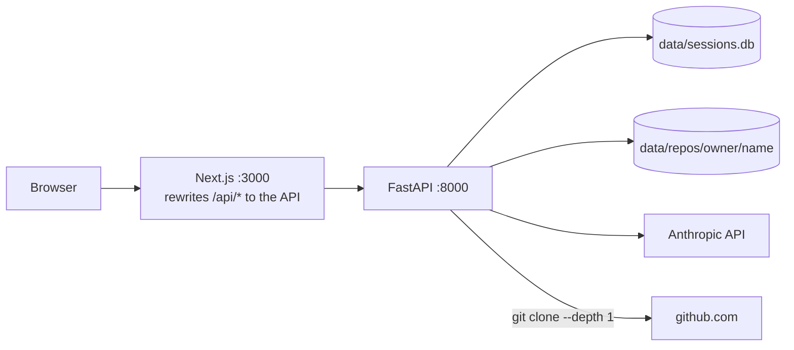
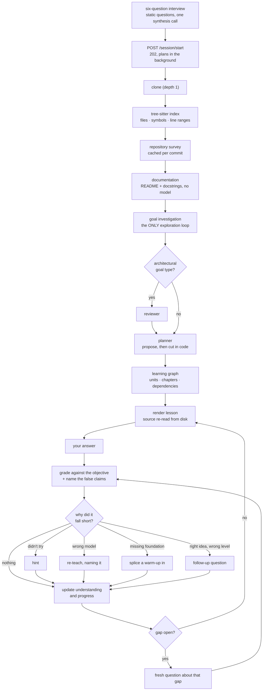

# CodeOnboard

**An adaptive, repository-aware learning system for unfamiliar codebases.** You
give it a public GitHub repository and say what you want to be able to do; it
reads the repository, plans a personalised route through it, and then teaches
that route one stop at a time — asking a question at each one, marking your
answer, naming what you got wrong, and reshaping the route around it.

### Tech stack

**Backend**

[](https://www.python.org/)
[](https://docs.astral.sh/uv/)
[](https://fastapi.tiangolo.com/)
[](https://docs.pydantic.dev/)
[](https://langchain-ai.github.io/langgraph/)
[](https://www.anthropic.com/claude)
[](https://tree-sitter.github.io/tree-sitter/)
[](https://www.sqlite.org/)

**Frontend**

[](https://nextjs.org/)
[](https://react.dev/)
[](https://www.typescriptlang.org/)
[](https://tailwindcss.com/)

**Testing**

[](https://docs.pytest.org/)
[](https://vitest.dev/)

---

## What problem this solves

A developer handed an unfamiliar codebase has three bad options. A README explains
the product rather than the code. A file-by-file tour teaches location rather than
structure. And asking a chat model produces fluent answers with no way to tell
which of them are true of *this* repository, and no record afterwards of what you
actually took in.

CodeOnboard is built against the third of those in particular. It is not a chat
interface with a repository attached, and it is not a static course generator. Two
properties are what make the difference:

**Everything it teaches is anchored in code that exists.** A model is never asked
for a line number. It names a file and a symbol; our code resolves that against a
deterministic tree-sitter index of the repository and derives the range. A citation
that cannot be resolved does not become a lesson. When a lesson is written, the
source is read again from disk — and if none of a unit's anchors can be read, the
lesson **fails** rather than being written from the objective alone, because a
model given only an objective will write a confident, fluent, entirely invented
explanation and nothing about the output will look wrong.

**It holds a model of what *you* have demonstrated, and it changes what happens
next.** The plan and the record of your understanding are the same object. When
an answer falls short, the system does not just score it: it names the specific
false claims the answer contained, decides from *why* it fell short what to do
about it, and either scaffolds, corrects, splices in a warm-up, or asks a
follow-up. Each of those false claims stays on the record until you clear it by
answering a **different** question about it.

---

## The ideas the system is built on

**Repository-aware learning.** Understanding is built in three layers: a
deterministic AST index of what exists (no model involved), a goal-agnostic survey
of what the repository *is* (cached per commit, shared by every user), and a
goal-specific **Dossier** produced by a budgeted exploration loop that reads the
code through six primitive tools. There is no retrieval layer, no embedding model
and no vector store — they were removed, and the measured comparison that
justified it is kept in [`project-archive/`](project-archive/README.md).

**A learning graph, not a checklist.** Each **unit** is one teachable claim
anchored to real code, carrying an **objective** — the claim you should be able to
make afterwards. Units are ordered by real dependencies and grouped into
**chapters**. The planner is told to enumerate everything worth learning and given
no target number; the *size* of the curriculum is then decided by code, not by a
prompt.

**Objectives are a contract.** The planner writes the objective, the teaching
agent is instructed to build exactly it, and the grader marks against **it** —
not against the model answer the teaching agent invented. Without that, the system
verifies you have reproduced the teacher rather than reached what was intended.

**Gaps.** A gap is *a claim you made that is false*, attached to the objective
clause it violates — not a topic, and not a score. One answer can contain several,
independently. Gaps have a lifecycle: `open`, `verified` or `waived`.

**Verification.** A gap is closed only by answering a **fresh question about that
gap** — a new scenario, shipping no answer of its own. Re-answering the lesson's
own question can never close one, because by then the explanation has been shown
and that would test recall. Silence never closes a gap either: the grader returns
a verdict per gap, and anything it does not vouch for stays open.

**Understanding is separate from what you decided.** What the evidence shows
(`strength` / `recovered` / `unresolved` / `insufficient`) and what you chose to do
about remediation (`waived`, `continued`, `skipped`, `asserted`) are two
independent facts. Pressing *I understand this* records an assertion; it never
becomes evidence.

**Adaptation during the session.** A confident misconception earns a re-teach that
names it. "I don't know" earns a hint, not a restructuring. A genuinely missing
foundation earns a warm-up spliced into the route. Sustained correct answers in a
chapter *shorten* the rest of it. All of that is a table in code — which response a
shortfall deserves is a rule worth stating and testing; what the response *says* is
a model's job.

**Progress is two numbers, and neither is `completed / total`.** *Goal readiness*
is demonstrated coverage of what the goal actually requires. *Journey progress* is
how much of the promised route you have dealt with. The invariant behind them:
**goal readiness may fall only when evidence about you changes — never because the
system changed the plan.**

**Multi-agent cooperation.** Eight agents, each owning one job and one prompt,
sharing one state object and never calling each other. Two of them use no model at
all.

---

## Architecture



| Part | Directory | Owns |
|---|---|---|
| **Frontend** | [`frontend/`](frontend/README.md) | Next.js App Router. Routing, rendering, and a derived view-model layer that turns the server's payload into what a surface shows |
| **API** | [`backend/api.py`](backend/README.md) | The HTTP surface, and the four-layer ownership boundary |
| **Account layer** | [`backend/auth/`](backend/auth/README.md) | Users, identities, cookie sessions, throttling, optional Google sign-in |
| **Orchestration** | [`backend/pipeline/`](backend/pipeline/README.md) | One compiled LangGraph `StateGraph`, and the `OnboardState` every agent reads and writes |
| **Agents** | [`backend/agents/`](backend/agents/README.md) | Goal · Documentation · Reviewer · Mentor (planner) · Briefing · Teaching · Grader · Mutator |
| **Repository understanding** | [`backend/repo/`](backend/repo/README.md) | Cloning, the tree-sitter index, the grounding oracle, the six tools, the exploration loop, the survey and the Dossier |
| **Learning model** | [`backend/learning/`](backend/learning/README.md) | The graph, gaps, understanding, progress, adaptation policy, retry dispatch, scope, reset — and the SQLite store |
| **Persistence** | `data/sessions.db` | One SQLite file: accounts, sessions, graphs, plan snapshots, dossiers, survey caches |
| **Model provider** | — | Anthropic. Sonnet for the two synthesis calls, Haiku for everything else including every loop |

The dependency rule that keeps this legible: **the learning engine knows nothing
about users.** `learning/`, `agents/` and `repo/` contain no reference to one.
`learning/store.py` is the single exception, because it *is* the ownership
boundary.

→ [Full system architecture](docs/architecture/overview.md)

---

## How it works at runtime

A session has a planning phase that runs once and a learning phase that runs for
as long as you keep coming back.



Every step above was exercised through the UI while writing this document. →
[Session lifecycle](docs/architecture/session-lifecycle.md) ·
[Adaptive learning](docs/architecture/learning-engine.md)

---

## Repository structure

```text
CodeOnboard/
├── backend/                  the Python application
│   ├── api.py                the HTTP surface: sessions, lessons, answers
│   ├── agents/               one directory per agent; each owns one job and one prompt
│   │   ├── goal/             the six-question interview → the goal object
│   │   ├── documentation/    README + docstrings (no model call)
│   │   ├── reviewer/         architectural review, for goal types that need one
│   │   ├── mentor/           the planner (two implementations) and the graph mutator
│   │   ├── briefing/         the welcome page's paragraph
│   │   ├── teaching/         one unit → the lesson, plus hint / re-teach / verify / reassess
│   │   └── grader/           an answer → a verdict and the false claims it contained
│   ├── repo/                 repository understanding
│   │   ├── parser.py         tree-sitter walk
│   │   ├── skeleton.py       the deterministic file/symbol/import index
│   │   ├── anchors.py        the grounding oracle: does this citation resolve?
│   │   ├── tools.py          the six exploration primitives
│   │   ├── explore.py        the budgeted loop over them
│   │   ├── survey.py         the goal-agnostic repository survey
│   │   └── investigation.py  the goal-specific Dossier
│   ├── learning/             the learning model — all pure, all testable without a key
│   │   ├── graph.py          the LearningGraph and its traversal
│   │   ├── gaps.py           the gap model and its lifecycle
│   │   ├── understanding.py  what the evidence shows vs. what the learner decided
│   │   ├── progress.py       the two measures, and the invariant behind them
│   │   ├── adaptation.py     which response a shortfall earns
│   │   ├── retry.py          which retry "Ask me again" offers
│   │   └── store.py          SQLite — and the ownership boundary
│   ├── pipeline/             LangGraph orchestration and the shared OnboardState
│   ├── auth/                 users, identities, cookie sessions, throttling, Google
│   └── migrations/           001_multi_user.py — idempotent, with a dry run
├── frontend/                 Next.js App Router
│   ├── app/                  routes: /login /signup /sessions /new /session/[id]
│   ├── components/           rendering, one directory per surface
│   └── lib/                  the API client, and the derived view-model layer
├── tests/                    the backend suite (1801 passing)
├── scripts/                  measurement harnesses and admin tools
├── docs/                     architecture, configuration, testing, and planning history
├── project-archive/          the superseded vector-RAG design, kept as history
└── data/                     gitignored: sessions.db and cloned repositories
```

Each of `backend/`, its five sub-packages, `frontend/`, `tests/` and `scripts/`
has its own README.

---

## Setup from a fresh clone

### Prerequisites

| | Version | Check with |
|---|---|---|
| Python | 3.11+ | `python --version` |
| [uv](https://docs.astral.sh/uv/) | any recent | `uv --version` |
| Node.js | 18.18+ | `node --version` |
| git | any | `git --version` |

`git` must be on your `PATH`: the backend shells out to it to clone the repository
you want to learn.

You also need an **Anthropic API key** from
[console.anthropic.com](https://console.anthropic.com/), with a little credit on
it. See [What it costs](#what-it-costs).

### Install

```bash
git clone https://github.com/talziv2/CodeOnboard.git
```

```bash
cd CodeOnboard && uv sync
```

```bash
cp .env.example .env
```

```bash
cd frontend && npm install && cd ..
```

`uv sync` creates `.venv` and installs from `uv.lock`. `.python-version` pins
3.11, so uv will fetch it if your default is something else.

### Configure

Open `.env` and paste your key:

```
ANTHROPIC_API_KEY=sk-ant-...
```

Leave `CODEONBOARD_COOKIE_SECURE=0` as it comes. It is already set in
`.env.example`, and it is what lets you stay signed in over `http://localhost` —
the default is `1` (https-only cookies), which is right for a deployment and wrong
here.

Everything else in `.env.example` is commented out and optional. **You do not need
a GitHub token, a Google client, or a secret key to run this.**

→ [Full configuration reference](docs/configuration.md)

### The database

**There is no database step.** On first use the app creates `data/sessions.db`
itself, with an empty schema. Nothing is seeded, and the one migration
(`backend/migrations/001_multi_user.py`) exists for databases that predate
accounts — a fresh installation never needs it.

To reset an installation to brand new: stop both servers, delete
`data/sessions.db`, and start again.

Cloned repositories land in `data/repos/<owner>/<name>/` and are re-cloned on
demand; both paths are gitignored.

---

## Running the application

Two terminals, both from the repository root. **Both must be running**, and the
backend should be up first — the frontend proxies to it, and a UI whose every call
fails is harder to read than a backend that is simply not there yet.

**Terminal 1 — backend**, on `http://localhost:8000`:

```bash
uv run uvicorn backend.api:app --reload
```

**Terminal 2 — frontend**, on `http://localhost:3000`:

```bash
cd frontend && npm run dev
```

Then open **<http://localhost:3000>**.

That is the only URL you need. The frontend proxies `/api/*` through to the
backend, so port 8000 is there for `curl` and for the generated API reference at
<http://localhost:8000/docs> — the browser never calls it directly.

On Windows, `run-dev.bat` opens both in their own windows. It is a convenience
that runs exactly these two commands, not a separate supported path.

### Check that it works

1. `curl http://localhost:8000/health` → `{"status":"ok"}`
2. Open <http://localhost:3000>. You should land on **Sign in**.
3. **An empty dashboard with no error on it is the success signal.**

---

## First-run walkthrough

1. **Create an account.** Any email address works — nothing is sent and nothing is
   verified; the address is just how the app recognises you next time. There is no
   "Sign in with Google" button unless you configured one, and that is expected.
2. **Start a new session** and paste a public GitHub repository.
   `https://github.com/psf/requests` is a good first one. The URL is validated
   before you answer anything.
3. **Answer six short questions** — how familiar you are, why you are here, what
   you want to be able to do, how deep to go, what you already know, and what you
   are most curious about. A review step then shows your answers back and lets you
   reopen any one of them. Nothing starts until you confirm.
4. **Wait while it reads the repository.** This is where it first calls Claude and
   first clones. It takes **two to four minutes**, and a live panel shows which
   stage it is in and which files the investigation is reading. You can close the
   tab: planning continues in the background and the session appears on your
   dashboard.
5. **Read the welcome page** — what this repository is, written for your profile,
   and the route it has planned: stops, grouped into chapters, with the optional
   ones called out.
6. **Work through a stop.** The **Lesson** tab holds what to read; the
   **Understanding** tab holds the question. Answer it in your own words.
7. **Watch what happens when you are wrong.** Answer something confidently
   incorrect on purpose. You should get a verdict that names the misconception, a
   ledger of the specific false claims your answer contained, and — for a confident
   wrong model — a lesson rewritten to address it, flagged with *"Lesson has
   changed since you last looked"*.
8. **Clear a gap.** *Check me on this* asks a genuinely **different** question
   about that one belief, with no answer attached. Answering it correctly marks the
   gap resolved — and the stop is still *not* counted as demonstrated, because that
   is judged on the objective, not on the check. The UI says so.
9. **Answer the objective again.** *Ask me again* gives you a fresh question about
   the objective itself. Get it right and the stop reads **Worked through** and
   goal readiness moves.
10. **Look at the route.** The **Map** shows where you are and how the journey is
    shaped; **Analysis** shows the two measures, what the evidence supports, and a
    log of everything that changed.
11. **Adjust it.** *Make it shorter* moves recommended stops to optional — and goal
    readiness does **not** move, because the plan changing is not evidence about
    you. *Start over* restores the original route instantly, with none of your work,
    and tells you exactly what it discarded.

---

## Tests and validation

```bash
uv run pytest tests/
```

```bash
cd frontend && npm test
```

```bash
cd frontend && npm run build
```

`npm run build` is also the frontend's type check. There is no linter and no
separate typecheck script; the backend has no configured formatter or type checker.

**On a fresh clone both suites are green**, with several backend tests skipped —
they need a cloned fixture repository or an existing `data/sessions.db`, and a gate
that silently passes on an empty set is worse than one that says it did not run.

**Once you have used the app**, one test starts running and **fails**:

```
tests/test_gap_understanding.py::test_every_stored_gap_free_node_derives_its_stored_state
AssertionError: no gap-free nodes to check
```

It is a development gate that re-checks stored sessions against the current model,
and it predates user accounts: it looks sessions up under a fixed test user, so the
ones belonging to your real account are invisible to it and it concludes there was
nothing to check. **It is a defect in that gate, not a problem with your
installation.** To run everything else:

```bash
uv run pytest tests/ --deselect "tests/test_gap_understanding.py::test_every_stored_gap_free_node_derives_its_stored_state"
```

→ [Testing architecture](docs/testing.md), including the measurement harnesses in
`scripts/` that exercise the system against live models.

---

## What it costs

You are using your own API key, so this is worth knowing before you click.
Planning a session is the expensive part; lessons and grading use Haiku, and the
planner is the one Sonnet call. `CLAUDE.md` states a target of under $0.10 per
run; measurement puts a real session materially above that, and the gap is tracked
openly in
[`docs/planning/phases/cost-optimization.md`](docs/planning/phases/cost-optimization.md)
rather than quietly restated.

`uv run python scripts/measure_cost.py --dry-run` shows what would be measured
without spending anything.

---

## Troubleshooting

| What you see | Why | Fix |
|---|---|---|
| Backend exits with `Refusing to start: ANTHROPIC_API_KEY is not set` | No `.env`, or the key line is still empty | `cp .env.example .env` and paste your key |
| `sh: next: command not found` | Frontend dependencies not installed | `cd frontend && npm install` |
| The UI loads but every action fails | The backend is not running, or is on a different port | Start it; if it is not on 8000, set `API_ORIGIN` in the frontend's environment |
| You sign in and are immediately signed out | `CODEONBOARD_COOKIE_SECURE` is `1` over http, and your browser rejects `Secure` cookies on localhost | Set it to `0` in `.env` |
| Every call fails with an opaque "Failed to fetch" | You opened `127.0.0.1:3000` instead of `localhost:3000`, or vice versa — different **origins** to a browser | Use `http://localhost:3000`, or add yours to `CODEONBOARD_ALLOWED_ORIGINS` |
| `Port 3000 is in use` | Something else has it | `npm run dev -- --port 3100` |
| `"That repository doesn't exist, or it's private"` | Only public `github.com` repositories are accepted, and the allow-list is applied before any outbound request | Use a public GitHub URL |
| Planning sits at *Investigating your goal* for minutes | Normal. The investigation has a 12-minute wall-clock ceiling and composes a large report at the end | Wait, or close the tab — it finishes in the background |
| A session card is stuck on `generating` | The process died mid-plan | Restart the backend; a startup sweep marks stale rows `failed` |
| `POST /session/start` → `409 generation_already_running` | One plan at a time, per learner | Wait for the one in flight |
| `Start over` → `409 no_plan_snapshot` | The session predates the plan tables (schema v2) | Expected. It loads and resumes; it genuinely has no plan to restore, and nothing is invented |
| Two dev servers serving each other's chunks | They share `.next` | Set `NEXT_DIST_DIR` for the second one |
| No "Sign in with Google" button | Google is not configured | Expected, and fine — email sign-in is the normal path |

---

## Documentation

→ **[docs/README.md](docs/README.md)** is the documentation index.

The fastest route in: [system architecture](docs/architecture/overview.md), then
[adaptive learning](docs/architecture/learning-engine.md) for the ideas the
product is built on, then [architectural decisions](docs/architecture/decisions.md)
for the invariants a change could break quietly.

`CLAUDE.md` holds the project conventions and the rules an agent working in this
repository must follow.

---

## Status and scope

This is a final-year CS project and a working prototype. It is **self-hosted and
local-first**: the backend, the frontend and the database all run on your own
machine, and it calls Claude with your own API key. Nothing is hosted and nothing
phones home except the Anthropic API and the `git clone` of whichever public
repository you ask it to teach you.

**Python only, structurally.** The grammar, the qualified-name rule, import
resolution and public-API detection are all Python-specific. Adding a language
means a sibling adapter, not a rewrite — the design is written down in
[`docs/planning/phases/multi-language.md`](docs/planning/phases/multi-language.md)
and has **not** been built.

Deliberately not built: email verification, teams or sharing, audio or video
narration, an editor extension, and any deployment path. The roadmap that names
them is [`docs/planning/phases/roadmap.md`](docs/planning/phases/roadmap.md).

---

## License

[MIT](LICENSE) — © 2026 Shira Zakov and Tal Ziv.
