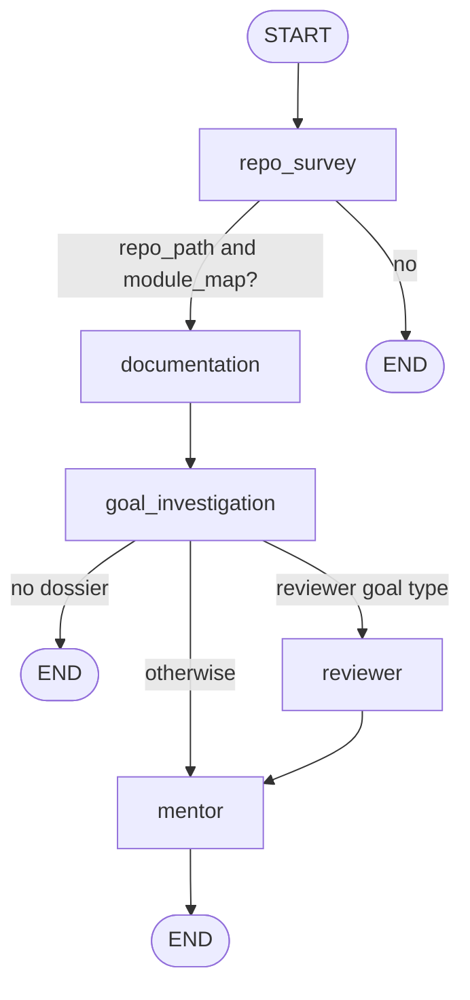
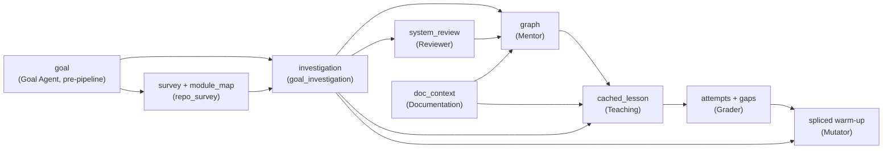

# Multi-agent architecture

> What each agent is, what it receives, what it returns, and how they cooperate
> without ever calling each other.
>
> Parent: [overview.md](overview.md) · Index: [docs/README.md](../README.md)

---

## 1. What "agent" means here

An agent is a Python module that owns **one job and one prompt**, and follows the
same four conventions everywhere in `backend/agents/`:

1. **The Anthropic client is injected.** No agent constructs one from the
   environment when a caller supplied one; this is what makes every agent
   testable with a stub.
2. **No agent raises at its caller.** Failures append a string to
   `OnboardState.errors` and leave the field they would have written as `None`.
3. **No agent calls another agent.** They share `OnboardState`
   (`backend/pipeline/state.py`) and nothing else.
4. **Code decides policy, the model writes prose.** Where a rule can be stated
   and tested — curriculum size, which response a shortfall earns, whether a gap
   blocks, which *form* a question takes — it is a pure function in Python. The
   model supplies judgement and language.

Two members of the roster call no model at all. That is deliberate: "agent" here
names a responsibility in the pipeline, not the presence of an LLM call.

---

## 2. The roster

| Agent | Module | Model | Runs | Reads | Writes |
|---|---|---|---|---|---|
| **Goal** | `agents/goal/` | Haiku ×1 (synthesis only) | Before the pipeline, as a multi-turn HTTP dialogue | The learner's answers to six static questions | The goal object — the single source of truth for everything downstream |
| **Documentation** | `agents/documentation/` | **none** | Pipeline node 2 | The checkout: README, module and symbol docstrings, `docs/` files | `state.doc_context` |
| **Reviewer** | `agents/reviewer/` | Haiku ×1 | Pipeline node 4, **conditionally** | The module map + the Dossier rendered as chunks | `state.system_review` — strengths, risks, extension points, test gaps, boundaries |
| **Mentor / Planner** | `agents/mentor/` | Sonnet ×1 | Pipeline node 5 | The Dossier (+ the review, when there is one) | `state.graph` — the `LearningGraph`; `state.learning_path`; `state.confidence`; `state.plan_report` |
| **Briefing** | `agents/briefing/` | Haiku ×1 | Lazily, on the first `GET /session/{id}/welcome` | The Layer B survey, the README, the learner's profile | The welcome paragraph, cached on the session |
| **Teaching** | `agents/teaching/` | Haiku ×1 (+≤1 retry) | On the first visit to a unit | The unit's objective, the anchored source **read at lesson time**, the Dossier slice or structural neighbourhood, `doc_context`, the learner profile | The lesson, cached on the node |
| **Grader** | `agents/grader/` | Haiku ×1 | On every answer | The objective, the question, the reference answer, the learner's text | A classification, a rationale, and the named false claims |
| **Mutator** | `agents/mentor/mutator.py` | Sonnet ×1 | When a graded answer earns a structural change | The diagnosed gap + candidate evidence from the Dossier, then the Skeleton | A warm-up node spliced into the graph |

Three more model calls sit in `agents/teaching/` and are lesson-writing rather
than lesson-planning: `respond.py` (hint / re-teach / follow-up), `verify.py`
(a fresh question aimed at one gap) and `reassess.py` (a fresh question aimed at
the objective). `agents/grader/verification.py` grades the first of those.

### Model policy

`claude-sonnet-4-6` is used in exactly two places — the **planner**
(`mentor/curriculum.py`) and the **Mutator** (`mentor/mutator.py`) — because
both are one-shot synthesis over a large body of evidence. Everything else,
including every loop, is `claude-haiku-4-5`. The exploration loop
(`repo/explore.py`) is Haiku for that reason and states it in the module.

---

## 3. Orchestration

The Goal Agent is deliberately **not** a pipeline node: it is a multi-turn HTTP
dialogue that finishes before `run_pipeline` is called, so by the time the graph
is invoked the goal is finalized input.

Defined in `backend/pipeline/graph.py`; entered through
`backend/pipeline/runner.run_pipeline(repo_url, goal, client, progress_id)`.

Two conditional edges, and both of them **end the run rather than degrade it**:

- **No skeleton, no onboarding.** If the clone or the tree-sitter index fails,
  the run ends. A graph whose anchors could not be verified is worse than no
  graph.
- **No dossier, no plan.** If the investigation produced nothing, the Mentor is
  never reached. Fabricating a curriculum from the module map is precisely the
  behaviour the architecture migration removed.

The Layer B survey is *not* in that category: a survey-less run still carries a
skeleton-derived `module_map` and continues.

`_reviewer_should_run(goal)` gates the Reviewer to two goal types —
`improve_existing_system` and `understand_architecture` — because those are the
goals that turn on architectural judgement. For every other goal type
`state.system_review` stays `None` and the Mentor behaves exactly as it does
without one.

---

## 4. How information moves

Every arrow below is a field on `OnboardState`. There are no other channels.

`doc_context` is carried **on the persisted graph** as well as on the state,
because interactive requests reconstruct `OnboardState` from the database rather
than from a pipeline run — Teaching would otherwise lose it the moment the
process restarted.

---

## 5. Where each decision is made

The recurring pattern is: *the model observes, our code decides.*

| Decision | Owner | Why not the other way |
|---|---|---|
| `goal_type` follow-up routing | code (`GOAL_TYPE_MAP`) | The interview must not drift between runs |
| `code_depth` → `depth` | code (`_DEPTH_BY_CODE_DEPTH`) | `depth` used to be invented by Haiku from answers that never mentioned it, and it decided how much got taught |
| Which objectives exist | model | Enumeration is what a model is good at |
| How many survive | code (`curriculum.select`) | Asking a model to self-limit is not the same task as asking it to enumerate |
| Whether an anchor is real | code (`anchors.resolve`) | The model names a `file` + `symbol`; our code derives the range, so a hallucinated range is structurally impossible |
| Which question *form* a unit gets | code (`teaching.lesson_form`) | Derived from the unit's `kind`; a menu of seven forms invites blending |
| How far an answer fell short | model (Grader) | A judgement about prose |
| What the shortfall earns | code (`adaptation.decide_all`) | A rule worth stating and testing |
| Whether a gap blocks `understood` | code (`Gap.is_blocking`) | A pure function of `kind`; the model never votes |
| What a hint *says* | model | Judgement, and language |
| Which retry is offered | code (`retry.offer`) | It used to be four flags in the frontend, and every defect was a seam between them |

---

## 6. Failure and fallback behaviour

| Failure | What happens |
|---|---|
| Clone or skeleton fails | The run ends at `repo_survey`; `POST /session/start`'s background task marks the row `failed` |
| Layer B survey fails or exhausts its budget | `state.survey = None`, an error is recorded, the investigation runs from the skeleton alone |
| Investigation exhausts its budget | A **partial** dossier with `accepted: false` and an honest `stop_reason`. Downstream confidence reflects it. No dossier at all ends the run |
| Reviewer fails | `system_review` stays `None`; the Mentor proceeds unchanged |
| Mentor fails or produces no graph | The session row is marked `failed` and the dashboard says so, rather than spinning |
| Teaching fails | A minimal fallback lesson is returned so the session is not blocked — and it is deliberately **not** recorded into the plan snapshot, so a transient outage cannot be sealed into `Start over` forever |
| **All** of a unit's anchors fail to load at lesson time | Teaching **fails the lesson** rather than rendering one. With no source the model has only the objective, and it will write a fluent, confident, entirely ungrounded lesson from it |
| Grader fails to parse | Falls back to `partial` with a fixed rationale, and records `graded: false` — so a system outage is distinguishable from a learner's answer forever after, and is excluded from evidence |
| Mutator declines to insert | A supported outcome, distinct from a failure, and the reason is recorded on the attempt |

---

## 7. Tests

| Area | Files |
|---|---|
| Goal dialogue and synthesis | `tests/test_goal_agent.py`, `tests/test_goal_api.py` |
| Documentation | `tests/test_documentation_agent.py` |
| Reviewer | `tests/test_reviewer_agent.py` |
| Planner | `tests/test_curriculum_planner.py`, `tests/test_curriculum.py`, `tests/test_dossier_rendering.py` |
| Briefing | `tests/test_briefing.py` |
| Teaching | `tests/test_teaching_agent.py`, `tests/test_teaching_forms.py` |
| Grader | `tests/test_grader_agent.py`, `tests/test_grader_gaps.py` |
| Mutator | `tests/test_mutator.py`, `tests/test_prerequisite_diagnosis.py` |
| Orchestration | `tests/test_explorer_pipeline.py`, `tests/test_pipeline_progress.py` |

See [testing.md](../testing.md) for how to run them.
