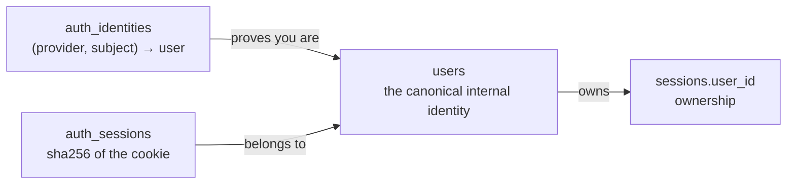

# Authentication and the multi-user model

> Who a caller is, which sessions they may touch, and where that is decided.
>
> Parent: [overview.md](overview.md) · Index: [docs/README.md](../README.md) ·
> Implementation: [`backend/auth/`](../../backend/auth/README.md)

---

## 1. The shape



`users` is the thing a learning session points at. `auth_identities` is how a
human proves they *are* that user: one row per `(provider, subject)`. Password and
Google are two rows; a third provider is a third row and no migration.

The flat alternative — `users.password_hash`, `users.google_sub` — is smaller
today and makes every later provider a schema change plus a new branch in every
login path.

### Nothing about a learner is inferred from an email

`users.email` is **contact and display only**. The authentication key is
`auth_identities.(provider, subject)`, which is what keeps a changed email address
from breaking a Google login. And since no email verification ships, `email` is an
**unverified claim** — nothing may treat it as proof.

---

## 2. Sessions are cookies in a table, not JWTs

| | |
|---|---|
| Cookie | `co_session`, `HttpOnly`, `SameSite=Lax`, `Path=/`, `Secure` unless `CODEONBOARD_COOKIE_SECURE=0` |
| Value | 32 bytes from `secrets.token_urlsafe` |
| Stored | **Only the SHA-256.** A dump of `auth_sessions` is not a set of live credentials |
| Idle expiry | 14 days, slid on use (`TOUCH_INTERVAL` = 1 hour, so a read is not a write) |
| Absolute expiry | 90 days |

The argument for JWT is stateless horizontal scale. This is one uvicorn process
against one SQLite file, so that buys nothing, and staying opaque buys four things
it does not: **logout actually logs out** (a row is deleted, rather than needing a
denylist — which is a session table with extra steps); no signing key to manage,
rotate or accidentally commit; no refresh-token dance, since sliding expiry does
the same job in one column; and "sign out everywhere" and "your other devices"
become queries rather than features.

SHA-256 rather than Argon2 here is deliberate: the token is 256 random bits, not a
human-chosen secret, so there is no dictionary to slow down and nothing to gain
from a work factor that would then run on **every** authenticated request.

**The cookie is the only credential.** There is no `Authorization: Bearer`
fallback — two ways in means two code paths to keep correct, and a header the
browser can read is a header XSS can steal, which is the property `HttpOnly`
exists to have.

---

## 3. Passwords

Argon2id via `argon2-cffi` — the one part of authentication that must never be
hand-rolled. Minimum length **10 characters**; length beats punctuation, and a
small list of common passwords is refused. Hashes are **rehashed on login** when
the parameters have moved.

The miss path performs a **dummy verify** against a fixed hash, so "no such
account" and "wrong password" take the same time and the endpoint is not a user
enumeration oracle.

### Throttling: two keys, not one

`POST /auth/login` and `POST /auth/register` are throttled **per-IP and
per-account**:

| | |
|---|---|
| Free attempts | 5 |
| Penalty | exponential from 2s, capped at 900s |
| Window | 3600s |

Per-IP alone lets an attacker with a botnet spread attempts across addresses and
never trip it. Per-account alone lets one address walk a list of accounts, one
attempt each, forever. Locking on the account is itself a denial of service
against that account, which is why both exist rather than either alone.

The store is a bounded in-process dict, which is the right shape *here* and was
the wrong shape for the goal interview: this holds only "how many recent
failures", it is reconstructible (a restart forgives outstanding failures, and
forgiving is the safe direction for a lockout), and eviction prefers expired
entries so a flood cannot push out a live counter.

`CODEONBOARD_TRUST_PROXY` decides whether `X-Forwarded-For` is honoured. Leave it
unset unless a reverse proxy actually sets it — a header the client controls is
otherwise a throttle bypass, since an attacker would simply vary it.

---

## 4. Password reset — what it is and is not

**Nothing sends mail.** A reset flow has to authenticate the *request* somehow,
and this system verifies no email address.

What exists is narrower and honest about its scope: the token lifecycle is real —
32 random bytes, only the SHA-256 stored, 30-minute TTL, single-use, revoking every
session on success — and the delivery step is replaced by handing the link back to
the caller **in development only**.

`config.reveals_reset_link()` is `False` in production, where returning the link
would make `POST /auth/forgot` an account-takeover API for anybody able to type an
email address. The endpoint still answers there; it simply reveals nothing and
mails nothing. That is a deliberate degradation, not a fix.

`scripts/set_password.py` remains the only recovery path safe to expose outside a
laptop.

---

## 5. Google sign-in (optional)

Authorization-code flow with PKCE, via **Authlib**, which validates the ID token's
signature against Google's published keys plus `iss`, `aud`, `exp` and the `nonce`
we sent. Every one of those is a way the flow fails silently if hand-rolled — "decode
the JWT and trust the email" is the single commonest OAuth mistake. We never accept
a token from the client; the browser carries a one-time **code** and the exchange
is server-to-server.

**The identity key is `sub`, never the email.** Google emails can change; `sub`
cannot. Keying on the email would mean a person who changes their Google address
becomes a different user and loses their sessions — or, worse, inherits somebody
else's.

**Linking needs a password too.** Google login for an address that already has a
password account does *not* simply link, because with no email verification of our
own that rule is an account takeover: an attacker registers a password account as
`victim@gmail.com` (nothing verifies they own it), the victim later clicks
"Continue with Google", and the two are joined. So `POST /auth/google/link`
requires the account's password as well as Google's word.

Unconfigured is a **first-class state**: the button is hidden, and
`GET /auth/google/start` redirects (303) to `/login?error=google_not_configured`.
It used to answer `503 {"detail": "google_not_configured"}`, which put a raw JSON
object on a blank tab in front of a learner — the status was right and the medium
was wrong, because that route is only ever a full browser navigation.

Half-configured is refused at startup in production: a client id with no secret
produces a sign-in button that always fails, which reads to a learner as the
product being broken rather than the deployment being incomplete.

---

## 6. Ownership

**Ownership is decided at the persistence boundary, not in the routes.**

```python
store.load_graph(session_id, user_id, db_path)   # user_id is REQUIRED
```

There is no code path that produces a `LearningGraph` without a caller having
named whose it is. `Depends(owned_session)` is the ergonomic wrapper over it.

Four layers, because forgetting is the failure mode — the persistence signature,
the dependency, a coverage test that fails the build on a route declaring neither,
and a middleware that refuses anything not on a stated allow-list. See
[backend-api.md](backend-api.md) §2.

**404, never 403.** A foreign session and a nonexistent one answer identically,
byte for byte; a 403 confirms which ids are real. Verified live during this audit.

**Creation always creates.** `_try_resume` used to match on `(repo_url, goal)`
across the whole database and hand back somebody else's session. A learner may
hold many sessions on one repository; resuming means opening one you own, by id.

**The learning engine knows nothing about users.** `backend/learning/`,
`backend/agents/` and `backend/repo/` contain no reference to a user;
`learning/store.py` is the single exception, because it *is* the boundary. The
planner even mints its own session id, which `_generate_session` reconciles with
the reserved row — keeping the engine ignorant of the account layer.

---

## 7. Configuration refusals

`backend/auth/config.py` refuses to start rather than warning, because every value
it checks has a safe default for development and **no** safe default in
production, and the difference is not something a log line survives.

| Condition | Where | Effect |
|---|---|---|
| `ANTHROPIC_API_KEY` unset | everywhere | Refuses to start |
| `CODEONBOARD_COOKIE_SECURE=0` | production only | Refuses to start — session cookies would travel in clear |
| `CODEONBOARD_SECRET_KEY` unset | production only | Refuses to start — the OAuth `state` cookie would be signed with a key that changes on every restart |
| `CODEONBOARD_ALLOWED_ORIGINS` still contains a localhost origin | production only | Refuses to start |
| Google half-configured | production only | Refuses to start |

"Production" is decided by `CODEONBOARD_ENV`, explicitly, rather than inferred
from a hostname or a debug flag — every inference there has a failure mode where
the guess is wrong in the unsafe direction, and the whole point is to be wrong
safely.

The returned list is a list rather than a raise-on-first, so a deployment missing
three things learns that in one run instead of three restarts.

See [configuration.md](../configuration.md) for the full reference.

---

## 8. What is deliberately not built

- **No email verification**, and therefore no self-service reset in production.
- **No teams, roles or sharing.** Ownership is one user per session.
- **No CSRF token.** The app is same-origin behind the Next rewrite, the cookie is
  `SameSite=Lax`, and every mutating route is a `POST`/`PATCH`/`DELETE` with a JSON
  body — so there is no cross-site case to exploit.
- **No account deletion endpoint.**

---

## 9. Tests

`tests/test_auth.py`, `tests/test_ownership.py`, `tests/test_google_oauth.py`,
`tests/test_password_reset.py`, `tests/test_route_authz_coverage.py`,
`tests/test_security.py`, `tests/test_cors.py`, `tests/test_migration.py`.

`tests/test_auth.py` and `tests/test_ownership.py` opt out of the signed-in-by-
default fixture with `pytestmark = pytest.mark.real_auth`, because they exercise
authentication itself.

`scripts/smoke_multiuser.py` covers what `TestClient` cannot: a real HTTP server,
a real cookie jar, two genuinely isolated accounts, and a session that outlives
the process that made it. It refuses to run against `data/sessions.db`.
