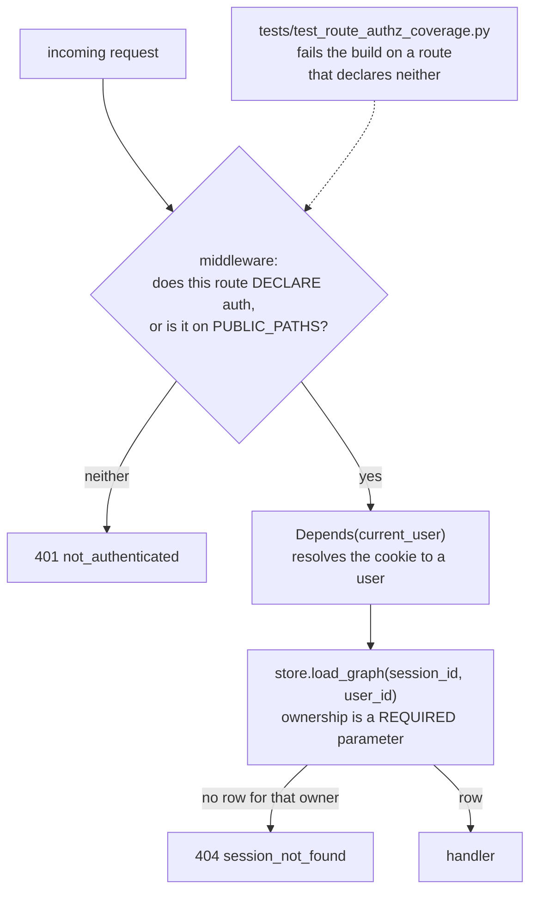
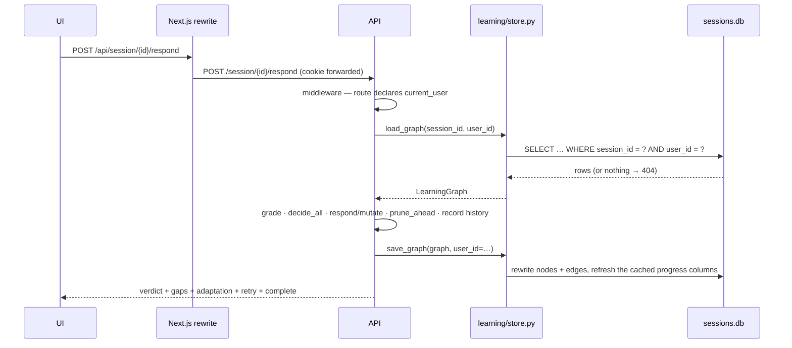

# Backend and API architecture

> Entry points, the endpoint surface grouped by purpose, the auth boundary, and
> how a request reaches persistence.
>
> Parent: [overview.md](overview.md) · Index: [docs/README.md](../README.md) ·
> Implementation: [`backend/`](../../backend/README.md)
>
> This is **not** an endpoint-by-endpoint reference. FastAPI generates one from
> the code at <http://localhost:8000/docs>; this document covers the architecture
> and the semantics that a schema cannot express.

---

## 1. Entry points

| Entry point | What it is |
|---|---|
| `backend.api:app` | The ASGI application. `uv run uvicorn backend.api:app --reload` |
| `backend.pipeline.runner.run_pipeline(...)` | The planning pipeline, callable without HTTP — this is what the measurement scripts drive |
| `python -m backend.migrations.001_multi_user` | The one migration, idempotent, with a dry-run mode |

`backend/api.py` is a single module rather than a router package. Everything in
it is HTTP concern — routing, status codes, request parsing, orchestration of
already-written pieces. Authentication is the exception and lives in its own
router (`backend/auth/routes.py`, `google_routes.py`), because it is a
self-contained surface with its own throttling and cookie handling.

### Startup

The lifespan handler runs two things **before the process serves anything**, in
this order:

1. `auth_config.enforce()` — configuration before the database. A deployment with
   an insecure setting should not get as far as touching data. Missing
   `ANTHROPIC_API_KEY` is a refusal to start everywhere; in production, insecure
   cookies, a missing signing key, a leftover localhost origin and half-configured
   Google are all refusals too.
2. `run_startup_checks(db_path)` — creates both halves of the schema, refuses to
   start if any session has no owner (that session would be unreachable forever,
   and the person who notices is a learner whose work has vanished), quietly
   deletes orphaned dossiers, and fails sessions left `generating` by a process
   that died.

---

## 2. The four layers of the authorization boundary

Forgetting is the failure mode, so there are four independent layers:

- **The persistence boundary is the real one.** `store.load_graph` takes the owner
  as a required parameter, so there is no code path that produces a
  `LearningGraph` without a caller having named whose it is.
- **The middleware is an allow-list, not a deny-list.** A deny-list of protected
  paths fails open — forget an entry and it is public. This fails closed: a new
  path is refused until somebody names it in `PUBLIC_PATHS`, in a diff a reviewer
  sees. `PUBLIC_PATHS` is `/openapi.json`, `/docs`, `/docs/oauth2-redirect`,
  `/redoc`, `/health`.
- It checks what a route **declares**, not whether a cookie is present. A second
  cookie check would duplicate the dependency and could only guess where the
  dependency resolves properly.
- `OPTIONS` is exempt: a CORS preflight carries no credential by definition, and
  401-ing it makes the browser report the real request as an opaque CORS failure.
- An **unmatched** path falls through to the router, which answers 404. Refusing
  it in the middleware would turn "no such endpoint" into "not authenticated".

**404, never 403.** A foreign session and a nonexistent one answer identically,
byte for byte; a 403 would confirm which ids are real. Verified live: an
unauthenticated request answers 401, a nonexistent id answers 404, and another
user's real id answers 404.

Two response middlewares run on everything: `X-Content-Type-Options: nosniff`,
`X-Frame-Options: DENY`, `Referrer-Policy: no-referrer`. A CSP is deliberately
**not** set here — this serves an API, its pages come from Next, and a CSP
declared in two places is one that disagrees with itself.

---

## 3. The endpoint surface, grouped by purpose

Everything except the five public paths requires the session cookie.

### Accounts

| | |
|---|---|
| `POST /auth/register` → 201 | Creates the user and the password identity, sets the cookie |
| `POST /auth/login` → 200 | Throttled per-IP **and** per-account |
| `POST /auth/logout` → 204 | Deletes the row. Logout actually logs out |
| `POST /auth/logout/all` → 204 | "Sign out everywhere" is a query, not a feature |
| `GET /auth/me` → 200 / 401 | The client's entire authentication model |
| `POST /auth/forgot` · `POST /auth/reset` | Development-only link delivery — see [auth.md](auth.md) |
| `GET /auth/google/start` · `GET /auth/google/callback` | Unconfigured redirects (303) to `/login?error=google_not_configured` |
| `POST /auth/google/link` | Linking needs the account's **password** as well as Google's word |
| `GET /auth/providers` · `GET /auth/identities` · `DELETE /auth/identities/google` | Which providers exist, and which this user has linked |

### Starting a session

| | |
|---|---|
| `POST /repo/check` | Validates and reaches the repository **before** six questions are answered. The allow-list is applied here, before any outbound request |
| `POST /goal/start` · `POST /goal/answer` · `POST /goal/back` | The interview, persisted in `session_drafts` |
| `POST /session/start` → **202** | Reserves the row, returns the id immediately, plans in the background |
| `GET /session/progress/{progress_id}` | Polled on a *separate* request while the POST is in flight. 404 means "no news" |

### The dashboard

| | |
|---|---|
| `GET /sessions` | The **caller's** sessions, newest first, with cached headline numbers |
| `GET /sessions/{id}` | One dashboard row |
| `PATCH /sessions/{id}` | Rename · archive |
| `DELETE /sessions/{id}` → 204 | Cascades to nodes, edges, plan tables and the dossier |

### Learning

| | |
|---|---|
| `GET /session/{id}` | The whole graph, with progress and the understanding profile |
| `GET /session/{id}/welcome` | The briefing. Written on first call, cached on the session |
| `GET /session/{id}/lesson` | Renders the current unit if needed; returns the lesson, the **retry offer** and any **pending** question |
| `POST /session/{id}/respond` | The one grading endpoint. `kind` selects which question is being answered: `assessment` (default), `verification`, `reassessment` |
| `POST /session/{id}/verify` | A fresh question aimed at one gap. Optional `gap_id` lets the learner name an exhausted one |
| `POST /session/{id}/reassess` | A fresh question aimed at the objective |
| `POST /session/{id}/waive` | Stop being asked about one gap, or all of them |
| `POST /session/{id}/advance` | `next` or `skip`. Steps over `optional` units; clears `arrival` |
| `POST /session/{id}/retry` | Learner-requested warm-up |
| `POST /session/{id}/jump` | Move to any stop. `intent`: `study` raises an arrival notice, `resume` clears one |
| `POST /session/{id}/scope` | `shorter` or `deeper` |
| `POST /session/{id}/override` | `mark_understood` · `mark_weak` · `skip` |
| `POST /session/{id}/reset` | Restore the plan. 409 `no_plan_snapshot` where there is none |
| `GET /session/{id}/evidence/{node_id}` | The full evidence chain for one unit — its own endpoint because the timeline carries full answer text and superseded lesson bodies |
| `GET /session/{id}/file?path=` | Source for the code pane. Containment decided by `resolve_within`, which compares path **ancestry**, and the resolved path is the one opened |

### Legacy

`POST /onboard` runs the pipeline synchronously and returns the flat Phase-1
`learning_path`. **The frontend never calls it**; only measurement scripts do.

---

## 4. Three semantics worth knowing

**One grading endpoint, three question kinds.** A re-assessment answer is graded
as an **ordinary assessment** — it is an answer to the objective, so it moves
`understanding_state` exactly as the first attempt did. It is a distinct request
`kind` only so the endpoint knows which pending question is being answered and can
record the right `question_source`. A verification answer is different in kind: it
is evidence about named beliefs, so it never touches `classification` or
`understanding_state`.

**The question is captured before anything can replace it.** A `reteach` later in
the same request assigns `node.cached_lesson` wholesale, so reading the prompt
after grading would file every re-taught answer against the question that replaced
the one it answered.

**The frontend renders learning decisions; it does not compute them.** The retry
offer, the reason there is none, whether the objective is met, and every progress
number all arrive from the server. The one stated exception is "have I looked at
Lesson since it changed" — not a fact about understanding, and not observable
server-side.

---

## 5. A representative interaction

---

## 6. Error conventions

| Status | Used for |
|---|---|
| 401 `not_authenticated` | No valid cookie, or a route that declares no auth |
| 401 with its own message | A *refused credential*, not a lost session: `Email or password is incorrect.` from `/auth/login` and the Google link step, `invalid_reset_token` from `/auth/reset`. `send()` in `frontend/lib/api.ts` splits the two on `detail` — only `not_authenticated` reaches the app's single 401 handler, so a rejected password no longer renders as "Your session has ended." |
| 404 `session_not_found` / `node_not_found` | Not yours, or not there — indistinguishable on purpose |
| 409 | The request is well-formed and the session's *state* refuses it: `session_has_no_current_node`, `no_lesson_rendered_yet`, `no_pending_reassessment`, `no_plan_snapshot`, `generation_already_running` |
| 400 | A bad value in a well-formed body: an unsupported signal, direction, action or intent |
| 422 | FastAPI's own request-validation failure |

FastAPI puts the useful part in `detail`; the frontend's `errorText` maps the
slugs to readable sentences in `frontend/lib/strings.ts`.

---

## 7. Tests

`tests/test_session_api.py`, `tests/test_sessions_api.py`,
`tests/test_goal_api.py`, `tests/test_gap_api.py`,
`tests/test_adaptation_api.py`, `tests/test_route_authz_coverage.py`,
`tests/test_ownership.py`, `tests/test_security.py`, `tests/test_cors.py`,
`tests/test_first_run.py`, `tests/test_env_precedence.py`.

`tests/test_route_authz_coverage.py` is the one that fails the build when a new
route declares neither an auth dependency nor membership of `PUBLIC_PATHS`.
