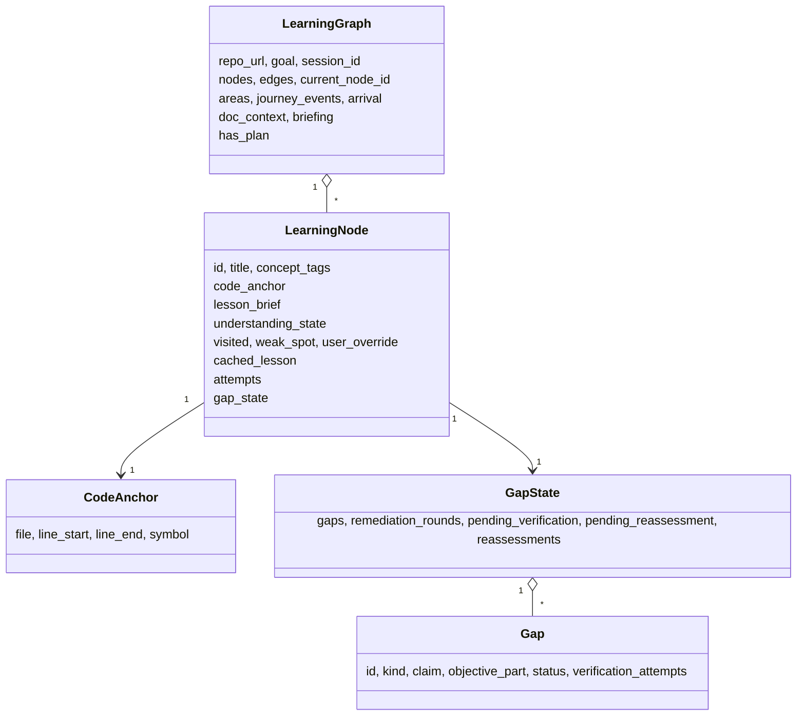
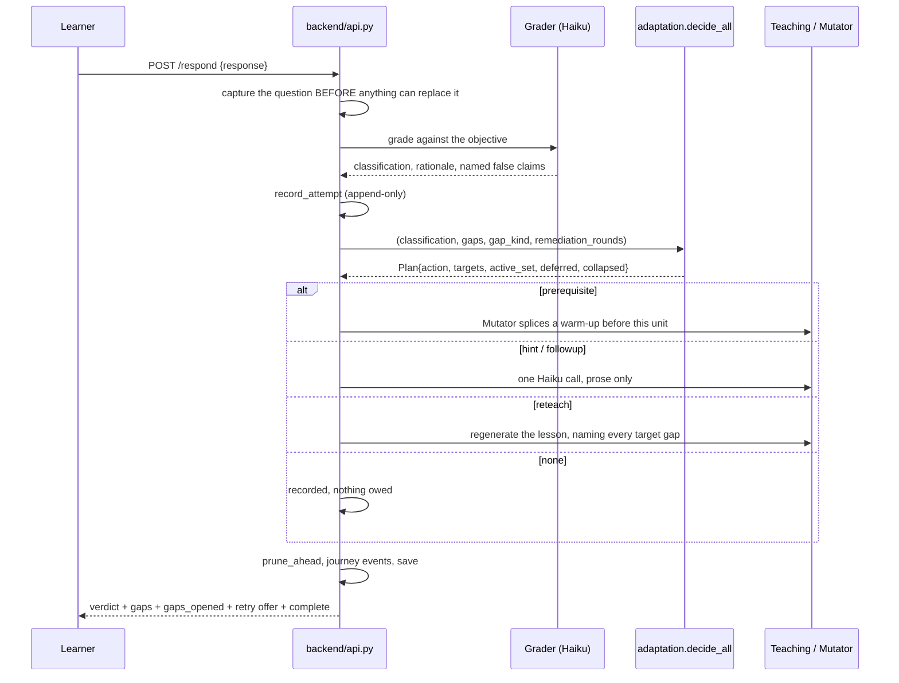
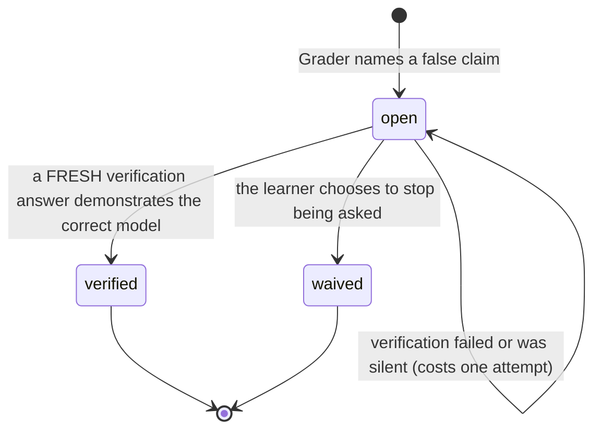

# Adaptive learning architecture

> The learning graph, what the learner has demonstrated, gaps and their
> lifecycle, and how the next step is chosen.
>
> Parent: [overview.md](overview.md) · Index: [docs/README.md](../README.md) ·
> Implementation: [`backend/learning/`](../../backend/learning/README.md)

---

## 1. Vocabulary

Read this before anything else; several of these words mean something narrower
here than in ordinary use.

| Term | Meaning |
|---|---|
| **Learning unit / node** | One teachable claim, anchored to real code. The atom of the graph |
| **Objective** | The claim the learner should be able to make afterwards. The **contract** between the Planner, Teaching and the Grader |
| **Area / chapter** | One level of grouping over units. Metadata on the session, not an entity — units point at one by `lesson_brief["area_id"]` |
| **Journey / walk** | The promised sequence of stops: planned, non-optional units |
| **Required set** | The planner's `required` units plus their dependency closure. "The goal is not met without this" |
| **Gap** | One *false claim the learner made*, attached to the objective clause it violates. Not a topic and not a score |
| **Verification** | A fresh question aimed at one named gap. The only thing that can close one |
| **Re-assessment** | A fresh question aimed at the objective |
| **Detour / warm-up** | A remedial unit spliced in after a shortfall. Excluded from both progress measures |
| **Settled** | The learner has *dealt with* a stop. Used in two strengths — see §6 |

---

## 2. The graph

`backend/learning/graph.py` defines the shape; it is pure data with in-place
mutation, no IO and no model calls.

**Edge kinds**: `sequence` (the planned order the learner walks), `prerequisite`
("B cannot be understood before A"), `deeper` (an opt-in side detour, deliberately
*not* part of the walk).

### Two producers of `prerequisite`, and why consumers must tell them apart

| Producer | Meaning | Structural tell |
|---|---|---|
| **Planned** — the objective-first planner emits one per `depends_on`, so a normal graph carries dozens | The dependency structure of the curriculum | The unit sits on the chain and **keeps an outgoing sequence edge** |
| **Remedial** — the Mutator splices a warm-up in after a wrong answer | An event in one learner's session | `insert_before` reroutes the incoming sequence edge onto the new node, so a warm-up has **no outgoing sequence edge** |

A consumer that treats every prerequisite edge as remedial reports a planned
curriculum as a sequence of failures — which is exactly what happened to the
route rail, where a planned graph rendered with nearly every stop captioned
"added after confusion". `progress.remedial_ids` is the one place that
distinction is computed.

**A unit is grounded by one *or more* verified anchors.** A flow crossing three
files is anchored on all three. `nodes.file` / `line_start` / `line_end` hold a
*derived display projection*; `lesson_brief["anchors"]` is the semantic truth,
and the invariant — asserted in tests — is that the display columns always equal
one member of `anchors`.

---

## 3. Planning: propose, then cut

The planner (`backend/agents/mentor/curriculum.py`) splits one job across two
owners:

- **Propose** — the model, once. It reads the Dossier and enumerates everything
  worth learning for this goal, each with a `kind`, a `priority`, its
  `depends_on` and its evidence. It is given **no target number** and
  deliberately over-generates.
- **Cut** — our code, deterministically, in `select()`:
  1. **The required set is the floor.** Every `required` objective plus its
     dependency closure stays required, whatever any number says.
  2. **Area coverage is a breadth obligation.** Every declared area contributes
     at least one non-optional unit.
  3. **The band is a guard**, not a target. Anything beyond it is demoted to
     `optional` — never dropped.

| `code_depth` | Guard band |
|---|---|
| `map` | 5–18 |
| `working` | 8–22 |
| `implementation` | 10–28 |

Every sizing rule is a pure function, so it is unit-testable without an API key —
that is the point, not a side effect. `state.plan_report` records the cut the
planner made (proposed / grounded / core size / journey size / whether the band
bound), because *"the curriculum genuinely needs N"* and *"the band allowed N"*
are different facts.

`optional` means **excluded from the default walk, not removed**: `/advance`
steps over it, `resume_point()` skips it, the stop counter and readiness exclude
it, and the rail collapses it — but it stays in the graph and in `path_order()`,
and teaches and grades normally when reached from the rail. A unit with **no**
`priority` at all is *not* optional and stays on the walk.

**This is the only planner.** `CODEONBOARD_CURRICULUM=0` used to select a pre-B3
planner in `mentor/dossier.py` that planned nodes directly and emitted no areas,
priorities or `depends_on`; the flag and that planner have both been removed.
`mentor/dossier.py` remains, holding the dossier rendering both planners always
shared. Graphs planned before the change still load — the fields this planner
adds were always optional keys — and a node with no `priority` is treated as
non-optional, which is what makes those graphs walk correctly.

---

## 4. What a learner meets at one unit

Teaching (`backend/agents/teaching/agent.py`) expands a unit into a lesson with
these parts: `setup` (prose to read **before** answering), `prompt` (the
question), `reveal` (the explanation, withheld until an answer is committed),
`why_now`, `takeaway`, `ownership` (what to hold yourself here versus what could
safely be delegated to an assistant), and `expected_answer` — a **calibration
reference for the Grader, not the marking standard.**

The **form** of the question is chosen by our code from the unit's `kind`, never
by the model:

| Unit `kind` | Question form |
|---|---|
| `architecture` | `compare` — what belongs here, and what deliberately does not |
| `flow` | `predict-next` — where does control go, and why |
| `component` | `predict-then-reveal` |
| `risk` | `critique` — here is a plausible change, what is wrong with it |
| `extension_point` | `locate` — where would you add X, and what must it provide |
| `synthesis` | `explain-back` |
| `test_coverage` | `predict-then-reveal` |
| anything else | `predict-then-reveal` (the fallback) |

The model is shown only the chosen form's brief; a menu invites blending.

---

## 5. The answer loop

### The response policy

`backend/learning/adaptation.py` owns the decision and nothing else. It is a
table, not a model call: *which* response a shortfall deserves is a rule worth
stating and testing; what that response *says* is judgement and belongs to a
model.

| `gap_kind` | Action | Why |
|---|---|---|
| `no_attempt` | `hint` | They did not try. A prerequisite answers a question they never asked |
| `wrong_model` | `reteach` | A confident misconception. The misconception must be **named**; re-teaching the same lesson unchanged would leave them to make the same inference twice |
| `missing_prerequisite` | `prerequisite` | The one case that earns a structural change |
| `right_idea_wrong_altitude` | `followup` | One clarifying exchange. Restructuring a journey over a framing slip is an overreaction |
| none named, `confused` | `prerequisite` | Pre-gap-model behaviour, preserved |
| none named, `off-topic` | `none` | Evidence of neither understanding nor misunderstanding, and must not reshape a path |
| `understood` | `none` | — |

**A named `gap_kind` outranks the coarse classification.** The two are not
competing verdicts: `classification` says how far the answer fell short and
`gap_kind` says why.

Three rules govern several gaps at once (`decide_all`): **precedence decides the
response** (foundational first — remediating a higher-altitude gap while a
foundation is missing lands on nothing); **one mutation, many corrections** (a
`prerequisite` targets exactly one gap; a `reteach` or `followup` targets every
active gap of that kind); and **overflow collapses** (more than
`ACTIVE_SET_MAX = 3` blocking gaps open is itself one signal — the unit did not
land — so the answer is a single full re-teach rather than a queue of warm-ups).

### Adapting upward

`prune_ahead` is the only mechanism that **shortens** a journey. Two consecutive
`understood` units in one area demote that area's remaining `recommended` units
to `optional`. It never touches `required`, never touches a unit the learner has
visited, answered or overridden, and never touches one the learner moved by hand
(`scope_locked`) — user decisions always win.

---

## 6. Gaps

A gap is *a claim the learner made that is false*, attached to the objective
clause it violates. It exists because one answer can contain several independent
misconceptions, and everything downstream used to carry exactly one.

Two rules are enforced at construction, because they are properties of a gap
rather than decisions about one:

1. **`no_attempt` and `none` never become gaps.** Silence is not a misconception,
   and a blocking gap earned by "I don't know" would be unclosable. `Gap.create`
   raises rather than dropping quietly.
2. **`blocking` is a pure function of `kind`.** The model never votes.
   `missing_prerequisite` and `wrong_model` block; `right_idea_wrong_altitude`
   does not; an **unknown** kind does not, because the conservative direction is
   to let the learner progress.

**Identity is ours.** `Gap.create` mints the id; a model is only ever shown ids
and asked to reference them, which is what keeps one misconception one gap across
re-grades.

**Silence never closes a gap.** The verification grader returns a verdict *per
gap*, keyed by an id we supplied; anything it does not vouch for stays open by
default rather than by inference.

### Caps bound the system, not the learner

| Cap | Value | What reaching it does |
|---|---|---|
| `VERIFICATION_ATTEMPT_CAP` | 2 | The gap leaves the **active set** — the system stops proposing for it. It stays `open` and stays blocking |
| `REMEDIATION_ROUND_CAP` | 4 | The node stops being offered help. Its gaps are still reported as `deferred` |
| `REASSESSMENT_CAP` | 2 | No more fresh objective-scoped questions. Spent on **issue**, not on answer |

Reaching a cap writes nothing to a gap — not `verified`, not `waived`. A cap that
silently closed a gap would be the system marking its own homework because it ran
out of ideas. A learner who names an exhausted gap themselves (`POST /verify
{gap_id}` from the ledger) still gets a question: asking is a different act from
being nagged.

### Gaps are not a data-collection side-channel

Recording a misconception **changes what happens next**. The Grader derives the
scalar `gap_kind` from the gaps it found, and that scalar is what
`adaptation.decide()` reads — so the gap list is upstream of the intervention,
not a log beside it.

This was `CODEONBOARD_GAPS`, default off, and the sentence above is why turning
it on was never "start collecting data": the same answer could earn a different
response either side of the flag. The flag has been removed and gap recording is
unconditional.

**A flag gates behaviour; it never gates storage** (D19). Gap payloads were
always written and read unconditionally, so nothing about stored gaps changed
when the flag went away — and `backend/learning/store.py` still reads no
environment at all, because `CODEONBOARD_TUTOR` needs the same guarantee.

---

## 7. What the learner has demonstrated

Two dimensions, deliberately not one (`backend/learning/understanding.py`):

| Dimension | Question | Values |
|---|---|---|
| **Understanding** | What does the **evidence** demonstrate? | `strength` · `recovered` · `unresolved` · `insufficient` |
| **Disposition** | What did the **learner decide** about remediation? | `active` · `continued` · `waived` · `skipped` · `asserted` |

`recovered` — fell short at least once, then demonstrated it — is not a weakness,
and is the whole reason the distinction exists: `weak_spot` is sticky, so before
this the UI captioned recovered units as current weaknesses forever.

**The single owner of "is this node understood" is `graph.understanding_of()`.**
It combines the latest recorded assessment with the gaps, and enforces the
consequential rule:

> A node cannot be `understood` while a blocking gap is unverified, even when the
> most recent answer was graded `understood`.

`verified` is the only status that permits `understood` — not merely "not open".
A `waived` gap is a *decision* rather than evidence, so it keeps the node off
`understood` exactly as an open one does. What waiving buys is that the system
stops asking.

### A learner decision is never evidence of understanding

Every surface that blurred this has been closed:

- `Move on anyway` writes `user_override = "continue"` and never touches
  `understanding_state`.
- `mark_understood` records an **assertion** (`disposition: asserted`) and never
  writes `understood`; settlement comes from `SETTLING_OVERRIDES` instead. Before
  this, pressing it on a node whose only answer was graded `confused` turned that
  node into a *strength* and moved goal readiness from 0% to 100% on a button
  press.
- `mark_weak` is the deliberate asymmetry: agreeing with a shortfall can only
  *lower* the claim being made about the learner, so it still writes state and
  leaves the disposition `active`.

The condition for recording "I moved on" is **an unmet objective plus at least
one assessment** — presence is not a decision, so a refresh or a scroll-past
records nothing.

---

## 8. Progress — two measures, and neither is `completed / total`

`backend/learning/progress.py` owns both.

| Measure | Definition | Denominator |
|---|---|---|
| **Goal readiness** (the headline; wire key `readiness`) | Demonstrated coverage of the required set | All `required` units, assessed or not |
| **Journey progress** | How much of the promised walk has been dealt with | Planned, non-optional units |
| **Evidence coverage** | How much of the journey carries real evidence | Reported *beside* the headline, never folded into it |

`partial` earns **nothing** toward goal readiness — it previously earned 0.5,
which was an unjustified constant. `recovered` counts in full: the measure is what
the learner can demonstrate now, not whether they managed it first time.

**The invariant this module exists to hold:**

> Goal readiness may fall **only** when evidence about the learner changes. It
> must **never** fall because the system changed the plan.

That is why remedial nodes are excluded from both sides of the fraction. Before
it, inserting a warm-up dropped the gauge from 0.50 to 0.33 — the system's
decision to help looked like the learner losing ground. `tests/test_progress.py`
pins every mutation against this rule, and it was confirmed live during this
audit: `Make it shorter` moved the journey from 12 stops to 11 and left goal
readiness at 9%.

Remedial work is not hidden — it is reported as its own `detours` list, which
says more than a silent bump in a percentage would.

### Completion is not mastery

`is_complete()` asks whether the learner has **dealt with** the whole promised
journey — `understood`, or carrying an explicit override. It can be true while
readiness sits below 100%, and that is the intended final state:
*"Journey complete — verified understanding 92%, 1 gap waived."*

Note that `graph.is_settled` (strict: `understood` or an explicit override) and
`progress.is_settled` (weaker: visited, answered, or acted on) answer **different
questions** and both are needed. Plain `visited` is deliberately not enough for
the strict one — intent must be recorded, never inferred.

---

## 9. Choosing what happens next

### Where to resume

`resume_point()` returns, in order: the first non-optional unit with **open
blocking gaps** that the learner has not explicitly moved past; otherwise the
first unvisited non-optional unit whose prerequisites are all *settled*;
otherwise the saved `current_node_id`.

The exception is the whole anti-stranding guarantee: a node the learner
explicitly `continue`d or waived is skipped, because otherwise "I'll come back to
this" would send them straight back on every return, forever.

### Which retry is offered

`backend/learning/retry.py` decides, and the frontend renders it. **The learner
sees one action — *Ask me again*** — and which mechanism serves it is never
surfaced.

The rule that shapes the whole module:

> **A retry question never ships its own answer.**

`cached_lesson.prompt` always does: Teaching's contract for `reveal` is *"the
explanation — now you may answer it"*, and the panel opens the reveal after **any**
graded answer, `off-topic` included. A re-teach does not escape it either, since
it regenerates the lesson and its new prompt arrives with a new `reveal`. So the
unit's own prompt is answerable **exactly once**, and every later assessment comes
from `/verify` or `/reassess`, both of which ship a question and nothing else.

| Order | Outcome | Meaning |
|---|---|---|
| 1 | `already_asked` | A question is already on screen |
| 2 | `objective_met` | Nothing to retry — not a refusal |
| 3 | `not_applicable` | Never taught, or nothing to assess |
| 4 | `answer` | The first attempt (not a retry) |
| 5 | `verify` | A gap outranks the objective: it is a sharper target, and the only thing that can produce `verified` |
| 6 | `reassess` | The objective, while budget remains |
| — | `budget_spent` | Both budgets exhausted. The caps end the offering, never the obligation |

---

## 10. Adjusting the journey

| Control | Endpoint | Effect |
|---|---|---|
| **Make it shorter** | `POST /scope {shorter}` | Demotes `recommended` → `optional`. **Never** `required` |
| **Go deeper** | `POST /scope {deeper}` | Promotes `optional` → `recommended`. Exposes material the planner already produced; never generates more, and says so when there is nothing left |
| **Jump** | `POST /jump` | Unconditional — no stop is ever locked. Records a `journey_events` entry and an `arrival` fact for the notice on the stop landed on |
| **Skip** | `POST /advance {skip}` | Marks the node skipped and advances |
| **Waive** | `POST /waive` | Stop being asked about one gap, or all of them |
| **Move on anyway** | `POST /advance {next}` | Records `continue` where the objective is unmet and there was an attempt |
| **Start over** | `POST /reset` | Restores the plan snapshot. See [session-lifecycle.md](session-lifecycle.md) |

Scope control is **not a second planner**: nothing there proposes, grounds,
orders or invents a unit. It moves existing units between buckets the planner
already assigned, and marks them `scope_locked` so adaptation cannot silently
undo the learner's decision.

---

## 11. Tests

`tests/test_learning_graph.py`, `tests/test_progress.py`,
`tests/test_understanding.py`, `tests/test_gap_model.py`,
`tests/test_gap_adaptation.py`, `tests/test_gap_verification.py`,
`tests/test_gap_understanding.py`, `tests/test_gap_remediation.py`,
`tests/test_gap_remediation_rounds.py`, `tests/test_adaptation.py`,
`tests/test_adaptation_api.py`, `tests/test_retry_dispatch.py`,
`tests/test_scope.py`, `tests/test_decision_is_not_evidence.py`,
`tests/test_history.py`, `tests/test_patterns.py`, `tests/test_gap_insight.py`,
`tests/test_question_traceability.py`, `tests/test_attempt_history.py`.

Every module named in this document is pure — no IO, no model calls — which is
precisely what lets the whole policy be tested without an API key.
