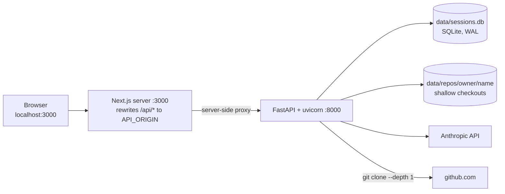
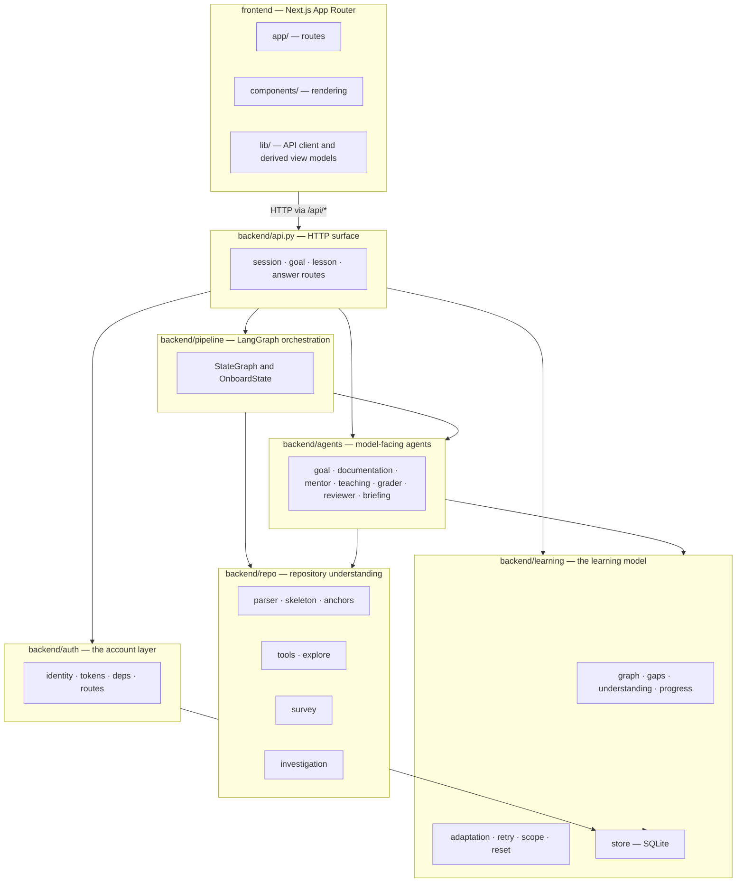
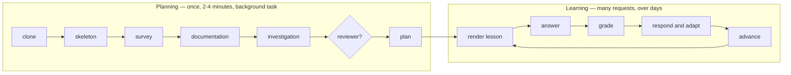

# System architecture

> Deeper than the [root README](../../README.md), narrower than the per-area
> documents it links to. Read this to understand **what the pieces are, where the
> boundaries run, and which way the dependencies point**. Read the linked
> documents for the mechanics of any one piece.
>
> Documentation index: [docs/README.md](../README.md)

---

## 1. What the system is, in one paragraph

CodeOnboard takes a public GitHub repository and a learner's stated goal, reads
the repository with a bounded exploration loop, plans a dependency-ordered
curriculum of **learning units** each anchored to a real file and line range, and
then teaches those units one at a time — asking a question at each stop, grading
the answer, naming the specific false beliefs the answer revealed, and reshaping
the journey in response. All of it persists in one SQLite file, scoped to the
account that created it.

What makes it more than a tour generator is that the plan and the record of what
the learner has demonstrated are **the same object**: a `LearningGraph`. Planning
writes it, teaching reads it, grading mutates it, progress is derived from it.

---

## 2. Process topology

Two processes and one file. Nothing is hosted, and the only outbound traffic is
to the Anthropic API and to `github.com`.

Three consequences of that shape are load-bearing rather than incidental:

- **The browser never talks to `:8000`.** `frontend/next.config.ts` rewrites
  `/api/:path*` to `API_ORIGIN`, so the auth cookie is first-party and CORS is
  not load-bearing for the app's own requests. Port 8000 stays reachable directly
  for `curl`, for `/docs`, and for the smoke scripts.
- **`API_ORIGIN` is read by the Next server per request**, not baked into the
  browser bundle. It replaced a `NEXT_PUBLIC_API_URL` that published the API's
  address at build time.
- **One SQLite file holds everything** — accounts, sessions, graphs, plan
  snapshots, dossiers and survey caches — because a foreign key cannot cross
  files. The account tables live in a different *module*
  (`backend/auth/schema.py`) from the learning tables
  (`backend/learning/store.py`) even though they share the file.

---

## 3. Subsystems and dependency direction

The rules that keep this legible:

| Rule | Where it holds |
|---|---|
| **The learning engine knows nothing about users.** `learning/`, `agents/` and `repo/` contain no reference to a user. `learning/store.py` is the single exception, because it is the ownership boundary. | `store.load_graph(session_id, user_id, …)` takes the owner as a **required** parameter, so no code path produces a graph without a caller naming whose it is |
| **Agents never explore.** Exactly one exploration loop runs per session, at plan time. Teaching, the Mentor, the Reviewer and the Mutator read what it produced. | `backend/repo/investigation.py`, reached only from the `goal_investigation` pipeline node |
| **Agents communicate only through `OnboardState`.** No agent calls another. | `backend/pipeline/state.py` |
| **Policy is code; prose is a model.** Which response a shortfall earns, how large a curriculum is, whether a gap blocks — all pure functions. What a hint *says* is generated. | `learning/adaptation.py`, `learning/retry.py`, `agents/mentor/curriculum.py` |
| **Grounding is against the repository**, never against the evidence a model was shown. | `backend/repo/anchors.py` |

---

## 4. The two halves of a session

A session has a **planning phase** that runs once and a **learning phase** that
runs for as long as the learner keeps coming back.

Planning is described in [session-lifecycle.md](session-lifecycle.md) and
[repository-understanding.md](repository-understanding.md); the learning loop in
[learning-engine.md](learning-engine.md).

---

## 5. External integrations

| Integration | Where | Used for | Failure behaviour |
|---|---|---|---|
| **Anthropic API** | every agent, injected as an `anthropic.Anthropic` client | Planning (Sonnet), everything else (Haiku) | The process **refuses to start** without `ANTHROPIC_API_KEY`. A per-call failure appends to `OnboardState.errors`; no agent raises at its caller |
| **`git`** (subprocess, via GitPython) | `backend/repo/cloner.py` | `git ls-remote` to validate, `git clone --depth 1` to check out | A scheme and host allow-list refuses anything but a public `github.com` URL **before** the outbound request, which is what stops `POST /repo/check` being a server-side request forgery primitive |
| **Google OIDC** (Authlib) | `backend/auth/google.py` | Optional sign-in provider | Unconfigured means the button is hidden and `/auth/google/start` answers `503` — absent rather than half-working |

There is **no retrieval layer, no embedding model and no vector store.** They
were removed outright rather than flagged off; the migration record is in
[`project-archive/rag-migration/`](../../project-archive/rag-migration/).

---

## 6. Where to read next

| Question | Document |
|---|---|
| What agents exist, and what does each receive and return? | [agents.md](agents.md) |
| How does the system come to understand the repository? | [repository-understanding.md](repository-understanding.md) |
| What is a learning graph, a gap, a verification? | [learning-engine.md](learning-engine.md) |
| What happens between "start" and "complete"? | [session-lifecycle.md](session-lifecycle.md) |
| What are the endpoints, and what do they mean? | [backend-api.md](backend-api.md) |
| How is the UI structured? | [frontend.md](frontend.md) |
| What is on disk? | [persistence.md](persistence.md) |
| Who owns a session? | [auth.md](auth.md) |
| Which decisions must not be broken by accident? | [decisions.md](decisions.md) |
