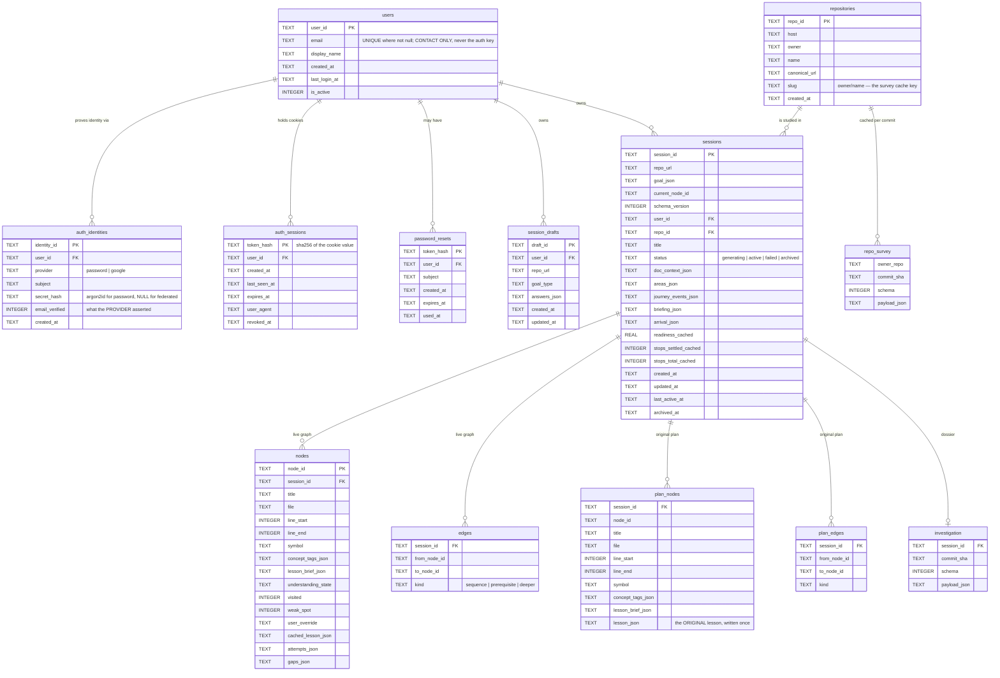

# Persistence and data model

> One SQLite file, and the boundary that runs through the middle of it.
>
> Parent: [overview.md](overview.md) · Index: [docs/README.md](../README.md) ·
> Implementation: `backend/learning/store.py`, `backend/auth/schema.py`

---

## 1. What is on disk

| Path | Contents | Tracked in git? |
|---|---|---|
| `data/sessions.db` | **Everything**: accounts, sessions, learning graphs, plan snapshots, dossiers, survey caches | No — gitignored, created on first use |
| `data/sessions.db-wal` · `-shm` | SQLite's WAL sidecars | No |
| `data/repos/<owner>/<name>/` | Shallow checkouts of the repositories being taught | No |

One file because a foreign key cannot cross files. There is **no database setup
step**: the schema is created on startup and is idempotent. To reset an
installation to brand new, stop both servers and delete `data/sessions.db`.

Connections run with WAL journaling and `BUSY_TIMEOUT_MS = 5000`, chosen against
what actually contends here — `save_graph` rewrites one session's nodes and edges,
which is milliseconds at these sizes.

---

## 2. The entity model



---

## 3. The boundary through the middle of the file

The account tables are declared in `backend/auth/schema.py` and the learning
tables in `backend/learning/store.py` — same file on disk, different modules.

The one place the two genuinely meet is `sessions.user_id` / `sessions.repo_id`,
and those are columns on a table the learning store already owns, added through
its own additive mechanism rather than from the account layer.

Two indexes on `sessions` are nonetheless declared in `auth/schema.py`, because
they exist to serve queries *that* layer makes — "my sessions, newest first"
(`idx_sessions_user`) and "my sessions on this repository"
(`idx_sessions_user_repo`) — and would be unexplainable sitting next to the
graph's own index.

**Repositories are not owned.** A `repositories` row is a canonical identity for a
public artifact. Two users studying `psf/requests` share the row, the checkout on
disk and the goal-agnostic survey; they share nothing else. Ownership lives on the
session.

---

## 4. Plan versus state — the partition that makes `Start over` possible

`nodes` / `edges` are the **live** graph, and learning mutates them freely.
`plan_nodes` / `plan_edges` are what the planner produced, before the learner
touched it.

**The contract, and it is the whole of it:**

> `save_graph` **never** writes a plan table. The only writers are
> `create_session` — once, in the same transaction as the session itself — and
> `record_plan_lesson`, which is physically unable to overwrite.

Two further properties are deliberate:

- **The plan tables' column list *is* the plan/state partition.** It is not a
  frozenset in a test file, because the boundary should be readable in `.schema`
  by someone who has never seen a design document. Reading the two `CREATE`
  statements side by side is the fastest way to see what this system considers
  plan and what it considers state.
- Their primary key is `(session_id, node_id)`, not the live table's global
  `(node_id)`. That global key is why a plan cannot yet be copied into a second
  session; it is deliberately not repeated here.

---

## 5. Schema versioning

```
SCHEMA_VERSION            = 3     what a new session is WRITTEN at
SUPPORTED_SCHEMA_VERSIONS = {2,3} what this build can READ
```

Those are two different questions, and separating them is the whole of the rule.

`load_graph` treats a version mismatch as **missing** — it returns `None` rather
than migrating — so a bump makes every earlier session invisible. Version 3 added
the plan tables, and strict equality made all 90 sessions in the development
database (the manual-E2E corpus behind `docs/planning/phases/evidence/`)
unloadable.

The resolution keeps both features whole:

- a version-2 session **loads and resumes**, with its state exactly as it is;
- `Start over` is **unavailable** for it, because it genuinely has no plan;
- **nothing is ever synthesised** from a v2 session's current state.

That last line is the one worth being emphatic about: a plan reconstructed from a
half-walked graph is not the plan — it is wherever the learner had got to,
relabelled. Absent is honest; fabricated is not.

`load_plan` keeps a **strict** `== SCHEMA_VERSION` check, so "v2 loads but cannot
be reset" is true by two independent routes. The cost is named in the code: at the
next bump, a version-3 session with a real plan silently stops being resettable,
and whoever moves the version to 4 must revisit that check.

### Additive columns instead of a version bump

Everything that could be added without moving the version, was. `_ADDITIVE_COLUMNS`
lists fourteen nullable columns applied by `_add_missing_columns` on every
`init_db`.

It **asks first** (`PRAGMA table_info`) rather than trying and swallowing, and
then tolerates exactly one error message — `duplicate column name`, which means
another writer already did this. The blanket `except Exception` it replaced also
swallowed `database is locked`, which became reachable the moment the file had a
second concurrent writer: the column was silently skipped, `init_db` reported
success, and the very next `save_graph` failed on a column that did not exist.

### Cached progress columns

`readiness_cached`, `stops_settled_cached` and `stops_total_cached` are a **cache
of `progress.summary()`**, not a second definition of it — written from
`summary()` itself. The dashboard lists every session at once, and loading each
graph to compute three numbers would mean reading hundreds of node rows to render
a list.

---

## 6. Where each thing lives

| Concept | Storage | Notes |
|---|---|---|
| Learning graph | `nodes` + `edges` + `sessions` | Rewritten wholesale on every `save_graph` |
| Attempts | `nodes.attempts_json` | Append-only; a re-answer adds to the record |
| Gaps + remediation counters + pending questions | `nodes.gaps_json` | Written **unconditionally**; `store.py` reads no feature flag at all (D19) |
| Areas, journey events, briefing, arrival | `sessions.*_json` | Session-scoped, so they get columns rather than living on a node |
| Objective, kind, priority, area_id, anchors, origin, `scope_locked` | inside `nodes.lesson_brief_json` | No column, because nothing queries by them |
| Rendered lesson | `nodes.cached_lesson_json` | A revisit is free; a re-teach replaces it |
| Original lesson | `plan_nodes.lesson_json` | Written once, on the success path only |
| Dossier | `investigation` | Keyed `(session_id, commit_sha, schema)` |
| Survey | `repo_survey` | Keyed `(owner/repo, commit_sha, schema)` — shared across users |

The rule behind the fourth and fifth rows: a value that is only ever *read as part
of the record* goes into JSON that already exists; a value that belongs to the
session rather than to any one unit earns a column.

---

## 7. Migrations

There is one: `backend/migrations/001_multi_user.py`.

```bash
uv run python -m backend.migrations.001_multi_user            # dry run
```

It creates the account tables, backfills `repositories` from the URLs already in
`sessions`, creates the inert legacy user, assigns every existing session to it,
and derives the display metadata the dashboard needs. **`SCHEMA_VERSION` does not
move** — every column it adds is additive and nullable.

Every step is `IF NOT EXISTS`, a lookup-then-insert, or an `UPDATE … WHERE column
IS NULL`, so a second run reports zero changes. That matters more than it sounds:
the first run of a migration is the one most likely to be interrupted, and "run it
again" has to be the correct response.

**A fresh installation never needs it.** `run_startup_checks` creates both halves
of the schema before anything reads either.

Two development-only helpers live in `scripts/`:
`adopt_legacy_sessions.py` (move the pre-accounts sessions onto a real account)
and `migrate_repo_layout.py` (move checkouts from `data/repos/<name>` to
`data/repos/<owner>/<name>`).

---

## 8. Tests

`tests/test_learning_store.py`, `tests/test_plan_snapshot.py`,
`tests/test_session_reset.py`, `tests/test_migration.py`,
`tests/test_legacy_session_compatibility.py`, `tests/test_store_concurrency.py`,
`tests/test_dossier_session.py`, `tests/test_repo_layout_migration.py`,
`tests/test_first_run.py`.

`tests/test_gap_model.py::test_the_persistence_path_never_reads_the_flag` asserts
the flag/storage separation **structurally**, so the contract cannot rot silently.
