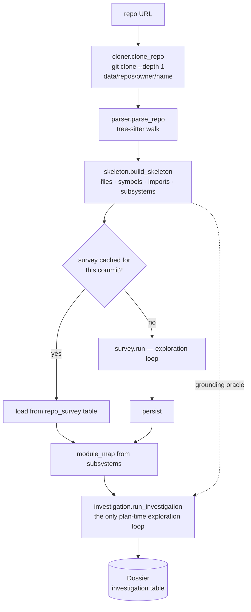

# Repository analysis and context construction

> How CodeOnboard comes to know the repository it is teaching — and why there is
> no retrieval layer.
>
> Parent: [overview.md](overview.md) · Index: [docs/README.md](../README.md) ·
> Implementation: [`backend/repo/`](../../backend/repo/README.md)

---

## 1. The organising principle

Understanding is built in three layers, and the split exists so that each answers
a question the others must not.

| Layer | Question | Cost | Cache key | Model |
|---|---|---|---|---|
| **A — Skeleton** | *What exists, and exactly where?* | Milliseconds | Per `repo_path`, in-process | **None** |
| **B — Survey** | *What is this repository, and how is it shaped?* | One exploration run | `(owner/repo, commit_sha, schema)` — shared by every user and every goal | Haiku |
| **C — Dossier** | *What does **this goal** need?* | One exploration run | `(session_id, commit_sha, schema)` | Haiku |

Layer B is goal-**agnostic**, which is the whole reason it can be cached across
users. Layer C is goal-specific, so it cannot be.

**Never ask a model for something Layer A can compute.** File lists, symbol
names, line ranges and import edges are derived from the AST; a model is asked
only for judgement about them.

---

## 2. The pipeline



`backend/pipeline/explorer_nodes.py` wraps the whole of this as the
`repo_survey` and `goal_investigation` graph nodes.

**Repository identity is one function.** `cloner.parse_repo_url` produces the
`(host, owner, name)` triple that the checkout path, the `repositories` table and
the survey cache key all derive from — lower-cased, because GitHub treats owners
and names case-insensitively. They disagreed once: the checkout was keyed on the
URL's last path segment, so `psf/requests` and `kennethreitz/requests` shared one
directory on disk while the survey cache — correctly keyed — described a
repository that was not there.

**URL validation is not tidiness.** `check_repo_reachable` and `clone_repo` both
hand a caller-supplied string to `git`. Without a scheme and host allow-list that
is a server-side request forgery primitive, so the allow-list is applied at the
one place both paths pass through, before any outbound request.

---

## 3. Layer A — the deterministic index

`backend/repo/parser.py` walks every Python file with tree-sitter, emitting one
unit per function, class and import statement, each with an exact line range and
a `role` (`source` / `test` / `doc` / `example` / `tooling`).
`backend/repo/skeleton.py` turns that into the index: files, qualified symbol
names by containment, import edges, and directory-bucketed subsystems.

Every path in a `Skeleton` is repo-relative with forward slashes, on every
platform — the walk emits OS separators, and normalisation happens once, here.

**Python only, structurally.** The grammar, the qualified-name rule, import
resolution and public-API detection are all Python-specific. Another language
means a sibling adapter behind the same interface, not a rewrite. See
[`docs/planning/phases/multi-language.md`](../planning/phases/multi-language.md)
for the design that has *not* been built.

### Grounding — the part that is not negotiable

`backend/repo/anchors.py` is the single grounding oracle for every agent. It
replaced three near-identical implementations that each validated against a
*retrieval result*, and it separates two questions those had conflated:

- `resolve(...)` — **does this file / symbol / range really exist?** The oracle
  is the repository, via the Skeleton.
- `resolve_within_evidence(...)` — **was this code actually shown to the agent?**

The consequence is the invariant the whole system rests on: **a model names a
`file` and a `symbol`; our code derives the line range.** A hallucinated range is
therefore structurally impossible rather than merely unlikely.

---

## 4. The six tools, and the loop over them

`backend/repo/tools.py` exposes exactly six primitives, chosen so a realistic
investigation is *composable* rather than served by a bespoke tool per question:

| Tool | Answers |
|---|---|
| `list_files` | what is here |
| `read_file` | show me this, bounded |
| `search_code` | where does this text appear |
| `symbols` | what is defined, and exactly where |
| `neighbors` | what is this connected to |
| `propose_anchor` | is this citation real (delegates to the oracle) |

Three rules the module holds itself to: **facts, not judgement** (no tool ranks
by importance or summarises); **bounded output** (every tool caps its result and
reports `truncated`, because replacing vector-retrieval context flooding with
tool-output context flooding would not be a migration); and **one boundary
check** (all filesystem access goes through `skeleton.safe_repo_path`).

`backend/repo/explore.py` is the budgeted agentic loop over them, and guarantees
three things a prompt cannot:

1. **Budgets are enforced in code** — turns, tool calls, tool-output characters
   and wall clock. A prompt saying "be brief" is a request; `Budget` is a limit.
2. **Exhaustion is a result, not an exception.** Running out yields a partial
   `Exploration` with `budget_exhausted=True` and an honest `stop_reason`. So does
   an API failure, and so does a tool crash. Nothing raises at the caller.
3. **Every call is recorded** — `Exploration.trace` is replayable, and
   `Exploration.usage` is per-run cost accounting.

The loop runs on **Haiku**: it is a loop, and Sonnet in a loop is against the
project's model policy.

| Run | `max_turns` | `max_tool_calls` | `max_result_chars` | `max_seconds` |
|---|---|---|---|---|
| Default (`Budget()`) | 12 | 60 | 240,000 | 240 |
| Goal investigation | 20 | 120 | 500,000 | 720 |

Stopping is about **understanding, not spend**: the loop ends when the goal-typed
exit criteria are met and every anchor resolves. Budgets are safety rails against
runaways, and remaining uncertainty is recorded in `open_questions` rather than
papered over.

---

## 5. Validation, and why it is our code rather than a prompt

Both reports are submitted through a tool call whose schema is fixed
(`ReportSpec`), and both are checked by **our** validator before being accepted.
If something is missing the model is told exactly what, and may keep exploring.

- **The survey's coverage contract**: every subsystem in the deterministic
  inventory is either described in `subsystems` or explicitly listed in
  `skipped`. Breadth is therefore verified against Layer A, not requested in a
  prompt.
- **The dossier's grounding contract**: every citation must resolve through the
  oracle. The survey seeds the exploration and is clearly labelled *unverified
  context*; a claim only enters the dossier once it resolves against the
  repository.

---

## 6. What the two reports contain

**Survey** (`survey.SURVEY_SPEC`) — `architecture`, `subsystems`, `skipped`,
`entry_points`, `core_abstractions`, `flows`, `boundaries`, `relationships`,
`needs_investigation`, `testing_posture`, `infrastructure`, `conventions`,
`docs`.

**Dossier** (`investigation.INVESTIGATION_SPEC`) — `understanding`,
`components`, `entry_points`, `flows`, `relationships`, `contracts`,
`prerequisites`, `evidence_refs`, `context`, `open_questions`.

The division of labour is breadth versus depth: Layer B enumerates the whole
repository, Layer C follows only what the goal turns on.

---

## 7. How repository evidence reaches teaching

**One exploration loop per session, at plan time.** Teaching, the Mentor, the
Reviewer and the Mutator all read what it produced; none explores on its own.

`backend/repo/dossier_context.py` computes the slice one lesson needs, and it is
explicitly **not a search index over the dossier** — no embeddings, no scoring,
no `top_k` reinvented one layer up. Matching is anchor identity resolved through
the oracle, with a symbol/file fallback:

```
current node (file + symbol + range)
  -> the dossier component that describes it
  -> the flow steps it participates in, and its immediate neighbours
  -> relationships touching it
  -> contracts on it
  -> prerequisites pointing at it
  -> supporting evidence
```

`backend/repo/structure.py` is the second source, used when the goal-specific
neighbourhood has been exhausted: Layer A already knows base classes, methods,
callees, callers and imports for the whole repository, and every edge it reports
is exact or explicitly approximate, and anchorable.

**The fallback order everywhere is Dossier first, Skeleton second.**
Goal-specific understanding beats generic structure; generic structure beats
nothing; and both are grounded.

**Source is read at lesson time, not at plan time.** Grounding is verified when
the plan is built and the file is read when the lesson is written, and the two
can disagree. If *some* of a unit's anchors fail to load, Teaching degrades and
teaches from the rest. If *all* of them fail, Teaching **fails the lesson** — with
no source the model has only the objective, and it will write a fluent, confident,
entirely ungrounded lesson from it.

---

## 8. Persistence

| What | Table | Key | Lifetime |
|---|---|---|---|
| Checkout | filesystem, `data/repos/<owner>/<name>` | repository identity | Until deleted; re-cloned on demand |
| Survey | `repo_survey` | `(owner/repo, commit_sha, schema)` | Reused by every user and goal on that commit |
| Dossier | `investigation` | `(session_id, commit_sha, schema)` | Per session |

"Absent" is a supported state for every consumer of a survey or a dossier, which
is what lets the startup sweep delete orphaned dossiers quietly.

---

## 9. What was removed, and why it is worth knowing

There is **no retrieval layer, no embedding model and no vector store** — no
ChromaDB, no `sentence-transformers`, no `backend/rag/` package, no Code Structure
Agent and no Prioritization Agent. They were deleted outright rather than flagged
off, and `pyproject.toml` records the dependency weight that went with them.

The measured comparison that justified the change, including the cases where the
**replaced** architecture scored better, is preserved in
[`project-archive/rag-migration/`](../../project-archive/rag-migration/).

---

## 10. Tests

`tests/test_chunker.py` (the tree-sitter walk), `tests/test_skeleton.py`,
`tests/test_anchors.py`, `tests/test_tools.py`, `tests/test_explore.py`,
`tests/test_survey.py`, `tests/test_investigation.py`,
`tests/test_structure.py`, `tests/test_cloner.py`,
`tests/test_repo_identity.py`, `tests/test_repo_layout_migration.py`,
`tests/test_dossier_session.py`.

Several of these skip when the fixture repositories are not cloned; see
[testing.md](../testing.md).
