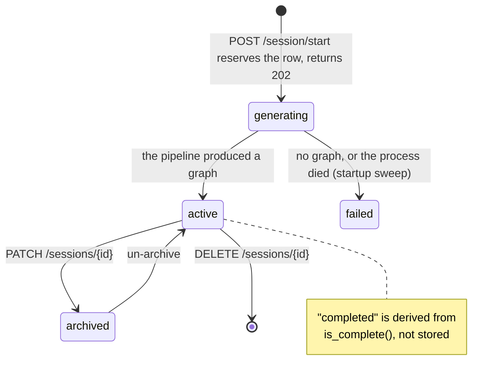
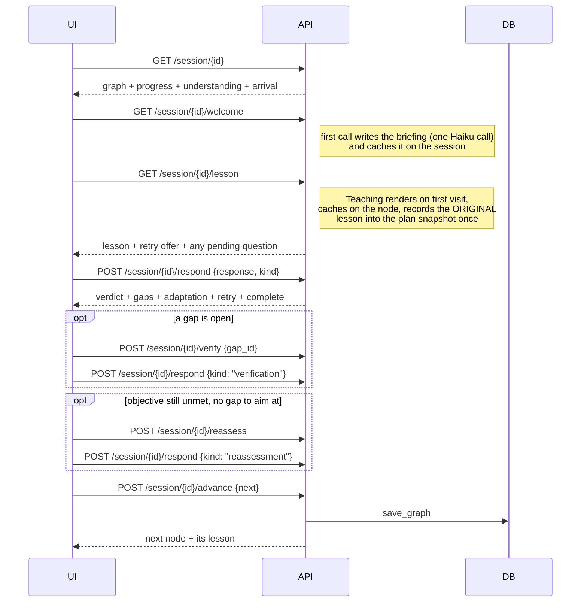

# Session lifecycle

> From "start a new session" to "journey complete" — including what survives a
> restart, and what `Start over` and `Rebuild` actually do.
>
> Parent: [overview.md](overview.md) · Index: [docs/README.md](../README.md)

---

## 1. The states a session row can be in

`sessions.status` is written by the API; `completed` is **derived** from the graph
on read (`is_complete()`), never stored as a second source of truth.



---

## 2. Creation and planning

The goal interview happens **before** the pipeline and is its own short-lived
object.

```mermaid
sequenceDiagram
    participant UI
    participant API
    participant Drafts as session_drafts table
    participant BG as background task
    participant P as run_pipeline

    UI->>API: POST /repo/check {repo_url}
    API-->>UI: {ok, reason}
    UI->>API: POST /goal/start {repo_url}
    API->>Drafts: create a draft owned by this user
    API-->>UI: {session_id, first question}
    loop six questions
        UI->>API: POST /goal/answer {session_id, answer}
        API-->>UI: next question
    end
    API-->>UI: {done: true, goal}
    Note over UI: the review step shows the answers back;<br/>POST /goal/back reopens any one of them
    UI->>API: POST /session/start {repo_url, goal, progress_id}
    API->>API: reserve the row, status = generating
    API-->>UI: 202 {session_id, status: "generating"}
    API->>BG: _generate_session
    par while planning
        UI->>API: GET /session/progress/{progress_id}
        API-->>UI: stage + live tool calls
    and
        BG->>P: clone, skeleton, survey, docs, investigate, [review], plan
        P-->>BG: OnboardState.graph
        BG->>BG: create_session (graph + plan snapshot), status = active
    end
```

Points worth knowing:

- **`POST /session/start` returns before the work is done.** It used to block for
  the full two to four minutes and return the id at the *end* — so closing the tab
  meant the pipeline still finished, the graph was still written, and the learner
  had no way to find it. It also happens to be the shape a dev-server proxy times
  out on.
- **The interview outlives its own completion.** `/goal/answer` used to delete the
  draft the moment the goal was synthesised. It no longer does, because the review
  step needs `/goal/back` to keep working. Retention is bounded and eviction is
  **not fatal**: `/session/start` needs only the goal, which the client already
  holds, so a lost draft costs editing, not starting.
- **`/goal/back` un-answers exactly one question**, so stepping back N questions is
  N calls. It is the only way backwards, because the server owns the consequence —
  crossing Q2 clears `goal_type`, which is what makes the follow-up tail recompute
  instead of leaving the old goal type's questions queued.
- **Two concurrency bounds.** One generation per user (a second returns `409
  generation_already_running`), and a global semaphore of 3 across everybody —
  chosen against what the resource actually is: Starlette's threadpool, and the
  Anthropic bill.
- **The row always reaches a terminal state.** A pipeline that fails and leaves
  `generating` behind is a card that spins forever, so `_generate_session` marks
  `failed` on every failure path, and a startup sweep fails rows left
  `generating` by a process that died.
- **Progress reporting can never fail a run.** `backend/pipeline/progress.py` is
  in-memory, process-local and entirely best-effort; a 404 from
  `/session/progress/{id}` means "no news", never a failure.

### Creation always creates

`_try_resume` used to match on `(repo_url, goal)` across the whole database and
hand back somebody else's session. It is gone. A learner may hold many sessions on
one repository; resuming means opening one **you own**, by id. `force_new` is
accepted and ignored so an un-updated client keeps working.

---

## 3. The learning loop



Every mutation is followed by `save_graph`, so there is no "unsaved session"
state to lose.

---

## 4. Resume

Resume is not a feature with its own code path — it is a consequence of the graph
being persisted after every mutation.

- The dashboard (`GET /sessions`) lists the caller's sessions, newest first, with
  a **cached** copy of the three headline numbers so listing does not require
  loading every graph.
- `Continue` goes to the **welcome page** for a session that was never opened and
  to the **workspace** otherwise — showing the introduction again to someone
  mid-journey would be starting them over.
- Where the learner lands inside the session is `resume_point()`; see
  [learning-engine.md](learning-engine.md) §9.
- An outstanding question survives a reload: `GET /lesson` returns `pending`, so a
  refresh puts the learner back in front of it rather than in front of a composer
  for a prompt that is spent. A refresh is not a decision about understanding, so
  it must not change what is on offer.
- **Version-2 sessions still load.** `SUPPORTED_SCHEMA_VERSIONS` keeps sessions
  written before the plan tables readable and resumable, with `Start over`
  unavailable because they genuinely have no plan. Nothing is ever synthesised.

---

## 5. Start over, and Rebuild — two different actions

They used to be one, and that was the defect: `Start over` re-ran the whole
repository-analysis pipeline — two to four minutes, a Sonnet call, and a
**different curriculum** than the learner was looking at.

| | `Start over` | `Rebuild learning path` |
|---|---|---|
| Endpoint | `POST /session/{id}/reset` | `POST /session/start` again |
| Cost | Zero. No clone, no model call | A full pipeline run |
| Route | **The same route, restored** | A new plan, possibly different |
| Session id | Unchanged — the URL, dossier and briefing all survive | New session |
| Determinism | The same session reset twice yields the same graph | No |

### How the restore works, and why the module is so short

The original plan is written **once**, in the same transaction as the session, into
`plan_nodes` / `plan_edges` — a mirror of `nodes` with every learner-state column
removed. `save_graph` **never** writes a plan table. So restoring is a
*replacement*, not an inversion of every mutation.

The load-bearing consequence: **anything not in the plan is gone by
construction.** `load_plan` builds fresh `LearningNode`s whose state fields sit at
their dataclass defaults, so a state field added tomorrow is handled today without
a line changing. There is no list of fields to clear — a list is exactly what rots.

`plan_nodes.lesson_json` is filled exactly once per unit, by `record_plan_lesson`
on the **success path only**: a Teaching outage must not seal "this lesson could
not be generated" into the plan permanently.

`POST /reset` answers **409 `no_plan_snapshot`**, not 404, when a session has no
plan: the session exists and was found, and the reason this cannot proceed is a
property of that session. No reconstruction is attempted — a plan invented from a
half-walked graph is not the plan, it is wherever the learner had got to,
relabelled.

The response reports what was discarded, which is the honest thing to show after
an irreversible action. Verified live during this audit:

```json
{"stops": 1, "attempts": 3, "gaps": 2, "remedial_nodes": 0, "lessons_restored": 1}
```

What is **not** reset, and why that is not an oversight: `repo_url`, `goal`,
`doc_context`, `areas`, `briefing`, `created_at`. Every one is written by the
pipeline or by the first welcome GET, and nothing in the learning loop writes
them — so they are plan-side.

---

## 6. Completion

`is_complete()` is true when every planned, non-optional unit is **settled** —
`understood`, or carrying an explicit learner override. It is journey completion,
not mastery, and neither measure gates the other. See
[learning-engine.md](learning-engine.md) §8.

`Finish session early` is the deliberate exit from the session menu.

---

## 7. What survives what

| | A page reload | A backend restart | `Start over` | `DELETE /sessions/{id}` |
|---|---|---|---|---|
| Learning graph and all learner state | ✅ | ✅ | ❌ discarded | ❌ |
| Plan snapshot | ✅ | ✅ | ✅ (it *is* the restore) | ❌ (cascade) |
| Cached lessons | ✅ | ✅ | ❌, except the one original per unit | ❌ |
| Briefing | ✅ | ✅ | ✅ | ❌ |
| Dossier / survey caches | ✅ | ✅ | ✅ | dossier cascades; survey is shared and stays |
| In-flight goal interview | ✅ | ✅ (a table since M7) | n/a | n/a |
| Pipeline progress for a run | ❌ in-memory | ❌ | n/a | n/a |

---

## 8. Tests

`tests/test_session_api.py`, `tests/test_sessions_api.py`,
`tests/test_session_reset.py`, `tests/test_plan_snapshot.py`,
`tests/test_legacy_session_compatibility.py`, `tests/test_first_run.py`,
`tests/test_goal_api.py`, `tests/test_pipeline_progress.py`,
`tests/test_store_concurrency.py`.
