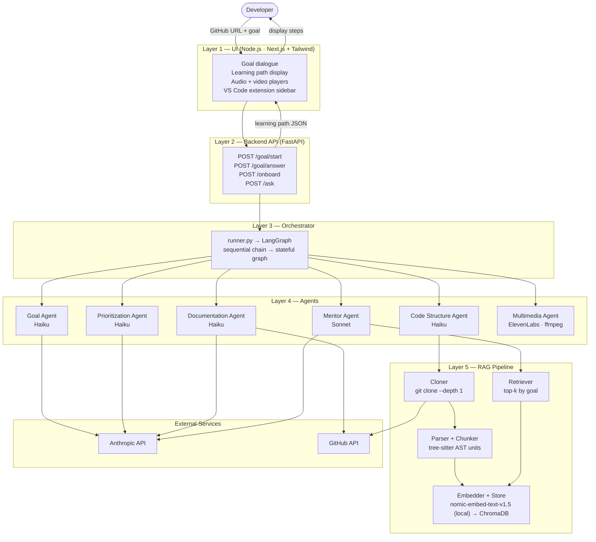

# CodeOnboard — End-to-End System Diagram

## Component summary

| Layer | Component | Notes |
|---|---|---|
| UI | Next.js + Tailwind | Node.js runtime; goal dialogue, learning path, audio/video, VS Code extension |
| API | FastAPI | `/ask` endpoint for VS Code inline Q&A |
| Orchestrator | runner.py → LangGraph | Plain chain in Phase 1; migrated to LangGraph for conditional routing + retries |
| Agent | Goal Agent | Multi-turn dialogue → goal JSON; Haiku |
| Agent | Code Structure Agent | Clone + parse → module map + embed repo; Haiku |
| Agent | Prioritization Agent | Filter irrelevant modules before Mentor Agent; Haiku |
| Agent | Documentation Agent | Extract README/docstrings, enrich steps with real quotes; Haiku |
| Agent | Mentor Agent | Goal + filtered map + RAG → learning path; Sonnet (one call) |
| Agent | Multimedia Agent | Learning path text → TTS audio + code walkthrough video |
| RAG | Cloner | `git clone --depth 1` |
| RAG | Parser + Chunker | tree-sitter AST; chunks by function/class, never by line window |
| RAG | Embedder + Store | `nomic-embed-text-v1.5` via sentence-transformers (local) → ChromaDB; skip if collection exists |
| RAG | Retriever | Query by `goal.primary_goal`; return top-k to Mentor Agent |
