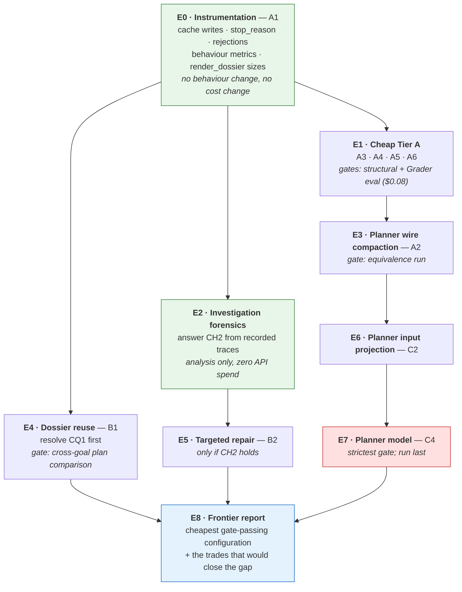

# Cost Optimization — spending less without shrinking the product

> **Status:** planning only. No production code, prompt, model, budget, flag,
> schema or migration is changed by this document.
> **Depends on:** [`learning-engine.md`](learning-engine.md) (complete, §14 item 16
> explicitly open) and [`repo-understanding.md`](repo-understanding.md) (complete).
> **Frozen baseline:** [`evidence/learning-engine-cost.md`](evidence/learning-engine-cost.md)
> — Baseline 1, 2026-08-15, commit `7c599d6`.
> **Last updated:** 2026-08-15

The Learning Engine works and has been validated. It costs **≈$0.405 for a warm
12-unit session and ≈$0.53 cold**, against a stated product target of **≤$0.10**.
This phase exists to close that gap — or to establish, with evidence, that it
cannot be closed without a trade the product owner should make deliberately.

**The one rule that governs everything below.** The measured system is the
functional baseline. Cost work may remove *waste*; it may not remove
*capability*, and it may not quietly undo an architectural decision that has
already been paid for in evidence. This is [D16](repo-understanding.md#15-accepted--high-confidence-decisions)
carried forward, and it has already bitten this project once: the first Stage-2
pass capped exploration turns to defend the `$0.10` figure and produced 15 of 16
surveys that could not repair their own citations. **The cost target did not make
the system cheaper; it made the artifact worse.**

**Reading guide.** [§1](#1-the-frozen-baseline) is the baseline and what it does
*not* cover. [§2](#2-stage-anatomy--what-each-call-buys-and-who-consumes-it) is
the per-stage analysis every optimisation must be argued from.
[§3](#3-deep-dive--goal-investigation) and [§4](#4-deep-dive--curriculum-planning)
are the two dominant cost centres. [§5](#5-risk-tiers) defines the tiers and the
discriminator between them — read it before reading the candidate register in
[§6](#6-candidate-register), because a mis-tiered candidate is how a semantic
change gets shipped as a token saving. [§7](#7-evidence-at-risk) protects the
validations already paid for. [§8](#8-measurement-methodology) is how an
experiment is judged. [§13](#13-considered-and-rejected) is the list of tempting
ideas that are already refuted — read it before proposing anything.

---

## 0. Priority order

Inherited verbatim from [`repo-understanding.md` §0](repo-understanding.md#0-priority-order--read-this-before-optimising-anything),
because nothing about this phase changes it:

1. Repository-understanding quality and correctness
2. Grounding and coverage
3. Usefulness for downstream learning
4. Avoiding unnecessary work
5. **Cost and latency** — optimised only where doing so does not materially harm 1–4

**Legitimate here:** duplicate work · re-sending information already in context ·
generating text nobody reads · encoding the same information more verbosely than
necessary · recomputing per session what is stable per repository or per commit ·
paying a premium model for a task a cheaper one demonstrably does as well.

**Not legitimate here:** teaching fewer units to make the arithmetic work ·
shortening lessons below the point where they teach · loosening the exit criteria
so investigations stop earlier · dropping anchors so grounding costs less ·
raising the guard bands' relevance by changing what the planner proposes ·
choosing a weaker model where evaluation shows a real quality loss.

> **The difference between the two lists is not motive, it is mechanism.** Every
> item in the second list would reduce cost. What disqualifies them is that they
> reduce cost *by reducing what the learner gets*. An optimisation that is only
> defensible by pointing at the price is not an optimisation; it is a product
> decision wearing an engineer's coat, and [§9](#9-target-and-milestones) says
> what to do with those instead.

---

## 1. The frozen baseline

### 1.1 What is recorded

Baseline 1, `psf/requests`, `understand_architecture`, `code_depth: working`,
16 units planned, 12-unit projection journey, `CODEONBOARD_CURRICULUM=1`.
Raw data: [`evidence/cost-measurement.json`](evidence/cost-measurement.json).

| | |
|---|---|
| Warm 12-unit session | **$0.4053** |
| Cold start (first session on a repository) | **≈$0.53** |
| Target | **≤$0.10** |
| Verdict | **4.1× over warm, 5.3× cold** |

**Planning time — paid once per session ($0.3018, 74% of the bill):**

| stage | calls | model | uncached in | cache read | out | cost |
|---|---|---|---|---|---|---|
| `repo_survey` | 0 | — | — | — | — | $0.0000 (store hit; $0.1309 when cold) |
| `documentation` | 0 | — | — | — | — | $0.0000 (no LLM, by design) |
| `goal_investigation` | 20 | Haiku | 509 | 352,686 | **21,614** | **$0.1832** |
| `mentor` (flag=1, B3) | 1 | Sonnet | 16,635 | 0 | 4,579 | **$0.1186** |
| `mentor` (flag=0, pre-B3) | 1 | Sonnet | 15,976 | 0 | 2,251 | $0.0817 |

**Session time — per unit / per answer:**

| scenario | calls | in | out | cost |
|---|---|---|---|---|
| happy path (lesson + grade) | 2 | 4,659 | 792 | **$0.008619** |
| `no_attempt` → hint | 3 | 5,180 | 797 | $0.009165 |
| `right_idea_wrong_altitude` → follow-up | 3 | 5,163 | 851 | $0.009418 |
| `wrong_model` → re-teach | 4 | 8,212 | 2,032 | $0.018372 † |
| `missing_prerequisite` → prerequisite | 3 | 10,073 | 965 | $0.027076 |

† includes a parse-failure retry; a clean re-teach is ~1 call (≈$0.005).

Component costs, isolated: **teaching $0.006882/unit**, **grading
$0.001737/answer**, hint $0.000923, follow-up $0.000796, prerequisite $0.018267.

### 1.2 Cost decomposition the baseline records but does not state

Derived by arithmetic from the recorded totals and `explore.py::PRICING`
(Haiku 1.00/5.00, Sonnet 3.00/15.00; cache write ×1.25, read ×0.10). Every figure
below reconciles to the recorded cost exactly.

**`goal_investigation` — $0.1832:**

| component | billed tokens | cost | share |
|---|---|---|---|
| output | 21,614 | $0.10807 | **59.0%** |
| **cache writes** | ~31,512 × 1.25 = 39,390 | **$0.03939** | **21.5%** |
| cache reads | 352,686 × 0.10 = 35,269 | $0.03527 | 19.2% |
| uncached input | 509 | $0.00051 | 0.3% |

> **The cache-write figure is reconstructed, not recorded.** `measure_cost.py`'s
> `summarise()` sums `input_tokens`, `output_tokens` and `cache_read` but **not**
> `cache_write`, while `cost_of()` bills all four. The ~31.5k write figure is the
> only value that reconciles the recorded total, so the arithmetic is sound — but
> it is inferred, and [E0](#10-build-and-experiment-order) must record it directly
> before any experiment is judged against it. It matters because it is the
> **second-largest line in the stage**, and it is invisible in the JSON as written.

**The planner — $0.1186, and it is 58% output:** input 16,635 × $3 = $0.049905,
output 4,579 × $15 = $0.068685. **Zero cache activity of any kind.**

**A lesson — $0.006882, almost exactly half output:** input $0.003292,
output $0.003590.

**A grade — $0.001737, 79% input:** the Grader's system prompt dominates a call
whose output is 74 tokens.

**A prerequisite insertion — $0.018267, 88% input:** 5,384 Sonnet input tokens
of rendered candidate source, for 141 tokens of decision.

### 1.3 What Baseline 1 does NOT cover — three gaps found while reading the code

These are not criticisms of the measurement; they are facts a future comparison
must account for, and one of them means the *production* cost for the measured
goal is higher than the recorded number.

**Gap 1 — the Reviewer stage was never measured, and it runs for this goal.**
`measure_cost.py::measure_planning` records `repo_survey`, `documentation`,
`goal_investigation` and the two Mentor variants. It never calls `run_reviewer`.
But `backend/agents/reviewer/agent.py::should_run` returns True for
`{improve_existing_system, understand_architecture}` — and Baseline 1's goal type
is `understand_architecture`. In production, `route_after_investigation` routes
that goal through the Reviewer, which makes one Haiku call (`MAX_TOKENS=2048`)
over the module map plus up to 24 dossier chunks *with full source attached*
(`dossier_as_chunks`). **Unmeasured, and plausibly $0.01–0.03.**

Second-order: the Reviewer writes `state.system_review`, which `render_dossier`
appends to the planner prompt. So the recorded 16,635 planner input tokens are
the **review-less** figure; the production planner prompt for this goal is
larger. Both effects push the real warm figure *above* $0.4053.

**Gap 2 — the investigation's own stop conditions are not in the raw data.**
`state.investigation` carries `stop_reason`, `turns`, `tool_calls` and
`rejections`, and `cost-measurement.json` records none of them. Whether the
baseline's 20 calls ended in an accepted report or a budget stop — and how many
full dossier re-submissions were paid for — is the single most useful fact about
that stage, and it was not kept.

**Gap 3 — single run, single goal, single repository, no variance.** Recorded
honestly in the baseline's own limitations. `goal_investigation` is a budgeted
agentic loop whose cost depends on what it finds, and planner output already
varied run-to-run in the calibration matrix. **Baseline 1 is a point estimate,
and no single post-optimisation run may be compared against it** — see
[§8.4](#84-when-repeats-are-required).

### 1.4 The feasibility frontier — arithmetic, not opinion

This is the most important number in the document, and it follows from the
baseline alone.

Session-time cost for a completed 12-unit journey is **12 × $0.008619 =
$0.10343**. That is already above the $0.10 target **with planning at zero**.

| planning budget | per-unit budget implied | required cut vs baseline |
|---|---|---|
| $0.00 (impossible) | ≤ $0.00833 | −3% |
| $0.02 | ≤ $0.00667 | **−23%** |
| $0.04 | ≤ $0.00500 | **−42%** |
| $0.10 (planning alone) | $0.00 | impossible |

Three consequences, all of which shape this plan:

1. **≤$0.10 is not reachable by attacking planning alone**, however completely
   planning is optimised. Session time must fall too.
2. Session time is a lesson ($0.0069) plus a grade ($0.0017). The lesson is half
   output — and lesson output *is* the product. A −42% per-unit cut cannot be
   found in encoding; it requires either a materially cheaper lesson or a
   different lesson.
3. **Therefore ≤$0.10 for a completed 12-unit session requires at least one Tier C
   decision.** The plan does not get to pretend otherwise, and
   [§9](#9-target-and-milestones) says what to do about it.

An envelope for a *perfect* Tier A + Tier B execution — every encoding win taken,
the dossier reused across sessions, nothing semantic touched — lands at roughly
**$0.20 on a repeat session and $0.38 on a first session** ([§6.5](#65-envelope)).
That is milestone M2, not the target.

---

## 2. Stage anatomy — what each call buys, and who consumes it

Every optimisation candidate must be argued from this table for its stage. The
nine questions are asked of every LLM stage in the system:

1. What information does it produce?
2. Which downstream component consumes each part?
3. What is required for correctness or learning quality?
4. What is duplicated elsewhere?
5. What is generated but never consumed?
6. What could be represented more compactly?
7. Is the model choice justified by the task?
8. Can caching actually help *this call shape*?
9. Can calls be reduced, combined, deferred or avoided?

### 2.0 A hard constraint on question 8, established in code

`backend/repo/explore.py` records `HAIKU_MIN_CACHEABLE_TOKENS = 4096`: below that
prefix size a cache breakpoint is **silently ignored** — no error, no cache.

| Haiku call | prompt size | can caching apply? |
|---|---|---|
| Teaching (a lesson) | 3,292 input tokens | **No** — below the minimum |
| Grader (an answer) | 1,367 input tokens | **No** — far below |
| Hint / follow-up | ~500 input tokens | **No** |
| `goal_investigation` turn | ~17.6k average | Yes — and it already does |

**So "add prompt caching to session time" is not an under-explored idea; it is
mechanically impossible at the current prompt sizes.** This kills the most
obvious Tier B candidate for the quarter of the bill that session time
represents. *Re-confirm the 4096 figure against current API documentation in
[E0](#10-build-and-experiment-order) before relying on it* — it is recorded in
this repository as a measured constraint, not quoted from a contract.

### 2.1 `goal_investigation` — Haiku, ~20 calls, $0.1832 (45% of the session)

| | |
|---|---|
| **Produces** | The Dossier: `understanding`, `components`, `entry_points`, `flows`, `relationships`, `contracts`, `prerequisites`, `evidence_refs`, `context`, `open_questions` — plus a replayable trace, rejections and usage |
| **Model** | Haiku. **Justified** — it is a loop, and CLAUDE.md forbids Sonnet in loops. There is no cheaper tier in use |
| **Caching** | Already near-optimal on reads (352,686 read against 509 uncached). Writes are the second-largest line at 21.5% |
| **Reduce calls?** | Turn count is budget-shaped, not sufficiency-shaped — see [§3.1](#31-why-20-calls) |

**Consumer map — every dossier field, and who reads it:**

| field | planner prompt (`render_dossier`) | lesson slice (`dossier_context`) | Mutator | Reviewer (`dossier_as_chunks`) | deterministic code |
|---|---|---|---|---|---|
| `understanding` | ✅ | ✅ ("what the goal is really about") | — | — | — |
| `components` | ✅ **+ up to 120 lines of source each** | ✅ `role_in_goal` + `why_it_matters` | ✅ via context | ✅ | `module_map_from_dossier`, evidence ranges |
| `entry_points` | ✅ (incl. `perspective`) | ❌ **never sliced into a lesson** | — | ✅ | evidence ranges, `min_public_api_entry_points` |
| `flows` | ✅ (ordered steps) | ✅ ±2 steps around the node | ✅ predecessor | ✅ | evidence ranges, flow exit criteria |
| `relationships` | ✅ | ✅ (≤6) | ✅ candidates | — | evidence ranges, `module_map` deps |
| `contracts` | ✅ **+ source** | ✅ (≤3) | ✅ candidates | ✅ | evidence ranges, criteria |
| `prerequisites` | ✅ | ✅ (≤4) | ✅ candidates | ✅ | criteria |
| `evidence_refs` | ✅ | ✅ (≤3, name-matched) | — | — | — |
| `context` (free strings) | ✅ **only** | ❌ | ❌ | ❌ | ❌ — **no criterion depends on it** |
| `open_questions` | ✅ ("do not build on these") | ✅ only when the question text contains the node's symbol | ❌ | ❌ | ❌ |

Two entries in that table are load-bearing for later sections:

- **`context` reaches exactly one consumer — the planner's prompt — and no
  deterministic check anywhere.** The investigation's own escalation message
  already tells the model to send `context` and `open_questions` empty when a
  payload will not fit, i.e. the code already treats them as the droppable
  fields. That makes them the obvious first cut — and **it is still a Tier C
  cut**, because "read only by a model" is consumption ([§5](#5-risk-tiers)).
- **`entry_points[].how_it_enters` never reaches a lesson.** `dossier_context`
  has no entry-point slice. This is either a cheap saving or a missing feature;
  it should not be assumed to be the first.

### 2.2 The curriculum planner (B3) — Sonnet, 1 call, $0.1186

| | |
|---|---|
| **Produces** | `areas[]`, `objectives[]` (id, title, objective, kind, priority, area_id, depends_on, anchors[], why, concept_tags), `covers_goal`, `coverage_note`, `confidence` |
| **Consumed by** | `select()` / `core_set()` / `order()` / `ground()` (all pure Python), `build_graph`, then Teaching and the Grader through `lesson_brief` |
| **Model** | Sonnet. **Asserted, not tested.** See [§4.5](#45-is-sonnet-necessary) |
| **Caching** | Zero today, and mostly *inapplicable*: the dossier is unique per session, and one call per session cannot amortise a 5-minute-TTL write |
| **Reduce calls?** | Already exactly one, plus a bounded retry that did not fire on the recorded run |

**Field consumption, precisely:**

| field | consumed by | required? |
|---|---|---|
| `objective` | Teaching prompt, Grader marking standard, UI | **Yes — the contract of the whole phase** |
| `kind` | `lesson_form()`, Grader rubric, tag colours | **Yes** |
| `priority` | `select`, `/advance`, `readiness()`, rail, prune-ahead, scope control | **Yes** |
| `area_id` + `areas[]` | rail grouping, area-coverage rule | **Yes** |
| `depends_on` | dependency closure, topological order, planned prerequisite edges | **Yes** |
| `anchors[]` | grounding, display projection, lesson source | **Yes** |
| `title` | UI, Teaching, Grader | Yes |
| `why` | Teaching prompt (`_brief_line`) | Weak — already capped at 15 words |
| `concept_tags` (beyond `kind`) | tag chips, Teaching's "concepts:" line | Weak |
| `covers_goal` / `coverage_note` | `state.errors`, confidence cap | Yes (cheap) |
| `confidence` | `/onboard` response | Yes (cheap) |

**Nothing the planner emits is unconsumed.** The saving here is not in dropping
fields; it is in the **encoding** of the fields ([§4.4](#44-output-density)) and
in the **input projection** ([§4.3](#43-what-the-planner-is-actually-shown)).

### 2.3 Teaching — Haiku, 1 call per unit, $0.006882

| | |
|---|---|
| **Produces** | `setup`, `prompt`, `reveal`, `takeaway`, ownership note, `expected_answer`; `walkthrough` is **assembled in Python**, costing no output tokens |
| **Consumes** | system prompt + profile + prior context + previous unit + doc section + objective + form brief + brief + **node source** + dossier slice |
| **Duplication** | The objective appears once; `understand` is correctly omitted on B3 graphs; the doc section fires rarely. Little obvious duplication |
| **Unconsumed output** | `expected_answer` is now only the Grader's *calibration reference* (B1 demoted it). It is still read — so removing it is Tier C, but it is the cheapest Tier C in the system to validate |
| **Model** | Haiku. Justified — it runs N times per session |
| **Caching** | **Impossible** (§2.0) |
| **Calls** | Already lazy and cached: a lesson is generated on first visit and persisted in `cached_lesson`. Revisits are free |

> The 12-unit projection assumes the learner completes the journey. Real sessions
> that stop early cost less, because lessons are generated on demand. This means
> the **projection is a ceiling for a completed journey, not an average bill** —
> a distinction that must not be used to make an optimisation look better than it
> is ([§8.2](#82-what-must-be-measured)).

### 2.4 The Grader — Haiku, 1 call per answer, $0.001737

| | |
|---|---|
| **Produces** | `classification`, `gap_kind`, `rationale` — 74 output tokens |
| **Consumes** | A ~1,000-token system prompt carrying **all seven rubrics**, plus objective, title, tags, question, calibration reference, answer |
| **Duplicated** | Six of the seven rubrics are irrelevant to any given node — and **our code already knows which one applies** (`kind` is `concept_tags[0]`). Teaching already does exactly this for lesson forms: "only the chosen one is shown to the model (a menu of six invites blending)" |
| **Model** | Haiku. Justified |
| **Caching** | **Impossible** (§2.0) |
| **Validation cost** | The 48-case Grader evaluation harness costs **≈$0.08 to re-run**. Grader changes are the cheapest in the system to prove |

### 2.5 Adaptation — $0.0008 to $0.0183

| behaviour | model | cost | verdict |
|---|---|---|---|
| hint | Haiku | $0.0009 | Economically irrelevant. Leave alone |
| follow-up | Haiku | $0.0008 | Economically irrelevant. Leave alone |
| re-teach | Haiku | $0.0096 observed (with a retry), ~$0.005 clean | Minor. The retry rate is worth *measuring*, not tuning |
| prerequisite | **Sonnet** | $0.0183, **88% input** | The only material one — and [H3](repo-understanding.md#h3--what-does-mutator-prerequisite-selection-actually-cost) is still open |

`_build_prereq_prompt` renders every candidate chunk's **full source**. The
decision it buys is 141 output tokens choosing one candidate. This is the
clearest input/output asymmetry in the system.

### 2.6 The Survey — Haiku, $0.1309, cold only

Produced once per `(repo, commit)` and shared by every session; `survey_store`
already implements the reuse. It is **not** a per-session cost and must never be
optimised as though it were. Its consumers are `survey_context` (truncated to
6,000 chars as the investigation seed) and `_module_map_from_survey`.

Do not propose removing it: [H1 was closed](repo-understanding.md#h1--closed-by-the-stage-3-downstream-ab-2026-08-13)
by a downstream A/B in which the survey **improved discovery on 2 of 4 goals,
regressed none, and made the investigation *cheaper* on 3 of 4**.

### 2.7 The Reviewer — Haiku, unmeasured, conditional

Runs only for `improve_existing_system` and `understand_architecture`. Sends the
module map plus up to 24 dossier chunks with source. Its output is consumed by
exactly one thing: the `## System review` section of the planner prompt.
[H2](repo-understanding.md#h2--does-a-dedicated-reviewer-pass-add-quality-over-the-investigation-alone)
is open and explicitly says *"do not delete the Reviewer on the grounds that
Layer C can produce findings — overlapping outputs are not proof of redundancy."*
This phase measures it and hands the keep/kill question back to H2's criterion.

### 2.8 The Goal Agent and the Documentation Agent

The Goal interview is Haiku with `max_tokens=512` over static questions; the
Documentation Agent makes **no LLM call at all**, by design. Neither appears in
the baseline's planning table and neither is worth an experiment. Recorded here
so the survey of stages is complete.

---

## 3. Deep dive — Goal Investigation

$0.1832, 45% of a warm session, 59% of it output.

### 3.1 Why ~20 calls?

**Fact.** `run_investigation` passes `Budget(max_turns=20, max_tool_calls=120,
max_result_chars=500_000, max_seconds=720)`. The recorded run made 20 API calls.

**Fact.** `explore()` checks its budget only *between* turns, and salvage adds one
call after a budget stop. 20 recorded calls is therefore consistent with either
"reported on the 20th turn" or "stopped early for another reason" — and
[Gap 2](#13-what-baseline-1-does-not-cover--three-gaps-found-while-reading-the-code)
means we cannot tell which from the recorded data.

**Measured elsewhere, and this is the load-bearing evidence:** *exploration
expands to fill whatever budget exists.* Raising the turn budget 12 → 18 in
Stage 2 raised source read ~25% and left submission **exactly as late as before**.

**Hypothesis CH1 — turn count is budget-shaped, not evidence-shaped.**
Consequence: lowering `max_turns` *would* lower cost. **That is forbidden**, and
not on principle — it is the exact intervention that produced 15 of 16 unusable
surveys. The legitimate reformulation is: reduce **what each turn writes** and
**how often the dossier is written**, never how many turns are permitted.

### 3.2 Where do 21,614 output tokens go?

Unknown in detail, which is itself the finding. Output on this stage is three
things, and only the third is inherent:

1. **Tool-use blocks** — one JSON block per tool call. Small individually, but the
   run made enough calls to matter.
2. **Inter-turn prose** — the model narrating its reasoning between tool calls.
   Unbounded, unread by anything downstream, and only reducible by prompt
   pressure (Tier C: it may be load-bearing for the model's own reasoning).
3. **Dossier submissions** — each one is a complete dossier payload
   (`INVESTIGATION_MAX_TOKENS = 12288`). A realistic dossier is 3,000–5,000
   output tokens. **Every rejection costs a full re-emission.**

**Hypothesis CH2 — a large share of the 21.6k output is the dossier written more
than once.** Three submissions would be 9k–15k of the 21.6k. This is
*measurable from data the harness already keeps*: `Exploration.rejections` and
the trace's `submit_dossier` entries.

If CH2 holds, the highest-value investigation lever is **not writing less — it is
being rejected less**, which is a §0-legitimate quality improvement that happens
to be the largest cost lever in the stage. Stage 2 already proved this
directionally in the other direction: the `[budget]` notice *raised* per-run cost
and *cut cost per accepted survey 4.5×*.

### 3.3 Is the exploration producing redundant evidence?

Partly answered already, and the cheap wins are taken:

| waste channel | status |
|---|---|
| Identical tool calls | **Eliminated** — `dedupe_identical_calls` returns a pointer. Measured residual waste (duplicates + overlapping reads) **2–6% of calls** |
| Oversized reads | **Largely eliminated** — the structural tool guide cut source lines 27–42% and cost 6–16% with coverage unchanged |
| Overlapping (non-identical) reads | Instrumented (`overlapping_reads`, `reread_lines`) but **not eliminated** |
| Re-sent conversation | Inherent to a 20-turn loop; ~17.6k average prompt, mitigated by caching to 0.1× |
| Cache writes | 21.5% of the stage, **not previously named as a line item** |

`backend/repo/metrics.py::behavior()` already computes every number needed for
this analysis (`waste_share`, `narrowing_share`, `reread_lines`,
`source_lines_read`). **It is not wired into `measure_cost.py`.** Connecting the
two is [E0](#10-build-and-experiment-order) and costs nothing.

### 3.4 Which dossier information is genuinely necessary?

By the consumer map in [§2.1](#21-goal_investigation--haiku-20-calls-01832-45-of-the-session):

- **Load-bearing for grounding or a code check:** `components`, `entry_points`,
  `flows`, `relationships`, `contracts`, `prerequisites`. All feed exit criteria
  and/or `_dossier_evidence_ranges`, which is the gate on what the planner may
  anchor. **None of these may be trimmed for cost.**
- **Load-bearing for lesson quality:** `understanding`, `role_in_goal`,
  `why_it_matters`, flow ordering, the ±2 flow neighbourhood.
- **Read only by the planner, by no code:** `context`, `open_questions`,
  `evidence_refs`, `entry_points[].how_it_enters`.

The last group is where an investigation-output reduction could come from, and
every member of it is Tier C.

### 3.5 Can the same grounding guarantees hold with less generated text?

Yes, in principle, and the guarantee is not what is at risk. Grounding is
enforced by `anchors.resolve` against the repository — the model names
`file` + `symbol` and our code derives the range. **Reducing prose cannot weaken
grounding**; it can only weaken the *pedagogical payload* the planner reasons
over. That distinction is why investigation-output candidates land in Tier C but
are not grounding risks, and it is why [§7](#7-evidence-at-risk) treats grounding
and curriculum evidence separately.

---

## 4. Deep dive — Curriculum planning

$0.1186 on one Sonnet call: 16,635 input, 4,579 output, no caching.

### 4.1 Why ~16k input?

`user_content` is `render_dossier(...)` in full; the system prompt is separate.

| component | estimate | basis |
|---|---|---|
| `_SYSTEM_PROMPT` | ~2,400 tokens | ~180 lines of prompt text |
| Goal JSON | ~150 tokens | `json.dumps(goal, indent=2)` |
| Dossier prose (all sections) | ~3,000–4,000 tokens | components, flows, relationships, contracts, prerequisites, context, open questions |
| **Rendered source** | **~10,000 tokens** | up to `ANCHOR_RENDER_LINES = 120` lines for **every component and every contract**, deduplicated by resolved range |

**The estimate is a decomposition, not a measurement.** [E0](#10-build-and-experiment-order)
must instrument `render_dossier` to report per-section character counts, because
the entire input-side case rests on the claim that source rendering is ~60% of
the planner prompt.

### 4.2 Why ~4.6k output?

~22 proposed objectives at ~208 output tokens each. Per objective: the
`objective` claim (~55 tokens, and the one field explicitly worth its length),
`title`, `why` (≤15 words), `kind`, `priority`, `area_id`, `depends_on`,
`anchors[]` (1–6 entries), `concept_tags` — plus **~40–60 tokens of JSON keys and
punctuation that carry no information**.

This is the B3 premium, measured: +$0.037 (+45%) over the pre-B3 planner, "almost
entirely output tokens (4,579 vs 2,251) — the price of over-generating objectives
with anchors and areas". **Over-generation is [LD7](learning-engine.md#151-accepted-ld)
and is not up for reversal** — the alternative is a node count in a prompt, which
is L1, which this phase may not reintroduce.

### 4.3 What the planner is actually shown

The planner needs, to do its job: names and locations it may anchor on
(from the dossier), why each matters for the goal, flow ordering, relationships,
contracts, prerequisites, areas material, and the goal profile.

Does it need **120 lines of source per component and contract**? Unknown. The
arguments both ways:

- **For:** an objective is a claim about behaviour. Writing a specific,
  falsifiable claim ("explain what Session owns that a bare request does not")
  plausibly requires having read the code, not just its name and role.
- **Against:** the dossier already carries `role_in_goal`, `why_it_matters` and
  `contract` — prose written by a model that *did* read the code. The planner may
  be paying to re-read what was already summarised for it.

**Hypothesis CH3 — a signature+docstring projection preserves objective quality.**
The skeleton already indexes exactly this (name, kind, parent, docstring, exact
range). Expected saving ~6,000–8,000 input tokens ≈ **$0.018–0.024, 15–20% of the
planner**. This is a **deterministic projection that loses information**, so it is
Tier C, not Tier A ([§5](#5-risk-tiers)), and it is judged on objective quality,
not only on structural gates.

### 4.4 Output density

**Hypothesis CH4 — the same curriculum can be emitted in ~25% fewer output
tokens with identical semantics.** Levers, in descending confidence:

1. **Shorter JSON keys** (`o` for `objective`, `k` for `kind`, …) with the
   mapping restored in `_parse_output`. Pure encoding: the information is
   bit-identical.
2. **Anchors as `"file#symbol"` strings** instead of objects — `AnchorWire` already
   tolerates a symbol-less form and our code resolves ranges either way.
3. **`why` dropped entirely.** It is capped at 15 words, must "add something
   `objective` does not already say", and reaches only one line of the Teaching
   prompt. *This is Tier C* — it removes information a model reads.

(1) and (2) are Tier A by the discriminator in §5: same information, fewer
tokens. They still require a proposal-volume equivalence check, because a format
change can change model behaviour even when it does not change semantics — which
is exactly the difference between "Tier A" and "Tier A, unverified".

### 4.5 Is Sonnet necessary?

**This is asserted by CLAUDE.md's LLM rules ("Sonnet for the Mentor Agent only,
one call, final synthesis") and has never been tested.** A full Haiku swap saves
**$0.079 of $0.1186 — 67% of the planner, 20% of a warm session** and is the
single largest non-reuse lever in the system.

It is also the highest-risk change in this document. Objective quality is the
contract the whole Learning Engine rests on ([LR3](learning-engine.md#16-risks):
"the one quality property no test can assert"), and a curriculum planned by a
weaker model could degrade in ways every structural gate passes cleanly.

Two intermediate positions worth testing before the binary one:

- **CH5a — Haiku proposes, Sonnet does not run at all.** Judged against the full
  gate set in [§8.5](#85-quality-gates-by-component).
- **CH5b — split the call**: Haiku enumerates candidate objectives with anchors
  and dependencies (a listing task); Sonnet rewrites only the `objective` claims
  (a judgement task on ~22 short fields). Saves most of the input premium while
  keeping Sonnet where the quality argument is strongest. Costs two calls, which
  is a latency and complexity trade.

**Neither may be adopted on cost evidence alone.** The keep/kill criterion is in
[§8.5](#85-quality-gates-by-component), and it is the strictest in the document.

---

## 5. Risk tiers

### 5.1 The discriminator

The tiers are about **mechanism, not motive**. Every candidate here is motivated
by cost; that is not what places it.

> **The test: does the change alter the information available to a model, or only
> its encoding?**
>
> - **Same information, different encoding** → Tier A.
> - **Information removed that no model and no code reads** → Tier A.
> - **Execution changed, information identical** → Tier B.
> - **Less, more, or different information reaching a model** → **Tier C**.
>
> A prompt is consumed by a model. **"Read only by a model" is consumption.**
> Deleting a field from a prompt is therefore Tier C even when no Python line
> reads it — and this is the rule that stops a semantic change from shipping
> under a token-saving label.

**When in doubt, classify up.** A mis-tiered Tier C costs a validation nobody ran.

### 5.2 Tier A — representation and encoding

*Intent: the system computes the same thing and the models see the same
information, in fewer tokens.*

Includes: compact wire formats · removing genuinely unread fields · deterministic
projections **that lose nothing the consumer can use** · eliminating context sent
twice · instrumentation that removes guessing.

**Gate:** structural/unit tests, plus a same-input equivalence check where a model
is involved (a format change can shift behaviour even when semantics are
preserved). No recalibration.

### 5.3 Tier B — execution

*Intent: the same information is produced, obtained differently or fewer times.*

Includes: caching · reuse across sessions · model selection **where evaluation
shows no quality loss** · avoiding calls whose result already exists · lazy
generation · batching.

**Gate:** identical-output or equivalence testing where the artifact is
deterministic; a quality gate where it is not. Model selection is Tier B *only*
when it passes the Tier C gate for its component — otherwise it is Tier C wearing
a Tier B label.

### 5.4 Tier C — semantic

*Intent explicitly accepted: the system may behave differently.*

Includes: anything touching investigation coverage or exit criteria · what the
planner is shown · what the planner proposes · selection, dependencies, areas or
priorities · lesson content, length or form · grading inputs · adaptation policy ·
model swaps on judgement-heavy calls.

**Gate:** the component's full validation set, re-run, with results appended to
the evidence record. A Tier C change that improves cost and degrades a gate is
**not** shipped on the strength of the cost number; it goes to
[§9.3](#93-when-the-target-cannot-be-met-honestly) as a documented trade.

---

## 6. Candidate register

Every candidate: tier, stage, hypothesis, expected saving, what evidence it puts
at risk, how it is tested, and how it is reverted. **Expected savings are
estimates from the baseline arithmetic, not predictions** — several will be
wrong, and being wrong cheaply is what [E0](#10-build-and-experiment-order) is
for.

### 6.1 Tier A — encoding and instrumentation

| # | Stage | Change | Est. saving | Evidence at risk | Test | Revert |
|---|---|---|---|---|---|---|
| **A1** | measurement | Record `cache_write` per stage in `summarise()`; record investigation `stop_reason`/`turns`/`rejections`; wire `metrics.behavior()` into the cost harness; instrument `render_dossier` per-section sizes | **$0** (enables everything) | none | harness self-test | delete |
| **A2** | planner | Compact output wire: short keys, anchors as `"file#symbol"` strings, restored in `_parse_output` | ~1,000–1,200 output tokens ≈ **$0.015–0.018** | proposal volume → guard bands | equivalence run ([§8.4](#84-when-repeats-are-required)) + full structural gates | one parser flag |
| **A3** | planner | Drop `indent=2` from the goal JSON blob and de-duplicate `target_repo` (already in the goal) | ~50 input tokens ≈ $0.0002 | none | structural tests | trivial |
| **A4** | Grader | Inject **only the node's applicable rubric**, chosen by `kind` in Python — the same discipline `_FORM_BY_KIND` already applies in Teaching | ~250 input tokens/answer ≈ **$0.003/session** | Grader calibration | 48-case eval, **≈$0.08** | one dict lookup |
| **A5** | Mutator | Render candidate **signatures + docstrings** instead of full source, keeping every candidate | ~3,000 Sonnet input ≈ **$0.009 per firing** | adaptation validation | H3's fixture set | one renderer |
| **A6** | investigation | Emit tool results with the trailing-whitespace and repeated-header trimming the renderers do not currently do | small, unquantified | none | trace diff | one renderer |

> **A4 and A5 are the two places where our code already knows something it is
> paying a model to disambiguate.** They are small in absolute terms and are
> included because they are the template: *if Python knows which of N options
> applies, do not send all N.*

### 6.2 Tier B — execution

| # | Stage | Change | Est. saving | Evidence at risk | Test | Revert |
|---|---|---|---|---|---|---|
| **B1** | investigation | **Reuse the dossier across sessions**: key it by `(repo, commit, goal signature)` the way `survey_store` keys the survey, instead of by `session_id` | **$0.1832 per repeat session — the single largest lever** | dossier freshness; goal-specificity of the Dossier (D12's "keyed to the session, not the repository" rule) | [§6.4](#64-b1-in-detail) | flag; store is additive |
| **B2** | investigation | On a rejection, allow a **targeted repair submission** addressing only the named gaps rather than re-emitting the whole dossier | If CH2 holds: **$0.02–0.05** | investigation contract, grounding | replay against recorded rejections; then live runs | harness flag |
| **B3** | ops | Pre-warm the survey (and, under B1, the dossier) for the two demo repositories | removes $0.131 from any cold demo | none | operational | none needed |
| **B4** | planner | Cache the planner **system prompt** | **≈$0 in production** — one call per session cannot amortise a 5-min-TTL write. Real value: calibration batches | none | harness only | one parameter |
| **B5** | Teaching | Prefetch/generate the next unit's lesson during the current one | **$0 cost, latency only** | none | latency measurement | flag |
| **B6** | Mutator | Haiku (or no model call in clear-cut cases) for prerequisite selection — **this is [H3](repo-understanding.md#h3--what-does-mutator-prerequisite-selection-actually-cost), still open** | ~$0.012 per firing | adaptation validation | H3's own criterion, adopted verbatim | one constant |

**Explicitly not Tier B, though it looks like it:** swapping the planner's model.
Model selection is Tier B only where evaluation shows no quality loss, and for a
judgement-heavy call that evaluation *is* the Tier C gate. It is filed as C4.

### 6.3 Tier C — semantic

| # | Stage | Change | Est. saving | Evidence at risk | Test |
|---|---|---|---|---|---|
| **C1** | investigation | Drop `context` (and possibly `open_questions`) from the dossier schema | Unknown output saving; removes a planner input | curriculum quality; the "recorded uncertainty" guarantee | plan-quality comparison on ≥2 cells × 3 repeats |
| **C2** | planner | **Signature+docstring projection** instead of 120-line source renders (CH3) | **$0.018–0.024** | objective quality, grounding, guard bands | full structural gates + blind objective review |
| **C3** | planner | Drop `why` from the objective wire | ~300 output tokens ≈ $0.005 | lesson quality (Teaching reads it) | lesson-form validation |
| **C4** | planner | **Haiku instead of Sonnet** (CH5a), or the split call (CH5b) | **$0.079 / $0.04** | *everything B3 established* | the strictest gate in [§8.5](#85-quality-gates-by-component) |
| **C5** | Teaching | Drop `expected_answer` from the lesson output and the Grader prompt | ~$0.0005/unit + ~$0.0002/answer ≈ **$0.008/session** | Grader calibration, lesson form | 48-case eval (**$0.08**) + prompt-faithful probe |
| **C6** | Teaching | Reduce the lesson's word budget | Scales with the cut — the **only** lever that reaches the per-unit target | lesson quality; the entire product claim | human review; not decidable by test |
| **C7** | investigation | Prompt pressure on inter-turn prose | Unknown | exploration quality, coverage, acceptance | full investigation gate |
| **C8** | Reviewer | Retire the Reviewer for goals where the dossier already carries its findings | its unmeasured cost + its planner-prompt section | [H2](repo-understanding.md#h2--does-a-dedicated-reviewer-pass-add-quality-over-the-investigation-alone) | **H2's keep/kill criterion, which forbids deleting on overlap alone** |

**C6 is named, priced and deliberately placed last.** It is the only candidate
that reaches the per-unit reduction the [feasibility frontier](#14-the-feasibility-frontier--arithmetic-not-opinion)
requires, and it is a straight trade of lesson quality for money. It exists in
this register so that nobody arrives at $0.10 by shortening lessons *without
saying so*.

### 6.4 B1 in detail — the largest lever, and its real risk

Today `dossier_store` is keyed by `session_id`, with a deliberate comment:
*"A survey is goal-agnostic and shared per (repo, commit); a dossier is
goal-SPECIFIC and must never leak across goals."* That rule is correct. B1 does
not break it — it proposes making the **goal** part of the key rather than the
session.

The engineering is easy; the question is what "the same goal" means. A signature
of `(goal_type, code_depth, normalised focus_area)` would match two learners who
typed different sentences with the same intent — and `primary_goal` and
`background` are free text that shape the investigation's task line.

**Open question [CQ1](#14-decision-and-question-logs): what is a safe dossier
reuse key?** Three positions, in increasing risk:

1. **Exact match** on the full goal object hash. Safe, and almost never hits —
   valuable mainly for retry/replan and for the demo.
2. `(goal_type, code_depth, focus_area)` — plausible, and testable: build a
   dossier for goal A, plan for goal A′, and compare the resulting curriculum
   against one planned from A′'s own dossier.
3. Semantic goal matching — a model call to decide reuse. **Rejected in advance**:
   paying a model to decide whether to skip a model call, on a judgement nobody
   can audit, on the artifact everything downstream is grounded in.

**The accounting discipline B1 forces.** Reuse does not make the work cheaper; it
changes the denominator. Once B1 lands, **every cost figure must be reported as a
pair — first session and repeat session** — exactly as the survey is reported
warm and cold today. A single blended number after B1 would be the plan hiding
its own result. This is [CD3](#14-decision-and-question-logs).

### 6.5 Envelope

What a complete, perfectly-executed Tier A + Tier B programme is worth, assuming
every estimate lands and nothing semantic is touched:

| | first session | repeat session |
|---|---|---|
| survey | $0.131 (cold) / $0 (warm) | $0 |
| investigation | $0.183 | **$0** (B1) |
| planner | ~$0.101 (A2, A3) | ~$0.101 |
| session time (12 units) | ~$0.100 (A4) | ~$0.100 |
| **total** | **~$0.52 (cold) / ~$0.38 (warm)** | **~$0.20** |

**Tier A + Tier B reaches M2 on a repeat session and barely moves a first
session.** Everything below $0.20 is Tier C, and a *first* session stays near
$0.38 until something semantic changes — because the investigation is the whole
difference between the two columns. That is the honest shape of this phase, and
it should be visible from the outset rather than discovered at the end.

---

## 7. Evidence at risk

The Learning Engine's validations cost real money and real time. This section
exists so that a cost change never silently invalidates one, and equally so that
nobody re-runs a $3 matrix for a change that could not have moved it.

### 7.1 The validations, and what breaks each one

| ID | Validation | What it established | Invalidated by |
|---|---|---|---|
| **V1** | **B3 guard-band calibration** — 18 runs + 2 ceiling-validation runs ([§6.3](learning-engine.md#63-sizing--how-the-journeys-length-is-actually-decided)) | The `map` ceiling of 18; core-demand distributions; that depth changes composition not size | Anything changing **what the planner proposes or how much**: the proposal prompt, the wire format, the model, what the planner is shown |
| **V2** | **Grounding** — 0 anchor drops in 18 runs; display columns ∈ `anchors` | Every anchor on every unit resolves | Changes to `render_dossier`'s anchorable evidence, `_dossier_evidence_ranges`, `ground()`, or what the dossier cites |
| **V3** | **Final E2E validation audit** — 16 criteria, session `a3234f41` | The product works end to end | Any change on the path a learner walks: teaching, grading, adaptation, traversal, the rail |
| **V4** | **Lesson-form validation** — 6 distinct forms in one journey; all B4 elements present | Form follows `kind`; the reveal is withheld | Teaching prompt, `LessonOutput` shape, form table, lesson budget |
| **V5** | **Grader calibration** — 48 authored cases (100% classification agreement) + a 6-case prompt-faithful probe | The Grader is not strict; it marks against the objective | Grader prompt/inputs; Teaching changes that alter `prompt` or `expected_answer` |
| **V6** | **Adaptation validation** — `gap_kind` routing, remediation E2E, scope control both directions | The right response to the right gap | `adaptation.py`, `respond.py`, the Mutator, `gap_kind` semantics |
| **V7** | **Baseline 1 itself** | The cost of the system as it stands | **Any** cost-affecting change — by construction. Never edited; a new entry is appended |
| **V8** | **Investigation contract results** — coverage 16/16, Stage-3 A/B, Stage-4a gate | Coverage, grounding accuracy, survey utility | Investigation schema, exit criteria, budgets, tool guide, report loop |

### 7.2 Candidate → evidence matrix

✅ stands · ⚠️ needs an equivalence check · ❌ must be re-run.

| | V1 bands | V2 grounding | V3 E2E | V4 lesson | V5 Grader | V6 adaptation | V8 investigation |
|---|---|---|---|---|---|---|---|
| **A1** instrumentation | ✅ | ✅ | ✅ | ✅ | ✅ | ✅ | ✅ |
| **A2** compact planner wire | ⚠️ | ⚠️ | ✅ | ✅ | ✅ | ✅ | ✅ |
| **A3** goal blob | ✅ | ✅ | ✅ | ✅ | ✅ | ✅ | ✅ |
| **A4** Grader rubric projection | ✅ | ✅ | ⚠️ | ✅ | ❌ | ⚠️ | ✅ |
| **A5** Mutator signatures | ✅ | ✅ | ⚠️ | ✅ | ✅ | ❌ | ✅ |
| **B1** dossier reuse | ⚠️ | ⚠️ | ⚠️ | ✅ | ✅ | ✅ | ⚠️ |
| **B2** targeted repair | ✅ | ❌ | ✅ | ✅ | ✅ | ✅ | ❌ |
| **B3** pre-warm | ✅ | ✅ | ✅ | ✅ | ✅ | ✅ | ✅ |
| **B4** planner prompt cache | ✅ | ✅ | ✅ | ✅ | ✅ | ✅ | ✅ |
| **B5** lesson prefetch | ✅ | ✅ | ⚠️ | ✅ | ✅ | ✅ | ✅ |
| **B6** Mutator model | ✅ | ✅ | ⚠️ | ✅ | ✅ | ❌ | ✅ |
| **C1** drop `context` | ❌ | ⚠️ | ⚠️ | ✅ | ✅ | ✅ | ❌ |
| **C2** source projection | ❌ | ❌ | ⚠️ | ✅ | ✅ | ✅ | ✅ |
| **C3** drop `why` | ⚠️ | ✅ | ⚠️ | ❌ | ✅ | ✅ | ✅ |
| **C4** planner model | ❌ | ❌ | ❌ | ✅ | ✅ | ✅ | ✅ |
| **C5** drop `expected_answer` | ✅ | ✅ | ⚠️ | ❌ | ❌ | ⚠️ | ✅ |
| **C6** shorter lessons | ✅ | ✅ | ❌ | ❌ | ⚠️ | ⚠️ | ✅ |
| **C7** prose pressure | ⚠️ | ⚠️ | ✅ | ✅ | ✅ | ✅ | ❌ |
| **C8** retire Reviewer | ❌ | ✅ | ⚠️ | ✅ | ✅ | ✅ | ✅ |

### 7.3 What re-validation costs

Priced from Baseline 1, so the plan can decide with numbers instead of instinct:

| gate | composition | cost |
|---|---|---|
| Structural curriculum tests | pure Python, no API key | **$0.00** |
| Grader evaluation (48 cases) | 48 Haiku grades | **≈$0.08** |
| Prompt-faithful probe (6 cases) | 6 Haiku grades | ≈$0.01 |
| B3 sanity matrix (4 cells) | 4 investigations + 4 plans | **≈$1.21** |
| **Full band calibration** (6 cells × 3 repeats) | 6 investigations + 18 plans | **≈$3.24** |
| Lesson-form validation (1 journey) | ~16 lessons | ≈$0.11 |
| E2E validation (1 session) | plan + ~15 graded answers | ≈$0.30–0.45 |
| **Everything, once** | | **≈$5** |

**Full re-validation of the entire phase costs about five dollars.** That reframes
the whole risk discussion: where a gate is cheap (Grader: 8 cents) the correct
move is to **re-run it rather than argue about whether it was affected**. Where it
is expensive (calibration: $3.24) the equivalence check in
[§8.4](#84-when-repeats-are-required) exists to avoid paying for it unnecessarily.

An **experiment budget of ~$15** covers full re-validation three times over, which
is within the project's ~$7/month envelope over a two-month phase. Cost work that
refuses to spend money on measurement is how a plan ends up guessing.

---

## 8. Measurement methodology

### 8.1 The frozen comparison point

Baseline 1 is frozen. `evidence/learning-engine-cost.md` is append-only: each
experiment appends an entry with the same provenance block (date, commit,
harness, repo, goal, flags, units planned, projection journey) so entries are
comparable by construction. **Nothing above the append line is ever edited**;
corrections are appended as a Corrections subsection under the entry they correct.

An experiment that cannot state its delta against Baseline 1 in the same units
has not produced a result.

### 8.2 What must be measured

Every experiment reports **all** of the following. A cost figure alone is not a
result.

| # | Metric | Why |
|---|---|---|
| 1 | **Total session cost** — warm and cold, and after B1 **first-session and repeat-session** | The headline, and the denominator must be visible |
| 2 | **Cost per pipeline stage** | The baseline's own structure; a blended number hides which lever moved |
| 3 | **Input / output / cache-read / cache-write tokens per stage** | All four are billed; two are missing from the current harness (A1) |
| 4 | **Number of LLM calls per stage** | Distinguishes "each call is cheaper" from "there are fewer calls" |
| 5 | **Cold vs warm repository behaviour** | The survey is a per-repo cost, not a per-session one, and must not be smuggled either way |
| 6 | **Planning cost** — investigation + planner + Reviewer if it ran | The 74% of the bill, and the Reviewer must stop being invisible |
| 7 | **Per-unit teaching cost and per-answer grading cost**, separately | The frontier in §1.4 is stated in these units |
| 8 | **Latency** — per stage and end-to-end | A cheaper system nobody waits for is not cheaper. Investigation is 154s and planning 75s today |
| 9 | **Investigation behaviour** — turns, tool calls, `stop_reason`, rejections, submissions, `waste_share`, `narrowing_share`, source lines read | Cost is downstream of these; without them a cost move cannot be explained |
| 10 | **Units planned and journey size** | Guards against reaching the target by planning a smaller journey |

Metric 10 is the anti-cheat. **Cost per session and cost per taught unit are both
reported, always.** A change that cuts session cost by planning fewer units has
not optimised anything, and the pair makes that visible immediately.

### 8.3 Attribution

Keep `measure_cost.py`'s `RecordingClient` approach: a real client that tags every
call with the stage that made it. It is the reason Baseline 1 has per-stage
attribution at all, and it requires no production code to know it is being
measured. Extend it (A1) rather than replacing it.

### 8.4 When repeats are required

Output is stochastic; a single run against a single run is not a comparison.

| situation | requirement |
|---|---|
| Deterministic change (pure Python; no prompt, model or call-shape change) | **1 run** to confirm cost, plus unit tests. Byte-identical model inputs may be asserted directly |
| Encoding change that a model sees (Tier A) | **Equivalence check**: ≥2 cells × 3 repeats, comparing distributions of `proposed`, `core_before_band`, `journey`, `demoted_by_band` and kind mix against the recorded matrix. Overlapping distributions ⇒ V1 stands. Non-overlapping ⇒ recalibrate |
| Execution change with an identical artifact (Tier B) | **1 run** plus an artifact-equality assertion where the artifact is deterministic |
| Any Tier C change | **≥3 repeats per affected cell**, on **both** target repositories where the change could plausibly interact with repository scale |
| Any change touching the planner's proposal | The ≥3-repeat matrix, using `journey + demoted_by_band` to reconstruct unclamped demand — the method the `map` ceiling was derived and validated with |
| Anything measured at exactly one point (e.g. re-teach's retry) | Report as an observation, never as a component cost — the baseline's own caveat 3 |

**Two variance sources must not be conflated**, as the calibration record itself
warns: repeats sharing one dossier measure *planner* variance; repeats that
re-investigate measure end-to-end variance, which is wider. State which is being
measured.

### 8.5 Quality gates by component

Each experiment carries the gate for what it touched. Cost never overrides a gate.

**Investigation (C1, C7, B2, and any budget or criteria change):**
- Every exit criterion still met, per goal type — `contract_met` on merits, not by salvage
- Grounding accuracy (resolved / total cited anchors) ≥ baseline
- Subsystem coverage: 0 unaccounted
- Rejection count and acceptance-on-merits rate reported
- **`cost per accepted dossier`, not cost per run** — Stage 2's lesson: the notice that raised per-run cost cut cost-per-accepted-artifact 4.5×

**Planner (A2, C1, C2, C3, C4):**
- All six structural checks from the sanity matrix: every anchor resolves; display columns ∈ `anchors`; `path_order()` reaches every node; no prerequisite cycles; dependencies taught before dependants; every declared area staffed
- Objective coverage: `covers_goal`, and the required set + closure size (`core_before_band`)
- Kind composition by `code_depth` — `map` must stay architecture/flow-led and `implementation` component-led ([§14](learning-engine.md#14-done-when) outcome 2)
- Priority discrimination: `core` strictly below `journey`
- Multi-anchor rate and maximum anchors per unit
- **Blind objective review**: ≥20 objectives from before and after, shuffled and unlabelled, scored against LD7's own rubric — a claim, not a topic; specific enough that a wrong answer is visibly wrong. **This is the only gate that can catch LR3, and no automated check substitutes for it**

**Teaching (C3, C5, C6):** every B4 element present (`setup`, `prompt`, `reveal`,
`takeaway`, ownership note); ≥4 distinct prompt forms in one journey; reveal
absent from the DOM before answering; the no-readable-anchor rule still **fails**
the lesson rather than degrading to a source-less one.

**Grader (A4, C5):** the 48-case evaluation, with **classification agreement as
the gate** (48/48 today) and `gap_kind` agreement reported (45/48 today); plus the
6-case prompt-faithful probe. Expected labels are already committed to git, so
the ordering stays checkable.

**Adaptation (A5, B6):** each `gap_kind` still routes to its designed response;
the remediation path still returns to the original objective and re-grades it;
prune-ahead and scope control unchanged. For B6 specifically, **H3's criterion
applies verbatim**: adopt the cheapest strategy whose selection quality is within
one rubric point of the best, demonstrated on real confusion events.

### 8.6 Reporting format

Each experiment appends to the cost record with: provenance · the change and its
tier · per-stage cost table in Baseline 1's shape · token table including cache
writes · behaviour metrics · **the gate results for its tier** · the delta against
Baseline 1 and against the previous entry · what the run does **not** establish.

That last line is not decoration. Every entry in this project's evidence
record carries one, and it is what makes the record trustworthy.

---

## 9. Target and milestones

### 9.1 The target stands

**≤$0.10 per session** remains the product target. It is not, and never was, an
architectural constraint ([D16](repo-understanding.md#15-accepted--high-confidence-decisions)),
and it may not justify any change that fails its gate.

### 9.2 Milestones

Intermediate targets, so progress is measurable long before $0.10. All figures
are 12-unit sessions on Baseline 1's repository and goal.

| Milestone | Target | Measured on | Reached by | Requires Tier C? |
|---|---|---|---|---|
| **M0** | Baseline reproducible; all ten metrics captured | — | A1 | No |
| **M1** | **≤$0.35** | warm first session | Tier A complete + B2 if CH2 holds | No |
| **M2** | **≤$0.20** | repeat session, **with the first-session figure reported beside it** (≈$0.38) | B1 | No |
| **M3** | **≤$0.12** | repeat session | C4 and/or C2, gates passed | **Yes** |
| **Target** | **≤$0.10** | reported as a pair, with cold start stated | C4 plus C2/C5, or C6 | **Yes** |

The arithmetic behind them: Tier A is worth ~$0.02 on the happy path, B2 is worth
$0.02–0.05 *if* CH2 holds, B1 removes $0.183 from every session after the first,
and C4 removes $0.079 from every session including the first. **M1 and M2 are the
whole of what encoding and execution can buy.** M3 and the target require a
semantic change that passes its gate — or an explicit product decision under
[§9.3](#93-when-the-target-cannot-be-met-honestly).

### 9.3 When the target cannot be met honestly

If the Tier C gates cannot be passed at ≤$0.10, the plan does **not**:

- shrink the journey to make the arithmetic work;
- shorten lessons without saying so;
- lower exit criteria or turn budgets;
- report cost per repeat session as though it were cost per session;
- quietly change what a "session" means.

It **does** produce a decision record naming: the cheapest configuration that
passes every gate; the exact gap to $0.10; each Tier C change that would close
the gap, with its measured quality cost; and a recommendation. The choice between
"$0.14 and the current lesson" and "$0.10 and a shorter one" is a product
decision, and it belongs to the product owner with the numbers in front of them.

**A documented trade is a successful outcome of this phase. A quietly smaller
product is not.**

---

## 10. Build and experiment order

**Ordering rationale, and it is not arbitrary:**

- **E0 first, always.** Two of the ten required metrics are not captured today and
  one of the two largest cost lines in the investigation is only inferable. An
  experiment judged against an incomplete baseline produces a number nobody can
  defend later. E0 changes no behaviour and costs one measurement run.
- **E2 before E5**, and E2 costs nothing: the recorded traces already contain the
  submission and rejection history that decides whether B2 is worth building. If
  CH2 is false, E5 is deleted rather than attempted.
- **E1 before E3** — the cheap deterministic wins first, so that the first
  experiment needing a paid gate arrives after the harness has been exercised.
- **E4 is independent of the planner chain** and can run in parallel; it is the
  largest single lever and its risk is architectural rather than semantic.
- **E7 last.** It is the largest lever after B1 and the most likely to invalidate
  V1, V2 and V3 simultaneously. Running it before the cheap wins would mean
  re-running its expensive gate every time something upstream changed.
- **E8 always happens**, whether or not the target is met. The frontier report is
  the deliverable that makes a missed target useful.

**Reversibility.** Every experiment is a flag, a constant or a renderer, and
`git revert` restores the measured system. B1 adds a store key (additive, like
every other store change in this project) and must be flagged so that
`reuse=off` reproduces Baseline 1 behaviour exactly. **No experiment may bump
`SCHEMA_VERSION`**, and none may change the `CODEONBOARD_CURRICULUM` default —
the flag's meaning is settled and this phase does not get to relitigate it.

---

## 11. Done when

**Process outcomes**

1. Every metric in [§8.2](#82-what-must-be-measured) is captured by the harness,
   including cache writes and investigation stop conditions.
2. Every stage in [§2](#2-stage-anatomy--what-each-call-buys-and-who-consumes-it)
   has all nine questions answered from measurement rather than from reading —
   in particular the `render_dossier` section sizes and the investigation's
   output decomposition.
3. Every candidate in [§6](#6-candidate-register) is either shipped with its gate
   results appended, or moved to [§13](#13-considered-and-rejected) with the
   evidence that killed it.
4. The cost record contains one appended entry per experiment, each stating what
   it does not establish.

**Product outcomes**

5. A measured warm-session figure, and a repeat-session figure if B1 shipped,
   both against Baseline 1's goal and repository.
6. **Cost per taught unit reported alongside cost per session in every entry**, so
   no reduction can come from a quietly smaller journey.
7. Either ≤$0.10 with every gate passing, **or** the [§9.3](#93-when-the-target-cannot-be-met-honestly)
   decision record with the gap, the trades and a recommendation.
8. No gate in [§7.1](#71-the-validations-and-what-breaks-each-one) is left in an
   unknown state: for every shipped change, its ❌ cells were re-run and its ⚠️
   cells were equivalence-checked.

**Non-outcomes — explicitly not required to close this phase**

9. Reaching $0.10. The target is a target; the honest alternative is §9.3.
10. Resolving [H2](repo-understanding.md#h2--does-a-dedicated-reviewer-pass-add-quality-over-the-investigation-alone)
    or [H3](repo-understanding.md#h3--what-does-mutator-prerequisite-selection-actually-cost).
    This phase measures them and hands them back with data.

---

## 12. Risks

| # | Risk | Severity | Mitigation |
|---|---|---|---|
| **CR1** | **A cost target becomes a quality ceiling** — the failure that already happened once at Stage 2 | **High** | §0's two lists; the tier discriminator; gates that cost more than the saving are still run; §9.3 as a legitimate ending |
| **CR2** | **A semantic change ships as a token optimisation** | **High** | [§5.1](#51-the-discriminator)'s mechanism test; "when in doubt, classify up"; the ❌/⚠️ matrix is filled in *before* an experiment runs, not after |
| **CR3** | **Single-run comparison against a stochastic baseline** produces a false win | Medium | [§8.4](#84-when-repeats-are-required); Baseline 1's own "point estimate" caveat repeated in every entry |
| **CR4** | **Amortisation hides cost** — B1 makes the number small by changing the denominator | Medium | [CD3](#14-decision-and-question-logs): first-session and repeat-session always reported as a pair |
| **CR5** | **A dossier is reused across goals it does not fit**, and every lesson downstream is grounded in evidence gathered for someone else | **High** | CQ1 must be resolved before E4 ships; start with exact-match reuse; the cross-goal comparison is the gate |
| **CR6** | **Planner quality degrades invisibly** under C2 or C4 — every structural gate passes and the objectives get vaguer | **High** | The blind objective review in [§8.5](#85-quality-gates-by-component); LR3 says plainly that no test asserts this |
| **CR7** | **Optimisation churn against a moving system** | Low | The Learning Engine is complete and its flag is settled; this phase changes no product behaviour by design |
| **CR8** | **Latency regresses while cost improves** — e.g. CH5b's split call | Medium | Latency is metric 8, not an afterthought; investigation is already 154s |
| **CR9** | **The estimates in §6 are wrong** and the programme optimises the wrong stage | Medium | E0 before everything; E2 costs nothing and can kill B2 before it is built |

---

## 13. Considered and rejected

**This section exists so that future work stops rediscovering these.** Each entry
names the evidence, not an opinion.

| Candidate | Why it is rejected | Evidence |
|---|---|---|
| **"Add prompt caching to the investigation"** | Caching there is already near-perfect: **352,686 cache reads against 509 uncached input tokens**. The stage's cost is 59% output. The instinctive fix targets a problem that does not exist | Baseline 1; `learning-engine.md` §14 |
| **"Add prompt caching to Teaching or the Grader"** | **Mechanically impossible.** Haiku's minimum cacheable prefix is 4,096 tokens; the lesson prompt is 3,292 and the grading prompt 1,367. A breakpoint below the minimum is silently ignored | `explore.py::HAIKU_MIN_CACHEABLE_TOKENS`; Baseline 1 token counts |
| **Use one cache breakpoint instead of two** | **Falsified by A/B.** Normalised for exploration volume: write share 24.5% vs 23.6%, $0.00058 vs $0.00054 per 1k prompt tokens — indistinguishable. `cache_creation_input_tokens` counts only tokens *not already cached*, so a second breakpoint records a position rather than re-writing the prefix. Stage 1's apparent −31% was an exploration-volume artifact | `repo-understanding.md` §12 Stage 2, H6 |
| **Lower the investigation's turn budget** | **Directly refuted.** A budget set to defend the $0.10 figure produced **15 of 16 surveys salvaged instead of accepted** — the rejection arrived with no budget left to repair it. Cheaper *and worse* | `repo-understanding.md` §0, §12 Stage 2 |
| **Drop the Survey to save $0.13** | The survey **improved discovery on 2 of 4 goals, regressed none, and made the investigation cheaper on 3 of 4**. It is also already amortised per `(repo, commit)`, so it is not a per-session cost | H1, closed 2026-08-13 |
| **Put a node count back in the planner prompt** | This is L1, the defect B3 exists to remove. The truncation retry is already worded to forbid it: it asks for the same curriculum written tighter, never for fewer objectives | `learning-engine.md` L1, LD7, and the `_TOO_LONG` retry decision |
| **Raise `MAX_TOKENS` when the proposal truncates** | Already tried and **rejected in favour of cutting verbosity**: removing the redundant `understand` field and capping `why` at 15 words let the failing cell propose **22** objectives in less space. Headroom stays a reserve | `learning-engine.md` decision log, 2026-08-15 |
| **Inflate the proposal prompt so overflow demotion fires** | Optimises for a mechanism rather than a learner, and corrupts `core_before_band` — the calibration's own input | LQ8 |
| **Batch API (50% discount) for lessons or grading** | Both are strictly interactive: the learner is waiting. A 24-hour turnaround is not applicable to any call on the session path | Structural |
| **Batch API for planning** | Planning is on the critical path of `/onboard`; the user is waiting through 154s of investigation already. Applicable **only** to offline calibration batches, where it is worth revisiting | Structural |
| **Derive prerequisites deterministically from dependency edges** | Explicitly forbidden by D8, independently of cost: structural dependency is not pedagogical prerequisite. H3 is a *cost* question about the selection step, not a licence to delete it | D8; H3's own wording |
| **Delete the Reviewer because the dossier overlaps it** | H2 states it outright: *"Do not delete the Reviewer on the grounds that Layer C can produce findings. Overlapping outputs are not proof of redundancy."* C8 must go through H2's keep/kill criterion | H2 |
| **Semantic goal matching to decide dossier reuse** | Pays a model to decide whether to skip a model call, on an unauditable judgement, on the artifact everything downstream is grounded in. Rejected in advance of being tried | [§6.4](#64-b1-in-detail) |
| **Reintroduce embeddings / a vector store to shrink prompts** | Stage 5 deleted retrieval, and the dossier path **beat or matched** the RAG baseline on relevance in 3 of 4 goals — most sharply on the flow goal (56% → 100%). Reviving it to save tokens would trade a measured quality gain for a token count | `repo-understanding.md` Stage 3, Stage 5 |

---

## 14. Decision and question logs

### 14.1 Accepted (CD)

| # | Decision | Rationale | What would reverse it |
|---|---|---|---|
| **CD1** | **Baseline 1 is frozen and is the sole comparison point.** The cost record stays append-only | A trajectory needs entries side by side. The question at the end is not only "did it fall" but "did the product survive the fall" | — |
| **CD2** | **The tier is decided by mechanism, not motive** ([§5.1](#51-the-discriminator)). "Read only by a model" counts as consumption | Otherwise every semantic change acquires a token-saving label, and the gate it needed is never run | — |
| **CD3** | **After any reuse change, cost is reported as a pair: first session and repeat session** | Reuse changes the denominator, not the work. A blended number after B1 would be the plan grading its own homework | — |
| **CD4** | **Cost per session and cost per taught unit are reported together, always** | The one way to reach the target without noticing is to plan a smaller journey. The pair makes that visible in the same table | — |
| **CD5** | **Instrumentation (E0) ships before any optimisation** | Two of ten required metrics are missing and the second-largest line in the largest stage is only inferable. Optimising against that is guessing | — |
| **CD6** | **Where a gate costs less than the saving it protects, re-run it rather than argue about it** — the Grader eval is $0.08 | Cheap certainty beats expensive reasoning. This is what §7.3's price list is for | A gate whose cost rises materially |
| **CD7** | **This phase does not change the `CODEONBOARD_CURRICULUM` default, bump `SCHEMA_VERSION`, or reopen the guard-band calibration for cost reasons** | The flag's meaning and the `map` ceiling were settled with evidence. Cost is not a reason to reopen either — though a Tier C planner change may *invalidate* the calibration, which is a different thing and is handled in §7 | — |
| **CD8** | **Reaching $0.10 is not required to close the phase; §9.3's decision record is an acceptable ending** | The target is a product target with a $0.10 origin as a Phase-1 affordability estimate. Forcing it would repeat the Stage-2 failure | — |

### 14.2 Open (CQ)

**CQ1 — What is a safe dossier reuse key?** Blocks E4, the largest single lever.
Three positions in [§6.4](#64-b1-in-detail); position 3 is rejected in advance.
The empirical test is cheap: plan goal A′ from A's dossier and from its own, and
compare the two curricula on the planner gate. *Must be resolved before B1 ships,
not after.*

**CQ2 — Is CH2 true: how much of the investigation's 21.6k output is repeated
dossier submissions?** Answerable from recorded traces at zero API cost (E2). It
decides whether B2 is built at all, and it is the difference between "the
investigation writes too much" and "the investigation writes the same thing three
times".

**CQ3 — Does the planner need rendered source at all, or only for some unit
kinds?** CH3 assumes a uniform projection. It is plausible that `component`
objectives need source and `architecture` / `flow` objectives do not — which
would make the projection kind-aware and cheaper without a uniform quality cost.
Not resolvable by argument.

**CQ4 — What does the Reviewer actually cost, and does its output change the
curriculum?** Two questions, one experiment: measure the stage, then plan the
same dossier with and without `system_review` and diff the curricula. Feeds H2;
does not resolve it.

**CQ5 — Is the 4,096-token Haiku minimum cacheable prefix still current?** The
entire "caching cannot help session time" conclusion rests on it. It is recorded
in this repository as a measured constraint, not quoted from a contract, and it
is one documentation check away from being confirmed or overturned. *If it fell to
1,024, Teaching becomes cacheable and §2.0 changes.*

**CQ6 — Does lesson caching already make the 12-unit projection pessimistic in
practice?** Lessons are generated lazily and persisted, so an abandoned journey
costs less than the projection. Knowing the real completion distribution would
tell us whether the product's *actual* average cost is materially below $0.405 —
which changes the urgency of this phase without changing any of its analysis.
**It must not be used to claim the target was met.**

---

## 15. Out of scope

- **Any implementation.** This document is planning only. No prompt, model,
  budget, caching configuration, investigation behaviour, planner behaviour or
  flag is changed by it.
- **Re-running expensive experiments to populate this plan.** Everything above is
  derived from existing evidence and from reading the current implementation. The
  gaps found in [§1.3](#13-what-baseline-1-does-not-cover--three-gaps-found-while-reading-the-code)
  are recorded as gaps, not filled speculatively.
- **Reopening the guard-band calibration on cost grounds** ([CD7](#141-accepted-cd)).
- **Product scope decisions** — journey length, lesson length, how many units a
  session teaches. This phase may *price* them ([C6](#63-tier-c--semantic)); it
  may not make them.
- **Latency optimisation as an end in itself.** Latency is measured because a
  cost change can hide behind it, not because this phase owns it.
- **Multi-language support, Phase 4 multimedia, the VS Code extension**, and
  everything else already out of scope in `learning-engine.md`.
- **Infrastructure-level pricing** — discounts, committed-use agreements,
  alternative providers. Baseline 1 is at list price and stays there, so that
  every comparison measures engineering rather than procurement.
