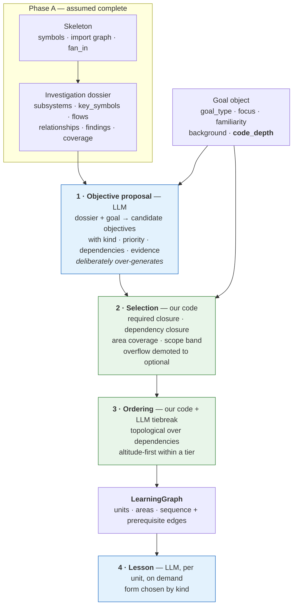
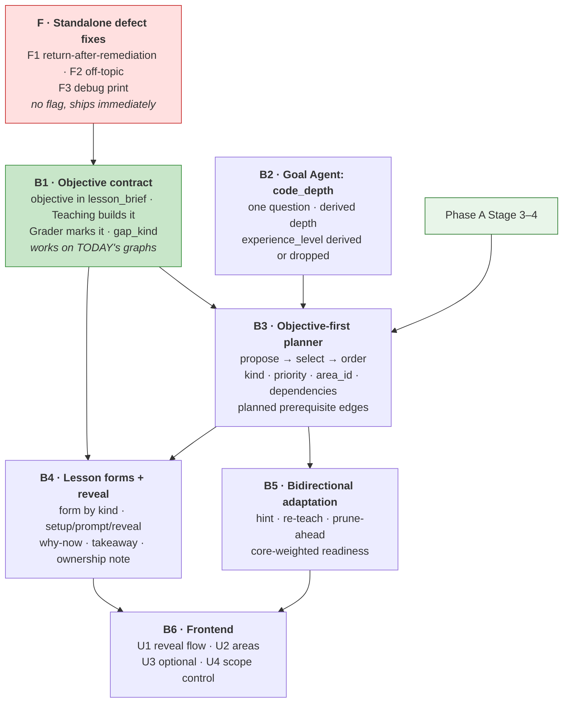

# Learning Engine — From Code Tour to Curriculum

> **Status:** planning only. No production code, prompts, schemas, tests or migrations changed.
> **Depends on:** [`repo-understanding.md`](repo-understanding.md). This phase starts
> after that migration reaches at least Stage 3. See [§1](#1-context-and-dependency-on-repo-understanding).
> **Last updated:** 2026-08-13

This document is the source of truth for **what CodeOnboard decides a specific human
should learn from a repository, how it teaches that, how it verifies understanding,
and how it adapts.**

It is the second half of a pair:

| | Question | Document |
|---|---|---|
| **Phase A** | *Understand the repository well enough to reason over it* | [`repo-understanding.md`](repo-understanding.md) |
| **Phase B** | *Decide what this human should learn from that understanding, teach it, verify it, adapt* | **this document** |

Phase A rebuilds the evidence layer beneath the Mentor, Teaching and Mutator agents.
Phase B rebuilds what those agents *do with* that evidence. The two are deliberately
sequenced, not merged: Phase A's own scope statement excludes the learning graph,
grading and the AI-critique direction, and this document does not re-specify any part
of repository exploration, retrieval, chunk selection or anchor grounding.

This phase supersedes the curriculum design in [`phase3.md`](phase3.md). Phase 3's
persistence, traversal, translation and session machinery survive; its *planning model*
(a flat chain of chunk-anchored nodes, sized by a number in a prompt) does not.

**Done when:** see [§14](#14-done-when).

**Reading guide.** [§1](#1-context-and-dependency-on-repo-understanding) is the phase
boundary — read it before anything else, because roughly a third of the problems in the
original investigation are **not owned by this phase**. [§2](#2-current-learning-engine-limitations)
is what *is* owned. [§3–9](#3-product--learning-principles) are the design.
[§10–13](#10-dataschema-implications) are the plan. [§15](#15-design-decisions)
separates what is settled (LD#) from what is genuinely open (LQ#) — nothing in §3–9
should be treated as settled unless it is restated there.

---

## 1. Context and dependency on repo-understanding

### 1.1 Why this phase comes second

The learning engine's biggest current failure — a curriculum of ~6 nodes chosen from a
slice of ~20 chunks, drawn from a module map built from an alphabetical prefix of the
repository — has **two independent causes**:

1. The system could not see the repository properly. *(Phase A)*
2. The system had no representation of a learning objective independent of a code chunk,
   and no mechanism to decide how much to teach. *(Phase B)*

Fixing (2) before (1) would produce a well-structured curriculum planned over the wrong
evidence. Phase A's Stage 3 (`goal_investigation` becomes a pipeline stage) is the point
at which evidence coverage actually changes; before that, a better planner has nothing
better to plan from.

### 1.2 The contract — what this phase may assume

Once Phase A reaches Stage 3–4, curriculum planning **may assume all of the following
already exist** and must not rebuild any of them:

| # | Assumed capability | Delivered by |
|---|---|---|
| C1 | A complete, deterministic **skeleton**: file tree, roles, LOC, symbol index (name → file, line range, kind, parent, docstring), import graph, fan-in / fan-out | Phase A Layer A, `backend/repo/skeleton.py` |
| C2 | **Structural importance is measurable** — `fan_in` and public-API membership are available without an LLM. Similarity is no longer the only importance signal (Phase A P4) | Layer A / `symbols` tool |
| C3 | A persisted, anchored **Investigation dossier**: `subsystems`, `key_symbols`, `flows` (ordered anchored steps across files), `relationships`, `findings` (risk / extension_point / test_gap / boundary), `doc_refs`, `coverage`, `trace` | Phase A Layer C, `state.investigation` |
| C4 | **Coverage is enforced by code**: every required subsystem is `covered` or `skipped_with_reason`; silent omission fails validation (Phase A D13) | Phase A §5.6 |
| C5 | **Grounding is against the repository, not a retrieval slice.** The planner emits `(file, symbol)`; our code resolves the range. Hallucinated ranges are structurally impossible; grounding no longer caps curriculum scope (Phase A D1, D3) | `backend/repo/anchors.py::resolve()` |
| C6 | **Cross-file flows and relationships are first-class evidence**, with anchors per step | dossier `flows` / `relationships` |
| C7 | `CodeAnchor.symbol` is persisted alongside the resolved line range (Phase A D14) | additive `symbol` column |
| C8 | Goal-type differentiation is expressed as **exploration exit criteria**, not retrieval constants | Phase A §5.5 |
| C9 | Repository knowledge **persists** rather than dying with the request | Phase A D4 |
| C10 | Bounded session-time top-up exists for Teaching (≤3 tool calls on `flow` nodes) and the Mutator (≤5) | Phase A §6 |

### 1.3 What this phase must *not* assume

These are open in Phase A. Phase B must degrade cleanly for each, and must not be
designed in a way that forces a Phase A hypothesis to resolve one particular way.

| Uncertainty | Phase A ref | Phase B must therefore |
|---|---|---|
| The Reviewer may be deleted | H2 | Read findings from the **dossier**, not from `state.system_review`. Treat a Reviewer pass as an optional enrichment of the same fields |
| Prioritization may be absorbed | H5 | Never depend on `state.relevant_modules` |
| Layer B (Survey) may be dropped entirely | H1 | Depend on the *dossier*, never on a survey artifact by name |
| Multi-language support is undecided | OQ1 | Not assume non-Python repos work; not block on them either |
| A dossier may be missing at session time | D12 | **Planning** may require a dossier (it runs when one exists by construction). **Teaching, Grader and adaptation must not.** Every session-time feature needs a defined no-dossier path |
| Exploration is non-deterministic | RK4, M10 | Not build curriculum logic that assumes byte-identical evidence between runs |

### 1.4 Problem ownership — every finding from the investigation, assigned

This table exists to prevent duplicated work. It is the single most important table in
this document.

| Finding from the investigation | Owner | Status |
|---|---|---|
| Module map built from an alphabetical prefix of ≤80 chunks (`MAX_CHUNKS`) | **Phase A** | Solved — Layer A + coverage contract (P2, D13) |
| Retrieval slice (`top_k` 16–28) is the hard ceiling on curriculum size | **Phase A** | Solved — grounding decoupled from evidence (P1, D1) |
| No repo metrics: no LOC, package tree, import graph, fan-in, entry points | **Phase A** | Solved — Layer A skeleton (C1, C2). **The "repo profile" proposed in the investigation is this, and must not be rebuilt** |
| Structural importance unmeasurable; similarity ≠ pedagogical importance | **Phase A** | Solved — `fan_in` (P4) |
| No call graph / import graph / usage lookup; `flow` nodes inferred, not traced | **Phase A** | Solved — `relationships`, `neighbors`, `flows` (P3, C6) |
| Planning-time evidence gathering is a single blind pass | **Phase A** | Solved — `goal_investigation` stage (D11) |
| Per-node supporting context is 2 similarity chunks matched on the node title | **Phase A** | Solved — named neighbours from the dossier (Stage 4) |
| Mutator picks remediation from 5 similarity chunks | **Phase A** (evidence) / **Phase B** (selection policy) | Split — P6/D8 give candidates; *when to remediate at all* is §9 here |
| Anchor grounding constrains what may be taught | **Phase A** | Solved — D1 |
| Python-only chunking | **Phase A** | Open there (OQ1) |
| Retrieval runs twice identically | **Phase A** | Solved — P7 |
| `depth` is never asked; Haiku invents it | **Phase B** | §5 |
| Curriculum size is a suggestion in a prompt (`4–5 / 5–7 / 7–10`) | **Phase B** | §6 |
| Curriculum is a schema-locked linear chain (`Literal["sequence"]`) | **Phase B** | §4, §6.4 |
| Every node must be exactly one code anchor | **Phase B** | §4.1, §10 |
| Architecture / flow / boundary exist only as tags on a chunk | **Phase B** | §4.2 |
| No explicit learning objective shared planner → teacher → grader | **Phase B** | §7, §8 |
| One locked pedagogical form (`predict-then-reveal`) | **Phase B** | §7.2 |
| Predict-before-reveal contradicted by the UI | **Phase B** | §7.3, §11 |
| Grader marks against `expected_answer`, not a stated objective | **Phase B** | §8 |
| Adaptation is one-directional (remediation only) | **Phase B** | §9 |
| Post-prerequisite skip contradicts the documented design | **Phase B — but fix independently** | §2.3 |
| `readiness()` denominator overclaims | **Phase B** | §10 |
| `"Use it in my own project"` → `understand_component` | **Phase B — sequenced after Phase A Stage 2** | §5.4 |
| No cross-session learner knowledge | **Phase B** | Deferred, §13 |

### 1.5 Cross-phase seams that need coordination

Three places where a Phase B change touches a Phase A file. Each is a sequencing
constraint, not a merge.

| Seam | Constraint |
|---|---|
| **Adding a `goal_type`** (§5.4) | `goal_type` keys the exploration exit criteria that replace `profiles.py` (C8). A new goal type needs exit criteria written in Phase A's structure. **Do this after Phase A Stage 2, or not at all this phase.** |
| **`code_depth` influencing exploration** (§5.2) | Code depth plausibly belongs in exit criteria ("establish implementation detail for the N most central symbols"). Whether it does is [LQ3](#152-open-lq). Default: it shapes *selection and teaching only*, leaving Phase A untouched. |
| **Curriculum needs evidence the dossier lacks** | **Phase B must not open its own exploration loop** (Phase A D5, D11). The correct response is to strengthen `goal_investigation`'s exit criteria — a Phase A change. This is the anti-duplication rule of the whole plan. |

---

## 2. Current learning-engine limitations

What this phase is actually responsible for fixing. Grounded in current code.

### 2.1 Structural limitations

| # | Limitation | Where | Enforced by |
|---|---|---|---|
| **L1** | **Curriculum size is a prompt suggestion keyed on an un-elicited field.** `overview → 4–5`, `moderate → 5–7`, `deep → 7–10` | `backend/agents/mentor/agent.py` `_SYSTEM_PROMPT`, "Calibration by goal fields" | Prompt only — no code check anywhere |
| **L2** | **`depth` is never asked.** `CORE_QUESTIONS` is `familiarity`, `goal_type_raw`, `primary_goal`, `background`; no question maps to `depth` or `experience_level`, yet both are required `GoalOutput` fields | `backend/agents/goal/questions.py`, `backend/agents/goal/agent.py` | Model inference |
| **L3** | **The curriculum is a linear chain, by schema.** `EdgeWire.kind: Literal["sequence"]` rejects anything else at parse time; the prompt demands exactly N−1 edges, no branching | `backend/agents/mentor/agent.py` | Code |
| **L4** | **A learning unit *is* a code chunk.** `LearningNode.code_anchor: CodeAnchor` is required and single-valued | `backend/learning/graph.py` | Code |
| **L5** | **Therefore architecture, flows and boundaries are not curriculum units** — they are `concept_tags` on a node that must still point at one contiguous range. A flow that crosses three files is anchored on one of them | `mentor/agent.py` tag vocabulary | Consequence of L4 |
| **L6** | **No shared learning objective.** The planner emits `lesson_brief = {why, understand}` (two sentences); Teaching writes its own `expected_answer`; the Grader marks the answer against *that*, not against what the planner intended | `mentor/agent.py` → `teaching/agent.py` → `grader/agent.py` | Convention |
| **L7** | **One pedagogical form.** `prompt_kind: Literal["predict-then-reveal"]`, walkthrough ≤250 words, whole response ≤600 | `teaching/agent.py` `LessonOutput` | Code |
| **L8** | **The one active-learning mechanism is neutralised by the UI.** The prompt instructs the model to ask for a prediction *before* the explanation; `LessonPanel` renders the full walkthrough above the prompt | `frontend/components/LessonPanel.tsx` | Frontend layout |
| **L9** | **Adaptation is one-directional.** The only structural mutation is "insert one prerequisite before a confused node". `deeper` edges are defined and never created. Nothing shortens or deepens a journey in response to strong performance | `backend/agents/mentor/mutator.py` | Code |
| **L10** | **`readiness()` counts every node equally** and a grading failure defaults to `partial`, which counts as half-progress | `learning/graph.py`, `grader/agent.py` | Code |

### 2.2 What must be preserved

The investigation's clearest positive finding: **the session substrate is good and should
not be rewritten.** Specifically —

- `backend/learning/store.py` — SQLite, schema-versioned, additive `ALTER TABLE`
  discipline. Phase A extends it additively; Phase B should too ([LD6](#151-accepted-ld)).
- `learning/graph.py` traversal, `insert_before` / `insert_after` rerouting,
  `resume_point()`, `path_order()`, override handling, attempt history.
- The translation layer and its "translate, never regenerate" contract.
- The Grader's **rubric-by-concept-tag** — it already grades system-level understanding
  explicitly and is the right foundation for §8.
- The agent conventions: injected client, append to `state.errors`, never raise.

### 2.3 Defects to fix independently — not part of this redesign

These are current-behaviour problems. They should be fixed as small standalone changes
whenever convenient, and **must not be bundled into the redesign** or used to justify it.

| # | Defect | Location | Note |
|---|---|---|---|
| **F1** ✅ | After a remediation prerequisite, `/advance` marks the *original failed node* visited and jumps past it — the learner never returns to the concept they failed | `backend/api.py`, `session_advance` | The code comment asserted this was deliberate; `learning/graph.py`'s traversal comment and `phase3.md` Part 6 both asserted the opposite ("teaches the prerequisite, then returns to the original node"). **Fixed 2026-08-15** — the special case is gone, `next_in_path` already walks the prerequisite edge back to the failed node, and the return is pinned by a test |
| **F2** ✅ | `off-topic` maps to `failed`, which trips the sticky `weak_spot` flag — "I don't know" permanently marks a weak spot | `grader/agent.py` `_CLASSIFICATION_TO_STATE` | **Fixed 2026-08-14** in `5fe4cf7` — see the decision log |
| **F3** ✅ | Debug `print` of node ids and the full edge list on every advance | `backend/api.py`, `session_advance` | **Fixed 2026-08-15.** That print was already gone; the one that remained fires only on a teaching fallback and is a genuine diagnostic, so it moved to `logging` rather than being deleted |
| **F4** ✅ | `extra_docs` matching requires the node's filename stem to appear in the docs path, so it almost never fires | `teaching/agent.py` `_format_doc_context` | **Fixed 2026-08-15.** Phase A completed without folding the Documentation Agent into the skeleton, so there was nothing left to coordinate with. See the decision log for the matching rule |

---

## 3. Product / learning principles

Durable statements of what the system optimises for. If an architectural decision later
in this document is reversed, these still hold.

**LP1 — Optimise for a transferable mental model, not repository coverage.**
Success is the learner answering *ownership questions* about a system they have barely
read: what does this part own, where does data enter, what breaks if I change X, where
does a new feature belong. Coverage is not evidence of understanding. Teaching the
repository file-by-file is an explicit non-goal.

**LP2 — Every curriculum unit must earn its place.**
The default answer to "should we teach this?" is *no*. A unit earns inclusion by being
relevant to the goal, structurally important, and non-obvious. A unit that teaches
something a competent developer would infer in thirty seconds from a filename is
negative value: it spends attention and inflates the progress signal.

**LP3 — Altitude first; code depth is a dial the user holds.**
The default curriculum is system-shaped: architecture, responsibilities, boundaries,
runtime flows, state ownership, contracts and invariants, integration points, extension
points, design decisions, risk areas, where a change belongs and what it would affect.
Implementation detail is taught when it is load-bearing, or when the user asked for it —
never as the definition of "understanding code".

**LP4 — Breadth and depth are two dimensions, not one.**
*Scope* (how much of the system the journey covers) and *code depth* (how far into
implementation it goes) vary independently. A broad shallow tour and a narrow deep dive
are both legitimate and must be expressible.

**LP5 — In an AI-assisted workflow, the valuable human understanding is the supervision layer.**
For any concept there is a defensible answer to: *must the learner hold this themselves,
do they mainly need to be able to check it, or can it be delegated to an assistant while
they retain enough system understanding to supervise the result?* This is a **selection
and framing principle** — it shapes which objectives are chosen and how lessons are
written. Whether it becomes stored metadata is a separate, smaller question ([§4.4](#44-own--supervise--delegate-principle-not-schema)).

**LP6 — Assess understanding, not recall.**
The system grades whether the learner can make the claim the lesson set out to build, in
their own words, at the right altitude. Reproducing phrases from the walkthrough is not
evidence.

**LP7 — Grounding and persistence are the moat; keep them.**
Every claim traces to real files and symbols; the learner's understanding persists across
sessions. Phase A strengthens the first. This phase must not weaken either in pursuit of
richer curriculum structure.

---

## 4. Target learning model

### 4.1 The learning unit

A learning unit is **a learning objective with supporting evidence**, not a code chunk
with a title. Conceptually:

```
Learning Unit
  objective      the checkable claim the learner should be able to make afterwards
  kind           what sort of understanding this is  (§4.2)
  priority       required | recommended | optional   (§6.3)
  anchors        one or more VERIFIED anchors — ordered, all equally real
  display_anchor which anchor the UI opens by default (derived, not a claim)
  brief          why this, why now, what to take away
```

Three changes from today, all of them consequences of L4–L6:

1. **`objective` becomes the contract** between planner, teacher and grader (§7, §8).
   Today `lesson_brief.understand` is the nearest thing and it is advisory prose.
2. **Evidence is a set, not a point.** A `flow` unit is grounded in an ordered sequence of
   anchors across files — which Phase A's dossier already produces (C6). A `boundary` unit
   is grounded on *both* sides of the seam. A `synthesis` unit is grounded in the anchors
   of the units it connects. In each case the locations are **equally important**, and
   nominating one of them as "the" anchor would be a false claim about the evidence.
3. **The grounding invariant is `len(anchors) >= 1`, and every anchor is verified.**
   Not "exactly one". Each anchor resolves through Phase A's `resolve()` (C5) —
   verification is per-anchor and unchanged; there is simply more than one call.

> **The invariant is grounding, not cardinality.** Ungrounded conceptual units remain
> forbidden — that is [LP7](#3-product--learning-principles), and it does not weaken here.
> What changes is that "grounded" stops meaning "reducible to one contiguous range".
> A concept that genuinely lives in three places is grounded by three verified anchors,
> not by picking one and hoping the lesson explains the rest.

#### 4.1.2 The read-time grounding guarantee

Verification happens at plan time; **reading happens at lesson time**, and a range that
resolved when the curriculum was planned can still fail to load when the lesson is
rendered — a moved file, a changed checkout, a re-clone. Multi-anchor units make the
partial case common enough to need a stated rule, and it is asymmetric:

| At lesson time | Behaviour | Why |
|---|---|---|
| **Some** anchors fail to load | **Degrade.** Teach from the anchors that loaded, and record the failures | A four-step flow whose third step went stale is still a real three-step flow. Failing the lesson would spend a verified unit to punish one bad range |
| **All** anchors fail to load | **Fail the lesson.** Never generate | With no source, the model has only the objective — and it will write a complete, fluent, confident lesson out of it. That is not a degraded lesson; it is an ungrounded one wearing the same shape |

The second row is the load-bearing half, and it is **not** an implementation detail of the
teaching agent. A unit's grounding is a claim that what the learner is told traces to code
that was actually read. A source-less lesson breaks that claim *silently* — nothing in the
output looks wrong, which is precisely why it has to be refused at the point of reading
rather than caught downstream.

A multi-anchor unit with no readable anchor is in exactly the same position as a
single-anchor unit whose file is gone, and must fail the same way: the caller records the
error and the session shows its "read the source directly" fallback. Losing one lesson is
the correct price; the alternative is teaching something nobody verified.

> This was found by probing real lessons, not by review: a `flow` unit whose two anchors
> both pointed at a moved path rendered a complete lesson that read as authoritative.
> Discovering it that way is the argument for stating it here — the failure is invisible in
> the output, so only an explicit rule keeps a future change from reintroducing it.

### 4.1.1 `display_anchor` is a UI affordance, not part of the learning model

The UI needs *somewhere* to open the code pane, and the rail needs a file path to show
under a title. That is a navigation concern, and it must not leak back into the design of
the curriculum ([LD13](#151-accepted-ld)).

- `display_anchor` is **derived**, by a rule per kind: the entry point of a `flow`, the
  owning side of a `boundary`, the anchor itself when there is only one, the first anchor
  otherwise. It carries no claim that this location matters most.
- It is what the existing `nodes.file` / `line_start` / `line_end` columns store, so
  `CodeViewer`, `RouteRail`, `MapView` and the completion screen keep working untouched —
  those columns become a **denormalized display projection of `anchors`**, not the
  definition of the unit ([§10](#10-dataschema-implications)).
- Phase A's `CodeAnchor.symbol` (C7, D14) applies per anchor, so every anchor in the list
  is commit-durable, not just the displayed one.

**Consequence for the planner's wire format:** the Mentor's `NodeWire` gains an anchor
*list* (`[{file, symbol}, ...]`) in place of singular `file` / `line_start` / `line_end`.
That is a B3 change and is already inside its scope; Phase A's C5 contract — the model
names symbols, our code resolves ranges — is unchanged, and applies to each entry.

> Those three columns are `NOT NULL` today, which is why every unit still carries a
> display anchor rather than making it optional. That is an engineering convenience, not a
> product rule. If a unit kind ever genuinely warrants no code pane, `page.tsx` already
> degrades gracefully on a null file and the columns can be relaxed additively.

### 4.2 Kinds of learning unit

**Reuse the existing concept-tag vocabulary rather than inventing a parallel taxonomy.**
`architecture`, `flow`, `extension_point`, `risk`, `test_coverage`, `component` already
exist, are shared by four agents, and already have colours in `frontend/lib/tags.ts` and
translations in `lib/i18n/`. A unit's `kind` is **one primary tag drawn from that
vocabulary**, plus free-form domain tags exactly as today.

Two additions, and only two:

| New kind | Why it is needed | Priority |
|---|---|---|
| `synthesis` | A unit that connects several previously-taught units and introduces no new code. There is no way to express this today, and it is where a mental model actually consolidates | Must-have |
| `boundary` | `architecture` currently absorbs both "what this layer owns" and "what crosses this seam". Splitting them lets the grader ask the right question | Optional refinement — start by keeping it inside `architecture` |

Each kind implies a lesson form and a grading rubric (§7.2, §8.2). That mapping is the
mechanism by which "different concepts use different teaching methods" becomes real
rather than aspirational.

### 4.3 Grouping — areas

**Decision: yes, one level of grouping, expressed as lightweight metadata rather than a
new entity** ([LD3](#151-accepted-ld)).

*Why any grouping.* For `psf/requests` a flat list of 8 units is fine. For `fastapi` a
flat list of 18 is unnavigable, and — more importantly — illegible *as a mental model*.
The learner cannot see the shape of what they are learning, which is the exact thing the
product claims to teach. Grouping also gives natural stopping points ("you now understand
routing; continue to dependency injection?").

*Why lightweight.* Phase A's dossier already produces `subsystems`. An area is, in the
common case, a subsystem the curriculum decided to teach. It needs a title, a one-line
"why this matters for your goal", and an order. It does **not** need its own table, its
own state machine, its own traversal, or its own persistence lifecycle.

*Chosen shape:* areas live as an ordered list on the session (a JSON column, exactly like
`doc_context_json` and `goal_translations_json` today), and each unit carries an `area_id`
string. No new table, no new relations, no traversal change.

**Journey → Area → Learning Unit. Two levels. No third level.** Checkpoints are a `kind`
of unit, not a fourth tier.

### 4.4 `own / supervise / delegate` — principle, not schema

The product principle ([LP5](#3-product--learning-principles)) is sound and is the
sharpest expression of the project's AI-era positioning. The question is whether it needs
to be a stored enum on every unit.

Assessed against the four uses it could serve:

| Use | Needs storage? | Verdict |
|---|---|---|
| Shapes **which** objectives are selected | No — it is a selection instruction in the planner prompt | Adopt as prompt guidance |
| Shapes **how** a lesson is framed | No — it can be a required line in the lesson body | Adopt as lesson content |
| Shown to the user as a per-unit badge | Yes | Not obviously worth a schema field until we have seen real lessons |
| Aggregated ("you must personally own 5 of these 12 concepts") | Yes | Attractive, but speculative |

**Decision:** keep it as a principle in the planner prompt and as one required sentence in
the lesson ("what to hold yourself here, and what you can safely delegate"), with **no
mandatory node field** ([LD4](#151-accepted-ld)). If the aggregate view proves compelling
after we have seen lessons, promoting it to a field costs one key in an existing JSON
payload — no migration. This is deliberately the reversible choice.

### 4.5 What we are explicitly not building

| Rejected | Why |
|---|---|
| Four-level hierarchy (journey → module → topic → lesson → checkpoint) | Two levels plus a `kind` field covers every case identified. Depth for conceptual purity |
| Branching optional *paths* as separate traversals | `priority: optional` on the same spine gives the same expressiveness with no traversal or frontend rework |
| A parallel `kind` taxonomy separate from `concept_tags` | Duplicates a vocabulary four agents, the frontend and the i18n dictionaries already share |
| Formal mastery modelling (BKT / IRT) | The attempt history is a sufficient signal at this scale. See [§9.4](#94-what-we-are-not-building) |
| Replacing `LearningGraph` | Its traversal, mutation, persistence and resume logic are the most battle-tested code in the repo |

---

## 5. Goal and personalization model

### 5.1 Two dials, not one

Per [LP4](#3-product--learning-principles):

| Dial | Meaning | Source |
|---|---|---|
| **Scope** | How much of the system the journey covers | Derived from `goal_type` + focus + repository scale (§6.3) |
| **Code depth** | How far into implementation the journey goes | **Asked explicitly** |

Today a single inferred `depth` field conflates both, and it is the field that decides
curriculum size (L1, L2). Separating them is the personalization change of this phase.

### 5.2 One new question, and only one

Onboarding is already 5–6 questions. **Exactly one is added** ([LD1](#151-accepted-ld)),
phrased as outcomes rather than levels:

> **How deep into the actual implementation do you want to go?**
> - *Give me the map* — architecture, responsibilities, flows, key decisions. Code only where it is essential.
> - *I'll be working in here* — the above, plus the implementation details I would need to change things safely.
> - *I need to master the internals* — algorithms, data structures and critical code paths in depth.

→ `code_depth: "map" | "working" | "implementation"`, carried on the goal object, mapped
to a stable English key through the existing `OPTION_KEYS` mechanism and translated in
`questions.py` like every other question.

`code_depth` influences: objective **selection** (§6.3), lesson **framing** (§7), and the
`component`-vs-`architecture` balance of unit kinds. Whether it should also influence
Phase A's exploration exit criteria is [LQ3](#152-open-lq); the default is **no**, keeping
this phase's changes inside this phase.

### 5.3 Scope is derived, not asked

Do **not** add a second question for scope or time. Instead:

- Derive an initial scope band from `goal_type` + `code_depth` + repository scale (§6.3).
- **Let the user adjust it after seeing the plan** — "this journey is 12 stops: make it
  shorter / go deeper". Adjusting a visible plan is a better interaction than predicting
  your own appetite before seeing the repository, and it costs no interview time.

`depth` remains on the goal object for compatibility, but becomes a **derived** value
rather than a model guess ([LD2](#151-accepted-ld)).

### 5.4 Existing signals, and one mapping to revisit

| Signal | Today | This phase |
|---|---|---|
| `familiarity` (4 options) | Calibrates entry point and orientation budget in the Mentor and Teaching prompts | Keep. It is genuinely useful and already elicited |
| `background` (free text) | Prose in the Teaching prompt; drives skip-what-they-know | Keep as free text. **Do not** convert to a structured prior-knowledge matrix |
| `experience_level` | Invented by Haiku | Derive in Python from `background`, or drop. A hallucinated field should not calibrate lessons |
| `goal_type` | 6 values | See below |

**The `"Use it in my own project"` → `understand_component` mapping is wrong.** A developer
who wants to *use* a library needs the public API surface, common idioms and extension
points — not a deep dive into one internal feature. This is probably the single most
common real entry point.

However, `goal_type` keys Phase A's exploration exit criteria (C8). Adding a value is a
**cross-phase change** (§1.5). Therefore:

- **In scope now:** re-point the option to `understand_system` or `understand_architecture`
  (a one-line change with no new exit criteria required), *or* leave it and note it.
- **Deferred:** a dedicated `use_library` goal type, to be added once Phase A's exit-criteria
  structure is stable. Recorded as [LQ5](#152-open-lq).

---

## 6. Curriculum planning flow

### 6.1 End-to-end



### 6.2 Responsibility split

| Step | Who | Why |
|---|---|---|
| Propose candidate objectives, with kind, dependencies and evidence pointers | **LLM (Sonnet, one call)** | Judging what is worth understanding about a system is exactly what a model is good at. Deterministic code cannot do this |
| Assign a coarse priority label (`required` / `recommended` / `optional`) per objective | **LLM** | Judgement, but coarse — three buckets, not a score |
| Enforce required-set closure, dependency closure, area coverage, scope band | **Our code** | Predictable, testable without an LLM, and the direct fix for L1 |
| Topological ordering over dependencies | **Our code** | Deterministic |
| Order within a dependency tier | **LLM, from the same call** | Pedagogical sequencing is judgement |
| Resolve `(file, symbol)` → line range; verify every anchor | **Our code** (Phase A C5) | Already solved upstream |
| Write the lesson | **LLM (Haiku, per unit)** | As today |

**The planner does not explore.** It reads the dossier (§1.5). If the dossier is
insufficient for a good curriculum, that is a signal to strengthen `goal_investigation`'s
exit criteria — a Phase A change, not a Phase B loop.

> **On over-generation.** Asking a model for "the 12 things worth learning here" produces
> worse output than asking for "everything worth learning here, ranked", then cutting. The
> model is being asked to enumerate, which it does well, instead of to self-limit, which it
> does badly. The cut is where determinism belongs. **This is the structural replacement
> for "generate 6–10 nodes".**

### 6.3 Sizing — how the journey's length is actually decided

Three mechanisms, in order of authority:

**1 · The required set is the floor.** Every objective the model labelled `required` for
this goal, plus the dependency closure of that set, is in the curriculum. This is what
prevents a superficial journey: a goal that genuinely needs eleven concepts gets eleven,
regardless of any target number.

**2 · Area coverage is a breadth obligation.** Every area the curriculum touches
contributes at least one unit. This mirrors Phase A's coverage contract (C4) at the
curriculum level, and prevents tunnel vision on one subsystem.

**3 · A scope band is a guard, not a target — and the numbers are provisional.**
A coarse table, not a formula:

| `code_depth` | Typical journey | Guard band | Status |
|---|---|---|---|
| `map` | 11–15 units | 5–**18** | **Ceiling calibrated 2026-08-15** (was 14) — see below |
| `working` | 13–17 units | 8–22 | Ceiling **uncalibrated**, but measured as behaving correctly |
| `implementation` | 18–24 units | 10–28 | Ceiling **uncalibrated**, but measured as behaving correctly |

> All three **floors** remain uncalibrated judgement, and are inert: the smallest core
> observed across 18 runs was 9 and the smallest journey 11, so none came close to firing.
> The floor is advisory and only logs, so an inert floor costs nothing — but it is not
> evidence-backed either.

Repository scale (from the skeleton, C1) and `goal_type` nudge *within* the band; they do
not move it. A narrow goal on a small repo legitimately lands below the typical range —
the band exists to catch pathological output, not to be hit.

> **These numbers are starting values, not product constants.** They were chosen by
> judgement, not measured, and the plan must not treat them as settled — that would
> reintroduce the exact defect this section exists to remove (L1: a curriculum size that
> nobody can justify). They are recorded here so B3 has something concrete to run with, and
> they are expected to move.

**Calibration procedure** (runs during B3, cheap because it needs no lessons):

1. Run objective proposal + selection across the matrix already defined for Phase A's
   evaluation — `psf/requests` × `fastapi/fastapi` × the goal types × the three
   `code_depth` values, ≥3 repeats per cell for variance.
2. For each cell record **the size of the required set plus its dependency closure**,
   before any band is applied. That number is what the curriculum genuinely needs; the
   band is only a guard around it.
3. Set each band so that it **binds rarely** — the upper bound should fire only on
   genuinely pathological output, not on normal large-repo runs. A band that fires on a
   majority of `fastapi` cells is mis-set, and the correct response is to widen the band,
   not to prune real requirements.
4. Record the calibrated values, the date, and the runs they came from, in this document.
   Until that entry exists, the table above is explicitly a placeholder.

Keep the bands **coarse** afterwards. Three buckets of two integers is the right
resolution for a signal this soft; per-goal-type or per-repo-size bands would be tuning
noise dressed as precision, and would be unfalsifiable at this sample size.

#### Sanity pass — 2026-08-15 (NOT the calibration)

Four cells, one attempt each, run after B3 landed to catch structurally wrong or wildly
mis-sized output before spending the repeats. Raw data:
[`evidence/b3-sanity-matrix.json`](evidence/b3-sanity-matrix.json). **The bands below are
unchanged and still carry their [LD14](#151-accepted-ld) marker** — four single runs are
not a calibration, and nothing here was used to move a number.

| cell | proposed | core (pre-band) | journey | optional | areas | multi-anchor | band bound | structural |
|---|---|---|---|---|---|---|---|---|
| `requests` × `map` | 14 | 12 | 14 | 0 | 4 | 9/14 (max 4) | no (5–14) | 6/6 |
| `requests` × `implementation` | 22 | 15 | 22 | 0 | 7 | 10/22 (max 6) | no (10–28) | 6/6 |
| `fastapi` × `map` | 11 | 9 | 11 | 0 | 5 | 7/11 (max 5) | no (5–14) | 6/6 |
| `fastapi` × `implementation` | 16 | 10 | 16 | 0 | 4 | 11/16 (max 5) | no (10–28) | 6/6 |

Structural checks (all passing, all four cells): every anchor on every unit resolves;
the display columns equal one member of `anchors`; `path_order()` reaches every node;
no prerequisite cycles; every dependency is taught before the unit declaring it; every
declared area contributes a non-optional unit.

What it establishes:

- **`code_depth` changes composition, not merely length, on both repositories.**
  `requests` goes architecture-led at `map` (architecture 4, component 2) to
  component-led at `implementation` (component 10, architecture 3); `fastapi` does the
  same (component 2 → 8). This is [§14](#14-done-when) outcome 2, on both target repos.
- **Multi-anchor units are real, not theoretical.** 9–11 units per journey span several
  files, up to six anchors, and **grounding dropped nothing in any cell** — every
  objective kept every anchor it proposed. [§14](#14-done-when) outcome 4.
- **Priority assignment discriminates.** `core` is below `journey` in every cell
  (12<14, 15<22, 9<11, 10<16), so `required` vs `recommended` is a distinction the
  planner actually draws rather than a rubber stamp.
- **The bands did not bind anywhere**, at either boundary. An earlier discarded run of
  `requests` × `map` did hit the ceiling at 14 while the recorded run landed at 14
  without binding — same cell, same prompt. That variance is the reason four runs
  cannot move a band.

Open observation, recorded rather than acted on: **`optional` is 0 in all four cells**
— see [LQ8](#152-open-lq).

#### Calibration — 2026-08-15 (the full ≥3-repeat matrix)

Six cells (both repos × all three `code_depth` values) × 3 repeats = **18 planning runs,
0 failures, 0 grounding drops**. Raw data:
[`evidence/band-calibration.json`](evidence/band-calibration.json). Each cell investigated
**once** and planned three times against that one dossier, because §6.3 calibrates
"objective proposal + selection" — repeats measure *planner* variance, not exploration
variance. **The bands below were not changed by this run.**

| cell | band | core (pre-band) | journey | ceiling fired | areas |
|---|---|---|---|---|---|
| `requests` × `map` | 5–14 | 9, 10, 11 | 11, 13, **14** | 0/3 | 5–6 |
| `requests` × `working` | 8–22 | 10, 11, 13 | 13, 14, 17 | 0/3 | 5–6 |
| `requests` × `implementation` | 10–28 | 15, 16, 18 | 20, 22, 24 | 0/3 | 7 |
| `fastapi` × `map` | 5–14 | 11, 11, 13 | **14, 14, 14** | **2/3** | 4 |
| `fastapi` × `working` | 8–22 | 10, 11, 13 | 13, 14, 16 | 0/3 | 4–5 |
| `fastapi` × `implementation` | 10–28 | 10, 13, 16 | 18, 18, 20 | 0/3 | 5–6 |

**Verdict, per band:**

- **`map` (5–14) — the ceiling binds too often.** It fired on 2 of 3 `fastapi` repeats and
  pinned the journey at exactly 14 in all three, with **zero variance**. A journey whose
  size has no spread while its underlying demand does (core 11–13) is not a measurement;
  it is the clamp. §6.3 asks that the ceiling fire "only on genuinely pathological output",
  and a normal `map` run on a large repository is not pathological.
- **`working` (8–22) — appropriate.** Never fired on either repo; the largest observed
  journey was 17, leaving five units of slack.
- **`implementation` (10–28) — appropriate, arguably loose.** Never fired; largest journey
  24 against a ceiling of 28.
- **All three floors (5 / 8 / 10) — inert.** The smallest core observed anywhere was 9 and
  the smallest journey 11, so no floor came close to firing. They cost nothing (the floor
  is advisory and only logs) but they are not doing anything either.

**The finding underneath the map result: core demand is much flatter across `code_depth`
than the bands assume.** Core ran 9–13 for `map`, 10–13 for `working`, and 10–18 for
`implementation` — while the ceilings step 14 → 22 → 28. Depth changes *composition* far
more than it changes *size*, which is exactly what [LP4](#3-product--learning-principles)
predicts and what the kind distributions confirm (`component` share rises from 2–3 to 7–10
on `requests`, 4–7 to 6–7 on `fastapi`). A `map` ceiling set well below the `working` one
therefore clamps a demand that is barely smaller.

**Bearing on [LQ8](#152-open-lq):** overflow demotion *does* now fire — but only in
`fastapi` × `map`, i.e. only where the ceiling is the thing under suspicion. Everywhere
else `optional` units (0–2 per journey) are the planner's own labels, not band demotions
(`demoted_by_band` is 0 in 16 of 18 runs). So the cut mechanism is exercised, and what
exercises it is the one band the evidence says is mis-set.

**Not established:** anything about `goal_type`, which was held fixed at
`understand_architecture` across the whole matrix.

#### The `map` ceiling: 14 → 18

**Only the `map` ceiling changed.** `working` and `implementation` were left exactly as
they were: the same matrix showed neither firing, with slack of +5 and +4 over the largest
journey each produced, so the evidence gives nothing to correct and changing them would be
re-introducing judgement where measurement said "fine".

**What the old value was doing.** A guard band is supposed to be invisible on normal runs.
At 14 it was not: it fired in two of three `fastapi × map` runs and produced journeys of
14, 14, 14 — *zero variance* — while the demand underneath it still moved (core 11, 11,
13). Flattening the output variance of the thing you are trying to measure is the
signature of a clamp, not a guard.

**Deriving the new value.** The observed journeys understate demand, because they *are*
the clamped number. Unclamped demand is recoverable exactly: `demoted_by_band` counts the
units the planner wanted taught and the band demoted, so demand = `journey + demoted_by_band`.

| run | core | journey | demoted | **demand** |
|---|---|---|---|---|
| `requests × map` #1–3 | 11, 10, 9 | 14, 13, 11 | 0, 0, 0 | 14, 13, 11 |
| `fastapi × map` #1–3 | 11, 13, 11 | 14, 14, 14 | 0, 1, 1 | 14, **15**, **15** |

Across all six `map` runs: demand **11–15**, mean 13.7, sd 1.51.

Two independent margin rules land on the same number:

- **max + 2sd** = 15 + 3.0 = **18.0**
- **mean + 3sd** = 13.7 + 4.5 = **18.2**

**Why not smaller.** 15 is the smallest value that never binds on observed runs, but it
carries zero headroom — and a proposal of 16 was already observed, so the next ordinary run
would clamp again. 16 sits ~0.7sd above max, 17 ~1.3sd; both would bind on a run only
modestly larger than what we happened to sample. 18 is the smallest value at which binding
requires output genuinely unlike anything measured, which is what §6.3 asks a ceiling to be.

**Why not larger.** `working` and `implementation` happen to carry margins of +5 and +4
over their largest journeys, but those margins are judgement, not measurement — inheriting
them as a rule would launder a guess into a derivation. And 18 stays **4 clear of
`working`'s 22**, so the three ceilings remain ordered and distinct rather than collapsing
together.

**Why the ceilings need not scale steeply with depth.** Core demand is nearly flat across
`code_depth` (9–13 / 10–13 / 10–18) because depth changes *composition*, not *size*. A
`map` ceiling far below `working`'s was encoding a size difference that does not exist.

**Validation — `fastapi × map` at the new ceiling, 2 runs**
([`evidence/map-ceiling-check/`](evidence/map-ceiling-check/band-calibration.json)):

| | before (ceiling 14) | after (ceiling 18) |
|---|---|---|
| journeys | 14, 14, 14 | **11, 15** |
| journey sd | **0.00** | **2.83** |
| ceiling fired | 2 of 3 | **0 of 2** |
| largest journey vs ceiling | 14 = 14 (at the limit) | 15 vs 18 (+3 slack) |

Three things this establishes that the clamped matrix could not:

1. **The clamp is gone.** Journey-size variance returned — 11 and 15 where three
   consecutive runs had produced exactly 14. That variance is the planner responding to the
   goal rather than to the band.
2. **The reconstruction method was sound.** `journey + demoted_by_band` predicted an
   unclamped maximum of 15, and the unclamped runs produced exactly 15. The arithmetic used
   to derive 18 is therefore trustworthy, which matters because it is the same method any
   future recalibration will use.
3. **18 keeps real headroom** — +3 over the largest unclamped journey, comparable to
   `working`'s +5 and `implementation`'s +4.

One honest caveat: these runs re-investigated, so they carry a different dossier, and their
core came out at 9–10 against the matrix's 11–13. That is *cross-dossier* variance, which
the matrix deliberately excluded by sharing one dossier per cell — a reminder that the
recorded spreads are planner variance and the end-to-end spread is wider.

Not established, and explicitly not claimed: anything about variance (one attempt per
cell), and the isolated cost of the planning call ([LQ2](#152-open-lq)) — wall-clock was
measured for the whole pipeline, of which planning is one call among the survey and the
investigation.

**Overflow is demoted, never discarded.** Objectives that do not fit become
`priority: optional` units on the same spine, collapsed in the UI. This is what prevents
an exhausting journey while keeping depth one click away, and it is why we do not need
branching paths (§4.5).

> #### What `optional` means — the invariant (established by U4, 2026-08-15)
>
> **An `optional` unit is excluded from the default walk, and remains directly
> accessible.** Both halves are load-bearing, and every consumer must honour both:
>
> | | behaviour |
> |---|---|
> | `/advance` | steps **over** it |
> | `resume_point()` | skips it |
> | "stop N of M" | does not count it |
> | `readiness()` | excluded from the denominator; still counts in the numerator if completed |
> | route rail | collapsed behind "N optional stops" |
> | `path_order()` / the graph | **still present** — never deleted |
> | `jump` from the rail | reaches it normally, and it teaches and grades like any other unit |
>
> Before U4 the first four held and the walk did not, so a sixteen-unit graph reported
> "stop 3 of 15" and still made the learner pass through all sixteen. That inconsistency
> is what made "make it shorter" a relabelling rather than a change, and it made
> prune-ahead's claim to *shorten* a journey untrue.
>
> The rule that keeps the two halves coherent: **`optional` describes the promised
> journey, not the graph.** Nothing is removed, so nothing is lost and every earlier
> decision stays inspectable; what changes is only what the learner is walked through by
> default. A unit with **no** `priority` at all — a pre-B3 node, or anything the planner
> did not label — is *not* optional and stays on the walk.

**Deliberately not doing:** a weighted 0.0–1.0 importance score with a threshold. It would
be arithmetic dressed as rigour — the inputs are model judgements, and three ordered
buckets carry the same information with far less false precision. Determinism is applied
where it improves predictability (closure, band, coverage), not everywhere.

### 6.4 Ordering, dependencies and prerequisites

- Objectives declare `depends_on` at proposal time. **This is the change that makes
  prerequisites real:** today `prerequisite` edges exist only as post-failure remediation,
  so `resume_point()`'s prerequisite check is nearly vacuous on a fresh graph.
- Ordering is a topological sort over `depends_on`, with the model's proposed order as the
  tiebreak within a tier.
- Result: the initial graph is still **mostly a chain**, but it is a chain that came from a
  dependency structure rather than from a model emitting nodes in some order.
- `EdgeWire`'s `Literal["sequence"]` lock (L3) is relaxed to allow **planned `prerequisite`
  edges**, and only those. `deeper` remains reserved for session-time use (§9.3).

> Traversal does not change. `next_in_path` already walks sequence-then-prerequisite, and
> `path_order` / `resume_point` already handle both. This is why the graph model survives.

> **`prerequisite` now has two producers, and they mean different things.** A **planned**
> edge describes the curriculum's dependency structure and says nothing about the learner;
> a **remedial** one is an event in one learner's session — something went wrong here.
> Any consumer that asks "was this inserted after a mistake?" must distinguish them, and
> the edge kind alone cannot: the tell is that `insert_before` reroutes the incoming
> sequence edge onto the spliced node, so a **remedial node has no outgoing `sequence`
> edge** while a planned one does. B6 found this the hard way — the route rail rendered a
> planned graph as a sequence of failures, captioning nearly every stop "added after
> confusion". Recorded here and in `learning/graph.py`'s header because the next consumer
> to ask that question will otherwise repeat it.

### 6.5 "Complete enough for this user's goal"

A curriculum is complete when **all three hold**:

1. Every `required` objective and its dependency closure is present.
2. Every area the goal touches contributes at least one unit.
3. The learner can answer the goal's ownership questions (LP1) from the units present —
   assessed by the planner in a single self-check field, not by a separate LLM call.

Note what is *not* a criterion: a node count, a file-coverage percentage, or exhausting
the dossier.

---

## 7. Lesson generation model

### 7.1 The teaching contract

Today Teaching receives a brief and writes whatever it wants. The contract becomes:

**Teaching is given an objective and must build exactly that.** Every lesson carries:

| Element | Purpose | Today |
|---|---|---|
| `objective` | The claim the learner should be able to make | Absent (L6) |
| **Why now** | One line connecting to the previous unit | Absent |
| **Setup** | Framing + the code, *without* the answer | Merged into `walkthrough` |
| **Prompt** | The active-learning question, form chosen by kind | Exists, single form (L7) |
| **Reveal** | The explanation | Merged into `walkthrough` |
| **Takeaway** | The objective restated as something to remember | Absent |
| **Ownership note** | What to hold yourself vs. delegate (LP5, §4.4) | Absent |

Continuity improves by passing the **objectives** of already-understood units, not just
their titles as today. Same token cost; real continuity.

### 7.2 Pedagogical forms by kind

| Kind | Lesson shape | Prompt form |
|---|---|---|
| `architecture` | What this part owns, and what it does **not** own | *Compare / delineate* — "what belongs here and what deliberately does not?" |
| `flow` | Trace across the dossier's ordered anchors, entry → exit | *Predict-next* — "given this call, where does control go, and why?" |
| `boundary` (if adopted) | What crosses the seam, what it isolates | *Compare* — "what must A never assume about B?" |
| `component` | The abstraction and its contract | *Predict-then-reveal* (today's form — correct **here**, where implementation detail is the objective) |
| `risk` | The invariant, then the code depending on it | *Blast radius* — "what breaks if this changes?" |
| `extension_point` | The seam and its contract | *Locate* — "where would you add X, and what must it provide?" |
| `test_coverage` | What is and is not guarded | *Predict* — "which class of regression would this catch?" |
| `synthesis` | Connects several prior units; no new code | *Explain back* at system level |

The point is not the specific list — it is that **the form is derived from the kind**,
which is the mechanism that ends L7. `prompt_kind` becomes a small enum instead of a
`Literal` of one.

### 7.3 Reveal behaviour

Splitting `walkthrough` into `setup` and `reveal` is what makes the active-learning claim
true (L8). The interaction becomes: **setup → prompt → answer → reveal + feedback**.

This is a genuine product change, not a layout tweak: it is the difference between a
document with a quiz at the bottom and an active-learning experience. It requires a
`LessonOutput` change and a `LessonPanel` change, and it is **must-have**.

> Backwards compatibility: a cached lesson with only `walkthrough` renders as today, with
> the prompt below it. No migration, no regeneration of existing sessions.

### 7.4 The AI-critique lesson form

Presenting a plausible-but-flawed change to *this* codebase — the kind an assistant might
produce — and asking the learner what is wrong with it.

**Assessment:** this is the strongest differentiator available to the project. It exercises
supervision rather than recall, it cannot be answered by memorising the walkthrough, and a
general chat assistant cannot construct it because it requires knowing what this learner
has and has not been taught.

**Verdict: high-value, not must-have** ([LD5](#151-accepted-ld)). It is *one more lesson
form* once §7.2's machinery exists — a prompt and an entry in the form table. Building it
before the objective contract and the form machinery exist would mean building it twice.
If only one enhancement ships after the must-have set, it should be this one.

**Shipped 2026-08-15, mapped to `risk` only.** LD5's prediction held exactly: it cost one
`PromptKind` value, one `_FORM_BY_KIND` entry and one brief — no new lesson path, no
Teaching redesign.

*Why `risk`.* The unit already names an invariant, so there is a concrete guarantee for a
plausible change to violate. Every other kind would require the model to invent both the
flaw *and* the thing it breaks. Confining it to one kind is [LR5](#16-risks) taken
seriously: a form that must invent a flaw is the hardest generation task here, and reverting
is the single dict entry — `blast-radius` stays reachable and correct.

*What the brief enforces*, beyond "show a bad change": the flaw must violate something the
repository actually guarantees; a linter-catchable or style problem is explicitly the wrong
exercise; the change must **look reasonable**, being the kind of thing an assistant would
confidently produce; it must be catchable from this unit's anchors plus units already
understood; and the correct answer must be the objective's claim in applied form.

*Observed on `fastapi/fastapi`* (both `risk` units in a real journey):

> **The change:** wrap `get_db` with `functools.wraps` to add tracing, then register
> `app.dependency_overrides[original_get_db] = mock_db_session` in a test.
> **Why it is plausible:** adding tracing to a dependency is ordinary, and `functools.wraps`
> is *the* idiomatic way to preserve a wrapped function — which makes it look as though
> identity is preserved too.
> **What catching it requires:** knowing that `Dependant.cache_key` is built from
> `self.call` — the function **object** — and that `dependency_overrides` is keyed on that
> same object. Not inferable from the diff; not reachable by a linter.

The second unit produced a change bypassing FastAPI's middleware to call `route.app`
directly, whose flaw is that the middleware is what injects `fastapi_middleware_astack`
into `request.scope` — so generator-dependency cleanup would silently never run. Both
critiques leaned on units taught **earlier in the same journey** (`dependency_overrides`,
generator dependencies), which is the "prior learning" half of the principle working
without being asked for.

---

## 8. Assessment model

### 8.1 The objective contract

```
Planner  writes   objective          "explain what the adapter layer owns that Session does not"
Teaching builds   a lesson for it    setup · prompt (form by kind) · reveal · takeaway
Grader   marks    against it         did they make this claim, in their own words, at this altitude?
```

Today the Grader marks against `expected_answer`, which Teaching invented — so the system
verifies that the learner reproduced the teacher, not that they achieved what the planner
intended (L6). `expected_answer` survives as a **calibration reference**, not the target.

### 8.2 What is being assessed

The existing rubric-by-concept-tag in `grader/agent.py` is already close to right and
should be **extended, not replaced** — keyed on `kind` instead of "first tag in the
vocabulary", with entries for `synthesis` and any new kinds. Its core instruction —
*"A correct system-level answer is 'understood' even when it does not cite specific line
numbers... UNLESS the dominant tag is `component`"* — is exactly [LP6](#3-product--learning-principles)
and should be preserved verbatim.

### 8.3 Classifying the *gap*, not just the verdict

Keep the four classifications. Add one field describing **why** the answer fell short, so
adaptation can choose a response instead of always doing the same thing:

| `gap_kind` | Meaning | Adaptation (§9) |
|---|---|---|
| `missing_prerequisite` | A foundation is genuinely absent | Insert a prerequisite unit |
| `wrong_model` | Confidently incorrect mental model | **Re-teach with correction** |
| `right_idea_wrong_altitude` | Correct, but at the wrong level | One clarifying follow-up, then advance |
| `no_attempt` | "I don't know" / blank | **Hint**, not restructuring |

This is the smallest change that makes bidirectional adaptation possible: today `confused`
and `off-topic` both collapse to `failed` and both trigger a Sonnet-generated prerequisite,
which is the wrong response to "I don't know" (F2).

---

## 9. Adaptation model

### 9.1 Behaviours

| Behaviour | Trigger | Mechanism | Cost | Status |
|---|---|---|---|---|
| **Hint** | `no_attempt` | Re-render the prompt with a scaffold; no graph change | 1 Haiku | New |
| **Re-teach / correct** | `wrong_model` | Re-render the *same* unit's lesson with the misconception named; no graph change | 1 Haiku | New |
| **Prerequisite remediation** | `missing_prerequisite` | Insert a unit before the current one | Per Phase A H3 | Exists — evidence upgraded by Phase A |
| **Return and reassess** | After remediation | Re-teach the original objective and re-grade it | 0 (traversal) | **Currently inverted — see F1** |
| **Prune ahead** | Consistent `understood` within an area | Demote that area's `recommended` units to `optional` | **0 — pure Python** | New |
| **Expose deeper material** | User asks, or repeated strong performance | Promote `optional` units, or hang a `deeper` unit | 0–1 call | Partly (`deeper` edge exists, unused) |

**Prune-ahead is the highest-value item in this table.** It is the visible proof that the
system is watching, it *shortens* the journey rather than lengthening it (respecting the
learner's time), it costs nothing, and it is roughly thirty lines of pure Python operating
on state that already exists. It is also the only mechanism here that adapts *upward*,
which is the stated gap (L9).

### 9.2 State transitions

```
not_started ──teach──▶ awaiting_answer
                          │
      understood ◀────────┼────────▶ partial ──advance (offer optional depth)──▶
                          │
                       failed
                          ├─ no_attempt            ──▶ hint ──▶ awaiting_answer
                          ├─ wrong_model           ──▶ re-teach ──▶ awaiting_answer
                          ├─ right_idea_wrong_alt  ──▶ follow-up ──▶ awaiting_answer
                          └─ missing_prerequisite  ──▶ insert prereq ──▶ teach prereq
                                                          └──▶ RETURN to original ──▶ awaiting_answer
```

The final `RETURN` arrow is the current F1 defect. It is drawn here because it is what the
adaptation model requires, not because this phase invents it.

The existing guards stay: at most one prerequisite per unit; user overrides
(`mark_understood` / `mark_weak` / `skip`) always win; every attempt is appended to
`attempts`, never overwritten.

### 9.3 Signals that stay deferred

`deeper` as a user-initiated detour still needs a return pointer, which is extra session
state. It remains deferred exactly as `phase3.md` Part 6 decided — but the `optional`-unit
mechanism (§6.3) now covers most of what users would have wanted it for, at zero cost.

### 9.4 What we are not building

No mastery model, no forgetting curve, no spaced repetition, no learner profile beyond the
graph. `understanding_state` + `weak_spot` + `attempts` is a sufficient signal at this
scale, and it is already persisted. If a richer model is ever needed, the attempt history
is the raw material for it.

---

## 10. Data / schema implications

**The persistence model does not change.** The guiding rule is Phase A's own discipline,
applied here ([LD6](#151-accepted-ld)): additive, nullable, backwards-compatible, and
**nothing gets a SQLite column unless we query by it — and we query by none of this.**

| Need | Where it lives | Migration |
|---|---|---|
| `objective` | Key in the existing `lesson_brief` dict → `lesson_brief_json` | **None** |
| `kind` (primary tag) | Key in `lesson_brief`, mirrored into `concept_tags[0]` for the existing UI | **None** |
| `priority` (`required`/`recommended`/`optional`) | Key in `lesson_brief` | **None** |
| `area_id` | Key in `lesson_brief` | **None** |
| **`anchors`** — the unit's full verified evidence set | Key in `lesson_brief` (ordered list of `{file, symbol, line_start, line_end}`) | **None** — see the note below |
| Ownership note (LP5) | Lesson body text (§4.4) | **None** |
| Area list (`id`, `title`, `why`, `order`) | New nullable JSON column on `sessions`, same pattern as `doc_context_json` | One additive `ALTER TABLE` |
| `gap_kind` | Key in the attempt dict → `attempts_json` | **None** |
| `setup` / `reveal` / `takeaway` | Keys in `cached_lesson` → `cached_lesson_json` | **None** |

**One additive column for the whole phase.** `lesson_brief` is already a free-form JSON
payload persisted as `lesson_brief_json`; using it is not a workaround, it is what it is
for. If we later need to *query* by priority or kind, promoting a key to a column is the
same additive `ALTER TABLE` this codebase already does twice.

> **On storing `anchors` in JSON while the display anchor sits in columns.** This is a
> denormalization, and it should be named as one. `anchors` is the semantic truth;
> `nodes.file` / `line_start` / `line_end` hold the derived `display_anchor`
> ([§4.1.1](#411-display_anchor-is-a-ui-affordance-not-part-of-the-learning-model)) so
> that four frontend components and Phase A's `symbol` column keep working with no change
> at all. The cost is one invariant to maintain on write: **the display columns must always
> equal one member of `anchors`** — worth a single assertion in the store and one test.
> A normalized `node_anchors` table is the textbook alternative; it would be a new table
> ([LD6](#151-accepted-ld)), a new join on every load, and a migration — for a list that is
> never queried, only ever loaded whole with its node. Revisit only if anchors ever need to
> be searched independently of their unit.

Unchanged: `LearningGraph` traversal and mutation, `insert_before` / `insert_after`,
`resume_point`, `path_order`, override handling, the translation cache and its contract,
`SCHEMA_VERSION`, and every Phase A change (`CodeAnchor.symbol`, dossier tables).

**One behavioural change with no schema cost:** `readiness()` becomes core-weighted —
`optional` units do not drag the gauge down, and a grading-failure `partial` should not
count as half-progress (L10).

**Wire format:** `to_dict()` gains `kind`, `priority`, `area_id` and the area list. All
additive; existing frontend fields keep their exact shape.

---

## 11. Frontend implications

Phase A explicitly requires **zero** frontend changes. Every UI change in this pair belongs
here — but this must not become a UI redesign project. Four changes, in priority order:

| # | Change | Component | Why | Effort |
|---|---|---|---|---|
| **U1** | **Setup → prompt → answer → reveal** flow | `LessonPanel.tsx` | Without it the active-learning claim is false (L8). This is the only *required* interaction change | Medium |
| **U2** | **Area grouping in the rail** — a header per area, units nested under it | `RouteRail.tsx`, `graph-layout.ts` | A 16-unit flat list is illegible. `buildRoute` already returns ordered stops; grouping is a render change over the same data | Small |
| **U3** | **Optional units collapsed** behind "N optional stops" | `RouteRail.tsx` | Makes overflow-to-optional (§6.3) legible instead of just longer | Small |
| **U4** | **Scope control** — "shorter / deeper" on the journey header | session page | Delivers §5.3 without a second interview question | Small–medium |
| **U5** | **Highlight follows the selected anchor** on multi-anchor units | `LessonPanel.tsx`, `CodeViewer` props | A `flow` lesson lists its anchors as steps; clicking one should open *that* file at *those* lines. Today `onFileClick` passes a file while the highlight comes from the node's stored range, so any non-displayed anchor opens the right file at the wrong lines | Small — pass a range alongside the file |

Deliberately **not** in scope: replacing `MapView`, adopting a graph library, animating
mutations, redesigning the completion screen. The missing information in the visualization
is *grouping*, not rendering technology.

**`CodeViewer` itself is untouched.** It already takes `filePath` + `highlightStart` /
`highlightEnd`; U5 changes only what the lesson panel passes it. Multi-anchor units
([§4.1](#41-the-learning-unit)) therefore cost one prop change, not a viewer rewrite —
and `RouteRail`, `MapView` and the completion screen keep reading the display anchor from
`node.file` exactly as today ([§4.1.1](#411-display_anchor-is-a-ui-affordance-not-part-of-the-learning-model)).

U5 is only needed once multi-anchor units exist, so it lands with B4/B6 rather than ahead
of them. Until then a single-anchor unit behaves identically to today.

---

## 12. Migration strategy

The same discipline Phase A uses: incremental, flagged, with the current behaviour
runnable throughout.

| Mechanism | Detail |
|---|---|
| **Feature flag** | `CODEONBOARD_CURRICULUM=0\|1`, read once at pipeline construction. `0` is today's Mentor, byte-identical |
| **One graph shape** | Both paths produce a `LearningGraph`. New fields are optional keys in existing JSON; a graph from either path loads under either flag |
| **No forked agents** | Teaching and the Grader have one implementation each. A unit without an `objective` falls back to `lesson_brief.understand` — which is exactly what a flag-`0` graph contains |
| **Lesson compatibility** | A `cached_lesson` without `setup`/`reveal` renders as today. No regeneration, no invalidation |
| **Independent of Phase A's flag** | `CODEONBOARD_EXPLORER` and `CODEONBOARD_CURRICULUM` are orthogonal. Four combinations, all loadable |
| **Sessions survive** | No `SCHEMA_VERSION` bump. Every persisted session created before this phase continues to work |
| **Defects first** | F1–F3 (§2.3) ship as standalone fixes under **no** flag, before the redesign starts |

**Ordering constraint:** the curriculum flag should not be turned on by default until Phase
A Stage 3 is on by default. A better planner over the old evidence slice will look like a
regression, because the evidence — not the planner — is the binding constraint today.

---

## 13. Build order



### Must-have

| Step | Depends on | State | Why it is must-have |
|---|---|---|---|
| **F** — defect fixes (§2.3) | nothing | ✅ **done** 2026-08-15 | Current behaviour is wrong today. Not part of the redesign |
| **B1** — objective contract | F | ✅ **done** 2026-08-15 | The single highest-leverage change, and it **works on today's graphs**: `objective` is a key in an existing JSON payload, so this ships and delivers value before the planner is rewritten |
| **B2** — `code_depth` question | nothing | ✅ **done** 2026-08-15 | One question. Independent of everything; can run in parallel with B1 |
| **B3** — objective-first planner | B1, B2, **Phase A Stage 3** | ✅ **done** 2026-08-15, behind `CODEONBOARD_CURRICULUM=1`; sanity-validated 4/4 (§6.3). Band calibration remains open ([LQ6](#152-open-lq)) and does **not** gate B4 — see the note below | Ends L1, L3, L4, L5. The core of the phase |
| **B4** — lesson forms + reveal split | B1, B3 | ✅ **done** 2026-08-15 | Ends L7, L8. Lesson quality is half the product value of this phase |
| **B5** — bidirectional adaptation | B3 | ✅ **done** 2026-08-15 | Ends L9, L10. Prune-ahead is nearly free |
| **B6** — frontend U1–U3 (+U5) | B3, B4 | ✅ **done** 2026-08-15 — U1, U2, U3 and U5 shipped and driven end-to-end in a browser. **L8 is now fully closed.** U4 (scope control) remains in the high-value tier | Without U1 the reveal split does nothing; without U2 a large curriculum is illegible |

> **Calibration does not gate B4 or B5.** Nothing in this dependency graph depends on the
> band *numbers*: B4 chooses a lesson form from a unit's `kind`, and B5 branches on
> `gap_kind` — neither reads a band, and neither changes what `select()` does. What
> calibration gates is **closing the phase**: [§14](#14-done-when) item 13 is satisfied
> either by calibrated numbers *or* by the table still carrying its uncalibrated marker
> with the phase explicitly not closed on that point ([LD14](#151-accepted-ld)). It is
> therefore an open item to carry, not a blocker to clear — and running it later costs
> nothing extra, since B4 and B5 do not touch curriculum sizing.

**B1 before B3 is deliberate.** It makes the planner→teacher→grader contract explicit
while the planner is still the old one, so the two hard changes are never in flight
together — and if the phase runs out of time after B1+B2+B4, the product is still
meaningfully better.

### High-value if time permits

| Item | Note |
|---|---|
| **AI-critique lesson form (§7.4)** | ✅ **shipped 2026-08-15**, mapped to `risk` only and live-checked on `fastapi`. See §7.4 |
| **U4 scope control** | ✅ **shipped 2026-08-15** and validated both directions on a real `fastapi` journey. See the decision log |
| `boundary` as a distinct kind | Refines §4.2; start folded into `architecture` |
| Synthesis units at area boundaries | `synthesis` kind exists from B3; using it well is a prompt question |
| `use_library` goal type | Cross-phase (§5.4); after Phase A Stage 2 |

### Future work / intentionally deferred

| Item | Why deferred |
|---|---|
| **Progressive expansion** (plan area 1, expand later areas on arrival) | Attractive for cost, latency and adaptation — but it significantly changes the runtime flow, and **Phase A weakens the case for it**: with a complete dossier, planning the whole curriculum upfront is one call over evidence that already exists. Revisit only if upfront planning proves too large or too slow on `fastapi` ([LQ2](#152-open-lq)) |
| `deeper` user-initiated detours | Needs a return pointer; `optional` units cover most of the need |
| Cross-session learner knowledge | Real value, but it needs an identity model that is still deferred |
| Mastery modelling / spaced repetition | §9.4 |
| `LearningArea` as a first-class entity with its own state | Only if areas need behaviour, which they currently do not |
| Aggregate ownership view (LP5 as stored metadata) | §4.4 — promote only if lessons show it is compelling |

---

## 14. Done when

Observable criteria. Each is checkable on a real run, not a judgement about whether
learning "feels better".

**Product outcomes**

1. On `fastapi/fastapi` with a focused goal, the journey is **grouped into named areas**,
   each with a stated reason for being there, and the rail is navigable at a glance.
2. The same repository with `code_depth: "map"` and `code_depth: "implementation"`
   produces journeys that differ in **kind composition**, not merely in length — the first
   is dominated by `architecture` / `flow` units, the second contains `component` units
   anchored on specific implementations.
3. `psf/requests` and `fastapi/fastapi` under the same goal type produce **structurally
   different** curricula: different area counts, different depths, different unit-kind
   mixes — and the difference is explainable from the dossier, not from a node-count knob.
4. At least one unit in an architecture-oriented journey is a **`flow` unit grounded in
   several verified anchors across files**, and its lesson traces them in order —
   impossible in the current model (L4, L5).
5. A learner answers the prompt **before** the explanation is visible (U1).
6. Sustained correct answers in an area **shorten** the remaining journey, visibly
   (prune-ahead, §9.1).
7. A wrong answer classified `no_attempt` produces a **hint**, and one classified
   `wrong_model` produces a **corrected re-teach** — not a prerequisite in both cases.
8. After a prerequisite is taught, the learner is **returned to the original objective and
   re-graded on it** (F1 resolved).
   *Status 2026-08-15: **OBSERVED END-TO-END** on a real `fastapi/fastapi` session
   (`d1e5fc95`), real Grader, real Mutator, no stubbed verdict. A learner answer describing
   an absent foundation graded `off-topic / missing_prerequisite`; the Mutator inserted
   "Trace how FastAPI.\_\_init\_\_ creates and owns self.router" (16 → 17 units) with a
   real `prerequisite` edge to the original; advancing off the warm-up landed exactly on
   the original, which was **not** marked visited; re-answering it recorded a third attempt
   and moved its state to `partial`. All five steps of §9.2's RETURN arrow.*

**Engineering outcomes**

9. **No node count appears in any prompt.** Curriculum size is produced by
   required-set closure + area coverage + a guard band, and is unit-testable **without an
   LLM** — the direct, verifiable end of L1.
10. `objective` is present on every unit, is what Teaching is instructed to build, and is
    what the Grader marks against — verified by a test asserting the objective text reaches
    both prompts.
11. `prompt_kind` is chosen from `kind` and takes at least four distinct values across a
    single real journey.
12. **Every anchor on every unit resolves** through Phase A's `resolve()` — not just the
    displayed one — and the display columns always equal one member of `anchors`
    ([§10](#10-dataschema-implications)). Both are assertable in a test.
13. **The guard-band values in §6.3 have been replaced by calibrated numbers**, with the
    runs they came from recorded — or the table still carries its "uncalibrated" marker
    and the phase is explicitly not closed on this point ([LD14](#151-accepted-ld)).
    *Status 2026-08-15: **partly met**. The 18-run matrix is recorded in §6.3 and the
    `map` ceiling is calibrated from it ([LD16](#151-accepted-ld)). The other two ceilings
    were measured as behaving correctly but were not themselves derived from the data, and
    all three floors never fired — so those four numbers keep the marker. This item is
    honestly satisfied only in its second form: the phase is **not closed** on the
    uncalibrated floors and the two untouched ceilings.*
14. **No `SCHEMA_VERSION` bump.** A session created before this phase loads and continues.
    Exactly one additive `ALTER TABLE` in the whole phase (the area list).
15. `CODEONBOARD_CURRICULUM=0` reproduces current behaviour, and the two flags are
    orthogonal (all four combinations load).
16. Cost per session stays within the `$0.10` target, measured — planning is one Sonnet
    call, teaching one Haiku per unit, grading one Haiku per answer, as today.
    *Status 2026-08-15: **NOT MET — measured at ~$0.41 for a 12-unit session, 4× the
    target.** Full breakdown below.*

### Cost — measured 2026-08-15

> **The durable record is [`evidence/learning-engine-cost.md`](evidence/learning-engine-cost.md)**
> — an append-only cost history, where this measurement is **Baseline 1 —
> pre-cost-optimization**. Future measurements are appended there rather than replacing it,
> so the phase keeps a comparable trail of baseline → optimisation attempts → final result.
> The summary below is a pointer; that document holds the full provenance, configuration,
> pricing table, cache figures, assumptions and limitations.
>
> **Cost optimisation is deferred to a dedicated phase** after the planned functionality is
> complete — optimising prompts, outputs, model usage or pipeline stages that are still
> changing would tune the wrong system and invalidate the calibration already done.

`psf/requests`, `understand_architecture`, `code_depth: working`, 16 units planned. Raw
data: [`evidence/cost-measurement.json`](evidence/cost-measurement.json). Costs use the
repo's existing `PRICING` table with its cache multipliers. **Nothing was changed to chase
the target — this is the system as it stands.**

**Planning time — paid once per session**

| stage | calls | model | uncached in | cache read | out | cost |
|---|---|---|---|---|---|---|
| `repo_survey` | 0 | — | — | — | — | **$0.0000** (cache hit) |
| `documentation` | 0 | — | — | — | — | $0.0000 (no LLM by design) |
| `goal_investigation` | 20 | Haiku | 509 | 352,686 | **21,614** | **$0.1832** |
| `mentor` (flag=0, pre-B3) | 1 | Sonnet | 15,976 | 0 | 2,251 | $0.0817 |
| `mentor` (flag=1, B3) | 1 | Sonnet | 16,635 | 0 | 4,579 | **$0.1186** |
| **total (flag=1)** | | | | | | **$0.3018** |

**Session time — per unit / per answer**

| scenario | calls | cost | vs happy path |
|---|---|---|---|
| happy path (lesson + grade) | 2 | $0.0086 | baseline |
| `no_attempt` → hint | 3 | $0.0092 | +$0.0005 |
| `right_idea_wrong_altitude` → follow-up | 3 | $0.0094 | +$0.0008 |
| `wrong_model` → re-teach | 4 | $0.0184 | +$0.0098 |
| `missing_prerequisite` → prerequisite | 3 | $0.0271 | +$0.0185 |

**Projected 12-unit session: $0.4053** — planning $0.3018 + 12 × $0.0086. One of every
adaptation adds $0.0296, giving $0.4348.

**Where the budget actually goes.** Planning is **74%** of a session and session-time
teaching only 26%; adaptation is a rounding error. The two line items that matter:

- **`goal_investigation` — $0.1832, 45% of the whole session.** Prompt caching is working
  almost perfectly (352,686 cache reads against 509 uncached input tokens), so the input
  side is nearly free. The cost is **output**: 21,614 tokens across 20 turns, ~59% of that
  stage's bill. This is not a caching problem; it is an amount-written problem.
- **The planner — $0.1186 on one Sonnet call**, of which output is 4,579 tokens. It runs
  with **no prompt caching at all** (`cache_read` 0 against 16,635 input tokens).

**What B3 cost.** The objective-first planner is **+$0.037 (+45%)** against the pre-B3
planner on the same dossier — $0.1186 vs $0.0817, almost entirely output tokens (4,579 vs
2,251), which is what over-generating objectives with anchors and areas buys. Flipping
`CODEONBOARD_CURRICULUM` to `1` therefore costs about four cents per session.

**Two caveats that make this a floor, not an average:**

1. **The survey was a cache hit.** A first-ever session on a repository pays for it —
   ~$0.13 for `psf/requests` from the survey store's own record — putting cold start
   nearer **$0.53**.
2. **The projection assumes each unit is answered once.** A hint or re-teach invites
   another answer, and each re-answer is another grade plus another adaptation.

---

## 15. Design decisions

### 15.1 Accepted (LD)

Settled. Implementation may rely on these.

| # | Decision | Rationale |
|---|---|---|
| **LD1** | **Exactly one question is added to the goal interview: `code_depth`** | L2 and LP4. Scope and code depth are different dimensions; only one of them genuinely needs the user. Adding more would trade conversion for signal we can derive |
| **LD2** | **`depth` becomes a derived value, not a model guess** | A field invented by Haiku currently decides curriculum size. Deriving it is strictly better and removes the hallucination |
| **LD3** | **One level of grouping (areas), as metadata rather than an entity** | Grouping is needed for legibility on large repos; a table, a state machine and a traversal are not. Two levels, no third |
| **LD4** | **`own / supervise / delegate` is a principle and lesson content, not a mandatory node field** | It changes *selection* and *framing*, both of which are prompt-level. Storage buys only an aggregate view we have not validated. Promotion later costs one JSON key |
| **LD5** | **The AI-critique lesson is high-value, not must-have** | It is one lesson form once the form machinery exists. Building it first would mean building it twice |
| **LD6** | **No new SQLite tables, and no column unless we query by it** | `lesson_brief_json`, `attempts_json` and `cached_lesson_json` are already free-form payloads. The area list is the single exception, and it is additive and nullable |
| **LD7** | **The planner over-generates objectives; our code cuts** | Models enumerate well and self-limit badly. This is the structural replacement for a node count in a prompt |
| **LD8** | **Priority is three ordered buckets, not a numeric score** | The inputs are model judgements. A weighted score would be false precision. Determinism goes where it improves predictability — closure, coverage, band |
| **LD9** | **`kind` reuses the existing `concept_tags` vocabulary** | Four agents, the frontend colour map and both i18n dictionaries already share it. A parallel taxonomy would be duplication |
| **LD10** | **This phase opens no exploration loop.** Evidence gaps are fixed by strengthening Phase A's exit criteria | Phase A D5 and D11. One writer of repository understanding, or the agents diverge |
| **LD11** | **Progressive expansion is deferred, not adopted** | Phase A's complete dossier weakens the cost argument for it, and it changes the runtime flow significantly. Revisit on evidence, not on principle |
| **LD12** | **Defect fixes ship independently of the redesign** | F1–F3 are wrong today. Bundling them would make the redesign look responsible for behaviour it did not cause, and delay fixes that need no design work |
| **LD13** | **A unit is grounded by one or more verified anchors. There is no semantically privileged "primary" anchor** — `display_anchor` is a derived UI affordance | System-level units (`flow`, `architecture`, `boundary`, `synthesis`) are genuinely grounded in several equally important locations. Forcing one to be primary would be a false claim about the evidence, and would let the existing single-anchor storage model constrain the learning design — the inversion this phase exists to undo (L4, L5). Grounding is unchanged in strength: `len(anchors) >= 1`, each verified through Phase A's `resolve()` |
| **LD15** | **`background` reduces the teaching cost of a required objective; it never removes it** (resolves [LQ1](#152-open-lq)) | Self-report is a weak signal, and a dropped unit is invisible — a learner cannot skip what they were never shown, so a wrong self-assessment silently removes a foundation the dependency closure then teaches on top of. Prior knowledge is validated through performance instead: answering well, or `mark_understood`, both of which leave a record. `background` keeps its current job — eliding explanation *within* a lesson |
| **LD16** | **The `map` ceiling is calibrated (14 → 18); `working` and `implementation` remain judgement, and all three floors remain inert** | Partially discharges [LD14](#151-accepted-ld). The 18-run matrix showed the `map` ceiling clamping — two of three `fastapi` runs demoted, journeys flattened to 14/14/14 against a demand of 14/15/15 — while the other two ceilings never fired and kept slack. Correcting only what was measured to be wrong is the point: changing the other two would substitute judgement for evidence that said "fine". The phase is therefore **partly calibrated**, and §6.3 says exactly which parts |
| **LD14** | **The §6.3 guard-band numbers are uncalibrated initial defaults, not product constants** | They were chosen by judgement. Freezing them would recreate L1 — a curriculum size nobody can justify — one layer further down. §6.3 defines how they get measured and recorded |

### 15.2 Open (LQ)

Genuinely undecided. Each needs a call before the step that depends on it.

**LQ1 — Should a required objective ever be skippable? — RESOLVED 2026-08-15: no.**
`background` may reduce the **teaching cost** of a required objective — a shorter lesson,
less re-explanation — but it never removes the objective itself. Prior knowledge is
validated through learner performance (`mark_understood`, or simply answering well), not
trusted from self-report. The required set stays the floor of the curriculum, and
`background` keeps doing exactly what it does today: eliding explanation inside a lesson.
See [LD15](#151-accepted-ld).

**LQ2 — What is the real upfront planning cost on `fastapi`? — RESOLVED 2026-08-15:
one call, no case to reopen [LD11](#151-accepted-ld).**
Planning is exactly one Sonnet call, as designed. Measured cost $0.1186 on `psf/requests`
(Baseline 1); measured latency on `fastapi` across nine calibration runs was 65–85s, in the
same range as `requests`' 75s. So upfront planning over a large dossier is neither
materially more expensive nor materially slower, and **progressive expansion does not
return to the table**. Note the cost figure itself is from `requests`; `fastapi` latency was
measured, `fastapi` planning *cost* was not — but a single call at the same latency cannot
differ by an order of magnitude.

**LQ3 — Should `code_depth` feed Phase A's exploration exit criteria? — RESOLVED
2026-08-15: no, the trigger condition never fired.**
The default was "no unless B3 shows the dossier lacks implementation-level evidence". It
does not: `implementation` cells produced component-led journeys (7–10 `component` units on
`requests`, 6–7 on `fastapi`) with **zero grounding drops in 18 runs**, so the dossier
carries implementation-level evidence without being asked for it. `code_depth` stays a
selection-and-teaching input, and this phase touches no Phase A exit criteria.

**LQ4 — Who owns "why now"? — RESOLVED 2026-08-15: the teacher.**
Written from the previous unit's objective, which B1 made available and B3 made reliable.
The teacher has both the claim the last unit built and its position on the walk, and it
costs no extra call — the planner would have needed one. `_previous_unit()` reads the
position off `path_order()`, so it follows the walk rather than a stored pointer and stays
correct after a mid-session mutation. Moving it to the planner remains available if
continuity reads poorly across a whole journey, which one unit at a time cannot show.

**LQ5 — Does `use_library` become a real goal type?**
Requires exit criteria in Phase A's structure (§5.4). The interim fix is re-pointing the
existing option. *Decide after Phase A Stage 2.*

**LQ8 — Why has overflow demotion never fired on a real run? — SHARPENED by calibration,
still open, and arguably now moot.**

The sanity pass saw `optional` = 0 in all four cells. The 20-run calibration evidence is
more precise: `demoted_by_band` was **0 in 16 of 18 matrix runs**, and both exceptions were
`fastapi` × `map` — the one cell whose ceiling was subsequently found to be mis-set. After
raising that ceiling to 18, the validation runs demoted **nothing** (0 of 2).

So the sharpened finding is: **with correctly-set bands, overflow demotion does not fire at
all.** The planner proposes roughly the journey it wants; the `optional` units that do
appear (0–2 per journey) are its own labels, not the band's doing.

That makes the mechanism's *purpose* the open question rather than its behaviour. Two
readings still fit: the planner self-limits despite being told to enumerate without limit,
or these goals genuinely have no surplus worth teaching. What the evidence now adds is that
the guard is not idle by accident — it is idle because demand never approaches it, which is
what §6.3 says a guard should look like.

**Still explicitly not to be resolved by inflating the proposal prompt**, which would
optimise for a mechanism rather than a learner and corrupt `core_before_band`, the
calibration's own input. *Revisit only if a real journey is ever reported as too long.*

**LQ6 — What are the guard bands, and should the lower bound scale with the repository?**
§6.3's numbers are **uncalibrated initial defaults**, to be replaced by measured values via
the calibration procedure there. Separately: the bands are global, and a very small
repository may legitimately have fewer than five teachable objectives, which would make the
lower bound fire spuriously.

*Mostly settled 2026-08-15.* Three parts, at three different levels of certainty:

- **Floor behaviour — SETTLED.** The floor is advisory: `band_report()` logs and `select()`
  never pads, because padding a journey to reach a number would be inventing curriculum.
  The "should the lower bound scale with the repository?" half of this question is
  therefore moot — an advisory floor that never fires needs no scaling rule.
- **`map` ceiling — CALIBRATED** from the 18-run matrix and validated by direct
  observation: 14 → 18 ([LD16](#151-accepted-ld)).
- **`working` / `implementation` ceilings and all three floors — STILL JUDGEMENT.** The
  matrix *observed* both ceilings behaving correctly (neither fired; slack +5 and +4) and
  observed all three floors never firing (smallest core 9, smallest journey 11, against
  floors of 5/8/10). But "observed not to misbehave" is weaker than "derived from the
  data": nothing in the evidence says where these four numbers *should* sit, only that they
  are not currently causing harm. **They keep the LD14 marker.**

*What would close the rest:* a matrix wide enough to bound demand from below — more
`goal_type` values, and at least one repository small enough to test a floor. Neither is
required to close the phase, which §14 item 13 explicitly permits in its second form.

**LQ7 — What does prune-ahead do to a journey already in progress? — IMPLEMENTED, NOT
VALIDATED.**
B5 built it and B6 surfaced it: demoted units collapse into the rail's optional section,
`readiness()` excludes them from the denominator so the gauge *rises* rather than falls,
"stop N of M" stops counting them, and the panel says "You're ahead — N stops moved to
optional". The mechanical disorientation the question worried about is therefore designed
out — the counter and the gauge both move in the learner's favour.

**What remains is the actual question, and it is not answerable from code:** whether a
learner reads a mid-session plan change as encouragement or as the ground shifting. That
needs a person, not a test. *Carry into end-to-end validation; it is a UX observation, not
a blocker.*

---

## 16. Risks

| # | Risk | Severity | Mitigation |
|---|---|---|---|
| **LR1** | **This phase starts before Phase A Stage 3** and a better planner over the old evidence slice looks like a regression | High | §12's ordering constraint. B1, B2 and F are explicitly designed to be valuable *before* Phase A lands; B3 is not |
| **LR2** | **Curricula become too large** on `fastapi` and exhaust the learner | Medium | Guard band + overflow-to-`optional` + prune-ahead. All three attack it from different directions |
| **LR3** | **The objective contract is nominal** — the planner writes vague objectives and the Grader marks vague answers as understood | Medium | Objectives must be phrased as a claim the learner makes, not a topic. Spot-check during B1; this is the one quality property no test can assert |
| **LR4** | **Scope creep into a UI project** | Medium | §11 caps frontend work at four changes and explicitly excludes the map, the graph library and the completion screen |
| **LR5** | **Lesson forms fragment quality** — eight forms, each individually worse than today's single well-tuned one | Medium | Ship B4 with the three highest-value forms first (`flow`, `architecture`, `component`), then add. Keep today's `predict-then-reveal` as the fallback for any unmapped kind |
| **LR6** | **Prune-ahead shortens a journey the learner wanted** | Low | It demotes to `optional`, never deletes; optional units stay one click away |
| **LR7** | **Both flags on produces an unfamiliar system for the demo** | Low | Flags are orthogonal and independently defaultable; demo on the combination that has been measured |

---

## 17. Decision log

Append-only. Every entry: date, decision, rationale, what would reverse it.

| Date | Decision | Rationale | What would reverse it |
|---|---|---|---|
| 2026-08-13 | Learning-engine redesign scoped as a **separate phase after `repo-understanding.md`** | Roughly a third of the investigation's findings are repository-understanding problems already owned there. Merging would duplicate work and blur the evaluation | — |
| 2026-08-13 | The investigation's proposed "repo profile" is **dropped from this phase** — it is Phase A's Layer A | Identical capability: symbol index, import graph, fan-in, LOC, entry points. Building it twice would be pure waste | Phase A dropping Layer A, which nothing suggests |
| 2026-08-13 | The investigation's proposed **per-objective retrieval at expansion time is dropped** | Phase A D11 makes `goal_investigation` the only plan-time exploration loop; a planner-owned loop would violate D5 and re-create P7 | Evidence that one shared investigation cannot serve curriculum planning — in which case the fix is Phase A's exit criteria, not a second loop |
| 2026-08-13 | **LD3** — areas as metadata, not a table | Grouping is a legibility need; a new entity would be architecture for its own sake | Areas acquiring their own state or lifecycle |
| 2026-08-13 | **LD4** — `own/supervise/delegate` kept as principle + lesson content | It changes selection and framing, both prompt-level. Storage buys only an unvalidated aggregate view | A validated product need for filtering or aggregating by it |
| 2026-08-13 | **LD11** — progressive expansion deferred | Phase A's complete dossier weakens its cost rationale, and it changes the runtime flow materially | LQ2 measuring upfront planning as too expensive or too slow on `fastapi` |
| 2026-08-13 | **LD6** — no new tables; one additive column | `lesson_brief_json` / `attempts_json` / `cached_lesson_json` are already free-form payloads sized for exactly this | Needing to *query* by kind or priority |
| 2026-08-13 | **LD1** — exactly one new interview question | L2 is a real gap; onboarding bloat is a real risk. One dial genuinely needs the user, the other can be derived and then adjusted | Evidence that derived scope is consistently wrong |
| 2026-08-13 | **LD5** — AI-critique lesson is high-value, not must-have | It is one form once the form machinery exists | Deciding the differentiator must be in the demo, in which case B4 ships with it |
| 2026-08-13 | **LD12** — F1–F3 fixed independently of the redesign | They are current defects, not design consequences | — |
| 2026-08-13 | Planning document created; **no production code, prompts, schemas, tests or migrations changed** | Design must not live only in conversation | — |
| 2026-08-13 | **LD13 — single-primary-anchor rule reversed.** A unit is grounded by one *or more* verified anchors; `display_anchor` is derived and carries no semantic weight | The earlier draft required exactly one primary anchor "so the store schema and frontend stay untouched" — letting the persistence model dictate the learning model, which is the inversion this phase exists to undo. `flow`, `architecture`, `boundary` and `synthesis` units are genuinely multi-located. Grounding strength is unchanged: every anchor is verified through Phase A's `resolve()` | Evidence that multi-anchor units confuse learners or that per-anchor verification is materially costly — neither expected, and both would argue for fewer anchors per unit rather than for a privileged one |
| 2026-08-13 | Anchors stored in `lesson_brief_json`; display columns kept as a **named denormalization** with a write-time invariant | Keeps [LD6](#151-accepted-ld) (no new tables, no migration) and keeps four frontend components working, at the cost of one assertion and one test. A `node_anchors` table is the alternative if anchors ever need independent querying | Anchors needing to be searched or joined independently of their unit |
| 2026-08-13 | **LD14 — guard-band numbers marked uncalibrated**, with a calibration procedure and a recording obligation added to §6.3 | The numbers were judgement, not measurement. Leaving them unmarked would recreate L1 one layer down: a curriculum size nobody can justify | Calibration completing — at which point the values are recorded here and the marker is removed |
| 2026-08-14 | **An off-topic answer no longer changes `understanding_state`, and no longer triggers an automatic prerequisite** | It is evidence of neither understanding nor misunderstanding. The Grader mapped `off-topic → failed`, which tripped `weak_spot` and — via `/respond` — inserted a warm-up, all because the user typed something unrelated. Worse, it *overwrote* an earned `understood`. Both halves are fixed and pinned by tests; `confused` is unchanged | Evidence that users read a non-answer as a request for help, in which case the right response is an offer (`/retry`), not a silent state change |
| 2026-08-14 | **Six stale tests updated to the committed behaviour**, not the behaviour reverted to suit them | `"not-yet"` → `"failed"` (renamed in `9d93f31`), `readiness()` scoring `partial` at 0.5, and the Teaching prompt's depth word counts (200/350/500 → 100/150/250). The tests had been failing since those changes landed, which is how the real `off-topic` bug sat unnoticed inside the same red block | — |

| 2026-08-15 | **Step F closed: F1, F3 and F4 fixed under no flag**, ahead of any redesign work (LD12) | Phase A closed on 2026-08-14, so nothing blocks this phase. F1 was the only behavioural one: after a warm-up the learner now returns to the objective they failed instead of being carried past it, which is what §9.2's `RETURN` arrow requires and what B5's adaptation model assumes | — |
| 2026-08-15 | **F4's docs pairing matches the module name in the docs *body*, not only in the docs path**, and ignores generic module names | Requiring the stem in the path meant the section almost never rendered: projects name docs pages after topics (`advanced.rst`), not after modules. Matching the body finds the page that actually discusses the module, at the cost of needing two guards — a generic-stem blocklist (`utils`, `core`, `base`, …) and a two-mention floor — so the failure mode stays "no pairing" rather than "a confidently wrong pairing". The singular/plural fold (`sessions.py` → "the Session object") was found by a test written against `psf/requests`' real docs | Evidence that body matching pairs lessons with irrelevant pages more often than it helps, in which case the path pass survives alone |

| 2026-08-15 | **B1 shipped: `objective` is the marking standard, `expected_answer` is demoted to a calibration reference** | L6. The Grader was verifying that the learner had reproduced the teacher, because it marked against an answer the teacher invented. The objective now flows Planner → `lesson_brief` → Teaching prompt → Grader prompt, and both consumers read it through one `LearningNode.objective()` so they cannot drift apart on the fallback | Evidence that objectives are written so vaguely that grading against them is looser than grading against a model answer (LR3) — the response would be a sharper planner prompt, not a return to `expected_answer` |
| 2026-08-15 | **`objective` is a defaulted wire field, not a required one** — on the planner, and on the Mutator's inserted nodes | A required field turns one omitted key into a parse failure, and a parse failure in the Mentor means the user gets **no learning path at all**. The cost of the default is one weaker node falling back to `understand`; the cost of strictness is the whole session. The prompt carries the pressure instead | A measured omission rate high enough that silent degradation is the common case rather than the rare one |
| 2026-08-15 | **`gap_kind` is recorded in B1 but acted on in B5** | §8.3 is what makes bidirectional adaptation possible, and it costs one enum on an existing JSON payload. Recording it now means B5 starts with history to reason over instead of an empty column, and it keeps the two changes independently reviewable | — |

| 2026-08-15 | **B2 shipped: `code_depth` is asked, `depth` is derived, `experience_level` is deleted** | LD1 and LD2. The interview grows to five core questions — `code_depth` sits between `primary_goal` and `background`, phrased as outcomes ("give me the map" / "I'll be working in here" / "master the internals") because asking "how deep?" invites everyone to answer "deep". `depth` is now a pure function of that answer, so the field that decides how much gets taught is no longer a guess. Scope is deliberately still not asked — §5.3 adjusts it against a visible plan instead | Evidence that the derived `depth` mapping is consistently wrong for some goal type, which would argue for deriving it from `goal_type` as well rather than for asking a second question |
| 2026-08-15 | **`experience_level` was dropped rather than derived** | §5.4 permitted either. Deriving a level from free-text `background` in Python means keyword heuristics — a guess with a different author, calibrating lessons exactly as before. `familiarity` (fixed options) and `background` (free text) are both genuinely elicited and already carry the signal, so four prompts lost a line and gained nothing to replace it. The `goal_investigation` task line now carries `code_depth` in its place, which is at least a real answer | A measured lesson-quality drop attributable to the missing line, which would argue for a fifth interview question rather than for reinstating the invention |

| 2026-08-15 | **LQ1 resolved as LD15**: `background` may cut how much a required objective costs to teach, but never drops it | Prior knowledge should be validated through learner performance, not trusted from self-report. A dropped unit is also invisible — the learner cannot notice the omission and correct it, unlike a lesson they can skim or `mark_understood` | Evidence that experienced developers abandon journeys over material they demonstrably already knew, which would argue for demotion to `optional` (visible, one click away) rather than for silent dropping |
| 2026-08-15 | **Guard-band calibration is sequenced after B3, in two passes**: a small sanity matrix (both repos, at least `map` and `implementation`) to catch structurally wrong or wildly mis-sized output, then the full ≥3-repeat matrix once selection behaviour is stable | The expensive matrix measures variance, which is only meaningful once the thing being measured has stopped changing. Running it against a planner still being adjusted would buy numbers that expire. §6.3's provisional bands and their LD14 marker stand until the second pass replaces them | — |

| 2026-08-15 | **B3 shipped: the planner enumerates, our code cuts** | L1, L3, L4, L5. No node count appears in any prompt; curriculum size comes from required-set closure, dependency closure, area coverage and a guard band, all pure functions unit-tested without an API key. A unit is grounded by one *or more* verified anchors, with `nodes.file`/`line_start`/`line_end` demoted to a derived display projection. Planned `prerequisite` edges make `resume_point()`'s prerequisite check meaningful on a fresh graph. One additive column (`areas_json`) for the whole phase | Evidence that the deterministic cut produces worse curricula than the model's own selection — which the sanity pass cannot show either way, since the cut never fired (LQ8) |
| 2026-08-15 | **The B3 sanity matrix is complete at 4/4** — all four cells pass all six structural checks | Full data and interpretation in [§6.3](#63-sizing--how-the-journeys-length-is-actually-decided). It establishes that `code_depth` changes curriculum *composition* and not merely length on **both** target repositories, and that multi-anchor units are produced and grounded on real repositories with zero anchors dropped in any cell. It establishes nothing about variance — one attempt per cell | — |
| 2026-08-15 | **The provisional guard bands are unchanged.** They did not bind in any of the four cells, at either boundary | Four single runs are not a calibration, and the one discarded repeat of `requests` × `map` landed on the ceiling where the recorded run did not — same cell, same prompt. That variance is the argument against moving a number on this sample. The §6.3 table keeps its LD14 marker | The ≥3-repeat matrix producing bands that bind on ordinary runs, at which point the response is to widen them, not to prune real requirements |
| 2026-08-15 | **The proposal truncation was fixed by cutting verbosity, NOT by raising `MAX_TOKENS`** | `understand` meant "what the developer should take away", which is what `objective` already is — the same claim twice, costing a sentence per objective in a response that was overflowing. Removing it and capping `why` at 15 words was sufficient on its own: the cell that died now proposes **22** objectives where the truncating attempt produced fewer, in less space. `MAX_TOKENS` stays at 8192, so headroom remains a real reserve rather than something already spent on redundant prose | A truncation that recurs after the retry, which would mean the budget genuinely is the constraint |
| 2026-08-15 | **A bounded retry stays in place for `stop_reason == "max_tokens"` specifically** | It did not fire on the rerun, and is kept as protection rather than removed as unused: the failure it covers is real, was observed once, and costs one call only when it happens. Keyed on the API's own truncation signal — matching the JSON decoder's message would work today, break the day a payload ends on a different token, and cannot tell a truncated response from a malformed one. A malformed-but-complete payload is deliberately **not** retried, and the retry asks for the same curriculum written tighter, never for fewer objectives — "propose less" is a size instruction and would reintroduce L1 | — |
| 2026-08-15 | **`optional = 0` on every real run is recorded as an open observation ([LQ8](#152-open-lq)), not a defect** | The cut layer is structurally correct and tested; what is unobserved is real-run *overflow*, because the planner proposes roughly the journey it wants. Priority assignment is nonetheless discriminating — `core` is below `journey` in all four cells — so the selection layer is doing real work even when the band never has to act. **The proposal prompt must not be inflated to make the mechanism fire**: that optimises for a mechanism rather than a learner, and corrupts `core_before_band`, which is the calibration's own input | The repeat matrix showing proposal volume genuinely exceeding what journeys keep |

| 2026-08-15 | **B4 shipped (backend): the question's form is derived from the unit's `kind`, and the lesson body is split into `setup` / `reveal`** | L7 and L8. Six forms — compare, predict-next, blast-radius, locate, explain-back, and the original predict-then-reveal — chosen by `lesson_form()` and **written onto the output by our code after parsing**, so the form follows from the kind as a property of the system rather than as an instruction the model may drift from. Verified live on `psf/requests`: an `architecture` unit asks the developer to delineate what Session does *not* own, a `flow` unit asks where control goes next and why, a `risk` unit asks what breaks when a Session is shared across threads | A measured drop in lesson quality attributable to a specific form, which LR5 anticipates — the response is to drop that form back to the default, not to abandon the mapping |
| 2026-08-15 | **All eight kinds are mapped now, rather than shipping LR5's three-form subset** | LR5's concern is quality dilution across many half-specified forms, and it is real. But the B3 sanity matrix showed every kind appearing in real journeys, so a three-form subset would have left `risk`, `extension_point` and `synthesis` — 4–5 units of a typical journey — on a form written for "explain this piece". The mitigation is kept in a different place: each form is one tight paragraph, **only the chosen one is shown to the model** (a menu of six invites blending), and any unmapped kind still falls back to the original | Live evidence that a specific form reads worse than the default |
| 2026-08-15 | **`walkthrough` is assembled from `setup` + `reveal` rather than removed** | The reveal split is worthless until the panel withholds `reveal` (U1), and B6 has not shipped. Emitting only the halves would have broken every current client. Assembling the old field keeps today's UI rendering exactly what it rendered before, makes the change invisible until B6 opts in, and needs no migration or cache invalidation — the same additive discipline as the rest of the phase | B6 landing, after which `walkthrough` becomes a pure compatibility artefact for pre-B4 cached lessons |
| 2026-08-15 | **A multi-anchor unit whose anchors ALL fail to read now fails the lesson instead of degrading to a source-less one** | Found live while probing B4's forms: a `flow` unit whose two anchors both pointed at a moved path produced a complete, confident, fluent lesson written from the objective alone. B3's per-anchor tolerance is right — one stale anchor should not sink a four-step flow — but tolerating *total* failure hands the model an empty source and lets it confabulate, which is the exact failure the anchor machinery exists to make impossible (LP7). A multi-anchor unit with no readable anchor is in the same position as a single-anchor unit whose file is gone, and now fails the same way | — |

| 2026-08-15 | **B6 shipped: U1, U2, U3 and U5.** The learner now answers before the explanation exists on screen | L8, and the half of B4 that a payload could not close. Verified by driving a real session in a browser: `setup` + `prompt` render with no `reveal` anywhere in the DOM, and the reveal, takeaway and ownership note appear together with the grader's verdict after `/respond` | — |
| 2026-08-15 | **The reveal also opens on a REVISIT, not only on a fresh answer** | Withholding is pedagogy the first time and pointless friction afterwards. Someone returning to a node they already answered is reading, not being tested — and their answer and its feedback are already on screen in the attempt history, so hiding the explanation would protect nothing | — |
| 2026-08-15 | **A frontend regression that B3 introduced, found in B6**: `buildRoute` treated any outgoing `prerequisite` edge as a Mutator warm-up, so a planned graph rendered with nearly every stop indented and captioned "added after confusion" | B3 writes one prerequisite edge per `depends_on` — 16–37 of them per real journey — and they describe dependency structure rather than events. A spliced warm-up is distinguishable because `insert_before` gives its sequence slot away, so it has **no outgoing sequence edge**; a planned unit sits on the chain and keeps one. This is the kind of defect that only appears where two changes meet, which is why B6 had to come before B5 | — |
| 2026-08-15 | **`optional` units do not consume a number in "stop N of M"** | Found by reading the real UI: the rail collapsed one optional unit while the header still counted it, promising "stop 1 of 4" above three visible stops. Prerequisites were already excluded for the same reason — a counter should describe the journey the learner can see | — |

| 2026-08-15 | **B6's UX decisions, recorded because none of them follow from the plan** | (a) The reveal opens on a **revisit**, not only on a fresh answer — withholding is pedagogy the first time and friction afterwards, and the learner's own answer is already on screen by then. (b) The reveal sits **above** the verdict block, so the order is explanation → verdict → actions; verdict-first would have put "Next stop" above the explanation and invited a skip. (c) The ownership note gets its **own labelled block** rather than being folded into the takeaway — LD4 keeps it off the node, but as lesson content it reads better distinct, and it is the phase's clearest expression of the AI-supervision framing. (d) Optional units **force-open** in the rail when one is the current stop, so a collapse can never hide where the learner is | Any of these reading badly with real learners |
| 2026-08-15 | **Both B6 defects were found by driving the UI, not by review or tests** | The prerequisite conflation and the miscounted "stop N of M" were each invisible in code that read correctly in isolation, and neither is reachable by the backend suite. Where two layers meet and the contract between them changed, a browser pass is not optional polish — it is the only instrument that sees the seam | — |

| 2026-08-15 | **B5 shipped: adaptation branches on `gap_kind`, and only a missing foundation changes the graph** | L9. `backend/learning/adaptation.py` owns the decision as a **table, not a model call** — which response a gap deserves is a rule we are willing to state and test, and a model asked to choose would make it unpredictable for no gain. What each response then *says* is generated, in `teaching/respond.py`. Every session graded before `gap_kind` existed keeps its old behaviour through an explicit fallback | Evidence that a gap classification is unreliable enough that acting on it is worse than the old uniform response |
| 2026-08-15 | **An `off-topic` answer may earn a hint, but still nothing structural** | Found by testing against the real Grader rather than a stub: "I don't know" classifies as **off-topic with a `no_attempt` gap**, so short-circuiting on the classification — as the first implementation did — left the single case the hint exists for with nothing at all. The 2026-08-14 rule is about the *graph*: an unrelated answer is evidence of neither understanding nor misunderstanding, so it cannot earn a prerequisite or change `understanding_state`. A hint changes neither. Verified live: a real "I don't know" produced a hint, left all four nodes `not_started`, tripped no `weak_spot`, and inserted nothing | Evidence that learners read a hint after an off-topic answer as the system misunderstanding them |
| 2026-08-15 | **Prune-ahead demotes only `recommended`, only in a proven area, and never over a user override** | The one mechanism that adapts upward, and the only one that shortens a journey. Kept conservative on purpose: `required` is the curriculum's floor and past performance says nothing about a unit not yet seen; a unit already visited or answered is history and rewriting it would be dishonest; and an override is the user's opinion where this is the system's, so §9.2's rule that overrides always win applies here first. Two consecutive understood units is the threshold — one is a coincidence, three arrives after a typical area is over | Real journeys where two-in-a-row proves too eager |
| 2026-08-15 | **`readiness()` excludes `optional` units from the denominator but keeps them in the numerator** | L10. Excluding them is what stops the gauge falling when the system *shortens* the journey — prune-ahead would otherwise be punished for working. Counting a completed optional unit in the numerator means opening one can never lower a progress bar, which would be a perverse thing to teach. The `partial`-from-grading-failure half of L10 is deliberately **not** fixed here: the distinction between a genuinely partial answer and a failed grade exists in the Grader, and inventing it in a method that cannot see it would be worse than leaving it | — |

| 2026-08-15 | **Calibration runtime blew past its estimate; the most likely cause supported by the evidence is single API calls stalling to the SDK's 600s read timeout and being silently retried** | Two cells ran far over the exploration budget — `requests-implementation` **3123s** and `fastapi-map` **4236s** against `max_seconds=720` — while total process CPU stayed at 3.67s (pure blocking wait) and the TCP connection to the API was torn down and replaced mid-cell, the signature of a read timeout followed by a retry on a fresh socket. Small requests were answered in ~1s throughout, so this is not an outage. **Stated as most-likely rather than confirmed**: the SDK emits no timeout or retry record, and `_call` only reports a failure once retries are exhausted, so nothing in our logs names it directly. Both cells eventually completed with valid dossiers | A direct SDK-level retry/timeout record contradicting it |
| 2026-08-15 | **`explore`'s time budget cannot bound a stalled call** — it is checked between turns, never during one | `explore.py`'s loop tests `max_seconds` at the top of each turn, so once a request is in flight the budget is unreachable. With the SDK's 600s read timeout and 2 retries, one turn can consume ~30 minutes against a 720s budget. This is a real limitation of the exploration harness, recorded here because it was found from the outside; **no production behaviour was changed for it** — the calibration script bounds its own client instead | — |
| 2026-08-15 | **The calibration harness gained `--resume`, a refuse-to-clobber guard, an explicit 180s per-call timeout with SDK retries off, and named failure records** | The first version wrote only the current run's cells to the shared file, so `--only fastapi-map` would have destroyed three paid-for cells. Failed repeats are now kept with a classified cause (`timeout` / `timeout_suspected` / `truncated_proposal` / `other`) rather than dropped — a calibration that discards its slow runs is measuring a population the user will never meet. Methodology, bands, repeat counts and planner behaviour are unchanged | — |
| 2026-08-15 | **The refuse-to-clobber guard was itself broken, and its own test caught it by starting a live run** | `existing` was loaded only under `--resume`, so it was empty in exactly the case the guard existed to catch. Recorded because the lesson generalises: a guard whose precondition is computed from the flag it is guarding against cannot fire. Now the file is always read; only whether it is *reused* depends on the flag | — |

| 2026-08-15 | **The full ≥3-repeat calibration matrix completed: 18/18 planning runs, 0 failures, 0 grounding drops. Bands NOT changed** | Evidence and per-band verdict in [§6.3](#63-sizing--how-the-journeys-length-is-actually-decided). `working` and `implementation` behave as guards should — never firing, with slack. The `map` ceiling of 14 does not: it fired on 2 of 3 `fastapi` repeats and pinned that cell's journey at exactly 14 across all three, with zero variance against a core demand of 11–13. Changing a number is a separate, deliberate act and was not taken here | — |
| 2026-08-15 | **Core demand is far flatter across `code_depth` than the bands assume** | Measured core: `map` 9–13, `working` 10–13, `implementation` 10–18, against ceilings stepping 14 → 22 → 28. Depth changes *composition* much more than *size* — precisely what LP4 claims and what the kind distributions show — so a `map` ceiling set well below `working`'s clamps a demand that is barely smaller. This, rather than any single cell, is the substantive calibration finding | Wider sampling across `goal_type`, which this matrix held fixed |

| 2026-08-15 | **`map` ceiling 14 → 18, derived from the 18-run matrix. `working` and `implementation` untouched** ([LD16](#151-accepted-ld)) | Full derivation in [§6.3](#63-sizing--how-the-journeys-length-is-actually-decided). Unclamped demand is recoverable exactly as `journey + demoted_by_band`, giving 11–15 across the six `map` runs; **max + 2sd = 18.0 and mean + 3sd = 18.2** both land on 18. Smaller values (15, 16, 17) sit inside one standard deviation of the observed maximum and would clamp the next ordinary run — a proposal of 16 was already seen. Larger values would inherit `working`'s and `implementation`'s margins, which are themselves judgement, and 22 would collapse the band into `working` | A wider matrix — more `goal_type` values, or a third repository — showing `map` demand routinely above 15 |
| 2026-08-15 | **The corrected ceiling was validated by direct observation, and the validation passed** | Every `fastapi × map` run in the matrix was clamped, so its unclamped demand was inferred rather than seen. Two runs at ceiling 18 produced journeys of **11 and 15** with the ceiling firing **0 of 2** — variance restored (sd 0.00 → 2.83), and a maximum of exactly 15, which is what `journey + demoted_by_band` had predicted. That agreement validates the derivation method itself, not just this one number, which matters because any future recalibration will use it | — |

| 2026-08-15 | **Cost measured per path: ~$0.41 for a 12-unit session against a $0.10 target — [§14](#14-done-when) item 16 is NOT met** | Full table in §14. Nothing was changed to chase the target; the instruction was to measure the system as it is, and a measurement taken while tuning the thing measured is worth nothing | — |
| 2026-08-15 | **Cost evidence moved to its own append-only record**, [`evidence/learning-engine-cost.md`](evidence/learning-engine-cost.md), with this measurement as **Baseline 1 — pre-cost-optimization** | A decision-log row and a §14 table can say what cost is *today*; neither can show a trajectory. Cost work will produce a baseline, several attempts and a final number, and the question at the end is not only "did it fall" but "did the Learning Engine's behaviour and quality survive the fall" — which needs entries side by side, appended and never rewritten | — |
| 2026-08-15 | **Cost optimisation deferred to a dedicated phase after the planned functionality is complete** | Optimising prompts, outputs, model usage or pipeline stages while they are still changing would tune a system that no longer exists by the time the phase closes — and any change to what the planner proposes invalidates the guard-band calibration already paid for. Baseline 1 is frozen as the comparison point; §14 item 16 stays explicitly open, and calibration is **not** reopened on account of cost | — |
| 2026-08-15 | **The budget is a planning-time problem, not a session-time one** | Planning is **74%** of a session, teaching and grading **26%**, and adaptation a rounding error (+$0.0005 for a hint, +$0.0008 for a follow-up). Any optimisation aimed at lessons or adaptation is aimed at the quarter of the bill that is already cheap. The two real line items are `goal_investigation` at $0.1832 and the single planner call at $0.1186 | — |
| 2026-08-15 | **The investigation's cost is output tokens, not input** — prompt caching is already near-perfect there | 352,686 cache reads against 509 uncached input tokens, and 21,614 **output** tokens across 20 turns (~59% of that stage's cost). Recorded because the obvious first instinct — "add caching" — is aimed at a problem that does not exist; what would move the number is how much the exploration *writes*. The planner call is the opposite case: 16,635 input tokens with **zero** cache reads | — |
| 2026-08-15 | **B3's planner costs +$0.037 (+45%) against the pre-B3 planner on the same dossier** | $0.1186 vs $0.0817, almost entirely output (4,579 vs 2,251 tokens) — the price of over-generating objectives with anchors and areas. This is what flipping `CODEONBOARD_CURRICULUM` to `1` costs per session, measured rather than guessed. Whether the curriculum is worth four cents is a product judgement, not a measurement | — |

| 2026-08-15 | **A named `gap_kind` outranks the coarse `classification` in adaptation selection** | Found in live `fastapi` validation: a learner wrote "I can't follow this because I don't know what a function signature is", the Grader read it exactly right and reported `missing_prerequisite`, and the policy **discarded the signal** because the same answer was also classified `off-topic` — so the one case a prerequisite exists for got nothing at all. The earlier whitelist of "actions an off-topic answer may earn" was the same mistake in smaller form: it treats the vaguer evidence as the stronger. What the off-topic guard actually protects is the **unclassified** case, and that is preserved exactly — no named gap, no evidence, no change, and `understanding_state` is untouched either way | Evidence that the Grader emits `missing_prerequisite` loosely enough that acting on it grows journeys spuriously |
| 2026-08-15 | **The full remediation path is observed end-to-end**, closing §14 item 8 | Real session, real Grader, real Mutator, nothing stubbed: genuine `missing_prerequisite` → prerequisite inserted with a real edge → warm-up taught → advance returns to the original (unvisited) → re-answer recorded and re-graded. F1's fix and B5's policy verified together on live data rather than in isolation | — |
| 2026-08-15 | **The first real `fastapi` E2E run also observed six criteria that had only been unit-tested** | One planned session (16 units, 4 areas, 197s, zero errors): areas render with every unit assigned; **six distinct prompt forms in one journey** (≥4 required); all 16 lessons carry every B4 element; a 3-anchor flow step opened its own file at its own range; the reveal was absent from the DOM before answering and appeared with the verdict after; "STOP n OF 15" correctly excluded the one `optional` unit. The full table update is deferred to the final validation pass | — |
| 2026-08-15 | **Prune-ahead remains implemented and tested but NOT live-validated** | Four deliberately strong answers across two runs graded `partial` / `right_idea_wrong_altitude`, so the two-consecutive-`understood` streak never formed. That is the Grader being strict, not a prune-ahead fault. Recorded as unobserved rather than forced: distorting answers or verdicts to make a mechanism fire would produce evidence about the harness, not the product | A journey where a learner genuinely earns two consecutive `understood` in one area |

| 2026-08-15 | **The AI-critique form ships mapped to `risk` alone** | LD5 predicted it would cost "a prompt and an entry in the form table" once B4 existed; it cost exactly that. `risk` is the only kind where the unit already names an invariant, so the model has a concrete guarantee to violate rather than having to invent both the flaw and what it breaks. One kind is LR5 taken seriously — this is the only form that must **invent** something, and reverting is one dict entry with `blast-radius` still reachable | Live evidence that critiques on `risk` units read as generic review, or that another kind generates them as reliably |
| 2026-08-15 | **The `risk` lesson shape no longer lets `setup` name the failure** | It previously said "lead with WHAT CAN GO WRONG. Name the invariant" — which, under a critique prompt, hands the learner the answer before the question. `setup` now establishes the mechanism and what depends on it, and finding the violation is what the prompt asks | — |
| 2026-08-15 | **Live-checked on both `fastapi` `risk` units, and the flaws are genuinely repository-specific** | One requires knowing `Dependant.cache_key` is built from the function **object** so a `functools.wraps` wrapper silently breaks `dependency_overrides`; the other requires knowing FastAPI's middleware is what injects `fastapi_middleware_astack`, so bypassing it strands generator-dependency cleanup. Both lean on units taught earlier in the same journey — the "prior learning" half of LP5 working unprompted. Verified in the browser that `reveal`, `takeaway` and `ownership` are absent from the DOM until the answer is submitted | — |

| 2026-08-15 | **U4 shipped: scope control moves existing units between priority buckets and plans nothing** | §5.3's claim is that scope is *derived*, then *adjusted against a visible plan*; B3 shipped the derivation and this is the adjustment. `backend/learning/scope.py` is pure Python reusing the vocabulary four things already read — the rail's collapse, the stop counter, `readiness()` and prune-ahead. **`shorter` moves the whole `recommended` bucket**, because `recommended` means "included if there is room" and a learner asking for less is saying there is none; anything more selective would need a target number, which is the planning knob L1 exists to remove. **`deeper` only exposes material already in the graph** and reports "nothing further" rather than generating, which would be a second planning system | A journey where "shorter" is consistently too blunt a cut |
| 2026-08-15 | **`required` is untouchable and dependency closure cannot break** | `shorter` never demotes `required`, and it does not need a closure check to stay safe: `select()` already promoted every dependency of a required unit *into* the required set, so nothing still required can depend on what `shorter` moves. Asserted rather than assumed | — |
| 2026-08-15 | **A scope change is the learner's, and prune-ahead may not undo it** | Prune-ahead demotes in the same direction as `shorter`, so without a marker it would quietly re-take a unit the learner had just promoted. Units the learner moved carry `scope_locked` in `lesson_brief` and prune-ahead skips them — §9.2's "user overrides always win", applied to a decision about the journey rather than about one node's state | — |
| 2026-08-15 | **`/advance` now steps over `optional` units, closing a mismatch that predated U4** | Optional units sit on the same spine by design (§6.3) so nothing is lost and depth stays one click away — but the stop counter and `readiness()` have always *excluded* them, so walking into one contradicted the number on screen: a sixteen-unit graph said "stop 3 of 15" and still made the learner pass through all sixteen. `resume_point()` skips them for the same reason. This is what makes "make it shorter" shorten anything, and what makes prune-ahead genuinely shorten a journey rather than relabel it. Reaching one deliberately from the rail still works | — |
| 2026-08-15 | **Mutator-inserted warm-ups are explicitly `required`** | They previously carried no `priority` at all, and every consumer happened to treat an absent value as non-optional — correct by accident, one refactor from being wrong. A warm-up the learner demonstrably needed is not up for demotion, so "make it shorter" must never take it away | — |
| 2026-08-15 | **Validated both directions live**: `shorter` 15 → 13 stops with readiness *rising* 22% → 25%, `deeper` restoring 13 → 15 and 25% → 22%, all four areas still staffed, 13 `required` units untouched throughout, and a third press reporting "nothing further in this journey" | Readiness rising on a shortened journey is the point, not a quirk: the same understanding over a smaller journey is more progress, so the gauge must not punish a learner for asking for less. `deeper` promoted 2 of 3 optional units and correctly left alone the one already worked through | — |

**Note on scope:** this cleanup is independent of the repository-understanding
migration in [`repo-understanding.md`](repo-understanding.md). It touches the
Grader, the session API and the learning graph's tests; it shares no code with
Stage 5 and is recorded here rather than in that document's log.

---

## Out of scope

- Everything in [`repo-understanding.md`](repo-understanding.md): repository exploration,
  the tool layer, chunk selection, anchor grounding, the dossier, the coverage contract,
  multi-language support, and the deletion of `backend/rag/`.
- Multimedia narration (Phase 4) and the VS Code extension (Phase 5).
- Multi-user identity and repo-URL normalisation — still deferred, as in Phases 1–3.
- Replacing `MapView` or adopting a graph-rendering library.
- Cross-repository or cross-session learner modelling.
- Any change to the translation layer or the i18n contract.
