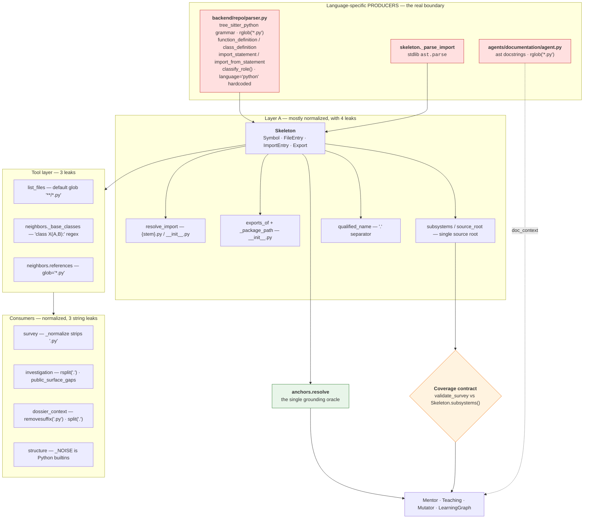
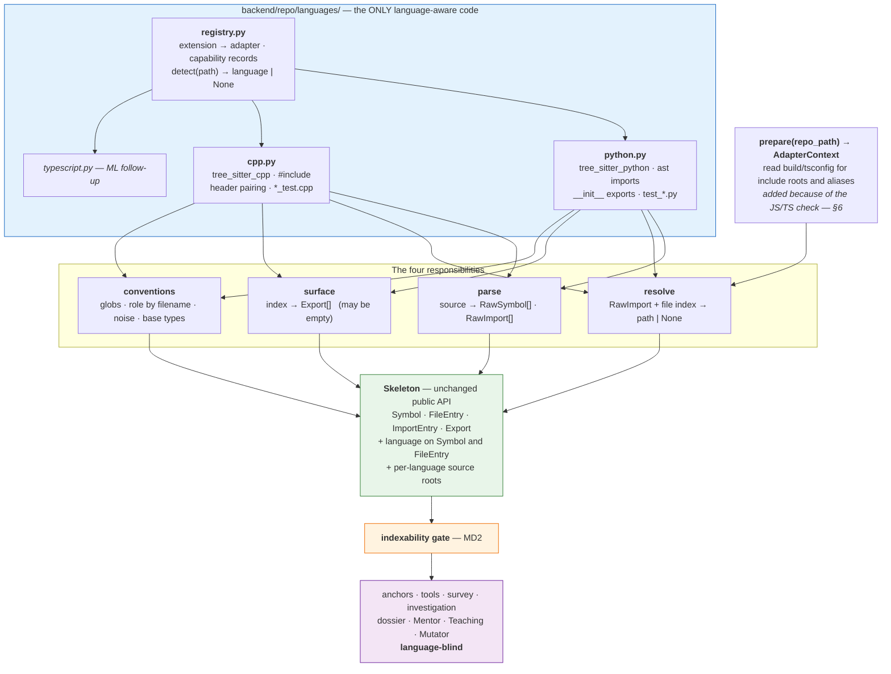
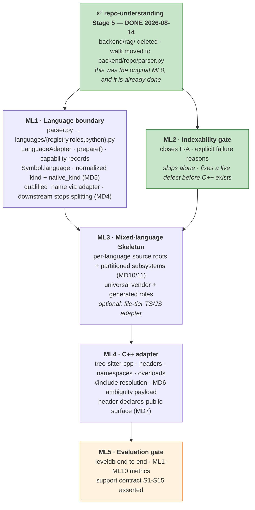

# Multi-Language Repository Support

> **Status:** planning only. No production code, prompts, schemas, tests or
> migrations changed. Nothing in `repo-understanding.md` or `learning-engine.md`
> has been edited.
> **Closes:** [`repo-understanding.md` OQ1](repo-understanding.md) — "is multi-language
> support the headline capability or a later stretch?"
> **Depends on:** `repo-understanding.md`, now **complete** — all six stages shipped
> and `backend/rag/` no longer exists. This phase starts from that end state.
> **Last updated:** 2026-08-14

| Step | What | State |
|---|---|---|
| **ML1** | Language boundary + Python adapter (no behaviour change) | not started |
| **ML2** | Indexability gate — closes the measured vacuous-coverage hole | not started |
| **ML3** | Mixed-language Skeleton + partitioned coverage | not started |
| **ML4** | C++ adapter | not started |
| **ML5** | Evaluation gate on a real C++ repository | not started |

> **⚠ Written against a moving target, then re-verified.** The investigation in
> §2 was carried out while `repo-understanding.md` Stage 5 was landing. The parse
> layer moved from `backend/rag/chunker.py` to **`backend/repo/parser.py`** and
> `backend/rag/` was deleted mid-analysis. **Every measured finding in §2 was
> re-run against the post-Stage-5 code and reproduces identically** — see the
> 2026-08-14 re-verification entry in [§19](#19-decision-log). What changed is
> that a step this document originally proposed (extracting the parse layer out
> of `backend/rag/`, formerly ML0) **was already done by Stage 5**, so the phase
> now starts at ML1. §8 and §9 record what that leaves.

---

## 0. Naming, and a stage-number collision

This work was requested as "Stage 3 — Multi-Language Repository Support", meaning the
third major planning phase of the project. **`repo-understanding.md` already has a
Stage 3** (`goal_investigation` becomes a pipeline stage, completed 2026-08-13), and
this document's work sits *after* that document's Stage 5.

To keep cross-references unambiguous, internal steps here are numbered **ML1–ML5** (ML0 existed in the first draft and
was absorbed by Stage 5 — see §8).
No step in this document should ever be called "Stage 3".

**Reading guide.** [§1–2](#1-what-this-phase-owns) are the investigation — §2 is
grounded in code that was read and, for the load-bearing claims, executed.
[§3–8](#3-what-supporting-a-language-actually-means) are the design.
[§9–14](#9-interaction-with-stage-5-rag-deletion) are the plan.
**[§16–18](#16-accepted-decisions-md) are the most important sections**: they separate
what is settled (MD) from hypotheses needing experiments (MH) from product calls the
owner must make (MQ). Nothing in §3–8 is settled unless restated in §16.

---

## 1. What this phase owns

### 1.1 Problem ownership

Both existing documents assign multi-language support here and neither attempts it:

| Source | Statement |
|---|---|
| `repo-understanding.md` P5 | "**Python-only, structurally.** `chunk_repo` is `rglob("*.py")`; the Documentation Agent uses Python's `ast`. One repo already in `data/repos/` (`everything-claude-code`) contains 0 Python files — the system indexes nothing and can say nothing about it" |
| `repo-understanding.md` OQ1 | Open. Estimates a new language as "a grammar plus a mapping" for `symbols` |
| `learning-engine.md` §1.4 | "Python-only chunking → **Owner: Phase A** → Open there (OQ1)" |
| `learning-engine.md` §1.3 | "Multi-language support is undecided (OQ1) → Phase B must not assume non-Python repos work; not block on them either" |

So this phase owns the whole of it, and the learning engine has already been designed
not to depend on the outcome. That is a clean boundary and this document does not
disturb it.

### 1.2 What this phase does *not* own

- Curriculum structure, lesson forms, grading, adaptation — `learning-engine.md`.
- The exploration loop, budgets, the dossier contract, the coverage *mechanism* — those
  are `repo-understanding.md` and are consumed here unchanged. This phase changes what
  the coverage contract is computed **over**, never how it binds.
- Repository updating to a newer commit, multi-user identity, the frontend.
- Any change to the six tools' *contracts*. Their implementations gain a language
  dimension; their signatures and result shapes do not.

### 1.3 The one thing OQ1 got wrong

OQ1's estimate — "only `symbols` needs a grammar per language, so adding JS/TS is
roughly a grammar plus a mapping" — is **correct about `symbols` and incomplete about
the rest**. The trace in §2 finds language assumptions in eleven modules, of which
four are outside anything a grammar would fix: module/include resolution, public-surface
derivation, role classification, and the subsystem inventory that the coverage contract
is computed from. A grammar makes `symbols` work. It does not make the *contract* work.

This is not a reason to reject OQ1's optimism — most of those four are small. It is a
reason to scope the phase from the real dependency chain rather than from the parser.

---

## 2. Current state — the language-assumption trace

### 2.1 The dependency chain



### 2.2 Measured behaviour on a non-Python checkout

Not inferred. A synthetic C++ checkout (4 files: `src/net/socket.{hpp,cpp}`,
`src/core/engine.cpp`, `tests/socket_test.cpp`, plus a 500-line `src/core/big.cpp`) was
run through the real Layer A:

```
files indexed : 0
symbols       : 0
subsystems    : {}
source_root   : ''

--- validate_survey() against a COMPLETELY EMPTY survey payload ---
unaccounted        : []
coverage.complete  : True
grounding_accuracy : 1.0
SurveyCheck.ok     : True        <-- the coverage contract PASSES

--- the six tools ---
list_files (default glob)   : 0 files
list_files (glob='**/*')    : 4 files, roles classified, loc=None for all
search_code 'Socket'        : 7 matches          WORKS
read_file src/net/socket.cpp: ok=True            WORKS
symbols                     : 0
propose_anchor Socket::send : {ok: False, error: 'unknown_file'}
```

Four findings, in descending severity.

**F-A · The coverage contract passes vacuously, and grounding reports 1.0.**
`Skeleton.subsystems()` filters `role == "source"` over *indexed* files. Zero indexed
files ⇒ empty inventory ⇒ the `unaccounted` loop has nothing to iterate ⇒
`Coverage.complete` is `True`. `SurveyCheck.grounding_accuracy` returns `1.0` when
`total_anchors == 0` — a deliberate and correct default for "nothing was cited", which
becomes a false 100% when nothing *could* be cited. This is precisely
[RK10](repo-understanding.md)'s vacuous-coverage risk arriving through a door nobody
was watching: not thin skips, but an empty inventory. D13's enforcement is intact; it
is being handed nothing to enforce.

**F-B · `anchors.resolve` fails closed, loudly, on `unknown_file`.** This is the good
news and it is load-bearing: G1/G2 cannot be circumvented on an unsupported language.
Nothing can be anchored, so no node can be persisted, so no ungrounded lesson can
reach a user. The failure mode is an expensive, confusingly-reported refusal — not a
fabrication.

**F-C · `validate_dossier` does *not* pass vacuously.** Layer C's exit criteria are
absolute counts (`min_components`, `min_entry_points`, `min_flows`,
`min_flow_files`…) that are independent of the skeleton, and every citation must
`resolve()`. On a C++ repo the investigation therefore burns its full budget being
correctly rejected, salvages, and the Mentor refuses under D15. **The asymmetry between
Layer B and Layer C here is the defect**, and it is Layer B that is wrong.

**F-D · `read_file` on a large unindexed file returns a dead-end instruction.**
Measured on the 500-line `big.cpp`:

```
outline : []
content : None
hint    : "src/core/big.cpp has 500 lines — too long to return whole.
           Re-read with start/end (max 400 lines), using the outline above
           to pick a range."
```

The outline is empty and the hint tells the model to use it. Every file over 400 lines
in an unsupported language is unreadable-by-instruction.

### 2.3 Role classification, measured

`classify_role` gates `subsystems()`, and therefore the whole coverage contract.
Measured against C++-shaped paths:

| path | classified | correct? |
|---|---|---|
| `tests/socket_test.cpp` | `test` | ✅ — by directory, not by name |
| `test/foo.cc` | `test` | ✅ — by directory |
| `src/net/socket_test.cpp` | **`source`** | ❌ — `_is_test_filename` requires `.py` |
| `src/foo_test.cc` | **`source`** | ❌ — same |
| `src/net/socket.hpp` | `source` | ✅ |
| `CMakeLists.txt` | **`source`** | ❌ — should be `tooling`/`build` |
| `cmake/Toolchain.cmake` | **`source`** | ❌ |
| `third_party/zlib/zlib.c` | **`source`** | ❌ — no vendor concept exists |
| `build/generated/api.pb.cc` | **`source`** | ❌ — no generated concept exists |

The directory layer (`tests`, `docs`, `examples`, `scripts`) is genuinely
language-agnostic and works. The **filename** layer is `.py`-gated, and there is **no
`vendor` or `generated` role at all**. On a C++ repo the consequence is not cosmetic:
vendored third-party code and protobuf output would become required subsystems that the
Survey is contractually obliged to account for.

### 2.4 The assumption inventory, categorized

Per the four categories requested. **(1)** genuinely language-specific → belongs behind
an adapter. **(2)** accidentally Python-specific → can become language-agnostic.
**(3)** Python-specific behaviour that should stay in a Python implementation.
**(4)** legacy RAG machinery that disappears and must not shape the design.

| # | Site | Assumption | Cat |
|---|---|---|---|
| A1 | `parser.py:19-22` | `tree_sitter_python` is the only grammar | **1** |
| A2 | `parser.py:24-25` | node types `function_definition`, `class_definition`, `import_statement`, `import_from_statement` | **1** |
| A3 | `parser.py:130` | `rglob("*.py")` is file discovery | **1** |
| A4 | `parser.py:40-44` | `_get_node_name` takes the first `identifier` child | **1** |
| A5 | `parser.py:89,109` | `"language": "python"` written unconditionally | **2** — becomes a real field |
| A6 | `parser.py:47-50` | `_is_test_filename` requires `.py`, `test_*`/`*_test` | **1** (conventions) |
| A7 | `parser.py:31-36` | `ROLE_DIR_SEGMENTS` directory conventions | **2** — universal already |
| A8 | `parser.py` (absent) | no `vendor` / `generated` role exists | **2** — universal need |
| A9 | `skeleton.py:200` | `qualified_name = f"{parent}.{name}"`, `.` separator | **2** — adapter renders, `.name` used downstream |
| A10 | `skeleton.py:479+` `_parse_import` | stdlib `ast.parse` on the statement text | **1** |
| A11 | `skeleton.py:299-340` `resolve_import` | `{stem}.py`, `{stem}/__init__.py`, relative-level dots | **1** |
| A12 | `skeleton.py:342-406` `exports_of`/`_package_path` | `__init__.py` re-export **is** the public surface | **1** — and may be *absent* per language |
| A13 | `skeleton.py:428-443` `source_root` | exactly one source root for the repository | **2** — becomes per-language |
| A14 | `skeleton.py:444-478` `subsystems` | one inventory, language-blind | **2** — becomes partitioned |
| A15 | `skeleton.py:72-81` `Symbol.kind` | `"function" \| "class"` exhausts the vocabulary | **2** — normalized set + `native_kind` |
| A16 | `skeleton.py:396,379` | `endswith("__init__.py")` | **1** |
| A17 | `tools.py:94` | `list_files` default `glob="**/*.py"` | **2** |
| A18 | `tools.py:494` | `references` searches `glob="*.py"` | **2** — should follow the symbol's language |
| A19 | `tools.py:558-580` `_base_classes` | regex `class\s+\w+\s*\(([^)]*)\)` | **1** |
| A20 | `tools.py:436,447` | `target.kind == "class"` gates `defines`/`extends` | **2** — via A15 |
| A21 | `tools.py:183-198` | outline fallback assumes the file is indexed | **2** — F-D |
| A22 | `explore.py:210` | tool schema advertises `'**/*.py'` to the model | **2** |
| A23 | `explore.py:237` | `kind` enum `["function","class"]` in the schema | **2** — via A15 |
| A24 | `explore.py:424-453` `skeleton_brief` | one source root, one subsystem list | **2** — via A13/A14 |
| A25 | `survey.py:448-451` `_normalize` | strips a `.py` suffix when folding names | **2** — strip any known extension |
| A26 | `investigation.py:602-672` `public_surface_gaps` | Python's exported-twin pattern | **3** — keep, guarded by capability |
| A27 | `investigation.py:630,646` | `rsplit(".", 1)[-1]` to get a bare name | **2** — use `Symbol.name` |
| A28 | `investigation.py:982,994` | `removesuffix(".py")` for display names | **2** |
| A29 | `dossier_context.py:218,219,227` | `split(".")[-1]`, `removesuffix(".py")` | **2** |
| A30 | `structure.py:33-37` `_NOISE` | Python builtins | **1** (per-language noise list) |
| A31 | `structure.py:177,188` | `kind == "class"`, `_base_classes` reuse | **2** — via A15/A19 |
| A32 | `structure.py:65-73` | `imports_in(...).names` as the file's vocabulary | **1** — needs an include analogue |
| A33 | `documentation/agent.py:33-97` | `ast` docstrings, `_SYMBOL_TYPES` | **1** — but see below |
| A34 | `documentation/agent.py:138` | `rglob("*.py")` | **1** |
| A35 | `code_structure/agent.py` | `chunk_repo` for the module map | **4** — **deleted by Stage 5** |
| A36 | `rag/retrieval.py`, `embedder.py`, `store.py` | chunks as retrieval units | **4** — **deleted by Stage 5** |
| A37 | `pyproject.toml:19-20` | only `tree-sitter` + `tree-sitter-python` | **1** |
| A38 | `tests/test_chunker.py` | tests the walk as a chunker | **4**-adjacent — retargeted by Stage 5 |
| A39 | `tests/test_skeleton.py:34-36` | `FAKE_CHUNKS` synthetic dicts | **2** — fixtures gain a language field |

**Category-2 dominates, and that is the phase's central finding.** Nineteen of the
thirty-nine sites are *accidentally* Python-specific: a hardcoded default glob, a
string-split that duplicates a field already present on `Symbol`, a `.py` suffix strip,
a two-value kind enum. None of them needs an adapter. Most are one-line changes that
make the code *better* on Python too — A27 and A29 replace `qualified_name.split(".")[-1]`
with the `Symbol.name` field that already exists and is already correct.

**Category 1 is eleven sites and they cluster tightly**: the parse (A1–A4, A6), module
resolution (A10, A11, A16), public surface (A12), and the two structural helpers that
read source text with a Python regex (A19, A32). That cluster *is* the adapter.

**Category 3 has exactly one member.** `public_surface_gaps` (A26) encodes a real,
measured Python pathology — the `fastapi` `Depends` gap where a package re-exports one
definition of a name while an internal twin of the same name sits beside it. It is
Python-shaped and should stay Python-shaped, guarded by a per-language capability flag
rather than deleted or generalized. JS/TS has an analogue (a barrel `index.ts`
re-exporting one of two same-named symbols); C++ largely does not.

**Category 4 does not influence the design.** A35–A36 vanish at Stage 5. The one thing
Stage 5 did *not* remove is the walk itself — it relocated it to `backend/repo/parser.py`.
See [§8](#8-the-parse-layer--what-stage-5-already-did-and-what-remains).

### 2.5 Contradictions between the documents and the code

Surfaced rather than silently reconciled, per instruction:

| # | Contradiction |
|---|---|
| C1 | **RESOLVED mid-analysis.** The stage table listed Stage 5 as "not started" while `backend/repo/structure.py` (211 lines) already existed and was wired into `mutator.py:186`. Stage 5 then shipped and the document caught up: `structure.py` is now recorded as Stage 4b, "the two Stage-5 preconditions". Kept on the record because it is why §9 was originally written as an ordering constraint. |
| C2 | §14's test matrix includes "one non-Python repo (**agentic path only** — the RAG path cannot run, which is itself a result)" as a row feeding the Stage-5 decision rule. That row cannot discriminate between the two architectures, because only one of them runs. Stage 5 has since shipped without it, which settles the point in practice — see [MD15](#16-accepted-decisions-md). |
| C3 | **RESOLVED by Stage 5.** `backend/repo/{skeleton,tools}.py` imported from `backend/rag/`, the package Stage 5 deletes — the dependency ran backwards. Stage 5 moved the walk to `backend/repo/parser.py` and deleted `backend/rag/`. This was the whole of the original ML0 and it is done. |
| C6 | **Convergent, and worth stating as agreement.** The post-Stage-5 `repo-understanding.md` §12 gained a table, "Python-specific assumptions that remain", naming six sites — the parser grammar, qualified names by class containment, public-API-by-`__init__`-re-export, relative-import resolution, `structure.py`'s callee noise profile, and `_base_classes` — and concludes: *"The contracts above these — Skeleton, anchors, the six tools, the Dossier schema, the candidate/context interfaces — are language-general. The adapters under them are not."* That is [MD3](#16-accepted-decisions-md)'s boundary, reached independently. `parser.py`'s own header says the same: *"Multi-language support means adding sibling adapters behind this interface, not generalising this file."* |
| C4 | OQ7's "known wart" — a stray top-level module collapsing `source_root()` to `""` — is documented as cosmetic. In a **mixed-language** repository it stops being cosmetic: one Python tooling script in a C++ repo collapses the root for both languages. See [§7](#7-mixed-language-repositories). |
| C5 | `tools.py:76` states "The Skeleton only indexes Python, but exploration needs to see that a README, a pyproject, or an .rst doc exists" — an accurate comment describing exactly the gap this phase closes. Recorded as agreement, not conflict. |

---

## 3. What "supporting a language" actually means

A parser that runs is not support. The contract below is what CodeOnboard must be able
to do before it may claim a language, and every clause is mechanically checkable.

### 3.1 The support contract

| # | Capability | Checkable by |
|---|---|---|
| **S1** | **Discovery** — the adapter's globs find ≥95% of the files a competent engineer would call source for that language in the fixture set | ML1 metric vs a labelled fixture |
| **S2** | **Non-empty, non-degenerate Skeleton** — ≥80% of discovered source files carry ≥1 symbol; the repository yields ≥2 subsystems | ML1, ML8 |
| **S3** | **Useful symbols** — extraction precision ≥0.95 and recall ≥0.85 against hand-labelled fixture files | ML2 |
| **S4** | **Qualified names are stable and idiomatic** — re-parsing the same commit yields byte-identical qualified names, and the rendering is what a developer of that language would write (`net::Socket::send`, not `net.Socket.send`) | ML3 + review |
| **S5** | **Anchors resolve** — a persisted `(file, symbol)` re-resolves to the same range on a fresh `build_skeleton`, ≥99% | ML4 |
| **S6** | **Ambiguity is answered, not refused** — where the language permits duplicate qualified names (C++ overloads), resolution returns a determinate answer or enumerated candidates, never a bare rejection | ML4 ambiguity rate |
| **S7** | **Roles are correct** — source / test / doc / example / tooling / **vendor** / **generated** classified at ≥95% accuracy on a labelled fixture | ML6 |
| **S8** | **Relationships resolve** — ≥70% of in-repo import/include edges resolve to a real file, and every unresolved edge is *reported* as unresolved rather than dropped | ML5 |
| **S9** | **`neighbors` navigates** — every relation the adapter declares supported returns results on the fixture repo, and every approximate relation is flagged `"exact": false` | ML5 + test |
| **S10** | **A Survey satisfies the coverage contract on its merits** — not by salvage, not vacuously, on a real repository | ML9 |
| **S11** | **Goal Investigation satisfies its goal-typed exit criteria** on ≥2 goal types | ML9 |
| **S12** | **A grounded LearningGraph is produced and persisted**, every anchor re-resolving, `symbol` carried through persistence (D14) | ML9 |
| **S13** | **A lesson renders** from that graph at session start, from dossier structure and not a fallback | ML9 |
| **S14** | **Adaptation works** — one simulated confusion event yields a prerequisite from `structure.neighbour_candidates` on Layer A alone, with no Python assumption and no retrieval | ML9 |
| **S15** | **No Python fallback anywhere in the run** — asserted by severing the Python adapter for the duration of the test | test |

S1–S9 are the **structural tier**. S10–S15 are the **product tier**. A language is
**supported** only with both.

### 3.2 The four states, and what each does

**MD1** settles that support is a declared, per-language, machine-readable capability
record — not a boolean.

```python
@dataclass(frozen=True)
class LanguageCapability:
    name: str                       # "python" | "cpp" | "typescript"
    tier: str                       # "supported" | "structural" | "file" | "unsupported"
    symbols: bool                   # S3 — is there a grammar
    imports: bool                   # S8 — can dependency edges be resolved
    public_surface: bool            # S12-adjacent — is there a structural export form
    base_types: bool                # can `extends` be answered
    approximations: tuple[str, ...] # named, surfaced to the model and the user
```

| State | Definition | Skeleton | Coverage contract | Learning graph | User sees |
|---|---|---|---|---|---|
| **Supported** | Adapter present, S1–S15 pass on the fixture set | full | participates | yes | nothing special |
| **Structural** | S1–S9 pass, some of S10–S15 unproven or a declared capability is `False` | full, with named gaps | participates, gaps declared | yes, with `confidence` capped at `medium` | a named limitation ("include resolution is approximate in this repository") |
| **File** | No grammar. Files discovered, roles classified, readable, searchable. No symbols | `FileEntry` only, `symbols == []` | **`skipped: unsupported_language`, explicitly** | **no — not teachable** | that language's files are listed as present and out of scope |
| **Unsupported** | Not in the registry at all | absent | absent | no | — |

Three properties of that table are the point of it:

1. **The file tier is visible but not teachable.** A minority language in a mixed
   repository must appear in the inventory — a learner needs to know a `frontend/`
   directory exists — but must not become a teaching target, because nothing in it can
   be anchored to a symbol. Range-only anchors (G3) would technically resolve; the
   reason to refuse them is not fabrication risk but *precision*: the model would pick
   plausible ranges with no structural check that they are teachable units. Whether the
   file tier should ever be teachable is [MQ2](#18-open-product-questions-mq).
2. **`skipped_with_reason` is where unsupported languages go, and the reason is
   generated by our code, not by the model.** This is the honest form of the D13 contract
   for a language we cannot parse: the subsystem is accounted for, the reason is a
   repository-level fact, and it appears in `M1c`'s skip instrumentation where it can be
   reviewed.
3. **Degradation is always explicit.** No state in that table produces a silent
   difference in behaviour.

### 3.3 The hard failure rule

**MD2.** A run must fail explicitly rather than proceed on an empty or degenerate
Skeleton. Concretely, a new deterministic **indexability gate** runs between Layer A and
Layer B, before any model call:

```
fail  "no_indexable_source"        no adapter matched any file in the checkout
fail  "no_symbols_indexed"         source files discovered, 0 symbols extracted
fail  "unsupported_repository"     every discovered source file is file-tier or below
warn  "partial_indexing"           indexed-source ratio below MH1's threshold
```

A hard failure appends to `state.errors` and returns without a graph, exactly as D15
already requires when the repository is unavailable. The user gets a named reason.
**A vacuously-satisfied coverage contract is a defect, not a pass** — F-A is a bug
report against `validate_survey`, and MD2 is its fix.

This gate is also the cheapest possible answer to the whole problem: it is ~30
deterministic lines, it is testable without an LLM, and it converts today's
confidently-empty behaviour into an honest refusal *before* ML4 exists.

---

## 4. The language boundary

### 4.1 Where it sits, and why

**MD3.** The boundary is a **`LanguageAdapter` protocol that produces normalized Layer-A
records, plus a per-language policy object the Skeleton consults instead of hardcoding.**
It sits between the filesystem and `Skeleton`. Nothing above `Skeleton` learns what a
language is, with the single audited exception of the capability record.

The justification is the §2.4 count. Nineteen category-2 sites need no abstraction at
all, so an interface designed to cover them would be over-engineering. Eleven
category-1 sites cluster into four coherent responsibilities. Four responsibilities is
the smallest interface that covers them without inventing extension points nobody asked
for.



### 4.2 The interface

```python
class LanguageAdapter(Protocol):
    capability: LanguageCapability
    source_globs: tuple[str, ...]        # ("**/*.cpp", "**/*.hpp", ...)

    def prepare(self, repo_path: str) -> AdapterContext: ...
        # Read whatever the language's build configuration states about module
        # resolution — include directories from CMakeLists, path aliases from
        # tsconfig.json. Called once per checkout. Returns an immutable context
        # threaded into resolve(). A language with no such configuration returns
        # an empty context.

    def parse(self, relpath: str, source: bytes) -> ParseResult: ...
        # ParseResult = (symbols: list[RawSymbol], imports: list[RawImport])
        # RawSymbol carries name, kind (normalized), native_kind, span, and the
        # parent CHAIN (not a single parent) so qualified names compose.

    def qualified_name(self, chain: tuple[str, ...]) -> str: ...
        # ("net", "Socket", "send") -> "net::Socket::send"
        # ("Session", "send")       -> "Session.send"

    def resolve_import(self, entry: ImportEntry, index: FileIndex,
                       ctx: AdapterContext) -> str | None: ...

    def public_surface(self, index: SymbolIndex, ctx: AdapterContext) -> list[Export]: ...
        # May legitimately return []. A language with no structural export form
        # declares capability.public_surface = False and consumers adapt.

    def role_by_filename(self, relpath: str) -> str | None: ...
        # Language-specific conventions ONLY. Returns None to defer to the
        # universal directory layer, which stays in one place.

    def base_types(self, source: str) -> list[str]: ...
    def noise_names(self) -> frozenset[str]: ...
```

### 4.3 What stays universal, deliberately

| Universal | Why it must not move behind the adapter |
|---|---|
| `Symbol`, `FileEntry`, `ImportEntry`, `Export`, `ResolvedAnchor` | The whole point. Downstream reasons in these types and must never branch on a language |
| Directory role conventions (`tests/`, `docs/`, `examples/`, `scripts/`) | Measured universal (§2.3). Duplicating them per adapter guarantees drift |
| **`vendor` and `generated` roles** | `third_party/`, `vendor/`, `node_modules/`, `build/`, `generated/`, `*.pb.*`, `*_generated.*` are conventions of *ecosystems*, not languages, and a C++ repo and a JS repo share most of them |
| `Skeleton` lookups — `canonical_file`, `find_symbol`, `exact_symbol`, `enclosing_symbol`, `read_lines` | Pure index operations over normalized records |
| `anchors.resolve` | **The single grounding oracle. Adding a language branch here would be the worst possible outcome of this phase** |
| The six tool contracts, and all budgets | Their signatures are the model-facing API |
| `subsystems()`'s *derivation rule* (OQ7) | Structure is the signal, and structure is language-neutral. What changes is that it runs per language (§7) |
| `validate_survey` / `validate_dossier` / the coverage contract | D13 binds identically regardless of language |
| Everything from the Mentor onward | C5/LP7 |

### 4.4 The two normalization decisions that carry the most weight

**MD4 · Qualified names are rendered by the adapter; downstream never splits them.**
`Symbol.qualified_name` becomes adapter-rendered (`net::Socket::send`) and
`Symbol.name` — which already exists and is already the bare name — becomes the
*only* sanctioned way to obtain a short name. The four `rsplit(".", 1)[-1]` /
`split(".")[-1]` sites (A27, A29) are replaced by field access.

This is strictly better on Python too: those splits are already redundant there, since
`"Session.send".split(".")[-1] == "send" == Symbol.name`. The change is a
simplification that happens to unblock a second language — the cheapest kind available.

**MD5 · `Symbol.kind` becomes a closed normalized vocabulary plus a display field.**

```
kind        ∈ {module, type, function, method, field, constant}   normalized
native_kind : free-form, adapter-supplied, for display and prompts
```

`class`, `struct`, `interface`, `enum`, `namespace`-as-a-unit all normalize to `type`.
The three `kind == "class"` sites (`tools.neighbors` ×2, `structure.py`) become
`kind == "type"`; the `explore.py` schema enum widens; `exact_symbol`'s
function-preference sort is expressed over the normalized set.

**This is safe to change because `Symbol.kind` is never persisted.** Verified: the
`nodes` table stores `symbol` (D14) and no kind; `edges.kind` is the unrelated
`sequence`/`prerequisite`/`deeper` vocabulary; `ResolvedAnchor.kind` is
`"symbol"`/`"range"`. No migration, no `SCHEMA_VERSION` bump, no compatibility
question. Persisted sessions are untouched.

---

## 5. C++ as the hard validation case

C++ is first because it is worst. If the boundary in §4 survives C++, it will survive
JS/TS trivially; the reverse is not true, and building against the easy language first
would produce an abstraction shaped like Python-with-different-extensions.

### 5.1 What is deterministic and reliable without a compiler

| Concern | Approach | Confidence |
|---|---|---|
| Extensions | `.cpp .cc .cxx .c++ .C .h .hpp .hh .hxx .ipp .inl .cu .cuh` — declared, not sniffed | exact |
| Namespaces, classes, structs, unions, enums, free functions, methods | `tree-sitter-cpp`: `namespace_definition`, `class_specifier`, `struct_specifier`, `enum_specifier`, `function_definition` | exact for parseable code |
| Qualified names | containment chain → `net::Socket::send`, rendered by MD4 | exact |
| Out-of-line definitions | `Socket::send` written at file scope: the `qualified_identifier` in the declarator already carries the chain. Parse it rather than relying on containment | exact |
| Constructors / destructors | name == enclosing type, and `~Name`. `native_kind` distinguishes; `~` must be permitted in a name (today's `isidentifier()` guards would reject it) | exact |
| Declaration vs definition | `declaration` vs `function_definition` are distinct nodes. **Index both**; `native_kind` distinguishes; a header declaration is a legitimate separate anchor because a header *is* the contract, and that is teachable | exact |
| `#include` extraction | `preproc_include`; `"quoted"` vs `<system>` distinguished | exact statements |
| Quoted-include resolution | relative to the including file, then against include roots from `prepare()` | good |
| Header/source pairing | stem match within the same directory, then across a mirrored `include/`↔`src/` layout | **approximate — declared** |
| Templates | `template_declaration` wraps the entity; unwrap to reach the class or function | exact for the common form |
| Test conventions | `*_test.cpp`, `*_unittest.cc`, `test_*.cpp`, `*Test.cpp`, plus the universal directory layer | good |
| Generated / vendored | `*.pb.cc`, `*.pb.h`, `*_generated.h`, `third_party/`, `vendor/`, `build/` → universal roles (§4.3) | good |

### 5.2 What must remain approximate, and say so

The precedent is already set: `neighbors`' `references` relation is flagged
`"exact": false` on every result because "Python cannot give a call graph without type
inference". The same discipline applies, and the same honesty.

| Concern | Why it cannot be exact without a compiler | Declared as |
|---|---|---|
| Call graph | Overload resolution, templates, virtual dispatch and ADL all need types | `references`, `"exact": false` — unchanged |
| `<system>` includes | Resolution depends on the toolchain's include path | `in_repo: false`, reported unresolved |
| Build-system include dirs | `prepare()` reads `CMakeLists.txt` / `compile_commands.json` **when present**; generator expressions and conditionals are not evaluated | `approximations: ("include_roots_partial",)` |
| **Macro-generated symbols** | `TEST(SuiteName, TestName) { ... }` is a macro invocation, not a class. tree-sitter cannot expand it, so GoogleTest test bodies are largely **not indexed as symbols** | `approximations: ("macros_not_expanded",)` — and it means C++ test files are structurally thin, which the role classification must not hide |
| Conditional compilation | `#ifdef` branches; the parser sees text, not a configuration | index what parses; count parse errors as a metric |
| Duplicate qualified names | Overloads and template specializations genuinely share a qualified name | see S6 and §5.3 |

**MH3** proposes the one thing worth measuring rather than deciding: whether
`compile_commands.json`, when a repository ships one, raises include resolution enough
to justify reading it. It is the closest thing to compiler knowledge available without
becoming a compiler, and it is a file, not a dependency.

### 5.3 The one change C++ forces on an existing contract

**Surfaced explicitly, per instruction.** `anchors.resolve` currently returns
`AMBIGUOUS_SYMBOL` when a symbol name matches more than one definition *within a file*:

```python
matches = skeleton.find_symbol(symbol, file=path)
if len(matches) > 1:
    return Resolution(None, AMBIGUOUS_SYMBOL)
```

In Python this fires rarely — `@overload` stubs, conditional redefinition. In C++ it
fires **constantly and correctly**: `Socket::send(const char*, int)` and
`Socket::send(std::string_view)` are two definitions of one qualified name, and a
template specialization set is another. A blanket rejection would make a large fraction
of C++ symbols unanchorable, which fails S5 and S6.

Three options, and a recommendation:

| Option | Assessment |
|---|---|
| Put the signature in `qualified_name` | Faithful, but the Mentor would have to emit `net::Socket::send(const char*, int)` exactly — reintroducing the copy-a-long-string fragility G1 exists to remove |
| Return enumerated candidates, as `neighbors` already does for ambiguous symbols | **Recommended.** There is precedent, a measured rationale ("a repeated name is a fact about the code, not a caller mistake"), and the Stage-4a fix to `neighbors` is the same shape |
| Accept `(symbol, line_start)` as a disambiguating pair | Reintroduces a model-supplied line number. Rejected on G1 grounds |

**MD6** adopts option 2, with a constraint that keeps G1 intact: `resolve()` gains an
`ambiguity` payload listing candidates, and the *caller* — never the model directly —
chooses. For the Mentor's wire format the choice is deterministic: prefer the
definition over the declaration, then the lowest line. The model still never types a
line number. `AMBIGUOUS_SYMBOL` remains a rejection reason for the case where no
deterministic preference applies.

This is a change to the grounding oracle and it is the only one in this phase. It
strengthens rather than weakens: a currently-unanchorable real symbol becomes anchorable,
and nothing previously rejected becomes acceptable on looser grounds.

### 5.4 Public API in C++

Python's structural public surface is the `__init__.py` re-export. C++ has no equivalent
that is *structural* rather than conventional. The honest candidates:

- headers under a top-level `include/` directory — a strong convention, not a rule
- symbols declared in a header and defined in a `.cpp` — the header is the contract
- export macros (`FOO_API`, `__declspec(dllexport)`, `visibility("default")`) —
  project-specific and macro-shaped

**MD7.** The C++ adapter declares `public_surface = True` with a single derivation:
**a symbol declared in a header is public; one defined only in a translation unit is
not.** That is checkable from the parse alone, needs no macro expansion, and matches how
C++ developers actually reason. The `include/`-directory convention refines it where the
layout exists. Export macros are out of scope and named in `approximations`.

Consequence for `public_surface_gaps` (A26): it is guarded by
`capability.public_surface` **and** by a per-language predicate, because the Python
pathology it detects — an exported twin of a name whose internal sibling was cited — does
not have a C++ analogue worth checking. On C++ the check returns no findings, which is
the correct answer, not a gap.

### 5.5 Fixture repository choice

The brief rules out a toy repo, correctly. Requirements: headers plus implementations,
namespaces, multiple subsystems, tests, real includes, duplicate symbol names, and a
traceable flow.

| Candidate | Assessment |
|---|---|
| **`google/leveldb`** | **Primary.** ~20k LOC. Textbook subsystems (`db/`, `table/`, `util/`, `include/leveldb/`). `include/`↔`src` split exercises header pairing. Real end-to-end flow: `DB::Put` → `WriteBatch` → `MemTable` → `SSTable`. `*_test.cc` throughout. Overloads and a clear public surface |
| **`fmtlib/fmt`** | **Secondary — the hard parse case.** Template-heavy, `constexpr`-heavy, deliberately chosen to stress `template_declaration` unwrapping and to produce a realistic parse-error rate |
| **`nlohmann/json`** | **Negative fixture.** Header-only, essentially one enormous header. Tests that the subsystem inventory degrades sensibly instead of producing one vacuous unit or 4,000 noisy ones |
| `catchorg/Catch2`, LLVM, Chromium | Rejected — size, or a build system too elaborate to be representative |

leveldb also has a property worth stating: it is *small enough to hand-label*, which
S3's precision/recall figures require.

---

## 6. Designing for the third language

The test the brief sets: after C++, does adding JS/TS look like "another adapter plus
tests", or does it reopen the core? Walked through against §4.2:

| JS/TS concern | Adapter slot | Core change needed? |
|---|---|---|
| `.js .jsx .mjs .cjs .ts .tsx .mts .cts` | `source_globs` | no |
| `class`, `interface`, `type`, `enum`, `function`, methods | `parse` + MD5's normalized kinds — `interface`/`type`/`enum` → `type` | no |
| `const f = () => {}` as a definition | `parse` handles `variable_declarator` with a function initializer | no |
| `export` / `export default` / barrel `index.ts` | `public_surface` — and JS/TS's is *more* structural than Python's | no |
| `import`/`require`, extensionless specifiers, `index.ts` | `resolve_import` | no |
| `*.test.ts`, `*.spec.tsx`, `__tests__/` | `role_by_filename` + the universal directory layer | no |
| `node_modules/`, `dist/`, `*.d.ts`, generated clients | universal `vendor`/`generated` roles (§4.3) | no |
| Namespaces/modules, nested types | `qualified_name` with `.` | no |
| **`tsconfig.json` `paths` aliases** | `prepare()` | **this is why `prepare()` exists** |
| `package.json` `exports` / `main` | `prepare()` | no |

**One genuine finding, and it changed the design.** Everything except path aliases fits
a per-file, pure-function adapter. `tsconfig.json` aliases make module resolution
**configuration-driven**: `@app/foo` resolves only if you have read a config file. A
pure `parse(file) → symbols` interface cannot express that.

So the interface gained `prepare(repo_path) → AdapterContext`, called once per checkout,
threaded into `resolve_import`. That slot then turned out to be exactly what C++ needs
for include roots from `CMakeLists.txt` / `compile_commands.json` — two languages, two
different configuration formats, one interface slot. **This is the abstraction earning
its place: it was added because of the third language and immediately paid for itself on
the second.** Had the boundary been designed against C++ alone, `prepare()` would have
been a C++ special case named `include_roots`.

**Verdict: the boundary holds.** Adding TS after C++ is an adapter plus fixtures plus
tests, with no change above `Skeleton`.

### 6.1 Recommended language scope

**MD8.** In scope for this phase: **Python (refactored into an adapter, zero behaviour
change) and C++ (new)**. Follow-up: **TypeScript/JavaScript**.

Reasoning across the three axes the brief names:

- **Product value.** C++ is requested. It is also the demographic CodeOnboard's pitch
  fits best — large C++ codebases are where onboarding genuinely takes months, and where
  "I cannot see the shape of this system" is the actual complaint.
- **Architectural validation.** C++ is the hardest mainstream case. An abstraction that
  survives headers, overloads, templates and macros is not going to be embarrassed by TS.
- **Project scope.** Three grammars, three fixture sets and three hand-labelled
  precision/recall studies is more than one phase of a final-year project should carry.
  Two grammars plus a designed-and-unbuilt third is the right amount.

**One cheap addition worth considering, offered as a recommendation rather than a
decision.** Ship a **file-tier TS/JS adapter** in ML3 — extensions, role conventions,
`node_modules`/`dist` exclusion, and **no grammar**. It is roughly fifty lines and it
exercises the entire mixed-language machinery (registry dispatch, per-file language
tagging, per-language source roots, partitioned coverage, explicit degradation) against
a real second language without paying for a second parser. It also makes the common
`fastapi`-plus-frontend shape behave sensibly immediately. The tradeoff is that a
file-tier language is visible-but-not-teachable ([MQ2](#18-open-product-questions-mq)),
which some reviewers will read as a half-feature.

---

## 7. Mixed-language repositories

### 7.1 `repository.language` is the wrong model

**MD9.** Language is a **per-file** property. There is no repository language. A
repository carries a *language profile*: a set of languages with file and symbol counts
and their capability tiers.

The justification is not hypothetical. Every shape the brief lists is real, and two are
already in `data/repos/`:

- `fastapi` — Python plus `.md`/`.rst` docs
- `everything-claude-code` — 0 Python files, cited in P5 as the case that indexes nothing
- a C++ project with Python tooling under `scripts/` and `tools/`
- a TS frontend beside a Python backend
- C++ source plus generated protobuf plus CMake

Detection is **per file, by extension, via the registry** — deterministic, no sniffing,
no heuristics. `Symbol.language` and `FileEntry.language` become real fields (A5 stops
being a lie). The registry may additionally be consulted **per repository** for the
profile and the gate, but the profile is *derived* from per-file facts, never asserted.

### 7.2 Per-language source roots, and why C4 stops being cosmetic

`source_root()` is today the common directory prefix of **all** source files. OQ7
records a "known wart": in `requests`, a stray top-level `setup.py` collapses the root
to `""`, making subsystem names full paths. Documented as cosmetic.

In a mixed repository it is not cosmetic. A C++ project with one
`scripts/gen_version.py` collapses the common prefix to `""` **for both languages
simultaneously**, and the subsystem inventory — which the coverage contract is computed
from — degenerates into a flat list of full paths spanning two unrelated trees.

**MD10.** `source_root()` and `subsystems()` are computed **per language**, then merged
into one inventory whose entries carry a language tag:

```
subsystems() -> {"cpp:db": [...], "cpp:table": [...], "cpp:util": [...],
                 "python:scripts": [...]}
```

OQ7's derivation rule is unchanged — source directories below the root, root modules
split per file, `SUBSYSTEM_MAX_FILES` splitting large buckets. It simply runs once per
language over that language's own files. This also **incidentally fixes C4/the OQ7
wart** for the single-language case, because `setup.py` is still Python but is now
`role != "source"`-adjacent… no: it remains a genuine Python source file at the root.
The wart survives within a language and is out of scope here. Recorded so it is not
mistaken for fixed.

### 7.3 Partitioned coverage

**MD11.** The coverage contract is computed over the merged inventory, with two rules:

1. Subsystems of a **supported** or **structural** language participate normally — the
   Survey must describe or skip each one.
2. Subsystems of a **file-tier** language are **pre-populated by our code** into
   `skipped_with_reason` with a machine-generated reason
   (`"typescript is indexed at file level only; no symbol structure is available"`),
   before the model sees the payload. They are accounted for, visibly, in `M1c`'s skip
   instrumentation — and the model is not asked to justify a limitation that is ours.

This is what makes §3.2's "visible but not teachable" mechanically true rather than
aspirational, and it is the direct answer to the brief's requirement that a repository
must never appear to pass coverage because there was nothing to account for.

### 7.4 Cross-language relationships

**MD12.** Cross-language edges are **not modelled**, and the absence is declared.

`neighbors` returns nothing across a language boundary. `resolve_import` never resolves
into another language's files. The reason is that every real cross-language edge needs
integration-specific knowledge that Layer A cannot have deterministically:

| Real edge | Why Layer A must decline |
|---|---|
| Python ↔ C++ via pybind11 / Cython / ctypes | The binding is a string in a build file or a macro; the mapping is not in either language's syntax |
| TS → Python over HTTP | The edge is a URL, matched by convention at best |
| Protobuf / OpenAPI schema → generated code in two languages | The edge is a build step |
| FFI, subprocess invocation, shared config | Not structural in any parseable sense |

What **is** allowed: the Survey (Layer B, a model layer) may **describe a cross-language
seam in prose** as part of `architecture` or `boundaries`, provided every anchor it
cites is within one language and resolves normally. That is consistent with the existing
discipline — Layer A reports only what it can prove, and interpretation belongs to
Layer B/C. A learner being told "the TypeScript client in `frontend/` calls this FastAPI
router" is genuinely useful and needs no structural edge to be honest.

This is the same trade already accepted for `references`: approximate where necessary,
explicit about it always, never a confident fabrication.

---

## 8. The parse layer — what Stage 5 already did, and what remains

### 8.1 Half of this question has been answered

The brief asked whether to keep evolving `chunker.py`, split the reusable extraction out
of it, replace it, or something else. **Stage 5 performed the split**, and the reasoning
recorded in `backend/repo/parser.py`'s header is the same reasoning this section reached
independently:

> "This module began life as `backend/rag/chunker.py`… Retrieval is gone, but the walk
> itself was never retrieval machinery… It moved here because Layer A is now its only
> consumer, not because the name was tidied."

So the four options collapse to a status report and one remaining decision:

| Option | Verdict |
|---|---|
| Keep evolving it inside `backend/rag/` | **Moot** — `backend/rag/` no longer exists |
| **Split the reusable parse/symbol extraction out** | **Done by Stage 5.** `backend/repo/parser.py`; `backend/repo/` has no inbound edge from a deleted package; C3 resolved |
| Replace it with a new parsing layer | **No, and still no.** The traversal, the class-recursion rule and `classify_role` are working measured code. Rewriting them to add a second language would discard evidence for no architectural gain |
| **What remains: give `parser.py` an interface** | It is currently a *module*, not an *adapter* — module-level `PY_LANGUAGE`, module-level `classify_role`, `parse_repo(repo_path)` with the grammar bound at import. A sibling C++ module cannot be selected at runtime against that shape |

### 8.2 What remains, concretely

**MD13 (revised).** The extraction is done. What is left is turning `parser.py` from a
module into the first *adapter*: move it to `backend/repo/languages/python.py` behind the
[§4.2](#42-the-interface) protocol, lift the universal directory-role layer into
`languages/roles.py`, and have `build_skeleton` dispatch through a registry rather than
call one module. **This is no longer a separate step — it is ML1**, and the original ML0
is deleted from the plan.

The remaining work is smaller than the original ML0 by exactly the part Stage 5 did: no
shim is needed, no chunk-dict shape must be preserved, and there is no RAG path to keep
runnable. `parse_repo`'s unit-dict output is now consumed only by `Skeleton.from_chunks`,
so the interface between them can change freely.

```
TODAY (post-Stage-5)                    AFTER ML1
backend/repo/parser.py                  backend/repo/languages/
  PY_LANGUAGE, CHUNK_NODE_TYPES           registry.py   extension -> adapter, capabilities
  classify_role  (universal + Python)     roles.py      universal dir/vendor/generated layer
  _parse_file, parse_repo                 python.py     grammar, node map, ast imports,
        ^                                               __init__ exports, test_*.py
        |                                   cpp.py      ML4
backend/repo/skeleton.py  ---------+
backend/repo/tools.py     ---------+     backend/repo/skeleton.py -> languages/registry
                                         backend/repo/tools.py    -> languages/roles
```

Two properties of this shape:

1. **Behaviour is byte-identical at ML1.** The same grammar, the same node types, the
   same traversal, the same role rules — the Python adapter is `parser.py` relocated
   behind an interface. A test asserts `Skeleton` output is unchanged on both demo
   clones, which is the whole of ML1's acceptance criterion.
2. **`test_chunker.py` has already retargeted**, as `repo-understanding.md` §12's test
   table anticipated ("Survives, retargeted at the symbol index"). ML1 renames it once
   more, to `tests/test_language_python.py`, with the same assertions against the
   adapter. No shim test is needed — there is nothing left to shim.

### 8.3 The Documentation Agent

A33/A34 — Python `ast` docstrings, `rglob("*.py")` — sit in a module that
`repo-understanding.md` §10 says is "folded into Layer A: one parse yields symbols *and*
docstrings", and that `learning-engine.md` F4 flags as nearly non-functional
(`extra_docs` matching almost never fires).

**MD14.** Docstring extraction becomes an **optional adapter capability**
(`parse` may populate `RawSymbol.doc`), and the fold into Layer A that §10 already
planned happens here because that is the parse this phase is touching anyway. C++ doc
comments (`///`, `/** */`) are a genuine analogue and cheap once the parse is in hand.
The README and `docs/` reading in `documentation/agent.py` is already
language-agnostic and stays as is. F4 is `learning-engine.md`'s to fix and is not
bundled.

---

## 9. Interaction with Stage 5 (RAG deletion) — now historical

> **Stage 5 shipped on 2026-08-14, during this analysis.** This section was written as
> an ordering constraint and is retained as a record of one, because the reasoning that
> produced it is what makes the current state safe rather than lucky.

### 9.1 What had to happen before deletion — and did

**Exactly one thing: extracting the parse layer.** `backend/repo/{skeleton,tools}.py`
imported `backend.rag.chunker`, so deleting `backend/rag/` would otherwise have been a
forced extraction performed while the tests for both paths were being torn up. Stage 5
did the extraction as part of the deletion (`backend/repo/parser.py`), which is the
outcome this section asked for.

The residual risk of doing it that way rather than as a separate step is that the
extraction was never independently verified against the pre-move behaviour. **That risk
is now retired empirically**: §2.2's probe was re-run against post-Stage-5 code and every
finding reproduces identically, which is the closest available evidence that the move was
behaviour-preserving.

### 9.2 What this leaves

ML1–ML5 touch only `backend/repo/` and the consumers above it, and nothing in
`repo-understanding.md` remains that could block or be blocked by them. The original
ML0 is deleted from the plan.

Two things Stage 5 makes *easier* than the original plan assumed, both worth taking:

- **No shim, no dual path.** MD13's original form preserved `chunk_repo`'s chunk-dict
  shape so the RAG path stayed runnable under D7. There is no RAG path. `parse_repo`'s
  output is consumed only by `Skeleton.from_chunks`, so ML1 may change that interface
  freely instead of freezing it.
- **A smaller surface to refactor.** `retrieval.py`'s parallel chunk vocabulary is gone,
  so ML1's diff is legible in a way it would not have been before.

### 9.3 The non-Python row in §14's matrix

**MD15. It was never a usable gate, and Stage 5 shipped without it — which settles the
point in practice.** §14's matrix lists "one non-Python repo (agentic path only — the RAG
path cannot run, which is itself a result)" as a row feeding the Stage-5 decision rule.

A row where only one arm runs **cannot discriminate between architectures**. It produces
no comparison, so it could never inform "is the agentic path better than RAG"; and
enforcing it would have blocked deletion on a capability *neither* arm had, as §2.2
measures. Stage 5 proceeded on the revised basis that every retrieval responsibility had
a demonstrated replacement — the right call, and it makes this row's status a
documentation cleanup rather than a live decision.

The honest residual framing: the non-Python case is a **baseline measurement for this
phase** — it establishes what "nothing works" looks like, which is ML5's before-picture —
and a **directional argument** for the migration, since a multi-language RAG path would
have needed a per-language embedding and chunking story as well. Neither is a deletion
criterion. `repo-understanding.md` §14 should say so when next edited.

### 9.4 Does C++ retrospectively challenge any Stage-5 assumption?

Asked because a deletion is only as good as the assumptions behind it. **No — and two of
the three are confirmed more strongly than when they were written:**

| §19 claim | How C++ bears on it |
|---|---|
| "`chunker.py` tree-sitter walk → Symbol index + import graph. **The most valuable survivor**" | **Confirmed, and already relocated** — it survives as `backend/repo/parser.py`. C++ support strengthens the judgement: the walk is the one piece a second language reuses wholesale in shape, if not in grammar |
| "`role` classification → metadata the agent reasons about, plus a read-budget policy" | **Confirmed, and extended** — universal `vendor`/`generated` roles plus a per-language filename layer. Not a redesign, and §2.3 shows the extension is needed regardless of C++ |
| "Preserve unchanged: `cloner.py` including the `check_repo_reachable` fail-fast" | **Confirmed** — cloning is language-agnostic, and that fail-fast is the right precedent for MD2's indexability gate |

**Nothing here argues the deletion was premature.** Language support is a property of
Layer A — a grammar and four small policies — with no relationship to vector retrieval.
The reverse holds if anything: a multi-language RAG path would have needed per-language
chunking, a re-embedding decision and collection keys accounting for language, so keeping
Chroma would have made this phase harder, not easier.

---

## 10. Preserved architectural decisions

Every decision the brief names, confirmed against this design:

| Preserved | How this phase honours it |
|---|---|
| **The Skeleton remains deterministic** | Adapters are pure parse plus declared policy. No model call anywhere in Layer A or in the registry. MD2's gate is arithmetic |
| **Grounding is against the actual repository (D1)** | Unchanged. `anchors.resolve` gains an ambiguity payload (MD6) and no language branch |
| **Claude never invents line ranges (D3/G1)** | Strengthened, not weakened: MD6 explicitly rejects the disambiguate-by-line option for this reason |
| **Coverage is mechanically validated (D13)** | Unchanged as a mechanism. MD2 fixes the measured hole where it was handed an empty inventory; MD11 partitions the inventory it validates against |
| **Survey stays breadth-oriented (H1, closed)** | Untouched. Layer B's fields, budget and caching are not in scope |
| **Goal Investigation is the single plan-time exploration writer (D11)** | Untouched. This phase adds no exploration loop and no second writer |
| **Consumers read normalized understanding (D5)** | This is MD3's whole purpose. Post-`Skeleton` code never learns what a language is |
| **The Learning Engine implements no parsing or exploration (LD10)** | Untouched, and `learning-engine.md` §1.3 already declines to assume non-Python works |
| **The Dossier remains structured, persisted understanding (D4, D12)** | Untouched. No dossier schema change, no version bump |
| **Existing sessions and persisted anchors keep their guarantees (D14)** | **Verified, not assumed.** `Symbol.kind` is not persisted (§4.4); `qualified_name` for Python is unchanged by MD4, so every persisted `(file, symbol)` re-resolves identically. No `SCHEMA_VERSION` bump, no `ALTER TABLE`, no migration |
| **Cost is a metric, not a driver (D16)** | No cost argument appears anywhere in this design. Parsing is local and free; the only cost change is that ML5's C++ evaluation runs cost real money, reported as a number |
| **Correctness and grounding are not weakened for convenience** | The one contract change (MD6) makes a real symbol anchorable that was previously refused. Nothing previously refused becomes acceptable on looser grounds |
| **No unrelated learning-engine redesign** | Nothing in `learning-engine.md` is touched. F4 is noted as adjacent and explicitly not bundled (§8.3) |

**One contract genuinely must change, and it is called out rather than slipped in:**
`anchors.resolve`'s blanket `AMBIGUOUS_SYMBOL` rejection (§5.3, MD6). It is the only
item in this phase that alters an accepted decision's implementation, and it is a
strengthening.

---

## 11. Build stages



| Step | Scope | Why it is separable |
|---|---|---|
| **ML1** | `parser.py` → `languages/{registry,roles,python}.py` behind the `LanguageAdapter` protocol; `prepare()`; capability records; `Symbol.language`/`FileEntry.language`; MD4 and MD5. Python is the only adapter. **No behaviour change.** | Still no new language. Every category-2 site is fixed here, where the diff is a refactor rather than tangled with a grammar. Acceptance is a byte-identical-`Skeleton` test on both demo clones plus a green suite |
| **ML2** | The indexability gate. Fails explicitly on an empty or degenerate Skeleton. | **Fixes a measured live defect (F-A) and is independent of ML1 — it can ship first.** Today a repository the system cannot read passes its coverage contract and reports `grounding_accuracy: 1.0` |
| **ML3** | Per-language source roots and partitioned subsystems; universal `vendor`/`generated` roles; the file tier and MD11's pre-populated skips. Optionally a file-tier TS/JS adapter. | The multi-language machinery, testable with one grammar plus a file-tier language. Exercises everything ML4 will depend on before ML4's parse complexity arrives |
| **ML4** | `tree-sitter-cpp`, the C++ adapter, MD6's ambiguity payload, MD7's public surface. | The grammar work, landing on machinery already proven by ML3 |
| **ML5** | leveldb end to end; ML1–ML10 measured; S1–S15 asserted; fmt as the parse-stress case; the negative fixture. | The gate. C++ is not claimed as supported until this passes |

**ML2 is worth doing regardless of whether C++ ever ships, and it is the smallest thing
in this document.** It is ~30 deterministic lines that convert a confidently-empty pass
into an honest refusal, and it needs no adapter, no grammar and no LLM to test. Stage 5
already took care of the other independently-valuable step (the original ML0).

---

## 12. Compatibility strategy

| Mechanism | Detail |
|---|---|
| **No feature flag for the boundary** | ML1 is a behaviour-preserving refactor, so a flag would guard nothing and double the test matrix. Asserted by a byte-identical-`Skeleton` test on both demo clones, not by a switch |
| **Per-language enablement instead** | `CODEONBOARD_LANGUAGES` (default `python`) controls which adapters the registry loads. A C++ adapter that misbehaves is disabled without a code change, and ML5 measures with it on. This is the granularity that matches the risk |
| **No `SCHEMA_VERSION` bump, no `ALTER TABLE`, no migration** | Verified in §4.4: `Symbol.kind` is not persisted; `edges.kind` is unrelated; `ResolvedAnchor.kind` is unrelated. `nodes.symbol` (D14) keeps its exact meaning |
| **Persisted anchors keep resolving** | Python `qualified_name` is unchanged by MD4 (`Session.send` stays `Session.send`), so every persisted `(file, symbol)` from every existing session re-resolves identically. A test loads a pre-phase session and asserts it |
| **Survey and dossier caches stay valid** | Both key on `(repo, commit, schema_version)` and treat a mismatch as missing (D12). If ML3 changes subsystem *names* for a repository — which per-language prefixing does — the correct behaviour is a **survey schema-version bump**, so cached surveys read as missing and regenerate. Cheap, and the alternative is a cached survey validated against an inventory that no longer matches it |
| **No dual path to keep alive** | D7's "RAG stays runnable throughout" applied to that migration and is now spent — Stage 5 removed the second pipeline shape and its flag. ML1 therefore changes `parse_repo`'s interface freely instead of freezing a shim shape |
| **Frontend: zero changes** | Anchors keep their wire shape. `native_kind` is prompt-facing only |
| **Degradation is declared, never silent** | §3.2's four states. A file-tier language appears in `skipped_with_reason` with our reason, not the model's |

One compatibility consequence is worth stating plainly: **ML3 changes subsystem names**
(`db` → `cpp:db`) and therefore invalidates cached surveys. That is a deliberate,
one-time, versioned invalidation, not a silent semantic shift.

---

## 13. Evaluation plan

Designed with the architecture, per instruction. Three levels, and metrics specific to
this phase rather than M1–M10 reused blindly.

### 13.1 Unit level — per adapter

Against hand-labelled fixture files checked into `tests/fixtures/<language>/`:

| Area | Cases |
|---|---|
| File classification | source · test by directory · test by filename · doc · example · tooling · **vendor** · **generated**; the C++ misclassifications measured in §2.3 as regression cases |
| Symbol extraction | every declared node kind; nested types; methods; free functions; C++ constructors, destructors, out-of-line definitions, templates, template specializations, anonymous namespaces |
| Qualified-name stability | re-parse yields byte-identical names; the rendering is idiomatic per MD4 |
| Anchor resolution | round-trip `(file, symbol)` → range → symbol; a persisted Python anchor from a pre-phase fixture still resolves |
| Duplicate / ambiguous | C++ overload set; template specializations; Python `@overload`; MD6's candidate enumeration and deterministic preference |
| Imports / includes | quoted and system includes; relative and absolute; unresolvable reported as unresolved, never dropped; `tsconfig` aliases if TS lands |
| Malformed files | syntax errors, truncated files, mixed encodings, BOM, CRLF, a NUL-bearing binary with a source extension |
| Unsupported constructs | macro-generated symbols absent **and named in `approximations`**; `#ifdef` branches; C++ attributes |
| Path handling | Windows separators; `include/`↔`src` mirroring; deep nesting; a file outside the repo root refused by `safe_repo_path` |
| Registry | extension collisions (`.h` is C, C++, and Objective-C — decide and test); unknown extensions; disabled adapters |

### 13.2 Repository level — fixtures

| Fixture | Purpose |
|---|---|
| `google/leveldb` | **Primary C++ gate.** Headers + implementations, `db`/`table`/`util` subsystems, `include/leveldb/` public surface, `*_test.cc`, overloads, a real `Put` flow |
| `fmtlib/fmt` | Parse-stress: templates, `constexpr`. Measures parse-error rate, not correctness of understanding |
| `nlohmann/json` | **Negative fixture.** Header-only single-header: asserts the subsystem inventory degrades sensibly rather than producing one vacuous or 4,000 noisy units |
| `psf/requests`, `fastapi/fastapi` | **Regression.** Every existing measurement must be unchanged after ML1–ML3. `fastapi/security` must remain independently visible (OQ7's permanent guard) |
| A synthetic mixed fixture in `tests/fixtures/` | C++ `src/` + Python `scripts/` + TS `frontend/` + `third_party/` + `build/generated/`. Asserts per-language roots, partitioned coverage, pre-populated file-tier skips, and no cross-language edges |
| One real mixed repository | For the e2e. Candidate selection is [MQ4](#18-open-product-questions-mq) |

### 13.3 End-to-end product gate

The full chain on leveldb, with the Python adapter **severed** (S15) so no Python
assumption can rescue the run:

```
clone → Skeleton → indexability gate → Survey → Goal Investigation
      → Dossier → Mentor → LearningGraph → persist → session start → lesson
      → simulated confusion → Mutator → prerequisite
```

Required, all mechanically checkable:

- non-empty, non-degenerate inventory (S2), and the gate did **not** fire
- coverage accounted for on the Survey's merits — not vacuously, not salvaged
- every graph anchor re-resolves on a fresh `build_skeleton` (S5, S12)
- `symbol` carried through persistence on every node (D14)
- session start renders a real lesson, not the placeholder (S13)
- one prerequisite derived from `structure.neighbour_candidates` on Layer A (S14)
- **zero retrieval calls** — asserted by the raising spies `scripts/gate_stage4.py`
  already uses
- **zero Python-adapter calls** (S15)

Goal-type coverage: at least `understand_system` and `understand_component`, mirroring
the existing gate's shape.

### 13.4 Metrics

Language-specific by design. M5 (grounding) and M2 (important-subsystem discovery) are
reused unchanged because both are language-neutral by construction; everything else here
is new.

| # | Metric | Definition | Auto? |
|---|---|---|---|
| **ML1** | **Structural index rate** | indexed source files with ≥1 symbol ÷ discovered source files. S2 threshold 80% | yes |
| **ML2** | **Symbol precision / recall** | against hand-labelled fixture files. S3: precision ≥0.95, recall ≥0.85 | yes, given labels |
| **ML3** | **Qualified-name stability** | identical names across two parses of one commit; and across a re-clone. Target 100% | yes |
| **ML4** | **Anchor resolution rate**, plus **ambiguity rate** | % of cited `(file, symbol)` that resolve; % that hit MD6's ambiguity path, and of those how many resolve deterministically. Ambiguity rate is the C++-specific number that does not exist today | yes |
| **ML5** | **Relationship resolution quality** | in-repo import/include edges resolved ÷ total, split exact vs approximate vs unresolved. Unresolved must be *reported*, and that is asserted separately | yes |
| **ML6** | **Role classification accuracy** | vs a labelled fixture, per role, with `vendor`/`generated` reported separately because they gate the coverage contract | yes |
| **ML7** | **Explicit-degradation rate** | of all discovered files not fully indexed, the fraction accounted for by a named capability gap or a pre-populated skip. **Must be 100%. Any silent gap is a failure, independent of every other metric** | yes |
| **ML8** | **Inventory sanity** | subsystem count per language; the leveldb analogue of OQ7's `fastapi/security` guard (`table/` must be independently visible); the negative fixture must not explode | yes |
| **ML9** | **End-to-end gate pass rate** | §13.3 over ≥3 repeats × ≥2 goal types. Reported with the per-stage failure classification `gate_stage4.py` already produces | yes |
| **ML10** | **Cross-language partition correctness** | on the mixed fixture: no symbol tagged with the wrong language; no cross-language edge; no file-tier subsystem in `covered` | yes |
| **ML11** | **Parse error rate** | files where the grammar produced an ERROR node ÷ files parsed. Recorded, not thresholded — `fmt` will be worse than leveldb and that is information | yes |
| **ML12** | **Consistency** | M10's method on a non-Python repo: covered-subsystem overlap and cited-anchor overlap across ≥3 repeats | yes |

**ML7 is the one with veto power.** Every other metric describes how well the system
understands a language; ML7 describes whether it is honest about what it does not
understand. A run with excellent ML1–ML6 and ML7 below 100% has a silent gap, which is
the failure mode this whole phase exists to prevent.

### 13.5 Test impact

| File | Fate |
|---|---|
| `tests/test_chunker.py` (184) | **Already retargeted by Stage 5.** ML1 renames it to `test_language_python.py` with the same assertions against the Python adapter. No shim test — nothing left to shim |
| `tests/test_skeleton.py` (219) | **Extended.** `FAKE_CHUNKS` gains a `language` field; per-language source roots and partitioned subsystems; the `fastapi/security` guard kept verbatim |
| `tests/test_tools.py` (614) | **Extended.** Default glob follows the registry; `references` follows the symbol's language; F-D's empty-outline case; a C++ `tmp_path` checkout beside the Python one |
| `tests/test_anchors.py` | **Extended.** MD6's ambiguity payload and its deterministic preference; a pre-phase persisted Python anchor still resolves |
| `tests/test_survey.py` (908) | **Extended.** MD2's gate; partitioned coverage; **F-A as a permanent regression guard — an empty skeleton must never yield `SurveyCheck.ok`** |
| `tests/test_structure.py` (170) | **Extended.** Per-language noise lists; `kind == "type"`; C++ base types |
| `tests/test_investigation.py` | **Extended.** `public_surface_gaps` returns nothing when `capability.public_surface` is False or the language has no twin pattern |
| `tests/test_documentation_agent.py` | **Extended** at ML1 for adapter-supplied docs; C++ doc comments |
| `test_mentor_*`, `test_teaching_agent`, `test_mutator`, `test_reviewer_agent`, `test_graph`, `test_session_api` | **Unchanged.** If any of these needs editing, the boundary has leaked and that is the signal to stop and reconsider |
| `test_retrieval.py`, `test_profiles.py` | Untouched here; Stage 5's business |
| **New** | `test_language_registry.py`, `test_language_cpp.py`, `test_indexability_gate.py`, `test_mixed_language.py`, `scripts/gate_multilang.py` |

**"The consumer tests stay green" is the phase's own architectural check.** Six agent
test files needing no edit is the evidence that downstream reasons in normalized types.

---

## 14. Risks

| # | Risk | Severity | Mitigation |
|---|---|---|---|
| **MR1** | **C++ symbol extraction is good enough to look right and wrong enough to teach falsehoods** — a header declaration taught as the implementation, an overload taught as the only one | **High** | ML2's labelled precision/recall on leveldb before any product claim; MD6's declaration-vs-definition preference; `native_kind` surfaced so a lesson can say "this is the declaration" |
| **MR2** | **Macro-generated code makes C++ test posture invisible**, so the Survey reports "well tested" or "no tests" from a structurally empty view | **High** | Named in `approximations`; role classification still finds the *files* by directory and filename even with zero symbols; ML1 measured per role so a 0%-indexed test tree is visible rather than absent |
| **MR3** | **The coverage contract becomes noisy on C++** — headers and implementations double the file count, `SUBSYSTEM_MAX_FILES` splits aggressively, and the inventory grows past usefulness | Medium | [MH2](#17-hypotheses-mh): measure the inventory on leveldb/fmt before tuning. OQ7 explicitly anticipated "a third repository shaped unlike either target repo" — this is that test |
| **MR4** | **Scope creep into a compiler.** Include paths, then macros, then templates, then a type system | Medium | §5.2's approximation table is a commitment, not an aspiration. MH3 bounds the one exception (`compile_commands.json`, a file we read, not a toolchain we invoke) |
| **MR5** | **The boundary leaks and a consumer needs `if language ==`** | Medium | §13.5's rule: six agent test files must need no edit. A required edit is a stop-and-reconsider signal, not a patch |
| **MR6** | **ML3 invalidates cached surveys** and a demo regenerates unexpectedly mid-presentation | Low–Medium | Versioned deliberately (§12); regenerate demo-repo surveys as part of ML3, not on first demo use |
| **MR7** | **Two grammars is more than the phase can carry**, and C++ lands half-done | Medium | ML2 is independently valuable and ships first. ML5 gates the *claim*, so a half-done C++ adapter stays behind `CODEONBOARD_LANGUAGES` rather than being announced |
| **MR8** | **`.h` extension collision** — C, C++, and Objective-C all use it | Low | An explicit registry decision with a test. Recommend: `.h` → C++ when any C++-only extension exists in the checkout, else file tier. Deterministic, and honest when it guesses |
| **MR9** | **A C++ evaluation costs materially more than a Python one** — bigger files, more of them, header/impl duplication | Low | D16: measure and report. Existing budgets are enforced in code and already handle a 4× citation surface (`fastapi`) |
| **MR10** | **The file tier is read as a shipped half-feature** | Low | MQ2 makes it a product decision, not a default. It can be omitted entirely without changing anything else |

---

## 15. Done when

Observable on a real run, not a judgement:

**Structural**

1. `build_skeleton` dispatches through a language registry; no module above
   `backend/repo/languages/` names a grammar, asserted by an import-boundary test.
2. `Skeleton` output is byte-identical on both demo clones before and after ML1.
3. A repository with zero indexable source files **fails onboarding with a named
   reason**, and `SurveyCheck.ok` is `False` — F-A closed, guarded by a regression test.
4. `Skeleton.subsystems()` on the mixed fixture returns per-language entries; no
   language's source root is collapsed by another language's files.
5. `grep -rn "\.py\"" backend/repo/ backend/agents/` returns no *behavioural* match —
   every remaining occurrence is a comment, a docstring, or inside
   `languages/python.py`.
6. No consumer above `Skeleton` branches on a language, asserted by an
   import-boundary test in the spirit of Stage 1's "no agent imports `repo.explore`".

**Language support**

7. `google/leveldb` satisfies S1–S9 with ML1 ≥80%, ML2 precision ≥0.95 / recall ≥0.85,
   ML6 ≥95%.
8. **ML7 is 100%** on every fixture: every unindexed file is accounted for by a named
   capability gap or a pre-populated skip.
9. leveldb completes §13.3 end to end across ≥3 repeats and ≥2 goal types, with zero
   retrieval calls and zero Python-adapter calls.
10. A C++ learning graph persists with `symbol` on every node, reloads, and every
    anchor re-resolves — 100%, matching the Python gate's standard.
11. One simulated confusion event on that graph yields a prerequisite from
    `structure.neighbour_candidates` with no Python assumption.
12. `fmt` parses with a **recorded** ML11 parse-error rate, and the negative fixture
    produces a sane inventory.

**Compatibility**

13. `psf/requests` and `fastapi/fastapi` measurements are unchanged; `fastapi/security`
    is still independently visible.
14. A session persisted before this phase loads, resumes, and every anchor resolves.
15. No `SCHEMA_VERSION` bump and no `ALTER TABLE` in the whole phase.
16. Six agent test files (`test_mentor_agent`, `test_mentor_dossier`,
    `test_teaching_agent`, `test_mutator`, `test_reviewer_agent`, `test_session_api`)
    are unedited.

**Documentation**

17. `repo-understanding.md` OQ1 is closed with a pointer here; C1–C4's contradictions
    are resolved in that document; §14's non-Python row is reclassified per MD15.

---

## 16. Accepted decisions (MD)

Settled. Implementation may rely on these.

| # | Decision | Rationale |
|---|---|---|
| **MD1** | **Support is a declared, per-language, machine-readable capability record with four tiers** (supported / structural / file / unsupported), not a boolean | A parser that runs is not support. The product needs to say what it can and cannot do about a specific repository, and a boolean cannot carry "symbols yes, include resolution approximate, macros not expanded" |
| **MD2** | **An indexability gate fails a run explicitly rather than proceeding on an empty or degenerate Skeleton** | **Measured defect F-A**: a C++ checkout passes the coverage contract with an empty payload and reports `grounding_accuracy: 1.0`. D13's enforcement is intact and is being handed nothing to enforce. ~30 deterministic lines, testable without an LLM, and it can ship before any adapter exists |
| **MD3** | **The boundary is a `LanguageAdapter` protocol producing normalized Layer-A records, plus per-language policy the Skeleton consults. It sits below `Skeleton`; nothing above learns what a language is** | 19 of 39 assumption sites are *accidentally* Python-specific and need no abstraction; the 11 genuinely language-specific ones cluster into four responsibilities. Four is the smallest interface that covers them |
| **MD4** | **The adapter renders `qualified_name`; downstream uses `Symbol.name` and never splits a qualified name** | `net::Socket::send` must be idiomatic. The four split sites are already redundant on Python (`"Session.send".split(".")[-1] == Symbol.name`), so this is a simplification that happens to unblock a language |
| **MD5** | **`Symbol.kind` becomes a closed normalized vocabulary** (`module type function method field constant`) **plus a free-form `native_kind` for display** | C++ needs struct/enum/namespace/constructor/destructor/template; a two-value enum cannot express them. **Verified safe: `Symbol.kind` is never persisted** — `edges.kind` and `ResolvedAnchor.kind` are unrelated fields — so there is no migration and no version bump |
| **MD6** | **`anchors.resolve` returns enumerated candidates for a genuinely ambiguous symbol** instead of a blanket `AMBIGUOUS_SYMBOL`, with a deterministic caller-side preference (definition over declaration, then lowest line) | C++ overloads and template specializations genuinely share a qualified name, so a blanket rejection makes a large fraction of real symbols unanchorable. Precedent and rationale already exist: `neighbors` made exactly this change at Stage 4a. **G1 is preserved — the disambiguate-by-line option was rejected specifically because it reintroduces a model-supplied line number** |
| **MD7** | **C++ public surface = declared in a header.** `include/` refines it; export macros are out of scope and named in `approximations` | Checkable from the parse alone, needs no macro expansion, and matches how C++ developers reason about an API. Python's `__init__.py` re-export has no C++ analogue |
| **MD8** | **Phase scope: Python (refactored to an adapter, zero behaviour change) + C++. TypeScript/JavaScript is designed for and deferred** | C++ is requested, is the hardest mainstream case, and therefore validates the boundary. Three grammars plus three labelled fixture studies exceeds one phase of a final-year project |
| **MD9** | **Language is a per-file property. There is no `repository.language`** — a repository carries a *derived* language profile | Every mixed shape in the brief is real and two are already in `data/repos/`. Detection is by extension via the registry: deterministic, no sniffing |
| **MD10** | **`source_root()` and `subsystems()` are computed per language**, merged into one language-tagged inventory | OQ7's "cosmetic" wart stops being cosmetic in a mixed repository: one `scripts/*.py` in a C++ project collapses the common prefix for *both* languages and degenerates the inventory the coverage contract is computed from |
| **MD11** | **Coverage is partitioned by language. File-tier subsystems are pre-populated into `skipped_with_reason` by our code, with our reason, before the model sees the payload** | The honest form of D13 for a language we cannot parse: accounted for, visible in M1c, and the model is not asked to justify our limitation. This is what makes "visible but not teachable" mechanical |
| **MD12** | **Cross-language relationships are not modelled, and the absence is declared.** Layer B may describe a seam in prose provided every anchor it cites is within one language | pybind11 bindings, HTTP calls and codegen steps are not structural in either language's syntax. Same trade already accepted for `references`: approximate where necessary, explicit always, never a confident fabrication |
| **MD13 (revised)** | **The parse layer is split out — Stage 5 did it.** What remains is turning `backend/repo/parser.py` from a module into the first *adapter* behind §4.2's protocol, which is ML1, not a separate step | The original decision was "split it out of `backend/rag/`, do not evolve it there, do not rewrite it". Stage 5 performed exactly that split for its own reasons. The residual — module-level grammar, module-level `classify_role`, `parse_repo` with the grammar bound at import — cannot support runtime selection between two languages. Still not a rewrite: the traversal and its tests are working measured code |
| **MD14** | **Docstring extraction becomes an optional adapter capability**, folding the Documentation Agent's second parse into Layer A as §10 already planned | One parse should yield symbols *and* docs. This phase is touching that parse anyway, and C++ doc comments are a real analogue. `learning-engine.md`'s F4 is adjacent and deliberately not bundled |
| **MD15** | **The non-Python repository is not a Stage-5 gate; it is this phase's baseline.** Stage 5 shipped without it, so this is now a documentation cleanup in `repo-understanding.md` §14 rather than a live decision | A matrix row where only one arm runs cannot discriminate between architectures, and gating deletion on a capability *neither* arm had would have blocked Stage 5 indefinitely. It remains a directional argument for the migration and the before-picture for ML5 |
| **MD16** | **Universal `vendor` and `generated` roles are added to the shared role layer, not per adapter** | `third_party/`, `vendor/`, `node_modules/`, `build/`, `*.pb.*`, `*_generated.*` are ecosystem conventions shared across languages. Measured consequence of their absence (§2.3): vendored code and protobuf output classify as `source` and become subsystems the Survey is contractually obliged to account for |
| **MD17** | **No feature flag for the boundary; per-language enablement instead** (`CODEONBOARD_LANGUAGES`, default `python`) | ML1 is behaviour-preserving, so a flag would guard nothing and double the test matrix. The real risk is a misbehaving *adapter*, and that is the granularity the switch should have |

---

## 17. Hypotheses (MH)

Nothing here may be treated as settled. Each carries a keep/kill criterion.

### MH1 — What is the right partial-indexing threshold?

**Hypothesis.** There is a ratio of indexed-source to discovered-source below which a
run should refuse rather than degrade, and it is meaningfully below 100% because header-
only code, macro-heavy files and generated output legitimately index thinly.

**Why not decided.** Picking a number now would repeat the `$0.10` mistake — a threshold
chosen before data becomes a quality ceiling. It is also the difference between refusing
a usable repository and accepting an unusable one.

**How to validate.** Instrument ML1 per language across all six fixtures plus both demo
repos. Plot indexed ratio against whether the end-to-end gate (§13.3) passes.

**Keep/kill.** Set the hard-failure threshold below every observed passing run and above
every observed failing one. If they overlap, ship the gate as **warn-only** with the
ratio surfaced in `confidence`, and record that the threshold could not be separated.
`MD2`'s absolute failures (zero indexable files, zero symbols) bind regardless and do
not depend on this.

### MH2 — Does OQ7's subsystem rule survive C++?

**Hypothesis.** The derivation — source subdirectories below the root, root modules split
per file, `SUBSYSTEM_MAX_FILES` splitting large buckets — is structural and therefore
language-neutral, and needs no C++-specific tuning.

**Why it might not hold.** C++ roughly doubles file count through header/implementation
pairs, and a common `include/<project>/` tree mirrors the source tree — so the same
logical subsystem may appear twice, once under `include/` and once under `src/`. That
would inflate the inventory and split coverage across a duplicate.

**How to validate.** Compute `subsystems()` on leveldb, fmt and the negative fixture.
Judge against ML8: is `table/` independently visible, is the count sane, does the
`include/`↔`src` mirror produce duplicate entries?

**Keep/kill.** If the mirror duplicates entries, the fix is a **deterministic** pairing
rule in the adapter (a header and its implementation are one unit for inventory
purposes), not an LLM classification and not a tuned constant. OQ7's own words:
"subsystem detection must never become an LLM classification problem." If no duplication
appears, the rule stands unchanged and OQ7 gains its third differently-shaped repository.

### MH3 — Does `compile_commands.json` raise include resolution enough to justify reading it?

**Hypothesis.** For repositories that ship one, a compilation database gives exact
include directories and turns many unresolved `<...>` includes into resolved in-repo
edges — the closest thing to compiler knowledge obtainable without a compiler, and it is
a file, not a dependency.

**Risk being guarded against.** MR4. Reading one build artifact is a slope toward
evaluating CMake generator expressions.

**How to validate.** Measure ML5 on leveldb with and without the database, if it produces
one under a plain CMake configure. Report resolved-edge delta.

**Keep/kill.** Adopt only if ML5's in-repo resolution rate rises materially. **Never
invoke a build.** If the file is absent, resolution falls back to the declared
approximation and says so — no configure step, no toolchain probing, ever.

### MH4 — Is the file tier useful, or just visible?

**Hypothesis.** In a mixed repository, listing a minority language's files without
symbols measurably improves the Survey's architectural account, because a learner needs
to know a `frontend/` exists even if it is not taught.

**How to validate.** On the mixed fixture, run the Survey with the file-tier adapter
enabled and disabled. Score M3 (architecture-understanding rubric) on whether the
account acknowledges the other language's role.

**Keep/kill.** If M3 is unchanged, the file tier is dead weight and MD1 collapses to
three tiers. If it improves, MQ2's teachability question becomes worth asking.

---

## 18. Open product questions (MQ)

Calls the owner should make. Each names the step that needs it.

**MQ1 — Is multi-language support a headline capability or an engineering footnote?**
This is OQ1's original question and it is still yours. It changes how the project is
pitched and what ML5 must prove. If headline, C++ needs a demo-quality end-to-end run on
a recognisable repository and the evaluation section becomes a results chapter. If a
footnote, ML1 + ML2 + a documented boundary may be the whole deliverable, with C++ as
future work. **Decide before ML3** — everything up to ML2 is worth doing either way.

**MQ2 — Should a file-tier language ever be teachable via range-only anchors?**
G3 permits verified raw ranges, so it is technically possible. The objection is precision,
not fabrication: the model would pick plausible ranges with no structural check that they
are teachable units. Default recommendation: **no** — file tier is visible, not teachable.
*Decide before ML3, informed by MH4.*

**MQ3 — Which C++ repository is the demo?**
`leveldb` is the evaluation fixture (hand-labellable, textbook structure). A demo may want
something more recognisable and larger. A larger repository costs more per run and stresses
budgets in ways ML5 will not have measured. *Decide before ML5.*

**MQ4 — Which real mixed-language repository enters the matrix?**
The synthetic fixture covers the unit level. The e2e wants a real one, and the honest
options are all large (Python + TS monorepos in the `gradio`/`streamlit` shape). Options:
accept the cost, or restrict the mixed case to the synthetic fixture and record that the
real-repo mixed case is unmeasured. *Decide before ML5.*

**MQ5 — Does `understand_system` mean something different on a C++ repository?**
Layer C's exit criteria demand a flow crossing ≥3 files. In C++ a flow crosses headers as
well as implementations, so "3 files" may be satisfied trivially by
`foo.h → foo.cpp → bar.h` without tracing any real behaviour. Whether the criterion needs
a language-aware notion of "distinct translation unit" is a genuine question, and it is
the one place a language concept might legitimately need to reach above `Skeleton`.
**If it does, that is a leak in MD3 and must be recorded as such rather than patched
quietly.** *Decide during ML4, from observed dossiers.*

**MQ6 — How much does this phase cost, and is that acceptable?**
D16 makes cost a metric, not a driver, so this is not an architectural question — but
ML5's runs on three new fixtures across multiple goal types and repeats are real spend,
and the Stage-2/3/4 experiments cost roughly `$5` combined. *Estimate before ML5 and
report, do not design against it.*

---

## 19. Decision log

Append-only. Every entry: date, decision, rationale, what would reverse it.

| Date | Decision | Rationale | What would reverse it |
|---|---|---|---|
| 2026-08-14 | Multi-language support scoped as its own phase closing `repo-understanding.md` OQ1; internal steps numbered ML1–ML5 to avoid colliding with that document's Stage 3 | Both existing documents assign the problem here and neither attempts it. `learning-engine.md` §1.3 already declines to depend on the outcome, so the boundary is clean | — |
| 2026-08-14 | **Investigation grounded by execution, not only by reading** — a synthetic C++ checkout was run through the real Layer A | Four of the findings (F-A to F-D) are behaviours no amount of reading would have established with confidence, and F-A contradicts a reasonable reading of the coverage contract | — |
| 2026-08-14 | **F-A recorded as a live defect: an empty Skeleton passes the coverage contract and reports `grounding_accuracy: 1.0`** | Measured. `subsystems()` returns `{}`, so `unaccounted` is empty, so `Coverage.complete` is True; `grounding_accuracy` defaults to 1.0 on zero anchors. RK10's vacuous-coverage risk arriving through an unwatched door | Nothing — this is a measurement. MD2 is the fix and a regression test makes it permanent |
| 2026-08-14 | **F-C recorded: Layer C does *not* pass vacuously; Layer B does.** The asymmetry is Layer B's bug | `validate_dossier`'s exit criteria are absolute counts independent of the skeleton, and every citation must resolve. The two validators disagree about what an unreadable repository means | — |
| 2026-08-14 | **OQ1's estimate corrected, not rejected.** "A grammar plus a mapping" is right about `symbols` and incomplete about module resolution, public surface, role classification and the subsystem inventory | The trace found language assumptions in 11 modules, 4 of which no grammar would fix — and the fourth is what the coverage contract is computed from | — |
| 2026-08-14 | **MD3 — the boundary sits below `Skeleton`, as an adapter protocol plus per-language policy** | 19 of 39 assumption sites are accidentally Python-specific and need no abstraction; the 11 real ones cluster into four responsibilities. Designing for the 19 would be over-engineering; designing for fewer than the 4 would leak | A consumer above `Skeleton` needing to branch on a language — MR5, with §13.5's six-test-files rule as the detector |
| 2026-08-14 | **`prepare(repo_path) → AdapterContext` added to the interface because of the JS/TS check, and it immediately paid for itself on C++** | `tsconfig.json` path aliases make module resolution configuration-driven, which a pure per-file interface cannot express. C++ include roots from CMake are the same shape. Designed against the third language, used by the second | Both languages turning out not to need configuration-driven resolution, which the check already disproves |
| 2026-08-14 | **MD6 — `anchors.resolve` enumerates ambiguous candidates rather than rejecting.** The only accepted-decision implementation this phase changes, and it is a strengthening | C++ overloads genuinely share a qualified name, so blanket rejection makes real symbols unanchorable (fails S5/S6). `neighbors` made this exact change at Stage 4a for the same reason. The disambiguate-by-line alternative was rejected because it reintroduces a model-supplied line number and would weaken G1 | Evidence that enumerated candidates let a caller pick a wrong definition more often than a rejection cost a right one |
| 2026-08-14 | **MD5 verified safe against persistence rather than assumed** — `Symbol.kind` is not stored; `edges.kind` and `ResolvedAnchor.kind` are unrelated fields | The obvious worry about widening a kind vocabulary is a migration. There is none, and checking was cheaper than designing around a hypothetical | — |
| 2026-08-14 | **MD9 — language is per-file; `repository.language` is rejected** | Every mixed shape in the brief is real and two are already in `data/repos/`, including the 0-Python repository P5 cites | A measured case where per-file tagging produces a worse account than a single repository language, which would be surprising |
| 2026-08-14 | **MD10 — per-language source roots.** OQ7's "cosmetic" wart is reclassified as load-bearing in mixed repositories | One `scripts/*.py` in a C++ project collapses the common prefix for both languages and degenerates the inventory the coverage contract is computed from. Single-language behaviour is unchanged | MH2 finding that per-language roots produce duplicate `include/`↔`src` entries, which would need the pairing rule instead |
| 2026-08-14 | **MD12 — cross-language relationships not modelled, absence declared; Layer B may describe a seam in prose** | pybind11 bindings, HTTP calls and codegen are not structural in either language's syntax. The `references` precedent settles the discipline: approximate where necessary, explicit always | A single integration pattern common enough to justify a deterministic rule — none identified |
| 2026-08-14 | **MD13 — split the parse layer out of `chunker.py`; do not evolve it and do not rewrite it** | The dependency runs backwards: `backend/repo/{skeleton,tools}.py` import from the package Stage 5 deletes. Adding grammars there deepens it. The traversal itself is working measured code with 184 lines of tests — relocating is right, rewriting is not | Superseded the same day — see the re-verification entry below |
| 2026-08-14 | **ML0 identified as the only hard ordering constraint against Stage 5** | Without it, deleting `backend/rag/` is a forced extraction performed while both paths' tests are being torn up. With it, Stage 5 is a deletion | Superseded the same day — Stage 5 performed the extraction itself |
| 2026-08-14 | **RE-VERIFICATION AFTER STAGE 5 LANDED MID-ANALYSIS.** `repo-understanding.md` closed and `backend/rag/` was deleted while this document was being written; the parse layer became `backend/repo/parser.py`. §2.2's probe was **re-run against the post-Stage-5 code and every finding reproduces identically** — 0 files indexed, `SurveyCheck.ok` True on an empty payload, `grounding_accuracy` 1.0, `propose_anchor` `unknown_file`, the same six role misclassifications, the same empty-outline dead end | An investigation grounded in a file that no longer exists would be worthless, and a plan that quietly re-pointed its references without re-measuring would be worse. Re-running was cheaper than reasoning about whether the move was behaviour-preserving | Nothing — this is a measurement |
| 2026-08-14 | **The original ML0 is deleted from the plan; MD13 revised to "the split is done, the adapter interface is what remains" (ML1)** | Stage 5 performed the extraction this document had proposed as its first step, for its own reasons and by the same reasoning. What it did not do — and explicitly said it was not doing — is give `parser.py` an interface | — |
| 2026-08-14 | **§9 reclassified from an ordering constraint to a historical record** | It was written before Stage 5 shipped. It is retained rather than deleted because the reasoning is what makes the current state safe rather than lucky, and because the one residual risk it names — that the extraction was never independently verified against pre-move behaviour — is retired by the re-verification above | — |
| 2026-08-14 | **Independent convergence recorded (C6), not claimed as originality** | Post-Stage-5, `repo-understanding.md` §12 gained a "Python-specific assumptions that remain" table naming six sites and concluding that the contracts above them are language-general while the adapters under them are not — MD3's boundary, reached separately. `parser.py`'s header says the same. Two independent routes to the same boundary is evidence for it; presenting it as this document's discovery would not be | — |
| 2026-08-14 | **MD15 — the non-Python repository is removed as a Stage-5 gate** | A matrix row where only one arm runs cannot discriminate between architectures, and gating deletion on a capability neither arm has would block Stage 5 indefinitely. It stays as this phase's baseline and as a directional argument | A future state where both arms support a second language, which is not on any roadmap |
| 2026-08-14 | **MD16 — `vendor` and `generated` roles are universal, not per adapter** | Measured: `third_party/zlib/zlib.c` and `build/generated/api.pb.cc` both classify as `source` today, so vendored and machine-generated code would become subsystems the Survey must account for. The conventions are shared across ecosystems | — |
| 2026-08-14 | **ML7 (explicit-degradation rate) given veto power over the metric set** | Every other metric measures how well a language is understood; ML7 measures whether the system is honest about what it does not understand. Excellent ML1–ML6 with ML7 below 100% means a silent gap, which is the failure this phase exists to prevent | — |
| 2026-08-14 | **`leveldb` chosen as the primary C++ fixture; `fmt` as the parse-stress case; `nlohmann/json` as a negative fixture** | leveldb has headers plus implementations, three clear subsystems, an `include/` public surface, `*_test.cc`, overloads, a real `Put` flow, and is small enough to hand-label — which ML2's precision/recall requires. A single-`.cpp` toy would prove nothing | A reviewer preferring a more recognisable demo repository — MQ3, which is a demo question, not a fixture question |
| 2026-08-14 | **MQ5 flagged as a possible MD3 leak rather than pre-resolved** | Layer C's "flow crosses ≥3 files" may be satisfiable trivially in C++ by `foo.h → foo.cpp → bar.h`. If the criterion needs a language-aware notion of translation unit, that is a genuine leak above `Skeleton` and must be recorded as one | Observed C++ dossiers showing the criterion still discriminates |
| 2026-08-14 | Planning document created; **no production code, prompts, schemas, tests or migrations changed, and neither existing planning document edited** | The brief asked for this phase to be designed independently for review before the sources of truth move | Approval of this document, after which §15's item 17 lists the edits to make |

---

## Out of scope

- Everything in [`learning-engine.md`](learning-engine.md): curriculum planning, lesson
  forms, assessment, adaptation, the frontend. Its F4 (`extra_docs` matching) is adjacent
  to MD14 and deliberately not bundled.
- The Survey's fields, budget and caching policy; the dossier schema; the exploration
  loop, its budgets and its prompts. Consumed unchanged.
- Repository updating to a newer commit. MD4's stable qualified names make it *safer* to
  add later, exactly as D14 does; adding it is not part of this phase.
- Semantic search as a tool (`repo-understanding.md` H4) and the deletion of
  `backend/rag/` itself — both shipped on 2026-08-14. §9 records what that leaves, and
  does not reopen either.
- Multi-user identity, repo-URL normalisation, multimedia (Phase 4), the VS Code
  extension (Phase 5).
- Any language beyond Python and C++ in implementation. TypeScript/JavaScript is designed
  for in §6 and scoped as follow-up by MD8.
