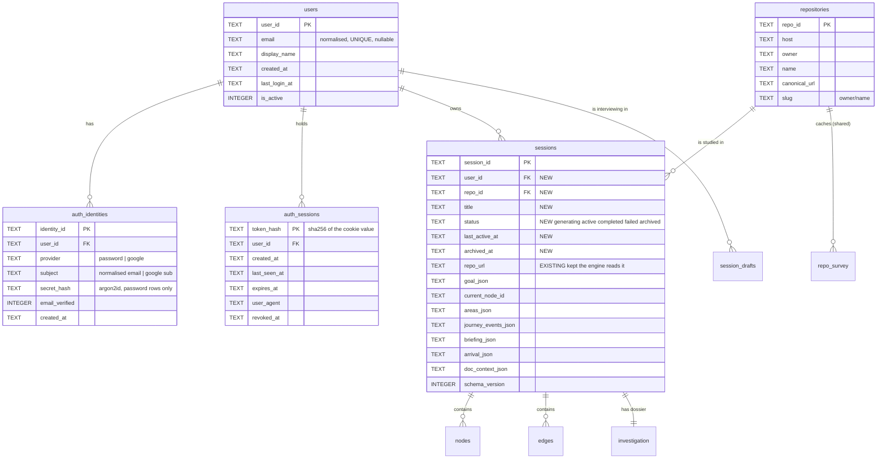

# Multi-user: accounts, ownership, and session as a first-class entity

Status: **planning only — nothing implemented.**

This document is written against the code as it stands on branch `create-tour`
(HEAD `43a4d4d`). Every claim tagged **[FACT]** was read out of a file named
beside it, or out of `data/sessions.db` directly. **[REC]** is a design
recommendation. **[DECIDED]** is a settled call, with the date. **[OPEN]** is a
decision still needed before the milestone that depends on it starts.

---

## 0. Decisions taken

Settled **2026-08-22**. These are no longer questions; the sections below have
been rewritten to assume them.

| # | Decision | Outcome |
|---|---|---|
| **D-1** *(was OPEN-1)* | Auth implementation | **In-app, standard libraries.** `argon2-cffi` for hashing, `Authlib` for Google OIDC, opaque DB-backed session tokens. No hosted provider, no ORM. |
| **D-2** *(was OPEN-6)* | Origin topology | **Next.js `/api/*` rewrite.** The browser talks to one origin; the cookie is first-party; CORS leaves the production design. |
| **D-3** *(was OPEN-8)* | The 86 existing dev sessions | **Adopt** into the developer's real account after M2, preserving the E2E/evidence history. |
| **D-4** *(was OPEN-2)* | Google ↔ password linking | **Link only when Google reports `email_verified = true`.** See the rider in §6.2 — D-5 makes one additional check necessary. |
| **D-5** *(was OPEN-11)* | Password reset / email verification | **Out of scope.** Neither ships. Consequences and the two mitigations are recorded in §6.3. |
| **D-6** | The hazards in §2 | **In scope, as foundation work.** `_try_resume` (P1), the clone basename collision (P6), SSRF in `/repo/check` (P8) and SQLite concurrency (P7) are fixed in M0/M3 rather than left standing while auth is added. |
| **D-7** *(was OPEN-13)* | Google linking when the email collides with a password account | **Require one password confirmation, then link, then revoke that user's other active auth sessions.** Closes the pre-hijack D-5 opened (§6.2). Implemented in M6. |
| **D-8** | Implementation order | **M0 → M1**, sequentially, each verified against its own acceptance criteria before the next begins. The clone-path move in M0 lands before anything references `repo_id`. |

### Milestone status

| Milestone | Status |
|---|---|
| **M0** — isolation hazards & concurrency foundation | **DONE** — verified 2026-08-22, checkout move applied, all acceptance criteria pass (§16 M0 results). |
| M1 — data model + migration | **blocked** — not to start while another workstream is editing `backend/learning/store.py` (see §16 "Before M1 can start"). |
| M2 … M8 | not started |

---

## 1. Current architecture relevant to this change

### 1.1 What a "session" is today

**[FACT]** There are **two unrelated things called a session** in this codebase,
and the distinction matters for everything below.

| | Goal-dialogue session | Learning session |
|---|---|---|
| Type | `GoalSession` (`backend/agents/goal/agent.py:81`) | `LearningGraph` (`backend/learning/graph.py:250`) |
| Id | `str(uuid.uuid4())` — `agent.py:97` | `uuid.uuid4().hex` — `graph.py:58` |
| Lives in | module-level dict `sessions` — `backend/api.py:133` | SQLite `data/sessions.db` — `backend/learning/store.py` |
| Lifetime | process memory, capped at 64, oldest evicted (`_MAX_GOAL_SESSIONS`, `api.py:135`) | durable, never expires |
| Contents | `repo_url`, `goal_type`, `answers: dict` | the entire learning state |

They are **not linked**. The goal dialogue's id is discarded once the goal JSON
is synthesised; `POST /session/start` receives the *goal object* from the client
and mints a brand-new id (`frontend/app/page.tsx:91` calls
`sessionStart(repoUrl, forGoal, …)`).

Whenever this document says "session" without qualification it means the
**learning session** — the `LearningGraph` and its SQLite rows.

### 1.2 Where session state is persisted

**[FACT]** `backend/learning/store.py`, one SQLite file, `SCHEMA_VERSION = 2`.
The live schema, read from `data/sessions.db`:

```sql
sessions(session_id PK, repo_url, goal_json, current_node_id, doc_context_json,
         schema_version, created_at, updated_at,
         goal_translations_json, areas_json, journey_events_json,
         briefing_json, arrival_json)
nodes(node_id PK, session_id FK→sessions ON DELETE CASCADE, title, file,
      line_start, line_end, concept_tags_json, lesson_brief_json,
      understanding_state, visited, weak_spot, user_override,
      cached_lesson_json, attempts_json, translations_json, symbol, gaps_json)
edges(session_id, from_node_id, to_node_id, kind, PK(all four), FK→sessions CASCADE)
repo_survey(owner_repo, commit_sha, schema_version, payload_json, accepted,
            cost_usd, seconds, created_at, PK(owner_repo, commit_sha, schema_version))
investigation(session_id PK, commit_sha, schema_version, payload_json, accepted,
              used_survey, stop_reason, cost_usd, seconds, created_at)
indexes: idx_nodes_session(session_id), idx_sessions_repo(repo_url)
```

**[FACT]** Live data: 86 sessions, 907 nodes, 1317 edges, 6 surveys, 56
investigations. All 86 sessions are `schema_version = 2`.

**[FACT]** `goal_translations_json` and `nodes.translations_json` are **dead
columns** — no code in `backend/` reads or writes them. They are residue of a
removed i18n layer (CLAUDE.md: "The app is English-only").

**[FACT]** Schema evolution style is **additive nullable `ALTER TABLE` inside
`init_db`, each wrapped in `try/except`, without bumping `SCHEMA_VERSION`**
(`store.py:100–180`). This is deliberate: `load_graph` treats a version mismatch
as *missing* (`store.py:250`), so a bump would make all 86 existing sessions
invisible. **Any new column must follow the same pattern.**

### 1.3 Everything associated with a session

**[FACT]** — with the storage location of each:

| State | Where |
|---|---|
| Goal object | `sessions.goal_json` |
| Curriculum areas | `sessions.areas_json` |
| Current node / lesson pointer | `sessions.current_node_id` |
| Welcome briefing | `sessions.briefing_json` |
| Arrival notice (how they got here) | `sessions.arrival_json` |
| Journey history (prune, scope, remediation, jumps) | `sessions.journey_events_json` |
| Documentation context | `sessions.doc_context_json` |
| Learning units | `nodes` rows |
| Generated lesson bodies | `nodes.cached_lesson_json` |
| Learner answers + attempts + interventions | `nodes.attempts_json` |
| Gaps, verification state, attempt counters | `nodes.gaps_json` (`GapState`) |
| Understanding state, weak spot, overrides | `nodes.understanding_state`, `weak_spot`, `user_override` |
| Graph shape | `edges` rows |
| Goal-specific repo understanding (Dossier) | `investigation` row, keyed by `session_id` |
| Goal-agnostic repo understanding (Survey) | `repo_survey` row, keyed by `(owner/repo, commit, version)` |

**[FACT]** Progress is **derived, never stored** — `backend/learning/progress.py:306
summary()` computes `goal_readiness`, `journey_progress`, `stops_settled`,
`detours` etc. on every read, and `to_dict()` embeds it (`graph.py:744`).

**[FACT]** Interview answers are **not persisted anywhere** — `GoalSession.answers`
dies with the process. Only the *synthesised* goal survives, in `goal_json`.

### 1.4 How resume works today

**[FACT]** Two mechanisms, at different layers.

1. **Within a session** — `LearningGraph.resume_point()` (`graph.py:644`).
   Pure, no IO: first node with open blocking gaps that the learner has not
   settled, else first unvisited non-optional node whose prerequisites are
   settled, else the stored `current_node_id`.
2. **Finding a session to resume** — `_try_resume(repo_url, goal)`
   (`api.py:519`). Called from `POST /session/start` unless `force_new`.
   It iterates `list_sessions_for_repo(repo_url)` and returns **the first
   session whose `goal_json` compares exactly equal** to the submitted goal,
   moves its pointer to `resume_point()`, and returns it with `resumed: true`.

**[FACT]** `resume_point()` reaches production in exactly one place: `_try_resume`
(asserted by `tests/test_gap_intents.py:514`).

**[FACT]** The frontend never calls `GET /sessions`. `frontend/lib/api.ts` has no
binding for it. The only ways back into a session are the URL and the browser's
history; there is **no session list UI at all**.

### 1.5 How the backend decides which session is active

**[FACT]** **It does not.** There is no server-side "current session". Every
learning endpoint takes `session_id` in the path and loads it fresh:

```
_load_session_or_404(session_id)  →  learning_store.load_graph(session_id, SESSIONS_DB_PATH)
```

(`api.py:322`). Sixteen routes go through it. This is the single most important
fact in this document: **the backend is already stateless per learning session.**
Two tabs on two different sessions already cannot interfere.

The only ambient state *within* a session is `current_node_id`, which is a
column, not a server variable.

### 1.6 The full API surface

**[FACT]** Read from `backend/api.py`:

| Route | Auth-relevant today |
|---|---|
| `POST /repo/check` | anonymous; runs `git ls-remote` on a **user-supplied URL** |
| `POST /goal/start` | anonymous; writes the in-memory `sessions` dict |
| `POST /goal/answer` | anonymous; any caller with the id |
| `POST /goal/back` | anonymous; any caller with the id |
| `POST /onboard` | anonymous; legacy Phase-1 stateless pipeline run |
| `POST /session/start` | anonymous; **implicitly resumes any matching session in the DB** |
| `GET /session/progress/{progress_id}` | anonymous; **client-invented key into a global dict** |
| `GET /sessions?repo_url=` | anonymous; **returns every session for that repo, from everyone** |
| `GET /session/{id}` | anonymous |
| `GET /session/{id}/welcome` | anonymous; may spend a Haiku call |
| `GET /session/{id}/lesson` | anonymous; may spend a model call |
| `POST /session/{id}/advance` | anonymous; mutates + may spend calls |
| `POST /session/{id}/respond` | anonymous; mutates + spends calls |
| `POST /session/{id}/verify` | anonymous; spends calls |
| `POST /session/{id}/waive` | anonymous; mutates |
| `POST /session/{id}/retry` | anonymous; mutates + spends calls |
| `POST /session/{id}/jump` | anonymous; mutates |
| `POST /session/{id}/scope` | anonymous; mutates |
| `POST /session/{id}/override` | anonymous; mutates |
| `GET /session/{id}/evidence/{node_id}` | anonymous; returns full answer text |
| `GET /session/{id}/file?path=` | anonymous; **reads arbitrary repo files** |

There is **no `DELETE`** endpoint. `learning_store.delete_session` exists
(`store.py:315`) and is called only from `tests/test_learning_store.py`.

### 1.7 Repository identity and data

**[FACT]** `backend/repo/cloner.py:8`:

```python
def clone_repo(repo_url: str) -> str:
    repo_name = repo_url.rstrip("/").split("/")[-1]
    repo_path = REPOS_DIR / repo_name          # data/repos/<basename>
    if repo_path.exists(): return str(repo_path)
    git.Repo.clone_from(repo_url, str(repo_path), depth=1)
```

The checkout directory is keyed on the **URL basename only** — the owner is
discarded. `parse_repo_url` (`cloner.py:58`) *does* return `(owner, repo)`, and
`survey_store` correctly keys on `f"{owner}/{repo}"` (`api.py:600`), so the two
disagree.

**[FACT]** `repo_url` is stored verbatim, un-normalised. The live DB proves this
matters:

```
https://github.com/aimacode/aima-python       39 sessions
https://github.com/psf/requests               29
https://github.com/fastapi/fastapi            15
https://github.com/aimacode/aima-python.git    2   ← same repo, different key
https://github.com/psf/requests/               1   ← same repo, different key
```

**[FACT]** `build_skeleton` is `@lru_cache(maxsize=8)` keyed on `repo_path`
(`skeleton.py:539`) — a process-local cache of deterministic, public-repo-derived
data.

**[FACT]** The **shared vs. private split already exists and is already correct**:

- `repo_survey` — goal-agnostic, keyed `(owner/repo, commit, schema)`, its
  docstring says *"shared across all users and all goals"*.
- `investigation` (the Dossier) — goal-specific, keyed by `session_id`, its
  docstring says *"KEYED TO THE SESSION, NOT THE REPOSITORY … must never leak
  across goals"*.

That boundary was drawn for goals, before multi-user existed, and it happens to
be exactly the right boundary for users too.

### 1.8 Frontend state and routing

**[FACT]** Next.js 15 App Router, three routes, **all client components**:

```
frontend/app/page.tsx                       "/"            repo → interview → start
frontend/app/session/[id]/welcome/page.tsx  "/session/:id/welcome"
frontend/app/session/[id]/page.tsx          "/session/:id"
```

No `middleware.ts`, no server components fetching data, no auth provider, no
route guard. `frontend/app/layout.tsx` renders a theme boot script and nothing
else.

**[FACT]** All network access goes through **one function** — `send()` in
`frontend/lib/api.ts:27` — which every `get`/`post` wraps. `BASE` is
`process.env.NEXT_PUBLIC_API_URL ?? "http://localhost:8000"`.

**[FACT]** Client-side persistent state (`localStorage`), all of it
device-scoped display state, none of it learning state:

| Key | Where | What |
|---|---|---|
| `codeonboard:recent-repos` | `app/page.tsx:17` | last 4 repo URLs |
| `codeonboard:rail-hidden` | `app/session/[id]/page.tsx:84` | rail visibility |
| `codeonboard:rail-seen:{id}` | `app/session/[id]/page.tsx:239` | per-session "have I looked at the rail" |
| `codeonboard:prefs` | `lib/prefs.ts:134` | theme, display settings |
| tour key | `lib/tourState.ts:30` | first-run tour seen |

**[FACT]** `session_id` is only ever held in the URL. There is no client-side
"current session" variable. **This is why two tabs already work.**

### 1.9 Process-global state

**[FACT]** Exactly two module-level mutable dicts in `backend/`:

1. `backend.api.sessions` — goal dialogues, capped at 64, **evicts other users'
   in-flight interviews under load**.
2. `backend.pipeline.progress._runs` — capped at 64, keyed by a
   **client-invented `progress_id`** (`frontend/app/page.tsx:78` uses
   `crypto.randomUUID()`, but the server accepts any string).

Plus `build_skeleton`'s `lru_cache` (benign — derived from public repo content).

### 1.10 Concurrency posture

**[FACT]** `store.py:_connect` opens SQLite with defaults: **no WAL, no
`busy_timeout`**. `save_graph` deletes and re-inserts *every node and edge* on
every learner action (`store.py:214`), holding a write lock for the duration.

**[FACT]** All FastAPI endpoints are `def`, not `async def`, so they run in
Starlette's threadpool (default 40 threads). `POST /session/start` blocks for
2–4 minutes holding one of them.

---

## 2. Problems / single-user assumptions found

Ordered by severity. Each is a concrete file and line, not a category.

### P1 — Cross-user session hijack by construction (`api.py:519 _try_resume`)

`POST /session/start` resumes **any** session in the database whose `repo_url`
and `goal_json` match. Two learners who pick `psf/requests` and answer the
interview identically get **the same session**, including each other's answers,
gaps and lesson history. This is not an access-control gap that authentication
patches — it is the intended behaviour of the current resume design, and it must
be **replaced**, not merely scoped.

It also directly contradicts product requirement 5 ("multiple sessions for the
same repository", each with a different goal *and* possibly the same one).

### P2 — `GET /sessions?repo_url=` enumerates everyone (`api.py:559`)

Returns every session for a repo with its full goal object. With 86 sessions
across 3 repos in the dev DB, one request returns the whole corpus.

### P3 — Every `/session/{id}/*` route is an IDOR (`api.py:322`)

`_load_session_or_404` checks existence, never ownership. Session ids are uuid4
so they are not *guessable*, but they are handed out in URLs, appear in browser
history, and P2 hands out a full list. `GET /session/{id}/evidence/{node_id}`
returns verbatim learner answers; `GET /session/{id}/file` returns repository
source; `POST /session/{id}/respond` spends money against the shared API key.

### P4 — `progress_id` is a client-chosen key into a global dict (`api.py:539`)

Two clients that pick the same id collide; any client can poll any run. Low
sensitivity (stage names and tool targets) but it is unauthenticated cross-user
read, and the collision is a correctness bug as well.

### P5 — Goal dialogues are global, in-memory, and mutually evicting (`api.py:133`)

64-entry cap shared across all users. With ten concurrent learners, someone's
interview silently 404s mid-answer. A backend restart loses every in-flight
interview. Requirement: "a session must remain resumable across … backend
restart" — the *pre*-session flow currently is not.

### P6 — Repository checkouts collide on basename (`cloner.py:8`)

`github.com/psf/requests` and `github.com/kennethreitz/requests` both resolve to
`data/repos/requests`. The second user silently studies the first user's
checkout, while `repo_survey` — correctly keyed on `owner/repo` — writes a survey
describing the wrong code. Today only one owner per basename has been used, so
this has never fired.

### P7 — SQLite will lock under concurrent writes (`store.py:_connect`)

No WAL, no busy timeout, whole-graph rewrite per action. Single-user this never
appears; two simultaneous `/respond` calls will produce `database is locked`.

### P8 — `POST /repo/check` is an SSRF primitive (`cloner.py:24`)

`git.cmd.Git().ls_remote(repo_url)` on an arbitrary user-supplied URL, no scheme
or host validation. Anonymous today. This is the one finding here that is a
security bug *now*, not just after multi-user.

### P9 — `/session/{id}/file` prefix check is sibling-prefix vulnerable (`api.py:1336`)

```python
if not os.path.abspath(full_path).startswith(os.path.abspath(repo_path)):
```

`data/repos/requests-private` starts with `data/repos/requests`. Combined with P6
(basename-keyed clone dirs) this becomes reachable.

### P10 — `nodes` primary key is `(node_id)` alone, not `(session_id, node_id)`

Global uniqueness rests entirely on uuid4. Correct in practice, wrong as a
constraint. Low priority; changing a SQLite PK requires a table rebuild.

### P11 — A closed browser during generation loses the session id

`POST /session/start` blocks 2–4 minutes and returns the id **at the end**. If the
tab closes, the pipeline still completes and `save_graph` still writes the row
(`api.py:497`), so the session exists — and the learner has no way to find it.
Today that is invisible because there is no session list. With a dashboard it
becomes an orphan row with no status.

### P12 — Lost update on one session in two tabs

`save_graph` is a wholesale last-write-wins rewrite. Two tabs on the **same**
session can clobber each other's node state. Pre-existing, not created by this
change, but a dashboard makes it likelier.

### Non-problems worth recording

- **[FACT]** Two tabs on two *different* sessions already work correctly. There
  is no server-side current-session and no client-side one.
- **[FACT]** The learning-engine modules (`backend/learning/*`,
  `backend/agents/*`, `backend/repo/*`) contain **zero** references to a user, a
  current session, or a current repo. A grep for module-level mutable state
  returns only the two dicts in §1.9. The engine does not need to change.
- **[FACT]** The shared/private data boundary (§1.7) already matches what
  multi-user needs.

---

## 3. Requirements and invariants

Derived from your brief, stated as testable invariants.

| # | Invariant |
|---|---|
| **I1** | Every learning session has exactly one owning user. No session exists without one. |
| **I2** | No request can read or mutate a session it does not own. Enforced below the routing layer, not in each route. |
| **I3** | A user may hold N sessions on the same repository. Two sessions never share mutable state, even with identical repo and goal. |
| **I4** | Session state survives logout, refresh, backend restart, and login from another device. |
| **I5** | Two sessions open in two tabs do not change each other's server-side context. |
| **I6** | A foreign session id is indistinguishable from a non-existent one (404, never 403). |
| **I7** | Repository-derived data may be shared between users **only** where it is goal-agnostic, learner-agnostic and derived from public source. |
| **I8** | Existing dev sessions remain loadable. `SCHEMA_VERSION` does not move. |
| **I9** | The learning engine (`learning/`, `agents/`, `repo/`) gains no knowledge of users. |
| **I10** | Passwords are never stored, logged, or transmitted in recoverable form. |

---

## 4. Proposed architecture

A thin **account layer** wrapping the existing engine. Nothing in
`backend/learning/`, `backend/agents/` or `backend/repo/` changes semantically.

```
┌──────────────────────── frontend (Next.js) ─────────────────────────┐
│  /login  /signup            → auth cookie                            │
│  /sessions   (dashboard)    → GET /sessions                          │
│  /session/[id]/welcome                                               │
│  /session/[id]              → the existing workspace, unchanged      │
│  AuthProvider: one GET /auth/me; every fetch credentials:"include"   │
└──────────────────────────────┬───────────────────────────────────────┘
                               │  HttpOnly cookie: co_session=<opaque>
┌──────────────────────────────▼───────────────────────────────────────┐
│  NEW: backend/auth/                                                  │
│    identity.py   users, auth_identities                              │
│    passwords.py  argon2 hash / verify                                │
│    tokens.py     auth_sessions table, opaque token, sliding expiry   │
│    google.py     Authlib OIDC start + callback                       │
│    deps.py       current_user()  ·  owned_session()  ← THE CHOKEPOINT │
│    routes.py     /auth/*                                             │
│  NEW: backend/sessions_api.py   /sessions CRUD                       │
│  CHANGED: backend/api.py — every /session/{id}/* route swaps          │
│           _load_session_or_404  →  Depends(owned_session)            │
└──────────────────────────────┬───────────────────────────────────────┘
                               │ user_id threaded to the store boundary only
┌──────────────────────────────▼───────────────────────────────────────┐
│  backend/learning/store.py  load_graph(session_id, user_id) ← ownership│
│  UNCHANGED: LearningGraph, Teaching, Grader, Mutator, Planner,       │
│             progress, gaps, understanding, repo/*                    │
└──────────────────────────────────────────────────────────────────────┘
```

**[REC] The ownership check lives at the persistence boundary, not in the
routes.** `load_graph` gains a required `user_id` parameter. There is then no way
to obtain a `LearningGraph` without having said whose it is — I2 becomes
structural rather than a habit. The route-level `owned_session` dependency is the
ergonomic wrapper over it, and a test enumerates `app.routes` to assert every
`/session` path declares it (§15).

---

## 5. Data model

### 5.1 Entities



### 5.2 What is genuinely new

Five tables and five columns. Everything else already exists and is already
correctly scoped.

**New tables:** `users`, `auth_identities`, `auth_sessions`, `repositories`,
`session_drafts`.

**New columns on `sessions`** — all additive-nullable, following the
`store.py:init_db` house pattern, **`SCHEMA_VERSION` stays at 2** (I8):
`user_id`, `repo_id`, `title`, `status`, `last_active_at`, `archived_at`.

**Nothing moves.** Every item in §1.3 is already keyed by `session_id` and
cascades correctly. No learning state needs to be relocated or duplicated.

### 5.3 Identity model: `User` + `AuthIdentity`

**[REC] Adopt the two-table shape you sketched.**

```
User (the canonical internal identity — the thing sessions point at)
 └── AuthIdentity (provider, subject) — how a human proves they are that User
      ├── ("password", "shira@example.com")   secret_hash = argon2id(...)
      └── ("google",   "1078...441")          secret_hash = NULL
```

**Tradeoffs, honestly:**

| | Flat (`users.password_hash`, `users.google_sub`) | `User` + `AuthIdentity` |
|---|---|---|
| Tables | 1 | 2 |
| Adding GitHub login later | schema migration + a new branch in every login path | insert a row kind |
| Linking two logins to one person | needs a nullable column pair and ad-hoc rules | one INSERT |
| Login lookup | `WHERE email=?` | `WHERE provider=? AND subject=?` — one index |
| Cost | slightly less code today | ~40 extra lines |

You explicitly said "account for the possibility that later we may support more
identity providers". The flat model makes that a migration; the identity table
makes it a row. The extra cost is one small table. **Take the identity table.**

`users.email` stays as the **contact and display** address and is `UNIQUE`, but it
is **not** the authentication key — `auth_identities.(provider, subject)` is. That
separation is what prevents "changed my email" from breaking Google login.

---

## 6. Authentication design

### 6.1 [DECIDED — D-1] In-app session handling, library-backed crypto and OAuth

The options weighed against this stack, and why the chosen one won:

| Option | Verdict |
|---|---|
| **`fastapi-users`** | Gives registration, login, OAuth, hashing, token strategies. **But it requires SQLAlchemy or Beanie.** This project has *no ORM* — persistence is deliberate hand-written `sqlite3` with additive columns and version gating (`store.py`). Adopting it means importing an ORM for five tables while the other five stay raw. **Rejected on architectural fit.** |
| **Auth.js / NextAuth in Next.js** | The frontend holds the session; the FastAPI backend then needs to verify a JWT it did not issue, and every `user_id` still has to reach SQLite. Adds a second identity system, not fewer. **Rejected.** |
| **Hosted (Clerk / Auth0 / Supabase)** | Least code, real security. Costs a vendor dependency and an internet round trip in a project that must demo reliably, and a final-year project that outsources auth entirely has less to show. **Rejected.** |
| **✅ `argon2-cffi` + `Authlib` + opaque DB session tokens** | **CHOSEN.** The two things you must never hand-roll (password hashing, OIDC validation) come from libraries. The one thing that is genuinely simple — "a random string in a table with an expiry" — is 60 lines and fits the existing persistence style exactly. |

New dependencies, and nothing else: `argon2-cffi`, `authlib`, `httpx` (Authlib's
transport). **No ORM, no migration framework, no auth framework.**

**[DECIDED] Opaque database-backed session tokens, not JWT.** The standard argument
for JWT is stateless horizontal scale. This is one uvicorn process against one
SQLite file. What you get instead by staying opaque:

- **Logout actually logs out** (a row is deleted). A JWT is valid until it
  expires, so real logout needs a denylist — which is a session table with extra
  steps.
- No signing-key management, no rotation, no algorithm-confusion class of bug.
- No refresh-token dance. **Sliding expiry** instead: `expires_at` is pushed
  forward on use, capped by an absolute maximum.
- "Sign out everywhere" and "your other devices" become trivial queries.

### 6.2 Concrete design

**Registration** — `POST /auth/register {email, password, display_name?}`

1. Normalise email (`strip().lower()`); validate shape; validate password length
   ≥ 10 (length beats composition rules).
2. Reject if an `auth_identities` row exists for `("password", email)` — **with
   the same generic message and similar timing as a successful path**, to avoid a
   registration-time account oracle. **[OPEN-3]**
3. `INSERT users`; `INSERT auth_identities(provider="password", subject=email,
   secret_hash=argon2id(password))`.
4. Issue a session (below). Return `{user}`.

**Password storage** — `argon2-cffi`, Argon2id, library defaults
(`time_cost=3, memory_cost=64MiB, parallelism=4`). The hash format is
self-describing, so parameters can be raised later and rehash-on-login is a
three-line check. **Never** SHA/MD5/hand-rolled PBKDF2.

**Login** — `POST /auth/login {email, password}`. Look up the identity,
`verify()`, always run a dummy verify on miss so timing does not distinguish "no
such user" from "wrong password", return one message for both. Rate limit (§14).

**Session issuance**

```
raw   = secrets.token_urlsafe(32)                  # 256 bits
store = sha256(raw)                                # only the hash is persisted
INSERT auth_sessions(token_hash=store, user_id, expires_at=now+14d, ...)
Set-Cookie: co_session=<raw>; HttpOnly; SameSite=Lax; Path=/; Max-Age=…[; Secure]
```

Hashing the token means a database dump is not a set of live credentials.

**Expiry / sliding refresh** — idle timeout 14 days, absolute cap 90 days.
`last_seen_at` is written at most once per hour (a write on every request would
put an `UPDATE` in front of every learning action, and §1.10 says write locks are
the scarce resource here).

**Logout** — `POST /auth/logout` deletes the row and clears the cookie.
`POST /auth/logout/all` deletes every row for the user.

**Google OAuth** — Authlib's Starlette OAuth client, authorization-code flow
**with PKCE**, `scope="openid email profile"`.

- `GET /auth/google/start` → redirect, with `state` stored in a short-lived
  signed cookie (CSRF for the OAuth leg).
- `GET /auth/google/callback` → Authlib exchanges the code and **validates the
  ID token signature, `iss`, `aud`, `exp` and `nonce`**. Never trust an
  unvalidated `id_token`; never accept an access token minted by the client.
- Identity key is the **`sub` claim**, never the email — Google emails can
  change, `sub` cannot.
- On success: find `auth_identities("google", sub)` → that user. If absent, see
  linking below. Then issue the same cookie session as password login. Redirect
  to `/sessions`.

**Account linking** — the one genuinely security-sensitive rule.

**[DECIDED — D-4]** If no `("google", sub)` identity exists but `users.email`
matches the Google `email` **and Google asserts `email_verified === true`**,
the accounts may be linked: insert a google identity row against the existing
user. If `email_verified` is false or absent, **do not link** — create nothing
and tell them to sign in with their password and link from account settings.
Linking on an unverified email is a straightforward account takeover.

#### The rider D-5 made necessary — [DECIDED — D-7]

D-4 was recommended on the assumption that *our own* email addresses were
trustworthy. **D-5 removes email verification, so they are not**, and that turns
the linking rule into an attack:

```
1. Attacker registers a password account with  victim@gmail.com
   → nothing verifies they own it, because D-5 ships no verification
2. Victim later clicks "Continue with Google" as victim@gmail.com
   → Google says email_verified = true, so D-4's condition is satisfied
3. The Google identity is linked to the ATTACKER's user row
   → the victim's sessions now live in an account the attacker has a password for
```

This is account pre-hijacking, and it needs no verification failure on Google's
side — Google behaves perfectly. The flaw is that our side let an unverified
email into `users.email` in the first place.

Two ways to close it, both preserving D-4's "verified only" condition:

- **✅ (i) Link after one password confirmation — CHOSEN (D-7).** Google's
  verified claim proves they own the *email*; asking for the existing account's
  password once proves they own the *account*. On success, link and additionally
  **revoke every existing `auth_sessions` row for that user**, so an attacker
  already signed in is ejected. Costs one extra screen, only on the collision
  path, only once per user.
- (ii) Refuse to link at the login screen and send them to settings. Also safe,
  but the settings-page link needs the same password reasoning anyway, so it
  mostly moves the problem. **Rejected.**

**The flow D-7 specifies**, in order, so M6 has no room to improvise:

```
Google callback, email_verified = true, no ("google", sub) identity
  └─ users.email matches an existing account?
       ├─ no  → create a new user + google identity → sign in
       └─ yes → DO NOT sign in, DO NOT link yet
                └─ render "an account already exists for this email —
                    enter its password to connect Google to it"
                     ├─ password wrong → no link, rate-limited like a login
                     └─ password right → INSERT the google identity
                                       → DELETE every auth_sessions row for that user
                                       → issue one fresh session for this browser
```

Revoking *before* issuing the new session is what makes step 3 of the attack
useless: whatever the attacker was holding stops working at the moment the real
owner proves ownership.

Note that neither closes the *other* half of pre-hijacking: an attacker can still
squat on an email address they do not own, denying the real owner a password
registration. That is a nuisance, not a takeover, and email verification is the
only real fix — deferred with D-5, recorded here so it is a known cost.

**Frontend auth state** — the cookie is `HttpOnly`, so JS cannot read it. An
`AuthProvider` in `frontend/app/layout.tsx` calls `GET /auth/me` once on mount and
holds `{user} | null | "loading"`. That is the whole client-side auth model: one
boolean's worth of state, and the server is always the authority.

### 6.3 [DECIDED — D-5] No password reset, no email verification

Neither ships. Both need an email provider (SMTP or a transactional service),
credentials, deliverability handling and a token lifecycle — a milestone's worth
of work that buys nothing for a demo. The consequences, stated plainly rather
than discovered later:

| Consequence | Severity | Mitigation |
|---|---|---|
| **A forgotten password locks a learner out of their sessions permanently.** | Real | Two: Google is a second identity on the same account, so a linked user always has a way in; and **`scripts/set_password.py`** — a small admin utility that sets a password by email against the local DB. Console-only, never an endpoint. In M2's scope. |
| `users.email` is an unverified claim. | Real | Never treat it as proof of anything. It is contact and display only; `auth_identities.(provider, subject)` is the auth key (§5.3). This is already the design. |
| An attacker can squat on someone else's email at registration. | Nuisance | Denies a registration, grants nothing. Closed only by verification. |
| That squat enables pre-hijacking via Google linking. | **Takeover** | Closed by D-7 in §6.2 — password confirmation before linking, then revoke the user's other sessions. Not optional. |
| `auth_identities.email_verified` is always `0` for password rows. | Informational | The column stays, so verification is an added write later rather than a migration. Only Google rows ever set it to `1`. |

**[REC]** Revisit both together, as one milestone, if this is ever deployed
somewhere real. Until then the honest position is: this is a demo-grade account
system, and the doc says so.

#### What shipped later: a development-grade reset (D-5 stands)

`POST /auth/forgot` and `POST /auth/reset` now exist, with
`backend/auth/reset.py` owning single-use tokens (30 minutes, sha256-only
storage, spent by the same UPDATE that validates them). **This does not close
D-5**, and the split is worth being precise about, because the tempting reading
is that reset is now done:

| Part of a reset flow | Status |
|---|---|
| Token lifecycle — issue, expire, single-use, replace the hash, revoke every session | **Shipped.** Reused unchanged on the day a provider is added. |
| Deciding *who* may reset an account | **Not shipped.** The link goes to whoever asked for it. |
| Delivery | **Not shipped.** Nothing mails anything. |
| Email verification | **Not shipped.** Unchanged from D-5. |

So the endpoint does not authenticate the requester at all — it authenticates a
token it handed to the requester. In development that is the point: it is how the
flow is demonstrated and tested without infrastructure. In production
`config.reveals_reset_link()` is False, the link is neither returned nor logged,
and the flow is **inert**: a token is created and is reachable by nobody.

That is containment, not a fix. Two consequences to keep in view:

- **`scripts/set_password.py` is still the only recovery path safe to expose
  outside a laptop**, and `tests/test_admin_scripts.py` still forbids it a route.
  The tool sets any account's password with no token at all; over HTTP it would
  be a total authentication bypass. The endpoint is a strictly weaker capability.
- **A real deployment must add verification with delivery, in one change.**
  Mailing a reset link to an unverified address hands the account to whoever
  registered the address first — which is the squat in the table above, promoted
  from nuisance to takeover. Shipping delivery alone is the one change here that
  would be actively worse than shipping nothing.

---

## 7. Authorization model

### 7.1 The chokepoint

**[REC]** Two dependencies, and every protected route uses one of them.

```python
# backend/auth/deps.py
def current_user(request: Request) -> User:
    """401 if the cookie is missing, unknown, revoked or expired."""

def owned_session(session_id: str, user: User = Depends(current_user)) -> LearningGraph:
    """The graph, or 404 — for 'not yours' and 'not there' alike (I6)."""
    graph = learning_store.load_graph(session_id, user.user_id, SESSIONS_DB_PATH)
    if graph is None:
        raise HTTPException(404, "session_not_found")
    return graph
```

Then every one of the sixteen session routes becomes:

```python
@app.post("/session/{session_id}/respond")
def session_respond(body: RespondRequest, graph = Depends(owned_session)) -> dict:
    ...   # body unchanged from here down
```

This is a **mechanical substitution for `_load_session_or_404`**, which is
already the single entry point (§1.5). The diff is one line per route.

### 7.2 Why it cannot be missed

Three layers, deliberately redundant:

1. **The store makes it impossible.** `load_graph(session_id, user_id)` — the
   `user_id` parameter is *required*. Its SQL becomes
   `WHERE session_id=? AND user_id=?`. There is no code path that produces a
   `LearningGraph` without an owner having been named. This is the "correct by
   construction" half.
2. **A route-coverage test.** Iterate `app.routes`; assert every route whose path
   contains `{session_id}` (or is under `/sessions`) declares `owned_session` or
   `current_user` in its dependency graph. A new route added without one **fails
   the suite**. This is the "cannot accidentally miss one" half.
3. **A global fallback.** An explicit `allow_anonymous` set listing exactly
   `/auth/*`, `/health`, `/docs`; middleware 401s everything else. Belt and
   braces — it turns "forgot to add the dependency" from an exposure into a 401.

### 7.3 The route-by-route verdict

| Route | Change |
|---|---|
| `/session/{id}` `/lesson` `/welcome` `/advance` `/respond` `/verify` `/waive` `/retry` `/jump` `/scope` `/override` `/evidence/{node}` `/file` | `Depends(owned_session)`. No other change. |
| `GET /sessions` | **Breaking.** `repo_url` becomes an optional filter; the result is scoped to `current_user`. |
| `POST /session/start` | Becomes `POST /sessions`; `_try_resume` **deleted**; owner stamped at creation. |
| `GET /session/progress/{pid}` | Becomes `GET /sessions/{id}/status`; ownership-checked; the global dict goes away (§10.3). |
| `/goal/*` | `Depends(current_user)`; drafts keyed by `(user_id, draft_id)`. |
| `/repo/check` | `Depends(current_user)` + URL allow-list + rate limit (fixes P8). |
| `/onboard` | Legacy Phase-1. **[OPEN-5]** — require auth, or delete it. |

**404, never 403** (I6): a 403 confirms the id exists. The store-level
`WHERE user_id=?` gives this for free — a foreign session simply returns no row.

---

## 8. Session lifecycle

### 8.1 What a learning session *is* after this change

Unchanged in substance, and that is the point: **a session is a `LearningGraph`
plus its Dossier**, and that already captures everything needed for exact resume
(§1.3). What it gains is an **owner, a repository reference, a title, a status and
a last-activity timestamp** — metadata for the dashboard, not learning state.

### 8.2 States

```
draft ──create──▶ generating ──pipeline ok──▶ active ──walk ends──▶ completed
  │                    │                        │                      │
  │                    └──pipeline fails──▶ failed                     │
  └──abandoned                                  └──────archive─────────┴──▶ archived
```

- `generating` — the row exists before the pipeline finishes (fixes P11).
- `active` — the normal state; `last_active_at` bumped by any mutating route.
- `completed` — `graph.is_complete()` is true, or "Finish session" was used.
  **[REC]** Derive it on write rather than store a second truth: the engine
  already answers `is_complete()`; `status` records only what the engine cannot
  (generating / failed / archived) plus a completion stamp.
- `archived` — hidden from the default dashboard list, **not deleted**.
- Deletion — `DELETE /sessions/{id}` does a real delete; `ON DELETE CASCADE`
  already removes nodes and edges, and `investigation` must be deleted alongside
  (**note: `investigation` has no FK to `sessions`** — `dossier_store.py:34` — so
  it will orphan unless deleted explicitly, see §13).

### 8.3 The flow, end to end

```
Login
  └─▶ GET /auth/me                    → user
      GET /sessions                   → [{id, repo, goal, progress, last_active, status}]
        ├─▶ Continue  ──▶ GET /sessions/{id}         (owned_session → 404 if not yours)
        │                 → graph.to_dict() incl. current_node_id + progress
        │                 → frontend routes to /session/{id}   (or /welcome if unvisited)
        │                 → GET /session/{id}/lesson  → cached_lesson, free
        │
        └─▶ New       ──▶ repo check → interview (draft, persisted)
                          → POST /sessions {repo_url, goal}
                          → 202 {session_id, status:"generating"}
                          → poll GET /sessions/{id}/status
                          → status "active" → /session/{id}/welcome
```

---

## 9. Repository / session relationship

Answering your questions directly, from the code.

**Does a repository belong to a user?** **No.** It is a public GitHub URL. A
`repositories` row is a *canonical identity for a public artifact*, not an owned
object. Ownership lives on the session.

**Is a repository record shared across sessions?** **Yes**, and it already
effectively is — `repo_survey` is keyed `(owner/repo, commit, schema)` and
explicitly documented as shared across users and goals (`survey_store.py:9`).

**What uniquely identifies a repository?** **[REC]** `(host, owner, name)`
lower-cased, after stripping `.git`, a trailing `/`, and any credentials or query
string. `cloner.parse_repo_url` already extracts `(owner, name)`; it needs a
`normalize_repo_url` sibling at the store boundary — the exact deferral recorded
in `phase3.md:70`. The live data proves it is needed (§1.7: three spellings of
two repos).

**Same user opens the same repository twice?** Two `sessions` rows, one
`repositories` row, one clone on disk, one shared survey, **two independent
Dossiers, two independent graphs**. This is requirement 5, and it works the moment
`_try_resume` is deleted.

**Two users on the same public repository?** Same answer. They share the clone and
the survey; they share nothing else.

**Which analysis outputs are repository-specific vs user-specific?**

| Artifact | Scope | Shared? | Why |
|---|---|---|---|
| Clone (`data/repos/…`) | `(repo, commit)` | **Yes** | Public source, read-only; `clone_repo` never updates in place |
| Skeleton (`build_skeleton`) | `repo_path` | **Yes** | Deterministic, model-free (CLAUDE.md: "Layer A is deterministic") |
| Survey (`repo_survey`) | `(owner/repo, commit, schema)` | **Yes** | Goal-agnostic by construction |
| Doc context | currently per session | could be shared | Derived from README + docstrings, no LLM |
| **Dossier** (`investigation`) | `session_id` | **NEVER** | Goal-specific; its own docstring forbids it |
| **Briefing** | `session_id` | **NEVER** | Written *for this learner's profile* (`agents/briefing`) |
| **Graph, lessons, attempts, gaps** | `session_id` | **NEVER** | The learner's own record |

**[REC] Do not add any new caching.** The two sharable caches already exist and
already have correct keys. The only work here is making the *clone path* agree
with the survey key (P6) and adding a `repositories` row so the dashboard can
group and display without re-parsing URLs.

**[FACT/I7] The sharing is only safe while every repo is public.** `cloner.py`
carries no credentials and `check_repo_reachable` explicitly reports "needs
credentials CodeOnboard doesn't have". If private repos are ever supported,
`repo_survey`'s key must gain an access-scope dimension, or user A will read a
survey of a repo they cannot clone. Recording this as a standing invariant, not a
task.

---

## 10. Backend / API changes

### 10.1 New surface

```
POST   /auth/register            {email, password, display_name?}  → {user}  + cookie
POST   /auth/login               {email, password}                 → {user}  + cookie
POST   /auth/logout                                                → 204, cookie cleared
POST   /auth/logout/all                                            → 204
GET    /auth/me                                                    → {user} | 401
GET    /auth/google/start        → 302 to Google
GET    /auth/google/callback     → 302 to /sessions  + cookie

GET    /sessions                 ?status=&repo_id=                 → [SessionSummary]
POST   /sessions                 {repo_url, goal, title?}          → 202 {session_id, status}
GET    /sessions/{id}                                              → graph.to_dict() (+ meta)
GET    /sessions/{id}/status                                       → {status, stage, done, activity, seconds}
PATCH  /sessions/{id}            {title?, status?: "archived"|"active"}
DELETE /sessions/{id}                                              → 204
```

`SessionSummary` — everything the dashboard needs in **one** query, without
loading graphs:

```json
{ "session_id": "…", "title": "Backend architecture",
  "repo": {"slug": "fastapi/fastapi", "url": "https://github.com/fastapi/fastapi"},
  "goal": {"primary_goal": "…", "goal_type": "understand_system", "focus_area": "…"},
  "status": "active",
  "created_at": "…", "last_active_at": "…",
  "progress": {"goal_readiness": 0.42, "stops_settled": 7, "stops_total": 16} }
```

**[REC]** `progress` on the list endpoint must **not** load and `to_dict()` every
graph — that is 907 nodes of JSON for 86 sessions. Two options:

- (a) a cheap SQL aggregate over `nodes` per session, or
- (b) denormalise `goal_readiness` / `stops_settled` / `stops_total` into
  `sessions` columns, written by `save_graph` (which already runs on every
  mutation) from the existing `progress.summary()`.

**Prefer (b)** — one extra write on a path that is already writing, versus a
second implementation of definitions that `progress.py` deliberately owns exactly
once (`progress.py:309`: *"there must be exactly one implementation of these
definitions"*). The denormalised columns are a **cache of the derived value, not a
second definition** — computed by calling `summary()`.

### 10.2 Existing routes

**Unchanged paths, one added dependency** (13 routes): `/session/{id}` and all its
sub-routes. **[REC]** Keep them at `/session/{id}/…` rather than renaming to
`/sessions/{id}/…`. Renaming touches 15 call sites in `frontend/lib/api.ts` for
aesthetics; the collection lives at `/sessions`, the singular actions stay where
they are. **[OPEN-4]** if you would rather have the consistency.

**Changed semantics:**

- `GET /sessions` — was `?repo_url=` required and global; becomes owner-scoped
  with optional filters. **Breaking, but nothing calls it** (§1.4).
- `POST /session/start` → `POST /sessions`. `_try_resume` and `force_new` are
  **deleted**. Creation always creates. Resume is "pick from the dashboard",
  which is what requirement 7 asks for.
- `POST /goal/*` — authenticated; drafts persisted (§10.4).
- `POST /repo/check` — authenticated, URL-validated, rate-limited.

### 10.3 Endpoints that depend on global state and must stop

| Today | Becomes |
|---|---|
| `GET /session/progress/{client-invented-id}` reading `pipeline.progress._runs` | `GET /sessions/{id}/status` — keyed by the **server-issued session id**, ownership-checked. Progress written to the `sessions` row (or a small `session_progress` table) so it survives a restart and a closed tab. |
| `backend.api.sessions` dict of `GoalSession` | `session_drafts` table, `(user_id, draft_id)` |
| `_try_resume` scanning the whole DB | deleted |

**[REC] `POST /sessions` becomes asynchronous.** Create the row with
`status="generating"` and **return `202` immediately with the id**, then run the
pipeline in a background task. This fixes P11 (closed browser), removes the
2–4-minute thread hold (§1.10), lets the dashboard show a generating card, and
makes the progress endpoint durable. It is a change to the *entry point*, not to
the engine — `run_pipeline` is called identically.

**[REC]** Cap in-flight generations: at most **one per user**, and a global
semaphore (2–4) so N learners cannot exhaust the threadpool or the API budget.
Return `409 generation_already_running` on the per-user violation.

### 10.4 Goal drafts

```
POST   /goal/start   {repo_url}     → {draft_id, question}    (row, not dict)
POST   /goal/answer  {draft_id, …}  → {question} | {goal}
POST   /goal/back    {draft_id}     → {question, answer}
GET    /goal/drafts                 → the user's unfinished interviews
```

`session_drafts(draft_id PK, user_id FK, repo_url, goal_type, answers_json,
created_at, updated_at)`. `GoalSession` is unchanged as a dataclass; only its
storage moves from a dict to a table, so `agents/goal/agent.py` is untouched (I9).
This kills P5 and makes the interview restart-survivable.

---

## 11. Frontend / user-flow changes

### 11.1 Routes

```
/login                 NEW
/signup                NEW
/sessions              NEW — the dashboard, and the post-login landing page
/                      CHANGED — redirect: → /sessions if authed, → /login if not
/new                   NEW — the repo + interview flow moved off "/"
/session/[id]/welcome  UNCHANGED
/session/[id]          UNCHANGED
```

**[REC]** Move the repo-and-interview flow out of `app/page.tsx` into `/new`, and
make `/` a redirect. `page.tsx` currently owns four steps of state
(`repo | goal | starting | failed`); the `starting` step largely disappears with
async creation (§10.3), which is a simplification rather than a rewrite.

### 11.2 The journey

```
              ┌─────────────────┐
              │ Unauthenticated │
              └────────┬────────┘
                       ▼
          ┌────────────────────────┐
          │  /login   /signup      │  email+password  |  "Continue with Google"
          └────────────┬───────────┘
                       ▼
          ┌────────────────────────────────────────────┐
          │  /sessions   My Learning Sessions          │
          │  ┌──────────────────────────────────────┐  │
          │  │ FastAPI · Backend architecture       │  │
          │  │ 2 hours ago · 42% ready   [Continue] │  │
          │  ├──────────────────────────────────────┤  │
          │  │ AIMA Python · Search algorithms      │  │
          │  │ Aug 18 · 18% ready        [Continue] │  │
          │  ├──────────────────────────────────────┤  │
          │  │ requests · Auth  ⟳ generating…       │  │
          │  └──────────────────────────────────────┘  │
          │  [+ Start a new session]                   │
          └───────┬────────────────────────┬───────────┘
                  │ Continue               │ New
                  ▼                        ▼
      /session/{id}[/welcome]        /new → repo → interview → POST /sessions
                  │                        │
                  └──────────┬─────────────┘
                             ▼
              the existing learning workspace, unchanged
```

### 11.3 Client auth plumbing

Three small changes, two of them one-liners:

1. **`frontend/lib/api.ts:27 send()`** — add `credentials: "include"` to every
   request. One line, all 25 endpoints.
2. **`send()` / `fail()`** — on `401`, clear the auth context and redirect to
   `/login?next=<current path>`. One place, every route protected.
3. **`AuthProvider`** in `app/layout.tsx` — `GET /auth/me` on mount, holds
   `user | null | loading`, exposes `useAuth()`. A `RequireAuth` wrapper renders a
   spinner while loading and redirects when null.

**[DECIDED — D-2]** A Next.js `rewrites` rule, so the browser only ever talks to
one origin:

```ts
// next.config.ts
const API_ORIGIN = process.env.API_ORIGIN ?? "http://localhost:8000";

const nextConfig: NextConfig = {
  async rewrites() {
    return [{ source: "/api/:path*", destination: `${API_ORIGIN}/:path*` }];
  },
};
```

`BASE` in `frontend/lib/api.ts:1` becomes `"/api"`, the cookie is **first-party
and same-origin**, `SameSite=Lax` works everywhere, and CORS leaves the
production design. Three notes on what this changes downstream:

- **`NEXT_PUBLIC_API_URL` is replaced by `API_ORIGIN`**, and the distinction is
  the point: the old one was baked into the browser bundle at build time, the
  new one is read by the Next **server** at request time. The API origin stops
  being public information.
- **CORS stays configured for development**, because `tests/test_cors.py`
  exercises it and because hitting `http://localhost:8000` directly (curl,
  Swagger, the smoke scripts) must keep working. It simply stops being load-
  bearing for the browser. `allow_credentials=True` is still added, since a
  direct-origin dev session needs it.
- **The rewrite is a proxy hop**, so `POST /api/sessions` reaching the pipeline
  must not hit Next's default response timeout. This is one more reason async
  session creation (§10.3, M7) is not optional — a 2–4-minute proxied POST is
  exactly the shape that fails here first.

### 11.4 The scenarios you asked about

| Scenario | Behaviour |
|---|---|
| **Refresh** | Cookie persists; `GET /auth/me` re-establishes; the session page refetches `GET /session/{id}` — already how it works (`page.tsx:196 loadGraph`). No client learning state to lose. |
| **Two tabs, two different sessions** | **Already correct today.** The session id is in the URL; the backend has no current-session. Each tab's mutations touch a different row. |
| **Two tabs, the same session** | Both work; last write wins (P12). The visible symptom would be tab A advancing and tab B's next action writing a stale node set back. **[REC]** Add optimistic concurrency later: return `updated_at` in `to_dict()`, send it on mutating calls, `409` on mismatch. Out of scope for the milestones below; named so it is a decision rather than a surprise. |
| **Token expires mid-lesson** | The next call 401s → `send()` redirects to `/login?next=/session/{id}` → after login they land back on the same session, at the same node. Nothing is lost, because nothing was client-side. |
| **Backend restarts** | Auth sessions are in SQLite → still logged in. Learning sessions are in SQLite → intact. Draft interviews are in SQLite (after §10.4) → intact. **In-flight generations die** — their row is left `generating`. **[REC]** On startup, mark any `generating` row older than 15 minutes as `failed` with a "restart interrupted this" reason, and offer "Retry" on the dashboard card. |

---

## 12. Resume and persistence behaviour

### 12.1 What "Continue" must mean

**Continue = load this exact `session_id`.** Never a reconstruction, never a match
on `(repo_url, goal)`. The current `_try_resume` is precisely the "reconstruction
that happens to look similar" you want removed, and deleting it is the whole
change.

### 12.2 The traced flow

```
1. Login                       POST /auth/login          → cookie
2. Fetch sessions              GET  /sessions            → summaries (owner-scoped SQL)
3. Select                      click a card              → session_id
4. Load persisted state        GET  /session/{id}
                               → load_graph(id, user_id) → LearningGraph
                               → to_dict(): nodes, edges, gaps, attempts,
                                 areas, journey_events, arrival, progress
5. Determine resume point      graph.resume_point()      ← UNCHANGED logic
6. Frontend opens the screen   current_node_id set   → /session/{id}
                               never visited         → /session/{id}/welcome
                               is_complete()         → completion screen
7. Continue                    GET /session/{id}/lesson  → cached_lesson (free)
```

**[REC] Move `resume_point()` out of the creation path and onto the read path.**
Today it runs only inside `_try_resume`, which is being deleted. It should run in
`GET /sessions/{id}` (or a dedicated `GET /session/{id}/resume`), which is where
resume now actually happens. The function itself does not change — and it is well
covered (`test_learning_graph.py:269`, `test_gap_intents.py:362-464`,
`test_gap_understanding.py:250`, `test_scope.py:180`).

**[OPEN-7]** Should opening a session **move** `current_node_id` to
`resume_point()`, as `_try_resume` does today (`api.py:529`), or only *suggest*
it? Moving it silently relocates a learner who deliberately left themselves parked
on a stop. My recommendation: **suggest** — return
`{current_node_id, resume_point}` and let the workspace offer "pick up where you
left off" when they differ. That reuses the existing arrival-notice pattern
(`graph.arrival`, §1.3) rather than inventing a surface.

### 12.3 Partially completed operations

| Interruption | Today | After |
|---|---|---|
| Browser closed during `/session/start` | Row is written; **the id is lost** (P11) | Row exists as `generating` from the first second; appears on the dashboard; becomes `active` when the background task finishes |
| Backend killed during pipeline | Nothing written; nothing to show | Row stranded in `generating`; startup sweep marks it `failed`; the card offers Retry |
| Browser closed during `/respond` | The call completes server-side and `save_graph` runs (`api.py:1104`); on reload the learner sees the graded result | Unchanged — this already works |
| Browser closed during `/lesson` | The lesson is generated and cached on the node (`api.py:355`); reload is free | Unchanged |
| Google OAuth abandoned mid-flow | n/a | The `state` cookie expires; nothing is created |

The pattern that makes this safe already exists: **every endpoint persists before
it returns**, so an abandoned request is either fully applied or not started. The
only exception is the long one, and async creation fixes exactly it.

---

## 13. Migration strategy

### 13.1 Constraints

- **[I8] `SCHEMA_VERSION` must stay at 2.** Bumping it makes all 86 sessions
  invisible (`store.py:250`). Follow the additive-`ALTER`-in-`init_db` pattern the
  file already uses five times over.
- SQLite cannot add a column with a non-constant default or a `NOT NULL` without a
  default, and cannot add a foreign key to an existing table. So: **add nullable,
  backfill, then enforce in code** (and, where it matters, rebuild the table once).

### 13.2 The steps

**Step 1 — create the new tables** (`CREATE TABLE IF NOT EXISTS`, no risk).
`users`, `auth_identities`, `auth_sessions`, `repositories`, `session_drafts`.

**Step 2 — add nullable columns to `sessions`.** `user_id`, `repo_id`, `title`,
`status`, `last_active_at`, `archived_at`, and (if §10.1(b) is taken)
`readiness_cached`, `stops_settled_cached`, `stops_total_cached`.

**Step 3 — backfill `repositories`.** `SELECT DISTINCT repo_url FROM sessions` →
normalise → insert one row per canonical `(host, owner, name)` → set
`sessions.repo_id`. The five URL spellings in the live DB (§1.7) collapse to three
repository rows. **`sessions.repo_url` is left exactly as it is** —
`LearningGraph.repo_url` and `clone_repo` read it, and not touching it means the
engine is untouched (I9).

**Step 4 — the legacy owner, then adoption. [DECIDED — D-3]**

Two stages, deliberately separated so the migration is safe to run before any
account exists:

1. **At migration time (M1)** — create one user `legacy@codeonboard.local`,
   `is_active=0`, **no auth identity**, so nobody can ever log in as it. Assign
   all 86 sessions to it. The migration therefore needs no human and no
   password, and I1 (every session owned) holds from the moment it finishes.
2. **After M2** — once the developer's real account exists, run
   **`scripts/adopt_legacy_sessions.py --email <you>`**, which reassigns every
   session owned by the legacy user to that account and reports the count. Then
   the legacy user is left in place, owning nothing, as the landing spot for any
   session a future migration cannot attribute.

The 86 sessions are the manual-E2E corpus behind
`docs/planning/phases/evidence/`, so preserving them keeps that evidence
re-openable in the app rather than only readable as JSON.

**Preconditions the adoption script must check, not assume** — it is a bulk
ownership rewrite, which is exactly the operation an ownership model exists to
prevent:

- refuse to run if the target email resolves to more than one user;
- refuse if any session being moved is not currently owned by the legacy user;
- print the count and the target, and require `--yes` to proceed;
- run inside one transaction, so a partial adoption is impossible;
- be idempotent — a second run moves zero rows and says so.

**Step 5 — enforce.** Once no `sessions.user_id IS NULL` row remains, the store's
`load_graph` / `save_graph` require `user_id` and the list query always filters on
it. A **startup assertion** (`SELECT COUNT(*) FROM sessions WHERE user_id IS NULL`
→ refuse to start if > 0) turns I1 into something the process enforces, which is
stronger than a `NOT NULL` we cannot add in place.

**Step 6 — indexes.**

```sql
CREATE INDEX        idx_sessions_user      ON sessions(user_id, last_active_at DESC);
CREATE INDEX        idx_sessions_user_repo ON sessions(user_id, repo_id);
CREATE UNIQUE INDEX idx_identity           ON auth_identities(provider, subject);
CREATE INDEX        idx_identity_user      ON auth_identities(user_id);
CREATE UNIQUE INDEX idx_users_email        ON users(email) WHERE email IS NOT NULL;
CREATE INDEX        idx_authsessions_user  ON auth_sessions(user_id);
CREATE UNIQUE INDEX idx_repo_canonical     ON repositories(host, owner, name);
CREATE INDEX        idx_drafts_user        ON session_drafts(user_id, updated_at DESC);
```

**Step 7 — orphan prevention.** **[FACT]** `investigation` has **no foreign key**
to `sessions` (`dossier_store.py:34` — `session_id TEXT PRIMARY KEY`, no FK
clause). Deleting a session today silently orphans its Dossier.
`DELETE /sessions/{id}` must call `dossier_store.delete_investigation` explicitly
(the function exists, `dossier_store.py:124`, and is currently called by nothing).
**[REC]** Also add a startup orphan sweep: delete `investigation` rows whose
`session_id` is not in `sessions`. Rebuilding the table with a real FK is cleaner
but is a table rebuild; **[OPEN-9]**.

**Step 8 — WAL.** `PRAGMA journal_mode=WAL` (persistent, set once) and
`PRAGMA busy_timeout=5000` on every connection in `store.py`, `survey_store.py`,
`dossier_store.py`. Fixes P7.

### 13.3 Cascading behaviour

| Delete | Effect |
|---|---|
| `sessions` row | `nodes`, `edges` cascade (existing FKs). `investigation` **must be deleted explicitly** (§13.2 step 7). |
| `users` row | `auth_identities`, `auth_sessions`, `session_drafts` cascade. `sessions` → **[REC] `ON DELETE RESTRICT`**, or an explicit "delete my data" path. Silently cascading away a learner's entire history because an account row was removed is not a behaviour to get by default. |
| `repositories` row | Never deleted. Sessions reference it; the clone is a cache. |

---

## 14. Security considerations

Proportional to a final-year project that will be demoed, not to a bank.

| Concern | Decision |
|---|---|
| **Password hashing** | Argon2id via `argon2-cffi`, library defaults, rehash-on-login when parameters change. Minimum length 10, no composition rules. Check against a small common-password list. |
| **OAuth validation** | Authlib validates the ID token signature, `iss`, `aud`, `exp`, `nonce`. PKCE. `state` in a short-lived signed cookie. Identity keyed on `sub`, never email. Link only on `email_verified === true` (D-4), and only behind D-7's password confirmation. |
| **Token storage** | `HttpOnly` cookie — **not `localStorage`**. localStorage is readable by any XSS, and this app renders model-authored markdown (`frontend/lib/markdown.ts`) — a parser bug would be an XSS, and an HttpOnly cookie is what keeps that from also being credential theft. Note the parser already returns **nodes, never HTML**, and `dangerouslySetInnerHTML` is used in exactly one place (`layout.tsx`, a static theme script). Good posture; keep it. |
| **Cookie flags** | `HttpOnly; SameSite=Lax; Path=/`; `Secure` whenever the origin is https. Token = 256 bits from `secrets.token_urlsafe`; **only its sha256 is stored**. |
| **CSRF** | **D-2 makes everything same-origin**, so `SameSite=Lax` covers it. Belt: reject state-changing requests whose `Origin` is present and not in the allow-list, and require `Content-Type: application/json` (an HTML form cannot send that cross-origin without a preflight). Full double-submit tokens are not needed and are not planned — they would be, only on `SameSite=None`, which D-2 removes the need for. |
| **CORS** | No longer load-bearing for the browser (D-2). Kept configured for direct-origin development, curl, Swagger and the smoke scripts, with `allow_credentials=True` added — never `*` alongside it (browsers reject the combination anyway). `tests/test_cors.py` already pins this behaviour and stays. |
| **Unverified email (D-5)** | `users.email` is never treated as proof. The one place it would have been — Google account linking — is guarded by D-7's password confirmation plus session revocation (§6.2). Registration squatting on a foreign address remains possible and is accepted as a nuisance. |
| **Admin password utility (D-5)** | `scripts/set_password.py` is the only recovery path and must stay console-only: no endpoint, no HTTP surface, argon2 through the same `passwords.py` as registration, and it prints nothing it sets. A test asserts no route references it. |
| **Session enumeration** | 404 for foreign ids (I6). `GET /sessions` scoped by SQL. Session ids stay uuid4 (122 bits). |
| **IDOR / authz bypass** | The three layers of §7.2. The route-coverage test is the one that prevents regression. |
| **SSRF (P8)** | `POST /repo/check` and `clone_repo` must validate: scheme in `{https}`, host in an allow-list (`github.com` today), path matching `^/[\w.-]+/[\w.-]+/?$`, no credentials, no query. This closes `git ls-remote http://169.254.169.254/…`. |
| **Path traversal (P9)** | Replace the `startswith` check with `Path(full).resolve().is_relative_to(Path(repo_path).resolve())`. Also reject symlinks pointing outside the checkout. |
| **Rate limiting** | Only where it pays: `/auth/login` and `/auth/register` (per-IP **and** per-account, exponential backoff), `/repo/check` (per-user — it makes an outbound network call), `POST /sessions` (per-user concurrency cap of 1 — this is also the API-budget control). `slowapi`, or a small in-process counter given the single-process deployment. |
| **Logging** | **[FACT]** the codebase logs graph ids and error strings, not answers — keep it that way. Never log passwords, tokens, cookie values, OAuth codes, or learner answer text. Redact `Set-Cookie` from any request dump. |
| **Repository data isolation** | Clones and surveys are shared **only because every repo is public** (I7). Restate the invariant in `survey_store.py`'s docstring so a future private-repo change trips over it. |
| **Secrets** | `.env` is gitignored ✓. New values: `GOOGLE_CLIENT_ID`, `GOOGLE_CLIENT_SECRET`, `CODEONBOARD_SECRET_KEY` (signing the OAuth `state` cookie), `CODEONBOARD_COOKIE_SECURE`. **Fail fast at startup if any is missing in a non-dev environment** — the app already reads `ANTHROPIC_API_KEY` with `os.environ[...]` (`api.py:147`), which is the right pattern. Add to `.env.example`. |
| **Cost as an attack surface** | A single `/respond` costs a model call against a shared key. Authentication is the primary control; add a per-user daily call cap **[OPEN-10]** if this is ever exposed beyond a demo. |

---

## 15. Testing strategy

The existing suite is 52 files and a strong asset — `tests/test_session_api.py`
already exercises the real SQLite round-trip through HTTP with the pipeline and
Teaching mocked (`SESSIONS_DB_PATH` indirection, `test_session_api.py:41`). New
tests follow that pattern exactly.

**New test files**

| File | Covers |
|---|---|
| `tests/test_auth_identity.py` | user + identity creation, email normalisation, duplicate rejection, provider linking rules, `email_verified=false` refusal |
| `tests/test_auth_passwords.py` | argon2 round-trip, wrong password, timing-equalised miss, rehash-on-parameter-change |
| `tests/test_auth_sessions.py` | issue / validate / expire / revoke / logout-all; only the hash is stored; sliding expiry; expired token → 401 |
| `tests/test_auth_api.py` | register → login → me → logout over `TestClient`; cookie attributes asserted (`HttpOnly`, `SameSite`) |
| `tests/test_google_oauth.py` | callback with a **mocked** Authlib token; `sub` is the key; link-on-verified; refuse-on-unverified; `state` mismatch rejected |
| `tests/test_ownership.py` | **the load-bearing file.** For every mutating and reading session route: user B gets **404** on user A's session, and A's data is unchanged afterwards |
| `tests/test_route_authz_coverage.py` | introspects `app.routes`; asserts every non-allow-listed route declares `current_user` / `owned_session`. **A new unprotected route fails the build.** |
| `tests/test_sessions_api.py` | list / create / patch / delete; two sessions on the same repo with the same goal stay independent; archived hidden by default; delete removes nodes, edges **and the investigation row** |
| `tests/test_repo_identity.py` | URL normalisation table (the five live spellings), owner-scoped clone paths, `psf/requests` vs `other/requests` do not collide |
| `tests/test_migration.py` | build a fixture DB in the pre-migration shape, run the migration, assert: every session owned, `SCHEMA_VERSION` still 2, every graph still `load_graph`s, repositories deduplicated, migration idempotent |
| `tests/test_session_lifecycle.py` | generating → active; startup sweep marks stale `generating` as `failed`; per-user concurrency cap returns 409 |

**Changed** — `tests/test_session_api.py` and `tests/test_gap_api.py` need an
authenticated fixture. **[REC]** One `authed_client` fixture that registers a user
and carries the cookie; the ~80 existing assertions are otherwise untouched.

**Frontend** (vitest, existing setup): `AuthProvider` states, `RequireAuth`
redirect, 401-triggers-redirect in `lib/api.ts`, dashboard card rendering and
empty state, `/` redirect logic.

**Manual E2E** — a script in the style of `scripts/smoke_session.py`, recorded
under `docs/planning/phases/evidence/` like the existing manual runs: two
accounts, two sessions each on the same repo, cross-access attempted and refused,
logout / login / other-browser resume, backend restart mid-session.

---

## 16. Implementation milestones

Nine milestones. Each is independently verifiable and leaves the app working.

---

### M0 — Isolation hazards and concurrency foundation

*No auth. No user-visible change. Everything here is a bug that multi-user turns
into an incident.*

**Scope** — WAL + `busy_timeout` in all three store modules · owner-scoped clone
paths (`data/repos/<owner>/<name>`) · `normalize_repo_url` at the store boundary ·
`is_relative_to` path check in `/session/{id}/file` · repo URL allow-list on
`/repo/check` and `clone_repo`.

**Files** — `backend/repo/cloner.py`, `backend/learning/store.py`,
`backend/repo/survey_store.py`, `backend/repo/dossier_store.py`, `backend/api.py`
(`session_file`, `repo_check`).

**Depends on** — nothing.

**Acceptance** — `psf/requests` and a fabricated `other/requests` clone to
different directories and produce different surveys · `../sibling` and
`data/repos/requests-x` are both rejected by `/file` · `http://169.254.169.254/x`
is rejected by `/repo/check` · two concurrent `/respond` calls both succeed ·
existing 86 sessions still load.

**Tests** — `test_repo_identity.py`, extend `test_cloner.py`, a
`test_session_api.py` case for the traversal fix.

**Manually verifiable** — existing sessions open and teach exactly as before;
`data/repos/` now has an owner directory level.

#### M0 results — 2026-08-22

**Shipped**

| Area | Change |
|---|---|
| Repository identity | `cloner.normalize_repo_url` / `parse_repo_url` / `repo_slug` / `repo_dir`. Owner + name, lower-cased. Checkouts move to `data/repos/<owner>/<name>`, so the path and the survey cache key finally agree (P6). |
| SSRF (P8) | `cloner.validate_repo_url` — https only, host allow-list, `owner/name` path only, no credentials, no port, no query. Runs **before** git in both `check_repo_reachable` and `clone_repo`. |
| Traversal (P9) | `cloner.resolve_within` replaces the `startswith` prefix check; resolves both sides and compares ancestry, so a same-prefixed sibling and a symlink out are both refused. |
| Concurrency (P7) | WAL + `busy_timeout = 5000` on every connection in `learning/store.py`, `repo/survey_store.py`, `repo/dossier_store.py` — the last two import the pragma helper rather than restating it. |
| Clone atomicity | `clone_repo` clones to a staging directory and renames, so an interrupted clone cannot leave a partial checkout that `exists()` later accepts as finished. |
| Migration | `scripts/migrate_repo_layout.py` — dry run by default, moves rather than re-clones, refuses to run while the backend is up. |

**Tests** — 73 added across four files, plus five containment cases in
`test_session_api.py`: `test_repo_identity.py` (41),
`test_store_concurrency.py` (10), `test_repo_layout_migration.py` (7),
`test_cloner.py` (+7). Full suite **1443 passed, 1 skipped** (the skip is a
symlink case unavailable to an unprivileged Windows account), stable across
three consecutive runs.

`tests/test_skeleton.py` and `tests/test_tools.py` now resolve their fixtures
through `repo_dir()` instead of a hardcoded `data/repos/<name>`, and their skip
guard requires a real `.git` rather than mere existence. Without that second
part `data/repos/fastapi/fastapi` — the source package inside the old flat
checkout — satisfied the guard and the suite ran three tests against a directory
of source that was not a checkout. Hardcoding would not have *failed* after the
move; it would have silently SKIPPED, which is worse.

**Two real bugs the tests caught, both worth recording**

1. **A check-then-act race in `init_db`.** The additive `ALTER TABLE`s were each
   wrapped in `try: … except Exception: pass`. That swallowed
   `database is locked` as readily as `duplicate column name`, so under
   contention a column could be silently skipped while `init_db` reported
   success. Replacing the blanket catch with "read `PRAGMA table_info` first"
   exposed the *other* half: two concurrent first-writes both read "absent" and
   both ALTER, and the loser fails. Final form does both — check first, and
   tolerate **only** `duplicate column name`. Reproduced intermittently by
   `test_concurrent_writers_all_succeed` before the fix; twelve consecutive full
   runs clean after it. **M1 adds six more columns through this path**, which is
   why it was worth fixing before then rather than after.
2. **`shutil.move` is not a rename.** The migration's first apply hit a locked
   file, and `shutil.move` fell back to copy-then-`rmtree(source)` — leaving a
   good destination and a half-deleted original from an operation meant to be a
   rename. Now `os.rename` only: a blocked move reports and leaves the source
   untouched. The lock came from the script's own leaked GitPython handles
   (`git.Repo` holds the pack index open on Windows), now closed via `with`.

**The checkout move — applied and verified**

Done with the backend stopped, never with `--force`. Final layout, every
checkout at the commit it held before the move:

```
data/repos/aimacode/aima-python                              e5be4b8a
data/repos/psf/requests                                      e8d2c015
data/repos/fastapi/fastapi                                   53415286
data/repos/shirazakov/dynamic4dpathoptimizationforsubmarines b2b98eeb
data/repos/worldflowai/everything-claude-code                432485ba
```

**Cache verification — the point of moving rather than re-cloning.** Measured
before and after against the same script:

| | sessions | dossiers resolving | surveys found |
|---|---|---|---|
| before | 90 | 60 | all |
| after | 90 | 60 | all |

Plus a functional check on all three demo repositories: the graph loads, the
skeleton builds, and the current node's anchored source reads through
`clone_repo` → `resolve_within`. `psf/requests` was restored to the pinned
`e8d2c015`; the fresh `8f8b212d` clone that a running backend had made was
**quarantined, not accepted**.

`data/quarantine/` holds five directories — two stray fresh clones of
`requests`, the damaged `aima-python` remnant from the failed `shutil.move`, and
the two `.git`-suffixed duplicates. Nothing was deleted. They can go once you
are satisfied; the app does not look at them.

**A third bug, found by applying the migration for real**

`owner == name` — `fastapi/fastapi` — makes the destination a path INSIDE the
source, which no OS will rename directly, and the flat checkout also already
contains a real `fastapi/` source package at exactly that path. The first apply
skipped it as "already exists". This is not an oddity of one repository:
django/django, pytest-dev/pytest and fastapi/fastapi are all this shape, so a
migration that cannot handle it fails on ordinary input. `_rename` now hops
through a sibling staging directory and rolls back if the second step fails —
still rename-only, still never a copy.

### Before M1 can start

**Blocked on one thing: `backend/learning/store.py` has two authors.**

A separate workstream (`docs/planning/phases/session-reset.md`) is adding
`plan_nodes` / `plan_edges` to that file. During M0 it reverted `store.py`
wholesale, which removed the pragma helper while `survey_store` and
`dossier_store` still imported it — the tree could not import at all until both
were re-applied.

M1 changes `store.py` heavily: nine new columns, `load_graph` /
`save_graph` / `list_sessions_for_user` signatures, and the additive-column
mechanism itself. Two agents editing that concurrently will produce exactly the
same class of loss, and next time it may not announce itself with an
ImportError.

**M1 does not begin until the reset work has landed and `store.py` has one
owner.** `tests/test_store_concurrency.py` is the tripwire in the meantime: if
M0's WAL settings or `_ADDITIVE_COLUMNS` disappear again, it fails.

### Known pre-existing issue — NOT caused by the multi-user work

Recorded here so it is never attributed to this workstream.

**Repeated-suite pollution.** `tests/test_dossier_session.py` and
`tests/test_teaching_agent.py` write to the default `data/sessions.db` instead of
a temp path. In a clean checkout that file is created containing only an
`investigation` table, and on the **second** consecutive suite run
`tests/test_gap_understanding.py::test_every_stored_gap_free_node_derives_its_stored_state`
fails with `no such table: sessions`.

**Reproduced at pure `HEAD` in an isolated worktree with no M0 files present** —
run 1 passed, run 2 failed. It predates this milestone entirely and belongs to
the learning-engine workstream. Deliberately left out of M0 and M1 scope.

It is invisible in the main working tree only because `data/sessions.db` there
already has the full schema.

**A note on concurrent work.** Another session was editing this tree throughout
M0 — the repo moved from `create-tour` to `master` (merge `65d2a1e`), and
`learning/graph.py`, `learning/understanding.py` and `learning/store.py` were
being changed for a separate "session reset" feature. At one point `store.py`
was reverted wholesale, which removed M0's pragma helper while
`survey_store` and `dossier_store` still imported it — leaving the tree unable
to import. Both were re-applied. **If M0's WAL settings or `_ADDITIVE_COLUMNS`
ever go missing again, that is the cause**, and `tests/test_store_concurrency.py`
is what catches it.

**Not in M0, found while verifying** — a pre-existing test-isolation leak:
`tests/test_dossier_session.py` and `tests/test_teaching_agent.py` write to the
default `data/sessions.db`, creating a file with only an `investigation` table.
`test_gap_understanding.py::test_every_stored_gap_free_node_derives_its_stored_state`
then fails on the *second* consecutive suite run in a clean checkout. Confirmed
at pure `HEAD` with no M0 files present, so it predates this work. Worth a small
fix on its own; deliberately not folded in here.

---

### M1 — Data-model foundation and migration (no behaviour change)

**Scope** — create `users`, `auth_identities`, `auth_sessions`, `repositories`,
`session_drafts` · additive nullable columns on `sessions` (`user_id`, `repo_id`,
`title`, `status`, `last_active_at`, `archived_at`, and the three denormalised
progress columns) · migration script: backfill `repositories` from the five
distinct URL spellings, create the inert legacy user (D-3 stage 1), assign all 86
sessions to it, backfill `title` / `status` / `last_active_at` from existing data
· indexes (§13.2 step 6) · explicit deletion of `investigation` alongside a
session + a startup orphan sweep · a startup assertion that no session is
unowned. **All routes still anonymous, resolving to the legacy user through one
temporary shim that M3 deletes.**

**Files** — new `backend/auth/schema.py`, `backend/migrations/001_multi_user.py`;
changes to `backend/learning/store.py` (`init_db`, `load_graph`, `save_graph`,
`list_sessions_for_user`), `backend/repo/dossier_store.py`, `backend/api.py`
(the shim only).

**Depends on** — M0.

**Acceptance** — `SCHEMA_VERSION == 2` unchanged, and a test asserts it ·
all 86 sessions load, teach, grade and advance exactly as before ·
`SELECT COUNT(*) FROM sessions WHERE user_id IS NULL` is 0 · `repositories` holds
3 rows deduplicated from the 5 live URL spellings, and every session points at
the right one · `sessions.repo_url` is byte-identical to before (the engine reads
it) · the migration is idempotent — a second run changes zero rows and says so ·
deleting a session removes its `investigation` row · the orphan sweep removes a
deliberately orphaned dossier · the process refuses to start with an unowned
session present · the full existing suite is green with no test edited for
convenience.

**Tests** — `test_migration.py` (new), extend `test_learning_store.py`.

**Manually verifiable** — the app behaves identically end to end: open an
existing session from the dev DB, read a lesson, answer it, advance.
`sqlite3 data/sessions.db ".schema"` shows the five new tables and the new
columns.

**Explicitly NOT in M1** — no login, no cookie, no ownership enforcement, no UI
change, no adoption of the legacy sessions (that is M2, and it needs an account
to adopt into).

---

### M2 — Password authentication

**Scope** — `backend/auth/{passwords,tokens,identity,deps,routes}.py` ·
`/auth/register|login|logout|logout/all|me` · argon2id · opaque cookie sessions
with sliding expiry · rate limiting on login/register · **the D-2 Next rewrite**
(`/api/*` → FastAPI, `BASE = "/api"`, `API_ORIGIN` replacing
`NEXT_PUBLIC_API_URL`) · frontend `/login`, `/signup`, `AuthProvider`,
`credentials:"include"`, 401→redirect · **`scripts/set_password.py`** (D-5's only
recovery path) · **`scripts/adopt_legacy_sessions.py`** and running it once
(D-3 stage 2). **Session routes still resolve to the legacy user** — ownership
lands in M3.

**Files** — new `backend/auth/*`, `scripts/set_password.py`,
`scripts/adopt_legacy_sessions.py`; `backend/api.py` (mount the router,
`allow_credentials=True`); `frontend/app/login/page.tsx`,
`frontend/app/signup/page.tsx`, `frontend/lib/auth.tsx`, `frontend/lib/api.ts`
(lines 1 and 27), `frontend/app/layout.tsx`, `frontend/next.config.ts`,
`frontend/lib/strings.ts`; `pyproject.toml` (+`argon2-cffi`); `.env.example`.

**Depends on** — M1.

**Acceptance** — register → cookie set with `HttpOnly`, `SameSite=Lax`, `Path=/`
→ `/auth/me` returns the user · wrong password and unknown email return the same
message with comparable timing · logout clears the cookie and deletes the row ·
an expired token → 401 · six rapid failed logins are throttled · **only the
sha256 is in `auth_sessions`, asserted by a test that greps the column for the
raw token** · the browser makes every call to `/api/*` and none to
`:8000` (verify in the network panel) · direct-origin curl against `:8000` still
works · `set_password.py` sets a password that then logs in, and no route
references it · `adopt_legacy_sessions.py` moves all 86 sessions to the real
account, is idempotent on a second run, and refuses without `--yes`.

**Tests** — `test_auth_passwords.py`, `test_auth_sessions.py`, `test_auth_api.py`,
`test_admin_scripts.py`; frontend `auth.test.tsx`.

**Manually verifiable** — sign up, stay logged in across a refresh, log out, log
back in. Then: the 86 adopted sessions are yours, and opening one from the old
URL still teaches.

---

### M3 — Session ownership *(the security milestone)*

**Scope** — `load_graph(session_id, user_id)` required parameter ·
`owned_session` dependency on all 13 session routes · remove the legacy shim ·
`GET /sessions` scoped to the caller · **delete `_try_resume`** and the
`force_new` flag · allow-list middleware · route-coverage test.

**Files** — `backend/learning/store.py`, `backend/api.py` (every session route;
`_load_session_or_404` removed), `backend/auth/deps.py`.

**Depends on** — M2.

**Acceptance** — user B receives **404** on every one of user A's session routes,
and A's row is byte-identical afterwards · the route-coverage test fails when a
route is added without a dependency (verify by adding one temporarily) · two
sessions with identical `(repo_url, goal)` are separate rows with separate
`current_node_id` · unauthenticated requests to session routes get 401.

**Tests** — `test_ownership.py`, `test_route_authz_coverage.py`; an
`authed_client` fixture threaded through `test_session_api.py` and
`test_gap_api.py`.

**Manually verifiable** — log in as a second account in a private window, paste
the first account's session URL, get "not found".

---

### M4 — Session lifecycle API

**Scope** — `GET/POST /sessions`, `GET/PATCH/DELETE /sessions/{id}` · `title`
(defaulted from repo slug + focus area), `status`, `last_active_at` maintained on
every mutating route · progress denormalised into `sessions` by `save_graph` ·
archive and delete (delete removes the investigation row too) · `resume_point`
surfaced on read (§12.2).

**Files** — new `backend/sessions_api.py`; `backend/learning/store.py`
(`list_sessions_for_user`, summary projection); `backend/api.py`.

**Depends on** — M3.

**Acceptance** — `GET /sessions` returns only mine, newest-first, with progress,
**without loading any graph** (assert the absence of node reads) · three sessions
on one repo remain independent through advance/respond · delete removes sessions +
nodes + edges + investigation and leaves no orphan · archive hides from the
default list and `?status=archived` shows it · rename persists.

**Tests** — `test_sessions_api.py`.

**Manually verifiable** — via `curl` / Swagger before the UI exists.

---

### M5 — Dashboard and resume

**Scope** — `/sessions` page (cards: repo, title, goal, last active, readiness %,
status, Continue / rename / archive / delete) · `/` redirect · the repo+interview
flow moved to `/new` · Continue routes to `/welcome` when never visited,
`/session/{id}` otherwise · the resume-point suggestion surfaced via the existing
arrival pattern.

**Files** — `frontend/app/sessions/page.tsx`,
`frontend/components/SessionCard.tsx`, `frontend/app/new/page.tsx`,
`frontend/app/page.tsx` (→ redirect), `frontend/lib/api.ts` (+ list/create/patch/
delete bindings), `frontend/lib/strings.ts` (all new copy — house rule).

**Depends on** — M4.

**Acceptance** — after login the dashboard lists every session with correct
progress · Continue lands on the exact node the learner left · a new session does
not disturb existing ones · the empty state invites the first session · all copy
lives in `strings.ts`.

**Tests** — vitest for the dashboard, the empty state, and the card actions.

**Manually verifiable** — the whole flow in the browser: log in → see two sessions
on `requests` with different progress → continue each.

---

### M6 — Google OAuth

**Scope** — Authlib registration · `/auth/google/start` and `/callback` · PKCE +
`state` cookie · identity on `sub` · **the D-4 + D-7 linking rule**: link only on `email_verified = true`, and only after a one-time password
confirmation, revoking the target user's other `auth_sessions` on success ·
"Continue with Google" on `/login` and `/signup` · account-settings link/unlink
(refuse to unlink the last identity).

**Files** — `backend/auth/google.py`, `backend/auth/routes.py`,
`frontend/app/login/page.tsx`, `frontend/app/settings/page.tsx` (small),
`pyproject.toml` (+`authlib`, `httpx`), `.env.example`.

**Depends on** — M2 (and M3, for the settings page to be safe).

**Acceptance** — Google login creates a user and a `google` identity · signing in
again reuses the same `user_id` and the same sessions appear · a password account
whose verified Google email matches is linked **only after the password is
confirmed**, and both methods then reach one account with one session list · a
wrong password at that prompt links nothing · a successful link **revokes the
target user's other sessions** (verify: a second browser signed in as that user
is logged out) · `email_verified=false` is refused with a clear message · a
tampered or replayed `state` is rejected · unlinking the last identity is
refused.

**Tests** — `test_google_oauth.py` with Authlib mocked, including a dedicated
**pre-hijack case**: register a password account on `victim@example.com`, then
drive a Google callback for that verified address and assert that no link occurs
without the password, and that the attacker's sessions are revoked when it does.
Plus a manual live-credential run recorded in the evidence directory.

**Manually verifiable** — sign in with a real Google account; then sign in with
the password and confirm it is the same account and the same sessions.

---

### M7 — Durable creation: interview drafts + async generation

**Scope** — `session_drafts` table replaces `backend.api.sessions` · `/goal/*`
takes `draft_id`, scoped to the user · `POST /sessions` returns **202** and runs
the pipeline in a background task · `status` transitions · progress persisted and
served from `GET /sessions/{id}/status` · `pipeline/progress.py`'s global dict
retired (or reduced to a write-through cache in front of the row) · per-user
concurrency cap · startup sweep for stale `generating` rows.

**Files** — `backend/api.py` (`/goal/*`, `session_start`),
`backend/sessions_api.py`, `backend/pipeline/progress.py`, new
`backend/auth/drafts.py`, `frontend/app/new/page.tsx`,
`frontend/components/StartingProgress.tsx`, `frontend/app/sessions/page.tsx`
(generating card).

**Depends on** — M5.

**Acceptance** — an interview survives a backend restart · closing the tab during
generation leaves a session that appears on the dashboard and completes · a restart
mid-generation produces a `failed` card with Retry, not a stuck spinner · a second
concurrent creation by the same user gets 409 · two users generating
simultaneously do not block each other · `_runs` is no longer keyed by a
client-supplied string.

**Tests** — `test_session_lifecycle.py`; extend `test_goal_api.py` for drafts;
`test_pipeline_progress.py` updated.

**Manually verifiable** — start a session, close the tab, reopen the dashboard,
watch it finish.

---

### M8 — Security hardening and E2E validation

**Scope** — startup secret validation · security headers · a log-redaction audit ·
rate-limit tuning · `docs/` updates (CLAUDE.md directory map, API section, design
decisions) · the two-account E2E script and its evidence record · a
`security-reviewer` pass over `backend/auth/*`.

**Files** — `backend/api.py`, `backend/auth/*`, `CLAUDE.md`, `README.md`,
`scripts/smoke_multiuser.py`, `docs/planning/phases/evidence/multi-user/`.

**Depends on** — M7.

**Acceptance** — the E2E script passes end to end · no secret is optional in a
non-dev environment · no answer text, token or password appears in any log · the
security review has no CRITICAL or HIGH findings · the full suite is green.

**Manually verifiable** — the complete two-user demo, on two browsers.

---

### Dependency graph

```
M0 ──▶ M1 ──▶ M2 ──▶ M3 ──▶ M4 ──▶ M5 ──▶ M7 ──▶ M8
                │                    ▲
                └──────▶ M6 ─────────┘   (OAuth needs M2; its settings page wants M3)
```

---

## 17. Risks and open questions

### Risks

| # | Risk | Mitigation |
|---|---|---|
| R1 | **SQLite contention.** WAL allows one writer; `save_graph` rewrites every node per action. | WAL + `busy_timeout` (M0) is enough for demo-scale concurrency. If it is not, the fix is incremental node writes, not Postgres. Measure before moving. |
| R2 | **The 2–4-minute generation is the real bottleneck**, not auth. Five concurrent learners is five threads and five times the API spend. | Per-user cap of 1 and a global semaphore (M7). |
| R3 | **The `authed_client` fixture touches ~15 test files.** A sloppy retrofit could weaken assertions rather than adapt them. | One fixture, mechanical application; review the diff specifically for changed assertions. |
| R4 | **OAuth redirect URIs differ between dev and production** and are a classic day-one blocker. | Register `http://localhost:8000/auth/google/callback` in M6's first hour. |
| R5 | **Scope creep into Phase 3/4.** Shared graphs, teams and exports are all one small step from a session list. | This document's scope is accounts + ownership + a list. Anything social is out. |
| R6 | **Lost update on one session in two tabs** (P12) becomes more visible with a dashboard. | Named, not fixed. Optimistic `updated_at` concurrency is a later, small addition. |
| R7 | **`resume_point()` moving `current_node_id`** could relocate a learner who parked deliberately. | [OPEN-7] — recommend suggesting rather than moving. |

### Settled (2026-08-22) — see §0

| # | Decision | Outcome |
|---|---|---|
| ~~OPEN-1~~ → **D-1** | Auth implementation | In-app, standard libraries. `argon2-cffi` + `Authlib` + opaque DB tokens. No hosted provider, no ORM. |
| ~~OPEN-2~~ → **D-4** | Google ↔ password linking | Link only on `email_verified = true`. Extended by **D-7**. |
| ~~OPEN-6~~ → **D-2** | Origin topology | Next.js `/api/*` rewrite; one origin; first-party cookie. |
| ~~OPEN-8~~ → **D-3** | The 86 dev sessions | Adopt into the developer's account after M2, via a guarded script. |
| ~~OPEN-11~~ → **D-5** | Reset / verification | Out of scope. Consequences and mitigations in §6.3. |
| ~~OPEN-13~~ → **D-7** | Google linking on an email collision | Confirm the password once, link, then revoke that user's other sessions. |
| — → **D-6** | The §2 hazards | In scope as foundation work (M0), not deferred. |

### Still open

| # | Decision | My recommendation | Needed by |
|---|---|---|---|
| **OPEN-3** | Should registration reveal that an email is already taken? | **No.** Generic message. Slightly worse UX, removes an account oracle. Note D-5 makes this weaker than it sounds — without verification the oracle is partly reconstructible by attempting login. | M2 |
| **OPEN-4** | Rename `/session/{id}/…` → `/sessions/{id}/…` for consistency? | **No.** 15 frontend call sites for aesthetics. Collection at `/sessions`, actions stay. | M3 |
| **OPEN-5** | Keep `POST /onboard` (legacy Phase-1, stateless, spends money)? | **Delete it.** Nothing in the frontend calls it. | M3 |
| **OPEN-7** | On opening a session, should `current_node_id` move to `resume_point()`? | **Suggest, don't move.** Reuse the arrival-notice pattern. | M4 |
| **OPEN-9** | Rebuild `investigation` (and `nodes`) with proper composite keys / FKs? | **Not now.** Explicit deletion + orphan sweep in M1; the rebuild is recorded tech debt. | M1 (as recorded) |
| **OPEN-10** | Per-user API-spend cap? | **Only if this leaves your machine.** For a demo, the per-user concurrency cap of 1 is the control. | M7 |
| **OPEN-12** | Does "Delete account" delete the learning sessions? | **Restrict by default**; offer an explicit "delete everything" that names what it removes. | M8 |

None of these block M0 or M1.

---

## 18. Recommended final design — summary

**Identity.** `User` is canonical. `AuthIdentity(provider, subject)` is how a
human proves they are that user; password and Google are two rows, a third
provider is a third row and no migration. `users.email` is contact and display,
never the auth key.

**Authentication.** `argon2-cffi` for hashing, `Authlib` for Google OIDC with
PKCE, and a hand-written `auth_sessions` table holding the sha256 of an opaque
256-bit token delivered as an `HttpOnly; SameSite=Lax` cookie with sliding expiry.
No JWT — logout should be a `DELETE`, not a denylist. A Next.js rewrite puts the
API on the same origin so CORS and CSRF largely stop being questions.

**Authorization.** `load_graph(session_id, user_id)` — the `user_id` is a
*required parameter at the persistence boundary*, so a graph cannot be obtained
without naming an owner. An `owned_session` FastAPI dependency wraps it for the 13
session routes (a one-line substitution for the existing `_load_session_or_404`),
a test enumerates `app.routes` and fails the build on an undeclared route, and an
allow-list middleware 401s anything that slips both. Foreign ids return 404, never
403.

**Session.** Already a first-class, fully-persisted entity — `LearningGraph` plus
its Dossier, every field keyed by `session_id`, progress derived on read. It gains
an owner, a repository reference, a title, a status and a last-activity stamp.
**No learning state moves, and the learning engine is not touched.**

**Repositories.** A shared, unowned `repositories` row keyed by canonical
`(host, owner, name)`. The clone, the skeleton and the goal-agnostic survey are
shared across users because they are deterministic functions of public source; the
Dossier, the briefing and the graph are never shared because they are functions of
a goal and a learner. **That boundary already exists in the code and is already
correct** — the work is fixing the clone path to agree with the survey key, and
normalising URLs.

**Multiple sessions per repo.** Falls out of deleting `_try_resume`. Creation
always creates. Resume means "load this exact `session_id`", chosen from the
dashboard.

**Resume.** Login → `GET /sessions` → pick → `GET /session/{id}` →
`resume_point()` → the workspace opens where they left off. `POST /sessions`
becomes a `202` with a background pipeline, so closing the browser during the
four-minute generation leaves a session that shows up on the dashboard and
finishes.

**Migration.** Additive nullable columns, `SCHEMA_VERSION` stays at 2 so all 86
existing sessions keep loading, backfill to a legacy user, then adopt them into
your real account. Explicit deletion of the Dossier alongside a session, because
`investigation` has no foreign key.

**Sequencing.** Nine milestones: hazards → data model → password auth →
**ownership** → session APIs → dashboard → OAuth → durable creation → hardening.
Each leaves the app working and is verifiable on its own.

### Decision status

**Nothing blocks M0 or M1.** D-1 through D-6 (§0) settle the architecture; the
eight remaining questions in §17 are all scoped to M2 or later, and each is
listed with the milestone that forces it.

The account-pre-hijacking vector D-5 opened is closed by D-7 (§6.2): confirm the
password once before linking Google, then revoke that user's other sessions. That
was the only question with a security consequence attached; the eight that remain
are ordinary scoping calls.

### Honest summary of what this is

A demo-grade account system, deliberately: real password hashing, real OIDC
validation, real ownership enforcement at the persistence boundary — and no
email verification, no password reset, one SQLite file, one process. Every one of
those limits is a recorded decision with its consequence written down, rather
than an omission. If this is ever deployed somewhere real, §6.3 and §14 name
exactly what has to change first.

### M6 follow-up — the unconfigured Google button

Found in manual testing, and a real defect rather than a cosmetic one. M6 claimed
"unconfigured, the button is hidden and `/start` answers 503: absent rather than
half-working". The second half was true and **the first half was never built** —
`AuthForm` rendered the Google link unconditionally, so clicking it on a server
with no credentials navigated the browser onto:

```
{"detail":"google_not_configured"}
```

A raw JSON object on a blank tab, with no way back into the app.

Two fixes, because there were two mistakes:

1. **`/auth/google/start` redirects instead of returning JSON.** This route is
   only ever reached by a full browser navigation — the browser has to follow
   Google's redirect and a `fetch` cannot — so its errors have to be readable on
   a page. It now answers `303 → /login?error=google_not_configured`, which the
   sign-in page already knows how to render via `errorText`. The status code was
   right; the *medium* was wrong.
2. **`GET /auth/providers`** (public) tells the sign-in page which methods the
   server offers, so the button is hidden rather than offered-and-broken. It has
   to be public because the page reads it before anybody is signed in; it
   describes the deployment, never a person, and reveals only what clicking the
   button would reveal anyway. Declared in `test_route_authz_coverage.PUBLIC`
   with that reason — the coverage test failed until it was, which is the test
   working.

The button stays hidden while the answer is unknown (`null`) and if the request
fails: a button that cannot work is worse than one that is not there, and one
that appears then vanishes is on screen long enough to click.

Tests: 3 backend (`test_google_oauth.py`), 6 frontend
(`components/auth/AuthForm.test.tsx`) covering configured, unconfigured, pending,
unreachable, the email form surviving, and the error text for a click that got
through anyway. Suites after: **backend 1706 passed / 5 skipped, frontend 621
passed**, tsc clean.
