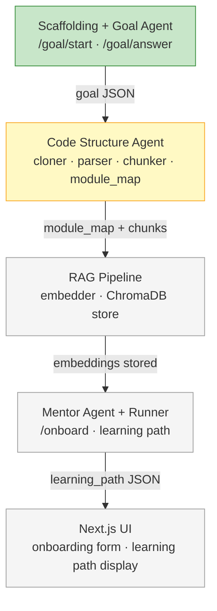

# Phase 1 — Core Pipeline

End-to-end pipeline: user provides a GitHub repo URL + goal → system returns a personalized learning path.

**Done when:** POST /onboard works on `psf/requests` and `fastapi/fastapi` with coherent output under $0.10/run.

---

## Build order

> Green = done · Yellow = in progress · Grey = pending

---

### Part 1 — Scaffolding + Goal Agent ✓ (done)

### Part 2 — Code Structure Agent 🚧 (in progress)

**Scaffolding**
- Init Python project with `uv`
- Install: `anthropic`, `fastapi`, `uvicorn`, `pydantic`, `python-dotenv`
- Create directory structure (see CLAUDE.md)
- `.env.example` with required keys

**Goal Agent (`backend/agents/goal_agent.py`)**
- Multi-turn dialogue: 3 questions, collect answers, produce validated goal JSON
- Questions:
  1. "What do you want to be able to do after this session?"
  2. "How familiar are you with this type of codebase?"
  3. "How much time do you have?"
- Validate output with Pydantic model
- Model: `claude-haiku-4-5`

**FastAPI endpoints**
- `POST /goal/start` → `{ session_id, first_question }`
- `POST /goal/answer` → `{ next_question }` or `{ goal: {...} }` when complete

**Test:** Run Goal Agent manually with 5 different inputs. Confirm goal JSON is consistent and valid.

---

### Part 2 — Code Structure Agent

#### Progress
- `backend/pipeline/state.py` ✅
- `backend/rag/cloner.py` ✅
- `backend/rag/chunker.py` ✅
- `backend/agents/code_structure_agent.py` ✅
- Manual test on `psf/requests` ⬜

Install: `gitpython`, `tree-sitter`, `tree-sitter-python` ✅ (added to pyproject.toml)

**`backend/rag/cloner.py`** ✅
- `git clone --depth 1 <url> data/repos/<repo_name>`
- Return local path

**`backend/rag/chunker.py`** ✅
- Walk `.py` files in cloned repo
- tree-sitter parse each file
- Extract: function defs, class defs, top-level imports
- Each chunk: `{ file, start_line, end_line, type, name, language, content }`
- Phase 1: Python only

**`backend/agents/code_structure_agent.py`** ✅
- Input: list of chunks
- Ask Haiku to summarize the module map: "Given these modules and their exports, describe the architecture in 200 words and identify the key entry points"
- Output: `module_map` dict — `{ module_name: { purpose, key_files, exports, dependencies } }`
- Model: `claude-haiku-4-5`

**Test:** Run on `psf/requests`. Inspect `module_map` manually — does it identify `sessions.py`, `adapters.py`, `auth.py` correctly?

---

### Part 3 — RAG Pipeline

Install: `chromadb`, `voyageai`

**`backend/rag/embedder.py`**
- Embed chunk list using `voyage-code-2`
- Batch embed (Voyage AI supports batch calls)

**`backend/rag/store.py`**
- ChromaDB persistent store at `./data/chroma/`
- Collection key: `{owner}/{repo}@{commit_sha}`
- `upsert_chunks(chunks, embeddings)` — skip if collection exists
- `query(text, k=10)` → top-k chunks with metadata

**Wire into Code Structure Agent**
- After parsing: embed chunks → store in ChromaDB
- Set `state.chunks_embedded = True`

**Test:** Embed `psf/requests`. Query `"how does authentication work"`. Confirm top-10 results include chunks from `auth.py`.

---

### Part 4 — Mentor Agent + Pipeline

**`backend/agents/mentor_agent.py`**
- Retrieve top-10 chunks from ChromaDB using `goal.primary_goal` as query text
- Build prompt: goal JSON + module_map + retrieved chunks
- Ask Sonnet to generate ordered 5–8 step learning path
- Each step matches the learning path step schema (see CLAUDE.md)
- Validate output with Pydantic
- Model: `claude-sonnet-4-6`

**`backend/pipeline/runner.py`**
- `run_pipeline(repo_url, goal) → OnboardState`
- Sequential: Goal (already done) → Code Structure → Mentor
- Write errors to `state.errors`, never raise unless unrecoverable

**FastAPI endpoint**
- `POST /onboard` — body: `{ repo_url, goal }` → returns `{ learning_path, module_map, confidence }`

**Test end-to-end:**
- POST /onboard with `psf/requests` + goal `{ goal_type: understand_component, focus_area: authentication, experience_level: intermediate }`
- Inspect: do steps reference real files? Is the order logical?
- Repeat with `fastapi/fastapi`
- Check Anthropic dashboard: confirm under $0.10/run

---

### Part 5 — Minimal Next.js UI

Init: `npx create-next-app frontend --typescript --tailwind`

**Page 1 — Onboarding form**
- Input: GitHub repo URL
- Goal dialogue: calls `/goal/start`, then `/goal/answer` turn by turn
- Feels conversational (one question at a time), not a form
- "Start" button triggers `/onboard` once goal is complete

**Page 2 — Learning path display**
- Show steps in order: number, title, file + line range, why, what to understand
- File + line range displayed as a copyable code reference
- Loading state while pipeline runs

**Test:** Full flow in browser on both target repos.

---

## Token budget

| Agent | Model | Est. tokens | Est. cost |
|---|---|---|---|
| Goal Agent | `claude-haiku-4-5` | ~500 | ~$0.0004 |
| Code Structure Agent | `claude-haiku-4-5` | ~3,000 | ~$0.002 |
| Mentor Agent | `claude-sonnet-4-6` | ~5,000 | ~$0.07 |
| **Total** | | ~8,500 | **~$0.07/run** |

---

## Out of scope for Phase 1

- Documentation Agent
- Prioritization Agent
- LangGraph (plain Python chain only)
- MCP (agents call ChromaDB directly)
- TTS / video
- VS Code extension
- Multi-language support beyond Python
- User accounts / auth
