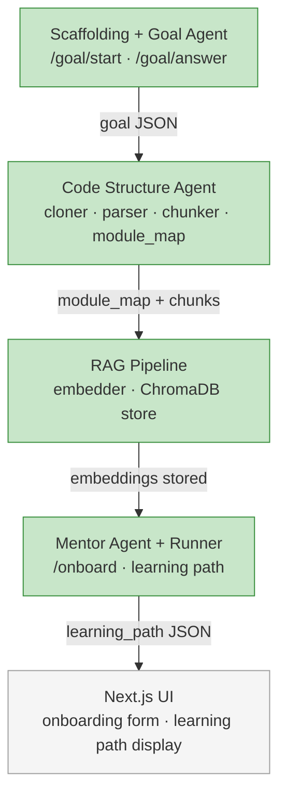

# Phase 1 — Core Pipeline

End-to-end pipeline: user provides a GitHub repo URL + goal → system returns a personalized learning path.

**Done when:** POST /onboard works on `psf/requests` and `fastapi/fastapi` with coherent output under $0.10/run.

---

## Build order

> Green = done · Yellow = in progress · Grey = pending

---

### Part 1 — Scaffolding + Goal Agent ✓ (done)

### Part 2 — Code Structure Agent ✓ (done)

**Scaffolding**
- Init Python project with `uv`
- Install: `anthropic`, `fastapi`, `uvicorn`, `pydantic`, `python-dotenv`
- Create directory structure (see CLAUDE.md)
- `.env.example` with required keys

**Goal Agent (`backend/agents/goal_agent.py`)**
- Multi-turn dialogue: 3 questions, collect answers, produce validated goal JSON
- Questions:
  1. "What do you want to be able to do after this session?"
  2. "How familiar are you with this type of codebase?"
  3. "How much time do you have?"
- Validate output with Pydantic model
- Model: `claude-haiku-4-5`

**FastAPI endpoints**
- `POST /goal/start` → `{ session_id, first_question }`
- `POST /goal/answer` → `{ next_question }` or `{ goal: {...} }` when complete

**Test:** Run Goal Agent manually with 5 different inputs. Confirm goal JSON is consistent and valid.

---

### Part 2 — Code Structure Agent ✓ (done)

#### Progress
- `backend/pipeline/state.py` ✅
- `backend/rag/cloner.py` ✅
- `backend/rag/chunker.py` ✅
- `backend/agents/code_structure/agent.py` ✅
- Manual test on `psf/requests` ✅
- Chunker exclusion of tests/docs/examples and `test_*.py` / `*_test.py` ✅
- Method-level chunks emitted inside classes ✅
- `_top_level_chunks` filter to keep module-map prompt high-level ✅

Install: `gitpython`, `tree-sitter`, `tree-sitter-python` ✅ (added to pyproject.toml)

**`backend/rag/cloner.py`** ✅
- `git clone --depth 1 <url> data/repos/<repo_name>`
- Return local path

**`backend/rag/chunker.py`** ✅
- Walk `.py` files in cloned repo
- tree-sitter parse each file
- Extract: function defs, class defs, top-level imports
- Each chunk: `{ file, start_line, end_line, type, name, language, content }`
- Phase 1: Python only

**`backend/agents/code_structure_agent.py`** ✅
- Input: list of chunks
- Ask Haiku to summarize the module map: "Given these modules and their exports, describe the architecture in 200 words and identify the key entry points"
- Output: `module_map` dict — `{ module_name: { purpose, key_files, exports, dependencies } }`
- Model: `claude-haiku-4-5`

**Test:** Run on `psf/requests`. Inspect `module_map` manually — does it identify `sessions.py`, `adapters.py`, `auth.py` correctly?

---

### Part 3 — RAG Pipeline ✓ (done)

Install: `sentence-transformers`, `chromadb` ✅ (added to pyproject.toml)

**`backend/rag/embedder.py`** ✅
- Embeds chunks using `nomic-ai/nomic-embed-text-v1.5` via sentence-transformers (runs locally, no API key)
- `embed_documents(texts)` applies `search_document: ` prefix; `embed_query(text)` applies `search_query: ` prefix
- Model lazy-loaded once via `@lru_cache`; first call downloads ~550 MB from Hugging Face

**`backend/rag/store.py`** ✅
- ChromaDB persistent store at `./data/chroma/`
- Collection name: sanitized `{owner}_{repo}_{commit_sha[:12]}` (lowercased, non-alphanumeric → `_`)
- `add_chunks(name, chunks, embeddings)` writes id + document + metadata `{file, start_line, end_line, type, name, language}`
- `collection_exists(name)` → caching check
- `query(name, query_embedding, top_k)` → ready for Mentor Agent

**Wire into Code Structure Agent** ✅
- `_embed_chunks()` runs after chunking; skips on cache hit, embeds + stores otherwise
- Sets `state.chunks_embedded = True`
- Wrapped in try/except so embedding failures don't block the module-map LLM call

**Test:** Embed `psf/requests`. Query `"how does authentication work"`. Confirm top-10 results include chunks from `auth.py`. ⬜ (pending — needs Mentor Agent or a manual script)

---

### Part 4 — Mentor Agent + Pipeline ✓ (done)

**`backend/agents/mentor/agent.py`** ✅
- Goal-aware retrieval: `understand_system` runs a per-module sweep across the
  module map (`PER_MODULE_TOP_K=2` per module, capped at `TOP_K=20`); the
  other three goal types run one focused query enriched with their goal-
  specific fields (`focus_area`, `contribution_context`, `error_description`
  + `tried_so_far`).
- `_drop_redundant_class_chunks` filters out any class chunk when one of its
  methods is also in the retrieval result — keeps the narrower anchor.
- One Sonnet call per run, plus at most one retry when the LLM emits
  duplicate `(file, line_range)` step anchors. `_find_duplicate_anchors` +
  `_retry_distinct_anchors` provide the validation and retry; persistent
  duplicates are logged to `state.errors` and the original output is kept.
- Output validated through `MentorOutput` (Pydantic).
- Model: `claude-sonnet-4-6`

**`backend/pipeline/runner.py`** ✅
- `run_pipeline(repo_url, goal) → OnboardState`
- Sequential: Goal (already done) → Code Structure → Mentor
- Errors written to `state.errors`, never raises unless unrecoverable

**FastAPI endpoint** ✅
- `POST /onboard` — body: `{ repo_url, goal }` → returns `{ learning_path, module_map, confidence }`

**Smoke tests:**
- `scripts/smoke_onboard.py` — `psf/requests` across all 4 goal types ✅
- `scripts/smoke_onboard_submarines.py` — submarine planner repo across all 4 goal types ✅

**Reference docs:**
- [`docs/reference/agents/mentor-agent.md`](../../reference/agents/mentor-agent.md) — full agent reference

---

### Part 5 — Minimal Next.js UI

Init: `npx create-next-app frontend --typescript --tailwind`

**Page 1 — Onboarding form**
- Input: GitHub repo URL
- Goal dialogue: calls `/goal/start`, then `/goal/answer` turn by turn
- Feels conversational (one question at a time), not a form
- "Start" button triggers `/onboard` once goal is complete

**Page 2 — Learning path display**
- Show steps in order: number, title, file + line range, why, what to understand
- File + line range displayed as a copyable code reference
- Loading state while pipeline runs

**Test:** Full flow in browser on both target repos.

---

## Token budget

| Agent | Model | Est. tokens | Est. cost |
|---|---|---|---|
| Goal Agent | `claude-haiku-4-5` | ~500 | ~$0.0004 |
| Code Structure Agent | `claude-haiku-4-5` | ~3,000 | ~$0.002 |
| Mentor Agent | `claude-sonnet-4-6` | ~5,000 | ~$0.07 |
| **Total** | | ~8,500 | **~$0.07/run** |

---

## Out of scope for Phase 1

- Documentation Agent
- Prioritization Agent
- LangGraph (plain Python chain only)
- MCP (agents call ChromaDB directly)
- TTS / video
- VS Code extension
- Multi-language support beyond Python
- User accounts / auth
