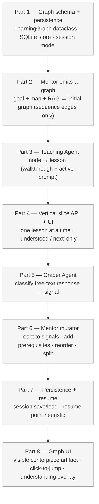

# Phase 3 — Interactive Learning Graph

The static 5–8 step path becomes an **interactive, adaptive learning session**. The **Mentor Agent evolves**: it stops producing a flat list and starts owning a learning graph (initial generation in Part 2, mutation in Part 6). Two new sibling agents join — **Teaching** (Part 3) and **Grader** (Part 5). The Mentor's learning graph is also the **user's understanding graph** — persisted per repo and surfaced as the product's centerpiece UI artifact.

Vision detail and rationale live in [`roadmap.md`](roadmap.md#phase-3--interactive-learning-graph). This doc is the build plan.

**Done when:**
- User can run a session that streams one lesson at a time, sends signals (got it / deeper / confused / skip), and the next lesson is conditioned on those signals.
- Free-text responses are graded and the classification influences the next lesson.
- The graph demonstrably mutates during a session on at least one target repo (`psf/requests`).
- The user's understanding graph persists across sessions: closing the app and returning loads the same graph in the same state, with a sensible resume point.
- The graph is visible to the user as the central UI artifact — not hidden inside the agent.

**Scope warning.** Phase 3 is roughly 3–4× the size of Phase 1. Three new agents, a stateful session model, a persistence layer, and a non-trivial graph UI. The build order below front-loads a **thinnest vertical slice** so there's a working end-to-end loop early, then layers mutation / persistence / polish on top. Resist the urge to perfect any one part before the slice runs.

---

## Build order

> Parts 1–4 are the **vertical slice**: by the end of Part 4 a user can step through a fixed graph one lesson at a time. Parts 5–8 turn it into the adaptive product.

---

### Part 1 — Graph schema + persistence ✓ (done)

Skeleton data model + persistence for future steps. No agent code yet; no user flow yet.

**`backend/learning/graph.py`** ✅ — pure dataclasses, no LLM, no IO.
- `LearningNode`: `id` (auto-generated uuid4 hex), `title`, `code_anchor: CodeAnchor`, `concept_tags`, `lesson_brief`, `understanding_state` (`"not-yet" | "partial" | "understood"`), `visited`, `weak_spot` (sticky once set), `user_override`, `cached_lesson`.
- `LearningGraph`: `session_id` (auto-generated), `repo_url`, `goal`, `nodes`, `edges`, `current_node_id`.
- Edge kinds: `sequence` / `prerequisite` / `deeper`.
- Mutation style: in-place (matches `OnboardState`). Methods: `add_node`, `add_edge`, `set_current`, `mark_visited`, `mark_understanding`, `override`, `insert_before` (reroutes sequence edges), `insert_after` (hangs a deeper detour without disturbing sequence).
- Derived: `readiness()` → `understood / total`.

**`backend/learning/store.py`** ✅ — SQLite persistence.
- `data/sessions.db`, three tables: `sessions`, `nodes`, `edges` (with `ON DELETE CASCADE`).
- `save_graph(graph)` / `load_graph(session_id)` / `list_sessions_for_repo(repo_url)` / `delete_session(session_id)`.
- Schema versioning: `schema_version` column; mismatched versions return `None` (no migration logic).
- Millisecond-precision timestamps (`strftime('%Y-%m-%d %H:%M:%f', 'now')`) so session ordering by `updated_at` is stable.

**`OnboardState`** ✅ — added `graph: LearningGraph | None` and `current_lesson: dict | None`. `errors` reducer intact.

**Tests** ✅ — 32 tests across `tests/test_learning_graph.py` (mutation behaviour, readiness math, edge rerouting) and `tests/test_learning_store.py` (save/reload roundtrip, mutation persistence, schema-version mismatch, ordering, cascade delete, cached-lesson roundtrip).

**Deliberately deferred — to revisit when needed:**
- **User identity / multi-user.** Single anonymous user for now. When Part 7 (resume) or Phase 5 (extension) actually needs multiple users, add a `user_id` column + index and a parameter to `list_sessions_for_repo`.
- **Repo URL normalization.** Stored as-is. When Part 7 needs to match `GitHub.com/x/y.git` to `github.com/x/y` for resume lookups, add `normalize_repo_url` at the store boundary.
- **Identity helpers module.** Skipped a separate `ids.py`; UUID generation lives inline in `graph.py` as `_new_id()`. If identity grows beyond UUIDs (user IDs, repo fingerprints, anchor signatures) it can be promoted to its own module then.
- **Rich code anchors (cross-file context, callers/callees, imports).** A `LearningNode` currently anchors on one contiguous `(file, line_start, line_end)` range. Real-world teaching often needs more surrounding context — the imports at the top of the file, the caller that invokes a function, the parent class in the inheritance chain, related cross-file flows ("this is called from `sessions.py:200`, defined here, dispatches to `adapters.py:50`"). Phase 3 keeps the single-range anchor and works around the gap by having the Teaching Agent pull 1–2 supporting chunks from RAG into its prompt. **Treat this as an initial anchor strategy, not the final retrieval/teaching model.** A future phase should evolve the schema toward a richer anchor — primary range + a list of supporting anchors, or a small sub-graph of related code regions.

---

### Part 2 — Mentor emits a graph ✓ (done)

The Mentor evolves: same inputs (`goal + module_map + relevant_modules + RAG`), same single Sonnet call, but the output is now a `LearningGraph` instead of a flat step list. The Phase 1 `learning_path` field is **derived** from the graph (walk sequence edges, render each node as the old step JSON), so `/onboard` returns the same shape without a second LLM call.

**`backend/rag/retrieval.py`** ✅ — lifted from Mentor in a pure refactor.
- Public entry: `retrieve_chunks(state)`. Internal helpers (`rrf_fuse`, `select_with_file_cap`, `drop_redundant_class_chunks`, query builders, per-module/per-pool strategies) exposed for direct testing.
- Mentor + future Teaching Agent both use this module — no copy-paste.

**`backend/agents/mentor/agent.py`** ✅ — output shape evolved.
- New `MentorOutput` Pydantic shape: `{nodes: [NodeWire], edges: [EdgeWire], confidence}`. `NodeWire` has `id` (local, e.g. `"n1"`), `title`, `file`, `line_start`, `line_end`, `why`, `understand`, `concept_tags`. `EdgeWire` has `from_id`, `to_id`, `kind` (always `"sequence"` in Part 2).
- System prompt updated: asks for 5–8 nodes anchored on distinct chunks, plus N−1 sequence edges forming one ordered chain. Edge `kind` field is permissive (`sequence | prerequisite | deeper`) so the Part 6 mutator can reuse the same wire format.
- Retries unchanged in spirit: duplicate-anchor retry + grounding retry, both rewritten to operate on `output.nodes`.
- Wire IDs → UUIDs translation lives in `_build_learning_graph`. Sonnet works with simple `"n1"/"n2"` identifiers; the LearningNode gets a fresh uuid4 hex.
- Picks `current_node_id` as the head of the sequence (node with no incoming sequence edge).
- `_flatten_to_learning_path` walks sequence edges to produce the legacy step JSON for `/onboard`.

**`backend/pipeline/graph.py`** ✅ — the `mentor_node` returns `graph` alongside `learning_path` and `confidence`.

**Tests** ✅ — 34 mentor tests + 23 retrieval tests. New coverage: wire-id remapping, lesson_brief assembly, sequence-head detection, learning_path derivation, graph/repo_url/goal carried through. All 163 tests pass.

**Note on model choice.** Phase 1's rule was "Sonnet only in Mentor, once per run." Phase 3 broadens but doesn't break this:
- **Mentor** — Sonnet, one call at session start (Part 2 ✓). Adds one Sonnet call per mutation event in Part 6 (rare-ish, mostly triggered by `confused`/`deeper`/`simpler`).
- **Teaching** (Part 3) — Haiku per lesson (called in a loop). Risk: quality.
- **Grader** (Part 5) — Haiku per user response (called in a loop). Risk: low — classification is easy.

See the **Open design decisions** section for the budget rethink — this is a real decision that affects cost.

---

### Part 3 — Teaching Agent

Expands a single node's lesson brief into the **actual lesson**: walkthrough, examples, architectural context, "what to pay attention to," and **one active-learning prompt** at the end.

**`backend/agents/teaching/agent.py`**
- Input: `node`, `graph` (for prior-context awareness — which nodes are already understood), `goal`, RAG handle.
- Pulls the actual source for the node's `code_anchor` from disk (not RAG — we already know the file/lines), plus 1–2 supporting chunks from RAG for cross-references. The supporting chunks are the **workaround for the rigid single-range anchor** (see Part 1's deferred block — "Rich code anchors"): they let Teaching reach for imports / callers / related flows even though the node's anchor itself is one contiguous range.
- One Haiku call. System prompt: "you're tutoring a developer at experience-level X, the user already understands these nodes, this node's lesson brief is Y, the source code is Z. Output: walkthrough markdown + one active-learning prompt + prompt_kind."
- Output validated through `LessonOutput` Pydantic model: `walkthrough: str (markdown)`, `prompt: str`, `expected_answer: str` (used later by the Grader), `prompt_kind: "predict-then-reveal"` (locked to one form for v1 — see Open decisions).

**Test:**
- On a known node from the `requests` graph, generate a lesson. Manually verify: walkthrough references the real code, the prompt is answerable from the walkthrough, no hallucinated file paths.
- Same node, different `goal.experience_level` → lesson tone shifts.

---

### Part 4 — Vertical slice API + UI

**This is the integration gate.** By the end of Part 4 you can run an end-to-end session with no mutation, no grading, no persistence — just *one lesson at a time, click "next."* If this doesn't feel right, fix it here before adding adaptivity.

**API (additions to `backend/api.py`):**
- `POST /session/start` — body: `{ repo_url, goal }` → runs Code Structure + Prioritization + Mentor. Returns `{ session_id, graph }`.
- `GET /session/{id}/lesson` — runs Teaching on `graph.current_node`. Returns `{ lesson, node_id }`.
- `POST /session/{id}/advance` — body: `{ signal: "next" }`. Marks current node visited, advances `current_node_id` along the sequence, returns next lesson or `{ done: true }`.

**UI (additions to `frontend/`):**
- New `/session/[id]` page. Left pane: lesson markdown. Right pane: a *list* view of the graph (a real graph view comes in Part 8). Current node highlighted; previously visited nodes greyed.
- One button: **Got it, next**. Calls `/advance` with `signal: "next"`.

**Done when:** A run on `psf/requests` walks the user through 6–10 lessons, in order, click by click, with no errors.

---

### Part 5 — Grader Agent

Classifies **free-text** user responses to active-learning prompts.

**`backend/agents/grader/agent.py`**
- Input: `prompt`, `expected_answer` (Teaching can produce this alongside the lesson — add to `LessonOutput`), `user_response`.
- One Haiku call. Classification only: `"understood" | "partial" | "confused" | "off-topic"`. Plus a one-sentence rationale (for debugging, not shown to user in v1).
- Pydantic-validated, with a fallback to `"partial"` on parse failure (graceful — never blocks).

**API addition:**
- `POST /session/{id}/respond` — body: `{ response: str }`. Calls Grader, updates the current node's `understanding_state`, sets `weak_spot=True` if confused. Does **not** mutate the graph yet — that's Part 6. Returns `{ classification, rationale }`.

**UI addition:**
- Lesson page gets a free-text input + Submit button below the active prompt. After submit, show the classification and reveal "Continue" → calls `/advance`.

**Test:**
- Synthesize 10 (prompt, expected, response) triples by hand — 3 obviously understood, 3 obviously confused, 4 ambiguous. Grader matches your judgment on the first 6 and gives sane partial/confused calls on the rest.

---

### Part 6 — Mentor gains a mutator

The Mentor stops being one-shot. On each user signal, it decides whether to mutate the graph.

**Signals that can trigger mutation:**
- Explicit user actions: *deeper*, *simpler*, *skip*, *go to architecture first*.
- Grader-derived: `confused` → consider inserting a prerequisite node; `understood` repeatedly → consider raising depth.

**`backend/agents/mentor/mutator.py`** (separate from initial-graph generator, same module):
- Input: `graph`, `signal`, optionally `current_node`.
- Decides one of: `no-op` / `insert_prerequisite(before=node_id, new_node=...)` / `insert_deeper(after=node_id, new_node=...)` / `reorder(...)` / `skip(node_id)`.
- One Sonnet call **only when the signal is ambiguous or requires generating a new node**. Cheap signals (`skip`, explicit `next`) bypass the LLM and mutate via pure-Python rules using `LearningGraph.insert_before` / `insert_after` / `override`.
- Returns a mutated `LearningGraph`.

**API additions:**
- Extend `/advance` to accept signals beyond `next`: `deeper`, `simpler`, `skip`, `confused`.
- Add `POST /session/{id}/override` for direct user-driven graph edits (mark understood, mark weak, drop node).

**UI additions:**
- Lesson page: row of signal buttons (deeper / simpler / skip / "I'm lost").
- New nodes inserted by the mutator visibly appear in the right-pane list.

**Test:**
- Trigger `confused` on a node that has an obvious prerequisite (e.g. ask about adapters before sessions). Mutator inserts the prerequisite node before the current one. Run the session forward — prerequisite is taught first, then the original.

---

### Part 7 — Persistence + resume

The vertical slice already writes to SQLite at session start. Now wire up **load and resume**.

- `POST /session/start` checks if a graph already exists for `(user_id="local", repo_url, goal.primary_goal)`. If so, returns the existing one with `resumed: true`.
- Save the graph on every state change (cheap — SQLite, single-row write).
- Resume point heuristic: prefer the first unvisited node that has all its prerequisites understood; fall back to `current_node_id` from the saved graph.
- UI: on a repeat visit to the same repo + goal, show "Resume from Step N" vs "Start over."

**Test:**
- Run a session through 3 lessons, kill the server, restart, hit `/session/start` with the same repo + goal → resumes at lesson 4.

---

### Part 8 — Graph UI (the centerpiece)

The graph stops being a list and becomes the **central visible artifact**.

- Pick a JS graph library — `react-flow` is the leading candidate (good DX, controllable layout, custom node React components). See Open decisions.
- Visual encoding:
  - Node color = `understanding_state` (grey / yellow / green).
  - Outline = `current_node` (thick blue) / `weak_spot` (red).
  - Edge style = `sequence` (solid) / `prerequisite` (dashed) / `deeper` (dotted).
- Interactions:
  - Click a visited node → jump back to that lesson.
  - Right-click → user override menu (mark understood / mark weak / skip).
  - Top-right: readiness gauge.
- Layout: top-down DAG layout, computed once per mutation (don't animate — the cognitive load isn't worth it for v1).

**Test:**
- Walk a full session on `psf/requests`. Graph reflects state at every step. Clicking a past node loads its lesson without breaking forward state.

---

## Open design decisions

These were deferred in the roadmap. **Lock each one before it blocks its part.**

| # | Decision | Default for now | Blocks |
|---|---|---|---|
| 1 | Active-learning prompt form for v1 | `predict-then-reveal` (lowest grading complexity) | Part 3 |
| 2 | Mentor: keep Sonnet for initial graph? | Yes, once per session (locked in Part 2). Mutator uses Haiku when possible, Sonnet only when generating new node content | Part 2 ✓ |
| 3 | Persistence: SQLite vs JSON files | SQLite — queries by repo are awkward in JSON, and we'll want them in Phase 5 (locked in Part 1) | Part 1 ✓ |
| 4 | Identity model | Anonymous, repo-scoped, no `user_id` column yet. Add when Part 7 / Phase 5 actually need it. | Part 1 ✓ |
| 5 | Graph UI library | `react-flow` (React-native, good docs, custom nodes) | Part 8 |
| 6 | Mutator: rule-based vs LLM-driven | Hybrid. Cheap signals (`skip`, `next`) → pure Python. Signals that need new content (`deeper`, `confused`-needs-prerequisite) → Sonnet | Part 6 |
| 7 | Lesson regeneration on revisit | Cache the rendered lesson on first generation; regenerate only on user request (`/lesson?refresh=true`) | Part 4 |

Anything else uncovered during build that needs a call: append here with a default, don't block the part.

---

## Token budget (rough — Phase 3 changes the rules)

| Agent | Model | When | Est. per session |
|---|---|---|---|
| Goal Agent | Haiku | 1× at start | ~$0.0004 |
| Code Structure Agent | Haiku | 1× at start | ~$0.002 |
| Prioritization Agent | Haiku | 1× at start | ~$0.001 |
| Mentor (initial graph) | Sonnet | 1× at start | ~$0.07 |
| Teaching | Haiku | per lesson, 6–10× | ~$0.03 |
| Grader | Haiku | per response, 6–10× | ~$0.01 |
| Mentor (mutator) | Sonnet | ~2× per session (avg) | ~$0.04 |
| **Total** | | | **~$0.15/session** |

**This breaks the Phase 1 $0.10 budget.** Two mitigations to evaluate during Part 6:
- Cache Mentor mutator decisions for common signal patterns (`confused` on the same node twice → same prerequisite).
- Try Haiku for the mutator entirely; only fall back to Sonnet when Haiku's output fails validation.

Document the realized per-session cost in the recap once Parts 1–4 are running.

---

## Out of scope for Phase 3

- Multi-user / team-shared graphs.
- Repo dependency overlays (cross-repo learning).
- Exportable progress reports.
- Login / cloud sync.
- TTS narration on lessons (Phase 4).
- Video walkthroughs (Phase 4).
- VS Code extension (Phase 5).
- New language support beyond Python (Phase 2 task, not blocking Phase 3 if we stay on `psf/requests` for development).
