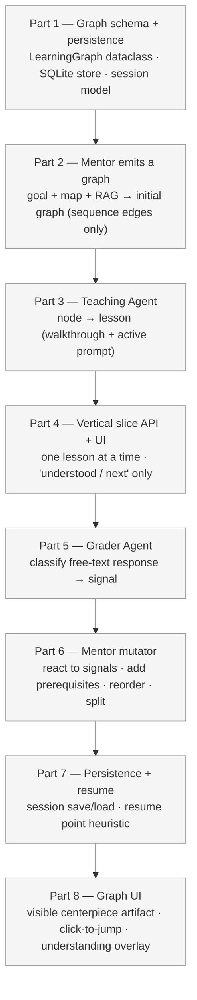

# Phase 3 — Interactive Learning Graph

The static 5–8 step path becomes an **interactive, adaptive learning session**. The **Mentor Agent evolves**: it stops producing a flat list and starts owning a learning graph (initial generation in Part 2, mutation in Part 6). Two new sibling agents join — **Teaching** (Part 3) and **Grader** (Part 5). The Mentor's learning graph is also the **user's understanding graph** — persisted per repo and surfaced as the product's centerpiece UI artifact.

Vision detail and rationale live in [`roadmap.md`](roadmap.md#phase-3--interactive-learning-graph). This doc is the build plan.

**Done when:**
- User can run a session that streams one lesson at a time, sends signals (got it / deeper / confused / skip), and the next lesson is conditioned on those signals.
- Free-text responses are graded and the classification influences the next lesson.
- The graph demonstrably mutates during a session on at least one target repo (`psf/requests`).
- The user's understanding graph persists across sessions: closing the app and returning loads the same graph in the same state, with a sensible resume point.
- The graph is visible to the user as the central UI artifact — not hidden inside the agent.

**Scope warning.** Phase 3 is roughly 3–4× the size of Phase 1. Three new agents, a stateful session model, a persistence layer, and a non-trivial graph UI. The build order below front-loads a **thinnest vertical slice** so there's a working end-to-end loop early, then layers mutation / persistence / polish on top. Resist the urge to perfect any one part before the slice runs.

---

## Build order

> Parts 1–4 are the **vertical slice**: by the end of Part 4 a user can step through a fixed graph one lesson at a time. Parts 5–8 turn it into the adaptive product.

---

### Part 1 — Graph schema + persistence ✓ (done)

Skeleton data model + persistence for future steps. No agent code yet; no user flow yet.

**`backend/learning/graph.py`** ✅ — pure dataclasses, no LLM, no IO.
- `LearningNode`: `id` (auto-generated uuid4 hex), `title`, `code_anchor: CodeAnchor`, `concept_tags`, `lesson_brief`, `understanding_state` (`"not-yet" | "partial" | "understood"`), `visited`, `weak_spot` (sticky once set), `user_override`, `cached_lesson`.
- `LearningGraph`: `session_id` (auto-generated), `repo_url`, `goal`, `nodes`, `edges`, `current_node_id`.
- Edge kinds: `sequence` / `prerequisite` / `deeper`.
- Mutation style: in-place (matches `OnboardState`). Methods: `add_node`, `add_edge`, `set_current`, `mark_visited`, `mark_understanding`, `override`, `insert_before` (reroutes sequence edges), `insert_after` (hangs a deeper detour without disturbing sequence).
- Derived: `readiness()` → `understood / total`.

**`backend/learning/store.py`** ✅ — SQLite persistence.
- `data/sessions.db`, three tables: `sessions`, `nodes`, `edges` (with `ON DELETE CASCADE`).
- `save_graph(graph)` / `load_graph(session_id)` / `list_sessions_for_repo(repo_url)` / `delete_session(session_id)`.
- Schema versioning: `schema_version` column; mismatched versions return `None` (no migration logic).
- Millisecond-precision timestamps (`strftime('%Y-%m-%d %H:%M:%f', 'now')`) so session ordering by `updated_at` is stable.

**`OnboardState`** ✅ — added `graph: LearningGraph | None` and `current_lesson: dict | None`. `errors` reducer intact.

**Tests** ✅ — 32 tests across `tests/test_learning_graph.py` (mutation behaviour, readiness math, edge rerouting) and `tests/test_learning_store.py` (save/reload roundtrip, mutation persistence, schema-version mismatch, ordering, cascade delete, cached-lesson roundtrip).

**Deliberately deferred — to revisit when needed:**
- **User identity / multi-user.** Single anonymous user for now. When Part 7 (resume) or Phase 5 (extension) actually needs multiple users, add a `user_id` column + index and a parameter to `list_sessions_for_repo`.
- **Repo URL normalization.** Stored as-is. When Part 7 needs to match `GitHub.com/x/y.git` to `github.com/x/y` for resume lookups, add `normalize_repo_url` at the store boundary.
- **Identity helpers module.** Skipped a separate `ids.py`; UUID generation lives inline in `graph.py` as `_new_id()`. If identity grows beyond UUIDs (user IDs, repo fingerprints, anchor signatures) it can be promoted to its own module then.
- **Rich code anchors (cross-file context, callers/callees, imports).** A `LearningNode` currently anchors on one contiguous `(file, line_start, line_end)` range. Real-world teaching often needs more surrounding context — the imports at the top of the file, the caller that invokes a function, the parent class in the inheritance chain, related cross-file flows ("this is called from `sessions.py:200`, defined here, dispatches to `adapters.py:50`"). Phase 3 keeps the single-range anchor and works around the gap by having the Teaching Agent pull 1–2 supporting chunks from RAG into its prompt. **Treat this as an initial anchor strategy, not the final retrieval/teaching model.** A future phase should evolve the schema toward a richer anchor — primary range + a list of supporting anchors, or a small sub-graph of related code regions.

---

### Part 2 — Mentor emits a graph ✓ (done)

The Mentor evolves: same inputs (`goal + module_map + relevant_modules + RAG`), same single Sonnet call, but the output is now a `LearningGraph` instead of a flat step list. The Phase 1 `learning_path` field is **derived** from the graph (walk sequence edges, render each node as the old step JSON), so `/onboard` returns the same shape without a second LLM call.

**`backend/rag/retrieval.py`** ✅ — lifted from Mentor in a pure refactor.
- Public entry: `retrieve_chunks(state)`. Internal helpers (`rrf_fuse`, `select_with_file_cap`, `drop_redundant_class_chunks`, query builders, per-module/per-pool strategies) exposed for direct testing.
- Mentor + future Teaching Agent both use this module — no copy-paste.

**`backend/agents/mentor/agent.py`** ✅ — output shape evolved.
- New `MentorOutput` Pydantic shape: `{nodes: [NodeWire], edges: [EdgeWire], confidence}`. `NodeWire` has `id` (local, e.g. `"n1"`), `title`, `file`, `line_start`, `line_end`, `why`, `understand`, `concept_tags`. `EdgeWire` has `from_id`, `to_id`, `kind` (always `"sequence"` in Part 2).
- System prompt updated: asks for 5–8 nodes anchored on distinct chunks, plus N−1 sequence edges forming one ordered chain. Edge `kind` field is permissive (`sequence | prerequisite | deeper`) so the Part 6 mutator can reuse the same wire format.
- Retries unchanged in spirit: duplicate-anchor retry + grounding retry, both rewritten to operate on `output.nodes`.
- Wire IDs → UUIDs translation lives in `_build_learning_graph`. Sonnet works with simple `"n1"/"n2"` identifiers; the LearningNode gets a fresh uuid4 hex.
- Picks `current_node_id` as the head of the sequence (node with no incoming sequence edge).
- `_flatten_to_learning_path` walks sequence edges to produce the legacy step JSON for `/onboard`.

**`backend/pipeline/graph.py`** ✅ — the `mentor_node` returns `graph` alongside `learning_path` and `confidence`.

**Tests** ✅ — 34 mentor tests + 23 retrieval tests. New coverage: wire-id remapping, lesson_brief assembly, sequence-head detection, learning_path derivation, graph/repo_url/goal carried through. All 163 tests pass.

**Note on model choice.** Phase 1's rule was "Sonnet only in Mentor, once per run." Phase 3 broadens but doesn't break this:
- **Mentor** — Sonnet, one call at session start (Part 2 ✓). Adds one Sonnet call per mutation event in Part 6 (rare-ish, mostly triggered by `confused`/`deeper`/`simpler`).
- **Teaching** (Part 3) — Haiku per lesson (called in a loop). Risk: quality.
- **Grader** (Part 5) — Haiku per user response (called in a loop). Risk: low — classification is easy.

See the **Open design decisions** section for the budget rethink — this is a real decision that affects cost.

---

### Part 3 — Teaching Agent ✓ (done)

Expands a single node's lesson brief into the **actual lesson**: a walkthrough plus one active-learning prompt. Skeleton scope — the agent exists and is fully tested, but is **not yet wired into the pipeline or an API endpoint**. Part 4 calls it from `GET /session/{id}/lesson`.

**`backend/agents/teaching/agent.py`** ✅
- `run(state, client)` — operates on `state.graph.current_node_id`. Errors append to `state.errors`, never raises.
- **Caching:** if the node already has a `cached_lesson` (prior visit), reuse it — no LLM call. (Refresh-on-demand is a Part 4 concern.)
- Reads the node's source from disk (`{repo_path}/{file}` lines `start:end`, 1-indexed inclusive). A read failure aborts cleanly without calling the LLM.
- Pulls 1–2 supporting chunks via `retrieve_supporting_chunks` (new helper in `backend/rag/retrieval.py`) — the **workaround for the rigid single-range anchor** (Part 1 deferred block, "Rich code anchors"). Best-effort: a retrieval failure is recorded but does not block the lesson.
- Builds prior-context from the graph (titles + concept_tags of `understood` nodes) so the lesson doesn't re-explain.
- One Haiku call (`claude-haiku-4-5`). Output validated through `LessonOutput`: `walkthrough: str (markdown)`, `prompt: str`, `expected_answer: str` (used later by the Grader), `prompt_kind: "predict-then-reveal"` (locked to one form for v1 — see Open decisions).
- On success: writes the lesson to both `node.cached_lesson` and `state.current_lesson`.

**Tests** ✅ — 18 tests in `tests/test_teaching_agent.py`: happy path, cache-hit skips LLM, prior-context built from understood nodes, supporting-retrieval failure is non-fatal, own-anchor excluded from the supporting query, source-read failure handled, error paths (no graph / no current node / no goal), fenced-JSON parsing, prompt_kind default. All 181 tests pass.

---

### Part 4 — Vertical slice API ✓ (done; UI deferred)

**The integration gate.** Mentor + Teaching are now wired together behind real session endpoints, and Part 1's SQLite persistence is finally in use. **The UI half was deliberately skipped** — the slice is drivable end-to-end over HTTP (curl/Postman). A frontend can come later or be skipped entirely; the backend doesn't depend on it.

**API (added to `backend/api.py`)** ✅
- `POST /session/start` — `{repo_url, goal}` → runs the pipeline (Code Structure + Prioritization + Mentor), **persists the graph to SQLite**, returns `{session_id, graph, errors}`. 500 with the error list if the pipeline produced no graph.
- `GET /session/{id}` — returns the serialized graph (`LearningGraph.to_dict()`) for state inspection. 404 if unknown.
- `GET /session/{id}/lesson` — loads the graph, runs the Teaching Agent on the current node, persists (lesson now cached), returns `{node_id, lesson}`.
- `POST /session/{id}/advance` — `{signal:"next"}` → marks the current node visited, advances along the sequence, persists; returns the next rendered lesson, or `{done:true}` at the end of the chain. Non-`next` signals 400 (Part 6 adds the rest).

**Supporting changes** ✅
- `LearningGraph.next_in_sequence(node_id)`, `sequence_head()`, and `to_dict()` (graph traversal + serialization belong on the graph).
- `SESSIONS_DB_PATH` indirection in `api.py` so tests point persistence at a temp DB.
- `repo_path` is re-derived on each request via `clone_repo(graph.repo_url)` (no-op when cloned) rather than persisted — Teaching needs it to read source.
- Goal-dialogue sessions stay in the in-memory dict; learning-graph sessions live in SQLite. Different lifecycles.

**Tests** ✅ — 12 tests in `tests/test_session_api.py` (FastAPI `TestClient`, real SQLite at a temp path, mocked pipeline + Teaching + clone): start persists + returns the graph, lesson renders + caches, advance moves the pointer / marks visited / returns done at the end, 404s and the unsupported-signal 400. All 199 tests pass.

**Deferred:**
- **UI** — the `frontend/` `/session/[id]` page (lesson pane + graph list + "Got it, next"). Skipped for now; revisit alongside Part 8 (graph UI) or drop entirely if the project stays API-first.
- **Resume** — `/session/start` doesn't yet check for an existing session on the repo; that's Part 7.

**Done when (revised, met):** a session on `psf/requests` can be walked start → lesson → advance → … → done entirely over HTTP, with the graph persisted between calls.

---

### Part 5 — Grader Agent ✓ (done; UI deferred)

Classifies **free-text** user responses to active-learning prompts and records the result on the node — the signal that drives the understanding graph (and, from Part 6, the Mentor's mutator).

**`backend/agents/grader/agent.py`** ✅
- `run(state, user_response, client)` — reads the current node's `cached_lesson` for `prompt` + `expected_answer`, makes one Haiku call, applies the result to the node, writes `{classification, rationale}` to `state.last_grade`. Errors append, never raises.
- Classification → node effect: `understood` → `"understood"`; `partial` → `"partial"`; `confused` → `"not-yet"` (trips `weak_spot` via the graph's own logic); `off-topic` → **no change** (the user didn't actually answer).
- Graceful: a parse/LLM failure falls back to `"partial"` instead of blocking the session.
- `last_grade` added to `OnboardState` (transient, like `current_lesson`). The durable effect is the node's `understanding_state` / `weak_spot`.

**API addition** ✅
- `POST /session/{id}/respond` — `{response}` → 409 if no current node or no lesson rendered yet; else grades, **persists**, returns `{classification, rationale, understanding_state}`. **No graph mutation** — that's Part 6.

**Tests** ✅ — 11 in `tests/test_grader_agent.py` (each classification → node state, confused → weak_spot, off-topic leaves state, model choice, prompt assembly, parse-failure → partial fallback, error paths) + 4 `/respond` tests in `tests/test_session_api.py`. All 214 tests pass.

**Deferred:**
- **UI** — the lesson page's free-text input + classification display. Same deferral as Part 4's UI.

---

### Part 6 — Mentor gains a mutator ✓ (done; UI + some signals deferred)

The Mentor stops being one-shot — it now reshapes the graph in response to signals. **This is where the "adaptive" claim becomes real.**

**`backend/agents/mentor/mutator.py`** ✅ — `mutate(state, signal, client)` dispatcher. Records what it did in `state.last_mutation` (`{kind, new_node_id?, anchor_node_id?}`). Never raises — a failed mutation leaves the graph untouched.
- **`prerequisite`** (the headline; triggered when the Grader returns `confused`): one Sonnet call generates a foundational node, anchored on a *real* retrieved chunk. The mutator retrieves candidate chunks (`retrieve_supporting_chunks`, excluding existing node anchors), asks Sonnet to pick one and write the node, **grounds the anchor** (rejects hallucinated anchors → no insert), then `insert_before` + sets it current. Guard: **at most one prerequisite per node**, so repeated confusion doesn't stack prereqs or burn repeated Sonnet calls.
- **`skip`** — pure Python: `override("skip")` + advance. No LLM.

**Traversal change** ✅ — the main walk is now **sequence + prerequisite edges** (`next_in_sequence`/`sequence_head` → `next_in_path`/`path_head`). A spliced-in prerequisite walks forward to the node it unblocks, so after the detour the user lands back on the original node. `deeper` edges stay opt-in (not part of the walk).

**API additions** ✅
- `/respond` now mutates: when the Grader classifies `confused`, it inserts a prerequisite and returns `{mutation, current_node_id}` (current may now point at the new prereq).
- `/advance` accepts `skip` in addition to `next`.
- `POST /session/{id}/override` — pure-Python user edits: `mark_understood` / `mark_weak` / `skip` (defaults to the current node).

**Tests** ✅ — 10 in `tests/test_mutator.py` (prerequisite insertion + walk-returns-to-node, Sonnet use, double-insert guard, no-candidates / ungrounded-anchor / LLM-failure no-ops, skip, dispatcher guards) + 5 API tests in `tests/test_session_api.py` (confused→prerequisite end-to-end, understood→no-mutation, skip, override). All 231 tests pass.

**Deferred (with reasons):**
- **`deeper`** — needs a "return pointer" (after the detour, resume where you were); extra session state, not worth it for v1.
- **`simpler`** — it's a Teaching *re-render* (needs a "simpler" directive on the Teaching prompt), not a structural mutation.
- **reorder / architecture-first / auto-raise-depth-on-repeated-understood** — speculative; the graph already demonstrably mutates without them.
- **Manual "I'm lost" signal** — `confused` is Grader-derived via `/respond` for now; a manual button is deferred with the UI.
- **UI** — signal buttons + showing inserted nodes. Same deferral as Parts 4–5.

**Done when (met):** triggering `confused` on a node inserts a real, grounded prerequisite before it; walking forward teaches the prerequisite, then returns to the original node.

---

### Part 7 — Persistence + resume ✓ (done; UI deferred)

Part 1 already wrote to SQLite on every state change; Part 7 adds **load and resume**.

**`LearningGraph.resume_point()` + `path_order()`** ✅ — `resume_point()` returns the first unvisited node (in walk order) whose prerequisites are all `understood`, falling back to `current_node_id`. `path_order()` walks head → `next_in_path`, then appends off-path nodes.

**`/session/start` auto-resume** ✅ — before running the pipeline, matches an existing session by `(repo_url, exact goal)`. On a hit: loads the graph, moves the pointer to `resume_point()`, persists, returns `{resumed: true, ...}` — **no pipeline re-run, no Sonnet cost**. A `force_new: true` flag bypasses resume. Matching is on exact goal-dict equality (deterministic, not brittle substring matching).

**`GET /sessions?repo_url=`** ✅ — lists past sessions for a repo (the explicit "find your session" path), wrapping `list_sessions_for_repo`.

**Tests** ✅ — resume_point/path_order unit tests in `tests/test_learning_graph.py`; API tests in `tests/test_session_api.py` (same goal resumes without re-running the pipeline, resume moves current to first unvisited, different goal → new session, `force_new` → fresh session, `GET /sessions` lists). All 242 tests pass.

**Done when (met):** start a session, advance partway, then `/session/start` again with the same repo + goal → resumes the same session at the first unvisited node, without re-running the pipeline.

**Deferred:**
- **UI** — "Resume from Step N" vs "Start over" prompt. Same deferral as Parts 4–6.
- **Multi-user identity** — resume matches per `(repo_url, goal)` only; a `user_id` dimension is still the Part 1 deferral (add when Phase 5 needs it).

---

### Part 8 — Graph UI (the centerpiece)

The graph stops being a list and becomes the **central visible artifact**.

- Pick a JS graph library — `react-flow` is the leading candidate (good DX, controllable layout, custom node React components). See Open decisions.
- Visual encoding:
  - Node color = `understanding_state` (grey / yellow / green).
  - Outline = `current_node` (thick blue) / `weak_spot` (red).
  - Edge style = `sequence` (solid) / `prerequisite` (dashed) / `deeper` (dotted).
- Interactions:
  - Click a visited node → jump back to that lesson.
  - Right-click → user override menu (mark understood / mark weak / skip).
  - Top-right: readiness gauge.
- Layout: top-down DAG layout, computed once per mutation (don't animate — the cognitive load isn't worth it for v1).

**Test:**
- Walk a full session on `psf/requests`. Graph reflects state at every step. Clicking a past node loads its lesson without breaking forward state.

---

## Open design decisions

These were deferred in the roadmap. **Lock each one before it blocks its part.**

| # | Decision | Default for now | Blocks |
|---|---|---|---|
| 1 | Active-learning prompt form for v1 | `predict-then-reveal` (lowest grading complexity) | Part 3 |
| 2 | Mentor: keep Sonnet for initial graph? | Yes, once per session (locked in Part 2). Mutator uses Haiku when possible, Sonnet only when generating new node content | Part 2 ✓ |
| 3 | Persistence: SQLite vs JSON files | SQLite — queries by repo are awkward in JSON, and we'll want them in Phase 5 (locked in Part 1) | Part 1 ✓ |
| 4 | Identity model | Anonymous, repo-scoped, no `user_id` column yet. Add when Part 7 / Phase 5 actually need it. | Part 1 ✓ |
| 5 | Graph UI library | `react-flow` (React-native, good docs, custom nodes) | Part 8 |
| 6 | Mutator: rule-based vs LLM-driven | Hybrid. Cheap signals (`skip`, `next`) → pure Python. Signals that need new content (`deeper`, `confused`-needs-prerequisite) → Sonnet | Part 6 |
| 7 | Lesson regeneration on revisit | Cache the rendered lesson on first generation; regenerate only on user request (`/lesson?refresh=true`) | Part 4 |

Anything else uncovered during build that needs a call: append here with a default, don't block the part.

---

## Out of scope for Phase 3

- Multi-user / team-shared graphs.
- Repo dependency overlays (cross-repo learning).
- Exportable progress reports.
- Login / cloud sync.
- TTS narration on lessons (Phase 4).
- Video walkthroughs (Phase 4).
- VS Code extension (Phase 5).
- New language support beyond Python (Phase 2 task, not blocking Phase 3 if we stay on `psf/requests` for development).
