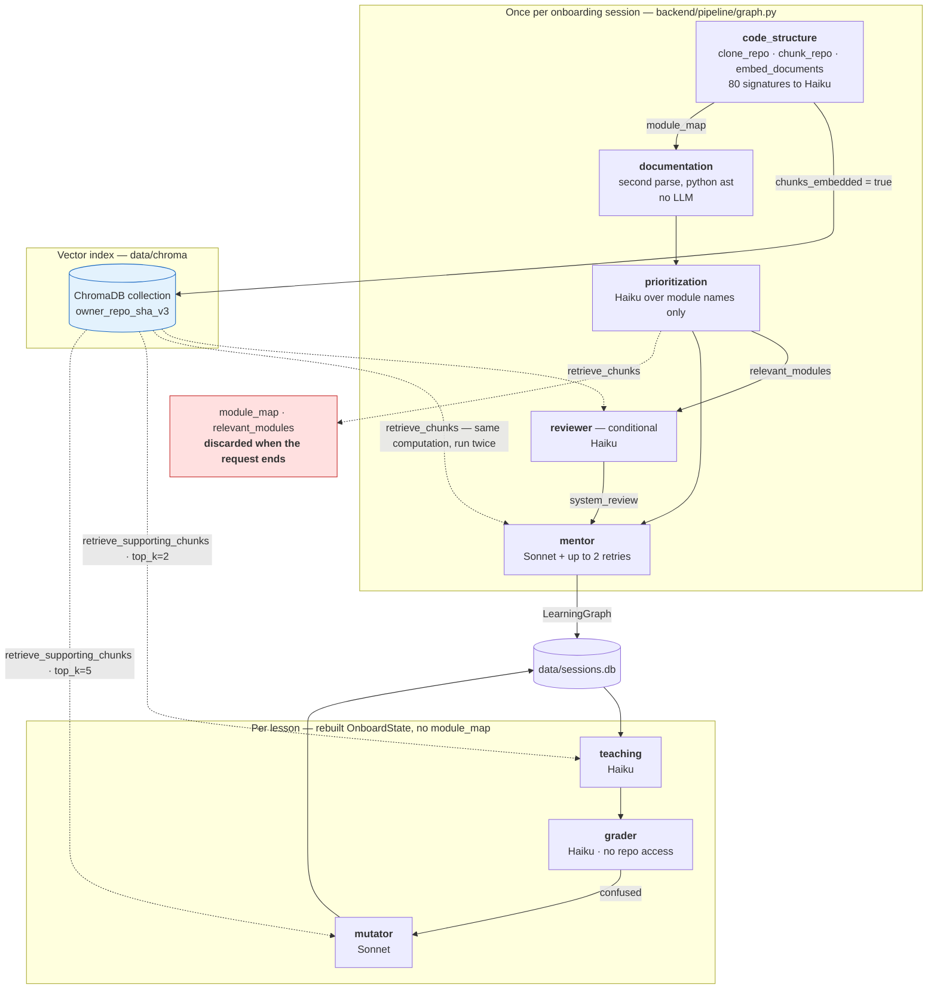
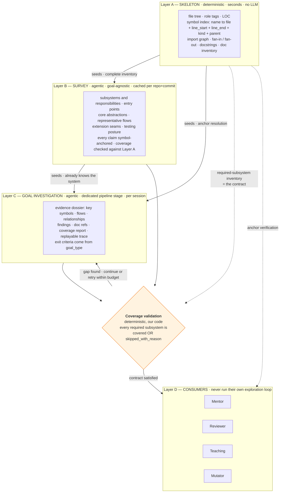
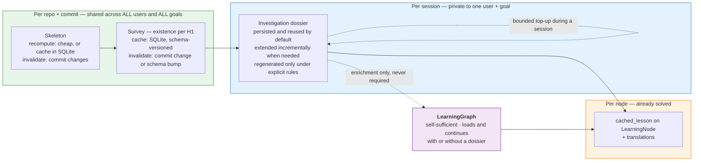
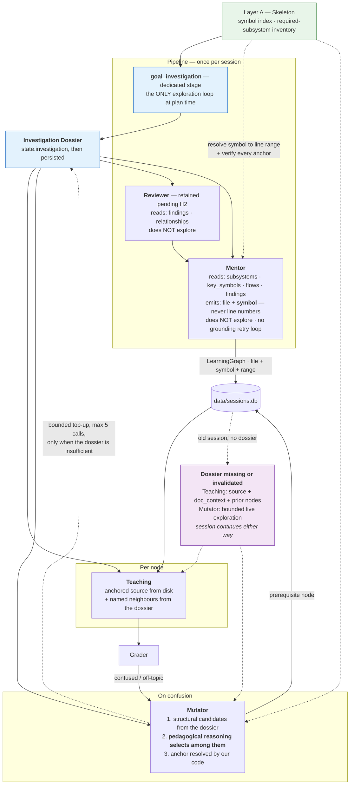
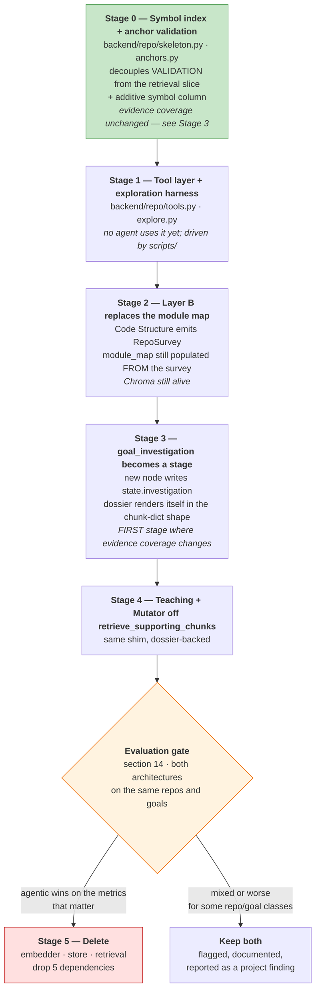

# Repository Understanding — Migration from Vector RAG to Claude-Native Exploration

> **Status: COMPLETE.** All six stages shipped; `backend/rag/` no longer exists.
> The Claude-driven architecture is the production baseline.
> **Closed:** 2026-08-14. See [§21](#21-final-conclusion) for what the evidence
> does and does not support — the migration is validated as a **functional
> replacement with measured advantages in specific dimensions**, not as an
> across-the-board improvement.
>
> | Stage | State |
> |---|---|
> | 0 — Symbol index + anchor validation | ✅ **done** — see [§12](#stage-0--symbol-index--anchor-validation-ships-alone) |
> | 1 — Tool layer + exploration harness | ✅ **done** — see [§12](#stage-1--tool-layer--exploration-harness) |
> | 2 — Layer B replaces the module map | ✅ **done** — Layer B = breadth, Layer C = depth; structural policy, duplicate-call short-circuit and budget notice are the defaults. See [§12](#stage-2--layer-b-replaces-the-module-map), [H1](#h1--how-large-should-layer-b-be) |
> | 3 — `goal_investigation` stage | ✅ **done** — a real LangGraph node writing `state.investigation`; the Mentor plans natively over the Dossier; the Survey is persisted and reused |
> | 4 — Teaching + Mutator off supporting chunks | ✅ **done** — dossier persisted per session+commit; both consumers read its structure |
> | 4a — Reliability gate | ✅ **done** — 12/12 architecture-run attempts held every invariant with zero retrieval |
> | 4b — Public-API discovery + Skeleton-backed Mutator | ✅ **done** — the two Stage-5 preconditions |
> | 5 — Delete | ✅ **done** — retrieval, embeddings, the vector store, the second pipeline shape and its flag are gone |

This document is the source of truth for how CodeOnboard learns an unfamiliar
repository, and for the migration away from the hand-built vector-RAG layer in
`backend/rag/`.

It cuts across Phases 1–3 rather than extending them: it replaces the
repository-understanding substrate that Phase 1 built ([`phase1.md`](phase1.md)),
that Phase 2 tuned, and that Phase 3 ([`phase3.md`](phase3.md)) now depends on at
session time. The learning graph, grading, translation and UI are **not** in scope
and are expected to survive untouched.

The **persistence model stays conceptually the same** — SQLite, schema-versioned,
additive `ALTER TABLE` — but it is not literally untouched: symbol-based anchors
require one additive column on the nodes table ([D14](#15-accepted--high-confidence-decisions)),
and the dossier introduces new tables that existing sessions never need
([D12](#15-accepted--high-confidence-decisions)).

**Done when:**
- The Mentor, Teaching and Mutator agents obtain code context from a shared,
  persisted repository understanding rather than from independent vector queries.
- Every file path, symbol and line range shown to the user is verified against
  the actual repository, not against a retrieval result.
- Both architectures can be run against the same repo + goal and compared on the
  metrics in [§14](#14-evaluation-plan).
- The old infrastructure is deleted **only after** that comparison, and only for
  the parts the comparison justifies deleting.

**Reading guide.** [§1–4](#1-why-we-are-changing-this) are the investigation
(what exists, what's wrong). [§5–11](#5-proposed-target-architecture) are the
proposal. [§12–14](#12-migration-stages) are the plan. **[§15–17](#15-accepted--high-confidence-decisions)
are the most important sections in this document** — they separate what is
settled from what is still a hypothesis. Do not treat anything in §5–11 as
settled unless it is restated in §15.

---

## 0. Priority order — read this before optimising anything

**Optimise waste, not capability.** Cost is a *measurement*, not a design
constraint. In descending order of priority ([D16](#15-accepted--high-confidence-decisions)):

1. **Repository-understanding quality and correctness**
2. **Grounding and coverage**
3. **Usefulness for downstream learning**
4. **Avoiding unnecessary work**
5. **Cost and latency**, optimised only where doing so does not materially harm 1–4

> ### ⚠️ The `$0.10/run` figure is not a hard architectural constraint
>
> It originated as a Phase-1 affordability *estimate* and is retained only as a
> reporting reference. **Nothing in this migration may be justified by it.** If a
> high-quality survey of a large repository costs more, the correct action is to
> report the real cost and then investigate whether the same quality is reachable
> more efficiently — never to cut the work until the number looks acceptable.

**Legitimate optimisation** — all of this is waste and should be removed:
duplicate tool calls · re-reading source already in context · reads far larger
than the question needs · redundant exploration of the same area · cache writes
that are never read · time spent on vendored or generated content · rediscovering
something an earlier layer already established.

**Not legitimate optimisation** — none of this may be done to save money:
stopping before an important subsystem is understood · skipping evidence a claim
depends on · reducing reasoning depth where it materially harms understanding ·
choosing a weaker model when evaluation shows a real quality loss.

**This has already bitten once.** The first Stage-2 pass used a 12-turn budget
chosen to defend the `$0.10` figure. Coverage closed on the first submission every
time, but the *anchor* contract did not: the rejection arrived at the last turn
with no budget left to repair it, so **15 of 16 runs returned a salvaged survey
instead of an accepted one**. That is the failure mode this section exists to
prevent — the cost target did not make the system cheaper, it made the artifact
worse. See [§12 Stage 2](#stage-2--layer-b-replaces-the-module-map).

---

## 1. Why we are changing this

The system currently decides, in advance and without looking at the code, what
the model is allowed to know about the repository. It chunks every Python file,
embeds all of it, and computes a fixed slice of ~16–28 chunks. That slice is then
handed to the Mentor as the whole world.

Three problems follow, in increasing order of severity:

1. **The retrieved slice does three unrelated jobs at once** ([§3.1](#p1--the-retrieved-chunk-set-serves-three-roles-at-once)).
   It is simultaneously the evidence the model reads, the whitelist of anchors it
   may cite, and the outer bound of the curriculum. Improving one degrades another.
2. **The system cannot look again.** If the slice is wrong, the model has no way
   to ask for anything else. It can only produce a worse graph and self-report
   `confidence: "low"`.
3. **Repository understanding is thrown away** at the end of every request, while
   the *user's* understanding persists. Teaching and the Mutator run at session
   time with no module map and no architectural context at all ([§2.2](#22-what-is-persisted-versus-recomputed)).

The third is the one that matters most for this project specifically. CodeOnboard's
stated X-factor is a **persistent, repo-anchored model of understanding**
([`proposal.md`](../vision/proposal.md)). Today the system persists the user's
understanding and discards its own. Closing that asymmetry is the real motivation
for this migration; removing ChromaDB is a consequence, not the goal.

---

## 2. How the current architecture works

### 2.1 Flow



### 2.2 What is persisted versus recomputed

| Artifact | Lifetime | Location |
|---|---|---|
| Cloned repo | Forever, per repo **name**; never updated | `data/repos/` — `clone_repo` returns early if the dir exists |
| Chroma collection | Per `{owner}_{repo}_{sha[:12]}_v3` | `data/chroma/` |
| `module_map` | **Request-scoped — never persisted** | dies with `OnboardState` |
| `relevant_modules` | **Request-scoped — never persisted** | dies with `OnboardState` |
| `doc_context` | Persisted — deliberately copied onto `LearningGraph` | `sessions.doc_context_json` |
| Graph, nodes, anchors, lessons, attempts, translations | Persisted | `data/sessions.db` |

**Consequence:** at lesson time and mutation time there is no module map and no
prioritized scope. The Teaching Agent and the Mutator run with only the node's
brief, its source lines, `doc_context`, and 2–5 chunks matched by similarity
against the node's own title. The Mutator selects a remediation for a confused
developer from 5 chunks retrieved with the literal query string
`"foundational concepts needed before understanding {title}"`.

### 2.3 Measured behaviour

Measured 2026-08-13 against the clones in `data/repos/`:

```
requests   1,011 chunks / 710 embeddable / 35 files
           roles: source 523, test 482, doc 6
           module map built from 80 chunks over 13 files = 68% of source files

fastapi    8,376 chunks / 4,942 embeddable / 932 files
           roles: test 5,664, doc 1,569, source 777, tooling 366
           module map built from 80 chunks over 15 files = 33% of source files
```

`backend/agents/code_structure/agent.py` caps the module-map prompt at
`MAX_CHUNKS = 80`, sliced in `Path.rglob` walk order — effectively alphabetical.
For fastapi these source files **never reach the module map**:

```
fastapi/dependencies/utils.py        <- the dependency-injection resolver
fastapi/openapi/{docs,models,utils}.py
fastapi/security/{api_key,base,http,oauth2,open_id_connect_url,utils}.py
fastapi/_compat/{shared,v2}.py
fastapi/middleware/asyncexitstack.py
```

A user whose goal is *"understand FastAPI's authentication"* therefore gets a
module map containing **zero** security entries. Prioritization prunes a map that
never contained the answer, and the `per_module` retrieval strategy builds its
queries *from module-map purposes* — so no component of the pipeline ever issues
a query about authentication. The chunks are in ChromaDB; nothing asks for them.

This is not a tuning problem. An alphabetical prefix of a repository is not an
architecture.

---

## 3. Problems discovered during the investigation

### P1 — The retrieved chunk set serves three roles at once

| Role | Where |
|---|---|
| **Evidence** — what the model reads | `_format_chunks()`, `backend/agents/mentor/agent.py` |
| **Anchor whitelist** — what it may cite | `_ground_anchors()`, same file |
| **Curriculum scope** — what may ever be taught | implicit: no chunk, no node |

Grounding is currently defined as *"the anchor appears in the retrieval result"*,
not *"the anchor exists in the repository"*. Retrieval recall is therefore a hard
ceiling on curriculum quality, and grounding safety is in direct opposition to
coverage: a tighter `top_k` gives safer anchors and a worse learning path.

### P2 — The module map is an arbitrary alphabetical prefix

See [§2.3](#23-measured-behaviour). It feeds Prioritization, `per_module` query
generation, and the Mentor's sense of the system's shape. All three inherit the
truncation.

### P3 — Nothing follows a relationship

Imports are chunked (`type: "import"`) then explicitly excluded from embedding and
from the module-map prompt — the one structural signal already extracted is
discarded. There is no call graph, no inheritance graph, no usage lookup. The
Mentor's system prompt has to say *"Only describe inheritance, imports, or call
relationships that are visible in the retrieved chunks"*, which is an explicit
admission that the system cannot see relationships. A `flow` node is nonetheless
asked to trace execution across files.

### P4 — Similarity is not pedagogical importance

`Session.send` matters because everything routes through it, not because it embeds
near the goal string. Nothing measures centrality, fan-in, or public-API membership.

### P5 — Python-only, structurally

`chunk_repo` is `rglob("*.py")`; the Documentation Agent uses Python's `ast`. One
repo already in `data/repos/` (`everything-claude-code`) contains 0 Python files —
the system indexes nothing and can say nothing about it.

### P6 — The Mutator has the thinnest evidence in the system, at the moment it matters most

A confused user's remediation is chosen from 5 similarity chunks, with no module
map, no graph-wide view, and no structural notion of "more foundational".

### P7 — Retrieval runs twice, identically

When the Reviewer is active it calls `retrieve_chunks(state)`, then the Mentor
calls it again with the same state, profile and queries. For `per_module` on a
40-module map that is roughly 80 redundant local embedding passes.

### P8 — Indexing cost is paid on the whole repo regardless of goal

fastapi: 4,942 chunks embedded on CPU at `BATCH_SIZE = 4`. About 87% of what is
embedded is tests and docs, which `understand_system` then filters out at query
time anyway.

### P9 — Fixed granularity

A chunk is a function or a class. Not addressable as an anchor: a module-level
constant table, a decorator stack, a config block, a three-line invariant inside a
long method, or a cross-file flow. `retrieve_supporting_chunks` is the
acknowledged workaround for this.

### P10 — No iteration, therefore no self-correction

The retrieval set is computed before the model reasons. There is no path from
"I don't understand this yet" to "let me look".

---

## 4. What the current RAG actually buys us

Separating durable product requirements from implementation machinery. **Anything
in the first table must survive the migration.**

### Real requirements

| # | Requirement | Currently served by |
|---|---|---|
| R1 | Every node, lesson and prerequisite cites a real file + line range | anchor grounding against the chunk set |
| R2 | The Mentor sees actual code, not just names | chunk `content` in the prompt |
| R3 | Whole-repo understanding at bounded prompt size | `top_k` + module map |
| R4 | Broad-vs-focused behaviour differs by goal type | `RetrievalProfile` |
| R5 | Large files must not crowd out the rest | `max_per_file` |
| R6 | Tests and examples are evidence for some goals, noise for others | `role` + `retrieval_roles` |
| R7 | Analysis is paid for once per repo, cheap thereafter | Chroma collection keyed by commit |
| R8 | Per-lesson cost stays low — Teaching runs N times per session | `cached_lesson` + `top_k=2` |
| R9 | Line ranges are narrow and teachable | `drop_redundant_class_chunks` |
| R10 | A retrieval failure must never crash a session | try/except at every call site |

### Machinery that exists only because we chose embeddings

| Concept | Why it exists | Survives? |
|---|---|---|
| AST chunks as *retrieval units* | vectors need fixed-size text | No |
| Embedding model, torch, einops | vector search | No |
| ChromaDB, collection naming, schema version | vector store lifecycle | No |
| `top_k`, `per_pool_k`, `per_module_top_k` | K must be chosen in advance | No |
| RRF fusion | fusing incomparable similarity scores across pools | No |
| Query decomposition | one embedding cannot encode multi-aspect intent | No |
| `search_document:` / `search_query:` prefixes | nomic's asymmetric training | No |
| `role` as a query-time **hard filter** | you cannot tell a vector to prefer source | Changes form |
| `max_per_file` | similarity has no notion of coverage | Changes form |
| `drop_redundant_class_chunks` | the chunker emits overlapping units | Changes form |
| `chunks_embedded` | index-readiness flag | Changes form |
| `retrieve_supporting_chunks` | single-range anchors need reach | Real need, wrong mechanism |

Roughly 70% of `backend/rag/` is vector-retrieval scaffolding with no counterpart
in an agentic design. The two genuinely valuable assets are the **tree-sitter
symbol extraction** (currently mis-cast as an embedding source) and the
**goal-type differentiation** (currently expressed as tuning constants).

---

## 5. Proposed target architecture

### 5.1 Organizing principle

> **The skeleton is computed. The meaning is explored.**

Breadth must not depend on a model's willingness to be thorough, and depth must
not depend on a similarity score.

- **Deterministic, no LLM:** file tree, symbol index, import graph, doc inventory,
  size and fan-in metrics. A complete, non-hallucinable inventory, computed in
  seconds by the tree-sitter code we already have.
- **Agentic, iterative:** what those things *mean*, which matter for this goal,
  how they connect, where the risks are, where teaching should start.

This is the answer to the focused-versus-global tension. The agent never has to
*discover* that `fastapi/security/` exists — it is handed the complete inventory
and must **account for** it. Coverage becomes an obligation checked by our code,
not an emergent property of top-K.

### 5.2 The four layers



| Layer | Responsibility | Explicitly NOT its job |
|---|---|---|
| **A. Skeleton** | Enumerate everything that exists, with exact line ranges. Be complete and cheap. **Defines the required-subsystem inventory that B and C are held to.** | Judging importance, summarising, interpreting |
| **B. Survey** | Explain the system's shape once, goal-agnostically, so every later session starts informed. Account for every required subsystem in A. | Deep-diving any one area; anything goal-specific |
| **C. Investigation** | Gather the goal-specific evidence a learning journey needs, to a declared standard. Record it. **Runs once per session as its own pipeline stage** ([D11](#15-accepted--high-confidence-decisions)). | Deciding the teaching order — that is the Mentor's job |
| **D. Consumers** | Plan, review, teach, remediate — from C, grounded on A. | **Running their own exploration loop.** Re-exploring what C already established |

**Layer B is the proposed cacheable repository-level understanding layer.** If
[H1](#h1--how-large-should-layer-b-be) validates it, it takes over the
*amortization role* currently served by the Chroma collection (R7): expensive once
per commit, free for every subsequent session, shared across all users and all
goals. It is **not** asserted to replace Chroma — H1 explicitly allows Layer B to
shrink substantially or disappear, in which case the amortization role falls to the
Skeleton alone and Layer C absorbs the rest.

> **Layer B's depth is a hypothesis, not a decision.** See [H1](#h1--how-large-should-layer-b-be).
> The working assumption is a *lightweight* global survey, not a deep whole-repo
> understanding. Replacing "embedding lots of irrelevant code" with "Claude
> reading lots of irrelevant code" would be a failure, not a migration.

**Layer B and Layer C answer different questions**, and this is what keeps the
cache valid:

| | Question | Goal-dependent? |
|---|---|---|
| **Layer B — Survey** | *What exists, and what does it do?* | **No.** A repository-level account, reusable by every user and every goal |
| **Layer C — Investigation** | *What matters for **this** user's goal?* | **Yes** |

A cached Survey's validity must never depend on a particular user's goal. Layer C
may mark an area `skipped_with_reason` **because of the goal** — *"OpenAPI
generation is not on the path to this auth debugging goal"*. Layer B may not: its
skips can only be repository-level facts — *"vendored third-party code"*,
*"generated file"*.

### 5.3 The Dossier

The keystone artifact. Today there is nowhere to put accumulated understanding —
`OnboardState` carries `module_map` and `doc_context`, and neither survives the
pipeline. The dossier is a persisted, structured, fully-anchored record of what
exploration established.

```python
@dataclass
class Investigation:                  # persisted alongside the LearningGraph
    subsystems:    list[Subsystem]    # name, responsibility, files, anchor
    key_symbols:   list[Evidence]     # symbol, anchor, role in the system, why it matters
    flows:         list[Flow]         # ordered list of anchored steps across files
    relationships: list[Relation]     # (from_symbol, to_symbol, kind: calls|imports|extends|registers)
    findings:      list[Finding]      # risk | extension_point | test_gap | boundary + anchor
    doc_refs:      list[DocRef]       # README / docstring / docs excerpt + provenance
    coverage:      Coverage           # see 5.6 — a validated contract, not a note
    trace:         list[ToolCall]     # replayable exploration log
```

Every entry carries an anchor and the tool call that produced it. Grounding stops
being a Mentor-output check and becomes an invariant of the knowledge layer.

Field-level shapes are deliberately not fixed here — see [OQ4](#oq4--dossier-schema-versioning).

#### The dossier is enrichment, never a runtime dependency ([D12](#15-accepted--high-confidence-decisions))

The dossier and the `LearningGraph` have **different lifetimes**: a session persists
indefinitely, while a dossier is tied to a commit, a goal, and a schema version.
The graph therefore must never depend on it.

> The dossier may be essential for *creating* a high-quality learning graph, but an
> **existing graph must remain self-sufficient enough to continue the learning
> session without it.**

| Consumer | Dossier available | Dossier missing / invalidated / older schema |
|---|---|---|
| **Teaching** | Named neighbours + flows from the dossier | Anchored source from disk + `doc_context` + prior-node context, exactly as today; optionally ≤3 bounded tool calls |
| **Mutator** | Structural candidates from `relationships` / `key_symbols` | Bounded live exploration (≤5 calls) seeded by the skeleton |
| **Mentor / Reviewer** | Plan and review from the dossier | Not applicable — these run at *creation* time, when a dossier exists by construction |

This preserves the property the current system already has: a failure in
`retrieve_supporting_chunks` is explicitly non-fatal, and Teaching proceeds on the
anchored source alone. A missing dossier degrades quality; it never breaks a
session, and it never blocks loading an old graph.

### 5.4 Exploration control loop

Not a fixed recipe. A budgeted loop with declared exit criteria:

```
seed:      skeleton inventory + required-subsystem contract
           + (Layer C only) the Layer B survey + the goal
loop:      Claude issues tool calls, several in parallel per turn
budget:    max_turns · max_tokens_read · wall-clock ceiling
           — all enforced in our code, never merely requested in the prompt
propose:   Claude emits the structured dossier
validate:  our code checks — every anchor resolves (section 9)
                            — the coverage contract holds (section 5.6)
           gap found + budget remains -> report the gap back, continue the loop
           gap found + budget exhausted -> accept with an explicit coverage gap
exit when: exit criteria satisfied AND validation passes, OR budget exhausted
```

Budget exhaustion is **not** a failure. It yields a partial dossier with an honest,
*enumerated* `coverage` gap, which propagates to `confidence: "medium"`. What is
not permitted is a subsystem disappearing silently — see [§5.6](#56-the-coverage-contract).

### 5.5 Goal-awareness as exit criteria

`profiles.py` does not die — it changes form, from tuning constants to
**what must be true before exploration may stop**:

```python
# TODAY                               # PROPOSED
top_k = 18                            must_establish = [
per_pool_k = 18                          "every subsystem has a stated responsibility",
max_per_file = 3                         "at least one end-to-end flow across >= 3 files",
decompose_query = True                   "at least 2 extension seams, anchored",
retrieval_roles = {source, test}         "test posture for each area to be changed",
                                      ]
                                      may_read_roles = {source, test, example}
                                      turn_budget = 22
```

`understand_system` gets a **breadth obligation** — account for every required
subsystem in the skeleton. `debug_issue` gets a **depth obligation** — trace the
failing path to a specific symbol. Same goal-awareness, expressed as objectives
rather than as K.

Exit criteria are *stated* to the model. The coverage part of them is
**additionally enforced by our code** — see next.

### 5.6 The coverage contract

The most valuable property of the current `per_module` strategy is easy to
overlook: it *mechanically guarantees* that every module in the map contributes at
least one chunk. Coverage is enforced by code, not obtained by asking a model to be
thorough. **That principle must survive the migration** ([D13](#15-accepted--high-confidence-decisions)).

Telling Claude *"account for every subsystem"* is an instruction, and instructions
can be silently declined. Instead, Layer A defines a deterministic inventory and
the Survey / Investigation output must **account for each required subsystem
explicitly**:

```python
# Enforced by our code after the model proposes a dossier — not by the prompt.
for subsystem in skeleton.required_subsystems:
    assert (subsystem in dossier.coverage.covered
            or subsystem in dossier.coverage.skipped_with_reason)
```

```python
@dataclass
class Coverage:
    covered:             dict[str, list[Anchor]]  # subsystem -> evidence gathered
    skipped_with_reason: dict[str, str]           # subsystem -> why it was skipped
    # Derived, not model-supplied:
    unaccounted:         list[str]                # MUST be empty for validation to pass
    budget_exhausted:    bool                     # true => an honest gap is permitted
```

**Silent disappearance fails validation.** A deliberate, reasoned skip passes —
*"`fastapi/cli.py`: developer tooling, not on the path to the user's auth goal"* is
a perfectly good answer, and a far more useful one than a subsystem quietly never
being mentioned. On failure, the gap is reported back into the loop and exploration
continues or retries within budget ([§5.4](#54-exploration-control-loop)).

**What "required" means is itself a decision, not a given.** Deriving
`required_subsystems` from the skeleton — by directory, by package, by import-graph
component, with or without a fan-in threshold — determines how strict the contract
is. See [OQ7](#oq7--how-is-required_subsystems-derived-from-the-skeleton).

This is the mechanism that makes *deterministic breadth + agentic depth* real
rather than aspirational.

### 5.7 Where this runs in the pipeline

Goal Investigation is **a dedicated stage, not something a consumer does on its own**
([D11](#15-accepted--high-confidence-decisions)). Today `retrieve_chunks(state)` is
called *inside* the Mentor node and again *inside* the Reviewer node, which is
exactly why P7 exists. Making exploration a shared, multi-turn loop while leaving it
inside consumers would multiply that bug and violate [D5](#15-accepted--high-confidence-decisions).

```text
code_structure / skeleton
    → repo_survey / repository context      (goal-agnostic; existence per H1)
    → goal_investigation                    → state.investigation
    → reviewer (when applicable)            reads state.investigation
    → mentor                                reads state.investigation
```

- New LangGraph node `goal_investigation` in `backend/pipeline/graph.py`.
- New field `state.investigation: Investigation | None` on `OnboardState`.
- **Reviewer and Mentor must not run their own exploration loops.** They read
  `state.investigation`; they never call the explorer.
- P7 (identical retrieval computed twice) is fixed *structurally* as a side effect,
  rather than by memoising a call.

At session time the pipeline is not re-run, so Teaching and the Mutator read the
persisted dossier instead of `state.investigation` — with the fallback contract in
[§5.3](#the-dossier-is-enrichment-never-a-runtime-dependency-d12) when it is absent.

---

## 6. Knowledge lifetimes, persistence and caching



| Layer | Cache key | Shared across | Reuse / invalidation |
|---|---|---|---|
| Skeleton | `(repo, commit)` | all users, all goals | recomputed when the commit changes; cheap enough to rebuild on demand |
| Survey | `(repo, commit, schema_version)` | **all users, all goals** | commit change / schema bump. Existence and size per [H1](#h1--how-large-should-layer-b-be) |
| Investigation | `(session_id)` | all agents in that session | **persisted and reused by default; extended incrementally when needed; invalidated or regenerated only under explicit repository / schema / version rules** |
| Node lesson | `(node_id)` | — | `cached_lesson`; regenerated only on explicit refresh |

**On "reused by default".** Append-only extension is the normal path, but it is not
an absolute guarantee. Known cases that may legitimately force regeneration:
a schema bump ([OQ4](#oq4--dossier-schema-versioning)), a commit change invalidating
anchors, and a dossier accepted with `budget_exhausted` and low coverage that a
later run could improve on. In every one of those cases the session must survive
regardless — [D12](#15-accepted--high-confidence-decisions).

### Why not the alternatives

| Option | Verdict |
|---|---|
| **Independent exploration per agent** | Rejected. 4–5 agents × ~20 turns rediscovering the same facts, with *divergent* mental models. The Mentor would plan against one understanding and Teaching would teach against another. Incoherence is worse than the cost. |
| **One large upfront exploration only** | Partly. Correct for breadth, wrong as the only pass: a goal-agnostic sweep cannot chase a specific error message, and a goal-specific sweep cannot be shared across sessions. Hence the B/C split. |
| **Shared structured understanding** | Adopted — this is the dossier. |
| **Cached exploration results** | Adopted — Layer B is the analogue of "index once per commit", preserving R7. |
| **Incremental exploration** | Adopted, bounded and opt-in. See below. |
| **Hybrid** | This proposal *is* the hybrid. |

**Bounded incremental top-up.** Layer C may append to the dossier during a session
in exactly two places: a `flow`-tagged node during Teaching (≤3 tool calls), and
Mutator remediation when the dossier alone is insufficient (≤5 tool calls). Both
write back. The system therefore learns more about the repository the longer a
user studies it — a property that fits the persistent-understanding pitch.

### Persistence mechanics

The dossier follows the discipline already established in
`backend/learning/store.py`: SQLite, explicit `schema_version`, a version mismatch
treated as missing rather than migrated, additive `ALTER TABLE` for backwards-
compatible fields. New tables (`repo_survey`, `investigation`) live in the same
`data/sessions.db`. No new dependency.

**Why "mismatch = treated as missing" is safe here.** That rule is borrowed from
`load_graph`, where it is a hard invalidation. For the dossier it is a *soft* one,
precisely because of [D12](#15-accepted--high-confidence-decisions): a dossier that
fails its version check is simply absent, and every runtime consumer already has a
defined behaviour for absent. The `sessions` / `nodes` / `edges` tables keep their
own `SCHEMA_VERSION` and are never invalidated by a dossier schema bump.

**One additive change to the existing node schema** ([D14](#15-accepted--high-confidence-decisions)).
`CodeAnchor` gains `symbol`, and the `nodes` table gains a nullable `symbol` column
via the same `ALTER TABLE` pattern already used for `attempts_json` and
`translations_json`. The persistence *model* is unchanged; the anchor schema is
extended:

| Field | Meaning | Stability |
|---|---|---|
| `file` + `symbol` | **Semantic identity** — what this node is about | Stable across commits |
| `line_start` / `line_end` | **Resolved location** for the current commit | Derived; re-resolvable |

Existing sessions load with `symbol = NULL` and behave exactly as today. This is
also what makes future repository updating tractable: ranges can be re-resolved from
the symbol rather than silently pointing at the wrong lines.

---

## 7. How the Dossier feeds Mentor / Teaching / Mutator



**The Mutator's three-step contract is deliberate and is an accepted decision**
([D8](#15-accepted--high-confidence-decisions)). Structural dependency is *not*
pedagogical prerequisite: if A calls B, it does not follow that the user must
understand B before A. Structure supplies **candidates**; a reasoning step
**selects**. What that reasoning step costs — Sonnet, Haiku, or sometimes nothing
— is [H3](#h3--what-does-mutator-prerequisite-selection-actually-cost).

**One exploration loop, one writer** ([D11](#15-accepted--high-confidence-decisions)).
`goal_investigation` is the only stage that explores at plan time. Reviewer and
Mentor are pure readers of `state.investigation`. The only other exploration in the
system is the bounded session-time top-up (Teaching ≤3 calls on `flow` nodes,
Mutator ≤5 calls), which appends to the dossier rather than building a private one.

**Every consumer has a defined no-dossier path** ([D12](#15-accepted--high-confidence-decisions)),
shown by the dashed branch above. An old session, a schema bump, or a commit change
degrades lesson richness — never session availability.

---

## 8. Repository tools

Minimal by design. Every tool must earn its place by enabling something the
others cannot do cheaply.

### Exploration primitives

| Tool | Signature | Why it exists |
|---|---|---|
| `list_files` | `(glob="**/*.py", limit=200) -> [{path, role, loc, symbol_count}]` | Layer A metadata comes free: the agent sees "test file, 1200 LOC" without reading it |
| `read_file` | `(path, start=None, end=None) -> line-numbered text` | **Line numbers in the output are non-negotiable** — they are how the agent reasons about anchors without typing one. Hard cap ~400 lines; larger reads return an outline plus a hint |
| `search_code` | `(pattern, glob=None, max_results=50) -> [{path, line, text}]` | ripgrep. Subsumes usage search, import following, error-string lookup. One regex tool replaces four bespoke ones |
| `symbols` | `(path=None, name=None, kind=None) -> [{name, qualified_name, kind, file, line_start, line_end, parent, docstring, fan_in}]` | The keystone. Outlines a file without reading it; jumps to a definition exactly; exposes `fan_in`, which is structural importance — something similarity cannot express |

### Structural tool

| Tool | Signature | Why it exists |
|---|---|---|
| `neighbors` | `(symbol, direction="both", kinds=[...]) -> [{symbol, anchor, relation}]` | Walks the import/call graph. This is what makes `flow` nodes real instead of inferred. Derivable from `search_code`, but only unreliably and at ~10× the tokens |

### Output contract — not an exploration tool

| Tool | Signature | Why it exists |
|---|---|---|
| `propose_anchor` | `(file, symbol=None, line_start=None, line_end=None) -> {ok, file, line_start, line_end, symbol, reason_if_rejected}` | See [§9](#9-grounding-strategy). The model names a symbol; our code computes the range |

**Six tools.** Explicitly rejected: `semantic_search` ([H4](#h4--is-semantic-search-worth-keeping-as-a-tool)),
`find_references` (equals `search_code`), `get_file_tree` (equals `list_files`),
`read_docs` (equals `read_file` + `role`), `git_log` / `git_blame` (real value,
but history is a later idea, not v1).

---

## 9. Grounding strategy

The guarantee gets **stronger**, not weaker. Three mechanisms, in order of importance.

### G1 — The model never types a line number

Today the Mentor must copy `line_start` / `line_end` verbatim from chunk metadata,
and two retry loops exist because it does not reliably do so. Instead:

```json
{ "title": "How Session.send dispatches to an adapter",
  "file": "src/requests/sessions.py",
  "symbol": "Session.send" }
```

Our code resolves `symbol` → `(662, 748)` via the Layer A index. **A hallucinated
line range becomes structurally impossible** — there is no field in which to
hallucinate one. An unresolvable symbol is a deterministic rejection with an exact
error the model can act on, not a fuzzy whitelist miss.

### G2 — The oracle is the repository, not the retrieval slice

`_ground_anchors` (Mentor), `_ground_node` (Mutator) and `_drop_ungrounded_anchors`
(Reviewer) collapse into one `backend/repo/anchors.py::resolve()`, validating
against the symbol index — that is, against *every symbol in the repository*.
Grounding stops constraining curriculum scope (P1). The Mentor may teach anything
real; it simply may not teach anything unreal.

### G3 — Raw line ranges are allowed, and verified by reading

Some real anchors are not symbols — a module-level constant table, an import
block, a decorator stack. Those are permitted and validated by reading the range:

- the file exists and `1 <= start <= end <= len(lines)`
- the range is non-empty and not pure whitespace
- the range is ≤ 400 lines — a teachable unit. This is `drop_redundant_class_chunks`'s
  real intent (R9), expressed directly
- if the range falls inside exactly one symbol's span, record that symbol for provenance

### Two properties the current system lacks

**Commit-durable anchors** ([D14](#15-accepted--high-confidence-decisions)).
`symbol` is persisted alongside `(line_start, line_end)` — the first is stable
semantic identity, the second a commit-derived location — so a re-clone at a newer
commit can re-resolve the symbol and repair the range. Today a persisted session
silently points at the wrong lines if the repository moves. `clone_repo` never
updates an existing clone, so this is latent rather than active — but it is cheap
insurance and the enabling step for repository updating later.

**Universal provenance.** Every `Finding`, `Evidence`, `Flow` step and `DocRef`
carries an anchor plus the tool call that produced it.

### 9.1 Repository/Skeleton availability contract ([D15](#15-accepted--high-confidence-decisions))

Grounding reads the checkout, so "what happens when the repository is not there"
becomes a real question. The answer differs by lifecycle stage, and the governing
principle is:

> **Persisted state is permission to *continue*, never permission to *fabricate*.**

#### During onboarding / learning-path creation — HARD REQUIREMENT

```text
repository unavailable
        ↓
cannot build / verify Skeleton
        ↓
onboarding fails explicitly
```

No best-effort ungrounded graph generation. A `LearningGraph` whose anchors were
never verified is worse than no graph: every downstream lesson inherits the
unverified claim, and the user cannot tell.

| Agent | On skeleton failure |
|---|---|
| **Mentor** | Append to `state.errors`, return without a graph. `/session/start` surfaces `500 no_graph` |
| **Reviewer** | Same — append and return with `system_review` unset. **No ad-hoc anchor-dropping fallback**: a partial review is not a reason to soften a hard requirement, and the Mentor will fail on the same unavailable repository anyway |

#### During an existing learning session — BOUNDED

An already-created graph stays as self-sufficient as reasonably possible
([D12](#15-accepted--high-confidence-decisions)) — but only for operations backed
by evidence that is *already persisted*.

| Operation | Needs the repository? |
|---|---|
| Read the graph, navigate, re-read a cached lesson, grade against a persisted `expected_answer`, override a node | **No** — fully persisted |
| **Discover, verify, or create new repository-grounded knowledge** | **Yes** |

So a Mutator that wants to insert a prerequisite while the skeleton is unavailable
**must not insert an unverified one**. The existing fail-safe — skip the insert,
record the reason, leave the graph untouched — is the correct behaviour and stays.

**Teaching is deliberately unchanged at this stage.** It currently reads anchored
source from disk, so it already requires the checkout. What persisted material
would be *sufficient* to render a lesson without repository access is a real
question, but it is answered when Teaching's evidence source changes at Stage 4 —
not guessed at now.

---

## 10. Agent-by-agent impact

| Agent | Today | Proposed | Change |
|---|---|---|---|
| **Goal** | Static questions + 1 Haiku synthesis | Unchanged. Additionally: start **Layer A** in the background the moment the repo URL is submitted, in parallel with the interview — and Layer B too, if H1 keeps it ([D10](#15-accepted--high-confidence-decisions)) | Latency hiding only |
| **`goal_investigation`** *(new stage)* | Did not exist — exploration was implicit inside Mentor and Reviewer | **Dedicated LangGraph node** running the only plan-time exploration loop; writes `state.investigation` ([D11](#15-accepted--high-confidence-decisions)). Fixes P7 structurally | New |
| **Code Structure** | clone → chunk → embed → 80 signatures → Haiku → `module_map` | Split. Deterministic half becomes Layer A (no LLM). LLM half becomes Layer B. `module_map` becomes the survey's `subsystems` — complete, anchored, and **persisted** | Rewritten |
| **Documentation** | Second `ast` pass, no LLM | Folded into Layer A — one parse yields symbols *and* docstrings. `doc_context` keeps its shape and its persistence | Merged |
| **Prioritization** | Haiku over module names + a 0.7 keep-ratio floor to undo over-pruning | Absorbed into Layer C's framing. Scoping becomes a decision made **while looking at code**, not a blind name-prune before any code is read. The `preserve_breadth` floor was a symptom of pruning without evidence | Likely absorbed — pending H5 |
| **Reviewer** | Conditional Haiku over `retrieve_chunks` | **Retained.** Reads `state.investigation`; **does not explore** ([D11](#15-accepted--high-confidence-decisions)). Its findings overlap Layer C's, but overlap is not proof of redundancy | **Kept pending [H2](#h2--does-a-dedicated-reviewer-pass-add-quality-over-the-investigation-alone)** |
| **Mentor** | Sonnet over `module_map` + top-K chunks; 2 retry loops | Plans from `state.investigation`; **does not explore**. Emits `(file, symbol)`; our code resolves ranges. **The grounding retry loop disappears.** Prompt gets *smaller* — curated evidence beats a raw chunk dump | Simplified |
| **Teaching** | Per node: source + 2 similarity chunks + Haiku | Per node: source + **named neighbours from the dossier** + Haiku. No embedding, no vector query. Optional bounded exploration (≤3 calls) only for `flow`-tagged nodes. **Defined behaviour when no dossier exists** ([D12](#15-accepted--high-confidence-decisions)). Cache unchanged | Cheaper and better grounded |
| **Grader** | Haiku, no repo access | Unchanged | None |
| **Mutator** | Sonnet over 5 similarity chunks | Structural candidates from the dossier → **pedagogical selection** → anchor resolved by our code. Falls back to bounded live exploration when no dossier exists. See [§7](#7-how-the-dossier-feeds-mentor--teaching--mutator) | Rewritten; cost per H3 |
| **Learning store** | `LearningGraph` persistence | **Conceptually unchanged**, with one additive anchor-schema extension: a nullable `symbol` column on `nodes`, plus new dossier tables old sessions never need ([D14](#15-accepted--high-confidence-decisions)) | Additive only |
| **Translator, Goal questions, i18n, entire frontend** | — | Untouched — no dependency on retrieval | None |

**Frontend: zero changes.** `MapView`, `RouteRail`, `LessonPanel` and `CodeViewer`
consume `graph.to_dict()`, and `CodeViewer` highlights `[line_start, line_end]` via
`GET /session/{id}/file`. Anchors keep their wire shape.

---

## 11. Cost and latency

### Per session, first-ever run on a repository

| Stage | Today | Proposed |
|---|---|---|
| Clone | ~5–20 s | Same |
| Skeleton parse | ~2–5 s | ~2–5 s — same tree-sitter work |
| **Index / Survey** | Embed 4,942 chunks on CPU at batch 4 → **minutes**, plus model cold-load | Agentic survey, size per H1, with prompt caching. Both amortised per commit |
| Doc pass | ~1–3 s | Folded into the skeleton — one parse instead of two |
| Prioritization | 1 Haiku | Absorbed (pending H5) |
| Investigation | 2× `retrieve_chunks`; ~80 local embeds for `per_module` | ~10–20 turns |
| Reviewer | 1 Haiku + retrieval | 1 Haiku over the dossier (retained pending H2) |
| Mentor | 1 Sonnet + up to 2 retries | 1 Sonnet, smaller prompt, **0 grounding retries** |
| **Teaching, per node** | 1 Haiku + 1 embed + 1 Chroma query | **1 Haiku** — ~7× per session |
| **Mutator, per confusion** | 1 Sonnet + 1 embed | Per H3 |

**Token cost is expected to be roughly a wash, plausibly lower.** We lose the two
retry loops, the Prioritization call, and the embedding pass; we gain an
exploration loop. With prompt caching on the stable system prompt + skeleton +
survey, the loop's marginal per-turn cost is small — this is close to the canonical
prompt-caching workload. **Per-run cost must be measured, not assumed**
([§14](#14-evaluation-plan)) — and measured as a *number to report*, not a
threshold to design against ([§0](#0-priority-order--read-this-before-optimising-anything)).

### Wall-clock is the real risk

Exploration is **serial** — each tool result gates the next decision. 25 turns at
3–5 s is 75–125 s, versus one retrieval call. Four mitigations, by impact:

1. **Start Layer A+B when the repo URL is submitted**, before the goal interview
   begins. The survey is goal-agnostic, so it has no dependency on the interview,
   and the interview takes the user 60–120 s. This hides the entire survey latency
   behind work the user is already doing. (Note: the current embedding pass could
   also be moved there today, and is not.)
2. **Layer B is cached per commit** — every run after the first pays zero.
3. **Parallel tool calls per turn** — Claude can emit several `read_file` /
   `search_code` calls in one turn; ~25 sequential calls collapse to ~8–12 turns.
4. **Hard budgets with graceful degradation** — see [§5.4](#54-exploration-control-loop).

### Dependency footprint

Removing `sentence-transformers`, `torch`, `einops`, `chromadb` and `onnxruntime`
drops roughly 2 GB of install and the Intel-Mac override block in `pyproject.toml`.
Cold-start model load disappears. For a project that must install and demo on
someone else's machine, this is a real benefit — but it is a **consequence** of
the migration, not a justification for it, and it must not be used to short-circuit
[§14](#14-evaluation-plan).

### New risk: cost variance

Retrieval costs the same every time. An agentic loop's cost depends on what it
chooses to read — a 900-line file is ~12k tokens. Mitigations: a hard token-read
budget enforced in code, `read_file` capping at ~400 lines and returning an outline
instead for larger files, and `symbols(path=...)` as the cheap default for
"what is in this file".

---

## 12. Migration stages



### Stage 0 — Symbol index + anchor validation *(ships alone)*

> ✅ **Done** — 2026-08-13. Headings below are kept stable so links do not rot.

**As built:**

| File | What |
|---|---|
| `backend/repo/skeleton.py` *(new)* | `Skeleton` — file inventory + symbol index with qualified names, derived by **reusing `chunker.py`'s tree-sitter walk** rather than adding a second parser. `build_skeleton(repo_path)` is `lru_cache`d. Also `subsystems()`, the OQ7 provisional inventory |
| `backend/repo/anchors.py` *(new)* | `resolve()` — repository-backed verification, symbol→range and verified raw ranges. `within_evidence()` / `resolve_within_evidence()` — the Stage-0 boundary, **deleted at Stage 3** |
| `backend/learning/graph.py` | `CodeAnchor.symbol`, nullable, defaulted |
| `backend/learning/store.py` | Additive `symbol` column + `_column_or_default` helper |
| `backend/agents/mentor/agent.py` | `_ground_anchors` now resolves then evidence-checks; `NodeWire.resolved_symbol` carries the symbol onto the anchor |
| `backend/agents/reviewer/agent.py` | `_drop_ungrounded_anchors` same two-step; skeleton failure drops anchors but keeps findings |
| `backend/agents/mentor/mutator.py` | `_ground_node` same two-step; returns a `ResolvedAnchor` so the prerequisite records its symbol |

**Deviations from the plan, both deliberate:**

1. **The ≤400-line teachability cap is implemented but OFF by default.**
   `MAX_ANCHOR_LINES` exists and is tested, but `resolve(max_lines=...)` is
   opt-in and no caller passes it. Switching it on at Stage 0 would *reject*
   oversized anchors that pass today — a behaviour change beyond "verify anchors
   are real", and a coverage *decrease*. Turned on at Stage 3 with the
   granularity rules.
2. **`Skeleton.subsystems()` (the OQ7 inventory) landed early**, ahead of Stage 2
   where the coverage contract binds. It is ~30 deterministic lines with no
   contract machinery attached, and shipping it now let the `fastapi/security/`
   regression criterion be validated while the rule is still cheap to change.

**Measured on the demo clones:** requests 35 files / 710 symbols / 19 subsystems;
fastapi 932 files / 4,942 symbols / 28 subsystems with `security` visible.

**Verification:** `tests/test_skeleton.py` (22), `tests/test_anchors.py` (18),
plus new cases in the mentor / mutator / reviewer / learning-store suites.
`scripts/smoke_stage0.py` demonstrates both halves of the boundary on
`psf/requests`. Full suite: 414 passed, 7 failed — all 7 pre-existing on the
clean tree and unrelated (stale `"not_yet"` state assertions, a `~200 words`
prompt string).

#### What Stage 0 does and does not achieve

Two things that are easy to conflate, and must not be:

| | Question it answers | Changed by Stage 0? |
|---|---|---|
| **Grounding / validation** | Does this file / symbol / range **really exist** in the repository? | **Yes** |
| **Evidence** | Has the model **actually inspected** enough code to reason about it? | **No** — not until Stage 3 |

Stage 0 decouples anchor validation from the retrieval slice. It does **not** let
the Mentor teach from anywhere in the repository, because the Mentor is still
constrained by the evidence it actually saw — and its system prompt still says
*"Use only files that appear in the retrieved chunks."*

**That prompt constraint must stay in place through Stage 0.** Relaxing validation
and the prompt together would let the Mentor cite a file it was never shown, with
no content to reason from — trading a false rejection for a confident, ungrounded
lesson. Validation and evidence are relaxed at *different* stages, on purpose.

**So the measurable win here is narrow and real:** eliminating **false rejections**
— correct anchors bounced because of path-prefix or formatting mismatches, which
today trigger `_retry_grounded_anchors` and, on persistent failure, land in
`state.errors`. Curriculum coverage (M1, M2) is expected to be **flat** at Stage 0;
if it moves, something unintended happened.

Metric to watch: **M5 grounding accuracy**, specifically the retry-fired count and
the ungrounded-anchors-after-retry count. Keep this stage regardless of what is
decided about the rest — it is a strict improvement and the prerequisite for every
later stage.

### Stage 1 — Tool layer + exploration harness

> ✅ **Done** — 2026-08-13. Headings below are kept stable so links do not rot.

`backend/repo/tools.py` (six primitives) and `backend/repo/explore.py` (the
budgeted loop). Exercised in isolation via `scripts/`, matching the existing smoke-
script pattern. No agent depends on it.

**As built:**

| File | What |
|---|---|
| `backend/repo/skeleton.py` | Extended with an **import graph**: `ImportEntry`, `imports_in()`, `resolve_import()`. Imports were already chunked and then discarded (P3); they are now parsed with `ast` and resolved to in-repo files, which is what makes `neighbors` real rather than name-guessed |
| `backend/repo/tools.py` *(new)* | The six primitives from [§8](#8-repository-tools) — `list_files`, `read_file`, `search_code`, `symbols`, `neighbors`, `propose_anchor` — plus `run_tool()` dispatch. Every result is `{"ok": …}`, every ceiling clamps, every filesystem access goes through `safe_repo_path()` |
| `backend/repo/explore.py` *(new)* | `explore()` — the budgeted loop; `Budget`, `Exploration`, `ToolCall`, `Usage`, `ReportSpec`; the model-facing tool schemas; `seed_blocks()` / `skeleton_brief()` for the cached Layer-A seed |
| `scripts/smoke_stage1.py` *(new)* | Drives both halves. Offline by default (all six tools against a real checkout, no API key); `--live` runs one real exploration and prints M5/M8/M9/H6 |

**Decisions taken while building, each with a reason:**

1. **Budgets are enforced in `explore.py`, never asked of the model** (RK2). Four
   independent ceilings — turns, tool calls, total tool-output chars, wall clock.
   Output volume is measured in **characters, not tokens**, because chars are
   exactly countable locally and tokens are not; the default ~240k chars is
   roughly 60k tokens of evidence.
2. **Budget exhaustion spends one extra API call on purpose.** On hitting a
   ceiling the loop makes a final "report what you have" turn with `tool_choice`
   forcing the report tool. [§5.4](#54-exploration-control-loop) requires
   exhaustion to yield a partial dossier rather than nothing, and by that point
   the run has already paid to read real code. The stop reason stays the *budget*
   that was hit — never overwritten by the salvage outcome — so the honest cause
   survives into `confidence`.
3. **Tool schemas live in `explore.py`, not `tools.py`.** A tool `description` is
   prompt text. Keeping it out of `tools.py` preserves that module's "Layer A is
   model-free" property and puts every tunable prompt string in one file.
4. **`repo_path` is absent from every schema.** The checkout is injected by the
   harness, so a tool cannot be aimed at another repository. Asserted by a test.
5. **Cost accounting ships now, not at Stage 2.** `Usage.cost_usd()` and
   `cache_hit_ratio` are what [H6](#h6--is-prompt-caching-enough-to-keep-the-exploration-loop-inside-budget)
   and M9 need, and instrumenting later would mean the first measurements have no
   baseline. **One measured constraint already matters: Haiku's minimum cacheable
   prefix is 4096 tokens** — below that a breakpoint is silently ignored, so H6
   depends on the seed being genuinely large. The smoke script warns when it isn't.
6. **Three cache breakpoints, not one.** One on the last seed block (which covers
   the tool definitions too, since tools render first), and two that follow the
   two newest tool-result turns. The API allows at most four per request, and a
   fixed early breakpoint falls outside the 20-block lookback window as the loop
   grows. A test asserts the cap is never exceeded.
7. **The seed is byte-stable; the task is not in it.** `instructions` are cached,
   `task` rides in the first user message. A goal string in the prefix would
   invalidate the cache on every call — the exact silent-invalidator H6 is about.
8. **`neighbors` returns a fair share across relations.** A prefix cut gave 12
   duplicate `imports` lines and zero `references` on `requests` — useless to a
   caller tracing a flow, which is the relation's whole purpose. Imports are also
   deduplicated per module (`from x import a` and `from x import b` are one
   dependency edge, not two).
9. **`references` is the one approximation and says so on every result.** It is a
   word-boundary text scan, flagged `"exact": false`, because Python cannot give a
   call graph without type inference. Honest approximation beats a confident
   fake call graph.

**Two defects in the Stage-0 surface, found by testing Stage 1 and fixed:**

- `read_file` rejected an abbreviated path (`sessions.py` for
  `src/requests/sessions.py`) while `symbols` and `propose_anchor` accepted one —
  the tool layer disagreeing with itself about the same input, and a reintroduction
  of exactly the false rejection Stage 0 removed. It now uses the same
  `canonical_file()` recovery, and still declines to guess when ambiguous.
- `search_code` matched inside binary files: a NUL byte is valid UTF-8, so the
  strict-decode guard did not catch them. A match inside one is garbage text the
  explorer pays tokens for.

**Verification:** `tests/test_tools.py` (58) and `tests/test_explore.py` (54),
both offline — the harness is tested against a scripted fake client, so a turn's
tool calls are exactly what the test says. Coverage worth naming: path traversal
is refused six ways; a tool crash, an unknown tool name, bad arguments and an API
failure all become results rather than exceptions (RK8); the cached prefix is
asserted byte-identical across turns; and a test asserts **no agent or pipeline
module imports `repo.explore`**, so "Stage 1 wires nothing in" cannot rot.

**Measured on the first live run** — `psf/requests`, Haiku, 8-turn budget,
`scripts/smoke_stage1.py --live`:

```
19 tool calls over 9 API calls, 24.0 s wall clock, 52,877 chars of tool output
tool mix   read_file 10 · symbols 4 · propose_anchor 5 · search_code 0 · neighbors 0
tokens     input 2,768 · output 2,546 · cache write 41,099 · cache read 82,721
caching    65% of prompt tokens served from cache
cost       $0.0751   (uncached equivalent ≈ $0.139 — caching roughly halved it)
M5         10/10 cited anchors re-resolve against the repository
```

Four things this establishes, and two it flags:

- **The request shape is accepted by the real API** — the cache-breakpoint
  placement, all six tool schemas, `is_error` results, and the forced-`tool_choice`
  salvage turn. None of that can be verified against a fake client.
- **The salvage path works in production, not just in tests.** The run hit the
  turn budget and the forced final turn still produced a complete, schema-valid
  survey with seven *reasoned* skips — the behaviour [§5.4](#54-exploration-control-loop)
  asks for, observed rather than assumed.
- **Grounding held at 100%** with the model naming symbols and our code resolving
  ranges (G1). Every anchor was re-verified independently after the run, not
  self-reported.
- **[H6](#h6--is-prompt-caching-enough-to-keep-the-exploration-loop-inside-budget)
  is directionally supported but not comfortable.** Caching halved the cost, yet
  one *lightweight* survey of the *small* demo repo consumed **75% of the entire
  `$0.10`/run budget** — before any Survey, Reviewer or Mentor call. On `fastapi`
  this will not fit. Turn budgets are not the lever to reach for first; see below.
- ⚠️ **Cache *writes* dominate the bill, not reads.** 41k written at 1.25× costs
  ~51k billed tokens; 82k read at 0.1× costs ~8k. Moving a breakpoint each turn is
  the correct multi-turn pattern, but **two** conversation breakpoints write two
  overlapping entries per turn. The lookback justification for the second one only
  bites when a turn emits ~20 blocks, and observed turns emitted ≤4. Dropping to
  one breakpoint is the first cost experiment to run at Stage 2 — deliberately
  *not* changed here on the strength of an argument, per this document's own rule
  that such things are settled by measurement.
- ⚠️ **The model ignored two of the six tools.** `neighbors` and `search_code` went
  unused; it read whole files instead, including a 219-line read in turn 1 where an
  outline would have done. Since `neighbors` is what is supposed to make `flow`
  nodes real (P3), a Stage-2 prompt that does not change this leaves the structural
  tool paying for itself in tokens and returning nothing. This is prompt tuning, not
  a tool defect — the flow it did report was correct and fully anchored.

**Not done here, deliberately:** the coverage contract ([D13](#15-accepted--high-confidence-decisions))
is not enforced — it binds on the Survey at Stage 2, and there is no survey yet.
The teachability cap stays off ([§12](#stage-0--symbol-index--anchor-validation-ships-alone)
deviation 1). `INSTRUCTIONS` in the smoke script is a stand-in to make the loop do
recognisable work, **not** a prompt Stage 2 should inherit.

### Stage 2 — Layer B replaces the module map

> 🔬 **Run as an experiment, 2026-08-13. Nothing integrated.** The plan below is
> what Stage 2 was *going to* do; what was actually done is an isolated trial of
> whether Layer B earns its place at all. Integration waits on review.

**Original plan.** Code Structure emits a `RepoSurvey`. `state.module_map` stays
populated, derived **from the survey's subsystems**, so Prioritization / Mentor /
Reviewer prompts do not change yet. Chroma remains alive. Gate:
`CODEONBOARD_EXPLORER=1`.

Coverage-contract validation ([§5.6](#56-the-coverage-contract)) lands here first,
applied to the survey — this is where the "80-chunk alphabetical prefix" defect
(P2) is actually fixed, and the contract is what makes the fix verifiable rather
than hopeful. Expect M1 / M2 to move at this stage; M4 should not yet, since the
Mentor's evidence is still the old retrieval slice.

#### What was actually built

| File | What |
|---|---|
| `backend/repo/survey.py` *(new)* | `SURVEY_SPEC` (the report contract), `SURVEY_INSTRUCTIONS` (the goal-agnostic brief), `validate_survey()` / `Coverage` / `SurveyCheck` (the D13 contract, deterministic), `SurveyValidator`, `run_survey()` |
| `backend/repo/metrics.py` *(new)* | `Behavior` / `Quality` / `Cost` / `Consistency` / `Row` — every experiment number, derived from the recorded trace rather than from a model's self-report |
| `backend/repo/explore.py` | Extended: a `validate` hook that feeds a contract gap back and **continues within the same budget** (§5.4), selectable `tool_guide` (policy A/B) and `conversation_breakpoints` (cache A/B), per-call `facts` for behaviour measurement, and `contract_met` |
| `scripts/experiment_stage2.py` *(new)* | The experiment: cells, repeats, aggregation, contrasts, M2 scoring, JSON results under `data/experiments/` |

**How coverage validation works.** `Skeleton.subsystems()` is ground truth. Every
inventory name must appear in the survey's `subsystems[]` (described) or
`skipped[]` (with a repository-level reason); anything else lands in `unaccounted`,
which must be empty. Name matching folds separators, case and a `.py` suffix and
compares both the full name and its last segment — **and refuses to match at all
when two subsystems fold to the same key**, because coverage credited to the wrong
subsystem would let the contract pass while a subsystem really had disappeared.
Three further checks run at the same time: every cited `(file, symbol)` must
resolve against the repository, a subsystem's representative file must actually
belong to that subsystem, and no entry may be empty. A failure returns a gap
message naming *what* is missing and never what to write.

#### Results — 16 recorded runs, `$1.96`, Haiku, identical 12-turn budget

Cells: `(default, two)` baseline, `(structural, two)` isolates the policy effect,
`(structural, one)` isolates the cache effect. `requests` n=4 per policy cell,
`fastapi` n=3.

**1. The coverage contract binds, and P2 is closed.**

```
16/16 runs: 0 unaccounted subsystems       (requests 19/19, fastapi 28/28)
16/16 runs: every hand-labelled important subsystem accounted for
16/16 runs: fastapi/security covered — never skipped, never silently dropped
 0/16 runs: used skipped_with_reason at all
```

The P2 regression case is the headline: the 80-chunk alphabetical module map
dropped `fastapi/security/` silently every time, and the contract-backed survey
covered it in every run. RK10's vacuous-coverage worry did not materialise either
— no run skipped anything, so the covered∶skipped ratio (M1c) is 100∶0 at Layer B.

**2. Structural navigation works — the clearest result in the experiment.**
Medians, with ranges, `cache=two`:

| | requests: default → structural | fastapi: default → structural |
|---|---|---|
| source lines read | 1880 → **1366** (−27%) | 537 → **313** (−42%) |
| `read_file` calls | 18 → 12 (−32%) | 19 → 12 (−37%) |
| whole-file reads | 6 → 5 (−23%) | 16 → 8 (−50%) |
| tool calls | 35 → 28 (−20%) | 48 → 35 (−27%) |
| subsystems covered | 19 → 19 (=) | 28 → 28 (=) |
| unaccounted | 0 → 0 (=) | 0 → 0 (=) |
| first-submit grounding | 97% → 95% | 94% → **98%** |
| flows | 3 → 3 (=) | 3 → 3 (=) |
| cost | $0.1499 → **$0.1266** (−16%) | $0.1087 → **$0.1023** (−6%) |
| latency | 58s → 54s (−6%) | 62s → 56s (−11%) |

**Raw source consumption falls by a quarter to a half with no measurable loss of
understanding**, in the same direction on both repositories, across seven
behaviour metrics. Ranges overlap, so this is a consistent direction rather than a
statistically separated effect — but it is the answer to the question the stage
was set: the model can navigate structurally, and asking it to costs nothing.

**3. The cache hypothesis is falsified.** Normalised for how much each run
explored — which absolute cost is not, and this is why Stage 1's `−31%` reading
was wrong:

```
two breakpoints (n=7)   write share 24.5% [22.0–26.5]   hit 73%   $0.00058 / 1k prompt tok
one breakpoint  (n=2)   write share 23.6% [21.8–25.3]   hit 75%   $0.00054 / 1k prompt tok
```

No meaningful difference. Stage 1 hypothesised that two breakpoints write two
overlapping entries per turn and roughly double write volume; that is **wrong**,
because `cache_creation_input_tokens` counts only tokens *not already cached*, so a
second breakpoint records a position rather than re-writing the prefix. The Stage-1
`−31%` was an exploration-volume artifact: that run happened to make 24 calls
instead of 33. Keeping two breakpoints therefore costs nothing and retains the
lookback safety margin — the change queued at Stage 1 should **not** be made.

**4. Cost: the Survey consumes the whole per-run budget, and amortisation is its
defence.** Median `$0.1151`, range `$0.0750–$0.1688`, **14/16 runs over the
`$0.10` target**. Notably `fastapi` is *not* worse than `requests` — it is slightly
cheaper, because a big repository pushes the model toward outlines and narrow reads
while a small one invites reading whole files. Scaling is not the problem; the
per-run target is. The budget was **not** raised to make this look successful.
Layer B is computed once per `(repo, commit)` and shared by every session, so the
honest framing is one-off `~$0.11` per repository rather than `~$0.11` per session.

**5. The binding constraint is the anchor contract, not coverage.** Only **1/16**
runs was accepted on its merits; the other 15 were salvaged at the turn budget with
1 rejection each and 1–4 unresolvable citations. Coverage was complete on the
*first* submission every time. The failures are the interesting kind — `FastAPI`
cited in `fastapi/__init__.py` where it is imported rather than defined,
`jsonable_encoder` in `utils.py` when it lives in `encoders.py`, `where` in
`certs.py` — i.e. plausible-but-wrong locations that G2 catches and a retrieval
whitelist never would. What the runs did not have was budget left to fix them: the
rejection arrives at turn ~12 of 12. The one accepted run is the existence proof
that the contract is satisfiable — `fastapi`, structural, 0 rejections, 100%
first-submit grounding, 28/28 covered, **`$0.0750` and 43s, inside the target**.

**6. M10 consistency splits cleanly by obligation.** Across identical repeats:

```
covered-subsystem overlap   100%     breadth is deterministic — the contract makes it so
cited-anchor overlap      53–56%     depth is not: which flows and abstractions it picks varies
cost spread          $0.033–$0.050
turn spread                    0
```

This is a genuine argument *for* caching the Survey rather than against it: caching
turns depth non-determinism into a single one-off coin flip per commit instead of a
fresh one per session (RK4).

**Artifacts.** `data/experiments/stage2-*.json` — every run's full payload,
trace-derived behaviour, coverage verdict and cost.

#### Second pass under D16 (cost demoted to a metric) — and where it stopped

After [§0](#0-priority-order--read-this-before-optimising-anything) landed, the
experiment was re-run with the budget sized for the work (18 turns) instead of
for the dollar figure, plus three §0-compliant waste/quality changes:

1. **Duplicate-call short-circuit** — an identical tool call returns a fixed
   pointer to the earlier result instead of re-running. Lossless. Measured waste
   (duplicates + overlapping reads): **2–6% of calls** — real but small; the big
   Stage-1 waste (re-reading via similar-but-not-identical ranges) is already
   mostly gone under the structural policy.
2. **Waste and evidence instrumentation** — overlapping reads, re-read lines,
   per-subsystem evidence depth (read / outlined / named / untouched), coverage
   progression by turn, and `narrowing_share` (did a structural call lead to a
   read of a file it surfaced — 39–76% across runs).
3. **The `[budget]` notice** — because the 18-turn runs exposed that **exploration
   expands to fill any budget**: source read rose ~25% and submission stayed
   exactly as late, so acceptance did not improve (1/6). The model cannot plan a
   repair round-trip around a budget it cannot see, so the harness now states it,
   once, when ≤25% of turns remain.

**The validation batch for change 3 was cut short by API credit exhaustion** —
2 of 8 runs completed, then every request failed with a billing error (the
harness returned them as `api_error` results, as designed — RK8 held under a
real outage). The two completed runs, n=1 each way, are indicative only:

- `requests/default` run 2: **ACCEPTED** — submitted at turn 15 with three turns
  to spare, 0 rejections, 100% first-submit grounding, `$0.1357`, 68 s. The
  first accepted `requests` survey across all 24 runs, and exactly the behaviour
  the notice was built to produce.
- `requests/default` run 1: salvaged with **3 rejections** (`$0.3059`, 180 s) —
  the notice triggered submission, but the model burned three repair rounds
  without fixing its citations. The notice makes repair *possible*, not certain.

**The interrupted batch was completed after credits were restored (2026-08-13).**
The full `[budget]`-notice A/B:

| | requests, notice OFF (n=6) | requests, notice ON (n=4) |
|---|---|---|
| **accepted on merits** | **1/6** | **3/4** |
| rejections (median) | 1 | 2 — and repaired |
| first-submit grounding | 98% | 99% |
| coverage unaccounted | 0 | 0 |
| source lines read | 2,094 | 2,461 |
| cost / run (median) | $0.1909 | $0.2957 |
| latency / run | 75 s | 160 s |
| **cost per accepted survey** | **~$1.15** | **~$0.39** |

Identical 18-turn budget; only the notice differs. Per-run cost and latency rose
*because the repair rounds now happen instead of being abandoned* — which is the
correct §0 trade: the artifact quality dimension that matters (an accepted,
fully-grounded survey) improved 4.5× per dollar. Coverage, grounding and reading
volume were unharmed; the notice did not cause premature, thinner submissions.

**fastapi: inconclusive, recorded as such.** The only pre-notice fastapi runs
used the old 12-turn budget, so the comparison is budget-confounded, and under
the notice acceptance was 1/4 — the anchor-repair loop converges more slowly on
a repository with ~4× the citation surface. No further tuning was done to force
a positive result. What is *not* in doubt on fastapi: 4/4 new runs covered all
28/28 subsystems, `security` present in every one, first-submit grounding
97–100%.

One boundary observation from the new runs: the model now uses `skipped` for
tests/docs/tooling with clean repository-level reasons — the contract's skip
mechanism works as designed when the model reaches for it.

Measured spend across all recorded Stage-2 runs: **`$4.82`** (plus ~`$0.6`
wasted on a discarded batch — an operator error, not a model cost).

### Stage 3 — `goal_investigation` becomes a pipeline stage

Two changes land together, because they are the same change:

**3a — the stage.** A new `goal_investigation` node in `backend/pipeline/graph.py`,
positioned after the survey and before `reviewer` / `mentor`, writing
`state.investigation` ([D11](#15-accepted--high-confidence-decisions)). Reviewer and
Mentor become pure readers. P7 is fixed structurally rather than by memoisation.

**3b — the shim.** The dossier renders itself in the existing chunk-dict shape
`{file, start_line, end_line, type, name, role, content}`, so
`retrieve_chunks(state)` keeps its exact signature and return type while its
implementation changes underneath. Mentor and Reviewer prompts need **zero edits**
on day one. A/B on the same goals, *then* rewrite the prompts to consume the richer
dossier.

#### Stage-3 experiment (2026-08-13) — run before any integration

**Built:** `backend/repo/investigation.py` — the dossier contract
(`understanding`, `components`, `entry_points`, `flows`, `relationships`,
`contracts`, `prerequisites`, `evidence_refs`, `context`, `open_questions`),
goal-typed exit criteria enforced by code (§5.5: e.g. `understand_system`
demands a flow crossing ≥3 files; `contribute_code` demands ≥2 contracts;
`debug_issue` trades breadth for a ≥4-step trace), `run_investigation()` with
the survey as an explicitly-labelled *map, not evidence* (only the
Stage-2-stable breadth fields are rendered into the seed), and the 3b shim
(`dossier_as_chunks` — entries that do not resolve are dropped, so nothing
unverified reaches the Mentor). `scripts/experiment_stage3.py` runs three arms
per goal — production baseline, investigation-without-survey,
investigation-with-survey — all ending in the **unmodified Mentor**.

**Results** (4 goals × 3 arms; requests + fastapi; one run per cell):

| goal | arm | anchors | relevance | discovery |
|---|---|---|---|---|
| requests-auth (component) | baseline / nosurvey / survey | 100/100/100% | 100/100/89% | 75/75/**100**% |
| requests-flow (system) | baseline / nosurvey / survey | 100/100/100% | 56/**100**/**100**% | 100/100/100% |
| fastapi-di (component) | baseline / nosurvey / survey | 100/100/100% | 89/**100**/**100**% | 100/80/80% |
| fastapi-security (contribute) | baseline / nosurvey / survey | 100/100/100% | 50/38/38% | 40/40/**60**% |

- **All 8 investigations satisfied their goal-typed contract on merits**; every
  learning path in every arm was 100% repository-resolvable.
- **The dossier path beats or matches the RAG baseline on relevance in 3 of 4
  goals** — most sharply on the flow goal (56% → 100%), where retrieval scattered
  evidence over 8 files and the investigation traced the actual call chain.
- **The survey improved discovery on 2 of 4 goals and never reduced it**
  (auth: found the `api.py` entry point the no-survey arm missed; security:
  60% vs 40%), and made the investigation cheaper on 3 of 4.
- **`fastapi-security` is everyone's weak case** (relevance 38–50% in all three
  arms): the `contribute_code` goal is the hardest fixture, and no arm's misses
  were unique to the new architecture.
- One relevance regression is a **label artifact**: the survey arm's "extra"
  auth node (`utils.py:get_auth_from_url`) is genuinely goal-relevant but absent
  from the hand labels.

**Failure found and fixed mid-experiment:** dossier submissions truncated at
`max_tokens` arrive as mangled JSON; validating the wreckage produced feedback
about the wrong problem, sending the model into 12–13 identical resubmit
rejections. The harness now detects `stop_reason == "max_tokens"` on a report
submission and names the real cause; output headroom raised 8192 → 12288.

**Where the current Mentor limits the new architecture** (reported, not worked
around): the shim can only carry *anchored code*. The dossier's pedagogical
payload — `understanding`, per-component `why_it_matters`, `prerequisites`,
`relationships`, flow *ordering*, `open_questions` — is discarded at the
Mentor's door, because its prompt has no slot for it. The dossier arms match or
beat the baseline **despite** this; a Mentor that consumed the dossier natively
is the obvious upside not yet measured. Second limit: the Mentor's evidence cap
(24 chunks) binds the dossier to a size the investigation did not choose.

**Limitations:** one run per cell (no consistency measurement at Stage 3);
relevance/discovery labels are single-annotator; pedagogical ordering was
reviewed by eye (paths are saved in `data/experiments/stage3-*.json`), not
scored mechanically.

#### Production integration to the Mentor boundary (2026-08-13, user-approved)

The experiment path became the production path up through learning-graph
creation. Teaching, the Mutator, Chroma, embeddings and chunking are untouched
and out of scope by instruction.

**Pipeline.** `build_graph(explorer: bool)` now compiles two shapes. The
explorer shape is `repo_survey -> documentation -> goal_investigation ->
(reviewer?) -> mentor`; `prioritization` is absent, its scoping absorbed into
Layer C (H5). `run_pipeline(..., explorer=)` selects between them and defaults
to the explorer path via `CODEONBOARD_EXPLORER` (default `1`). The RAG graph is
untouched and remains runnable — the evaluation seam that §13 requires.

**State.** `OnboardState` gains `survey` and `investigation`. The investigation
dict carries the dossier plus `accepted`, `stop_reason`, `turns`, `rejections`,
`cost_usd` — so a salvaged dossier stays visibly distinct from an accepted one
downstream.

**Survey persistence.** `backend/repo/survey_store.py`: a `repo_survey` table in
`data/sessions.db`, keyed `(owner_repo, commit_sha, schema_version)`, following
`learning/store.py`'s discipline — a version mismatch or a corrupt row reads as
*missing*, never migrated, because a missing survey degrades the next
investigation's map and nothing else. `get_or_create_survey()` produces once and
reuses thereafter, shared across all users and goals (§6).

**D11 honoured.** `goal_investigation` is a real node writing
`state.investigation`; the Mentor delegates to the native path when it is
present, and the **Reviewer now reads the same investigation** instead of
running its own retrieval. One exploration, one writer, consumers reason over it.

**Native-Dossier Mentor** (`backend/agents/mentor/dossier.py`): a new prompt that
preserves the dossier's structure — `understanding`, per-component
`role_in_goal` / `why_it_matters`, entry points, flows *in execution order with
teaching order left to the Mentor*, relationships, contracts, prerequisites,
evidence refs, context, and open questions carried under an explicit "recorded
uncertainty, NOT facts" heading. It states that the dossier is *understanding,
not a curriculum*: several findings may merge into one node, one component may
warrant several, and prerequisites are candidates to be taught inline, given
their own node, or dropped.

**Grounding got stronger, not weaker.** The Mentor emits `file` + `symbol`; our
code resolves the range from the symbol index (G1 fully realised — the retrieval
path could only *derive* the symbol after the fact). A raw range remains legal
for non-symbol anchors (G3). The evidence gate is now the dossier's resolved
anchors: an anchor outside it is refused, retried once, then **dropped rather
than persisted**. A salvaged dossier caps confidence at `medium` (§5.4).

**The 24-chunk cap is gone, not renamed.** The dossier already *is* the selected
goal-relevant evidence, so no count limits it. What remains are rendering
safeguards at the dossier/Mentor contract: each anchor's source renders once
(deduplicated across sections) and caps at 120 lines with the remainder noted,
under a whole-prompt soft cap. Nothing selects *which* findings reach the Mentor.

**End-to-end results** — real onboarding flow, graph persisted, session resumed:

| goal | arm | nodes | anchors | discovery | traceable to dossier | confidence | wall clock |
|---|---|---|---|---|---|---|---|
| requests-auth | explorer | 8 | 100% | **100%** | 8/8 | high | 232 s |
| | rag | 7 | 100% | 75% | — | medium | 40 s |
| requests-flow | explorer | 12 | 100% | 100% | 12/12 | high | 129 s |
| | rag | 9 | 100% | 100% | — | high | 48 s |
| fastapi-di | explorer | 11 | 100% | 80% | 11/11 | high | 203 s |
| | rag | 9 | 100% | **100%** | — | high | 45 s |

Every explorer node resolved, **every node carried symbol identity through
persistence (D14, 31/31)**, and every graph reloaded with a valid resume point.
Investigation cost `$0.11`–`$0.18` per goal. Survey reuse is visible in the wall
clock: the first `requests` goal paid for the survey (232 s), the second reused
it from the store (129 s).

**Does native access beat the Stage-3 shim?** Yes, and specifically where the
shim was blind. The auth graph now teaches `merge_setting` — which reached the
Mentor only as a dossier *relationship* plus *prerequisite* — and ends on
`AuthBase.__call__` as an extension point, a dossier *contract*. Both are fields
the shim discarded. Discovery on that goal rose 75% to 100% against the RAG
baseline and confidence rose medium to high. The traceability column is the
direct evidence: 31/31 native nodes map to specific dossier findings, so the
Mentor is planning over the investigation rather than around it.

**Weak cases, reported not smoothed:** `fastapi-di` explorer scored 80% discovery
against RAG's 100% — it missed `param_functions.py` while adding
`DependencyScopeError` and `add_non_field_param_to_dependency`, which the labels
do not credit, so this is partly a label-coverage limit and partly a real miss.
Explorer latency is **3–5x the RAG path**; the survey amortises, the
investigation does not.

**Two real defects found by running it, both fixed and regression-tested:**

1. The exit-criteria block still read `payload.get("flows")` raw, so a malformed
   flow entry raised `'str' object has no attribute 'get'` and killed the whole
   `goal_investigation` node.
2. Worse, and the more interesting one: when the model serialised a whole array
   as markup inside a single string value, `_entries` iterated it **character by
   character** and reported "0 components established" — feedback describing the
   wrong problem entirely. The model resubmitted the same broken shape until its
   budget ran out. The validator now names the structural fault, and the run that
   previously failed produced a 12-node graph.

**This is the first stage where evidence coverage actually changes** (M1, M2), and
therefore the first stage where the Mentor's *"use only files that appear in the
retrieved chunks"* constraint may be relaxed — because from here on, the evidence
set is something Claude chose by inspection rather than something similarity
handed it. Relax the prompt in the same change that swaps the provider, never before.

Also lands here: coverage-contract validation ([§5.6](#56-the-coverage-contract)) on
the Investigation output, and dossier persistence with the fallback contract
([D12](#15-accepted--high-confidence-decisions)) exercised by a test that loads a
pre-dossier session.

### Stage 4 — Teaching + Mutator off `retrieve_supporting_chunks`

> ✅ **Done** — 2026-08-13. Dossier persisted; Teaching and the Mutator consume
> it natively. RAG, Chroma, embeddings and chunking are all retained.

The original plan said "same shim, same signature, backed by the dossier's
`relationships` and `key_symbols` instead of a vector query." That was rejected
on instruction: flattening structured understanding back into chunks would waste
the thing the architecture exists to produce. Both consumers now read the
structure.

#### Dossier persistence

`backend/repo/dossier_store.py` — one `investigation` row per session in
`data/sessions.db`:

| column | why |
|---|---|
| `session_id` (PK) | A dossier is **goal-specific**. Keying it to the session is what stops goal-specific understanding leaking into a different goal — unlike the survey, which is goal-agnostic and keyed per `(repo, commit)` |
| `commit_sha` | Anchors were resolved against one checkout. A different commit reads as unavailable rather than pointing at drifted code |
| `schema_version` | A bump reads as unavailable, never migrated |
| payload + `accepted`, `stop_reason`, `cost_usd`, `seconds` | So a salvaged dossier stays distinguishable from an accepted one for the whole session |

`load_investigation()` returns `None` for **every** unavailability case —
absent, wrong commit, schema bump, unreadable JSON, structurally-not-a-dossier,
even a SQLite error. D12 makes "absent" a supported state, so there is nothing to
gain from distinguishing them at the call site. Nothing regenerates a missing
dossier mid-session; that behaviour would need designing, not defaulting.

One defect fixed while building this: `db_path: Path = DB_PATH` binds the
default **at import**, so the module constant could never be overridden. Both
stores now resolve the path at call time.

#### Teaching's new contract

`retrieve_supporting_chunks` is replaced on the explorer path by
`dossier_context.context_for_node()` — a deterministic walk, not a search:

```
current node (file + symbol + range)
  -> the dossier component describing it   (role_in_goal, why_it_matters)
  -> its position in a verified flow       (± 2 steps, marked ">>")
  -> relationships touching it             (both directions)
  -> contracts it is written against
  -> prerequisites pointing at it
  -> tests/docs that clarify it
  -> open questions, labelled NOT FACT
```

Matching is anchor identity resolved through the Stage-0 oracle, so a node
anchored by symbol and a dossier entry anchored by range agree. No embeddings,
no scoring, no `top_k` one layer up. The caps (`MAX_RELATIONSHIPS` and friends)
bound the *rendering* of a slice that is already node-scoped by structure — a
node with three relationships shows three.

The anchored source remains the primary teaching evidence; the dossier supplies
why the code exists and how it participates. When no dossier is available the
agent falls back to retrieval, and when the dossier simply does not describe that
node the section is omitted — both verified.

#### The Mutator's new contract

D8 is unchanged and now better fed:

```
structural candidates   <- the confused node's own neighbourhood
      |                    (recorded prerequisites, what it depends on,
      |                     contracts, flow predecessor, and — added after
      |                     the smoke run — what USES it)
pedagogical reasoning   <- unchanged model step, now told WHY each
      |                    candidate was offered ("offered because: [depends_on]
      |                    the confused node delegates_to this")
selection + grounding   <- Stage-0 resolution, unchanged
```

Deriving the answer from the edges would be exactly the mistake D8 names, so the
dossier only narrows the field. Unanchored prerequisite *concepts* never become
candidates — a concept with no code cannot be anchored, and inventing one is the
failure this whole migration exists to prevent.

#### The Grader

Unchanged, and verified unchanged by a test. Nothing in the richer Teaching
output broke its contract, so nothing was touched.

#### Focused consistency check — and a correction to the Stage-3 claim

Repeat runs of the two goals that mattered most: `requests-auth` (where the
explorer beat RAG at n=1) and `fastapi-di` (where RAG beat the explorer).

| | requests-auth (3 ok / 4 attempts) | fastapi-di (3 ok / 4 attempts) |
|---|---|---|
| nodes | 10 (8–12) | 10 (8–11) |
| anchor accuracy | **100% every run** | **100% every run** |
| important-file discovery | 75% (75–100%) | 80% (80–80%) |
| wall clock | 175 s (149–232) | 200 s (119–203) |
| missed | `api.py` in 2 of 3 | `param_functions.py` in **3 of 3** |

**This corrects the integration report.** The `requests-auth` 100% discovery I
reported was the *optimistic end* of a 75–100% range; the median is 75%, which
equals the RAG baseline rather than beating it. The honest statement is that on
this goal the two paths are level on discovery, and the explorer's advantages
are elsewhere — anchor identity, traceability, and confidence.

**The two failure modes are different in kind, and the distinction matters:**

- `requests-auth` varies (75–100%) because the **Investigation** selects a
  different component set each run; the Mentor faithfully teaches whatever it is
  handed. The variance is upstream of planning.
- `fastapi-di` does **not** vary — it misses `param_functions.py` in every run.
  That is not noise but a repeatable gap: the investigation consistently treats
  `Depends()` as reachable through `params.py` and never surfaces the public
  factory module. A stable weakness is more actionable than a flaky one, and it
  is not something a repeat count will fix.

**Grounding was the one thing that never moved: 100% of anchors resolved in
every successful run of both goals.**

**Reliability is the real weak spot: 2 hard failures in 8 attempts.** One was
the `run_tool` dispatcher bug below (now fixed); the other was an investigation
that submitted a dossier with no resolvable evidence, which the Mentor correctly
refused rather than fabricating a graph (D15). A 12–25% hard-failure rate is the
strongest argument against removing the RAG fallback yet.

#### A latent Stage-1 bug the repeats exposed

`run_tool(name, repo_path, **kwargs)` bound `name` twice whenever the model
called `symbols(name="Session.send")` — one of the two primary ways to use the
keystone tool. The `TypeError` propagated out of the whole
`goal_investigation` node and failed the onboarding. It survived four stages
because every prior test drove `symbols` by `path`. Both dispatcher parameters
are now positional-only, a model-supplied `repo_path` is discarded, and both
cases are regression-tested.

#### Full-loop results (`psf/requests`, auth goal)

Both arms ran the complete experience: onboarding → investigation → graph →
persisted dossier → lesson → wrong answer → grader → confusion → mutator →
prerequisite → back to the path → D12 fallback.

| | explorer | rag (retained baseline) |
|---|---|---|
| graph | 9 nodes, confidence **high** | 7 nodes, confidence medium |
| dossier persisted / reloaded | yes (9 components, 5 flows, 10 relationships, 7 prerequisites, 3 open questions) | n/a |
| lesson context | component role + 3 relationships + 2 contracts + 4 prerequisites + 2 evidence refs | 2 similarity chunks |
| prerequisite selected | `Session.request` — from a `depends_on` candidate | `AuthBase` — from a similarity chunk |
| D12 fallback | lesson rendered, no errors | n/a |
| wall clock | 171 s | 79 s |

**Two defects the smoke test found, both fixed and regression-tested:**

1. `AuthBase` produced **zero** structural candidates: every relationship
   pointed *at* it, and the derivation only followed outgoing edges. An
   abstraction with no dependencies is exactly the case where a concrete
   implementor is the right warm-up, so incoming edges now yield `used_by`
   candidates.
2. With no candidates the Mutator fell back to retrieval, which returned a chunk
   *containing* the confused node's own range — so the evidence check passed and
   the "prerequisite" anchored on **the same code the developer had just failed
   on**. That is re-showing one snippet under two titles, not a foundation. The
   Mutator now refuses a prerequisite that resolves to the confused node's own
   anchor. After both fixes the same scenario selected `Session.request` with a
   real rationale.

### Stage 4a — Reliability gate

> ✅ **Complete** — 2026-08-13/14, across two batches. **12/12 attempts that the
> architecture got to run completed end to end with every invariant held and
> zero retrieval calls.** Run 1 (4 attempts, `requests`) was cut short by a
> billing outage; run 2 (8 attempts, both repos, modified code) finished.
> RAG removal is **still not recommended** — but for one specific, named reason
> rather than for a reliability rate.

`scripts/gate_stage4.py`. Not the Stage-3 quality experiment repeated: that asked
whether the new architecture produces a *better* path, this asks whether it
produces one *at all, reliably*, and where in the chain a run dies when it does
not. Three properties no earlier script had:

| | |
|---|---|
| **RAG is severed, not merely unused** | `retrieve_chunks` and `retrieve_supporting_chunks` are replaced by spies that **raise**. Every call site already treats retrieval as best-effort, so an explorer failure stays an explorer failure — and a reached fallback is recorded rather than silently rescuing the run |
| **Failures are classified by stage** | `survey` → `investigation` → `dossier_validation` → `mentor` → `graph_persistence` → `session_start`, deterministically, plus `infrastructure` for an API outage — which is excluded from the rate, because scoring it as an explorer failure understates reliability exactly as badly as a silent rescue overstates it |
| **Information loss is traced per file** | Each hand-labelled important file is followed through *in repository → named by the Survey → surfaced by a tool → read → cited in the Dossier → anchored in the graph*. "The path missed X" and "the investigation never saw X" are different findings and only the trace separates them |

#### Results — 12 attempts across two batches

Run 1: 4 × `requests` (3 auth `understand_component`, 1 flow `understand_system`);
6 further attempts lost to a billing outage. Run 2, after the fixes below:
3 × `fastapi-di`, 1 × `fastapi-request` (`understand_system`), 1 ×
`fastapi-security` (`contribute_code`), 1 × `requests-flow`, 2 × `requests-auth`.

| Invariant | Result |
|---|---|
| onboarding completed | **12/12** |
| all graph anchors resolve | **12/12** (checked independently of the Mentor's own gate) |
| no node outside the dossier's verified evidence | **12/12** |
| graph persisted, reloaded, `symbol` kept on every node | **12/12** (126/126 nodes) |
| dossier persisted and reloaded | **12/12** |
| session start rendered a real lesson (not the placeholder) | **12/12** |
| **retrieval calls during onboarding + first lesson** | **0** |
| dossier grounding, final | 96–100% |
| dossier accepted on merits | 9/12 (the rest salvaged with 1–3 unresolvable citations, and still produced valid graphs) |
| important-file discovery | 75–100%, median 80% |
| cost / attempt | $0.121–$0.238 investigation; ~$0.17 median |
| wall clock / attempt | 133–323 s (investigation 133–275 s, session start 5–9 s) |
| cache hit ratio | 86–94% |

Goal-type coverage: `understand_component` 8, `understand_system` 3,
`contribute_code` 1. Both target repositories. No failure at any pipeline stage
in either batch.

#### The invalid-Dossier failure mode, diagnosed

The Stage-4 repeats left one unexplained hard failure: an investigation that
submitted a dossier with **no resolvable evidence at all**, which the Mentor
could only refuse. The stored payload names the cause exactly:

```json
{"understanding": "...",                                       // fine
 "components": "\n<component>\n<parameter name=\"file\">fastapi/…",  // XML markup, not JSON
 "symbol": "Dependant", "role_in_goal": "…", "why_it_matters": "…"}  // item keys at the root
```

It is a **serialisation fault**, not insufficient exploration, not bad anchors,
not stopping early. The model emits the nested arrays as XML-style
`<parameter name=…>` tool markup; the first array collapses into one string and
its item keys strand at the top level. The findings existed — they could not be
transmitted.

What made it fatal was the *feedback*. `gap_message()` led with the coverage
arithmetic — "0 goal-relevant component(s) established … **Investigate
further**" — which are artifacts of a payload we could not parse. The model
obeyed, spent its remaining turns re-exploring, hit the turn budget, and
salvaged the same unreadable payload. Three changes, all deterministic and
repo-agnostic:

1. **Structural faults are their own failure family** and suppress the coverage
   complaints entirely. The response to a broken wire is *re-emit*; the response
   to a thin dossier is *explore*; conflating them cost a whole run.
2. **The stranded item keys and the XML markup are named**, the markup quoted
   back. A count of zero does not tell the model its nested objects collapsed.
3. **One bounded re-emission at salvage** (`explore._repair`), forced straight
   back to the report tool with no further exploration, offered exactly once,
   and only for a shape fault — a thin dossier gets no repair turn, because
   re-emitting it would not make it less thin.

**Measured effect:** the fault occurred in **4/4** run-1 attempts and all four
recovered to a valid grounded graph, where the same fault had previously been
unrecoverable. One of them resubmitted the identical broken shape **twelve**
times against the identical rejection, so a consecutive shape failure now
escalates to "emit a SMALLER payload — one sentence per field, `context` and
`open_questions` empty", trimming only the two fields no exit criterion counts.
In run 2 the fault appeared in 2 of 8 attempts, the salvage re-emission fired
**twice and recovered both**, and no run thrashed. It is no longer a correctness
failure.

**A bug in the repair path, found by the run and not by the tests.** The first
`fastapi` attempt of run 2 failed at `dossier_validation` anyway. Cause: forcing
`tool_choice` to the report tool does **not** stop the model emitting other tool
calls beside it — the salvage turn carried the report plus **nine** exploration
calls — and the repair request answered only the report's `tool_use_id`. The API
rejected the whole message (`tool_use ids were found without tool_result blocks`),
so the repair silently never happened. Every `tool_use` in the appended assistant
turn now gets a `tool_result`; the extra calls get "not run — the budget is
exhausted". The failure degraded safely (RK8 held: the API error became a result,
nothing raised), and the batch was aborted and relaunched rather than measured
against buggy code. Regression-tested with a salvage turn carrying extra calls.

#### Two other faults the traces exposed

**`neighbors` refused an ambiguous symbol.** `neighbors(symbol="Depends")`
returned `ambiguous_symbol` because `Depends` is defined in both
`param_functions.py` (the factory a user imports) and `params.py` (the frozen
dataclass it constructs). A repeated name is a **fact about the code**, not a
caller mistake — and the factory-beside-its-class pattern is precisely the
indirection a learner needs. The tool now returns both definitions with their
kinds and ranges and lets the caller choose. This is general: `field`/`Field`,
`fixture`, any re-export beside its implementation.

Neither fix closed the `fastapi-di` gap, and the trace says why — see below.

**`entry_points` means two different things on a library.** The contract said
"where the goal-relevant behaviour is entered from outside". On `requests` the
runtime entry and the developer-facing API coincide, so the survey returned
`api.request`, `api.get`, `Session` — and `api.py` reached the dossier in 4/4
runs. On `fastapi` they do not coincide: the survey returned `applications.FastAPI`
(the ASGI entry), and the investigation followed suit with `APIRoute.__init__`
and `get_request_handler`. Layer C's description now asks for both the runtime
entry **and** the public names a library's users import. **Layer B's identical
ambiguity is deliberately left in place** — the survey is cached per
`(repo, commit)` and changing it mid-gate would invalidate the artifact the
measurement runs against.

#### What the per-file trace settled

The trace separates three loss modes that a discovery percentage cannot:

| goal / file | runs | in repo | in survey | surfaced | read | in dossier | in graph | verdict |
|---|---|---|---|---|---|---|---|---|
| `requests-auth` → `api.py` | 4 | 4 | 4 | 4 | 4 | **4** | 2 | Mentor choice |
| `fastapi-security` → `dependencies/utils.py` | 1 | 1 | 1 | 1 | 1 | **1** | 0 | Mentor choice |
| `fastapi-request` → `encoders.py` | 1 | 1 | 1 | **1** | 0 | 0 | 0 | surfaced, never read |
| `fastapi-di` → `param_functions.py` | 3 | 3 | 3 | **0** | 0 | 0 | 0 | never explored |

**`requests-auth` variance is legitimate pedagogical diversity.** `api.py::request`
reaches the *dossier* in 4/4 runs; the runs scoring 75% spent that node on the
digest/hook machinery instead. It is a two-line
`with Session() as s: return s.request(...)` wrapper whose concept is already
carried by the `Session.request` node.

**`fastapi-di` is not.** `param_functions.py` was never surfaced by a single tool
call in 3/3 runs — the investigation never asked where `Depends` is defined, so
the `neighbors` ambiguity fix could not help: the ambiguity was never reached.
And the consequence is a wrong claim, not just a missing file: all three graphs
open on `params.py:Depends` titled *"the user-facing declaration"* / *"the
user-facing DI contract"*, when `from fastapi import Depends` resolves to
`param_functions.Depends`. The Mentor asserts something the evidence does not
support, in every run, **because** the public symbol was never in evidence. This
is a real gap, small in size and real in kind — not an artifact of the label.

The remaining lever is Layer B: the survey names `param_functions.py`'s key
symbol as `Path` and describes it as *"convenience factory functions"*, while
naming `params.py`'s key symbol `Param`. The investigation followed the survey
and stopped. That is the same `entry_points`/public-surface ambiguity one layer
up, and closing it means regenerating the cached survey — deliberately deferred
so this gate measured a fixed artifact.

#### The Mutator is where retrieval is still load-bearing

The gate probes one confusion event per attempt with retrieval severed, then
re-probes the same persisted sessions ~40% along the path
(`scripts/gate_mutation_probe.py`) because the inline probe always fired at node 1
— the worst case for prerequisite derivation, and an artifact worth ruling out.

Both probes agree: **1/8 derived a prerequisite from dossier structure alone;
7/8 fell through to retrieval** and, severed, inserted nothing. The mechanism is
measurable and slightly ironic:

| goal | dossier anchors | graph nodes | anchors **not** already nodes |
|---|---|---|---|
| `fastapi-di` × 3 | 8, 12, 10 | 9, 10, 9 | **0, 2, 1** |
| `fastapi-security` | 10 | 9 | 1 |
| `requests-auth` × 2 | 19 | 11 | 8 |
| `requests-flow` | 22 | 14 | 8 |
| `fastapi-request` | 22 | 10 | **12** ← the one that succeeded |

Two compounding causes. The native-Dossier Mentor is *good*: it turns nearly
every verified anchor into a node, so `exclude` (which correctly forbids
re-showing code already in the graph) empties the candidate set. And the
derivation is node-**local** — spare anchors far from the confused node cannot
help. The better the Mentor uses the dossier, the fewer prerequisites the dossier
can still offer.

This is the one capability the explorer path does not currently replace: a
candidate pool **wider than the dossier**. It does not follow that Chroma should
be kept. The natural replacement is Layer A, which we already have and the
Mutator does not use: `neighbors(confused_symbol)` yields callees, base classes
and importers straight from the symbol index — anchorable, deterministic, no
embeddings, and by construction not limited to what the investigation cited.
Designing and measuring that is the work that gates Stage 5.

#### A harness defect the outage exposed

Six attempts were spent producing no information because `state.investigation`
flattens an API failure to `(api_error)` and the gate did not capture
`Exploration.errors`. The cause — `credit balance is too low` — could only be
established by probing the API afterwards. The gate now records the underlying
error text, classifies it as `infrastructure` rather than as an explorer
failure, and **stops the batch after two consecutive outages**.

### Stage 4b — The two Stage-5 preconditions

> ✅ **Done** — 2026-08-14. Public-API discovery closed the `fastapi-di`
> correctness defect; the Mutator's retrieval fallback is gone, replaced by a
> Skeleton-backed candidate pool.

#### 1. Public API is a structural fact, not a convention

The defect: `from fastapi import Depends` resolves to `param_functions.Depends`
(a factory), while the investigation only ever saw `params.Depends` (the frozen
dataclass it builds). Three consecutive graphs opened on the dataclass titled
*"the user-facing declaration"* — a claim the repository contradicts.

Fixed at three layers, none of which names a repository, framework or file:

**Layer A — `Skeleton.exports_of()`**, surfaced as a new `neighbors` relation
`exported_by`. A package `__init__` re-exporting a name is the one form of
"public API" Python states *structurally*; docs and changelogs are judgement.
The package root is the highest ancestor still holding an `__init__.py`, which
is what Python itself uses — so a src/-layout repo reports `requests.Session`,
not `src.requests.Session`. Measured: `Depends` → `fastapi.Depends` →
`param_functions.py`, and `Depends@params.py` → nothing.

**Layer B — `entry_points` gained `perspective`** (`runtime` | `public_api`) and
asks for the *surface*, explicitly not an inventory of exports.
`SURVEY_SCHEMA_VERSION` 1 → 2, so the cached v1 artifact can never be reused
under the v2 contract. The regenerated `fastapi` survey found
`param_functions.py:Depends` on its own, from the general wording.

**Layer C — the invariant is enforced in code, not requested.**
`public_surface_gaps()` rejects a dossier that cites a definition whose
*same-named sibling* is what callers actually reach. Narrow by construction: it
fires only where such a twin exists, and is satisfied as soon as the dossier
cites both — establishing the relationship is the intended answer, not a second
offence. Against the real failing dossier it produces exactly one gap naming
`fastapi.Depends`; against `requests-auth`, zero.

**Result (3 fresh `fastapi-di` runs, regenerated survey):** discovery 100% on
both successful runs (was 80% in 3/3 before), 3/3 dossiers accepted on merits,
100% grounding. Both graphs now name `param_functions.Depends` the public entry
point and `params.Depends` the marker dataclass, and both dossiers record
`param_functions.Depends --constructs--> params.Depends`. **The false claim is
gone.**

Layer B stayed light: `entry_points` 2 → 5 entries (~900 chars) for a framework
with nine exported param functions — naming the surface, not enumerating it. The
survey payload grew 17.3k → 23.3k chars overall, but only `entry_points` is
attributable; `flows`, `boundaries` and `relationships` also moved, and Stage 2
measured those depth fields at 0–63% cross-run overlap, so at n=1 they cannot be
separated from ordinary variance.

#### 2. The Mutator's candidate pool is Dossier + Skeleton, and nothing else

`retrieve_supporting_chunks` is gone from `mutator.py`; a test asserts the module
holds no retrieval dependency. `candidate_pool()` composes two grounded sources:

| | |
|---|---|
| **Dossier first** | Goal-specific: recorded prerequisites, what the node depends on, contracts it is written against, the flow step before it. Each candidate carries a reason tied to the user's goal, which structure alone cannot supply |
| **Skeleton widens** | `backend/repo/structure.py` — base classes, enclosing class, methods, callees, callers, module dependencies. Used to top the pool up to five, never to replace dossier candidates |

Callee detection is name-based (Python has no call graph without type inference,
which is why `neighbors.references` is already flagged approximate) and filtered
through the import graph: a name from another module is only offered if this file
imported it. Without that filter `.items()` and `.keys()` matched unrelated
classes' methods and crowded out the real callees — observed on `merge_setting`,
whose four cross-file "callees" were all attribute noise.

**Exclusion** is by resolved range *and* by symbol identity, and deliberately not
by containment: a different symbol that happens to live inside a taught class is
a different lesson, and discarding it would empty the pool for no reason. The
Stage-4 rule stands — a prerequisite may never resolve to the confused node's own
anchor — and is now tested against the worst input, a pool that offers the
confused code itself.

**Declining is an outcome, not a failure.** The selection step may answer
`{"decision": "none", "reason": …}`, recorded as
`last_mutation.reason == "no_useful_prerequisite"` with the rationale kept.
"I could not find a prerequisite because my evidence is insufficient"
(`generation_failed`) and "there is no useful prerequisite here" are different
facts and no longer collapse into one.

**Validation — 16 confusion probes, 8 sessions, both repositories, two positions
along each path (`scripts/gate_mutation_probe.py`), retrieval severed:**

| | |
|---|---|
| reached retrieval | **0/16** |
| prerequisite inserted | 4 (1 from a dossier candidate, **3 from a skeleton candidate**) |
| declined as not useful | 11 |
| generation failed | 1 (an invalid JSON escape in the selected node) |
| dossier alone had candidates | 4/16 |
| only the skeleton had candidates | **12/16** |

All three intended cases occur. *Dossier sufficient:*
`fastapi/routing.py:request_response` → `AsyncExitStackMiddleware`, offered as
`depends_on`. *Skeleton necessary:* `requests/auth.py:_basic_auth_str` →
`to_native_string`, with the dossier empty after exclusion. *Correctly nothing:*
eleven declines, reasoned rather than reflexive — "all candidate chunks are
either the same function, helpers it calls, or utilities it uses, none of which
is more foundational". The decline rate is high because the Mentor front-loads
foundations, so a confusion two-thirds along a path frequently has no smaller
thing left to teach; that is the correct answer, and it is now distinguishable
from a system that could not find one.

#### A parser bug the validation exposed

One `fastapi-di` attempt failed at `session_start`. The cause was neither
truncation nor the new node: `_parse_output` stripped a ```` ```json ```` fence
by cutting at the **next** ```` ``` ````, so any lesson whose markdown
walkthrough contained its own code block was truncated mid-string. It surfaced
as `Unterminated string` pointing at the walkthrough's opening quote — identical
to an output-limit truncation, and measurably not one: `stop_reason=end_turn`,
674 output tokens, a complete response, and both the call and its retry
"failing". `raw_decode` already stops at the end of the object, so the closing
fence never needed handling. Fixed in all four parsers (Teaching, Grader,
Mutator, Dossier-Mentor); Teaching's was the one being hit, the others carried
the same latent pattern. Two smaller Teaching robustness fixes landed alongside:
all text blocks are joined rather than only `content[0]`, and a retry after a
genuine `max_tokens` stop now asks for a shorter lesson instead of reporting
invalid JSON.

### Stage 5 — Delete

> ✅ **Done** — 2026-08-14. Retrieval, embeddings and the vector store are gone,
> along with the second pipeline shape and its flag. One production
> architecture remains.

#### The precondition: Teaching's last retrieval dependency

Teaching fell back to `retrieve_supporting_chunks` whenever the dossier had no
context for a node. It fired zero times across 12 gate attempts and 16 probes —
but D12 *designs* that path to be reachable (a session started before the
dossier existed, a moved commit, a schema bump), so deleting retrieval without
replacing it would have turned a supported state into a silently thinner lesson.

The hierarchy is now explicit, and matches the Mutator's:

```
anchored lesson source          REQUIRED   — the lesson's evidence
      + Dossier context         preferred  — knows the user's goal
      ↓ unavailable
        Skeleton context        fallback   — knows the repository
      ↓ unavailable
        source-only lesson      valid degraded mode
```

`structure.neighbour_context()` reuses the same deterministic edges as the
prerequisite derivation — what this code extends, is defined in, uses, is used
by, and what its module imports — phrased as context and capped at five entries.
It is not a search over the Skeleton, and it returns `""` rather than padding.

Every rung is tested (`test_dossier_session.py`): a dossier with useful node
context; a valid dossier that does not describe the node; no dossier at all; a
schema-version bump; a moved commit; both providers empty; and a skeleton that
fails to build. In all seven the lesson renders, because enrichment failing must
never block teaching.

#### What was deleted

The deletion set was derived from the import graph and call sites, not from the
plan's guess list. Two modules that lived under `backend/rag/` turned out not to
be RAG at all and moved instead of dying.

#### Removed

| Component | Why it could go |
|---|---|
| `backend/rag/embedder.py`, `store.py`, `retrieval.py` | Their only consumers were the Mentor, Reviewer, Teaching and Mutator retrieval paths, all replaced |
| `backend/agents/code_structure/` | Existed to clone, chunk, embed and store. `repo_survey` does the surviving half (clone + skeleton + survey) |
| `backend/agents/prioritization/` | Absorbed into Layer C at Stage 2 (H5); the explorer graph never had a node for it |
| `backend/pipeline/profiles.py` | Retrieval knobs (`top_k`, per-module vs focused, role filters) with nothing left to configure |
| The Mentor's retrieval half | 427 lines: six goal-typed prompt builders, chunk formatting, chunk-slice grounding and two retry loops. `agent.py` is now 213 lines of wire format + graph construction |
| The RAG graph shape and `CODEONBOARD_EXPLORER` | One path cannot be selected between |
| `OnboardState.chunks_embedded`, `.relevant_modules` | Index status and prioritization output, neither of which describes anything now |
| `sentence-transformers`, `einops`, `chromadb` + the Intel-Mac wheel overrides | Nothing imports them. **Verified uninstalled**: `chromadb`, `sentence_transformers`, `torch`, `einops`, `onnxruntime` all `ModuleNotFoundError` |
| `data/chroma/` | The persisted collections |
| 6 test modules, 8 scripts | They tested or drove the deleted architecture |

#### Retained, with the responsibility that keeps them

| Component | Responsibility |
|---|---|
| `backend/repo/parser.py` (was `rag/chunker.py`) | **Layer A's tree-sitter walk.** It never was retrieval machinery — it finds every function, class and import with exact ranges, which is what the Skeleton is built from. Moved because Layer A is now its only consumer; `chunk_repo` → `parse_repo`, "chunks" → "units", behaviour unchanged |
| `backend/repo/cloner.py` (was `rag/cloner.py`) | Git clone and commit SHA. Never had anything to do with retrieval; it was only ever filed next to it |
| `backend/agents/reviewer/` | Runs for goal types that turn on architectural judgement — **and its output now reaches the Mentor again** (see below) |
| `backend/agents/documentation/` | No LLM; produces `doc_context` from real README/docstrings |

`backend/rag/` no longer exists.

#### A dead agent the deletion exposed

`state.system_review` was read by exactly one thing: the retrieval path's prompt
builders. Deleting those would have left the Reviewer making a Sonnet call whose
output nothing consumed — a component failing the "clear responsibility" test
while looking healthy. Rather than delete an agent H2 has not finished measuring,
its findings were threaded into the native Mentor's prompt, where `risks` and
`extension_points` map onto concept tags the node vocabulary already has.

#### Repository preparation, before and after

```
before   clone -> chunk -> embed (nomic-embed-text-v1.5, local) -> Chroma collection
                -> module_map from an 80-chunk alphabetical prefix
after    clone -> parse (tree-sitter) -> Skeleton
                -> Layer B survey, persisted per (repo, commit), reused
                -> module_map from the survey's complete subsystem account
```

No model runs on the machine and nothing is stored for retrieval, so there is no
index to be stale, warm or missing. `chunks_embedded` is gone from the state, and
the frontend's progress copy — which still said *"Indexing for retrieval"* —
now names the stages that actually run.

#### The architecture that remains

```
Repository
  -> Layer A   deterministic structure (parser + skeleton + anchors + tools)
  -> Layer B   lightweight Survey, cached per (repo, commit)
  -> User goal
  -> Layer C   Goal Investigation (the only exploration loop)
  -> persisted Investigation Dossier
  -> Mentor    (+ Reviewer for architectural goal types)
  -> LearningGraph
  -> Teaching / Grader / Mutator
```

Teaching and the Mutator each read the Dossier first and the Skeleton second;
neither has anywhere else to look.

#### Python-specific assumptions that remain

Deliberately out of scope for Stage 5 — RAG removal and multi-language support
are separate decisions — but recorded because they are what a second language
would have to answer:

| Assumption | Where | What a new language needs |
|---|---|---|
| tree-sitter Python grammar; `function_definition` / `class_definition` / import node types; `role` by directory convention | `repo/parser.py` | A sibling adapter behind the same "units with exact ranges" interface |
| Qualified names by class containment (`Session.send`) | `repo/skeleton.py` | A per-language naming rule |
| **Public API = a package `__init__.py` re-export**; package root = highest ancestor with `__init__.py` | `Skeleton.exports_of`, `neighbors(exported_by)`, `investigation.public_surface_gaps` | The most language-bound piece by far. Go has capitalisation, Rust has `pub use`, JS has `export` — each is a different structural fact |
| Relative-import resolution by dot level; `src/`-layout suffix matching | `Skeleton.resolve_import` | A per-language module resolver |
| Callee detection by identifier scan filtered through the file's imports | `repo/structure.py` | Works anywhere with imports, but the noise profile is language-specific |
| `_base_classes` parsed from a `class X(A, B):` header | `repo/tools.py` | Per-language inheritance syntax |

The *contracts* above these — Skeleton, anchors, the six tools, the Dossier
schema, the candidate/context interfaces — are language-general. The adapters
under them are not.

### Test impact

| File | Fate |
|---|---|
| `test_tools.py`, `test_explore.py` | **New at Stage 1.** Offline: the tool layer against a real temporary checkout, the harness against a scripted fake client |
| `test_chunker.py` | Survives, retargeted at the symbol index |
| `test_retrieval.py`, `test_profiles.py` | Mostly deleted at Stage 5; profile tests become exit-criteria tests |
| `test_mentor_agent.py`, `test_reviewer_agent.py`, `test_teaching_agent.py`, `test_mutator.py` | **Survive Stages 0–4 unchanged** if the shim preserves the chunk shape — the strongest argument for doing it that way |
| `test_code_structure_agent.py` | Rewritten at Stage 2 |
| `test_learning_graph.py`, `test_learning_store.py` | **Extended, not untouched** — `CodeAnchor.symbol` round-trips, and a graph written *without* `symbol` still loads (D14) |
| `test_graph.py` | Extended at Stage 3 for the new `goal_investigation` node and its routing |
| `test_session_api.py` | Extended at Stage 3 — a session with no dossier still serves lessons and advances (D12) |
| `test_translation.py`, `test_language.py`, `test_attempt_history.py`, `test_grader_agent.py`, `test_goal_agent.py` | Untouched |

---

## 13. Compatibility strategy with the current RAG

**The current RAG stays operational and runnable throughout.** It is not
scaffolding to be discarded on the way — it is the baseline the new architecture
must beat, and a working fallback if it does not.

| Mechanism | Detail |
|---|---|
| **Feature flag** | `CODEONBOARD_EXPLORER=0\|1`, read once at pipeline construction. `0` is the current behaviour, byte-identical |
| **Shared interface** | Both paths expose `retrieve_chunks(state) -> list[chunk_dict]` and `retrieve_supporting_chunks(...)`. The chunk dict shape is the contract |
| **No forked agents** | Mentor, Reviewer, Teaching and Mutator have **one** implementation each. Only the evidence provider swaps |
| **Both indexes coexist** | `data/chroma/` and the new SQLite tables are independent. Neither invalidates the other |
| **Grounding is shared** | Stage 0's `anchors.py` serves both paths, so grounding accuracy can be compared without confounding it with retrieval changes |
| **Dossier is optional** | [D12](#15-accepted--high-confidence-decisions) makes flag-portability automatic: a session created under `EXPLORER=0` has no dossier, and every runtime consumer already handles that case |
| **Deletion is gated** | Stage 5 runs only after [§14](#14-evaluation-plan), and only for the parts justified by it |

The flag must not leak into prompts, persisted data, or the wire format. A session
started under one flag value must remain loadable under the other. This holds
because the flag affects evidence gathering, not the `LearningGraph` — and because
the one shared persistence change ([D14](#15-accepted--high-confidence-decisions))
is a nullable column both paths tolerate.

---

## 14. Evaluation plan

Evaluation is part of the architecture, not a follow-up. This complements
[`vision/evaluation.md`](../vision/evaluation.md), which measures CodeOnboard
against external baselines; this section measures **CodeOnboard against itself**.

### Why this matters beyond engineering

The project can then demonstrate *why* it moved away from manual RAG with
evidence, rather than asserting that Claude tools are newer. "We built both and
measured" is a materially stronger final-year result than shipping either alone —
and it remains a valid result if the answer turns out to be mixed.

### Test matrix

| Axis | Values |
|---|---|
| **Repository** | `psf/requests` (small, clean) · `fastapi/fastapi` (large, modular) · one repo with weak naming and sparse docs · one non-Python repo (agentic path only — the RAG path cannot run, which is itself a result) |
| **Goal type** | All six: `understand_system`, `understand_component`, `understand_architecture`, `contribute_code`, `improve_existing_system`, `debug_issue` |
| **Architecture** | `EXPLORER=0` (current RAG) · `EXPLORER=1` (agentic) |
| **Repeats** | ≥3 per cell, for the consistency metric |

A fixed set of goal fixtures (checked into `tests/fixtures/`) so both arms see
byte-identical goal objects.

### Metrics

| # | Metric | How measured | Automatable? |
|---|---|---|---|
| M1 | **Repository coverage** | Fraction of required skeleton subsystems **accounted for** — covered *or* skipped-with-reason (§5.6). Skeleton is ground truth for both arms; the RAG arm is scored against the same inventory even though it has no contract | Yes |
| M1b | **Silent-omission rate** | Required subsystems neither covered nor explicitly skipped. Should be **0** under the contract; measures whether D13's enforcement actually binds | Yes |
| M1c | **Coverage-depth instrumentation** | Per run *and broken down per `goal_type`*: `covered` count, `skipped` count, covered∶skipped ratio, and the raw skip reasons. Recorded, **not thresholded** — see [H7](#h7--does-acceptable-coverage-depth-depend-on-goal_type) | Yes |
| M2 | **Important-subsystem discovery** | Hand-labelled per (repo, goal): does the path reach the subsystems a competent engineer would call essential? e.g. `fastapi/security/` for an auth goal | Manual label, automated check |
| M3 | **Architecture-understanding correctness** | Rubric-scored review of the survey / module map: are subsystem responsibilities, entry points and boundaries correct? | Manual, 1–5 rubric |
| M4 | **Learning-path relevance** | Rubric-scored per node: is this node relevant to the stated goal, at the right altitude, in a sensible position? | Manual, 1–5 rubric |
| M5 | **Grounding accuracy** | % of anchors that resolve to a real file + non-empty range; % that land inside the symbol they claim; count of retry loops fired | **Yes — fully automatable** |
| M6 | **Prerequisite quality** | For a fixed set of simulated confusion events: is the inserted prerequisite genuinely more foundational and genuinely related? | Manual, 1–5 rubric |
| M7 | **Teaching context quality** | Are the supporting neighbours actually referenced in the walkthrough, and are they correct? | Semi-automated + spot check |
| M8 | **Latency** | Wall-clock, split into cold (first run on a commit) and warm (cached) | Yes |
| M9 | **Cost** | Input/output tokens per stage, cache reads/writes, USD per run. **Reported alongside quality, never used to rank strategies on its own** ([§0](#0-priority-order--read-this-before-optimising-anything)) | Yes |
| M10 | **Consistency** | Variance across ≥3 repeats of the same (repo, goal): node-set overlap, anchor overlap, coverage variance | Yes |

M5, M8, M9, M10, M1 are automatable and should be wired into a harness under
`scripts/` before Stage 2 — so every subsequent stage produces a comparison
row rather than an anecdote.

### Decision rule

> **RESOLVED 2026-08-14 — and not on these terms.** M5 could not discriminate
> (both arms 100%, because Stage 0 gave them the same resolver), so the
> non-negotiable clause was unsatisfiable rather than failed. Deletion proceeded
> on the revised basis that every retrieval responsibility had a demonstrated
> structural replacement. M1 and M2 were better or equal on `requests` but
> **mixed on `fastapi`**; M8 (latency) is 2–3× worse, outside the ~1.5× clause;
> M10 could not be compared for want of RAG repeats. The honest summary is
> [§21](#21-final-conclusion), not this rule.

Delete an old component at Stage 5 only when, for the same (repo, goal) cells:

- M5 (grounding) is **strictly better** — this is the non-negotiable one; and
- M1, M2, M4 are better or equal on **both** target repos; and
- M9 shows no unexplained cost growth, and any increase buys a measurable gain in
  M1/M2/M4 — cost alone never blocks or justifies a deletion ([§0](#0-priority-order--read-this-before-optimising-anything)); and
- M8 warm-path latency is within ~1.5× of current, or the difference is fully
  hidden behind the goal interview; and
- M10 does not degrade so far that demos become unpredictable.

If the results are **mixed by repo type or goal type**, the correct outcome is to
keep both paths behind the flag and document *when each wins*. That is a finding,
not a failure, and it should be written up in `vision/evaluation.md`.

---

## 15. Accepted / high-confidence decisions

These are settled. Implementation may rely on them.

| # | Decision | Rationale |
|---|---|---|
| **D1** | **Grounding is against the actual repository, not the retrieval result** | P1. Un-couples grounding safety from curriculum coverage |
| **D2** | **A deterministic symbol/file structure exists independently of Claude** | Breadth must not depend on a model's thoroughness. Complete and non-hallucinable |
| **D3** | **Claude never invents or copies line numbers; our code resolves symbols to ranges** | Makes range hallucination structurally impossible; removes two retry loops |
| **D4** | **Repository understanding discovered during onboarding is persisted, not discarded** | §2.2. Closes the asymmetry with the user's persisted understanding graph |
| **D5** | **Mentor, Teaching and Mutator operate from one shared understanding** | Independent reconstruction produces divergent mental models across agents |
| **D6** | **Goal-awareness is expressed as exploration objectives / exit criteria, not primarily as retrieval tuning parameters** | The differentiation was always the good idea; K was the implementation |
| **D7** | **Migration is incremental; the current RAG stays operational throughout** | §13. It is the baseline, not scaffolding |
| **D8** | **Prerequisite selection is: structural evidence → candidate set → pedagogical reasoning → selection** | Structural dependency ≠ pedagogical prerequisite. If A calls B, the user need not understand B first |
| **D9** | **Evaluation gates deletion** | §14. No old component is removed before the comparison justifies it |
| **D10** | **Deterministic goal-agnostic preparation starts the moment the repository is submitted, in parallel with the goal interview.** This is accepted for the **Skeleton**. *If* [H1](#h1--how-large-should-layer-b-be) keeps a Survey, it starts as early as possible for the same reason | Latency hiding is the accepted principle. The existence and size of Layer B remain a hypothesis, so D10 must not be read as settling them |
| **D11** | **Goal Investigation is a dedicated pipeline stage** — one `goal_investigation` node, run once per onboarding session, writing `state.investigation`, feeding all downstream repository-understanding consumers. **Reviewer and Mentor never run their own exploration loops** | Shared understanding (D5) is only real if there is exactly one writer. Also fixes P7 structurally rather than by memoisation. §5.7 |
| **D12** | **Existing learning sessions remain usable without a valid dossier.** The dossier is enrichment for *creating* a good graph; an existing graph must be self-sufficient enough to continue the session without it. Every runtime consumer has a defined fallback | Graph and dossier have different lifetimes. Mirrors the property the system already has, where a `retrieve_supporting_chunks` failure is non-fatal. §5.3 |
| **D13** | **Coverage accountability is validated deterministically against the Skeleton**, not obtained by instructing the model. Every required subsystem must appear as `covered` or `skipped_with_reason`; silent omission fails validation and re-enters the loop within budget | Preserves the one genuinely good property of `per_module` — coverage enforced by code. This is what makes "deterministic breadth + agentic depth" real rather than aspirational. §5.6 |
| **D16** | **Cost is a metric, not a design constraint.** Priority order: understanding quality → grounding and coverage → downstream usefulness → avoiding unnecessary work → cost and latency. The `$0.10/run` figure is a reporting reference only and may not justify any architectural choice. Optimise waste, never capability. See [§0](#0-priority-order--read-this-before-optimising-anything) | A cost target silently becomes a quality ceiling: the first Stage-2 pass capped turns to defend `$0.10` and 15/16 surveys could not repair their own citations as a direct result. Removing waste is free; removing obligations is not |
| **D15** | **Repository/Skeleton availability is lifecycle-dependent** — a hard requirement during onboarding, a bounded one during a live session. See [§9.1](#91-repositoryskeleton-availability-contract-d15) | Persisted state is permission to *continue*, never permission to *fabricate*. A graph whose anchors were never verified is worse than no graph |
| **D14** | **Symbol identity is persisted alongside the resolved line range.** `file + symbol` is the stable semantic identity; `line_start` / `line_end` are the resolved location for the current commit. Additive, nullable column — the persistence *model* is unchanged | Makes G1 durable, and gives a path to re-resolve ranges if repository updating is introduced later. §6 |

---

## 16. Hypotheses to validate

**Nothing in this section may be treated as settled architecture.** Each carries an
explicit keep/kill criterion.

### H1 — How large should Layer B be?

> **Scope.** This hypothesis is about the **size and existence** of the Survey only.
> **Coverage accountability is not in scope and is not a hypothesis** — it is
> [D13](#15-accepted--high-confidence-decisions). Whatever budget Layer B ends up
> with, and whether it exists at all, the coverage contract still binds on whichever
> layer produces the account. A smaller Survey means *more subsystems land in
> `skipped_with_reason`* — it never means fewer subsystems are accounted for.

**Hypothesis.** A *lightweight* goal-agnostic survey is sufficient, because Layer A
already supplies complete structural coverage and Layer C supplies goal-specific
depth. The earlier proposal's "20–35 tool calls, deep whole-repo understanding" is
**not** assumed.

**Risk being guarded against.** Replacing *embedding lots of irrelevant code* with
*Claude deeply reading lots of irrelevant code* would be a lateral move, not a
migration. The risk grows with repository size — precisely where the current
system already struggles.

**Working assumption:** complete deterministic Skeleton → **lightweight** global
Survey → deep goal-directed Investigation.

**How to validate.** Run Layer B at three budget tiers (roughly ≤8, ~15, ~30 turns)
on both target repos. Hold Layer C constant. Measure M1, M2, M3, M8, M9 and — most
importantly — **the marginal gain per additional turn**. M1b must stay at 0 in every
tier; if a tier can only satisfy the contract by skipping most of the repo, that is
visible in the `skipped_with_reason` ratio rather than hidden.

**Keep/kill criterion.** Adopt the smallest tier whose M2/M3 is within one rubric
point of the largest tier. If the smallest tier already matches, Layer B may
shrink further, possibly to a deterministic summary of Layer A with a single
LLM pass. **If no tier beats "skeleton + Layer C alone", drop Layer B entirely** —
that is a legitimate outcome and would simplify the architecture considerably.

#### Stage-2 measurement (2026-08-13) — what it settles, and what it cannot

Full numbers in [§12 Stage 2](#stage-2--layer-b-replaces-the-module-map). The
budget-tier sweep in the plan above was **not** run; a prior question turned out to
be cheaper to answer first, namely whether a single lightweight tier can produce a
*complete, anchored, affordable* survey at all. It can:

| Claim | Verdict |
|---|---|
| A lightweight survey can account for every subsystem | **Yes** — 16/16 runs, 0 unaccounted, on a 19- and a 28-subsystem repository |
| It discovers the subsystems that matter | **Yes** — every labelled important subsystem in every run, including the P2 case `fastapi/security` |
| It stays affordable | **Amortised, yes; per-run, no** — median `$0.1151`, 14/16 over the `$0.10` target, but computed once per `(repo, commit)` and shared by all sessions |
| It scales to a large repository | **Yes, better than expected** — `fastapi` was slightly *cheaper* than `requests`; size pushes the model toward outlines and narrow reads |
| It is reproducible | **Breadth yes (100% overlap), depth no (53–56%)** |

**What this cannot settle, by construction.** H1 asks whether the Survey *justifies
its cost*, and cost is only one side of that. The other side is downstream utility —
whether Layer C and the Mentor produce a better learning path *with* a Survey than
without one — and no consumer reads it yet. Stage 2 establishes that Layer B is
**producible, complete, affordable-when-amortised and non-repo-specific**. It does
not and cannot establish that it is *useful*. Any decision to keep Layer B at its
current depth is therefore provisional on a Stage-3 A/B with the Survey present and
absent.

**Recommendation: keep a lighter Layer B**, split along the line the data already
draws. The breadth half — `architecture`, `subsystems` with one-line
responsibilities, `entry_points` — is cheap, 100% reproducible, goal-agnostic, and
is precisely the artifact that replaces the truncated `module_map` and closes P2.
The depth half — `flows`, `core_abstractions`, `boundaries` — is where the output
tokens and the 53% anchor variance live, and Layer C will re-derive it per goal
anyway, better targeted. Moving depth to Layer C would also relieve the constraint
that actually blocked acceptance here, since fewer citations mean fewer chances to
cite a plausible-but-wrong location.

**Not recommended: dropping Layer B entirely.** The subsystem account is the
component that demonstrably fixes the defect this migration was started for, and it
is the cheapest part of the survey.

#### H1 — closed by the Stage-3 downstream A/B (2026-08-13)

The remaining half of H1 — does the Survey improve *downstream* goal-specific
understanding? — was measured through to learning paths. With the survey seeded
into Goal Investigation as a map: **important-file discovery improved on 2 of 4
goals and regressed on none; investigation cost fell on 3 of 4; relevance was
unchanged within labeling noise.** The survey's value concentrated exactly where
the breadth-only scope predicted: entry points and subsystem boundaries the
goal-blind arm failed to reach (`api.py` for the auth goal, two more `security/`
files for the contribute goal). **H1 verdict: keep the lightweight breadth-only
Layer B** — produced once per commit (measured $0.08–0.20), cached, seeded into
every Layer C run. Final scope as approved: architecture, subsystems +
responsibilities, entry points, testing/docs/infrastructure,
`needs_investigation`.

**If Layer B is dropped:** the coverage contract moves wholly onto Layer C, and
D10's latency-hiding applies to the Skeleton alone. Nothing else in the
architecture changes — which is the point of keeping D13 independent of H1.

### H2 — Does a dedicated Reviewer pass add quality over the Investigation alone?

**Hypothesis.** Unknown. Layer C's exit criteria can demand risks, extension points,
test gaps and boundaries — but a dedicated pass with a reviewer's framing may still
produce sharper findings than exploration performed with a different objective.

**Do not delete the Reviewer on the grounds that Layer C *can* produce findings.**
Overlapping outputs are not proof of redundancy.

**How to validate.** For `improve_existing_system` and `understand_architecture` on
both repos, compare *Investigation only* against *Investigation + Reviewer* on M3,
M4 and the anchored-findings count, plus M9.

**Keep/kill criterion.** Remove the Reviewer only if M3/M4 are equal or worse with
it, across both repos and both goal types. Otherwise keep it and let it read the
dossier instead of raw chunks.

### H3 — What does Mutator prerequisite selection actually cost?

**Hypothesis.** With structural candidates supplied by the dossier, the pedagogical
selection step may be cheap — possibly Haiku, possibly no model call in clear-cut
cases. **This is a cost question, not a licence to derive prerequisites
deterministically from dependency edges** (D8 stands regardless of the answer).

**How to validate.** Build a fixture set of simulated confusion events across both
repos. Compare three selection strategies — Sonnet, Haiku, and a heuristic — on M6,
M9 and latency.

**Keep/kill criterion.** Adopt the cheapest strategy whose M6 is within one rubric
point of the best. If the heuristic wins on M6 as well as cost, that is a genuine
finding — but it must be demonstrated on real confusion events, never assumed.

### H4 — Is semantic search worth keeping as a tool?

**Hypothesis.** `search_code` + `symbols` + `neighbors` cover code retrieval well
enough that semantic search is unnecessary, because code is *structured* and
regex-addressable. Its plausible remaining edge is natural-language-over-prose —
docs, comments, README.

**How to validate.** This is answered by the §14 comparison itself: the existing
RAG *is* the semantic-search arm. If the agentic path loses on M1/M2/M4 for a
specific repo or goal class, that is direct evidence semantic search is pulling
weight there.

**Keep/kill criterion.** Drop it from v1 of the new architecture. **Preserve the
ability to run the existing RAG as a comparison baseline** (§13) — do not remove
it before §14 concludes. If the comparison shows a repeatable gap on a specific
repo class, reintroduce semantic search as one tool among the six rather than
reviving the whole pipeline.

### H5 — Can Prioritization be absorbed into the Investigation?

**Hypothesis.** Scoping decided while reading code beats a blind name-based prune
made before any code is read. The `preserve_breadth` 0.7 keep-ratio floor exists
precisely because blind pruning over-prunes.

**How to validate.** Compare M1/M2/M4 with Layer C doing its own scoping versus
Layer C seeded by a Prioritization pass.

**Keep/kill criterion.** Absorb it only if coverage does not regress on fastapi —
the repo where prioritization was introduced to help.

### H7 — Does acceptable coverage depth depend on `goal_type`?

**Hypothesis.** `covered OR skipped_with_reason` ([D13](#15-accepted--high-confidence-decisions))
prevents *silent* omission but does not guarantee *meaningful* investigation
(RK10). The likely reason a naive global threshold would be wrong is that
**acceptable skip behaviour is goal-dependent**: `understand_system` and
`understand_architecture` should generally demand broad coverage, while
`debug_issue` and `understand_component` may legitimately skip most of the
repository and still be doing exactly the right thing.

**Explicitly not doing yet:** adding a second judge model to score skip quality, or
hard-coding an arbitrary minimum-covered percentage. Both would bake in a guess
before we have data.

**How to validate.** Instrument M1c from Stage 2 onward — `covered`, `skipped`,
the ratio, and the raw skip reasons, bucketed by `goal_type`. Review the reasons
qualitatively alongside M3/M4 rubric scoring, where a vacuous skip on a subsystem
the path needed will show up as a low relevance score anyway.

**Keep/kill criterion.** If the instrumented ratios separate cleanly by `goal_type`
*and* low-coverage runs correlate with poor M2/M4, introduce a **per-`goal_type`
deterministic floor on `covered`**. If they do not correlate, the contract's
existing form is sufficient and no threshold is added. In either case the response
to gaming is a stricter deterministic rule, never a longer prompt.

### H6 — Is prompt caching enough to keep the exploration loop inside budget?

**Hypothesis.** With a stable system prompt + skeleton + survey prefix, the marginal
per-turn cost of a 10–25 turn loop is small enough that exploration depth is limited
by what the repository requires rather than by what the loop costs.

**How to validate.** Instrument M9 per turn with cache-hit accounting from Stage 1.

**Keep/kill criterion — superseded by [§0](#0-priority-order--read-this-before-optimising-anything).**
The original wording said to reduce turn budgets when cost exceeded the target. That
is now explicitly the wrong move, and the first Stage-2 pass demonstrated why: a
turn budget set to defend a cost figure produced 15/16 surveys that could not repair
their own citations. **Reduce waste — duplicate calls, oversized reads, redundant
exploration — never obligations or depth.** If quality genuinely costs more, report
the real figure.

**First measurement (Stage 1, `psf/requests`, Haiku, 8 turns): 65% cache hit,
`$0.0751` — caching roughly halved the cost, and still spent 75% of the whole
`$0.10`/run budget on the small repo.** Full numbers in
[§12 Stage 1](#stage-1--tool-layer--exploration-harness).

This sharpened the hypothesis in a way the original wording did not anticipate:
**the cost is dominated by cache *writes*, not by uncached input.** Writes bill at
1.25× and reads at 0.1×, so a 12× price gap suggested *where breakpoints go* might
matter more than how many turns run.

> **Stage 2 A/B result (2026-08-13): the breakpoint hypothesis is falsified.**
> Normalised for exploration volume, two breakpoints and one are
> indistinguishable — write share 24.5% vs 23.6%, `$0.00058` vs `$0.00054` per 1k
> prompt tokens. The mechanism was misunderstood:
> `cache_creation_input_tokens` counts only tokens **not already cached**, so a
> second breakpoint records a position rather than re-writing the prefix. Stage 1's
> apparent `−31%` was an exploration-volume artifact (24 tool calls versus 33), not
> a cache effect. **Keep two breakpoints** — they cost nothing measurable and keep
> the 20-block lookback margin. See [§12 Stage 2](#stage-2--layer-b-replaces-the-module-map).

What survives from that reasoning, and what replaces it:

- **Exploration volume is the real cost driver.** Prompt tokens track tool calls and
  source read, and cost tracks prompt tokens almost linearly (`$0.00054–0.00058`
  per 1k across every cell). The lever that worked was therefore not a cache knob
  but the **exploration policy**: structural navigation cut source lines 27–42% and
  cost 6–16% *with coverage unchanged* — cheaper without being worse, which cutting
  turns would not have been.
- **Seed size is still a lever, and still under-exploited.** Haiku's minimum
  cacheable prefix is 4096 tokens; the Stage-2 seed is ~1200, so the seed
  breakpoint **never caches** and the whole 70–75% hit rate comes from conversation
  history. A larger stable prefix — a cached Survey riding in Layer C's seed — should
  therefore *improve* the ratio, the opposite of the intuition that a bigger prompt
  costs more. Untested.

---

## 17. Open decisions

Product/architecture calls that should be made explicitly, ideally before Stage 2.

### OQ1 — Is multi-language support the headline capability or a later stretch?

`search_code` and `read_file` are language-agnostic today; only `symbols` needs a
grammar per language, so adding JS/TS is roughly a grammar plus a mapping.
Deciding this changes how the work is scoped **and how it is pitched**. It also
determines whether the non-Python repo in the §14 matrix is a headline result or a
footnote.

### OQ2 — Is the Survey cache global and shared, or per session?

Keyed on `(repo, commit)` — but `clone_repo` never updates an existing clone, so
the commit is effectively pinned per repo *name*. A shared cache is far better for
the demo repos and needs a real cache table plus a schema version. Recommend
shared, in `data/sessions.db`, using the same discipline as `learning/store.py`.

### OQ3 — What does the user see while exploration runs?

Exploration is *legible* in a way embedding never was ("mapping subsystems…",
"tracing the request flow…"). This could be a genuine product asset rather than a
spinner. It is also the main mitigation for cold-start latency. Needs a UI decision.

### OQ4 — Dossier schema versioning

The dossier will change shape as we learn what the agents actually need. Decide
whether it follows `learning/store.py`'s strict rule (version mismatch = treated as
missing) or supports migration.

**[D12](#15-accepted--high-confidence-decisions) settles the safety question and
makes strict the cheap default:** an invalidated dossier is simply an absent one,
and every runtime consumer already has a defined behaviour for absent. The
`sessions` / `nodes` / `edges` tables keep their own `SCHEMA_VERSION` and are never
invalidated by a dossier bump.

What genuinely remains open is **whether an invalidated dossier should be silently
regenerated on next read, or left absent until the next session start.** Regenerating
is better quality and costs an unexpected exploration run mid-session; leaving it
absent is predictable and cheaper but quietly degrades lessons. Tied to the
"regenerated only under explicit rules" wording in [§6](#6-knowledge-lifetimes-persistence-and-caching).

### OQ7 — How is `required_subsystems` derived from the Skeleton?

> **Provisionally resolved 2026-08-13** and implemented in `Skeleton.subsystems()`.
> Adopted to unblock implementation; explicitly not settled.

[D13](#15-accepted--high-confidence-decisions) settles *that* coverage is enforced;
it does not settle *what the contract covers*. The derivation determines how strict
the contract is, and getting it wrong fails in both directions.

**Provisional v1 rule — adopted to unblock implementation, explicitly not settled.**

Neither extreme is acceptable: *every source file* is too granular and noisy,
*only the top-level package* is too coarse to guarantee anything. Start from
**meaningful source directories / packages at an intermediate structural level**:

1. Consider `role == "source"` files only.
2. Detect the **source root** — the longest common directory prefix of all source
   files (`src/requests` for requests, `fastapi` for fastapi).
3. Each **subdirectory** below that root is one subsystem
   (`security`, `openapi`, `dependencies`, `middleware`, `_compat`).
4. Modules sitting **directly at the source root** become **one subsystem each** —
   otherwise a flat package (requests) collapses to a single vacuous unit, and
   `fastapi/routing.py` could vanish inside a catch-all bucket.
5. A directory bucket exceeding `SUBSYSTEM_MAX_FILES` splits per file, so a large
   subpackage cannot hide inside one entry.

Structure is the **primary signal**. Import relationships, fan-in, file count, LOC
and `role` may refine obvious edge cases — but **subsystem detection must never
become an LLM classification problem.** It is deterministic by construction; that
is the whole point of Layer A.

**Regression test for this decision — the criterion that matters.** On `fastapi`,
the deterministic inventory must expose **`security/` as an independently visible
subsystem that cannot silently disappear** from repository understanding. Any
granularity that fails this is too coarse. This is asserted in
`tests/test_skeleton.py`; it encodes the P2 defect as a permanent guard.

Measured under the implemented rule (Stage 0, `Skeleton.subsystems()`):
**fastapi → 28 subsystems** (23 root modules + `security` 7 files, `middleware` 7,
`openapi` 3, `_compat` 3, `dependencies` 2), **requests → 19 subsystems**.
Neither 1 nor 45, and `security` is independently visible.

**Known wart, deliberately not patched.** `source_root()` is the common directory
prefix of all source files, so a single stray top-level module collapses it: in
requests, `setup.py` drags the root to `""`, which makes subsystem names full paths
(`src/requests/sessions.py`) instead of relative ones, and makes `setup.py` itself a
required subsystem. Granularity is still correct — 19 sensible units — so this is
cosmetic plus one spurious entry. Flagged for evaluation rather than fixed with a
heuristic, per "provisional rule to evaluate, not permanently settled".

**Still open, to be settled by evaluation, not by argument:**

- Whether `SUBSYSTEM_MAX_FILES` and the root-splitting rule survive contact with a
  third repository shaped unlike either target repo.
- Whether the required set should be **goal-conditioned**. Note this interacts with
  the Layer B / Layer C split (§5.2): a cached, goal-agnostic Survey cannot be
  validated against a goal-varying contract. Current resolution — **one fixed
  inventory per repo**, with goal-awareness expressed only through what Layer C
  places in `skipped_with_reason`. Revisit only if evaluation shows the fixed
  inventory forces meaningless skips.

### OQ5 — Should the exploration trace be replayable?

An agent that explores differently each run is harder to demo and defend than a
deterministic pipeline (M10). Persisting `trace` and building a replay mode that
re-runs a session from a recorded trace with zero live tool calls would be a demo
safety net and an evaluation tool. Cost is low; the decision is whether it is in
scope for this migration or a follow-up.

### OQ6 — Priority: quality gain versus architectural elegance

The measurements say the largest quality defects are the 80-chunk alphabetical
module map (P2) and the non-persistence of repository knowledge (P3, §2.2) — both
fixable in **Stages 0–2**, without touching embeddings. Stages 3–5 are where the
architectural elegance and the dependency reduction live. Worth stating explicitly
which is being optimised for, since it changes the stopping point if time runs short.

---

## 18. Risks

| # | Risk | Severity | Mitigation |
|---|---|---|---|
| RK1 | **Agentic exploration is worse for some repo/goal classes** | High | This is what §14 exists to detect. Flagged coexistence (§13) means keeping both is cheap. A mixed result is a publishable finding |
| RK2 | **Cost variance** — an agent that reads too much | High | Budgets enforced in code, not prompts. `read_file` caps at ~400 lines. `symbols()` as the cheap default. H6 |
| RK3 | **Cold-start latency on `/session/start`** | Medium | D10 (background start), per-commit caching, parallel tool calls, OQ3 progress UI |
| RK4 | **Non-determinism hurts demos and grading** (M10) | Medium | OQ5 replay mode; cached Layer B makes repeat runs on demo repos far more stable |
| RK5 | **Scope creep** — this touches 6 agents | Medium | Stage gating. Stages 0 and 1 are self-contained and independently valuable. The chunk-shape shim keeps 4 agent test files green through Stage 4 |
| RK6 | **Layer B becomes the new expensive-and-wasteful step** | Medium | H1 is precisely this risk, with a kill criterion that permits deleting Layer B outright |
| RK7 | **Dossier schema churn breaks persisted sessions** | Low | **Closed by [D12](#15-accepted--high-confidence-decisions).** A missing or invalidated dossier degrades lesson richness, never session availability. Remaining choice is regenerate-vs-absent (OQ4) |
| RK10 | **The coverage contract is satisfied vacuously** — everything lands in `skipped_with_reason` with thin justifications, so validation passes while breadth is no better than today | Medium | **Do not add a judge model for this yet, and do not hard-code a percentage yet.** Instrument instead (M1c) and let evaluation decide whether a deterministic threshold is actually needed — see [H7](#h7--does-acceptable-coverage-depth-depend-on-goal_type) |
| RK11 | **`required_subsystems` is defined at the wrong granularity**, making the contract vacuous or unusably noisy | Medium | OQ7 — decide before Stage 2, and validate the choice against the known `fastapi` `security/` gap (P2) as a regression case |
| RK8 | **Agent conventions erode** — exploration loops raise rather than append to `state.errors` | Low | The existing contract holds: injected client, append to `state.errors`, never raise. Budget exhaustion and tool failure are *results*, not exceptions |
| RK9 | **Removing embeddings loses a capability we did not know we relied on** | Low–Medium | H4 keeps the baseline runnable. Reintroduction is one tool, not a pipeline |

---

## 19. What would be deleted, preserved, or redesigned

> **DONE 2026-08-14.** This section was the plan; [§12 Stage 5](#stage-5--delete)
> records what was actually removed and kept, which differs in two places:
> `chunker.py` and `cloner.py` were **not** retrieval machinery and moved into
> `backend/repo/` (as `parser.py` and `cloner.py`) rather than being deleted, and
> `backend/agents/{code_structure,prioritization}` plus `pipeline/profiles.py`
> went with the retrieval layer although they are not listed below.

### Delete
`rag/embedder.py` · `rag/store.py` · `rag/retrieval.py` (RRF, `select_with_file_cap`,
`build_retrieval_queries`, `_role_where`, both strategies) ·
`top_k` / `per_pool_k` / `per_module_top_k` / `max_per_file` / `decompose_query` ·
`chunks_embedded` · collection naming and `SCHEMA_VERSION` ·
dependencies: `chromadb`, `sentence-transformers`, `einops`, `onnxruntime`, `torch`

### Preserve unchanged
`rag/cloner.py` including the `check_repo_reachable` fail-fast · Grader ·
Translator · all i18n · the entire frontend · the agent conventions (injected
client, `state.errors`, never raise) · the traversal, mutation and readiness logic
in `learning/graph.py`

### Preserve, extended additively
`learning/graph.py`'s **anchor model** — `CodeAnchor` gains `symbol`
([D14](#15-accepted--high-confidence-decisions)) · `learning/store.py` — one
nullable column on `nodes`, plus new dossier tables that existing sessions never
need. The persistence *model* is unchanged; earlier drafts of this document said
"untouched", which was inaccurate.

### Preserve, redesigned

| Concept | New form |
|---|---|
| `chunker.py` tree-sitter walk | **Symbol index + import graph** — same code, promoted from embedding source to grounding oracle. The most valuable survivor |
| `role` classification | Metadata the agent sees and reasons about, plus a read-budget policy — not a query-time hard filter |
| `RetrievalProfile` | **Exploration exit criteria** per goal type (§5.5) |
| `max_per_file` | **Coverage contract** validated against the skeleton ([§5.6](#56-the-coverage-contract), D13) — expresses the actual intent, and keeps `per_module`'s code-enforced guarantee |
| `retrieve_chunks` called *inside* Mentor and Reviewer | A dedicated `goal_investigation` stage writing `state.investigation` ([§5.7](#57-where-this-runs-in-the-pipeline), D11) |
| `drop_redundant_class_chunks` | **Anchor granularity rule** in `resolve()` — narrowest enclosing symbol, ≤400 lines |
| `retrieve_supporting_chunks` | **Dossier `relationships` lookup** — a real answer to a real need (P9) |
| Prioritization | Scoping decided while reading code, inside Layer C (pending H5) |
| Reviewer | Reads the dossier instead of raw chunks (retained pending H2) |
| Documentation Agent | Folded into the skeleton parse; `doc_context` keeps its shape and persistence |
| `module_map` | The survey's `subsystems` — complete, anchored, **and persisted** |

---

## 20. Decision log

Append-only. Every entry: date, decision, rationale, and what would reverse it.

| Date | Decision | Rationale | What would reverse it |
|---|---|---|---|
| 2026-08-13 | Investigate replacing vector RAG with Claude-native exploration | Advisor discussion; the retrieved-slice-serves-three-roles problem (P1) and the measured module-map truncation (§2.3) | — |
| 2026-08-13 | Grounding moves to the repository, not the retrieval result (D1) | P1 — grounding safety and coverage were in direct opposition | Nothing foreseeable; this is a strict improvement |
| 2026-08-13 | Claude emits symbols, our code resolves line ranges (D3) | Makes range hallucination structurally impossible; removes two retry loops | If symbol resolution proves unreliable for non-symbol anchors — mitigated by G3 |
| 2026-08-13 | Skeleton / Survey / Investigation separation adopted; **Layer B's depth left open** (H1) | Deterministic breadth + agentic depth resolves the focused-vs-global tension. Sizing must not be assumed | H1's keep/kill criterion may shrink or delete Layer B |
| 2026-08-13 | Reviewer **retained** pending measurement (H2) | Overlapping outputs are not proof of redundancy | H2 showing equal-or-worse quality with the Reviewer present |
| 2026-08-13 | Mutator uses structural candidates + pedagogical selection (D8) | Structural dependency ≠ pedagogical prerequisite | Nothing — the *cost* of the selection step is open (H3), the requirement is not |
| 2026-08-13 | Semantic search excluded from v1, **baseline preserved** (H4) | Avoid a crutch that hides whether the agentic approach works; keep the comparison honest | A repeatable §14 gap on a specific repo class → reintroduce as one tool |
| 2026-08-13 | Evaluation gates deletion (D9); both architectures runnable behind a flag (D7) | Makes the change safe *and* makes the project stronger — evidence over assertion | — |
| 2026-08-13 | Planning document created; no production code changed | Design must not live only in conversation | — |
| 2026-08-13 | **Stage 0's stated benefit corrected** — it decouples anchor *validation* from the retrieval slice; it does **not** expand curriculum evidence coverage | Validation ("does this exist?") and evidence ("has the model inspected enough to reason?") are different questions. The Mentor stays bound by the evidence it saw until Stage 3, and its "use only retrieved files" prompt constraint must stay in place until then | Nothing — this is a factual correction. Coverage moving at Stage 0 would signal an unintended change |
| 2026-08-13 | **D11 — Goal Investigation becomes a dedicated pipeline stage** writing `state.investigation`; Reviewer and Mentor never explore | Shared understanding (D5) requires exactly one writer; leaving the loop inside consumers would multiply P7 | Only if exploration turned out to need goal-*and*-consumer-specific framing that one shared pass cannot serve — no evidence of that today |
| 2026-08-13 | **D12 — existing sessions remain usable without a valid dossier** | Graph and dossier have different lifetimes. Mirrors the existing non-fatal `retrieve_supporting_chunks` contract. Also makes OQ4 and flag-portability cheap | Nothing foreseeable; this is a safety invariant |
| 2026-08-13 | **D13 — coverage accountability validated deterministically against the Skeleton**, not requested from the model | Preserves `per_module`'s one genuinely good property: coverage enforced by code. Deliberately kept independent of H1 so Survey sizing cannot weaken it | Nothing. If the contract proves gameable (RK10) the response is a stricter contract, not a weaker one |
| 2026-08-13 | **D14 — `symbol` persisted alongside the resolved line range**; earlier "learning store untouched" claim corrected | `file + symbol` is stable semantic identity; line ranges are commit-derived. Additive and nullable, consistent with existing `ALTER TABLE` practice | Nothing — additive and backwards-compatible |
| 2026-08-13 | **D10 split** — latency hiding accepted for the Skeleton; Survey early-start conditional on H1 | The previous wording presumed Layer B exists, which H1 explicitly leaves open | H1 resolving in favour of keeping the Survey makes the conditional clause unconditional |
| 2026-08-13 | Investigation lifetime softened from "never recomputed" to "persisted and reused by default; extended incrementally; regenerated only under explicit rules" | "Never" was stronger than we can currently guarantee — schema bumps, commit changes and low-coverage runs are all legitimate regeneration triggers | — |
| 2026-08-13 | **OQ7 opened** — how `required_subsystems` is derived from the Skeleton | D13 settles *that* coverage is enforced, not *what it covers*. Granularity determines whether the contract binds or is vacuous | Must be decided before Stage 2 |
| 2026-08-13 | **OQ7 provisionally resolved** — subsystems = source subdirectories, with root-level modules split per file; structure is the primary signal and detection stays deterministic | Neither per-file (noisy) nor top-level-package (vacuous) is acceptable. Regression criterion: `fastapi/security/` must be independently visible. Measured 19 subsystems on each target repo | Evaluation on a third, differently-shaped repository; or evidence that the fixed inventory forces meaningless skips |
| 2026-08-13 | **Required inventory is fixed per repo, not goal-conditioned** | A cached goal-agnostic Survey cannot be validated against a goal-varying contract. Goal-awareness lives in Layer C's `skipped_with_reason` instead | Evaluation showing the fixed inventory forces meaningless skips |
| 2026-08-13 | **RK10 response deferred to measurement (H7)** — no judge model, no hard-coded percentage yet; instrument `covered` / `skipped` / ratio / reasons per `goal_type` (M1c) | A threshold chosen before data would bake in a guess. Skip behaviour is plausibly goal-dependent, so a single global floor is likely wrong | Instrumented ratios separating by `goal_type` *and* correlating with poor M2/M4 → introduce a per-`goal_type` floor |
| 2026-08-13 | **"Layer B replaces the Chroma collection" softened** to "may take over the amortization role if H1 validates it" | The original wording presumed Layer B survives, which H1 explicitly leaves open | H1 validating Layer B makes the claim safe to restate directly |
| 2026-08-13 | **Stage 0 implemented.** `backend/repo/{skeleton,anchors}.py`; the three grounding functions now resolve against the repository then evidence-check; `CodeAnchor.symbol` persisted | Delivers D1, D2, D3 (resolver side), D14. Curriculum coverage deliberately unchanged — asserted by `test_stage0_does_not_expand_the_mentors_evidence_scope` | — |
| 2026-08-13 | **Teachability cap (≤400 lines) implemented but disabled** — `resolve(max_lines=...)` is opt-in | Enabling it at Stage 0 would reject oversized anchors that pass today: a coverage *decrease*, outside "verify anchors are real" | Stage 3, alongside the anchor-granularity rules |
| 2026-08-13 | **`Skeleton.subsystems()` shipped early**, ahead of Stage 2 | ~30 deterministic lines, no contract machinery. Validates the OQ7 regression criterion (`fastapi/security/`) while the rule is still cheap to change | Reviewer may defer it back to Stage 2 |
| 2026-08-13 | **Symbols are derived by the resolver, not emitted by the Mentor**, at Stage 0 | Full G1 (model emits a symbol instead of a range) needs prompt and wire-format changes, which belong with the Stage-3 evidence swap. Deriving the symbol now still gives D14's stable identity without touching prompts | Stage 3 changes the Mentor's wire format to emit symbols directly |
| 2026-08-13 | **Stage 1 implemented.** `backend/repo/{tools,explore}.py`, the skeleton's import graph, `scripts/smoke_stage1.py`. Six tools exactly — no `semantic_search` (H4) | Delivers the exploration substrate Stages 2–4 consume, with nothing depending on it yet, so a wrong turn here is cheap to reverse | — |
| 2026-08-13 | **Budget exhaustion spends one extra "report what you have" API call** | §5.4 requires a partial dossier rather than a discarded run, and the run has already paid to read the code. The stop reason stays the budget that was hit, so `confidence` still degrades honestly | Evidence that salvage turns produce vacuous reports more often than useful partial ones |
| 2026-08-13 | **Tool output is budgeted in characters, not tokens** | Chars are exactly countable locally with no tokenizer call; a token budget would need an API round trip per measurement or a wrong local estimate | A cheap local tokenizer, or evidence that the ~4 chars/token assumption misleads on real repos |
| 2026-08-13 | **Cost and cache-hit accounting shipped at Stage 1, ahead of the §14 harness** | H6 and M9 need per-turn numbers from the first run; instrumenting after Stage 2 would leave the earliest measurements without a baseline. Surfaced Haiku's 4096-token cache minimum as a real constraint on H6 | — |
| 2026-08-13 | **`neighbors` trims round-robin across relations rather than by prefix** | Measured on `psf/requests`: a prefix cut returned 12 duplicate import lines and zero references, starving the one relation that makes `flow` nodes real (P3) | A caller that wants strict relation ordering can pass `relations=[…]`; revisit if per-relation budgets are ever needed |
| 2026-08-13 | **`references` kept as an explicitly approximate relation** | A real call graph needs type inference Python does not give us. Flagged `"exact": false` on every result so the explorer can verify by reading rather than trusting | A type-inference dependency (e.g. jedi/pyright) earning its place later |
| 2026-08-13 | **First live exploration measured** — `requests`, Haiku, 8 turns: 65% cache hit, `$0.0751`, M5 10/10, salvage path exercised in production | The request shape, forced-`tool_choice` salvage and grounding chain cannot be validated against a fake client. Recorded as a baseline so Stage 2 produces a comparison row rather than an anecdote | — |
| 2026-08-13 | **Cost is dominated by cache writes, not uncached input** — noted against H6, and breakpoint placement moved ahead of turn-budget cuts as the first lever | Writes bill at 1.25×, reads at 0.1×; a 12× gap makes placement matter more than turn count, and cutting turns sacrifices coverage while cutting write volume does not | Measurement showing one conversation breakpoint reads worse than two |
| 2026-08-13 | **Two conversation breakpoints kept for now, despite suspecting one is enough** | The lookback justification only bites at ~20 blocks per turn and observed turns emitted ≤4 — but this document's rule is that such things are settled by measurement, not argument. Queued as the first Stage-2 cost experiment | The A/B at Stage 2 |
| 2026-08-13 | **Stage 2 run as an isolated experiment, not an integration.** `backend/repo/{survey,metrics}.py`, `scripts/experiment_stage2.py`; `module_map`, Code Structure, Prioritization, Reviewer and Mentor untouched; production still on the RAG path | H1 asks whether Layer B earns its place, and wiring it in first would make that unanswerable. A test asserts no agent or pipeline module imports it | Review of the Stage-2 results |
| 2026-08-13 | **P2 is closed, measurably.** 16/16 runs accounted for every subsystem (0 unaccounted); `fastapi/security` covered in every run | The defect that started this migration was a silent omission, so the fix has to be a mechanical guarantee rather than a better prompt. D13's contract delivers it | Evidence that the contract is satisfiable only vacuously — not observed: 0/16 runs skipped anything |
| 2026-08-13 | **Structural-navigation policy adopted as the better default** — source read −27%/−42%, `read_file` calls −32%/−37%, whole-file reads −23%/−50%, cost −16%/−6%, coverage and flows unchanged, grounding equal or better, on both repositories | Cheaper *and* not worse, which is the only kind of cost reduction worth having. Ranges overlap, so this is a consistent direction across seven metrics rather than a separated effect | A larger sample reversing the direction, or a repository where structure is too sparse to navigate |
| 2026-08-13 | **The two-vs-one cache-breakpoint hypothesis is falsified; two breakpoints kept** | Normalised for exploration volume the two are indistinguishable. `cache_creation_input_tokens` counts only tokens not already cached, so a second breakpoint does not re-write the prefix — Stage 1's `−31%` was an exploration-volume artifact | Nothing foreseeable; this replaces an argument with a measurement |
| 2026-08-13 | **The anchor contract, not coverage, is what blocks acceptance** — 1/16 runs accepted on merits; the rest salvaged with 1 rejection and 1–4 unresolvable citations, coverage complete on first submission every time | The failures are plausible-but-wrong locations (a symbol cited where it is imported, not defined) that G2 catches and a retrieval whitelist could not. The gap is budget to *repair* them, not ability to find them | A cheaper repair path — batch pre-submit verification, or moving depth citations to Layer C |
| 2026-08-13 | **Raising the budget alone does not fix late submission — exploration expands to fill it.** 12→18 turns raised source read ~25% (2,052→2,644 median lines) and left submission exactly as late; 1/6 accepted | Work expands to fill the budget when the model cannot see the budget. The bug is informational, not quantitative | — |
| 2026-08-13 | **One-shot `[budget]` notice added to the harness** — when ≤25% of turns remain and a report is due, the tool results carry one deterministic line stating turns remaining and advising submission while a repair turn is still available | §5.4 already says exit criteria are *stated* to the model; the remaining budget is an exit criterion it could not see. Deterministic, once per run, never repo-specific | Measurement showing it causes premature submission and thinner surveys |
| 2026-08-13 | **Waste instrumentation and duplicate-call short-circuit added** (§0). Identical tool calls return a fixed pointer to the earlier result instead of re-running; overlapping reads and re-read lines are measured per run. Measured waste so far: 2–6% of calls | §0: optimise waste, not capability. A deduped repeat is lossless — the content is already in the conversation — and the pointer is a constant handful of characters | — |
| 2026-08-13 | **Second-pass validation halted by API credit exhaustion** — 2/8 runs completed; the harness converted every billing failure into an `api_error` result without crashing (RK8 held in a real outage). The `[budget]` notice is 1-for-2: one first-ever accepted `requests` survey with turns to spare, one 3-rejection salvage | Honest stopping point: the notice's effect is indicative, not established, and the fastapi arm never ran under it. Resuming requires account credits — a user action | Completing the batch once billing allows |
| 2026-08-13 | **`[budget]` notice validated on `requests`, kept** — acceptance 1/6 → 3/4 at identical budget; grounding, coverage and read volume unharmed; cost per accepted survey ~$1.15 → ~$0.39. **fastapi arm inconclusive** (budget-confounded baseline, 1/4 accepted) and recorded as inconclusive rather than tuned further | The notice buys repair rounds, not shortcuts — per-run cost rises because the work now finishes. That is the §0 trade in the intended direction | A larger fastapi sample separating the notice from the budget change; or evidence of premature-submission thinning on some repo class |
| 2026-08-13 | **Stage 3 run as an isolated experiment.** `backend/repo/investigation.py` + `scripts/experiment_stage3.py`; dossier contract with goal-typed exit criteria enforced in code; survey consumed as a labelled map, never as evidence; learning paths produced by the **unmodified Mentor** via the 3b chunk shim, with `retrieve_chunks` patched only for the experiment call | The Stage-3 question is downstream quality, and changing the Mentor to flatter the new architecture would have unmeasured it. Where the Mentor limits the dossier (pedagogical payload discarded, 24-chunk cap) it is reported, not patched | Review; then the real Stage-3 integration (a `goal_investigation` node + a Mentor that consumes the dossier natively) |
| 2026-08-13 | **H1 closed: keep breadth-only Layer B.** Survey-seeded investigation improved important-file discovery on 2/4 goals, regressed none, cost less on 3/4; the gains were exactly entry points and subsystem boundaries — the breadth fields. Dossier arms beat/matched the RAG baseline on relevance in 3/4 goals with 100% anchors everywhere | The full chain (survey → investigation → dossier → Mentor → path) was measured, not argued. The weak case (`fastapi-security`, 38–50% relevance in every arm) is goal difficulty, not an architecture regression | A larger goal fixture set; native-dossier Mentor may change the calculus further in Layer C's favour |
| 2026-08-13 | **Stage-4 consistency check corrects the Stage-3 discovery claim.** `requests-auth` discovery is 75% median over a 75–100% range (level with RAG, not ahead); `fastapi-di` misses `param_functions.py` in 3/3 runs — a stable gap, not variance. Anchors resolved 100% in every successful run | The n=1 figure was the optimistic end of a range. Variance traces to the Investigation's component selection, not to Mentor planning | More runs, or an investigation change that surfaces public factory modules |
| 2026-08-13 | **RAG infrastructure is NOT yet safe to remove.** 2 hard failures in 8 explorer attempts (one dispatcher bug, since fixed; one dossier with no resolvable evidence) | A 12–25% hard-failure rate needs a fallback. The failures are honest — D15 refused to fabricate — but a user cannot onboard on an honest refusal | A reliability run showing the rate near zero after the dispatcher fix |
| 2026-08-13 | **`run_tool` dispatch parameters made positional-only.** `symbols(name=…)` bound `name` twice and raised, killing the whole investigation node | Latent since Stage 1 and invisible because every prior test drove `symbols` by `path`. Found only by repeat runs | — |
| 2026-08-13 | **Dossier persisted per `(session_id, commit_sha, schema_version)`.** Goal-specific understanding is keyed to the session so it cannot leak across goals; a moved commit or schema bump reads as unavailable, never migrated or silently regenerated | Teaching and the Mutator run at session time, long after the request that produced the dossier. D12 makes every unavailability case the same supported answer | A designed regenerate-on-read policy, if we ever want one |
| 2026-08-13 | **Teaching and the Mutator consume dossier STRUCTURE, not flattened chunks.** `dossier_context.context_for_node()` walks component → flow neighbourhood → relationships → contracts → prerequisites → evidence deterministically | Flattening back to chunks would discard the thing the architecture exists to produce. Deterministic walking also avoids rebuilding a search index inside the dossier | Evidence that structural selection misses context a lesson needed |
| 2026-08-13 | **Incoming relationships became prerequisite candidates.** An abstraction with only inbound edges (`AuthBase`) yielded zero candidates; its concrete implementors are the natural warm-up | Found by the full-loop smoke test, not by reasoning — the derivation only followed outgoing edges | — |
| 2026-08-13 | **A prerequisite may not resolve to the confused node's own anchor.** The retrieval fallback offered a chunk containing that range, so the evidence check passed and the warm-up re-showed the same snippet | A foundation must be different code. Observed in the smoke run before the fix | — |
| 2026-08-13 | **The Grader is unchanged at Stage 4**, and a test asserts it | Nothing in the richer Teaching output broke its contract; redesigning it because a neighbouring stage moved would be unforced scope | A concrete incompatibility |
| 2026-08-13 | **Store `db_path` defaults now resolve at call time.** `db_path: Path = DB_PATH` bound at import, so the module constant could never be overridden | A latent correctness bug, not only a testability one — any caller needing a different database was silently ignored | — |
| 2026-08-13 | **Production integration to the Mentor boundary.** Two compiled graph shapes selected by `explorer=`; `goal_investigation` is a real D11 node writing `state.investigation`; Reviewer and Mentor both read it; Survey persisted in a `repo_survey` table keyed `(owner_repo, commit_sha, schema_version)`. Teaching / Mutator / RAG untouched | The A/B was strong enough for the engineering step, and the RAG path stays runnable as the baseline, so the integration is reversible by a flag | The Stage-4 review, or evidence the explorer path regresses on a repository class |
| 2026-08-13 | **Native-Dossier Mentor replaces the chunk shim on the explorer path.** The Mentor reasons over `understanding`, `role_in_goal`, `why_it_matters`, flow order, relationships, contracts, prerequisites and open questions; it emits `file` + `symbol` and our code resolves the range (G1 fully realised) | The Stage-3 shim discarded exactly the pedagogical payload the investigation worked to produce. Measured: 31/31 nodes traceable to dossier findings; auth discovery 75% to 100% against the RAG baseline | — |
| 2026-08-13 | **The 24-chunk evidence cap is removed, not replaced.** The dossier is the selected evidence; only per-anchor rendering caps (120 lines, deduplicated, whole-prompt soft cap) remain | Re-imposing a count would be `top_k` under another name — the thing this migration exists to remove. Size problems belong at the dossier/Mentor contract | A dossier large enough to breach the soft cap; the fix is then the contract, not a cap |
| 2026-08-13 | **Prerequisites and uncertainty are Mentor decisions, not automatic nodes.** Prerequisites are candidates (own node / taught inline / implied / dropped); `open_questions` may not carry a lesson, and a salvaged dossier caps confidence at `medium` | A richer dossier must improve the curriculum, not lengthen it; and uncertainty correctly recorded upstream must not become false confidence downstream | — |
| 2026-08-13 | **Malformed tool-input payloads now produce structural feedback.** A whole array arriving as a string is named as such instead of being iterated per character | Observed in production: the wrong feedback ("0 components established") sent the model into 5 identical resubmissions and failed the run. Precise feedback recovered the same goal to a 12-node graph | — |
| 2026-08-13 | **Truncated report submissions detected and named** — `stop_reason == "max_tokens"` on a report now yields "resubmit more compactly" instead of validating mangled JSON; output headroom 8192 → 12288 | Observed: 12–13 identical resubmit rejections burning a whole budget because the feedback described the wrong problem. Detection is deterministic and repo-agnostic | — |
| 2026-08-13 | **Stage 2 closed.** Layer B scope fixed to breadth (architecture, subsystems + responsibilities, entry points, testing/docs/infrastructure, `needs_investigation` handoff); depth (flows, abstractions, relationships) assigned to Layer C; structural policy is the default exploration guide. User concurrence recorded. Awaiting Stage-3 review before any production wiring | The stability data draws the line (responsibilities 100% cross-run overlap; flows/relationships 0–63%), and the user's Layer B/Layer C split matches it exactly | The Stage-3 with/without-Survey A/B — the remaining test of Layer B's downstream usefulness |
| 2026-08-13 | **Recommend keeping a lighter Layer B**: breadth (`architecture`, `subsystems`, `entry_points`) kept; depth (`flows`, `core_abstractions`, `boundaries`) moved to Layer C, pending a Stage-3 with/without A/B | Breadth is 100% reproducible, cheap and closes P2. Depth carries the output tokens and the 53% run-to-run anchor variance, and Layer C re-derives it per goal anyway | The Stage-3 A/B showing goal-agnostic depth measurably improves the learning path |
| 2026-08-13 | **Layer B's *usefulness* is explicitly not settled by Stage 2** | No consumer reads the Survey yet, so downstream utility cannot be measured. Stage 2 establishes producible, complete, affordable-when-amortised and repo-agnostic — nothing more | Stage 3 measuring Mentor output with and without a Survey |
| 2026-08-13 | **The invalid-Dossier failure is a serialisation fault, not an exploration failure.** The model emits nested arrays as XML-style `<parameter name=…>` tool markup; the first array collapses to a string and its item keys strand at the dossier root | Diagnosed from the stored payload, not inferred. The findings existed and could not be transmitted — which is why "investigate further" was the wrong instruction and cost the run | Nothing — this is a measurement. A different observed signature would extend the detector, not replace the diagnosis |
| 2026-08-13 | **Structural faults suppress the coverage complaints entirely**, name the stranded keys and quote the markup back, and earn one bounded re-emission at salvage (`explore._repair`) — never offered to a merely thin dossier | The counts ("0 components established") were artifacts of an unparseable payload. Response to a broken wire is *re-emit*; response to a thin dossier is *explore*; conflating them was the defect. Measured: the fault hit 4/4 gate attempts and all four recovered, where it had previously been unrecoverable | Evidence that a repair turn produces vacuous re-emissions more often than recovered ones |
| 2026-08-13 | **A repeated shape failure escalates to "emit a smaller payload"** rather than repeating the same instruction, trimming only `context` and `open_questions` — the two fields no exit criterion counts | One run submitted the identical broken shape twelve times against the identical rejection. An instruction that has already failed is not feedback | **Unmeasured** — the credit outage stopped the batch before it ran. First thing the resumed gate should check |
| 2026-08-13 | **`neighbors` returns both definitions of an ambiguous symbol instead of an error** | A repeated name is a fact about the code, and the public-factory-beside-its-class pattern (`Depends()`/`class Depends`, `field`/`Field`) is exactly the indirection a learner needs. Refusing answered nothing and pushed the caller to pick blind — measured: it picked the implementation and never learned that the name users import is the other one | Nothing foreseeable; strictly more information at the same cost |
| 2026-08-13 | **Layer C's `entry_points` now asks for the public names a library's users import, as well as the runtime entry.** Layer B's identical ambiguity left in place for now | "Where execution enters from outside" is unambiguous on `requests` (they coincide) and misleading on `fastapi` (ASGI entry ≠ `from fastapi import Depends`). Repo-agnostic wording; names no repository, framework or file. Changing the cached Layer B survey mid-gate would invalidate the artifact the measurement runs against | The A/B on `fastapi-di`, once the API is reachable — if the gap does not close, revert rather than tune further |
| 2026-08-13 | **`requests-auth` discovery variance is a Mentor choice, not lost understanding.** `api.py::request` is in the dossier's `entry_points` in 4/4 runs; runs that score 75% spent the node on digest/hook machinery instead | Established mechanically by the per-file trace (`in repo → survey → surfaced → read → dossier → graph`), not by reading paths. `api.request` is a two-line `with Session() as s: return s.request(...)` wrapper, and the concept it carries is already in the `Session.request` node | A trace showing `api.py` absent from the *dossier*, which would make it an investigation failure instead |
| 2026-08-13 | **Reliability gate run 1: 4/4 architecture-run attempts passed every invariant with zero retrieval calls; 6/10 lost to API credit exhaustion, all `fastapi`** | The gate exists to answer whether the explorer path stands alone on *both* target repos, and no `fastapi` attempt completed | Superseded by run 2 |
| 2026-08-14 | **Reliability gate complete: 12/12 architecture-run attempts passed every invariant, both repos, three goal types, zero retrieval calls during onboarding and first lesson.** No failure at any pipeline stage | Onboarding reliability is no longer the open question. Grounding 96–100%, 126/126 persisted nodes kept `symbol` identity, 12/12 sessions started with a real lesson | A repository class outside the two targets |
| 2026-08-14 | **A forced `tool_choice` does not stop the model calling other tools beside the report.** The salvage repair turn answered only the report's `tool_use_id`, the API rejected the whole message, and the repair silently never ran | Found by the first `fastapi` attempt of run 2, not by the tests — which had only ever scripted a lone report block. The batch was aborted and relaunched rather than measured against buggy code | — |
| 2026-08-14 | **`fastapi-di`'s gap is "never explored", not "explored and deprioritised".** `param_functions.py` was surfaced by **zero** tool calls in 3/3 runs; the `neighbors` ambiguity fix could not help because the ambiguity was never reached | Only the per-file trace could distinguish these. The consequence is a wrong claim, not just a missing file: all three graphs title `params.py:Depends` "the user-facing declaration", when `from fastapi import Depends` is `param_functions.Depends` | The remaining lever is Layer B's survey wording, which requires regenerating the cached artifact this gate measured against |
| 2026-08-14 | **The Mutator is the one place retrieval is still load-bearing: 7/8 confusion events fell through to it, at node 1 and again mid-path.** Cause measured, not guessed — the Mentor turns nearly every dossier anchor into a node, so `exclude` empties a candidate set that is also node-local | The better the Mentor uses the dossier, the fewer prerequisites the dossier can still offer. The session that succeeded had 12 spare anchors; the three that failed hardest had 0–2 | Not a reason to keep Chroma: `neighbors(confused_symbol)` supplies a wider, deterministic, embedding-free candidate pool from Layer A. Designing and measuring that gates Stage 5 |
| 2026-08-13 | **API outages are excluded from the failure rate and stop the batch after two.** The gate now records `Exploration.errors` verbatim | Scoring an outage as an explorer failure understates reliability exactly as badly as a silent RAG rescue overstates it. Six attempts were spent producing no information because the cause was flattened to `(api_error)` and had to be recovered by probing the API afterwards | — |
| 2026-08-14 | **Public API is treated as a structural fact.** `Skeleton.exports_of()` + the `exported_by` relation report which definition a caller reaches, from the import graph; Layer B's `entry_points` gained `perspective` (runtime \| public_api) at `SURVEY_SCHEMA_VERSION` 2; Layer C rejects a dossier citing an internal twin of an exported name | A package `__init__` re-export is the one form of public API Python states structurally rather than by convention, so it is the only form Layer A may report. The check is narrow by construction — it fires only where a same-named exported sibling exists — and is satisfied by citing both, which is the understanding we actually wanted | Evidence that the twin check fires on repositories where the distinction does not matter |
| 2026-08-14 | **The `Depends` correctness defect is closed.** 3 fresh `fastapi-di` runs on a regenerated survey: discovery 100% (was 80% in 3/3), and both graphs name `param_functions.Depends` the public entry point and `params.Depends` the marker dataclass, with `--constructs-->` recorded between them | The bug was never "a file is missing from the path" — it was a graph asserting something the repository contradicts. The fix had to change what the investigation *establishes*, not what the label counts | — |
| 2026-08-14 | **Layer B stayed light.** `entry_points` 2 → 5 entries (~900 chars) on a framework with nine exported param functions | Naming the surface, not enumerating it, was the explicit requirement. The payload grew 17.3k → 23.3k overall, but only `entry_points` is attributable: `flows`/`boundaries`/`relationships` also moved and Stage 2 measured those at 0–63% cross-run overlap, so at n=1 they cannot be separated from variance | A second regeneration showing the depth fields systematically larger |
| 2026-08-14 | **The Mutator's retrieval fallback is replaced, not removed-and-hoped.** `candidate_pool()` = Dossier first, then `structure.neighbour_candidates` (base classes, enclosing class, methods, callees, callers, module dependencies) to top up. A test asserts the module holds no retrieval dependency | The dossier empties because the Mentor uses it well, and Layer A already knows the whole repository. Callees are name-based but filtered through the import graph — without that, `.items()`/`.keys()` matched unrelated classes and crowded out real callees | Evidence that structural candidates are systematically worse than retrieved ones |
| 2026-08-14 | **Validated: 16 confusion probes, both repos, two path positions, retrieval severed — 0/16 reached retrieval.** 4 inserted (3 of them from a skeleton candidate), 11 correctly declined, 1 parse failure | All three intended cases occur, including "no useful prerequisite exists", which is now a recorded judgement with its reason rather than a silent no-op. Success is not "always insert something" | — |
| 2026-08-14 | **Exclusion is by range and symbol identity, never containment** | A different symbol living inside a taught class is a different lesson; coarse exclusion would empty the pool for no reason. The confused node's own anchor stays absolutely forbidden, now tested against a pool that offers exactly that | — |
| 2026-08-14 | **A markdown fence must be stripped from the front only.** Cutting at the closing ``` truncated any payload whose own strings contained a fence; `raw_decode` already ends the object | Cost a real session its lesson, and presented as `Unterminated string` — indistinguishable from an output-limit truncation, and measurably not one (`end_turn`, 674 tokens, complete response). Fixed in all four agent parsers | — |
| 2026-08-14 | **Teaching's retrieval fallback replaced by a structural one**, completing the hierarchy: anchored source (required) → Dossier (preferred) → Skeleton (fallback) → source-only (valid degraded mode) | D12 *designs* the no-dossier path to be reachable, so deleting retrieval without replacing it would have turned a supported state into a silently thinner lesson. Seven D12 cases are tested, and in all of them the lesson renders — enrichment failing must never block teaching | Evidence that structural context misleads a lesson where no context would not |
| 2026-08-14 | **Stage 5 executed: retrieval, embeddings, the vector store, the second pipeline shape and its flag are deleted** | Every responsibility retrieval held has a named replacement, each measured before deletion rather than assumed. `chromadb`, `sentence-transformers`, `torch`, `einops` and `onnxruntime` are verified absent from the environment | Nothing foreseeable. The RAG path is recoverable from git history if a future repository class demands it |
| 2026-08-14 | **`chunker.py` moved rather than died**, becoming `backend/repo/parser.py` (`chunk_repo` → `parse_repo`) | It was never retrieval machinery: it finds functions, classes and imports with exact ranges, which is what Layer A is built from. Deleting it because of where it lived would have been deleting by filename. Moved because Layer A is now its only consumer; `cloner.py` moved for the same reason, and `backend/rag/` no longer exists | — |
| 2026-08-14 | **The Reviewer's output was rewired into the native Mentor's prompt** instead of the agent being deleted | `state.system_review` was read only by the retrieval prompt builders; removing them would have left an agent making a Sonnet call nobody consumed. H2 has not finished measuring the Reviewer, so restoring its consumer was the honest fix — deleting it would have pre-empted that decision | H2 concluding the Reviewer adds nothing |
| 2026-08-14 | **Repository preparation no longer means indexing.** clone → parse → skeleton → survey; no model on the machine, nothing stored for retrieval, no `chunks_embedded` | "Prepared" used to mean "embedded and stored", and the frontend still said *"Indexing for retrieval"*. Leaving that vocabulary would have described a system that no longer exists | — |
| 2026-08-14 | **Python-specific assumptions recorded rather than generalised** — grammar, qualified names, import resolution, and especially public-API-by-`__init__`-re-export | RAG removal and multi-language support are separate decisions. The contracts above the adapters (Skeleton, anchors, tools, Dossier schema) are language-general; the adapters are not, and pretending otherwise would make the first non-Python repository a rewrite | Adding a second language, which is its own piece of work |
| 2026-08-14 | **§14's decision rule was NOT literally met, and deletion proceeded anyway on a revised basis** | The rule required M5 (grounding) *strictly better*. Both arms measured 100% because Stage 0 gave them the same resolver — the metric cannot discriminate, so the rule was unsatisfiable rather than failed. The revised basis: every responsibility retrieval held has a demonstrated structural replacement, each measured before its code was deleted. Recording this rather than quietly re-reading the rule as satisfied | A future result showing a retrieval responsibility we missed |
| 2026-08-14 | **FINAL: the migration is a validated functional replacement with measured advantages in specific dimensions — not a demonstrated overall improvement, and not a demonstrated learning improvement** ([§21](#21-final-conclusion)) | Strong two-sided evidence for coverage (33–68% → complete), multi-file flows (56% → 100% relevance), structural reasoning and traceability (100% vs 0% by construction). Genuinely mixed on relevance and discovery; RAG won `fastapi-di` discovery and `fastapi-security` relevance; latency and API cost are worse. Learning-path quality rests on proxies, and learning *effectiveness* was never evaluated | A concrete future result. This decision is closed |
| 2026-08-14 | **Evaluation moves from benchmarking to product development; no further comparison runs for this decision** | Two Python fixtures cannot carry more weight than they already have — Stage 4b exists because of one file in one repository, which is the overfitting warning arriving early. Future evaluation is real repositories, with the pipeline-trace method (find where information was lost *before* changing anything) and a preference for general architectural fixes over repo-specific hints | — |
| 2026-08-14 | **`data/experiments/` preserved, including the runs where RAG beat the explorer** | 33 files across Stages 2–5 are the evidence base for the final report. A migration record that keeps only its wins is not evidence, and the `fastapi-di` result — RAG finding the public factory that exploration walked past — is the most instructive single finding in the set | — |
| 2026-08-13 | **Two Stage-0 defects fixed while testing Stage 1** — `read_file` now recovers an abbreviated path; `search_code` skips NUL-bearing binaries | The first was the tool layer disagreeing with its own resolver about the same input, reintroducing the false rejection Stage 0 existed to remove; the second charged tokens for garbage matches | — |

---

## 21. Final conclusion

*Closed 2026-08-14. This section is the answer to "did it work", and it is
deliberately narrower than the migration's ambition.*

**The migration is validated as a functional architectural replacement.**
CodeOnboard runs with no embeddings, no vector store and no semantic retrieval.
Every responsibility retrieval held has a named structural replacement, and each
was measured before the corresponding code was deleted — public-facing code
discovery to Layers A/B/C, goal-specific understanding to the Investigation
Dossier, Teaching context to the Dossier (then the Skeleton), Mutator candidates
to the Dossier plus Skeleton-backed structure.

**The new architecture demonstrated measurable advantages in specific
repository-understanding dimensions**: deterministic breadth and coverage,
multi-file flow understanding, structural reasoning, and traceability.

**The evidence does not justify claiming overall superiority over RAG, and does
not demonstrate improved learning outcomes.**

### The three questions, kept apart

They are not the same claim and we have very different amounts of evidence for
each. Collapsing them would be the most tempting error in the final write-up.

| | Claim | Evidence |
|---|---|---|
| **1. Repository-understanding quality** | **Better in specific dimensions.** Meaningful, two-sided evidence | See the table below |
| **2. Learning-path quality** | **Promising, not established.** Mechanical proxies only; the M4 rubric was never scored for either arm; head-to-head relevance is genuinely mixed | Stage-3 A/B, n=1 per RAG cell |
| **3. Actual learning effectiveness for users** | **Not evaluated.** No user, no comprehension measurement, no retention signal | None |

### Where the evidence is strong

| Dimension | Result |
|---|---|
| **Coverage / silent omission** | The best-evidenced claim, measured on both sides. RAG's module map: 68% of source files on `requests`, **33%** on `fastapi`, truncated alphabetically at 80 chunks — `fastapi/security/*` and `dependencies/utils.py` never appeared at all (§2.3). Survey: 16/16 runs accounted for every subsystem, 0 silent omissions |
| **Multi-file execution flows** | `requests-flow` relevance 56% → 100%. The qualitative artifact is more convincing than the number: RAG's path toured eight adjacent topics (utils, cookies, hooks, exceptions) while the explorer traced the actual sequence `api.get → api.request → Session.request → prepare_request → PreparedRequest.prepare → Session.send → HTTPAdapter.send → build_response → response.content` |
| **Structural reasoning** | Capabilities RAG has no mechanism for: following re-exports to distinguish a public factory from the internal type of the same name, tracing verified flows, deriving prerequisite candidates from real edges |
| **Traceability / auditability** | 100% of graph nodes trace to named dossier findings. RAG scores 0 by construction — no such artifact exists. A reviewer can check *why* a lesson exists |
| **Reliability** | 12/12 architecture-run gate attempts + 4/4 post-deletion e2e held every invariant with zero retrieval |

### Where the evidence is weak, mixed, or absent

| Dimension | Honest reading |
|---|---|
| **Goal relevance** | **Mixed.** Explorer won `requests-flow` and `fastapi-di`; RAG won `fastapi-security` (50% vs 38%) and edged `requests-auth` |
| **Discovery** | **Mixed.** Explorer 3 wins, RAG 2, 3 ties across 8 head-to-head pairs |
| **Grounding (M5)** | **Tie, and non-discriminating.** 100% in every run of both arms, because Stage 0 gave both the same resolver. §14's decision rule required M5 *strictly better* — **that rule was not met**, and deletion proceeded on the revised basis that every retrieval responsibility had a demonstrated replacement (see the decision-log entry for 2026-08-14) |
| **Teaching context** | Structurally richer input (component role + relationships + contracts + prerequisites vs 2 similarity chunks); the resulting **lessons were never compared** |
| **Prerequisite selection** | The one head-to-head produced the **same node** in both arms |
| **Consistency, failure rate** | **Cannot compare** — no RAG repeats exist |
| **Latency, API cost** | **RAG better.** ~2–3× wall clock (39–78 s vs 96–155 s); explorer adds $0.10–0.20/run. The explorer wins on infrastructure instead: no local model, no vector store, five fewer dependencies |

### Where RAG performed better — kept on the record

Recorded because a migration write-up that only lists its wins is not evidence.

- **`fastapi-di` discovery: RAG 100%, explorer 80%**, in two independent
  head-to-heads and three consistency repeats. RAG's lexical similarity surfaced
  `param_functions.py` — the public factory — that active exploration walked
  past. This is the *inverse* of the expected result and was only closed by a
  general architectural fix (Stage 4b), not by tuning.
- **`fastapi-security` relevance: RAG 50%, explorer 38%.**
- **Latency and API cost**, consistently.

### Confounders that limit all of the above

1. **n=1 for every RAG cell**; the explorer has 3–5 repeats. Asymmetric power.
2. **Stage 0 improved grounding for both arms**, so the baseline is a
   better-than-original RAG and M5 cannot discriminate.
3. **The Mentor changed between comparisons** (original → chunk shim → native
   dossier), entangling evidence-provider effects with prompt effects.
4. **Label circularity**: for a flow goal we labelled the flow's files
   "important", so a path that follows the flow scores higher by construction.
5. **Proxies, not rubrics.** `relevance` and `discovery` stand in for M2/M4,
   which were never scored by a human for either arm.
6. **Two repositories, both Python, both well-named and well-documented.** The
   §14 matrix's weak-naming and non-Python cells were never run — and the
   non-Python cell is where RAG cannot compete at all, which would have been the
   strongest available result.
7. **"The explorer" is not one system** across these runs; it changed at every
   stage.

### Evaluation from here

**No further comparison experiments for this decision.** It is closed unless a
concrete future result reopens it.

Evaluation moves into ordinary product development. The risk of continuing to
tune against `requests` and `fastapi` is overfitting the architecture to two
fixtures, and we are already close to it — Stage 4b exists because of one file in
one repository.

As CodeOnboard runs on new repositories, treat failures and weak outputs as
evaluation. The method that worked at Stages 4/4b is the method to keep:

> **Trace where the information was lost before changing anything.**
> `repository → Skeleton → Survey → Investigation exploration → Dossier →
> Mentor → LearningGraph → Teaching/Grader/Mutator`. "The path missed X",
> "the investigation never surfaced X" and "X was found and deliberately not
> taught" are different findings with different fixes, and only the trace
> separates them.

Then prefer a general architectural improvement over a repository-specific prompt
hint. Every Stage-4b change passed that test: `neighbors` returning both
definitions of an ambiguous symbol, `entry_points` distinguishing runtime from
public API, the Skeleton-backed candidate pool. None names a repository, a
framework or a file.

Expand the evaluation surface gradually — larger and smaller projects, weaker
naming and documentation, different architectures, different goal types, and
eventually other languages (§21 of [Stage 5](#stage-5--delete) lists the
Python-specific assumptions a second language would have to answer). Not as
another benchmark phase.

### Artifacts

`data/experiments/` is **preserved deliberately** — 33 result files across
Stages 2–5, including the RAG-vs-explorer A/B (`stage3-merged.json`, the only
complete 4-goal × 3-arm comparison), the full-loop comparison
(`stage4-explorer*.json` vs `stage4-rag.json`), the reliability gate
(`gate-run*.json`), the Mutator probes and the post-deletion end-to-end run.
They are the evidence for the final report, and they document **both** where the
new architecture improved on RAG and where RAG initially did better. Do not prune
them.

---

## Out of scope

- The `LearningGraph` traversal, mutation, resume logic and the graph UI — Phase 3.
  Its *persistence* is in scope only for the additive `symbol` column
  ([D14](#15-accepted--high-confidence-decisions)) and the new dossier tables.
- Grader behaviour and the AI-critique direction — see [`roadmap.md`](roadmap.md).
- Multimedia (Phase 4) and the VS Code extension (Phase 5).
- Multi-user identity and repo-URL normalisation — still deferred.
- Updating an already-cloned repository to a newer commit. `clone_repo` returns
  early if the directory exists; symbol-based anchors (G1, [D14](#15-accepted--high-confidence-decisions))
  make this *safer* to add later — ranges become re-resolvable from the persisted
  symbol rather than silently drifting — but adding it is not part of this migration.
