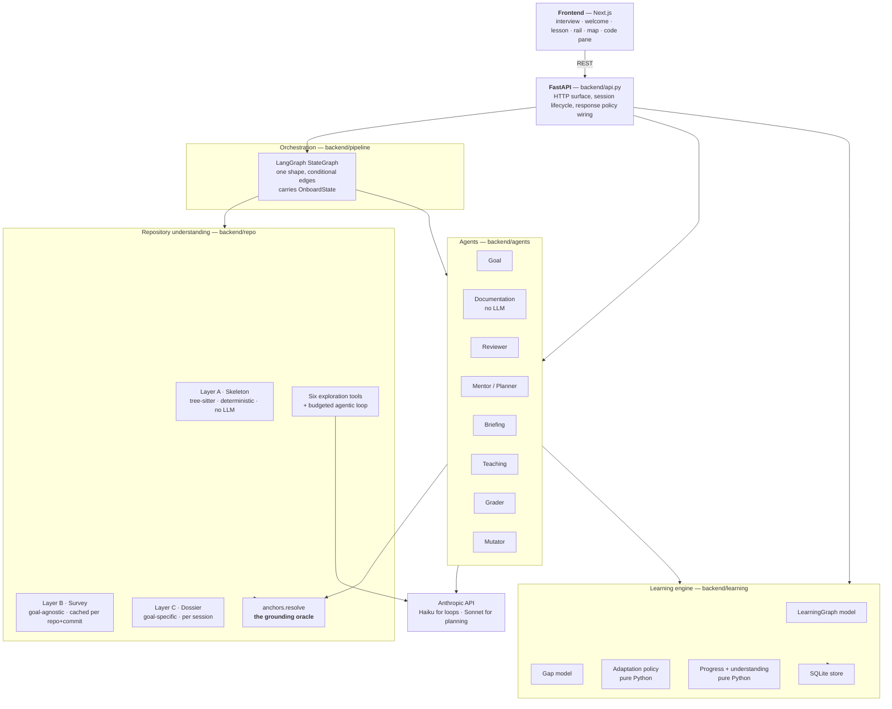
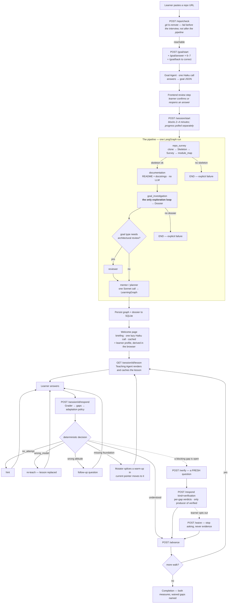
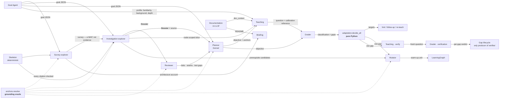
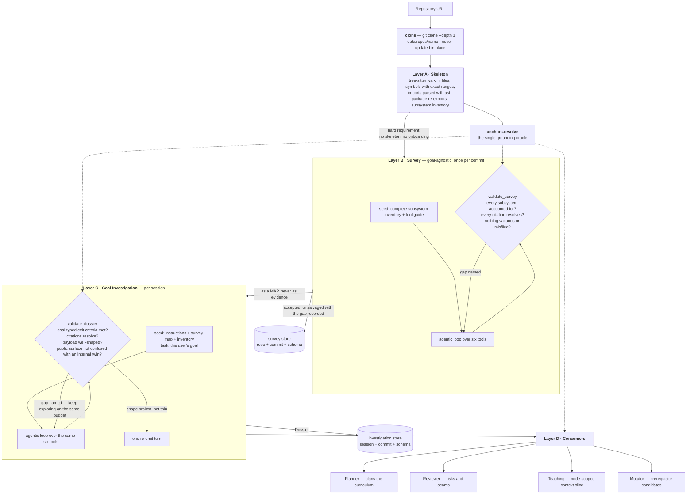
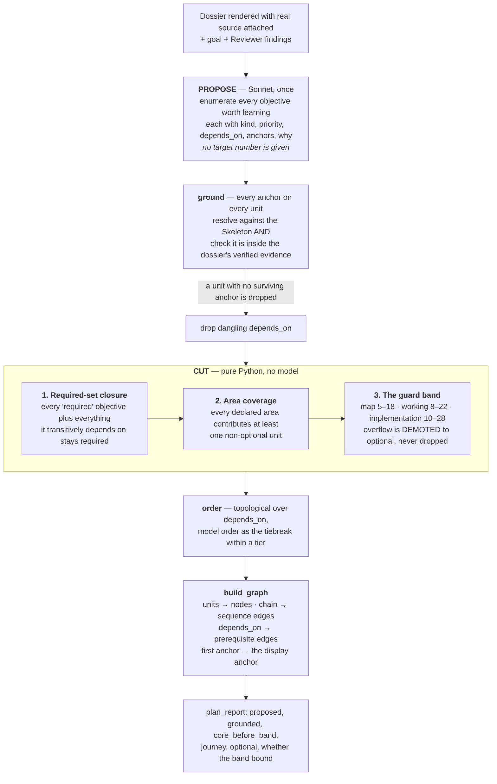
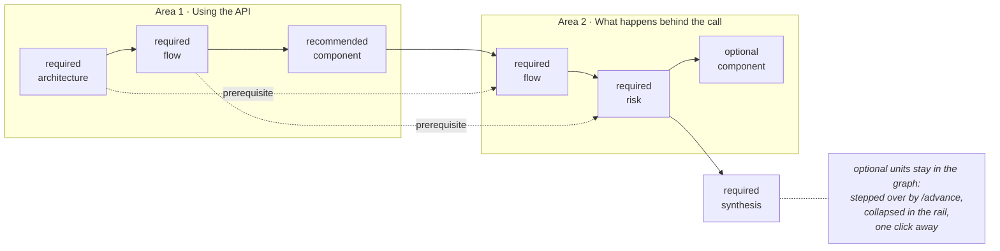
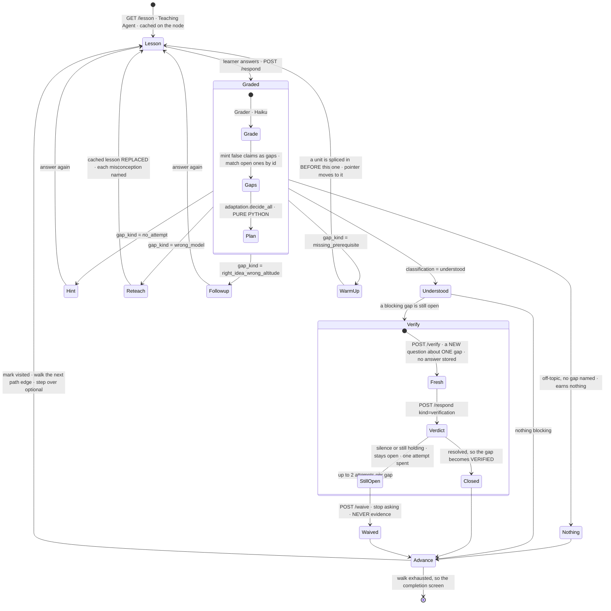
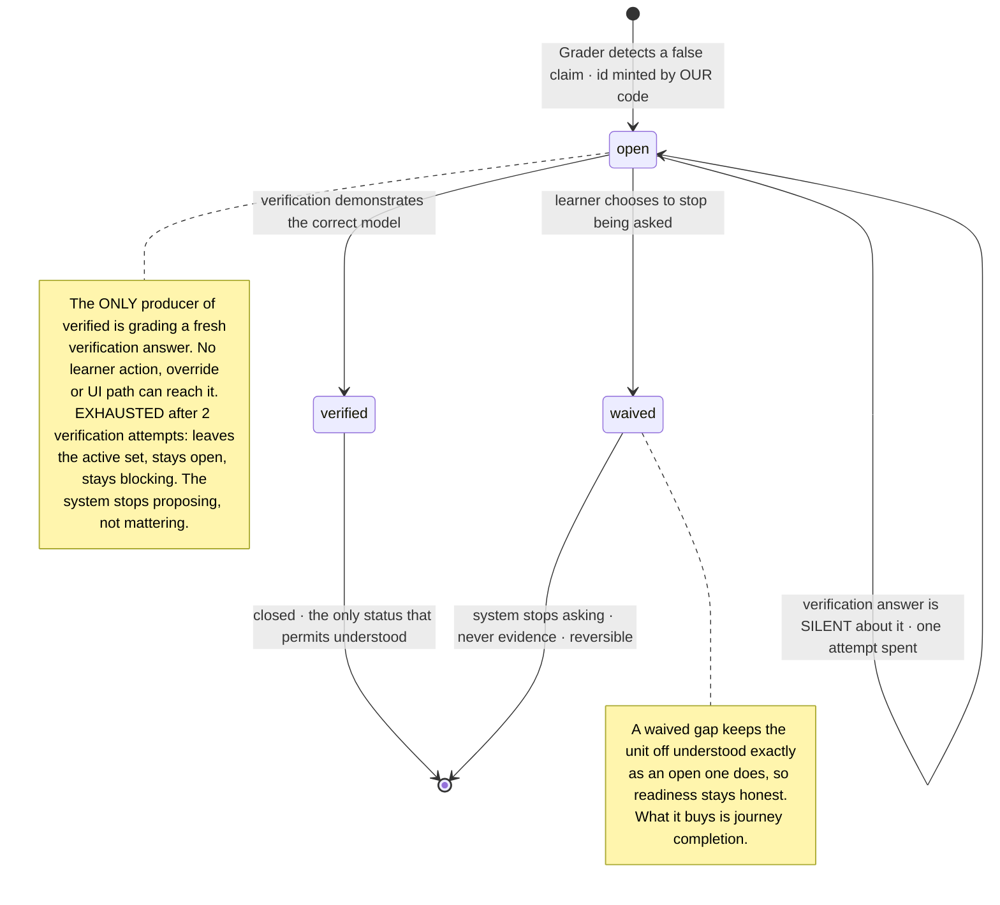
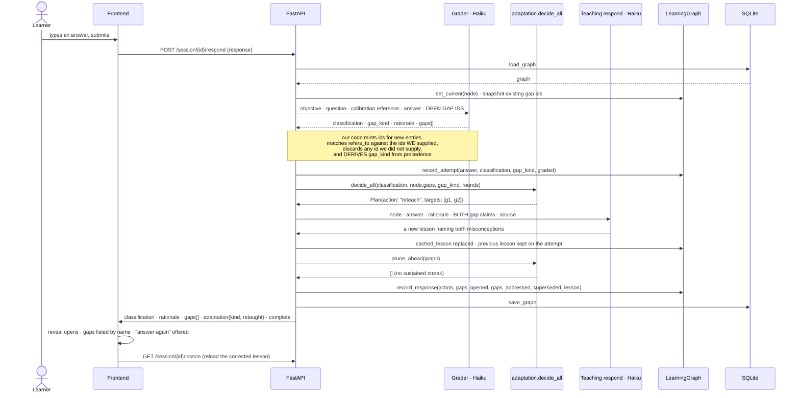
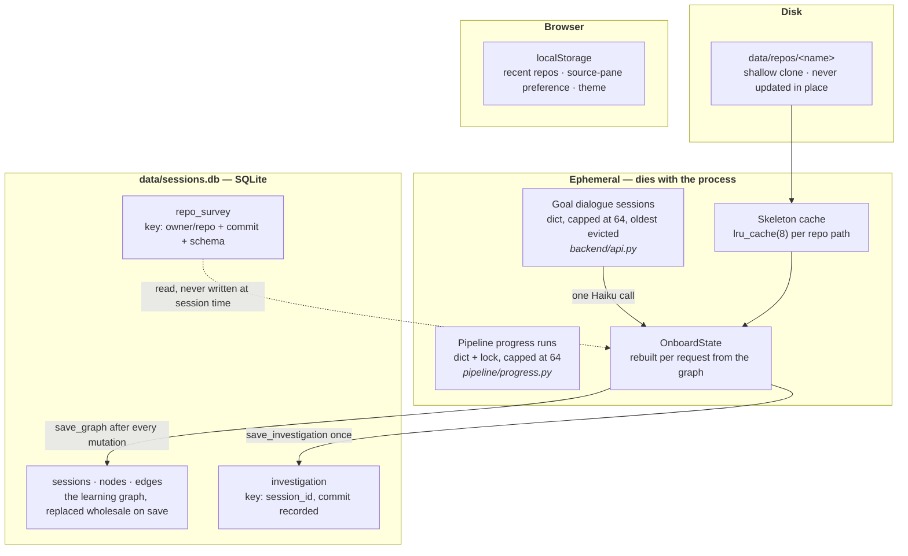

# CodeOnboard — How the System Works Today

> **What this document is.** A description of the system **as it is implemented
> now**, written for someone who has never seen this repository. It introduces
> every term before using it, and it prioritises the mental model over
> exhaustive coverage of files and fields.
>
> **Grounding.** Every architectural claim here was checked against the code on
> branch `ui-redesign` at `51bcdac`, not against the planning documents. Where a
> planning document, a `CLAUDE.md` statement or a module docstring disagrees
> with the code, **the code wins** and the disagreement is recorded in
> [§14](#14-where-the-documentation-and-the-code-disagree). Both test suites
> were green at that commit: **1313 backend tests, 324 frontend tests.**
>
> **Status labels.** Statements are marked where it matters:
> **[implemented]** verified in code · **[known limitation]** implemented but
> demonstrably imperfect, with evidence · **[planned]** designed and written
> down but *not built*. Nothing marked planned exists in the running system.

---

## Table of contents

1. [The big picture](#1-the-big-picture)
2. [End-to-end journey](#2-end-to-end-journey)
3. [Agent architecture](#3-agent-architecture)
4. [Repository understanding](#4-repository-understanding)
5. [Goal definition and planning](#5-goal-definition-and-planning)
6. [The learning engine](#6-the-learning-engine)
7. [The gap model and adaptive behaviour](#7-the-gap-model-and-adaptive-behaviour)
8. [Decision architecture — where intelligence lives](#8-decision-architecture--where-intelligence-lives)
9. [Communication between components](#9-communication-between-components)
10. [State and persistence](#10-state-and-persistence)
11. [Frontend mental model](#11-frontend-mental-model)
12. [Important design decisions](#12-important-design-decisions)
13. [A concrete walkthrough](#13-a-concrete-walkthrough)
14. [Where the documentation and the code disagree](#14-where-the-documentation-and-the-code-disagree)
15. [How to think about the system](#15-how-to-think-about-the-system)

---

## 1. The big picture

### 1.1 The problem

A developer is handed an unfamiliar codebase — a library they must use, a
service they must extend, a bug they must trace. The existing options are all
bad in the same way: a README explains the product rather than the code; a
file-by-file tour teaches location rather than structure; and asking a chat
model questions produces fluent answers with no way to tell which of them are
about *this* repository and which are about repositories in general.

CodeOnboard's bet is that what a developer actually needs is **a curriculum**:
an ordered set of claims they should be able to make about the system, each one
anchored to real code, taught one at a time, and *checked* — so that at the end
there is evidence of what they understood rather than a feeling of having read
a lot.

### 1.2 Who the user is, what they provide, what they get

| | |
|---|---|
| **User** | One developer, working alone, facing one repository. There is no multi-user model, no auth, no teams. |
| **They provide** | A GitHub repository URL, and answers to a short interview: how familiar they already are, why they are here, what they want to be able to do afterwards, how deep into the implementation to go, and what they already know. |
| **They get** | A **learning journey**: an ordered sequence of *learning units*, each with a stated objective, real file-and-line anchors, a generated lesson, and one question. Their answers are graded; misconceptions are named, remediated and verified; and the whole thing persists as a model of what they have demonstrated. |

The system today is **Python-only** in a structural sense: the parser, the
qualified-name rule, import resolution and public-API detection are all
Python-specific. Adding another language means writing a sibling adapter behind
the same interface, not changing the architecture.

### 1.3 What makes this different from asking an LLM about a repository

Four properties, and each is enforced by code rather than requested in a prompt:

1. **Grounding is against the repository, never against what the model was
   shown.** A model names a `file` plus a `symbol`; *our code* looks up the line
   range in a deterministic index built by `tree-sitter`. A hallucinated line
   number is therefore structurally impossible, and a citation to a symbol that
   does not exist is rejected with a named reason
   (`backend/repo/anchors.py`).
2. **Coverage is an obligation checked mechanically.** The repository survey is
   handed a complete inventory of the repository's subsystems and must account
   for every one of them — described, or explicitly skipped with a
   repository-level reason. Anything unaccounted for is a validation failure
   that sends the model back to gather more, inside the same budget
   (`backend/repo/survey.py`).
3. **The system keeps a model of the learner, not a chat history.** What the
   learner has demonstrated, what they misunderstood, what was verified and what
   they chose to stop working on all persist in SQLite and survive restarts.
4. **The decisions that must be predictable are not made by a model.** How long
   the curriculum is, whether a misconception blocks progress, which response a
   wrong answer earns, what progress means — all of these are pure Python
   functions, unit-testable without an API key. Models are used for judgement
   (what matters, what to teach, whether an answer reaches a claim); code is
   used for policy.

### 1.4 Vocabulary — read this before anything else

Almost nothing in this system is named after what it obviously does. These are
the terms the rest of the document uses.

| Term | What it actually is |
|---|---|
| **Skeleton** | A deterministic, model-free index of one checkout: every file with its role and line count, every function and class with its exact line range and qualified name, every import statement parsed with `ast`. Built by `tree-sitter`. This is the *ground truth* everything else is checked against. |
| **Anchor** | A verified pointer into the repository: a file plus a symbol plus the line range our code derived for it. "Grounded" means "every citation resolves to an anchor". |
| **Survey** (Layer B) | One **goal-agnostic** account of what a repository is: subsystems and responsibilities, entry points, core abstractions, representative flows, seams, testing posture. Produced once per repository *commit* and reused by every user and every goal. |
| **Dossier** (Layer C) | The **goal-specific** understanding: which components matter *for this user's goal* and why, the flows the goal turns on, confirmed relationships, contracts, prerequisite concepts, and honest open questions. Produced once per session. Every code citation in it has been verified. |
| **Learning graph** | The persisted object at the centre of the product: nodes (learning units), edges (`sequence`, `prerequisite`, `deeper`), a current pointer, and everything the learner has done. It is simultaneously the plan and the record. |
| **Learning unit / node** | One learning objective with one or more verified anchors — *not* "a code chunk with a title". |
| **Objective** | The single claim the learner should be able to make afterwards, in their own words. It is the **contract** between the planner (writes it), the teacher (builds exactly it) and the grader (marks against it). |
| **Lesson brief** | The planner's instructions for a unit — objective, why, kind, priority, area, and the full anchor list. Stored as JSON on the node. |
| **Area** | One level of curriculum grouping ("Routing and dispatch"), so a sixteen-stop journey reads as a shape rather than a list. Metadata, not an entity: no state, no traversal. |
| **Priority** | `required` \| `recommended` \| `optional`. `required` is the curriculum's floor; `optional` units stay in the graph but are stepped over by the default walk. |
| **Gap** | **A claim the learner made that is false**, attached to the clause of the objective it violates. Not a topic, not a score. One answer can contain several. |
| **Blocking** | A property of a gap's *kind*, computed in code: a `missing_prerequisite` or `wrong_model` gap prevents its unit ever counting as `understood`. |
| **Warm-up** | A remedial unit the system splices into the journey *before* the unit the learner failed, aimed at one specific false belief. A detour, not a stop. |
| **Verification** | A **fresh** question about one gap, with no answer attached, asked after the correction. The only thing in the system that can mark a gap `verified`. |
| **Goal readiness** | Demonstrated coverage of the `required` set. The headline number. |
| **Journey progress** | How much of the promised walk has been dealt with. Coverage, not mastery. Deliberately a second number. |

### 1.5 Major subsystems

Read that as four responsibilities:

- **`backend/repo`** turns an unfamiliar checkout into verified, structured
  understanding. It knows nothing about learners.
- **`backend/agents`** contains everything that talks to a model. Each agent
  takes an injected client, appends to a shared error list, and **never
  raises**.
- **`backend/learning`** is the learner-facing model and the deterministic
  policy over it. No IO, no model calls — which is why it can be tested
  exhaustively without an API key.
- **`backend/api.py`** is the only place that composes them, and it owns
  persistence timing.

### 1.6 What is live, and what is only designed

The repository contains substantially more *design* than *system*. To read the
code correctly you need to know which is which.

| Area | Status |
|---|---|
| Repository understanding (Layers A–C), the exploration harness, grounding | **[implemented]** and the production path. Vector retrieval was deleted, not disabled. |
| The interactive learning graph, teaching, grading, adaptation, progress | **[implemented]** |
| Objective-first planning (`CODEONBOARD_CURRICULUM`) | **[implemented]**, off by default in code, **on** in the checked-in `.env` |
| The gap model (`CODEONBOARD_GAPS`) | **[implemented]**, off by default in code, **on** in the checked-in `.env` |
| The phase-driven lesson renderers (`NEXT_PUBLIC_CODEONBOARD_UI` = `next` / `surfaces`) | **[implemented]** behind a build flag, unset everywhere, so `legacy` is what runs. All three renderers are deliberately kept reachable — see [§11.5](#115-three-renderers-behind-one-build-flag) |
| Grounded grading, verification integrity, property-claim safeguards (`grounding-repair.md` R0–R8) | **[planned]** — planning only, nothing built |
| Re-assessing a stop the learner answered short of (`reassessment.md`) | **[planned]** — a proposal. The dead end it describes is real and the UI now *names* it rather than hiding it |
| A chat assistant for questions the lesson did not answer (`chat-assistant.md`) | **[planned]** — planning only |
| TTS narration, walkthrough video, VS Code extension (Phases 4–5) | **[planned]** — not started |

---

## 2. End-to-end journey

### 2.1 The whole flow

### 2.2 Stage by stage

For each stage: what triggers it, who owns it, what it receives, what it does,
what it produces, where that goes, and what is persisted.

| Stage | Trigger | Owner | Receives | Produces | Persisted? |
|---|---|---|---|---|---|
| **Repo check** | Learner submits a URL | `repo/cloner.check_repo_reachable` | URL | `ok` + a human-readable reason | No |
| **Goal interview** | `/goal/start` | `agents/goal` | Answers, one at a time | A `GoalSession` accumulating answers; five fixed core questions plus 1–2 goal-type-specific follow-ups | **In memory only**, bounded at 64 sessions |
| **Goal synthesis** | Last question answered | Goal Agent (Haiku, 1 call) | All Q&A pairs + repo URL | The `goal` JSON: `primary_goal`, `goal_type`, `focus_area`, `code_depth`, `depth`, `familiarity`, `background`, plus goal-type extras | No — the client holds it |
| **Clone + index** | `/session/start` | `pipeline/explorer_nodes.run_repo_survey` | repo URL | A shallow clone on disk and a `Skeleton`. **A failed skeleton ends the run** — no graph is fabricated | Clone on disk (never updated in place) |
| **Survey** | Same node | Survey explorer (Haiku, agentic) | Skeleton inventory | Layer B survey payload, coverage-validated | SQLite, keyed `(owner/repo, commit_sha, schema_version)` — shared across all users and goals |
| **Documentation** | Graph edge | `agents/documentation` (**no LLM**) | The checkout | `doc_context`: README excerpt, module and symbol docstrings, `docs/` excerpts | On the learning graph |
| **Goal investigation** | Graph edge | Investigation explorer (Haiku, agentic) | Goal + Skeleton + Survey *as a map, not evidence* | The **Dossier**, validated against goal-typed exit criteria and the grounding oracle | SQLite, keyed by `session_id` + commit |
| **Reviewer** | Only for `improve_existing_system` / `understand_architecture` | `agents/reviewer` (Haiku, 1 call) | Goal + module map + dossier rendered as chunks | Strengths, risks, extension points, test gaps, boundaries — anchors dropped if ungrounded | Transient; folded into the planner's prompt |
| **Planning** | Graph edge | Mentor / Planner (**Sonnet**, 1 call + ≤1 retry) | The rendered dossier with real source attached | A `LearningGraph`: units, areas, `sequence` and `prerequisite` edges, confidence | SQLite immediately after the run |
| **Briefing** | First `GET /welcome` | `agents/briefing` (Haiku, 1 call) | Survey + README + learner profile | A 3–5 sentence orientation paragraph plus notes with checked file citations | Cached on the session |
| **Lesson** | `GET /lesson`, or `/advance` | Teaching Agent (Haiku, 1 call + ≤1 retry) | Objective, **source read at lesson time**, dossier slice or structural neighbourhood, doc context, what the learner already understands, and the claim of either the previous unit or — for a warm-up — the stop it unblocks | `setup` / `prompt` / `reveal` / `takeaway` / `ownership` / `expected_answer`, plus a `prompt_kind` chosen by code | Cached on the node — a revisit is free |
| **Grading** | `POST /respond` | Grader (Haiku, 1 call) | Objective, question, calibration reference, the answer, and any open gaps with their ids | `classification`, `gap_kind`, `rationale`, and a list of false claims | Attempt appended; gaps minted on the node |
| **Response selection** | Same request | `learning/adaptation.decide_all` (**pure Python**) | Classification + the node's gaps | A `Plan`: one action, its gap targets, the active set, deferred gaps | The action and its targets are recorded on the attempt |
| **Response generation** | Same request | `teaching/respond` (Haiku) or `mentor/mutator` (Sonnet) | The plan's targets, the answer, the rationale, the source | A hint, a follow-up question, a replacement lesson, or a spliced-in warm-up | Graph saved |
| **Verification** | `POST /verify` then `POST /respond kind=verification` | `teaching/verify` + `grader/verification` (Haiku each) | One gap's false claim + the source; then the answer | A fresh question with **no answer attached**; then a verdict per gap | Gap status, verification attempt counters |
| **Advance** | `POST /advance` | `api.py` + `LearningGraph` (**no LLM**) | Signal | Marks visited, records an explicit `continue` *only* if blocking gaps were open, walks the next path edge, steps over `optional` units | Graph saved |

### 2.3 What can change the next step

Five things, and only five:

1. **The grade's `gap_kind`** decides whether the learner gets a hint, a
   corrected lesson, another question, or a new unit in front of them.
2. **A `missing_prerequisite` gap** is the only signal that changes the *shape*
   of the graph mid-session.
3. **Sustained correct answers inside an area** demote the rest of that area's
   `recommended` units to `optional` — the only mechanism that *shortens* the
   journey (`adaptation.prune_ahead`).
4. **Learner intent**: `skip`, `mark_weak`, `waive`, `jump`, `retry`,
   `scope shorter/deeper`. User decisions always win over system opinions.
5. **Open blocking gaps** change where a returning learner lands
   (`resume_point`) and whether the journey can be called complete.

---

## 3. Agent architecture

### 3.1 What "agent" means here

An agent is a module in `backend/agents/` (plus two explorers in
`backend/repo/`) that owns one model conversation and one output shape. They all
follow the same three conventions, which is what makes the system debuggable:

- the Anthropic client is **injected**, never constructed inside a graph node;
- failures are **appended to a shared error list**, never raised — a broken
  adaptation must not cost the learner the grade that prompted it;
- output is parsed into a **Pydantic wire model** distinct from the persisted
  model, so a model's positional ids never leak into storage.

Model choice is a rule, not a preference: **Haiku for anything in a loop,
Sonnet only for planning, never Opus.** The exploration loops can make dozens of
calls; the planner makes one.

### 3.2 The roster

| Agent | Model / calls | When it runs | What it receives | What it produces | Who consumes it | Explicitly **not** its job |
|---|---|---|---|---|---|---|
| **Goal Agent** | Haiku ×1 | After the last interview answer | The Q&A pairs verbatim | The `goal` JSON | Everything downstream | Asking the questions (they are static strings), and choosing `depth` (derived in Python from `code_depth`) |
| **Survey explorer** | Haiku, agentic loop (default budget: 12 turns, 60 tool calls, 240k chars, 240s) | Once per repository commit | The complete subsystem inventory + six tools | The Layer B survey | The investigation, as a *map*; the briefing | Anything goal-specific. Its skips may only cite repository-level facts |
| **Documentation Agent** | **No LLM** | Every pipeline run | The checkout | `doc_context` | Teaching, briefing | Interpreting anything |
| **Investigation explorer** | Haiku, agentic loop (20 turns, 120 calls, 500k chars, 720s) | Once per session | Goal + Skeleton + Survey + six tools | The **Dossier** | Planner, Reviewer, Teaching, Mutator | Deciding the teaching order |
| **Reviewer** | Haiku ×1 | Only two goal types | Goal, module map, dossier-derived chunks | Risks, seams, test gaps, boundaries | The planner's prompt only — never shown to the learner | Exploring or retrieving on its own |
| **Mentor / Planner** | **Sonnet** ×1 (+≤1 retry) | Once per session | The dossier rendered with real source | The `LearningGraph` | Everything in the session | Deciding how *long* the curriculum is — code cuts it |
| **Briefing** | Haiku ×1, lazy | First welcome-page load | Survey + README + profile | An orientation paragraph and notes | The welcome page | Writing anything when there is no material — it returns `available: false` rather than inventing a description |
| **Teaching** | Haiku ×1 (+≤1 retry) per unit | On first visit to a unit | The objective, the anchored source, context, learner profile | The lesson: `setup` / `prompt` / `reveal` / `takeaway` / `ownership` / `expected_answer` | The learner; the Grader reads the question and the reference | Choosing the *form* of the question — code derives it from the unit's `kind` |
| **Grader (assessment)** | Haiku ×1 | Every `/respond` | Objective, question, calibration reference, answer, open gap ids | `classification`, `gap_kind`, `rationale`, `gaps[]` | The adaptation policy | Assigning gap ids, deciding whether a gap blocks, or deciding what happens next |
| **Teaching · respond** | Haiku ×1 | When the policy says hint / follow-up / re-teach | The selected gaps, the answer, the rationale, the source | Prose the learner reads; a re-teach replaces the cached lesson | The learner | Choosing *which* response to give |
| **Teaching · verify** | Haiku ×1 | `POST /verify` | One gap's false claim, the objective, the source, the question already asked | A fresh question, deliberately **with no answer** | The learner | Grading it |
| **Grader (verification)** | Haiku ×1 | Answering a verification question | Every open gap with its id, the question, the answer | A verdict **per gap id**, plus any newly revealed false belief | The gap lifecycle | Re-grading the objective, or deciding what to do next |
| **Mutator** | Sonnet ×1 | A `missing_prerequisite` gap, or `POST /retry` | A candidate pool of real code + the diagnosis + the specific gap | One warm-up unit, or an explicit *decline* | The graph | Inventing an anchor. It must pick from the candidates it was offered |

### 3.3 Why the boundaries are where they are

Each split solves a specific failure that was observed, not a hypothetical one.

**Exploration is separated from teaching, and there is exactly one explorer.**
If the planner, the teacher and the remediation logic each explored the
repository when they needed something, they would build divergent mental models
of the same code, and the same retrieval would run several times per session.
So `goal_investigation` is a dedicated pipeline stage and it is the **only**
place the system explores. Teaching, the Reviewer, the planner and the Mutator
*read* what it produced.

**Planning is separated from teaching by the `objective` contract.** The
planner writes the claim; the teacher is told to build *exactly* that claim even
if the code would support a more interesting lesson; the grader marks against
the same claim rather than against the model answer the teacher happened to
invent. Before this contract existed, each of the three aimed at its own target,
and the system was effectively verifying that the learner had reproduced the
teacher.

**Grading is separated from the response policy.** The Grader says *how far* an
answer fell short and *why*; a pure function then decides what the system does
about it. Merging them would make the response unpredictable and untestable, and
"I don't know" and a confident misconception — which want opposite treatment —
would be indistinguishable in the outcome.

**Question generation is separated from verification.** A lesson's question
comes with an explanation the learner will eventually read. Re-asking that same
question after showing the explanation tests memory. So verification is a
different act with different rules: a fresh scenario, aimed at one specific
false belief, and **no answer stored beside it**.

**The Mutator is separate from the Grader** because inserting a unit changes the
journey, and that is the one adaptation with lasting structural consequences. It
is capped at one warm-up per node and one structural mutation per graded answer,
and it is allowed to answer "none of these candidates is actually more
foundational" — a decline is a correct answer, not a malfunction.

### 3.4 How information moves between them

The dotted lines are the important ones: **five different agents all cite code,
and all five are checked by the same oracle.** There is no second
implementation of "is this citation real".

---

## 4. Repository understanding

### 4.1 The organising principle

> **The skeleton is computed. The meaning is explored.**

Breadth must not depend on a model's willingness to be thorough, and depth must
not depend on a similarity score. So the system splits the problem:

- Everything enumerable is enumerated **deterministically**: the file tree,
  roles, line counts, every symbol with its exact range, the import graph, and
  package re-exports.
- What those things *mean* — which matter, how they connect, where teaching
  should start — is **explored** by a model, through tools, under a budget, and
  validated by our code.

This is what replaced an earlier vector-retrieval architecture (chunk, embed,
store in Chroma, retrieve top-K). That is worth one paragraph only because it
explains a shape you will otherwise find odd: `backend/repo/parser.py` began
life as the RAG chunker, and its `tree-sitter` walk survived because it was
never retrieval machinery — it produces exactly the `(file, start, end, kind,
name, role)` tuples the deterministic index needs. Everything else (embeddings,
the vector store, top-K, similarity as a proxy for importance) was deleted, not
flagged off.

### 4.2 The pipeline

### 4.3 The six tools, and why exactly these

Exploration happens through a deliberately small, composable set
(`backend/repo/tools.py`):

| Tool | Answers | Exactness |
|---|---|---|
| `list_files` | What is here, with role, line count, symbol count | Exact |
| `symbols` | What is defined, and exactly where | Exact — from the parse tree |
| `read_file` | Show me this, bounded | Exact; a file over 400 lines returns its **outline** instead of its contents unless a range is given |
| `search_code` | Where does this text appear | Exact text matching — *"a match is a textual fact, not proof the symbol is the one you meant"* |
| `neighbors` | What is this connected to: methods, base classes, imports, importers, package re-exports, references | Exact except `references`, which is a word-boundary scan and is flagged `exact: false` on every result |
| `propose_anchor` | Is this citation real | Delegates to the one oracle |

Three rules hold the tool layer honest:

1. **Facts, not judgement.** No tool ranks by importance, summarises, or asks a
   model anything. Layer A stays model-free.
2. **Bounded output.** Every tool caps its result and reports `truncated`.
   Replacing vector context-flooding with tool-output context-flooding would not
   have been a migration.
3. **One boundary check.** All filesystem access goes through
   `skeleton.safe_repo_path`, which rejects absolute paths, drive letters and
   traversal — including via symlinks. No tool reimplements it.

`repo_path` is deliberately absent from every tool schema the model sees: it is
injected by the harness, so a model cannot aim a tool at a different checkout.

### 4.4 The exploration loop, and what it guarantees

`backend/repo/explore.py` is the harness both explorers run in. Three properties
are enforced in code because a prompt cannot enforce them:

- **Budgets are limits, not requests.** Turns, tool calls, total tool-output
  characters and wall-clock are all checked by the harness. A prompt that says
  "be brief" is a suggestion; `Budget` is a ceiling.
- **Exhaustion is a result, not an exception.** Running out of budget triggers
  one *salvage* turn — "report what you established, and state plainly what you
  did not get to" — and returns a partial artifact with `contract_met: False`.
  An API failure does the same. Nothing here raises at the caller.
- **Every call is recorded.** The trace is replayable and the token/cost
  accounting is per run.

Two smaller mechanisms are worth knowing because they explain behaviour you will
see in logs:

- **Identical tool calls are not re-run.** The tools are deterministic over a
  pinned checkout, so a repeat cannot return anything new; the harness points
  back at the earlier result instead of paying for the same bytes twice.
- **The harness tells the model how much budget is left**, once, when a quarter
  remains. This exists because raising the turn budget was measured to raise
  reading without making the model submit any earlier — it cannot plan a repair
  round-trip around a budget it cannot see.

### 4.5 Validation — the part that is not negotiable

This is where "deterministic breadth, agentic depth" stops being a slogan.

**The survey's contract** (`validate_survey`) is coverage. The model is handed
the complete subsystem inventory computed from the skeleton, and every entry
must appear in its report as either described (with a one-sentence
responsibility and a representative file that genuinely belongs to that
subsystem) or skipped with a repository-level reason. Anything unaccounted for
produces a message naming exactly what is missing — and nothing else, so the
feedback cannot teach the model the expected answer — and exploration continues
on the remaining budget.

**The dossier's contract** (`validate_dossier`) has four independent families,
kept apart because they demand opposite responses:

| Family | Meaning | Correct response |
|---|---|---|
| `structural` | The payload did not arrive in the shape the schema describes — an array serialised as markup, nested objects flattened to the top level | **Re-emit.** The findings may be fine; the wire is broken. Gathering more evidence is pure waste |
| `unresolved` | A citation does not exist in the repository | Verify and correct *that citation* |
| `unmet_criteria` | The investigation genuinely has not established enough for this goal type | Explore further |
| `surface` | The dossier cites an internal definition of a name while a *differently-defined* sibling of the same name is what callers actually reach through a package `__init__` | Establish which one the user reaches and how the two relate |

The separation is not tidiness. Conflating the first with the third was
measured to lose whole runs: a structural fault reported as "0 components
established" sent the model back to explore, and it re-submitted the same broken
payload until its budget ran out. Now a structural fault suppresses the coverage
complaints and gets one forced re-emit turn.

The `surface` check is narrow by construction — it fires only where a same-named
sibling *is* exported and the cited one is *not*. It exists because three
consecutive runs produced a learning graph whose first node described an
internal dataclass as "the user-facing declaration", because the exported
factory of the same name was never seen.

### 4.6 The dossier, conceptually

The dossier is not documentation. It is *the evidence a teacher will use*, and
its fields are shaped for that:

- `understanding` — the shape of the answer, in a paragraph
- `components` — the code that matters **for this goal**, most important first,
  each with a `role_in_goal` and a `why_it_matters` specific to the goal
- `entry_points` — with a `perspective` of `runtime` (what invokes the
  behaviour) or `public_api` (what a developer *using* this code imports). On a
  library these are frequently different definitions, and which one a learner
  meets first depends on the goal
- `flows` — ordered, step-by-step, across files, each step anchored
- `relationships`, `contracts`, `prerequisites` — confirmed edges, what a caller
  may assume, and the concepts someone must already hold
- `evidence_refs`, `context` — clarifying tests and docs, and useful asides
- `open_questions` — **honest uncertainty**, which the planner is explicitly
  told never to build a lesson on

### 4.7 Persistence, and what "unavailable" means

| Artifact | Key | Lifetime | If missing |
|---|---|---|---|
| Clone | repository name on disk | Until deleted; **never updated in place**, so the commit is effectively pinned | Re-cloned |
| Survey | `(owner/repo, commit_sha, schema_version)` | Shared across every user and goal | The investigation runs from the skeleton alone, with the degradation recorded |
| Dossier | `(session_id)` + commit recorded | The session | Teaching falls back to structural context; the Mutator falls back to skeleton candidates |

A schema-version mismatch, a corrupt row, or a commit that has moved all read as
**unavailable** rather than being migrated or silently trusted. Every consumer
has a defined behaviour for absent — which is the rule that lets an old session
keep working after a schema bump.

### 4.8 When further exploration is allowed — it is not

No consumer explores. Teaching, the Reviewer, the planner and the Mutator all
read what the investigation produced. When the dossier's goal-specific
neighbourhood is exhausted — which happens often, because the planner turns most
verified anchors into units — the Mutator widens its candidate pool using
**Layer A** (base classes, methods, callees, callers, importers), not a new
exploration loop and not similarity search. The stated fallback order everywhere
is: **dossier first, skeleton second, nothing third** — and "nothing" is a
supported, degraded mode, not an error.

The one exception to "nothing is fabricated" runs the other way: if *all* of a
unit's anchors fail to load at lesson time, Teaching **fails the lesson** rather
than writing one. With no source the model has only the objective, and it will
produce a fluent, confident, entirely ungrounded lesson from it — and nothing in
the output would look wrong. This was found by probing real lessons, not by
review.

---

## 5. Goal definition and planning

### 5.1 Three different questions, kept apart

The section's whole job is to keep these distinct:

| Question | Answered by | Where it lives |
|---|---|---|
| **What exists in the repository?** | Layer A + Layer B, deterministically and then goal-agnostically | Skeleton, Survey |
| **What does this person want?** | The interview, and only the interview | The `goal` JSON |
| **What should we teach, and in what order?** | The planner proposing and **our code cutting** | The `LearningGraph` |

### 5.2 The interview

Five core questions, in a fixed order, shown **verbatim** — they are static
strings in `agents/goal/questions.py`, not generated, so the interview never
drifts:

1. **familiarity** — four fixed options, from "never looked at it" to "used it
   before, now diving into the source"
2. **goal_type** — six displayed options, each mapped to one internal value
3. **primary_goal** — free text: what they want to be able to *do* afterwards
4. **code_depth** — three fixed options, phrased as outcomes ("give me the
   map" / "I'll be working in here" / "I need to master the internals")
   rather than as levels, because asking "how deep?" invites everyone to answer
   "deep"
5. **background** — free text: what they already know

Then one or two goal-type-specific follow-ups: a focus area for the
understand-style goals, the change they intend plus their risk tolerance for
`improve_existing_system`, the error plus what they have tried for
`debug_issue`, the issue for `contribute_code`.

**`/goal/back` is the only way backwards, and it un-answers exactly one
question.** Stepping back N questions is N calls, because the server owns the
consequence: crossing question 2 clears `goal_type`, which is what makes the
follow-up tail recompute rather than leaving the previous goal type's questions
queued.

Two fields are computed, not elicited, and one was deliberately deleted:

- **`code_depth` is elicited** because scope and code depth are independent
  dimensions — a broad shallow tour and a narrow deep dive are both legitimate —
  and this is the only one of the two that genuinely needs the user.
- **`depth` is derived in Python** (`map → overview`, `working → moderate`,
  `implementation → deep`) and is never written by a model. It used to be
  invented by Haiku from answers that never mentioned it, and it decided how
  much got taught.
- **`experience_level` was removed** as the same kind of invention.
  `familiarity` (fixed options) and `background` (free text) are both genuinely
  elicited and carry the real signal.

### 5.3 How the answers actually change things

`goal_type` is the highest-leverage answer, and it acts in three places:

1. It selects the **exit criteria** the investigation must satisfy before it may
   stop. These are floors, not targets, and they are deliberately modest — a
   floor set too high forces padding:

   | Goal type | What the criteria demand extra |
   |---|---|
   | `use_library` | **A verified `public_api` entry point** — the name a developer types — plus two contracts, and the base flow floor so the journey can still say what happens behind the call |
   | `understand_system` | A real trace: ≥4 steps across ≥3 files |
   | `understand_architecture` | 4 components, 2 flows across ≥3 files, 3 relationships |
   | `contribute_code` / `improve_existing_system` | Contracts and relationships — the seams around the change |
   | `debug_issue` | Precision over breadth: fewer components, a ≥4-step path |

2. It decides whether the **Reviewer** runs at all (only
   `improve_existing_system` and `understand_architecture`).
3. It calibrates the planner. For `use_library` the prompt is explicit that a
   journey which teaches the repository's internals in a sensible order *has
   answered the wrong question*: the first units are what the learner imports
   and calls.

The other answers act on framing rather than structure. `familiarity` decides
whether the journey opens with orientation units and how much vocabulary a
lesson defines. `background` makes a required objective **cheaper to teach** — a
shorter lesson, less re-explanation — and never removes it. That is a decided
rule with a stated reason: self-report is a weak signal and a dropped unit is
invisible, so a wrong self-assessment would silently remove a foundation the
dependency closure then teaches on top of. Prior knowledge is validated by how
the learner answers.

### 5.4 Planning: propose, then cut

There are **two planner implementations in the codebase**, selected by
`CODEONBOARD_CURRICULUM`. This is a deliberate migration pattern rather than
dead code: both produce a `LearningGraph` whose new fields are optional JSON
keys, so a graph from either loads under either setting, and Teaching and the
Grader have exactly one implementation each.

| | `dossier.py` — the pre-B3 planner | `curriculum.py` — objective-first |
|---|---|---|
| Flag | default (`0`) in code | `CODEONBOARD_CURRICULUM=1` — **set in the checked-in `.env`** |
| Asks the model for | 4–10 nodes, calibrated by a sentence in the prompt | *Everything* worth learning, with no target number |
| Size decided by | the model | **our code** |
| Emits | one `sequence` chain | `sequence` chain **plus** `prerequisite` edges from declared dependencies, plus areas |
| Anchors per unit | one | one **or more**, ordered |

The objective-first planner is the interesting one, and its shape is the point:

Four things about the cut are worth internalising:

- **The floor outranks the guard.** The required set is counted *first*; the
  band only allocates the remaining room. A goal that genuinely needs twelve
  required concepts gets twelve even under a band of eight — it does not get
  eight required plus whatever was listed earliest.
- **The band is a guard, not a target.** The lower bound is advisory and only
  logged: padding a journey to reach a number would be inventing curriculum. The
  ceiling demotes to `optional` and never deletes. `map`'s ceiling is
  calibrated from 18 measured runs; the other two remain judgement, and the code
  says so.
- **Priority is three ordered buckets, not a score.** The inputs are model
  judgements; a weighted 0.0–1.0 threshold would be false precision.
- **Every sizing rule is a pure function.** That is the point, not a side
  effect: curriculum size is testable without an API key.

### 5.5 What the planner is told to aim at

The proposal prompt is where the product's pedagogy lives. Its three load-bearing
instructions:

- **Default to system altitude** — what a part *owns* and what it deliberately
  does not own, runtime flows, state ownership, contracts and invariants,
  extension points, risk areas. Implementation detail is taught when it is
  load-bearing or when the learner asked for it, never as the definition of
  "understanding code".
- **Every unit must earn its place.** The default answer to "should we teach
  this?" is *no*. A unit teaching something a competent developer would infer in
  thirty seconds from a filename is negative value: it spends attention and
  inflates the sense of progress.
- **Aim at the supervision layer.** For each candidate: must the developer hold
  this themselves, do they mainly need to be able to *check* it, or can it be
  delegated to an assistant while they keep enough understanding to supervise
  the result? Prefer objectives that build judgement over objectives that build
  recall.

Unit `kind` comes from a vocabulary four agents and the frontend already share —
`architecture`, `flow`, `component`, `extension_point`, `risk`,
`test_coverage`, plus one addition, `synthesis`: a unit that connects several
*earlier* units and introduces no new code, which is where a mental model
consolidates and which previously had no way to be expressed at all.

### 5.6 What the journey looks like when it is built

Solid arrows are `sequence` — the order the learner walks. Dotted arrows are
`prerequisite` edges written **at plan time** from declared dependencies. This
matters for reading the code: `prerequisite` edges have **two producers with
different meanings**, and consumers must tell them apart.

| Producer | Meaning | Structural tell |
|---|---|---|
| The planner, from `depends_on` | The curriculum's dependency structure. Dozens per journey. Ordinary stops | The unit sits on the chain and **keeps an outgoing `sequence` edge** |
| The Mutator, after a wrong answer | An *event* in one learner's session: something went wrong here | `insert_before` reroutes the incoming sequence edge onto the new node, so a spliced warm-up has **no outgoing `sequence` edge** |

A consumer that treats every `prerequisite` edge as remedial reports a planned
curriculum as a sequence of failures — which is exactly what happened to the
route rail, where nearly every stop was captioned "added after confusion".

---

## 6. The learning engine

### 6.1 What a learner meets at one unit

A lesson is generated on first visit and cached on the node, so a revisit costs
nothing. Its structure is what makes the active-learning claim true:

| Field | Role |
|---|---|
| `why_now` | One sentence of continuity, written by the teacher. For an ordinary stop it is written off the **previous unit's objective**; for a **warm-up** it is written off the objective of the stop the warm-up *unblocks*, because a learner did not arrive at a warm-up by finishing the previous unit — they arrived because they got stuck on the one after it |
| `setup` | Framing and code — and it is explicitly forbidden from answering the question below |
| `prompt` | One question, in a **form our code chose** |
| `reveal` | The explanation — **withheld until the learner has answered** |
| `takeaway` | The objective restated as something that survives forgetting the details |
| `ownership` | What to hold yourself here versus what could safely be delegated to an assistant |
| `expected_answer` | A **calibration reference** for the Grader — one phrasing among many, *not* the marking standard |
| `walkthrough` | A compatibility surface: assembled from `setup` + `reveal` when the model wrote the split form |

The withholding is the mechanism, not a UI flourish. Before the split, the
prompt asked for a prediction while the full explanation sat above it on screen.
The reveal opens on a graded answer — and also on a revisit, because someone
returning to a unit they already answered is reading, not being tested.

### 6.2 The question form follows the unit's kind

Our code picks the form; the model is shown **only the one it must use**,
because a menu invites blending.

| Unit kind | Form | What it asks for |
|---|---|---|
| `architecture` | `compare` | What belongs to this part, and what deliberately does not — both sides of the line |
| `flow` | `predict-next` | Where control goes next from a specific point, and why |
| `component` | `predict-then-reveal` | Predict what this code does or returns |
| `risk` | `critique` | Here is a plausible but flawed change to *this* repository — what is wrong with it, and what would it break? |
| `extension_point` | `locate` | Where would you add X, and what must your addition provide? |
| `synthesis` | `explain-back` | Connect the units already learned into one system-level claim |
| `test_coverage` | `predict-then-reveal` | Which class of regression this guards |
| anything else | `predict-then-reveal` | the well-tuned fallback |

The `critique` form is the product's strategic bet in miniature: it shows the
learner a change an AI assistant or a confident newcomer would plausibly
produce, and asks them to find the repository-specific guarantee it violates.
It is mapped to exactly one kind on purpose — inventing a flaw is a harder
generation task than any other form asks for, and widening it before it has been
seen on real repositories would produce eight forms each worse than the one good
one. **[implemented]**, and four distinct forms were observed live.

### 6.3 The answer loop

Three things this diagram makes visible:

- **A warm-up returns you to the unit you failed.** A `prerequisite` edge points
  at the node it unlocks, so the ordinary walk carries the learner back to the
  objective they got wrong — now that the missing piece has been taught. Nothing
  special-cases this; jumping *past* the original node would leave the failed
  objective permanently unlearned.
- **`understood` and "nothing blocking" are different conditions.** An answer
  can reach the objective while a detected misconception sits open on the same
  unit. That does not earn a re-teach — the learner just demonstrated they can
  answer — it earns **verification**.
- **`off-topic` with no named gap earns nothing at all**, and does not move
  `understanding_state` in either direction. An unrelated answer is evidence of
  neither understanding nor misunderstanding, and it must not reshape a path.

### 6.4 Progress — two numbers, and why not one

`backend/learning/progress.py` owns both, computed server-side so there is
exactly one implementation of each definition.

| Measure | Definition | What it is for |
|---|---|---|
| **Goal readiness** | `demonstrated required units / all required units`. "Demonstrated" means the evidence shows the learner can make the claim — `strength` or `recovered` | The headline. A claim about the **goal**, not a node count |
| **Journey progress** | `settled stops / promised stops`, where "settled" is visited, answered, or explicitly acted on | Coverage of the path |
| **Assessed coverage** | Promised stops carrying real evidence | The honesty check: a high journey number beside a low assessed number means the learner walked past the questions |

One number cannot be both: a single mastery gauge reads 0% for someone who
walked the whole journey without answering anything, and a single coverage gauge
claims understanding nobody demonstrated.

Two rules keep the headline honest:

- **`partial` earns nothing.** It used to earn 0.5, which was an unjustified
  constant — nobody measured that a `partial` verdict means half an objective is
  grasped — and it credited units the profile was simultaneously calling *needs
  work*. Partial understanding is reported as "in progress" beside the number,
  not folded into it.
- **The invariant, pinned by tests:** *goal readiness may fall only when
  evidence about the learner changes, never because the system changed the
  plan.* Remedial warm-ups are therefore excluded from **both** sides of the
  fraction and reported separately as **detours**. Before this, inserting a
  warm-up dropped the gauge from 0.50 to 0.33 — the system's decision to help
  looked like the learner losing ground.

### 6.5 Journey completion is not mastery

`is_complete()` asks whether every non-optional planned stop has been **dealt
with**: understood, or carrying an explicit learner override (`continue`,
`waive_remaining`, `skip`). Plain `visited` is deliberately not enough — intent
must be recorded, never inferred, so scrolling past a stop does not settle it.

This makes the intended final state expressible: *"Journey complete — verified
understanding 92%, 1 gap waived."* Better than pretending to mastery, and better
than leaving the product permanently unfinished because one thing was
deliberately not remediated.

---

## 7. The gap model and adaptive behaviour

### 7.1 What a gap is

> **A gap is a claim the learner made that is false**, attached to the clause of
> the objective it violates.

That definition is doing work. It is not a topic ("confusion about Node
construction"), not an omission ("did not explain `expand()`"), and not a score.
The Grader's test, applied to every candidate before it is reported: *can you
point at something the learner asserted and say "this is not true"?*

Two rules are enforced at the point of construction, in `learning/gaps.py`,
because both are properties of a gap rather than decisions about one:

1. **Silence never becomes a gap.** `no_attempt` and `none` are refused —
   `Gap.create` raises. A blocking gap earned by "I don't know" would be a
   sticky penalty for declining to guess, and would be unclosable.
2. **Blocking is a pure function of `kind`**, computed in code. The model never
   votes on it, and an *unknown* kind is deliberately non-blocking: the
   conservative direction is to let the learner progress, never to block them on
   something we cannot interpret.

| Kind | Meaning | Blocking? |
|---|---|---|
| `missing_prerequisite` | What they said reveals a false belief about a foundation this unit builds on | **Yes** |
| `wrong_model` | They stated confidently how something works, and it does not work that way | **Yes** |
| `right_idea_wrong_altitude` | True of the implementation but false as a claim about responsibility, or the reverse — *it has to be true at some level* | No |

### 7.2 The lifecycle

The asymmetry is the design. `verified` is reachable only by positive evidence
on a fresh question — no learner action, no override, no UI path produces it.
`waived` stops the system asking and buys journey completion, but it is a
*decision*, not evidence, so it keeps the unit off `understood` exactly as an
open gap does.

Reaching either cap writes **nothing** to a gap. That is the honest state:
nobody has shown they understand it and nobody has chosen to stop. A cap that
silently closed a gap would be the system marking its own homework because it
ran out of ideas. A capped gap leaves the *active set* but stays open, stays
blocking, and is still **reported** as deferred, so the count the learner sees
stays truthful.

There are two caps, and they bound different things:

| Cap | Scope | What counts against it |
|---|---|---|
| 2 verification attempts | **Per gap** | A verification question that was aimed at this gap and did not close it — whether the answer was wrong about it or silent about it. Both mean a question was spent |
| 4 remediation rounds | **Per node** | An **applied** remediation of any kind: a warm-up spliced in, a re-teach written, or hint/follow-up text produced. Counting only structural ones would leave the loop unbounded in exactly the case the cap exists for, since a node whose leading gap keeps earning `hint` could be hinted at forever. A declined warm-up or a re-teach that raised costs nothing — the budget must not be spent on the system's own failures. Verifications are not counted here; that is the per-gap budget |

### 7.3 Identity across re-grades

When a unit already carries open gaps, the Grader is **shown them with their
ids** and must, per reported entry, either name one or say `new`. Three
outcomes, and the asymmetry is deliberate:

| Outcome | What happens |
|---|---|
| **matched** — an id we supplied | Nothing is minted, nothing on the gap changes. One misconception stays one gap across attempts |
| **new** | Minted, with our id |
| **rejected** — an id we did *not* supply | Discarded whole. We do not fall back to minting it as new: an entry claiming to be an existing gap is a claim we cannot verify, and guessing either way is worse than losing it |

There is deliberately **no text-similarity merge**. A heuristic that quietly
fuses two distinct misconceptions is worse than a duplicate; the known failure
mode is over-reporting `new`, which is bounded and measured (29 matched, 1 new,
0 hand-judged duplicates over 18 grades on 6 real nodes).

### 7.4 How the response is chosen

`adaptation.decide_all(classification, gaps, gap_kind, remediation_rounds)` is
the whole policy, and it is a table. The three rules, in the order they apply:

1. **Precedence decides the response.** Gaps are ordered
   `missing_prerequisite → wrong_model → right_idea_wrong_altitude`, stably, so
   detection order breaks ties. Foundational first, because remediating a
   higher-altitude gap while a foundation is missing lands on nothing.
2. **One mutation, many corrections.** A `prerequisite` targets exactly *one*
   gap — the structural change is capped at one per graded answer. A `reteach`
   or `followup` targets *every* active gap of that kind, because a lesson can
   name several misconceptions and must, or the ones it omits are silently
   abandoned. Gaps of *different* kinds are never merged: a hint and a
   correction are not the same act.
3. **Overflow collapses.** More than three blocking gaps open is itself one
   signal — the unit did not land — so the response is a single full re-teach
   over all of them rather than a queue of warm-ups.

The action table itself:

| `gap_kind` | Action | Why that one |
|---|---|---|
| `no_attempt` | **hint** | They are stuck, not wrong. A prerequisite would answer a question they never asked |
| `wrong_model` | **re-teach** | The misconception is the thing to correct, and it must be *named* — re-teaching the same lesson unchanged leaves them to make the same inference twice |
| `missing_prerequisite` | **prerequisite** | The one case that earns a structural change |
| `right_idea_wrong_altitude` | **follow-up** | One clarifying exchange, then move on. Restructuring a journey over a framing slip is an overreaction |
| none named, `confused` | prerequisite | Pre-gap-model behaviour, preserved so older sessions keep working |
| none named, `off-topic` | **none** | Earns nothing |

One subtlety worth knowing because it was a real defect: **a named `gap_kind`
outranks the coarse classification.** A learner wrote "I can't follow this
because I don't know what a function signature is" — genuinely stuck on a
foundation. The Grader read it exactly right and reported
`missing_prerequisite`; the policy threw the signal away because the same answer
was also classified `off-topic`. The specific signal now decides, and the
off-topic guard protects only the *unclassified* case.

### 7.5 A worked example

The learner is on a `flow` unit whose objective is:

> *Explain why `best_first_graph_search` needs an explored set as well as a
> frontier, and what re-expanding a node would cost.*

They answer:

> "It keeps a frontier priority queue ordered by `f`. The explored set is just
> an optimisation to save memory, and `h` returns 0 for a `GraphProblem` so the
> ordering is really by path cost."

Here is what each component does, in order:

| Step | Component | Kind of decision | Outcome |
|---|---|---|---|
| 1 | **Grader** | LLM judgement | `classification: confused`. Two false claims reported: *"the explored set is a memory optimisation"* and *"`h` returns 0 for `GraphProblem`"* |
| 2 | `_record_gaps` | Deterministic | Both kinds are in `GAP_KINDS`, so two gaps are minted with **our** ids. `gap_kind` is **derived** as `missing_prerequisite` — the higher-precedence of the two |
| 3 | `decide_all` | Deterministic table | Two blocking gaps, under the active-set cap of 3, so no collapse. Precedence puts the foundational one first → **action `prerequisite`, target = that one gap** |
| 4 | **Mutator** | LLM judgement over a deterministic candidate pool | Candidates come from the dossier's prerequisites/contracts/flow-neighbours for this node, widened with skeleton neighbours if that runs dry, minus everything already taught. Sonnet picks **one**, or declines. It is given the learner's actual words, the rationale, and the specific false claim — *"choose the candidate that builds the foundation this belief is missing, not merely one near the node they failed"* |
| 5 | `insert_before` | Deterministic | The warm-up is spliced in *before* the failed unit; the incoming sequence edge is rerouted onto it; a `prerequisite` edge joins it to the original. `current_node_id` moves to the warm-up. Its brief records `priority: required`, `origin: system_remediation`, `remediates: [gap_id]` |
| 6 | `prune_ahead` | Deterministic | Runs on every graded answer; no sustained streak here, so nothing is demoted |
| 7 | `record_response` + `record_journey_event` | Deterministic | The attempt gets an envelope naming the action, the gaps opened and the gaps addressed. A plan-scoped `remediation_inserted` event records the ids, the cause and the origin |
| 8 | Progress | Deterministic | Goal readiness **does not move**: the warm-up is excluded from both sides by `origin`, and it appears as a **detour** instead |
| 9 | Learner learns the warm-up, answers it | — | The warm-up teaches and grades like any other unit |
| 10 | `/advance` | Deterministic | `next_in_path` follows the warm-up's `prerequisite` edge **back to the original unit** |
| 11 | Learner answers the original objective correctly | **Grader** | `classification: understood` |
| 12 | `understanding_of(node)` | Deterministic | **Still not `understood`.** The second gap — `h` returns 0 — is blocking and unverified, so the derived state is `partial`. `decide_all` returns `none`: an answer that reached the objective is not re-taught |
| 13 | `POST /verify` | LLM, one gap | A **fresh** question about the second gap: a different call site, a different starting state, no reveal, no model answer. The prompt is explicitly told to work out what someone still holding the belief would say, and to write a question that answer would get *wrong* |
| 14 | `grade_verification` | LLM, per-gap verdict | Resolves the second gap; the first stays as it was. **Silence about a gap never closes it** — a verdict is required per id and defaults to unresolved |
| 15 | `understanding_of(node)` | Deterministic | Every blocking gap is now `verified` → the node reports `understood`, and goal readiness rises |

If instead the learner had said *"stop asking me about this"*, step 14 becomes
`POST /waive`: the gap is `waived`, the system stops offering, the node stays
`partial`, readiness stays honestly below 100%, and journey completion becomes
reachable with the waived gap **named** on the completion screen.

### 7.6 Two dimensions, never one

`learning/understanding.py` reports **what the evidence demonstrates** and
**what the learner decided** as independent facts, because a learner can waive a
gap, later pass verification on it, and end with a unit that is genuinely
understood while the record still says they had chosen to stop.

| Understanding (evidence) | Disposition (decision) |
|---|---|
| `strength` — demonstrated, never fell short here | `active` — nothing decided; help is still on offer |
| `recovered` — fell short, then demonstrated. **Not a weakness** | `continued` — "I'll move on", withdrawn by a new attempt |
| `unresolved` — assessed and not demonstrated | `waived` — "stop asking me" |
| `insufficient` — no usable evidence either way | `skipped` / `asserted` |

`recovered` exists because `weak_spot` is *sticky*: before this distinction, the
UI captioned a unit the learner had worked through and mastered as "⚑ marked
weak" forever.

"Needs work" is the **conjunction**: unresolved *and* no settling decision. That
preserves the truth about unresolved understanding without nagging about a
decision the learner already made.

### 7.7 Known limitations of the gap model — measured, not hypothetical

**[known limitation]** A manual end-to-end round on `aimacode/aima-python`
(one session, 17 planned units + 2 warm-ups, 13 answered, 95 recorded findings)
established the following, and none of it is fixed in code today:

| Finding | Consequence |
|---|---|
| Grading measures conformity to **the system's own generated objective**, not to the repository. A false answer matching a false objective was graded `understood`; a true answer exceeding an oversimplified objective was graded `partial` **and given a gap** | The Grader is never shown source — `/respond` builds its state without `repo_path` |
| **Verification is corruptible**: a gap was marked `verified` by an answer restating it | The prompt already forbids this explicitly and was violated. The fix has to be structural, not verbal |
| Claims *inside* a unit's anchors were reliable; false **property** claims (complexity, optimality) survived even with the contradicting source anchored | Anchor coverage predicts mechanism accuracy. Nothing predicts property accuracy |
| Three misconceptions in an answer, one gap out | Multi-gap recall is variable |
| The system has no representation for **its own error**, so pattern detection attributes system defects to the learner | Learners cannot dispute a grade |
| `right_idea_wrong_altitude` is nearly unreachable *as a gap*, because the prompt excludes true statements and altitude errors are true at some level | A design question about what a gap is for |

`docs/planning/phases/grounding-repair.md` designs the repairs (grade against
source, make an unevidenced resolution unrepresentable in the schema, plan-time
grounding invariants, a `disputed` gap status). **It is planning only.** The
round's own summary is the fairest description of where the product stands:
*usable, not yet trustworthy* — a learner who already knows the domain extracts
real value and routes around the errors; one who does not would have been taught
several false things and told a correct answer was wrong.

---

## 8. Decision architecture — where intelligence lives

This is the section to read if you read only one. The system's defining property
is not that it uses models; it is **which decisions it refuses to give them**.

### 8.1 The decision table

| Decision | Owner | Mechanism |
|---|---|---|
| Which questions the interview asks | **Deterministic** | Static strings in `questions.py`, shown verbatim |
| Which follow-ups appear | **Deterministic** | Keyed on `goal_type` from a fixed option map |
| The `goal` JSON's prose fields | **LLM** | One Haiku call over the verbatim answers |
| `depth` | **Deterministic** | Derived from the elicited `code_depth` |
| What exists in the repository | **Deterministic** | `tree-sitter` + `ast`; no model involved |
| Whether a citation is real | **Deterministic** | `anchors.resolve` against the Skeleton — the single oracle |
| Which code to read next during exploration | **LLM** | The agentic loop chooses tools and arguments |
| When exploration may stop | **Both** | The model is told to stop at sufficiency; a **deterministic** validator holds it to goal-typed floors and re-enters the loop with a named gap |
| How much budget exploration gets | **Deterministic** | `Budget`: turns, calls, output chars, wall-clock, checked by the harness |
| What matters for this goal | **LLM** | The dossier's `components`, `why_it_matters`, flows |
| What to teach, and its objective | **LLM** | The planner's proposal |
| **How much to teach** | **Deterministic** | Required-set closure → area coverage → guard band. No number in any prompt |
| Teaching order within a dependency tier | **LLM** | Model order is the tiebreak; the topological sort is deterministic |
| Which anchor the code pane opens | **Deterministic** | The first anchor, which the prompt requires to be the entry point or owning side |
| The lesson's prose | **LLM** | Teaching, one Haiku call, cached |
| The **form** of the question | **Deterministic** | `_FORM_BY_KIND[kind]`; a value the model supplies is overwritten |
| Whether the answer reaches the objective | **LLM** | Grader `classification` |
| Why it fell short | **LLM** | Grader `gap_kind`, **derived** from the highest-precedence detected gap when gaps exist |
| Which false claims the answer contains | **LLM** | Grader `gaps[]` |
| A gap's **identity** | **Deterministic** | Our code mints every id; the model may only reference ones it was shown, and an unrecognised id is discarded |
| Whether a gap **blocks** | **Deterministic** | Pure function of `kind` |
| What the system does about an answer | **Deterministic** | `decide_all` — a table plus precedence, active-set cap 3, overflow collapse |
| Which gaps a response addresses | **Deterministic** | The `Plan`'s targets. Nothing downstream re-derives them from `gap_kind` |
| What a hint / follow-up / re-teach *says* | **LLM** | One Haiku call each |
| Which warm-up to insert | **Both** | A **deterministic** candidate pool (dossier → skeleton, minus what is taught); **Sonnet** chooses one or declines |
| Whether a warm-up may be inserted at all | **Deterministic** | One remedial prerequisite per node, one structural mutation per graded answer; a warm-up may not anchor on the failed unit's own range |
| Whether a gap is closed | **Both** | A **fresh** LLM-written question; an LLM per-gap verdict; a **deterministic** default of unresolved for any gap the answer did not touch |
| When to stop proposing for a gap | **Threshold** | 2 verification attempts per gap; 4 *applied* remediations per node. Writes nothing to the gap, which stays open, blocking and reported |
| A unit's `understanding_state` | **Deterministic** | `understanding_of(node)` — the latest assessment, demoted to `partial` while any blocking gap is unverified |
| Whether the learner is ready to continue | **Persisted state + deterministic** | Nothing gates advancing. `resume_point` prefers unfinished remediation unless the learner explicitly moved past it |
| Goal readiness / journey progress | **Deterministic** | Pure functions over the graph, server-side, one implementation each |
| When the journey shortens | **Threshold** | `prune_ahead`: 2 consecutive understood units in an area demotes that area's remaining `recommended` units |
| Journey scope (shorter / deeper) | **Learner + deterministic** | Moves existing units between priority buckets. Never plans anything new |
| Whether a stop is settled | **Persisted intent** | `understood`, or an explicit `continue` / `waive_remaining` / `skip`. **Never inferred from `visited`** |

### 8.2 The pattern

Read down that table and one rule emerges: **models observe; code decides.** More
precisely —

- Anything the learner would notice as *inconsistent* is deterministic:
  curriculum length, whether a misconception blocks, what a wrong answer earns,
  what progress means.
- Anything requiring judgement about code or about a human's words is a model
  call: what matters, what to teach, whether an answer makes a claim.
- Where the two must meet, the model **proposes** and code **disposes** —
  exploration stopping, curriculum size, warm-up selection, gap closure. In
  every one of those four, the code half is a validator or a filter, and the
  model half cannot bypass it.

There is one more pattern worth naming: **an unknown value always takes the
conservative direction.** An unrecognised gap kind is non-blocking and earns no
response. An unresolvable citation is dropped, not guessed. An ambiguous symbol
is a rejection, never a coin flip. A missing dossier degrades a lesson rather
than blocking one — but a missing *source* fails the lesson outright, because
that is the direction in which silence would be dangerous.

---

## 9. Communication between components

### 9.1 The boundaries that matter

| Boundary | How it communicates | The contract crossing it |
|---|---|---|
| Frontend ↔ backend | REST/JSON over CORS-restricted origins | The graph payload, the lesson body, the respond result |
| Frontend ↔ in-flight pipeline | A **second** request polling a client-invented `progress_id` | Stage keys and the last tool call — never prose, never a percentage |
| API ↔ pipeline | `run_pipeline(repo_url, goal, client, progress_id)` returning a final `OnboardState` | `OnboardState` |
| Pipeline nodes ↔ each other | **Only** `OnboardState`, with an `operator.add` reducer on `errors` | `OnboardState` |
| Agents ↔ orchestration | Injected client, mutate state in place, append errors, never raise | `OnboardState` |
| Agents ↔ repository | The six tools and `anchors.resolve` — never raw filesystem access | Tool results; `Resolution` |
| Planner → Teaching | `node.lesson_brief["objective"]` + `["anchors"]` | **The objective contract** |
| Teaching → Grader | `node.cached_lesson["prompt"]` and `["expected_answer"]` | The question, and a *calibration reference* explicitly not the standard |
| Grader → response policy | `state.last_grade` + gaps minted on the node | `classification`, `gap_kind`, `gaps[]` |
| Policy → generators | A `Plan` dataclass | One `action`, its `targets`, the active set |
| Learning engine ↔ persistence | `save_graph` / `load_graph`, called by the API after every mutation | The whole graph, replaced wholesale |
| Backend → frontend representation | `graph.to_dict()`, computed server-side | Nodes with **derived** state, both progress measures, the understanding profile |

Two of those deserve emphasis.

**`OnboardState` is the only way data moves between pipeline stages.** It is a
dataclass carrying the repo URL, the goal, the repo path, the module map, the
survey, the investigation, the graph, the derived learning path, confidence, a
plan report, and — because LangGraph nodes receive only state — the Anthropic
client itself. `errors` uses an append reducer, and the node wrappers carefully
roll back in-place appends so the reducer is the sole accumulator rather than
double-counting.

**`graph.to_dict()` is computed server-side on purpose.** Every derived value —
`understanding_state`, the understanding classification, the disposition, the
origin, both progress measures — is computed once, in Python. The frontend
recomputing its own aggregates from raw nodes is precisely how the header and the
map came to disagree about the same session.

### 9.2 The endpoint surface, grouped by purpose

Not a reference list — the groupings are the architecture.

| Group | Endpoints | Note |
|---|---|---|
| Pre-flight | `POST /repo/check` | Fail before the interview, not after the pipeline |
| Interview | `POST /goal/start`, `/goal/answer`, `/goal/back` | In-memory session; `/goal/back` un-answers exactly one question |
| Session lifecycle | `POST /session/start`, `GET /session/progress/{id}`, `GET /sessions`, `GET /session/{id}` | `/session/start` resumes an identical `(repo_url, goal)` session unless `force_new` |
| Orientation | `GET /session/{id}/welcome` | Writes the briefing on first call, reads it back afterwards |
| Teaching loop | `GET /session/{id}/lesson`, `POST /respond`, `POST /advance` | `/respond` also accepts `kind: "verification"` |
| Gap work | `POST /verify`, `POST /waive` | `/verify` targets the highest-precedence open blocking gap with budget left |
| Learner agency | `POST /retry`, `/jump`, `/override`, `/scope` | All pure Python except `/retry`, which runs the Mutator |
| Inspection | `GET /session/{id}/evidence/{node_id}`, `GET /session/{id}/file` | The evidence chain is its own endpoint because it carries full answer text and superseded lesson bodies |
| Legacy / measurement | `POST /onboard` | Returns the flat Phase-1 step list. **The frontend never calls it**; `scripts/` do |

### 9.3 A representative interaction

Two details in that trace are load-bearing:

- The gaps a *this* answer opened are computed as a **before/after delta** on the
  node, because the Grader mints nothing — asking it to report ids too would be
  a second source of the same truth.
- The **superseded lesson is kept on the attempt**. A re-teach overwrites
  `cached_lesson`, so without this the version that misled the learner is gone,
  and "how their understanding moved" loses one side of the comparison.

---

## 10. State and persistence

### 10.1 Ownership map

### 10.2 What survives a restart

| State | Where | Survives restart? | Consequence if lost |
|---|---|---|---|
| Goal dialogue in progress | In-memory dict, capped at 64 | **No** | **[known limitation]** The learner cannot *edit* an answer — `/goal/back` returns `session_not_found`. Starting still works, because `/session/start` needs only the goal JSON, which the client already holds |
| Pipeline progress for an in-flight run | In-memory, capped at 64 | **No** | Nothing: a 404 means "no news", and the POST's own response is the only authority on whether the run worked |
| The learning graph — units, edges, current pointer, attempts, gaps, overrides, journey events, areas, briefing, doc context | SQLite `sessions`/`nodes`/`edges` | **Yes** | — |
| Cached lessons | On the node, in SQLite | **Yes** | A revisit is free |
| Gaps and the verification counters | `nodes.gaps_json` | **Yes** | — |
| The repository survey | SQLite, per repo+commit | **Yes**, shared across users and goals | Recomputed once, at ~$0.13 |
| The dossier | SQLite, per session | **Yes** | Teaching and the Mutator degrade to structural context |
| The clone | `data/repos/` (gitignored) | **Yes** on disk | Re-cloned on demand; `clone_repo` is a no-op when present |
| Derived values — progress, understanding profile, patterns, `understanding_state` | Nowhere | **Recomputed** every read | By design: one implementation, no drift |

### 10.3 Two persistence rules worth knowing

**Behaviour is flagged; storage never is.** `CODEONBOARD_GAPS` gates what the
system *does* with gaps. Nothing in `learning/store.py` may read it — and a test
asserts that structurally, by AST. That is what makes the round-trip guarantee
true by construction rather than by care: gap data written with the flag on
survives a flag-off load, a flag-off re-save, and is restored exactly when the
flag comes back on.

**A version mismatch reads as missing, never as something to migrate.** The
session schema carries a version; a mismatched row returns `None` from
`load_graph`. New fields are added as **nullable columns via a swallowed
`ALTER TABLE`**, so `SCHEMA_VERSION` does not move and existing sessions keep
loading. Everything that is not queried lives inside JSON payloads that already
existed (`lesson_brief_json`, `attempts_json`, `cached_lesson_json`) — the
standing rule is *no new table, and no new column unless we query by it*.

---

## 11. Frontend mental model

### 11.1 Routes, and what each is for

| Route | What it is |
|---|---|
| `/` | Repo URL → interview → review → the two-to-four-minute wait |
| `/session/[id]/welcome` | **Not a splash screen.** What this repository is, and who the system thinks it is teaching. Reachable again from the session header |
| `/session/[id]` | The workspace: rail, lesson column, code pane, map, evidence drawer |

### 11.2 How the backend's model is rendered

The important thing to understand is which parts of the screen are **backend
state** and which are **a second reading of the same graph**.

| Surface | Backed by | Presentation only? |
|---|---|---|
| **Interview** | The server's question sequence and `index/total` | No — every answer is server state, and Back is a server call |
| **Learner profile card** (welcome) | `graph.goal` | Yes — derived in the browser from the interview answers, no model involved. It is shown precisely so a learner can check what is calibrating their lessons |
| **Briefing** (welcome) | `GET /welcome` | No — one cached Haiku call, and it says whether it was personalised or is the survey's own generic prose |
| **Starting progress** | `GET /session/progress/{id}` | No — real stage transitions and real tool calls. The bar counts **stages completed**, never a percentage of unknown work |
| **Route rail** | `graph.nodes` + `graph.edges` + `graph.areas` | **Yes, entirely derived.** Sections are a projection of the stops the rail already walks; the backend sends no "section" object |
| **Stop counter** ("stop 3 of 15") | Counted the way `progress.walk_nodes` counts | Derived, but deliberately mirroring the server's definition so the rail cannot disagree with the header |
| **Pin colour / state label** | `node.understanding` and `node.disposition`, computed server-side | Presentation of server state. Deriving it locally from `weak_spot` is what once captioned recovered units as weak forever |
| **Lesson panel** | `cached_lesson` + `RespondResult` | No — the withheld `reveal`, the outstanding-gaps list, the verification question and the action buttons are all driven by server state |
| **Outstanding gaps list** | `node.gaps` (open only) | No. Described in the design as *"the product's most honest surface: it tells the learner what they still do not know, by name"* |
| **Code pane** | `GET /session/{id}/file` | Presentation, plus a persisted user preference for where the pane sits. A multi-anchor unit passes a **range** so step 2 of a flow opens the right file at the right lines |
| **Section overview** | The area's `why` + the objectives inside it | Yes — a second reading of the curriculum at an altitude the sidebar cannot afford. It never moves the session pointer |
| **Map view** | `graph.progress` + `graph.understanding` | Yes — an aggregate rendering of server-computed tallies |
| **Evidence drawer** | `GET /evidence/{node_id}` | No. Its rule: *every state the profile shows must be explainable from persisted evidence* — and where there is no record it says "unknown" rather than defaulting to "no help was given" |

### 11.3 Dynamically inserted steps

When the system splices a warm-up in, the frontend does not receive a new kind of
object. It receives a graph with one more node, and it works out from the **edge
structure** that this one is a detour: a spliced warm-up has no outgoing
`sequence` edge but does have an outgoing `prerequisite` edge. It is indented in
the rail, captioned with the stop it unlocks, and excluded from the stop
counter — because it is not a stop on the journey the learner was promised.

`optional` units go the other way: they stay in the graph and in the walk order,
are collapsed behind one line in the rail, are stepped over by `/advance`, and
teach and grade normally when the learner opens one deliberately.

### 11.4 The derived view-model layer

The lesson column is the busiest surface in the product, and the newest part of
the frontend is a set of **pure functions in `frontend/lib/` that derive what to
show from server state**, rather than components branching on many independent
flags. This is the frontend's real architecture, and it is worth understanding as
a layer rather than as components.

The diagnosis behind it was counted, not felt: the feedback branch of the lesson
panel had sixteen independent conditional sub-blocks, eleven button call sites of
which one to four rendered at once, and twenty-one distinct copy strings — with
the setup prose, the trace path, the gap list, the attempt history and the reveal
around them. The conclusion was that the crowding was not a spacing problem:
presentation was keyed off many independent flags instead of off one state.

| Module | The one question it answers |
|---|---|
| `lessonPhase.ts` | **What is the lesson doing right now?** One derived value with four states: `STUDY` (nothing graded on screen — including a revisit), `FEEDBACK` (an assessment verdict is up), `VERIFY` (a verification question is outstanding), `RESOLVED` (a verification came back). Whether the reveal is open is deliberately *orthogonal* to the phase, not folded into it |
| `lessonView.ts` | **Which blocks are primary, and which collapse?** One rule: *the canvas shows one primary artifact per phase, and everything the phase has superseded collapses to a disclosure.* Superseded never means gone — every block stays reachable, which is what makes being wrong about it safe |
| `lessonSurfaces.ts` | **Which surface does each block live on?** Lesson answers *"what should I read now?"*; Understanding answers *"what have I shown, what am I missing, what should I do now?"* Weight and placement are kept as separate axes on purpose, so a regression in one is distinguishable from a regression in the other. It is a total `Record`, so adding a block without placing it is a **type error** rather than an invisible block |
| `surfaceTabs.ts` | **Which tab is showing?** A reducer over an explicit event union, and the rule is that *tab selection changes only because the learner asked, or because they arrived at a different stop — never because the phase changed.* `nextTab` takes no phase at all, so the transition cannot reach the decision. Otherwise submitting an answer would throw the learner into Understanding, and a re-teach would throw them into Lesson mid-sentence |
| `feedbackActions.ts` | **Which actions does a verdict offer, and which is primary?** *The primary is whatever most directly closes the gap between where the learner is and the objective; moving on is never primary unless the objective is met.* And "the objective is met" is **not** `classification === "understood"` — that is one answer's assessment, whereas the objective is the node's state, and gaps close only by verification |
| `layout-bands.ts` | **How much room is there?** Three named bands — `wide` ≥1180, `medium` ≥960, `narrow` <960 — in which the rail and the source pane give way in order of how little they are needed, so the reading column keeps its width instead of being squeezed between two panels with no opinion about it |

The `feedbackActions` distinction is the one to carry away, because it is the same
trap the backend guards with `understanding_of`: reading the latest assessment as
if it were the unit's state once produced "Next stop →" as the *only* action on a
`required` stop the server was reporting as `partial`. The exhaustive test sweep
had asserted the invariant against the same wrong quantity, so it passed. It now
checks against `understood && no gaps outstanding`.

### 11.5 Three renderers behind one build flag

`NEXT_PUBLIC_CODEONBOARD_UI` selects among **three** values, not two:

| Value | What it renders |
|---|---|
| `legacy` (default, and what runs today) | The lesson renderer as it shipped |
| `next` | The phase-driven single canvas |
| `surfaces` | Lesson / Understanding / Map, using the same phase model and the same blocks |

Three rather than two is deliberate and documented: the tabbed direction was
rejected once on the evidence available at the time, the single-canvas experiment
that rejection asked for was then run and measurably worked, and manual
inspection *still* found the session heavy. So `next` stays reachable not as a
fallback but as **the thing `surfaces` is measured against**. Collapsing it to a
boolean would throw away the only comparison that can say whether the revision
was right. An unknown value falls back to `legacy` rather than throwing.

Because Next inlines `NEXT_PUBLIC_*` at build time, this is a **build** flag, not
a runtime toggle — which is the intent: a session must not change renderer
underneath a learner mid-answer. `surfaces` reuses the phase model, the block
list and the action table whole, so a shared `isPhaseDriven()` predicate is what
keeps every call site from having to test two values.

### 11.6 One copy rule

All user-facing wording lives in `frontend/lib/strings.ts`, imported as `t`. The
app is English-only and has no locale plumbing: agents write prose in English
because that is the only language their prompts describe. Values that are
*parsed* rather than read — JSON keys, `goal_type`, `depth`, `familiarity`,
concept tags, edge kinds, Grader classifications — are fixed keys and must not
be reworded; only their displayed labels are chosen. Pattern templates return
**numbers only**, and the sentence is composed in `strings.ts`, because the
wording is the part that can over-claim and it belongs in one reviewable place.

---

## 12. Important design decisions

Each of these is supported by the implementation and by a stated rationale in the
planning documents. Format: **Problem → Decision → Why → Trade-off.**

### 12.1 Repository understanding is separated from teaching

**Problem.** When each agent gathered its own evidence, they built divergent
mental models of the same code, and the same retrieval ran twice per session.
**Decision.** One dedicated `goal_investigation` stage is the only place the
system explores; every consumer reads what it produced.
**Why.** Shared understanding is only real if there is exactly one writer.
**Trade-off.** Evidence gaps can no longer be fixed locally where they hurt — the
only correct response is to strengthen the investigation's exit criteria, which
is a slower loop.

### 12.2 The dossier exists at all

**Problem.** There was nowhere to put accumulated understanding: the module map
and doc context died with the pipeline run, while the learner's understanding
graph persisted. **Decision.** A structured, fully-anchored, persisted record of
what exploration established, keyed to the session. **Why.** Teaching and
remediation happen *minutes to days* after planning and need the same
understanding. **Trade-off.** A second cache with its own invalidation rules, and
a schema whose version bump silently degrades old sessions — which is why "absent"
had to become a first-class supported state everywhere.

### 12.3 Grounding is against the repository, not against the evidence shown

**Problem.** Validating an anchor against a retrieval result conflated two
questions: *does this code exist?* and *was the agent shown it?*
**Decision.** One oracle resolves against the deterministic index; a separate
`within_evidence` check asks whether it was shown. The model names a symbol and
never a line number.
**Why.** It makes range hallucination structurally impossible and removes two
retry loops.
**Trade-off.** A legitimate anchor that is not a symbol needs a raw-range escape
hatch, which is verified by reading rather than by structure.

### 12.4 `objective` is the teaching and grading contract

**Problem.** The planner, the teacher and the grader each aimed at their own
target, so the system verified that the learner had reproduced *the teacher*.
**Decision.** One checkable claim, written by the planner, built exactly by the
teacher, marked against by the grader.
**Why.** It is the only way "did they understand?" can mean the same thing in
three places.
**Trade-off.** A bad objective now poisons the whole unit — and
**[known limitation]** this is exactly what the E2E round found: grading measures
conformity to the objective, so a false objective produces a confidently wrong
grade in either direction.

### 12.5 Expected answers are references, not the standard

**Problem.** Marking against a model answer rewards echoing the teacher's
vocabulary and punishes a correct answer in different words.
**Decision.** `expected_answer` is passed to the Grader labelled *"a calibration
reference, NOT the standard"*, and the prompt says so twice.
**Why.** An answer making the objective's claim in completely different words is
`understood`; one echoing the reference without making the claim is not.
**Trade-off.** It leans harder on the objective's quality — see 12.4.

### 12.6 Grading and the response policy are separate

**Problem.** Every wrong answer inserted a prerequisite. "I don't know" and a
confident misconception were treated identically, which is wrong in both
directions.
**Decision.** The Grader reports *how far* and *why*; a pure function decides
what happens.
**Why.** Which response a gap deserves is a rule we are willing to state and
test. A model asked to choose would make it unpredictable for no gain.
**Trade-off.** The table must be maintained as new gap kinds appear, and an
unknown kind deliberately earns nothing.

### 12.7 The planner over-generates and code cuts

**Problem.** Curriculum size was a sentence in a prompt ("6–10 nodes"), keyed on
a field nobody had asked the user for, and no code checked it.
**Decision.** Ask for everything worth learning with no target number; cut by
required-set closure, dependency closure, area coverage, then a guard band.
**Why.** Models enumerate well and self-limit badly.
**Trade-off.** The band numbers are themselves a judgement — two of the three
ceilings and all three floors are explicitly uncalibrated in the code, and the
`plan_report` exists to make them measurable rather than to hide that.

### 12.8 Gaps are modelled explicitly rather than as a score

**Problem.** One answer can contain several independent misconceptions. The
Grader already detected them all, and everything downstream could carry exactly
one.
**Decision.** A gap is a first-class object with an id, a claim, a kind, a
lifecycle and an owner.
**Why.** "Correct this specific false belief" is actionable in a way that "score
0.4" is not, and a named misconception can be verified.
**Trade-off.** Cost rose ~14% warm, plus ~$0.004 per gap closed, and a whole
lifecycle now has to be kept coherent across re-grades, refreshes and restarts.

### 12.9 Remediation is inserted into the journey rather than shown beside it

**Problem.** A missing foundation cannot be fixed by explaining the same thing
again.
**Decision.** The Mutator splices a warm-up in *before* the failed unit and
moves the pointer to it; a `prerequisite` edge carries the learner back.
**Why.** The return is the point — they get another attempt at the thing they
got wrong, now that the missing piece has been taught.
**Trade-off.** The journey's shape now changes mid-session, which required
excluding warm-ups from both progress measures and giving the rail a way to tell
planned dependencies from remedial events.

### 12.10 Verification is separate from grading

**Problem.** "Try again" re-showed the answered question after `reveal` had given
away the reasoning. A learner could pass by remembering a sentence.
**Decision.** A fresh question in a new scenario, aimed at one gap, with **no
answer stored beside it**, graded per-gap by a different function that is the
only producer of `verified`.
**Why.** Silence never closes a gap, and a paraphrase tests recall of the
correction rather than the understanding.
**Trade-off.** More calls, more state (a pending question that must not live in
`cached_lesson`, because a re-teach would destroy it) — and
**[known limitation]** the safeguard is currently verbal, and was observed being
violated.

### 12.11 Exploration is bounded, and exhaustion produces a partial result

**Problem.** An agentic loop with no ceiling is a runaway; one that raises on
exhaustion throws away everything it paid for.
**Decision.** Hard budgets checked by the harness, plus one salvage turn that
asks for an honest partial account, plus `contract_met` so "produced a report"
and "met the contract" are never conflated. A salvaged dossier caps downstream
confidence.
**Why.** Budgeted out is not the same as empty.
**Trade-off.** Downstream consumers must handle a legitimately incomplete
artifact, and the confidence cap is a blunt instrument.

### 12.12 Cost is a metric, not a design constraint

**Problem.** A cost target silently becomes a quality ceiling. The first survey
pass capped exploration turns to defend `$0.10/run`, and 15 of 16 surveys could
not repair their own citations as a direct result.
**Decision.** Stated priority order: understanding quality → grounding and
coverage → downstream usefulness → avoiding unnecessary work → cost and latency.
Waste is optimised; obligations are not.
**Why.** Removing waste is free; removing obligations is not.
**Trade-off.** **[known limitation]** The system is measurably over its stated
budget: ≈$0.405 warm and ≈$0.53 cold for a 12-unit session against a $0.10
target, rising to ≈$0.46 warm with the gap model. `cost-optimization.md` owns
this; the architecture does not pretend it is solved.

---

## 13. A concrete walkthrough

One realistic session, end to end, naming the owner of every action. This
follows the configuration the `.env` actually ships: both flags on.

**Setup.** A developer wants to use `psf/requests` in their own project — they
need authenticated requests to work and to understand enough of what happens
behind the call to debug it.

| # | What happens | Owner | Detail that matters |
|---|---|---|---|
| 1 | They paste `https://github.com/psf/requests` | Frontend | `POST /repo/check` runs `git ls-remote` with credential prompts disabled and a low-speed timeout — the same transport `clone_repo` uses, so a pass here predicts the clone |
| 2 | Six questions | Goal Agent (dialogue is static) | *Skimmed the README* · **Use it in my own project** · "send authenticated requests reliably" · *I'll be working in here* · "5 years Python, some Flask" · "authenticated requests" |
| 3 | The goal object | Goal Agent, one Haiku call | `goal_type: use_library` (a real goal type, not a re-pointed mapping), `code_depth: working` → `depth: moderate` **computed in Python**, `familiarity` copied **verbatim** because it is matched against a fixed set downstream |
| 4 | Review step | Frontend | The answers are shown back; any one can be reopened via `/goal/back`. This is why the goal session outlives its own completion |
| 5 | `POST /session/start` with a client-invented `progress_id` | API | Blocks for minutes. A separate poll reports what it is doing |
| 6 | Clone + Skeleton | `repo_survey` node | `src/requests/*.py` indexed: every symbol with its exact range, imports parsed with `ast`, package `__init__` re-exports recorded. **A failed skeleton would end the run here** — no graph is fabricated |
| 7 | Survey | Survey explorer, Haiku, agentic | Handed the complete subsystem inventory and required to account for every entry. Cached under `(psf/requests, <commit>, v2)` — a second learner with a different goal pays nothing |
| 8 | Documentation | Documentation Agent, **no LLM** | README excerpt, module and symbol docstrings, `docs/*.rst` excerpts |
| 9 | Goal investigation | Investigation explorer, Haiku, agentic | The survey is seeded **as a map, explicitly not as evidence**. The `use_library` exit criteria demand a verified `public_api` entry point and two contracts — so `neighbors ... exported_by` is used to establish that a caller writes `requests.Session`, not whichever internal type the implementation passes around. Every citation is `propose_anchor`-verified |
| 10 | Validation | `validate_dossier`, **deterministic** | Citations resolve; exit criteria met; payload well-shaped; no internal twin cited as the public surface. A named gap would send the explorer back on the same budget |
| 11 | Reviewer | — | **Skipped.** `use_library` is not one of the two goal types that need it |
| 12 | Planning | Planner, **one Sonnet call** | The dossier rendered with real source attached. It enumerates ~20 objectives with kinds, priorities, `depends_on` and one-or-more anchors each — and is given **no target number** |
| 13 | Grounding + cut | **Pure Python** | Every anchor on every unit resolved and evidence-gated; units with no surviving anchor dropped; dangling `depends_on` stripped. Then required-set closure → area coverage → the `working` band (8–22). Overflow is **demoted to `optional`**, never dropped |
| 14 | Graph built | `curriculum.build_graph` | ~12 units in 3 areas. `sequence` edges for the walk, `prerequisite` edges mirroring `depends_on`, the first anchor of each unit as the display anchor. Persisted to SQLite, dossier persisted beside it |
| 15 | Welcome page | Briefing (one Haiku call) + the profile card | The briefing is written from the survey and the README **and nothing else**; any file it cites is checked against the checkout, and a citation that does not resolve is dropped while the note keeps its text. The profile is derived in the browser, with no model involved |
| 16 | Stop 1 | Teaching Agent, Haiku, cached | Objective: *"Explain what `Session` owns that a bare `requests.get` does not — connection reuse, cookie persistence, default configuration — and why sending through a Session changes behaviour."* Kind `architecture` → form `compare`, chosen **by our code**. The source for *every* anchor is read at lesson time; `setup` and `prompt` are shown, `reveal` is withheld |
| 17 | They answer well | Grader | `understood`, no gaps. `understanding_of` → `understood`. Goal readiness rises |
| 18 | Stop 2 — a `flow` unit | Teaching | Form `predict-next`. Three anchors, in execution order; the lesson is instructed to trace them **in that order**, and the code pane opens on the first |
| 19 | They answer with a confident misconception | Grader | `classification: confused`; one false claim reported → one `wrong_model` gap, minted with **our** id; `gap_kind` derived from precedence |
| 20 | Response chosen | `decide_all`, **deterministic** | `wrong_model` → **re-teach**, targeting every open gap of that kind |
| 21 | Re-teach | Teaching · respond, Haiku | The corrected lesson **names the misconception and says what made it plausible** — a developer who reasoned their way to a wrong conclusion will do it again unless the wrong turn is named. It replaces `cached_lesson`; the superseded version is kept on the attempt |
| 22 | They answer again, correctly | Grader | `understood` — but the gap is still `open` and blocking, so `understanding_of` derives **`partial`**, and `decide_all` returns `none`. No re-teach: they just demonstrated they can answer |
| 23 | `POST /verify` | Teaching · verify, Haiku | A **fresh** question about that one gap — a different call site, no reveal, no model answer, and explicitly required to be one that someone still holding the belief would get *wrong* |
| 24 | They answer it | Grader · verification, Haiku | A verdict **per gap id**; the gap resolves → `verified` (the only place that value is ever written). The attempt is recorded with `kind: "verification"`, keeping it out of every assessment-only measure |
| 25 | State recomputed | **Deterministic** | Every blocking gap verified → the unit reports `understood`; the profile calls it `recovered`, **not** a weakness |
| 26 | Later — a `risk` unit they cannot follow | Grader | Their answer names the foundation they lack. `gap_kind: missing_prerequisite` — which **outranks** the `off-topic` classification the same answer also earned |
| 27 | Warm-up | `decide_all` → Mutator (Sonnet) | Candidates from the dossier's prerequisites and contracts for this node, widened with skeleton neighbours, minus everything already taught. Sonnet picks one — or **declines**, which is recorded as a real answer with its reason |
| 28 | Splice | `insert_before`, **deterministic** | The warm-up lands *before* the failed unit; the pointer moves to it; `priority: required`, `origin: system_remediation`, `remediates: [gap_id]`. Goal readiness **does not move** — the warm-up appears as a **detour** |
| 29 | They learn it, `/advance` | Deterministic | `next_in_path` follows the `prerequisite` edge **back to the unit they failed** |
| 30 | Two more correct answers in the same area | `prune_ahead`, **deterministic** | Two consecutive understood units → that area's remaining `recommended` units are demoted to `optional`. The stop counter shrinks, readiness *rises*, and the units stay one click away in the rail. The change is recorded as a plan-scoped `prune_ahead` event with the ids it moved |
| 31 | They reach the end | `/advance` returns `done` | Walking to the end settles every stop by construction, because leaving unfinished work behind is an explicit button press |
| 32 | Completion | `progress.summary` + `is_complete` | *"Journey complete — 11 of 12 required objectives demonstrated, 1 gap waived."* The waived gap is **named**, never counted |

---

## 14. Where the documentation and the code disagree

Recorded because a reader will hit these, and in every case the code is what
runs.

| # | The claim | The reality |
|---|---|---|
| 1 | `CLAUDE.md`: `goal_type` values are `understand_system \| understand_component \| contribute_code \| debug_issue` | `GoalOutput` declares **seven**: those four plus `use_library`, `understand_architecture`, `improve_existing_system`. Only **six** are reachable, because the interview's display-option map has no entry for `understand_component` — although its follow-up questions and its exit criteria are still in the code |
| 2 | `CLAUDE.md`: `CODEONBOARD_CURRICULUM` and `CODEONBOARD_GAPS` default to `0` | True of the code, but the checked-in `.env` sets **both to `1`**, so the system as actually run uses the objective-first planner and the gap model. `api.py` calls plain `load_dotenv()` — the file *fills gaps* and no longer *wins*, so a value set on the command line now takes precedence, and `tests/conftest.py` neutralises both flags for every test |
| 3 | `docs/design/architecture.md` and `docs/planning/phases/roadmap.md` describe a "Vector Database (RAG)" layer, ChromaDB, embeddings, and a Prioritization Agent | **None of these exist.** Retrieval was deleted, not flagged off, and there is no Prioritization Agent. `roadmap.md` also describes Phase-1 orchestration as a "plain Python chain"; it is a compiled LangGraph |
| 4 | `backend/repo/survey.py` docstring: *"wired into no agent and no pipeline node… a test enforces that"*, and `investigation.py`: *"Nothing here touches production"* | Stale by two migration stages. Both are production stages now — the survey via `survey_store.get_or_create_survey`, the investigation via the `goal_investigation` graph node |
| 5 | `backend/repo/anchors.py`: the `within_evidence` gate is *"REMOVED AT STAGE 3"* | Still present and still used, with the **dossier's verified anchors** as the evidence set instead of a retrieval slice. The check outlived the migration boundary it was written for |
| 6 | `CLAUDE.md`: target under $0.10/run | Measured ≈**$0.405** warm and ≈**$0.53** cold for a 12-unit session, ≈$0.46 warm after the gap model. Owned by `cost-optimization.md` and openly unresolved |
| 7 | `grounding-repair.md` reads like a specification of current behaviour | It is **planning only**. Grounded grading, structural verification integrity, the property-claim safeguard, plan-time grounding invariants and the `disputed` gap status are **not implemented** |
| 8 | The `/onboard` endpoint and `OnboardState.learning_path` look like the main output | Legacy Phase-1 surface. **The frontend never calls `/onboard`**; only `scripts/` do, for measurement and gates |
| 9 | `docs/planning/phases/ui-surfaces.md`: *"Status: DESIGN, not implemented"* | The `surfaces` renderer **is** implemented behind the build flag — `lessonSurfaces.ts`, `surfaceTabs.ts`, `SurfaceTabs.tsx` and four test files. The doc header did not follow the code |
| 10 | `REMEDIATION_ROUND_CAP = 4` reads like a long-standing rule | It was **dead until very recently**: declared, persisted, deserialized, and read by `decide_all`'s cap — but written by nothing, so the per-node remediation loop was unbounded. It is live now, charged per *applied* remediation on both `/respond` and `/retry`. A capped gap also used to fall out of the plan entirely rather than being reported as deferred |

### On the test suite

Both suites are green at `51bcdac`: **1313 backend tests** and **324 frontend
tests**. This is worth stating because it was not true a few commits earlier, and
the reason is instructive rather than incidental.

`tests/test_mentor_dossier.py` failed 14 tests on any full-suite run and passed
all of them in isolation. `backend/api.py` called `load_dotenv(override=True)` at
import time; the developer's `.env` carries `CODEONBOARD_CURRICULUM=1` for manual
E2E runs; so any test file importing the API silently switched the Mentor's
planner for every test that ran afterwards, and tests written against the pre-B3
planner received `state.graph is None`.

The fix is worth copying rather than just noting: instead of pinning the flag in
the one file that broke, `tests/conftest.py` now neutralises **every** ambient
flag for **every** test, so a test that depends on one has to say which and how.
The reasoning recorded there is that the failure was not really about that flag
or that file — it was that *an ambient value decided which code path ran, and
nothing in the suite said so.* Separately, `load_dotenv(override=True)` became
`load_dotenv()`, so the environment now beats the file, which is the precedence
every other tool in the stack uses.

---

## 15. How to think about the system

Eight ideas. If you remember these, you can reconstruct most of the rest.

1. **It is a curriculum generator with a verifier attached, not a code-Q&A bot.**
   The output is an ordered set of *claims the learner should be able to make*,
   each anchored to real code, each checked.

2. **The skeleton is computed; the meaning is explored.** Everything enumerable
   is enumerated deterministically by `tree-sitter`. What it *means* is explored
   by a model, through six bounded tools, under budgets enforced in code. That
   split is the answer to "how do you get both breadth and depth".

3. **There is exactly one grounding oracle, and it is the repository.** A model
   names a file and a symbol; our code derives the line range. Five different
   agents cite code and all five are checked the same way, so a hallucinated
   location is structurally impossible rather than merely unlikely.

4. **Repository understanding is written once and read many times.** A
   goal-agnostic **survey** per commit, a goal-specific **dossier** per session,
   and *no consumer explores*. Fallback order everywhere: dossier, then
   skeleton, then nothing — and "nothing" is supported, except for lesson
   source, where nothing means the lesson is refused.

5. **`objective` is the contract that holds the three teaching agents together.**
   The planner writes the claim, the teacher builds exactly it, the grader marks
   against it. The model answer beside the question is a calibration reference,
   not the standard.

6. **Models observe; code decides.** Curriculum length, whether a misconception
   blocks progress, which response a wrong answer earns, what progress means,
   who owns a gap's identity — all deterministic, all unit-testable without an
   API key. Judgement about code and about human words is where models are used.

7. **A wrong answer produces a named false belief, not a score — and that gap
   has a lifecycle.** Detected, arbitrated by precedence, remediated by name,
   and closed **only** by a fresh question. Silence never closes a gap; waiving
   stops the system asking but is never evidence; hitting a cap writes nothing at
   all.

8. **Progress is two numbers, and the plan may never move the first one.** Goal
   readiness is demonstrated coverage of what the goal requires; journey
   progress is how much of the promised walk has been dealt with. Remedial
   detours are excluded from both — because the system deciding to help must
   never look like the learner losing ground.

And one honest closing note, because the project's own evidence says it plainly:
the architecture's guarantees are strongest exactly where they are mechanical —
grounding, coverage, policy, persistence — and weakest where a model's judgement
is still the last word. The measured failure mode is not a crash; it is a
confident lesson or a confident grade about something nobody checked against the
source. That is what the next planned phase is for, and it is why the phrase in
the round's own summary is worth carrying: **usable, not yet trustworthy.**
