# CodeOnboard — Architecture & Design Document

> *Final-year CS project. This document is the canonical source of truth for what the system is, why it exists, how it evolved, how it is built, why specific decisions were made, and what is intentionally deferred.*

---

## Table of Contents

- [Part 1 — The Vision and Why It Exists](#part-1--the-vision-and-why-it-exists)
- [Part 2 — Evolution: How the Project Got Here](#part-2--evolution-how-the-project-got-here)
- [Part 3 — End-to-End Flow](#part-3--end-to-end-flow)
- [Part 4 — System Architecture](#part-4--system-architecture)
- [Part 5 — The Agents in Detail](#part-5--the-agents-in-detail)
- [Part 6 — The Learning Graph](#part-6--the-learning-graph)
- [Part 7 — Personalization: Making Goal Fields Drive Behavior](#part-7--personalization-making-goal-fields-drive-behavior)
- [Part 8 — Adaptive Learning and the Mutation Flow](#part-8--adaptive-learning-and-the-mutation-flow)
- [Part 9 — Grader Evolution](#part-9--grader-evolution)
- [Part 10 — Persistence and Resume](#part-10--persistence-and-resume)
- [Part 11 — Key Architectural Decisions (and Reasoning)](#part-11--key-architectural-decisions-and-reasoning)
- [Part 12 — Known Limitations and Risks](#part-12--known-limitations-and-risks)
- [Part 13 — Future Roadmap](#part-13--future-roadmap)
- [Appendix A — Tech Stack at a Glance](#appendix-a--tech-stack-at-a-glance)
- [Appendix B — Glossary](#appendix-b--glossary)

---

## Part 1 — The Vision and Why It Exists

### 1.1 The problem

Joining a large unfamiliar codebase is slow, frustrating, and largely undirected. Documentation is often missing, stale, or organized for someone who already knows the system. A README rarely tells a new contributor *where to start reading for the specific thing they care about*. The result: developers waste days clicking around files, building an incomplete mental map, and gaining false confidence about parts they only skimmed.

The problem isn't unique to open source — it surfaces every time someone joins a team and inherits a system. It also surfaces in a new, sharper form in the AI-assisted era: a developer who pastes AI-generated code into a codebase they don't actually understand is one bug away from a regression they can't reason about.

### 1.2 The product idea

CodeOnboard takes a GitHub repo URL and a *goal*, and produces a personalized, interactive **understanding graph** of that codebase tailored to that goal. The graph is not a flat checklist; it's a stateful learning artifact:

- Each **node** is one teachable concept, **anchored to a real file and line range** in the repo.
- Each node carries a **lesson** that the system writes on demand.
- Each node tracks **how well the user has understood it** — driven both by graded answers and by the user's own overrides.
- The system **adapts** as the user works through it: confusion triggers a more foundational lesson; the path reshapes around the user.
- The whole graph **persists across sessions** — the user comes back to *their* graph, not to a fresh chat.

### 1.3 Why "graph" and not "list"?

A list of steps suggests a single linear path through a codebase. Real understanding doesn't work that way. It branches:

- Some concepts have **prerequisites** — you should grasp X before Y.
- Some **areas are connected by structure** — an extension point, the risks that guard it, and the tests that exercise it form a cluster, not a sequence.
- Some lessons are **detours**, not part of the main walk — interesting if the user wants more depth, skippable otherwise.

A graph models all of these. A list cannot.

### 1.4 The X-factor: same graph for *plan* and *progress*

The Mentor's internal **learning graph** (its plan for what to teach) and the user's **understanding graph** (what they've internalized so far) are deliberately the **same object** — stored once, surfaced to the user as the product's centerpiece. This is the project's distinctive idea.

The reason it matters: frontier chat tools (Claude, GPT, Cursor, Copilot) will always have better raw code-analysis capability than this project can. They will not, however, hold a **persistent, repo-anchored model of what this specific user has internalized about this specific codebase**. That artifact is what onboarding actually needs, and that artifact is what CodeOnboard owns.

### 1.5 Strategic positioning: complement to AI code generation

CodeOnboard does not compete with AI that writes code. In the vibe-coding era, the bottleneck has moved from "who can write the line" to "who can understand what was produced, validate it against requirements, spot the risk, propose the test." That is a human capability the project trains directly. The Reviewer Agent (Part 5) and the concept-tag vocabulary around `risk`, `extension_point`, and `test_coverage` are the concrete machinery aimed at that shift.

This positioning is what informed the recent product-direction sharpening that took the system from "teach a developer how this code works" to **"build the developer's understanding of this system to the point where they can reason about it, critique it, and safely change it."**

### 1.6 Target users and use cases

The same engine serves several adjacent use cases:

| Use case | Goal type the system maps it to |
|---|---|
| New hire onboarding to a codebase | `understand_system` or `understand_architecture` |
| Deep-diving into one feature | `understand_component` |
| Mapping the architecture, boundaries, and extension surface | `understand_architecture` |
| Preparing to safely change or extend code | `improve_existing_system` |
| Contributing a specific PR | `contribute_code` |
| Debugging a specific error | `debug_issue` |

All six paths share the same agent infrastructure; the differences are encoded in retrieval profiles, per-goal-type prompt builders, and whether the Reviewer runs.

### 1.7 What the project is and is not

**Today, CodeOnboard is a complete, tested backend with a scaffolded Next.js frontend.** The backend is fully drivable over HTTP and is exercised end-to-end by smoke scripts and the in-process `TestClient` on real repos with real LLM calls. A `frontend/` workspace (Next.js 15 / React 19 / Tailwind / `reactflow`) wires the repo-input page, the goal dialogue, the graph view, the lesson panel, and the source viewer to the live API — it talks to `http://localhost:8000` with CORS allowed from `http://localhost:3000`. The interactive learning UI exists; what remains is polish, fuller graph semantics in the view, and design work.

---

## Part 2 — Evolution: How the Project Got Here

The current architecture is the result of two distinct phases of design plus a recent product-direction sharpening. Understanding the evolution makes several decisions much clearer.

### 2.1 Phase 1 — The static learning path

The original product was a one-shot pipeline that produced a **flat list of 5–8 learning steps** for a goal:

```
Goal Agent → Code Structure Agent → Mentor Agent → flat learning path (JSON)
```

This proved the core idea worked: an LLM, given the right retrieved context, could write a sensibly ordered tour of an unfamiliar codebase, anchored on real file ranges. It also proved the cost target (~$0.07/run) was achievable with Haiku-for-loops + Sonnet-once.

### 2.2 Phase 2 — Quality, focus, and orchestration

Three changes raised quality without changing the basic shape:

- **Prioritization Agent.** Big repos have dozens of modules, most irrelevant to any one goal. A Haiku call narrows the module map before the Mentor sees it. The agent's pruning behavior is goal-aware: broad tours preserve breadth (with a hard floor that prevents over-pruning); focused goals prune aggressively.
- **LangGraph migration.** The plain Python chain was rebuilt as a LangGraph state graph with conditional routing. This unlocked the safe short-circuit pattern (no module map → skip the rest of the pipeline cleanly) and prepared the system for parallel nodes.
- **Reducer-friendly error list.** `OnboardState.errors` became an `Annotated[list, operator.add]` field so future parallel nodes can append safely without overwriting each other.

A **Documentation Agent** also landed as part of Phase 2 — it extracts the README, per-file module docstrings, public class/function docstrings, and `docs/` directory excerpts from the cloned repo and stashes them on `OnboardState.doc_context`. It is pure file reading: no LLM, no API key, zero cost, deterministic. The Teaching Agent quotes from `doc_context` so lessons reference real codebase prose rather than LLM-paraphrased descriptions.

### 2.3 Phase 3 — The interactive learning graph

This is where the static path turned into a stateful, adaptive product:

- The Mentor stopped emitting a list and started emitting a **`LearningGraph`** (nodes + edges).
- A **Teaching Agent** was added: each node has a lesson brief; Teaching expands a brief into the actual lesson at delivery time. The same brief can become a high-level tour, a deep walkthrough, or a prerequisite-first detour depending on session state.
- A **Grader Agent** was added: it classifies free-text user responses as understood / partial / confused / off-topic.
- A **Mutator** was added to the Mentor: on `confused`, it splices a foundational prerequisite node in before the confused node, anchored on a real retrieved chunk.
- **Persistence and resume** landed: SQLite stores sessions across runs; returning users skip straight back into their session without re-running the expensive pipeline.

The original Phase 3 plan called this a *Planner Agent* and described retiring the Mentor. The implementation chose evolution over retirement: the Mentor kept its name and grew the mutator as a second life. The Phase 1 flat `learning_path` field stayed around — derived by walking sequence edges in the graph — so the legacy `/onboard` endpoint never broke.

### 2.4 The product-direction sharpening

After Phase 3 landed, the question became: what is the product *for*? The original framing was "teach a developer how this code works." The sharpened framing — and the one that drives the current architecture — is:

> **Build a developer's understanding of a system to the point where they can reason about it, critique it, and safely change it.**

This shift had concrete, additive consequences:

1. **Two new goal types: `understand_architecture` and `improve_existing_system`.** The first is layers / boundaries / responsibilities. The second is the safe-change path the new framing exists to serve.
2. **A new Reviewer Agent.** When the goal is to change or to deeply understand the architecture, a structured *system review* (strengths / risks / extension points / test gaps / boundaries) feeds the Mentor's planning. The Reviewer doesn't write lessons; it provides structured raw material the Mentor can turn into nodes.
3. **A widened concept-tag vocabulary.** `architecture`, `flow`, `extension_point`, `risk`, `test_coverage`, `component`. Each tag has a distinct Teaching framing and a distinct Grader rubric.
4. **The Grader was reframed.** It used to be called "code comprehension grader." It is now phrased as "system-level question about one node in the user's understanding graph." Output schema unchanged; rubric and inputs significantly sharpened.
5. **Goal fields became real behavior levers.** `depth`, `familiarity`, `background`, and `risk_tolerance` had been collected for a long time but mostly decorated prompts. They now drive node count, tag mix, anchor granularity, entry point, sequence ordering of safety-critical constraints, lesson length, and assumed terminology.

### 2.5 One architectural rollback worth flagging

During the personalization work, the Mentor was given permission to emit `kind="prerequisite"` edges in the initial graph from `risk` nodes to `extension_point` nodes they guarded, for safety-critical risk tolerance. This was added, demonstrated working, then **deliberately rolled back** after a critical architectural review. The reasoning is documented in Part 11.4 — it's a useful case study in resisting the temptation to retain code just because it works.

The current architectural state is: **the initial graph is a pure sequence chain. Prerequisite edges only ever come from the Mutator's session-time response to user confusion.** This invariant is now schema-enforced in the Mentor's wire format.

---

## Part 3 — End-to-End Flow

This section describes the path a request takes through the system on a fresh repo + goal.

### 3.1 The user-facing journey

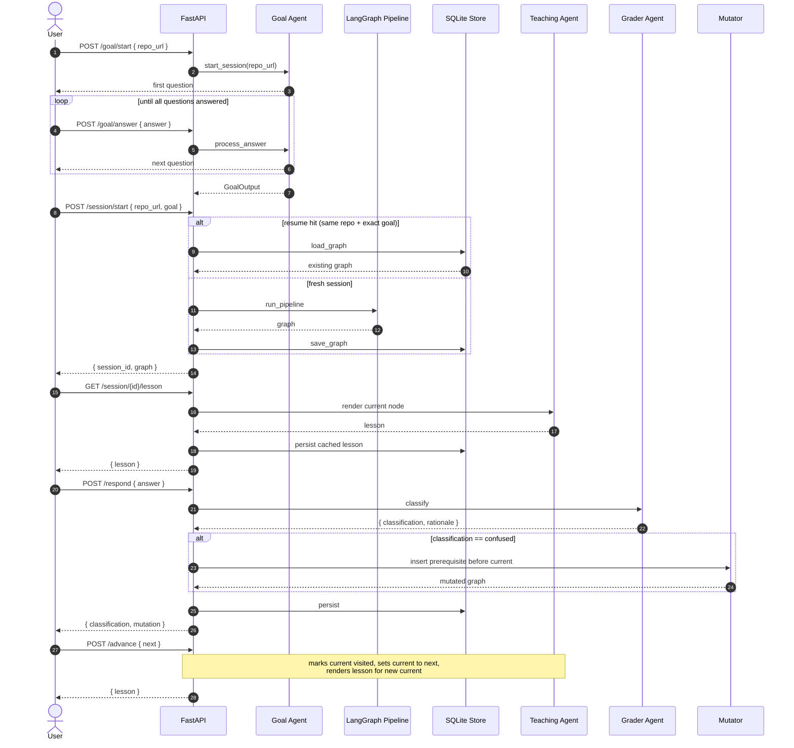

### 3.2 The two halves of the system

The flow above splits cleanly into two halves with different lifecycles:

| Half | Lifecycle | Owner | Persists? |
|---|---|---|---|
| Goal interview | Throwaway, in-memory dict keyed by `session_id` | `backend/agents/goal/agent.py` | No |
| Learning session | Durable, repo-anchored, resumable | `backend/learning/store.py` + LangGraph | Yes (SQLite) |

This split is deliberate. The goal interview is a few-minute conversation that produces a structured artifact and then doesn't need to be re-run. The learning session may be paused, returned to days later, and continued — possibly across many real-world sessions.

### 3.3 The interactive inner loop

The headline interactive flow — what happens *during* a session — is the loop between Teaching, Grader, and Mutator:

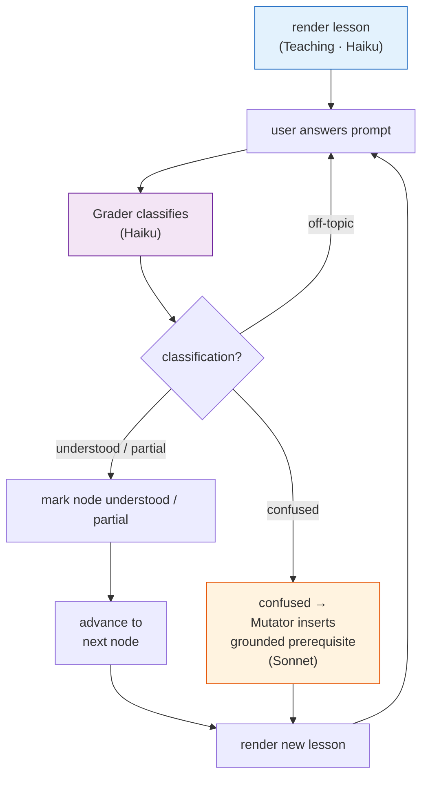

Every loop iteration is one user-facing question. The Mutator is the only step that *changes graph structure*.

---

## Part 4 — System Architecture

### 4.1 Layer view

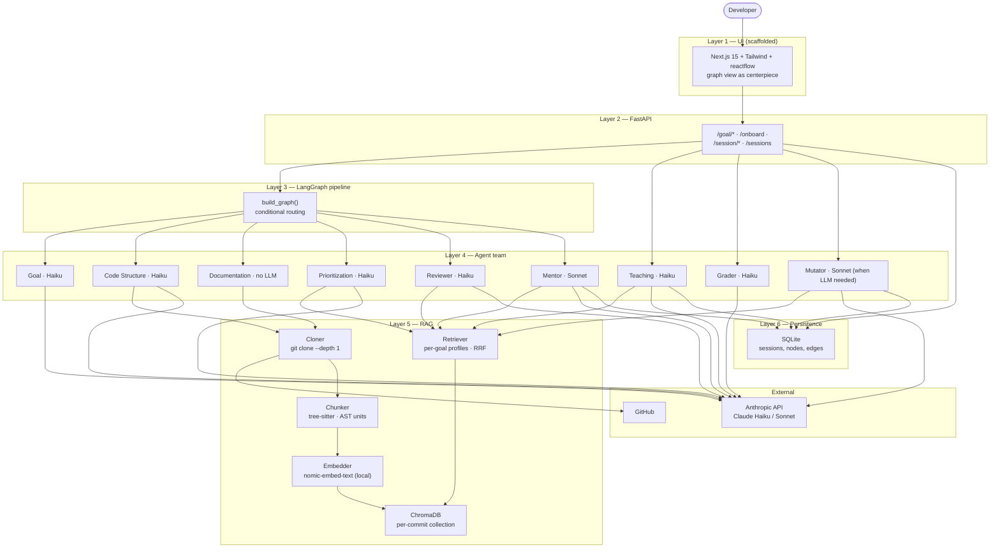

### 4.2 The pipeline as a state graph

The "initial analysis pipeline" — everything that runs once per session start, before the interactive loop — is implemented as a LangGraph stateful graph:

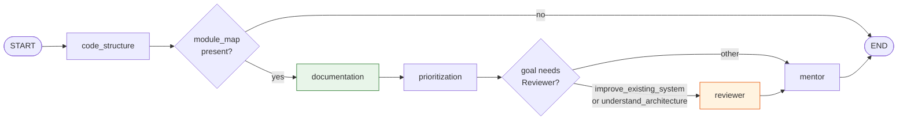

Two conditional routes:

- **After `code_structure`**: if the module map is missing (clone failure, parse failure), short-circuit to END. The Mentor has nothing to ground on; running it would only waste a Sonnet call. The Documentation node only runs when the module map is present (it needs `repo_path` too).
- **After `prioritization`**: if the goal type is `improve_existing_system` or `understand_architecture`, route through the Reviewer. Otherwise skip it. The Reviewer is gated because its findings (strengths / risks / extension points / test gaps / boundaries) are most valuable for goals that involve changing or critiquing the system; a debugging session doesn't benefit from them.

`documentation` runs unconditionally on the happy path. It has no LLM call and trivial latency, so there is no cost-driven reason to gate it.

### 4.3 Shared state

Every agent reads from and writes to a single dataclass called `OnboardState`, defined in [`backend/pipeline/state.py`](../../backend/pipeline/state.py). This is the *only* communication channel between agents — there is no global module state, no shared mutable singletons, no cross-agent imports of intermediate results.

The state carries:

| Field | Set by | Consumed by |
|---|---|---|
| `repo_url`, `goal` | Caller of `run_pipeline` | All agents |
| `repo_path`, `module_map`, `chunks_embedded` | Code Structure | Everyone downstream |
| `doc_context` | Documentation | Teaching (real docstring + README quotes in lessons) |
| `relevant_modules` | Prioritization | Retrieval (via `effective_module_map`) |
| `system_review` | Reviewer | Mentor (`_format_system_review`) |
| `graph` | Mentor | Teaching, Grader, Mutator, store |
| `learning_path` | Mentor (derived from `graph`) | `/onboard` legacy endpoint |
| `confidence` | Mentor | API response, UI |
| `current_lesson` | Teaching | API response |
| `last_grade` | Grader | API response |
| `last_mutation` | Mutator | API response |
| `errors` | All | API response (never blocks pipeline) |
| `client` | Caller | Carried through to all LLM calls |

The `errors` list uses an `operator.add` reducer so it accumulates safely across LangGraph nodes (including any future parallel ones).

### 4.4 API surface

```
Goal interview (in-memory):
  POST /goal/start        → { session_id, first_question }
  POST /goal/answer       → { next_question } | { goal }

Legacy one-shot path (Phase 1 compatibility):
  POST /onboard           → { learning_path, module_map, confidence }

Interactive session (persistent):
  POST /session/start     → run pipeline OR resume; persist graph; return graph
  GET  /sessions          → list past sessions for a repo
  GET  /session/{id}      → return the serialized graph
  GET  /session/{id}/lesson  → render lesson for the current node
  POST /session/{id}/advance → mark current visited, move forward, render
                              (accepts optional node_id to advance from an
                              explicit node — the frontend uses this when the
                              user clicks a non-current node in the graph)
  POST /session/{id}/respond → grade answer; on confused, mutate
                              (also accepts optional node_id)
  POST /session/{id}/jump    → set current_node_id to any node in the graph
                              (frontend navigation)
  POST /session/{id}/override → user-driven graph edit (mark / skip)
  GET  /session/{id}/file?path=... → return source file contents for the
                              CodeViewer panel (sandboxed to the cloned repo)
```

CORS is enabled for `http://localhost:3000` so the Next.js dev server can talk to the API in development.

---

## Part 5 — The Agents in Detail

This section describes every agent twice: what it does (implementation) and why it's designed that way (intent). The pattern is consistent across all agents:

- Each agent has a `run(state, client)` entry point.
- Each agent reads what it needs from `state`, writes its result back to `state`, and **never raises** — failures append to `state.errors` and the pipeline degrades gracefully.
- Each agent has a single Pydantic output type that constrains what the LLM is allowed to produce.

### 5.1 Goal Agent

**Implementation.** Multi-turn dialogue producing a structured goal JSON. Asks four core questions (familiarity, goal_type, primary_goal, background) plus 1–2 follow-ups whose shape depends on goal_type. One Haiku call at the end synthesizes the Q&A into a `GoalOutput`.

| Question | Asked of | Stored as |
|---|---|---|
| How familiar are you with this codebase? | Everyone | `familiarity` |
| What brings you to this repo? | Everyone | `goal_type_raw` → `goal_type` |
| What specifically do you want to be able to do? | Everyone | `primary_goal` |
| What languages / frameworks do you already know? | Everyone | `background` |
| Focus area | `understand_*` types | `focus_area` |
| Contribution context | `contribute_code` | `contribution_context` |
| Change target + risk tolerance | `improve_existing_system` | `change_target`, `risk_tolerance` |
| Error + tried so far | `debug_issue` | `error_description`, `tried_so_far` |

**Intent.** The goal is the single source of truth for everything downstream. Every retrieval profile, every per-goal-type prompt builder, every Reviewer gate, every personalization rule reads `state.goal`. Getting the interview right is therefore disproportionately valuable.

**Design choices and tradeoffs.**

- **Multi-turn dialogue, not a single form.** A form forces the user to know all the answers upfront. A dialogue lets the system ask follow-ups conditional on earlier answers — `improve_existing_system` doesn't need to ask "what's the error" the way `debug_issue` does. The cost is more HTTP round-trips; the benefit is more precise structured data.
- **LLM-synthesized `experience_level` and `depth` instead of direct questions.** `depth` (overview / moderate / deep) and `experience_level` (beginner / intermediate / senior) are inferred by the LLM from the answers, not asked directly. The honest tradeoff is some variance in the synthesized values; the alternative (more questions) makes the interview heavier.
- **Two fields could be dropped, kept anyway.** `familiarity` and `background` were collected but unused for a long time. The recent personalization work made them load-bearing rather than removing them.

### 5.2 Code Structure Agent

**Implementation.** Three jobs in sequence, all wrapped in graceful error handling:

1. **Clone** with `git clone --depth 1` to `data/repos/<owner>_<repo>`. Shallow clone keeps it fast and small.
2. **Chunk** every `.py` file via tree-sitter into AST units. Each chunk carries `(file, start_line, end_line, type, name, language, role)`. The `role` tag is one of `source` / `test` / `example` / `doc` / `tooling` — this is the *single most important* metadata for downstream retrieval profiles.
3. **Embed** every chunk via `nomic-ai/nomic-embed-text-v1.5` running locally through `sentence-transformers`. Store in ChromaDB under a collection named `{owner}_{repo}_{commit_sha[:12]}` (sanitized). If the collection already exists, **skip re-embedding entirely** — a returning user pays nothing for analysis on a known commit.
4. **Module map** via one Haiku call: a short description of each module's purpose, key exports, and dependencies. This is the high-level "table of contents" the rest of the pipeline thinks in terms of.

**Intent.** This agent owns the boundary between "raw code on disk" and "code as something the system can reason about." Three intent-level choices:

- **Chunk by real code units, never by line windows.** A function or class is a teachable unit; a window of 50 lines is not. The Mentor anchors nodes on these chunks; a chunk that crosses a function boundary would produce a meaningless anchor.
- **Role-tag every chunk.** Without `role`, retrieval can't tell a test from a source file. With `role`, the retrieval profile for `understand_architecture` filters to source-only (tests would dilute the architectural narrative), while `improve_existing_system` includes tests (the user needs to know what guards the area they will touch).
- **Local embeddings, not API embeddings.** `nomic-embed-text-v1.5` runs on-machine. No API key, no per-query cost. The model is ~550 MB and downloads once. The alternative (OpenAI ada / Cohere) would add per-query cost to every retrieval — unacceptable for a project whose budget target is $0.10 per pipeline run.
- **Per-commit cache.** Re-analyzing the same commit is free. This is the single most important cost optimization in the project.

### 5.3 Documentation Agent

**Implementation.** Pure Python, no LLM call. Runs after Code Structure (it needs `repo_path`) and before Prioritization. Reads four sources from the cloned repo:

1. **README** (`README.md` / `.rst` / `.txt` / no-extension) — first 2 000 chars.
2. **Module docstrings** for up to 120 Python files (top-level `ast.get_docstring`).
3. **Symbol docstrings** for top-level classes, top-level functions, and public methods of classes in those files. Method docs are keyed as `Class.method`.
4. **`docs/` directory excerpts** — up to 10 `.md` / `.rst` files at 1 000 chars each.

Output lands on `OnboardState.doc_context` as a four-key dict (`readme`, `file_docs`, `symbol_docs`, `extra_docs`). The Mentor copies `doc_context` onto the persisted `LearningGraph` at synthesis time so it survives session resume; the Teaching Agent's `_format_doc_context` helper pulls the per-node module docstring, in-file symbol docstrings, README excerpt, and any `docs/` file whose path matches the node's file stem.

If `repo_path` is missing or the directory doesn't exist (e.g. unit tests with fake paths), the agent writes an empty four-key dict and continues — no exception.

**Intent.** Lessons should quote *real* documentation, not LLM-paraphrased descriptions. A `flow` lesson referencing the `Session` class is more accurate and more trustworthy when it can include the maintainer-written docstring verbatim. Three intent-level choices:

- **No LLM.** Documentation is already authored prose. Putting an LLM in the middle would add cost and risk paraphrasing drift; reading the file directly is faster, free, and exactly faithful.
- **Capped sizes everywhere.** README at 2 KB, 120 files, 10 docs files, 1 KB each. Teaching's prompt has a finite budget; doc_context must fit.
- **Public surface only.** Top-level classes, top-level functions, and their public methods. Private/dunder methods are deliberately excluded — they are implementation, not API.

**Failure mode.** Graceful no-op. A repo with no docstrings produces an empty `doc_context`; Teaching falls back to source-code reasoning. The Documentation Agent never blocks the pipeline.

### 5.4 Prioritization Agent

**Implementation.** One Haiku call that takes the module map and decides which modules to keep. Output: a list of module names. The agent is goal-aware via two regimes:

- **`preserve_breadth`** for broad system tours (`understand_system`, `understand_architecture`): keep ≥ 70% of modules. The prompt instructs the LLM to drop only obviously peripheral items (CLI entry points, build tooling). A hard floor in code re-checks the result; if the LLM still under-prunes, the agent silently falls back to the full map.
- **`prune`** for focused goals: prune aggressively, keep only what's on the path to the goal.

If the agent fails for any reason — LLM down, parse failure, empty result, kept-everything result — it leaves `state.relevant_modules` as `None`. The retrieval layer treats `None` as "use the full map." This is the graceful-degradation pattern: a failed Prioritization regresses to Phase 1 behavior, not a broken pipeline.

**Intent.** Big repos like `fastapi/fastapi` have 50+ modules; most are irrelevant to most goals. Filtering before retrieval has three benefits:

1. **Token cost.** Fewer modules → smaller retrieval pool → smaller Mentor prompt → lower Sonnet bill.
2. **Sonnet focus.** The Mentor produces better paths when its module map is already on-goal.
3. **Per-goal calibration.** The two regimes encode the insight that "filter aggressively" is the wrong policy for a system tour. Without the floor and the preserve-breadth directive, Haiku would prune a broad tour down to 5 modules and call it done.

### 5.5 Reviewer Agent

**Implementation.** A single Haiku call gated on `goal_type ∈ {improve_existing_system, understand_architecture}`. Inputs: the prioritized module map and the retrieved chunks for the goal. Output, all anchor-grounded against real chunks:

| Field | Cap | What it is |
|---|---|---|
| `strengths` | 3 | Architectural strengths worth preserving |
| `risks` | 4 | Fragilities, hidden couplings, invariants to respect |
| `extension_points` | 4 | Seams designed to be extended (ABCs, hooks, registered handlers) |
| `test_gaps` | 3 | Coverage holes around the planned change area |
| `boundaries` | 3 | Major seams between subsystems |

Each finding has an `area`, a `note`, and an optional `anchor` (file + line range). Findings with anchors are first-class candidates for Mentor nodes; findings without anchors describe cross-cutting concerns.

The Reviewer's output is stored on `OnboardState.system_review` and threaded into the Mentor's user content via a `_format_system_review` helper. The Mentor doesn't *have* to use the findings, but the prompt tells it that anchored findings are the strongest candidates for nodes.

A **string-coercing Pydantic validator** on `_Boundary.between` handles a real Haiku quirk: the model occasionally emits `between: "sessions and auth"` (a string) instead of `between: ["sessions", "auth"]` (a list of two). The validator splits on `" <-> " / " and " / ", " / " / "` rather than dropping the entire review payload over one malformed boundary.

A **risk_tolerance calibration** in the system prompt instructs the Reviewer:

- **Safety-critical** (production / must not regress / safety): aim for upper bound of `risks` (4) and `test_gaps` (3); strengths may be empty.
- **Prototype / experimental**: only 1–2 critical-path risks; test_gaps optional; strengths optional.
- **Unspecified**: the default "prefer fewer, high-signal" rule.

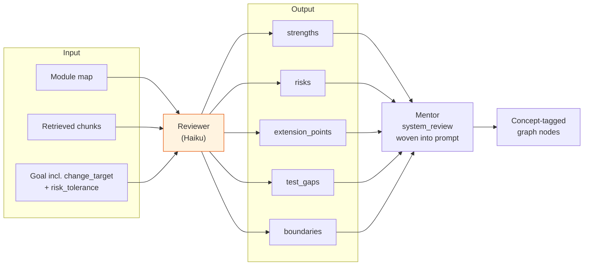

**Intent.** The Reviewer exists to give the Mentor richer raw material than module names alone. It is *not* a user-facing artifact. There is no "Reviewer report page"; the findings show up in the user's experience as **concept-tagged nodes in the graph** — a `risk` node anchored on the auth-redirect code, a `test_coverage` node anchored on the test that guards it, an `extension_point` node anchored on the ABC.

**Why a separate agent rather than asking the Mentor to do it?**

- **Different task type.** The Mentor synthesizes a curriculum. The Reviewer audits a system. Mixing them produces both worse curricula and weaker audits.
- **Different model.** Reviewer can be Haiku because the output is structured; the Mentor is Sonnet because curriculum synthesis is harder.
- **Goal-gated cost.** A debugging session does not benefit from a structured review; gating saves a Haiku call (~$0.01) on every run that doesn't need it.

### 5.6 Mentor Agent

**Implementation.** One Sonnet call. Takes the goal, the (effective) module map, the retrieved chunks, and the optional system_review. Produces a `MentorOutput` with:

- `nodes`: 5–8 (or depth-conditional: 4–5 / 5–7 / 7–10) learning nodes, each anchored on a distinct retrieved chunk.
- `edges`: exactly N-1 sequence edges forming one ordered chain. **Edge kind is restricted to `"sequence"` at the wire format level** — Pydantic rejects anything else.
- `confidence`: high / medium / low (self-rated).

Each node has a title, file, line_start, line_end, why, understand, concept_tags. Wire IDs (`"n1"`, `"n2"`) are translated to UUID node IDs as the wire output becomes a `LearningGraph`.

Two retry paths protect against LLM mistakes:

- **Distinct-anchor retry.** If two nodes anchor on the same chunk, the agent shows the model its mistake and asks again. Persistent duplicates are logged to `state.errors`.
- **Grounding retry.** If a node's anchor isn't in the retrieved chunks (the model invented one), the agent first tries an automatic prefix-stripping fix (`requests/auth.py` ↔ `auth.py`), then asks the model to regenerate using only the allowed list.

The Mentor has **six per-goal-type prompt builders**, one per goal type, each emphasizing a different shape:

| Goal type | Shape |
|---|---|
| `understand_system` | Broad system tour — touch entry points, span modules |
| `understand_component` | Deep focused dive on one area |
| `understand_architecture` | Architecture / flow / extension_point emphasis |
| `contribute_code` | Extension points first, then insertion sites |
| `improve_existing_system` | Required risk + test_coverage + extension_point; safety ordering for safety-critical |
| `debug_issue` | Trace the execution path that produces the error |

The system prompt carries the universal **concept-tag vocabulary**: `architecture`, `flow`, `extension_point`, `risk`, `test_coverage`, `component`, plus free-form domain tags.

For **personalization**, the system prompt includes a calibration block (Part 7) that tells the model how to read `depth`, `familiarity`, and `background` from the user content and adjust node count, tag mix, anchor granularity, entry point, and orientation budget.

**Intent.** This is the project's hardest reasoning task: write a coherent, grounded, goal-tailored curriculum over an unfamiliar codebase. The choices:

- **Single Sonnet call, not a loop.** Curriculum synthesis is one task. A loop would create the multi-call tax without proportional benefit. The Phase 1 budget rule ("Sonnet only at the Mentor, once") still holds; the Mutator's Sonnet call only fires on confusion, not in steady state.
- **Wire-format restriction to sequence-only edges.** This is the architectural invariant — see Part 11.4. The Pydantic `Literal["sequence"]` makes the rule enforceable, not just hortatory.
- **Distinct chunks per node.** Two nodes anchored on the same chunk would teach the same line range twice, wasting the user's time and the node budget.
- **Grounded anchors.** The Mentor is forbidden from inventing file paths or line ranges. The retry path handles the case where the model strays.
- **Per-goal-type builders, not one universal prompt.** The shape of a good path differs enormously between "give me a tour" and "I want to safely add a new auth scheme." Encoding that difference in dispatch tables keeps the system prompt clean.

### 5.7 Teaching Agent

**Implementation.** One Haiku call per node visit. Reads the node's source from disk (`{repo_path}/{file}` lines `start:end`, 1-indexed inclusive), pulls 1–2 supporting RAG chunks for cross-reference (a related caller, an import), pulls real documentation from `state.doc_context` (module docstring for the node's file, public-symbol docstrings in that file, a README excerpt, and any `docs/` file whose path matches the file stem), notes which earlier nodes are already understood, and writes:

- `walkthrough`: markdown explanation
- `prompt`: an active-learning "predict-then-reveal" question
- `expected_answer`: model answer the Grader will use
- `prompt_kind`: locked to `"predict-then-reveal"` (one form for v1)

Lessons are **cached on the node** (`node.cached_lesson`). Revisiting a node is free — no LLM call, no cost. The cache is invalidated only on explicit refresh (a future endpoint feature).

A **per-tag framing branch** in the system prompt routes the lesson shape by dominant concept tag:

| Dominant tag | Framing |
|---|---|
| `risk` | Lead with what can go wrong; name the invariant |
| `extension_point` | Lead with how this is meant to be extended; identify the contract |
| `architecture` | Lead with what this layer owns and what it doesn't; responsibility, not behavior |
| `flow` | Lead with what triggers this path and where it ends up |
| `test_coverage` | Lead with what this test guards (or doesn't) |
| `component` | Default: explain the piece in service of the goal |
| other | Default |

The Teaching prompt also includes a **personalization calibration block** (Part 7): depth controls lesson length, familiarity controls assumed terminology, background drives information elision (not analogies).

A **single retry** handles Haiku's occasional mid-string JSON truncation: if the first response fails to parse, the agent shows the model its bad output and asks again. If both attempts fail, the error is logged and the lesson is null — the API returns 500 and the smoke scripts have a fallback that re-renders via `GET /lesson`.

**Intent.** The Mentor's `lesson_brief` is a *planning artifact* — one sentence each for why/understand. The actual lesson is the *delivery artifact* — context-aware markdown shaped by the user's session state. The split lets the same brief become a high-level tour, a deep walkthrough, or a beginner-friendly recap depending on who's learning and how they got here.

**Why per-tag framing rather than per-node-type agent?**

- One agent, one prompt, one Pydantic shape is cheaper and simpler than five specialized agents.
- The tag vocabulary is the right level of granularity: the Mentor decides what kind of concept a node is; Teaching reads the tag and adjusts the lesson shape; both reuse the same vocabulary.

### 5.8 Grader Agent

**Implementation.** One Haiku call per `/respond`. Inputs: the current node's title, concept_tags, lesson takeaway, the lesson's prompt, the lesson's expected_answer, and the user's free-text response. Output: one of `understood` / `partial` / `confused` / `off-topic`, plus a one-sentence rationale.

Classification → node effect:

- `understood` → `understanding_state="understood"`
- `partial` → `understanding_state="partial"`
- `confused` → `understanding_state="not-yet"` (this is also what trips the sticky `weak_spot` flag)
- `off-topic` → **no change** (the user didn't actually answer)

If the LLM call or parse fails, the agent defaults to `partial` rather than blocking the session.

The system prompt has been carefully reframed:

- **Old framing:** "You grade a developer's answer to a comprehension question about code."
- **New framing:** "You grade a developer's answer to a system-level question about one node in their understanding graph of a codebase."

A **per-tag rubric** maps the dominant concept tag to what counts as "understood":

| Tag | What counts as understood |
|---|---|
| `architecture` | Named the layer's responsibility or boundary, not just described the code |
| `flow` | Identified order of operations + data movement, not just function calls |
| `extension_point` | Identified WHERE and HOW the system is meant to be extended |
| `risk` | Identified what can break / the invariant at stake / the unsafe assumption |
| `test_coverage` | Identified what IS or IS NOT guarded by tests |
| `component` | Implementation-level detail is legitimately part of the rubric here |
| other | Grasped the lesson's central idea at the prompt's altitude |

Critically, the prompt now says: *"A correct system-level answer is 'understood' even when it does not cite specific line numbers, function names, or low-level implementation details — UNLESS the dominant tag is `component`."*

**Intent.** See Part 9 for the full story. The short version: the old Grader was code-comprehension-shaped. The new Grader matches the product direction, which is *system-level understanding*. The same four output classes still drive the Mutator, so nothing downstream changed.

**What was deliberately not changed.**

- **Output schema.** Still understood / partial / confused / off-topic. The Mutator only branches on `confused`; `understanding_state` only has three values. Adding a fifth class would cascade into mutator logic + new node states + tests. Defer.
- **Familiarity does not enter grading.** A user "starting fresh" who nails the concept should still get UNDERSTOOD. A user "diving in" who gets it wrong should still get CONFUSED. The rubric already says "grade the understanding, not the wording" — that covers the imprecise-but-correct case without coupling grading to self-reported familiarity.
- **No critique-of-AI scope.** Evaluating critique-of-AI tasks (spot the bug in an AI-generated diff) is a deliberately deferred Phase 3 future — it's a different task type with different artifacts.

### 5.9 Mutator

**Implementation.** Dispatches on a signal:

- **`prerequisite`** — one Sonnet call. Retrieves candidate chunks via `retrieve_supporting_chunks` (excluding existing node anchors), asks Sonnet to write a more foundational node anchored on one of them, **grounds the anchor** (rejects hallucinated anchors → no insert), then splices the new node before the confused node via `LearningGraph.insert_before`. Sets the new node as current. A guard allows **at most one prerequisite per node** — repeated confusion can't stack endless prereqs.
- **`skip`** — pure Python. Marks the current node `visited` + `user_override="skip"`, advances to the next node.

The Mutator's prerequisite prompt also receives the developer's profile (`familiarity`, `background`, `experience_level`) as a **tiebreaker** in candidate selection: the LLM is instructed to first ensure the prereq unblocks the confused node, and *only among equally-valid candidates* prefer one that fits the user's background.

**Intent.** This is where "adaptive" stops being a marketing word and becomes a runtime behavior. Three design choices:

- **Hybrid rule-based / LLM-driven.** Cheap signals (`skip`) → pure Python. Signals that need new content (`prerequisite`) → Sonnet. Reserves the smart model for the only place new content has to be invented.
- **Grounded anchors only.** A hallucinated prereq node anchored on invented code would be worse than no prereq. The agent rejects ungrounded anchors and gives up on that mutation rather than splicing in a lie.
- **One prereq per node.** Without this cap, repeated confusion would burn repeated Sonnet calls and pile up prereqs that the user has to wade through. With it, the system makes one focused attempt to unblock you and then gets out of the way.

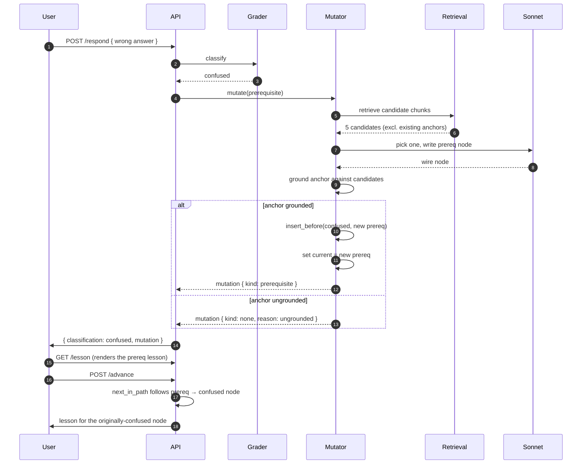

---

## Part 6 — The Learning Graph

### 6.1 Data model

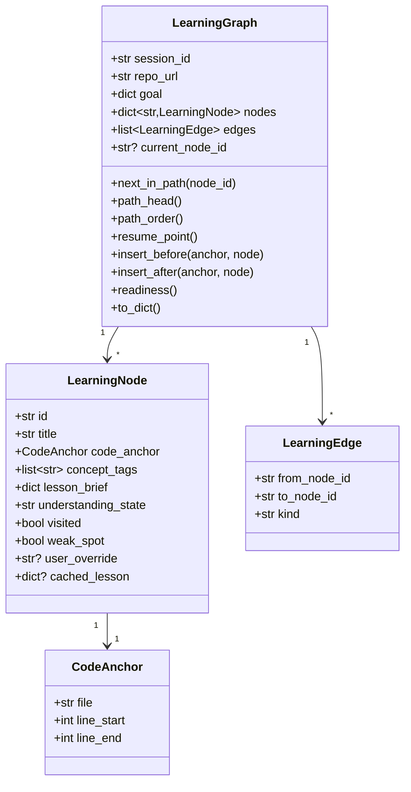

### 6.2 Edge kinds

The schema supports three edge kinds, but the producers are tightly scoped:

| Kind | Who produces it | When | Meaning |
|---|---|---|---|
| `sequence` | Mentor (initial graph) | At session start | Default linear order: "after A, you study B" |
| `prerequisite` | Mutator (only) | On `confused` Grader signal | "we adapted the path because you struggled — learn this first" |
| `deeper` | Reserved; not produced today | Future | User-driven side-trip into a sub-topic |

**`Literal["sequence"]` at the Mentor wire format level** enforces the invariant: the initial graph is a pure chain. The Mutator uses the `LearningGraph` API directly (not the wire format), so it is the only producer of `prerequisite` edges.

### 6.3 The initial graph is a chain

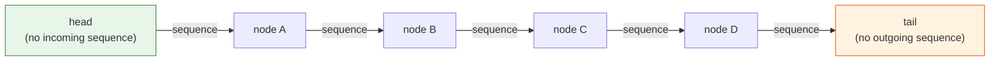

For N nodes there are exactly N-1 sequence edges. Each node appears exactly once. No branching, no cycles, no isolated nodes. This invariant is enforced by:

1. **Prompt rule** in the Mentor system prompt.
2. **Schema rule** via `EdgeWire.kind: Literal["sequence"]`.
3. **Regression test** that asserts both the prompt and the schema reject deviations.

### 6.4 The graph after a confusion-driven mutation

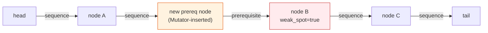

The `A --[sequence]--> B` edge has been **rerouted** to land on the new prereq P, and a `P --[prerequisite]--> B` edge connects the new node back to the originally confused node. `next_in_path` walks sequence first then prerequisite, so the user encounters P → then B as expected. The Mentor's flat-path derivation also walks sequence-only and quietly includes P because the sequence chain now passes through it.

### 6.5 Node state model

Each `LearningNode` carries six pieces of state:

| Field | Type | Set by |
|---|---|---|
| `understanding_state` | `not-yet` / `partial` / `understood` | Grader (via classification) or user override |
| `visited` | bool | `/advance`, `/lesson`, `/override` |
| `weak_spot` | bool (sticky) | Grader (`confused`) or user override (`mark_weak`) |
| `user_override` | `"mark_understood"` / `"mark_weak"` / `"skip"` / `None` | `/override` endpoint |
| `cached_lesson` | dict / None | Teaching Agent on first render |
| `concept_tags` | list[str] | Mentor or Mutator at node creation |

The `weak_spot` flag is **sticky**: once set, it stays as a record of a rough patch even after the user later masters the topic. This is intentional — it surfaces to the future graph UI as a permanent annotation, and to `resume_point` as a signal worth respecting.

### 6.6 Concept-tag vocabulary

This vocabulary appears across the Mentor, Teaching, Grader, and Reviewer agents. It is the universal language the system uses to talk about *what kind of concept* a node represents.

| Tag | Meaning |
|---|---|
| `architecture` | A layer, boundary, or responsibility worth naming |
| `flow` | A step in an execution path crossing files |
| `extension_point` | A seam designed to be extended (hooks, ABCs, plugin registries) |
| `risk` | A fragility, hidden coupling, or invariant to respect |
| `test_coverage` | What is or isn't guarded by tests |
| `component` | A specific class/function and its role |
| free-form | Domain tags like `auth`, `retries`, `serialization` |

The vocabulary is *load-bearing*. It's how Teaching picks the lesson framing, how the Grader picks the rubric, how the Mentor satisfies the `improve_existing_system` topology rule, and how the demo's side-by-side proof reads structural differences between graphs.

### 6.7 The graph is the user's understanding graph

The Mentor's curriculum graph and the user's understanding graph are the *same object*. The Mentor needs an internal model of what the user understands to do adaptive routing at all; exposing that model directly as a first-class artifact is what turns the X-factor from theoretical to felt.

**Not in v1:**

- Team-shared graphs.
- Cross-repo dependency overlays.
- Exportable progress reports.
- Multi-user identity.

These are deliberate omissions, not oversights. The single-user repo-anchored graph is the unit of value; everything else is later.

---

## Part 7 — Personalization: Making Goal Fields Drive Behavior

The Goal Agent has always collected `familiarity`, `background`, `depth`, `focus_area`, and (for `improve_existing_system`) `risk_tolerance`. For a long time these were stored, included in prompts, and otherwise mostly decorative. The recent personalization work turned them into real behavior levers.

### 7.1 The core principle

> If the system asks the user a question, the answer should meaningfully affect at least one downstream decision. Otherwise don't ask.

The user explicitly chose to *keep* the underused fields and make them load-bearing, rather than remove them. The result is a coordinated set of changes across the Mentor, Reviewer, Teaching, and Mutator — but no new agents and no schema changes.

### 7.2 Fan-out: which field affects which agent

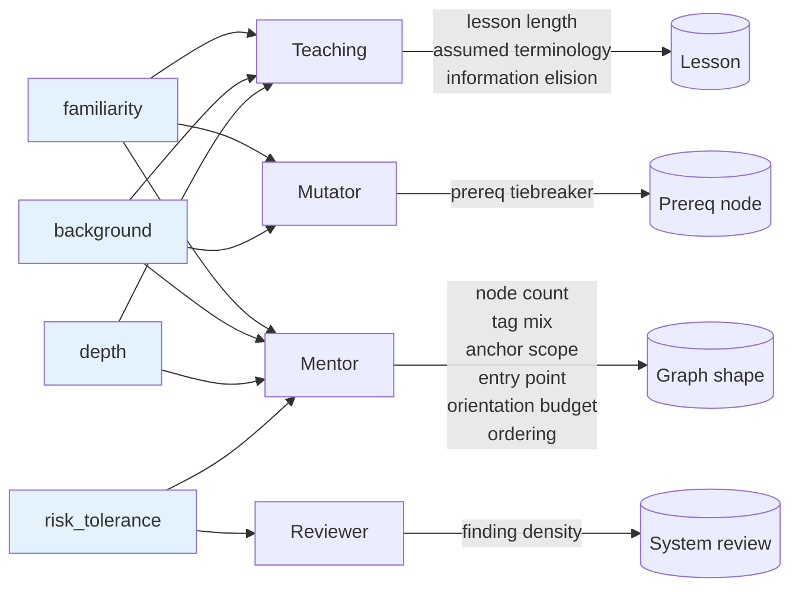

### 7.3 `familiarity` — entry point and orientation

Four categorical values map to a knowledge-altitude dimension:

| Familiarity | Mentor entry point | Orientation budget | Brief phrasing |
|---|---|---|---|
| Starting fresh | Highest-altitude `architecture` or `flow` node | 1–2 orientation nodes before any `extension_point` or `risk` | "what this is and why it exists" |
| Skimmed README | Major boundary node | 1 orientation node | Assume domain vocabulary |
| Looked at some code | Node closest to confusion or goal focus | None | "what's going on here" |
| Diving into source | Deepest goal-relevant node | None | "what's unusual here vs. the obvious" |

`familiarity` does NOT enter the Grader. Justification: a "starting fresh" user who nails the concept should still get UNDERSTOOD; a "diving in" user who gets it wrong should still get CONFUSED. The existing rubric line *"grade the understanding, not the wording"* covers the imprecise-but-correct case without coupling grading to self-report.

### 7.4 `background` — assumed-knowledge gate

`background` is free-text and therefore LLM-interpreted. Three uses:

- **Mentor**: skip nodes whose primary value would be teaching concepts the user's background suggests they already know. Spend the saved node budget on what's specific to *this* codebase.
- **Teaching**: omit explanations of concepts the user clearly knows (a Python veteran doesn't need decorators explained). The prompt rule explicitly says **information elision, not analogies** — analogies are decoration, elision changes what the user reads.
- **Mutator**: tiebreaker in prereq generation. First ensure the prereq unblocks the confused node; *among* equally-valid candidates, prefer one that aligns with background.

### 7.5 `depth` — shape, not just quantity

| Depth | Node count | Tag mix | Anchor granularity | Lesson length |
|---|---|---|---|---|
| `overview` | 4–5 | Prefer `architecture` + `flow`; omit `risk` / `test_coverage` unless goal demands | Broader (class > method) | ~200 words |
| `moderate` | 5–7 | Balanced | Narrower (method > class) | ~350 words |
| `deep` | 7–10 | Include `component`; include `risk` / `test_coverage` when review surfaces non-trivial findings | Narrowest (method, even single block) | ~500–600 words |

Depth changes the *shape* of understanding (architectural vs. implementation-level), not just the *quantity* of nodes.

### 7.6 `risk_tolerance` — safety-critical ordering

For `improve_existing_system`:

| Risk tolerance | Reviewer | Mentor `improve` builder |
|---|---|---|
| Safety-critical | Aim for upper bound of `risks` (4) and `test_gaps` (3); strengths optional | Require ≥ 2 `risk` + ≥ 1 `test_coverage`; **every `extension_point` MUST be preceded in the sequence chain by a `risk` and a `test_coverage`** |
| Prototype / experimental | Only 1–2 critical-path risks; test_gaps optional | 1 risk node only if review finding warrants; test_coverage optional |
| Unspecified | Default "prefer fewer, high-signal" | At least 1 risk + 1 test_coverage |

The safety-critical ordering rule is the key one. It is **expressed entirely as sequence ordering**, not as additional edge kinds. The graph remains a chain; the chain is just ordered so the user encounters the risk and the test before the extension point.

### 7.7 Cross-field coupling

When multiple fields push on the same Mentor decisions, the prompt resolves conflicts in this order:

1. `depth` sets the total node count.
2. `familiarity` carves orientation nodes *out of* that count (does not add).
3. `background` decides which foundational nodes to skip entirely.
4. The per-goal-type instruction (e.g. `improve_existing_system` topology) sets required tag mix and ordering.

Documenting this in the prompt is what keeps the rules from contradicting each other.

### 7.8 What was deliberately not changed

- **No retrieval profile changes.** The chunk pool stays goal-type-driven; depth doesn't multiply `top_k`. Tradeoff: depth's visible effect lives in the Mentor's node selection, not in the chunk pool.
- **No new Goal Agent questions.** The fields were collected; they just weren't used. Sharpening usage was preferred over expanding the interview.
- **No Grader change for familiarity.** Justified above.

### 7.9 Demo proof

The script `scripts/smoke_field_impact.py` (removed) runs the pipeline twice on the same repo + goal_type with two contrasting field combinations:

| | Run A | Run B |
|---|---|---|
| depth | overview | deep |
| familiarity | diving into source | starting fresh |
| background | Python, 10 years, deep CPython | Embedded C++, new to Python |
| risk_tolerance | prototype | production, safety-critical |

It then prints a side-by-side comparison (node count, sequence edges, non-sequence edges, tag distribution, safety-critical ordering metrics, entry point) plus a directional interpretation. The script is **repo-agnostic** — pass `--repo` for any GitHub URL — so the proof is not tied to one demo codebase.

A typical run on `psf/requests` produces:

| metric | Run A | Run B |
|---|---|---|
| node count | 5 | 9 |
| sequence edges | 4 | 8 |
| non-sequence edges in initial graph | 0 | 0 |
| risk nodes | 1 | 3 |
| test_coverage nodes | 0 | 1 |
| extension_points preceded in chain by a risk | 0 / 3 | 2 / 4 |

The `0 / 0` non-sequence edge counts confirm the Mentor wire-format restriction is holding. The other axes show structural — not cosmetic — differences driven by the field values.

---

## Part 8 — Adaptive Learning and the Mutation Flow

The mutation flow is the project's signature feature: the path you walk is not the path the Mentor planned, because the path adapts to you.

### 8.1 Graph lifecycle

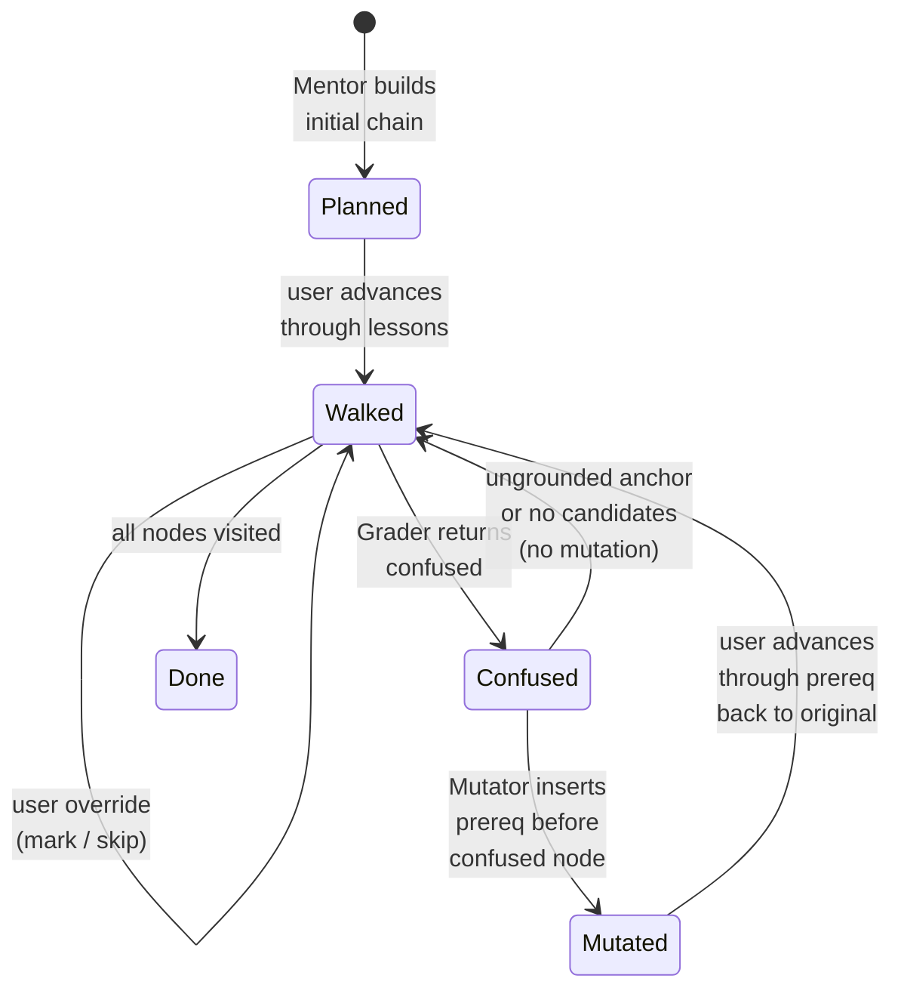

### 8.2 What triggers a structural change?

Three things can change graph structure during a session:

1. **`/respond` with `confused`** → Mutator inserts a grounded prereq.
2. **`/advance { signal: skip }`** → API now runs `mutate_graph("prerequisite", ...)` *before* the skip, so the topic the user is walking past is preserved as a foundational prereq node, then the user advances. This is a behavior change from the original "skip = no structural change" design: skipping is treated as a signal that the user wants to come back to this material later, not that it's irrelevant. The one-prereq-per-node cap in the Mutator still applies.
3. **`/override { action: skip }`** → pure-Python skip via the override endpoint. Marks visited + advances, no prereq insertion. Use this when the user genuinely wants to drop a node.

`/override { mark_understood }` and `/override { mark_weak }` change *node state*, not graph structure.

### 8.3 Why one prereq per node?

The Mutator's `_has_prerequisite` guard rejects a second prereq on a node that already has one. Reasons:

- **Cost.** Each prereq is a Sonnet call. Repeated confusion shouldn't burn repeated Sonnet calls.
- **UX.** Stacking prereqs makes the path interminable. One focused attempt is the right pacing.
- **Honesty.** If a single grounded prereq doesn't unblock the user, the second attempt probably won't either — the gap is deeper than a one-node detour can fix.

The user has alternatives if the prereq doesn't help: `/advance skip` to move past it, `/override mark_weak` to record the gap and continue.

### 8.4 Why grounded anchors only?

A hallucinated prereq anchored on invented code would be worse than no prereq at all. The Mutator's grounding check (anchor must appear in the retrieved candidate chunks, possibly after path-prefix normalization) makes "no insert" the failure mode rather than "insert a lie."

---

## Part 9 — Grader Evolution

The Grader is the agent whose role has shifted most under the product-direction sharpening. Tracking the evolution makes the design choices visible.

### 9.1 Original Grader (code comprehension)

- System prompt opened: *"You grade a developer's answer to a comprehension question about code."*
- Inputs: prompt, expected_answer, user_response.
- Output: understood / partial / confused / off-topic.
- Single generic rubric regardless of node type.

This worked because the original product framing was "teach a developer how this code works." A comprehension grader fits a comprehension product.

### 9.2 The framing problem

When the product direction sharpened to *"understand the system enough to reason about, critique, and safely change it,"* the comprehension framing became a subtle drag. The Grader was implicitly biased toward marking down answers that didn't cite code, even on `architecture` or `risk` nodes where a system-level answer is exactly what should count as understood.

### 9.3 Current Grader (system-level)

- System prompt now opens: *"You grade a developer's answer to a system-level question about one node in their understanding graph of a codebase. The node represents a concept the developer needs to grasp to reason about, critique, or safely change this system — not a piece of code they need to be able to write."*
- Inputs expanded: node title, concept_tags, lesson takeaway, prompt, expected_answer, user_response.
- Output schema unchanged.
- **Per-tag rubric** picks the criteria by the node's dominant tag.
- Explicit rule: *"A correct system-level answer is 'understood' even when it does not cite specific line numbers, function names, or low-level implementation details — UNLESS the dominant tag is `component`."*

### 9.4 What stays the same

- Four-class output (understood / partial / confused / off-topic).
- Failure path: defaults to `partial` on parse / LLM error.
- Trips `weak_spot` on `confused`.
- `off-topic` leaves understanding_state unchanged.
- Mutator integration unchanged — still branches on `confused` only.

### 9.5 What's deferred

- **Critique-of-AI-output grading.** Phase 3 future. Belongs in an AI-Assisted Development Mode where the artifact being graded is an AI-generated diff, not a free-text answer. Different task type, would need a different output schema.
- **Familiarity-conditional rubric.** Deliberately declined. See Part 7.3.

---

## Part 10 — Persistence and Resume

### 10.1 Why SQLite

Three tables, one file, no server. The whole `data/sessions.db` is a few hundred KB even after dozens of sessions. The alternative (JSON files per session) makes "list past sessions for this repo" awkward — and that query is needed by `GET /sessions` and the resume flow.

### 10.2 Schema

```
sessions:
  session_id      TEXT PRIMARY KEY
  repo_url        TEXT NOT NULL
  goal_json       TEXT NOT NULL
  current_node_id TEXT
  schema_version  INTEGER NOT NULL
  created_at      TEXT (millisecond precision)
  updated_at      TEXT (millisecond precision)

nodes:
  node_id              TEXT PRIMARY KEY
  session_id           TEXT (FK, ON DELETE CASCADE)
  title, file, line_start, line_end, ...
  concept_tags_json, lesson_brief_json
  understanding_state, visited, weak_spot, user_override
  cached_lesson_json

edges:
  session_id   TEXT (FK)
  from_node_id TEXT
  to_node_id   TEXT
  kind         TEXT
  PRIMARY KEY (session_id, from_node_id, to_node_id, kind)
```

Index on `sessions(repo_url)` makes "list sessions for this repo" fast.

### 10.3 Schema versioning

The `schema_version` column on `sessions` is the migration story: when the on-disk shape changes, `SCHEMA_VERSION` bumps. Old rows are treated as missing (`load_graph` returns `None`) rather than silently migrated. No migration logic, no migration bugs — just version-gated invisibility.

### 10.4 Save strategy

Saves happen after every meaningful user action: pipeline completion, lesson rendering, response grading, mutation, advance, override. Nodes and edges are deleted-and-rewritten wholesale per save rather than diffed. The sessions are small (under a hundred nodes) and writes happen at human cadence (one per click) — the simplicity wins decisively over the efficiency.

### 10.5 Resume flow

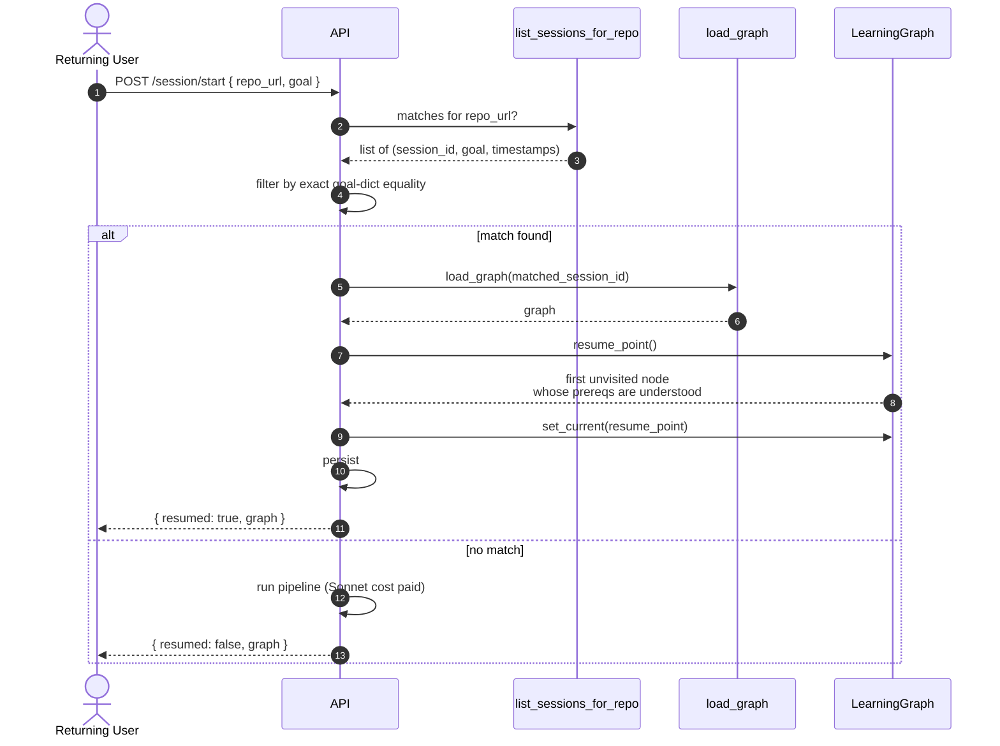

Two design choices stand out:

- **Exact goal-dict equality.** Resume matches on the full goal dict, not a fuzzy substring or vector similarity. This is deterministic and predictable; the cost is that any wording change to a free-text field (e.g. `primary_goal`) breaks resume. For the current single-user case this is acceptable.
- **`force_new: true` bypass.** The caller can explicitly opt out of resume — the side-by-side demo script uses this to guarantee fresh Mentor calls on every run.

### 10.6 `resume_point()` semantics

The function returns the first unvisited node in walk order whose prerequisites are all `understood`, falling back to `current_node_id`. This is **heuristic, not rigorous** — the project's deliberate framing. The intent is "give the returning user a sensible re-entry," not "compute a provably optimal restart point."

### 10.7 The `/sessions` listing

`GET /sessions?repo_url=...` returns lightweight session summaries (id, goal, current_node_id, timestamps), ordered by `updated_at DESC`. Future UI uses this to let a returning user pick which past session to continue.

---

## Part 11 — Key Architectural Decisions (and Reasoning)

This section captures the *why* behind the project's most consequential decisions. Many of these are decisions where the obvious alternative was rejected — those are usually the ones worth documenting.

### 11.1 A team of small agents, not one big prompt

**Decision.** Build CodeOnboard as a pipeline of specialist agents, each with one job.

**Alternative considered.** One giant Sonnet prompt that takes the goal + repo and emits a learning path.

**Why the team approach.** Each agent is independently testable, replaceable, and reasonable about cost. Errors are scoped: a Reviewer failure doesn't crash the Mentor. The model can be tuned per-agent (Haiku for analysis, Sonnet for synthesis). The system is also more honest — when something is wrong, you can point at the responsible agent rather than re-prompting a black box.

**Cost.** More moving parts, more orchestration overhead, more state to thread through.

### 11.2 Single shared state object as the only communication channel

**Decision.** `OnboardState` is the only way agents communicate. No globals, no shared singletons, no inter-agent imports.

**Why.** Predictability. Every data flow is traceable. Every test sets up a single object and reads a single object.

**Cost.** Some fields are read by many agents (`goal`) and some are read by one (`system_review`). The state class is larger than any single agent needs.

### 11.3 Cheap model by default, smart model rarely

**Decision.** Haiku for the bulk of work. Sonnet only at the Mentor (one call per session) and at the Mutator (one call per confused signal).

**Why.** The budget target is ~$0.10 per pipeline run. Sonnet costs roughly 12x Haiku; using it in a loop would blow the budget instantly. The two places Sonnet *does* get used are the only places where genuine multi-step reasoning over the codebase is required (curriculum synthesis, foundational-concept inference).

**Cost.** Some quality on Haiku tasks. The Reviewer and Teaching prompts have to compensate with structure.

### 11.4 Initial graph is a pure sequence chain — the rollback

This is the most architecturally consequential decision in the project, and the one with the most reasoning behind it. It's also a *rollback* — the system briefly allowed Mentor-emitted prerequisite edges and then deliberately removed them.

**The change that was made.** The Mentor was given permission to emit `kind="prerequisite"` edges in the initial graph from `risk` nodes to `extension_point` nodes they guarded, when `risk_tolerance` signaled safety-critical. The intent was to express "the risk is a prerequisite for touching the extension" structurally in the graph data, so a future UI could draw it as a labeled relationship.

**Why it was rolled back.** A critical review of the change identified five concrete problems:

1. **Semantic conflation.** Mutator prerequisite edges mean *"user struggled here, we adapted."* The proposed Mentor prerequisite edges meant *"design demands this safety ordering."* Two meanings under one edge kind = future confusion.
2. **Not load-bearing.** The Mentor's new prerequisite edges were *additive* to a complete sequence chain. `next_in_path` prefers sequence; the user reached the risk before the extension via sequence ordering anyway. The prerequisite edge was decorative for traversal — its only consumer was `resume_point` gating, where the sequence ordering already drove the same outcome.
3. **Premature multi-edge-kind vocabulary.** Today the project has no UI that uses edge kind labels. Introducing a second producer of prerequisite edges without a consumer is YAGNI — and worse, it forecloses the right future move (a properly named `guards` or `safety_gates` edge kind with its own semantics).
4. **Resume semantics shifted silently.** With initial prerequisite edges, `resume_point` would refuse to land on an extension node until every guarding risk was `understood` — even on a brand-new session where no confusion had happened. That's a semantic change to "what does resume mean" that wasn't reflected in docs or tests.
5. **Mutator was no longer the sole prerequisite-edge producer.** This broke a clean invariant. Two producers, divergent lifecycles, no marker on the persisted edge to tell them apart.

**What was kept after rollback.** The educational *value* of the change — that safety-critical paths should put the risk and the test before the extension — lives entirely in **sequence ordering**. The `improve_existing_system` builder still says *"every `extension_point` MUST be preceded in the sequence chain by at least one `risk` AND one `test_coverage`."* That rule produces the desired graph shape without inventing a new edge kind.

**Enforcement of the rollback.** Three layers:

1. **Schema.** `EdgeWire.kind: Literal["sequence"]` — Pydantic rejects anything else at parse time.
2. **Prompt.** The Mentor system prompt and `improve_existing_system` builder both explicitly say sequence-only and "do not invent new edge kinds."
3. **Tests.** `test_edge_wire_rejects_non_sequence_kinds`, `test_system_prompt_enforces_sequence_only_initial_graph`, `test_improve_builder_expresses_safety_via_ordering_not_edge_kinds`.

**Lesson.** The rollback is documented in detail because it's a useful case study: a working feature was removed because it created complexity for a benefit that could be delivered another way. *Don't defend code just because it works.* If a new edge kind needs to exist later for a real UI consumer, it should be designed for that consumer — not retrofitted from a feature that earned its complexity in a different decision.

### 11.5 RAG with strict grounding

**Decision.** Every Mentor node, every Mutator prereq, every Reviewer finding-with-anchor must reference code that was actually retrieved. The Mentor has explicit retry paths for distinct-anchor and grounding violations.

**Why.** The single biggest LLM failure mode in this kind of system is confident hallucination — a model that invents a "Session.handle_request method at line 142" that doesn't exist. A retrieval system that doesn't enforce grounding is just a confident wrong answer with extra steps. The grounded-anchor rule is the single most important quality lever in the project.

**Cost.** Retry roundtrips eat tokens. Occasionally the LLM is so determined to invent that it can't be talked out of it — the error is logged and the rest of the graph proceeds, but a node may be dropped.

### 11.6 Chunk by AST units, not line windows

**Decision.** tree-sitter parses each file into functions and classes; chunks are emitted at AST-unit granularity. Method-level chunks are emitted inside classes.

**Why.** A function or a class is a teachable unit. A window of 50 arbitrary lines is not. Anchoring a node on a chunk that crosses a function boundary would produce a node that teaches half a method and half its neighbor — bad pedagogy and impossible to grade against.

**Cost.** tree-sitter only supports Python at present. Adding languages is a per-language grammar lift.

### 11.7 Per-commit ChromaDB collection

**Decision.** Collection name is `{owner}_{repo}_{commit_sha[:12]}`. If a collection exists, skip re-embedding entirely.

**Why.** Re-analyzing the same repo version is the most common cost trap. Per-commit naming means a returning user pays nothing for the index they already built. New commits get a new collection automatically.

**Cost.** Disk usage grows with each unique commit indexed. Cleanup is a future concern.

### 11.8 Graceful degradation everywhere

**Decision.** Agents append errors to `state.errors` and never raise. Every agent has a documented graceful-failure path.

**Why.** The pipeline has 5+ agents in a row. If any one of them can crash, the whole thing crashes. The graceful-failure pattern means a Reviewer outage degrades to "Mentor uses raw chunks without findings," not "no graph for you." A Prioritization outage degrades to "use the full module map," not "pipeline broken."

**Cost.** Tests have to check for both happy and degraded paths. A silent degradation can mask bugs.

### 11.9 Goal interview is throwaway; learning session persists

**Decision.** Goal-dialogue sessions live in an in-memory dict, keyed by `session_id`. They are deleted when the goal completes. Learning sessions live in SQLite, indefinitely.

**Why.** The goal interview is a few-minute conversation that produces a structured artifact and then has no value. The learning session is the durable product. Mixing them in one persistence model would either over-persist throwaway data or under-persist durable data.

**Cost.** Two different `session_id` namespaces. (They never collide because they're never compared, but a careful reader notices the asymmetry.)

### 11.10 LangGraph orchestration

**Decision.** The pipeline uses LangGraph for orchestration. The interactive part of the product (Teaching / Grader / Mutator) does not — those are called directly by the API.

**Why.** LangGraph adds value where there's conditional routing and shared mutable state across nodes. The pipeline has both (the module-map short-circuit, the Reviewer gate). The interactive loop has neither — each user action is a single API call that runs one agent and persists.

**Cost.** Two orchestration models in one project. Worth it: forcing the interactive part through LangGraph would add ceremony for no benefit.

---

## Part 12 — Known Limitations and Risks

### 12.1 LLM nondeterminism

Every behavioral guarantee in this document is *directional*, not exact. A `depth=overview` graph will be smaller than a `depth=deep` graph on the same repo + goal, but the exact counts vary run-to-run. Tests that assert on prompt content are regression guards against accidentally dropping the rule; they are not behavior guarantees.

The side-by-side smoke script (`smoke_field_impact.py`) prints **directional ✓ / ⚠ / ✗ interpretations**, not exact assertions, because that's the honest read.

### 12.2 Familiarity entry-point rule partially fires

In the side-by-side runs, both contrasting profiles tended to enter the graph at an `architecture`-tagged node. The plausible cause is that the goal text *"safely extend an existing extension point"* anchors the Mentor near extension-area context regardless of familiarity. The cross-field coupling order (depth first, then familiarity) may also let depth's bias dominate. Worth watching across other repos.

### 12.3 Safety-critical ordering partially fires

On `psf/requests`, the typical safety-critical run produces 4 extension points but only 2–3 are preceded in the chain by a risk + test_coverage node. Two plausible causes:

- With 4 extension points but only 3 risks and 1 test_coverage allowed, the chain-and-count constraints are over-determined.
- The prompt rule may not be strong enough to push the Mentor into the constrained ordering.

The fix is either to raise the test_coverage cap or to sharpen the ordering rule. Deferred.

### 12.4 Pre-existing Teaching truncation flake

Haiku occasionally truncates Teaching's JSON output mid-string, especially on long lessons. The agent already has one internal retry. The demo scripts have a second-tier `GET /lesson` fallback (the lesson endpoint is idempotent — re-rendering the current node is safe). Increasing `MAX_TOKENS` from 4096 to 6144 may be worth doing, but the current recovery is acceptable.

### 12.5 Pre-existing duplicate-anchor flake

Sonnet occasionally produces two Mentor nodes anchored on the same chunk, and the distinct-anchor retry doesn't always succeed. The agent logs the error and ships the graph anyway. Worth watching, especially in the depth=deep regime where the Mentor has more nodes to fill.

### 12.6 Single-range anchors

`LearningNode.code_anchor` is one contiguous `(file, line_start, line_end)` range. Real-world teaching often needs more — imports, callers, parent classes, cross-file flows. The current workaround is Teaching's supporting-chunk retrieval (1–2 extra chunks pulled at render time). A richer anchor schema (primary + supporting anchors, or sub-graphs) is future work.

### 12.7 Frontend is scaffolded, not finished

A Next.js 15 / React 19 / Tailwind / `reactflow` frontend lives under `frontend/` and wires the repo-URL page, the goal dialogue, the `LearningGraph` view, the `LessonPanel`, and the `CodeViewer` to the live API. CORS is configured for `http://localhost:3000`. What's missing is polish (graph layout for branching post-mutation graphs, edge-kind rendering, concept-tag color theming), accessibility, and visual design work. The engine is no longer headless, but the felt product still has rough edges.

### 12.8 Single-user, no auth

The persistence layer keys sessions on `(repo_url, exact_goal)` with no `user_id`. This is acceptable today (local, single user) and explicitly deferred to whenever a multi-user use case arrives.

### 12.9 Goal Agent fields can break resume

Resume matches on exact goal-dict equality. A user who edits any free-text answer between two `POST /session/start` calls will not match the prior session. There's no UI prompt to disambiguate ("do you want to resume the prior session or start fresh?") — `force_new: true` is the explicit opt-out.

### 12.10 Documentation Agent quality is limited by simple AST extraction

The Documentation Agent now exists (Part 5.3) and feeds Teaching with real README + docstring quotes. Its limitations are honest: it captures only top-level classes/functions and one level of public methods inside a class — nested helpers and decorated objects with non-trivial AST shapes can be missed. The 2 KB README cap and 1 KB docs-file cap can also truncate mid-paragraph on prose-heavy repos. Richer extraction (sphinx cross-references, mkdocs structure, type-stub doc strings) is future work.

---

## Part 13 — Future Roadmap

The full phase plan lives in [`docs/planning/phases/roadmap.md`](../../docs/planning/phases/roadmap.md). This is a compressed view emphasizing what's next.

### 13.1 Near-term (builds directly on what exists)

- **Frontend polish.** The Next.js scaffold (graph view, lesson panel, code viewer) is live but rough. Open: concept-tag-driven node coloring, edge-kind rendering (sequence vs. Mutator-inserted prerequisite), a layout that gracefully handles post-mutation branches, and click-to-jump navigation backed by `/jump` and `/file`.
- **Direct depth question in the Goal Agent.** Today `depth` is LLM-synthesized; for predictability it could be asked directly.
- **Field-specific demo isolation.** Run the side-by-side with one variable changing at a time (depth alone, familiarity alone, background alone) on multiple repos.
- **Sharpen the safety-critical ordering rule** until 4/4 extension points are preceded by both a risk and a test_coverage in chain.
- **Richer Documentation extraction.** Capture nested helpers, sphinx cross-references, type stubs — see Part 12.10.

### 13.2 Adaptive moves beyond confusion + skip

| Signal | What it does | Why deferred |
|---|---|---|
| `deeper` | Optional side-trip into a sub-topic | Needs a "return pointer" — extra session state |
| `simpler` | Re-explain the current lesson more gently | It's a Teaching re-render, not a structural mutation |
| `reorder` | Reshape as the system learns user pace | Speculative — current adaptation works without it |
| manual `I'm lost` button | Trigger confusion without grading | Deferred with the UI |

### 13.3 AI-Assisted Development Mode (Phase 3 future)

The strategic positioning (Part 1.5) operationalizes here:

1. System surfaces a real task or hotspot from the user's understanding graph.
2. AI proposes a change.
3. User must explain what changed, identify risks, suggest tests.
4. Grader validates real understanding vs. passive acceptance of AI output.

This expands the Grader's scope toward critique-of-AI tasks — explicitly future work, requiring a different task taxonomy and probably a different output schema.

### 13.4 Richer foundations

- **Richer code anchors.** Primary range + supporting references (callers, imports, cross-file flows). See Part 12.6.
- **Multi-user identity.** Add `user_id` to the persistence layer when a real multi-user case arrives.
- **Repo URL normalization.** So slightly different forms of the same URL match for resume.
- **More languages.** Add tree-sitter grammars one at a time.

### 13.5 Phase 4 — Multimedia (later)

- TTS narration of lessons (ElevenLabs).
- Code walkthrough video (Puppeteer + ffmpeg). Highest technical risk.

### 13.6 Phase 5 — VS Code extension (stretch)

A sidebar that shows the current learning step, highlights the referenced file + line range, supports inline Q&A. Most impressive demo, most work. Phases 1–3 should be fully solid before starting.

### 13.7 Out of scope (deliberate)

- Team-shared graphs.
- Cross-repo dependency overlays.
- Exportable progress reports.
- Login / cloud sync.

These are not "we'll get to them"; they are intentional non-goals for the v1 product.

---

## Appendix A — Tech Stack at a Glance

| Layer | Choice | Why |
|---|---|---|
| Language | Python 3.12 | Standard for the LLM/agent ecosystem |
| Package manager | `uv` | Fast resolver, good lockfile |
| Backend | FastAPI | Async, typed, great for LLM endpoints |
| Orchestrator | LangGraph (pipeline) + direct calls (interactive) | LangGraph for conditional routing; direct calls where it's just one agent |
| LLM | Anthropic Claude | Haiku for loops, Sonnet for synthesis |
| Embeddings | `nomic-ai/nomic-embed-text-v1.5` via `sentence-transformers` | Local, no API cost |
| Vector store | ChromaDB | Local, free, no infra |
| Code parser | tree-sitter | AST-based, language-aware |
| Persistence | SQLite | Standard library, file-based, zero-config |
| Frontend | Next.js 15 + React 19 + Tailwind + reactflow | Graph view, lesson panel, code viewer; talks to API over CORS |
| Testing | pytest, FastAPI `TestClient` | Real LLM calls in smoke scripts, mocked LLMs in unit tests |
| **Test count** | **281 passing** | |
| **Cost target** | **~$0.10 / pipeline run** | Haiku-for-loops + Sonnet-once budget |

---

## Appendix B — Glossary

Plain-language definitions of the vocabulary this document uses.

- **Agent.** A small, self-contained piece of software with one job that usually does that job by calling the LLM with a carefully written prompt. CodeOnboard is a team of cooperating agents.
- **Anchor.** A `(file, line_start, line_end)` triple identifying a specific piece of code in the repo. Every learning node has one; the rule that anchors must come from retrieved chunks is the system's main hallucination guard.
- **Chunk.** A meaningful piece of code — one function or one class — produced by the tree-sitter chunker. Each chunk carries metadata: file, line range, type, name, language, role.
- **Concept tag.** A short string on a learning node indicating *what kind* of concept it teaches. Vocabulary: architecture / flow / extension_point / risk / test_coverage / component / free-form domain tags.
- **`doc_context`.** The four-key dict (`readme`, `file_docs`, `symbol_docs`, `extra_docs`) the Documentation Agent writes onto state. Teaching consumes it for grounded quotes; it is also stored on the persisted `LearningGraph` so it survives resume.
- **Documentation Agent.** Pure-Python agent that extracts the README, module/class/function docstrings, and `docs/` directory excerpts from the cloned repo. No LLM call. Output lands on `state.doc_context`.
- **Edge.** A connection between two nodes. Kinds: `sequence` (default linear order), `prerequisite` (Mutator-inserted), `deeper` (reserved).
- **Goal.** The structured output of the Goal Agent's interview. The single source of truth that steers every downstream agent.
- **Goal type.** One of six values: understand_system / understand_component / understand_architecture / contribute_code / improve_existing_system / debug_issue.
- **Grounding.** Verifying that an LLM-produced anchor refers to a chunk that was actually retrieved. The Mentor and Mutator both enforce grounding; the Reviewer drops ungrounded anchors but keeps the note.
- **Haiku / Sonnet.** Two Claude model tiers. Haiku is cheap and fast (used for loops); Sonnet is smarter and pricier (used for the two synthesis tasks).
- **Learning graph.** The full graph for one session — nodes + edges + per-node state + current pointer. Also the user's understanding graph.
- **Lesson brief.** A node's `{why, understand}` — the Mentor's planning artifact. Distinct from the actual lesson.
- **Lesson.** Teaching's output for a node: walkthrough, active-learning prompt, expected answer.
- **Module map.** The Code Structure Agent's high-level table of contents for the repo — `{module: {purpose, key_files, exports, dependencies}}`.
- **Node.** One learning step — a concept, an anchor in code, current state. The atomic unit of the graph.
- **`OnboardState`.** The shared dataclass every agent reads from and writes to. The only communication channel between agents.
- **Predict-then-reveal.** The single active-learning prompt form used in v1. Asks the user to predict something about the code before reading the full explanation.
- **Reviewer.** The new agent (gated to `improve_existing_system` + `understand_architecture`) that produces a structured system review fed into the Mentor.
- **RAG (Retrieval-Augmented Generation).** The pattern of retrieving real source material and feeding it into the LLM's prompt so the answer is grounded.
- **Retrieval profile.** A goal-type-specific configuration controlling retrieval strategy, chunk roles, chunk budget, decomposition, and prioritization mode.
- **RRF (Reciprocal Rank Fusion).** A method for merging ranked results from different searches fairly — used in focused retrieval to balance multiple sub-queries.
- **Session.** One learning journey for one (repo, goal). Stored in SQLite, resumable.
- **System review.** The Reviewer's structured output — strengths / risks / extension_points / test_gaps / boundaries.
- **Weak spot.** Sticky flag on a node, set when the Grader returns `confused`. Survives later `understood` updates as a permanent record of a rough patch.
